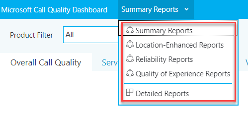
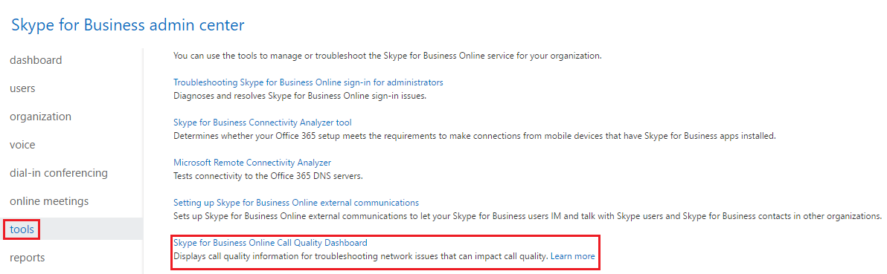
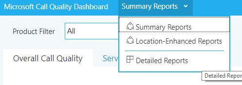
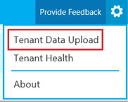
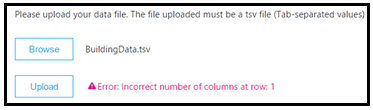
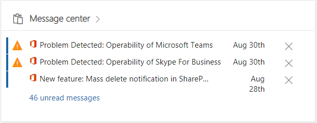
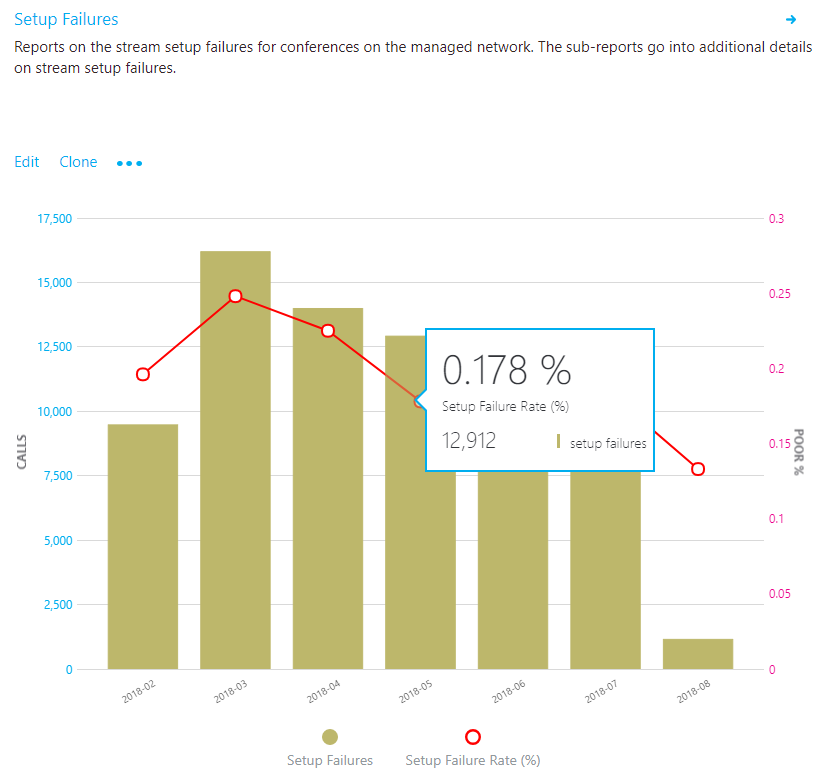
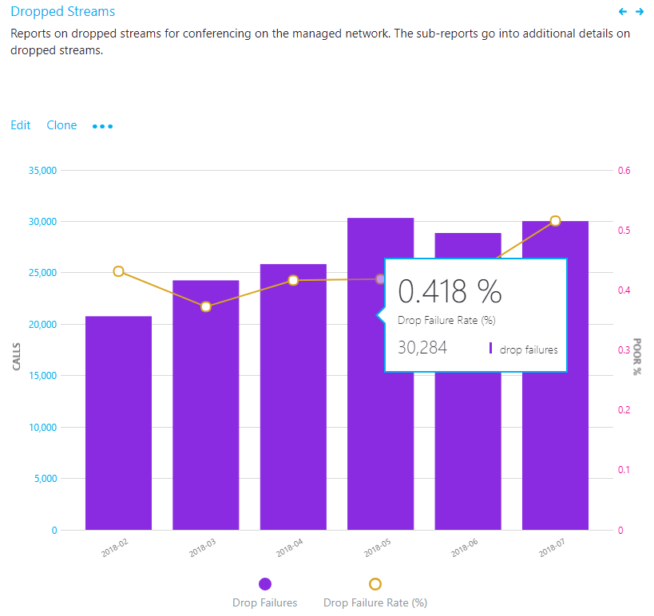
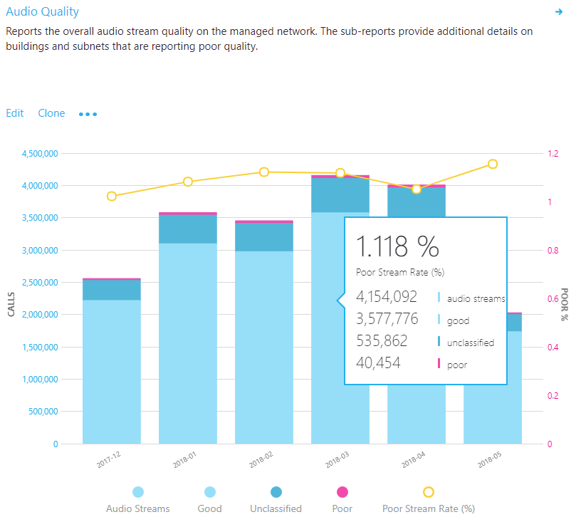
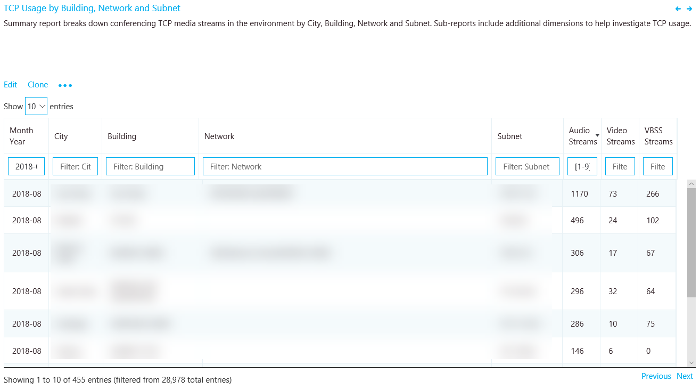

# <a name="quality-of-experience-review-guide"></a><span data-ttu-id="17e6e-103">Guida alla revisione della qualità dell'esperienza</span><span class="sxs-lookup"><span data-stu-id="17e6e-103">Quality of Experience Review Guide</span></span>

<!-- Note that this link to the Word doc is intentionally NOT the aka.ms/qerquide link -->
<span data-ttu-id="17e6e-104">Questa guida riguarda la fase di valori di unità per Microsoft teams e Skype for business online.</span><span class="sxs-lookup"><span data-stu-id="17e6e-104">This guide is about the Drive Value phase for Microsoft Teams and Skype for Business Online.</span></span> <span data-ttu-id="17e6e-105">È possibile [scaricare una versione di Word](https://github.com/MicrosoftDocs/OfficeDocs-SkypeForBusiness/blob/live/Teams/downloads/quality-of-experience-review-guide.docx?raw=true) di questa guida.</span><span class="sxs-lookup"><span data-stu-id="17e6e-105">You can [download a Word version](https://github.com/MicrosoftDocs/OfficeDocs-SkypeForBusiness/blob/live/Teams/downloads/quality-of-experience-review-guide.docx?raw=true) of this guide.</span></span>

## <a name="introduction"></a><span data-ttu-id="17e6e-106">Introduzione</span><span class="sxs-lookup"><span data-stu-id="17e6e-106">Introduction</span></span>

<span data-ttu-id="17e6e-107">Per avere il massimo impatto sul miglioramento dell'esperienza utente, le organizzazioni devono operazionalizzare le aree principali visualizzate nella figura seguente.</span><span class="sxs-lookup"><span data-stu-id="17e6e-107">To have the greatest impact on improving the user experience, organizations need to operationalize the key areas that are shown in the following figure.</span></span> <span data-ttu-id="17e6e-108">Altre aree includono l'identificazione di attività operative, la definizione di obiettivi per le metriche di qualità, la determinazione delle metriche da usare per valutare il successo dell'organizzazione e la restrizione delle aree di indagine in base alle esigenze.</span><span class="sxs-lookup"><span data-stu-id="17e6e-108">Additional areas include identifying operational tasks, establishing targets for quality metrics, ascertaining the metrics to use to gauge organizational success, and narrowing areas of investigation as needed.</span></span>


<span data-ttu-id="17e6e-109">![Aree principali per la qualità dell'esperienza utente] (media/qerguide-image-keyareas.png "Le aree principali per la qualità dell'esperienza utente includono audio, affidabilità, sondaggi utente, dispositivi e client.")</span><span class="sxs-lookup"><span data-stu-id="17e6e-109"></span></span>

<span data-ttu-id="17e6e-110">_Figura 1-aree operative chiave descritte in questa guida_</span><span class="sxs-lookup"><span data-stu-id="17e6e-110">_Figure 1 - Key operational areas covered throughout this guide_</span></span>

<span data-ttu-id="17e6e-111">Valutando e rimediando continuamente le aree descritte in questa guida, è possibile ridurre le proprie potenzialità per influire negativamente sulla qualità dell'esperienza degli utenti.</span><span class="sxs-lookup"><span data-stu-id="17e6e-111">By continually assessing and remediating the areas described in this guide, you can reduce their potential to negatively affect the quality of your users’ experience.</span></span> <span data-ttu-id="17e6e-112">La maggior parte dei problemi di esperienza utente incontrati in una distribuzione può essere raggruppata nelle categorie seguenti:</span><span class="sxs-lookup"><span data-stu-id="17e6e-112">Most user-experience problems encountered in a deployment can be grouped into the following categories:</span></span>

-   <span data-ttu-id="17e6e-113">Firewall o configurazione proxy incompleta</span><span class="sxs-lookup"><span data-stu-id="17e6e-113">Incomplete firewall or proxy configuration</span></span>
-   <span data-ttu-id="17e6e-114">Scarsa copertura Wi-Fi</span><span class="sxs-lookup"><span data-stu-id="17e6e-114">Poor Wi-Fi coverage</span></span>
-   <span data-ttu-id="17e6e-115">Larghezza di banda insufficiente</span><span class="sxs-lookup"><span data-stu-id="17e6e-115">Insufficient bandwidth</span></span>
-   <span data-ttu-id="17e6e-116">VPN</span><span class="sxs-lookup"><span data-stu-id="17e6e-116">VPN</span></span>
-   <span data-ttu-id="17e6e-117">Versioni e driver client non coerenti o obsoleti</span><span class="sxs-lookup"><span data-stu-id="17e6e-117">Inconsistent or outdated client versions and drivers</span></span>
-   <span data-ttu-id="17e6e-118">Dispositivi audio non ottimizzati o incorporati</span><span class="sxs-lookup"><span data-stu-id="17e6e-118">Unoptimized or built-in audio devices</span></span>
-   <span data-ttu-id="17e6e-119">Subnet problematiche o dispositivi di rete</span><span class="sxs-lookup"><span data-stu-id="17e6e-119">Problematic subnets or network devices</span></span>

<span data-ttu-id="17e6e-120">Attraverso una pianificazione e una progettazione adeguate prima di distribuire Team o Skype for business online, è possibile ridurre la quantità di risorse necessarie per mantenere le esperienze di alta qualità.</span><span class="sxs-lookup"><span data-stu-id="17e6e-120">Through proper planning and design before deploying Teams or Skype for Business Online, you can reduce the amount of effort that will be required to maintain high-quality experiences.</span></span>

<span data-ttu-id="17e6e-121">Questa guida è incentrata sull'uso di Call Quality Dashboard (Call Quality Dashboard) online come strumento principale per segnalare e analizzare ogni area, con un'enfasi particolare sull'audio per massimizzare l'adozione e l'impatto.</span><span class="sxs-lookup"><span data-stu-id="17e6e-121">This guide focuses on using the Call Quality Dashboard (CQD) Online as the primary tool to report and investigate each area, with a special emphasis on audio to maximize adoption and impact.</span></span> <span data-ttu-id="17e6e-122">Gli eventuali miglioramenti apportati alla rete per migliorare l'esperienza audio verranno tradotti direttamente anche nei miglioramenti della condivisione di video e desktop.</span><span class="sxs-lookup"><span data-stu-id="17e6e-122">Any improvements made to the network to improve the audio experience will also directly translate to improvements in video and desktop sharing.</span></span>

<span data-ttu-id="17e6e-123">Per accelerare la valutazione, vengono forniti [due modelli di Call Quality dashboard curati](https://aka.ms/qertemplates) : uno è per la gestione di tutte le reti e l'altro è filtrato solo per le reti gestite (interne).</span><span class="sxs-lookup"><span data-stu-id="17e6e-123">To accelerate your assessment, [two curated CQD templates](https://aka.ms/qertemplates) are provided: one is for managing all networks and the other is filtered for managed (internal) networks only.</span></span> <span data-ttu-id="17e6e-124">Anche se i report tutti i modelli di reti sono configurati per visualizzare informazioni su edifici e reti, è comunque possibile usarli mentre si lavora per raccogliere e caricare informazioni sulla creazione.</span><span class="sxs-lookup"><span data-stu-id="17e6e-124">Although the All Networks template reports are configured to display building and network information, they can still be used while you work toward collecting and uploading building information.</span></span> <span data-ttu-id="17e6e-125">Il caricamento di informazioni sulla creazione in Call Quality dashboard consente al servizio di migliorare la creazione di report aggiungendo informazioni personalizzate per la creazione, la rete e la posizione mentre si differenziano internamente dalle subnet esterne.</span><span class="sxs-lookup"><span data-stu-id="17e6e-125">Uploading building information into CQD enables the service to enhance reporting by adding custom building, network, and location information while differentiating internal from external subnets.</span></span> <span data-ttu-id="17e6e-126">Per altre informazioni, vedere [creazione](#building-mapping) di un mapping più avanti in questa guida.</span><span class="sxs-lookup"><span data-stu-id="17e6e-126">For more information, see [Building mapping](#building-mapping) later in this guide.</span></span>

### <a name="intended-audience"></a><span data-ttu-id="17e6e-127">Destinatari previsti</span><span class="sxs-lookup"><span data-stu-id="17e6e-127">Intended audience</span></span>

<span data-ttu-id="17e6e-128">Questa guida è destinata a essere usata dalle parti interessate partner e clienti con ruoli come lead di collaborazione/architetto, consulente, specialista per la gestione/adozione dei cambiamenti, il supporto tecnico lead, il lead di rete, il lead desktop e l'amministratore IT.</span><span class="sxs-lookup"><span data-stu-id="17e6e-128">This guide is intended to be used by partner and customer stakeholders with roles such as Collaboration Lead/Architect, Consultant, Change Management/Adoption Specialist, Support/Help Desk Lead, Network Lead, Desktop Lead, and IT Admin.</span></span>

<span data-ttu-id="17e6e-129">Questa guida è destinata anche all'uso da parte dei campioni di qualità designati.</span><span class="sxs-lookup"><span data-stu-id="17e6e-129">This guide is also intended to be used by the designated quality champion(s).</span></span> <span data-ttu-id="17e6e-130">Per altre informazioni, Vedi [il ruolo campione di qualità](4-envision-plan-my-service-management.md#the-quality-champion-role).</span><span class="sxs-lookup"><span data-stu-id="17e6e-130">For more information, see [the Quality Champion role](4-envision-plan-my-service-management.md#the-quality-champion-role).</span></span>

## <a name="prerequisites"></a><span data-ttu-id="17e6e-131">Prerequisiti</span><span class="sxs-lookup"><span data-stu-id="17e6e-131">Prerequisites</span></span>

<span data-ttu-id="17e6e-132">Prima di usare questa guida, verificare che siano assegnati i [ruoli](https://docs.microsoft.com/office365/admin/add-users/about-admin-roles) del tenant appropriati in modo da poter accedere a Call Quality dashboard.</span><span class="sxs-lookup"><span data-stu-id="17e6e-132">Before using this guide, make sure you have the proper tenant [roles](https://docs.microsoft.com/office365/admin/add-users/about-admin-roles) assigned so that you can access CQD.</span></span>

-   <span data-ttu-id="17e6e-133">**Ruolo di amministratore globale di Office 365**</span><span class="sxs-lookup"><span data-stu-id="17e6e-133">**Office 365 Global Administrator role**</span></span> 

-   <span data-ttu-id="17e6e-134">**Ruolo di amministratore di Skype for business**</span><span class="sxs-lookup"><span data-stu-id="17e6e-134">**Skype for Business Administrator role**</span></span> 

-   <span data-ttu-id="17e6e-135">**Ruolo amministratore servizio Teams**</span><span class="sxs-lookup"><span data-stu-id="17e6e-135">**Teams Service Administrator role**</span></span> 

-   <span data-ttu-id="17e6e-136">**Ruolo supporto tecnico comunicazioni Teams**</span><span class="sxs-lookup"><span data-stu-id="17e6e-136">**Teams Communications Support Engineer role**</span></span> 

-   <span data-ttu-id="17e6e-137">**Ruolo di specialista in supporto comunicazioni Teams**</span><span class="sxs-lookup"><span data-stu-id="17e6e-137">**Teams Communications Support Specialist role**</span></span> 

<span data-ttu-id="17e6e-138">In alternativa, è possibile assegnare il ruolo seguente a un account utente di Office 365 per consentire l'accesso solo alle funzionalità di creazione di report.</span><span class="sxs-lookup"><span data-stu-id="17e6e-138">Alternatively, you can assign the following role to an Office 365 user account to allow access to reporting features only.</span></span>

-   <span data-ttu-id="17e6e-139">**Lettore report:** Può visualizzare tutti i [report attività](https://support.office.com/article/activity-reports-0d6dfb17-8582-4172-a9a9-aed798150263) nell'interfaccia di amministrazione, i report di [Microsoft 365 adoption Content Pack](https://support.office.com/article/Office-365-Adoption-content-pack-77ff780d-ab19-4553-adea-09cb65ad0f1f)e i report di Call Quality dashboard.</span><span class="sxs-lookup"><span data-stu-id="17e6e-139">**Reports Reader:** Can view all the [activity reports](https://support.office.com/article/activity-reports-0d6dfb17-8582-4172-a9a9-aed798150263) In the admin center, any reports from the [Microsoft 365 Adoption content pack](https://support.office.com/article/Office-365-Adoption-content-pack-77ff780d-ab19-4553-adea-09cb65ad0f1f), and CQD reports.</span></span>

## <a name="what-is-quality"></a><span data-ttu-id="17e6e-140">Che cos'è la qualità?</span><span class="sxs-lookup"><span data-stu-id="17e6e-140">What is quality?</span></span>

<span data-ttu-id="17e6e-141">Quando si discute di qualità in teams e Skype for business, è importante definire il termine per ottenere una comprensione comune.</span><span class="sxs-lookup"><span data-stu-id="17e6e-141">When discussing quality in Teams and Skype for Business, it’s important to define the term to achieve a common understanding.</span></span> <span data-ttu-id="17e6e-142">La qualità, come definita qui, è una combinazione di metriche dei servizi e esperienza utente.</span><span class="sxs-lookup"><span data-stu-id="17e6e-142">Quality, as defined here, is a combination of service metrics and user experience.</span></span>

<!-- Note: need to update graphic-->
<span data-ttu-id="17e6e-143">![Illustrazione delle metriche dei servizi e dell'esperienza utente] Le (media/qerguide-image-whatisquality.png "metriche dei servizi sono costituite da scarso rapporto flusso, affidabilità, endpoint/dispositivi e versioni client. L'esperienza utente è costituita dalla percezione dell'utente della qualità del servizio.")</span><span class="sxs-lookup"><span data-stu-id="17e6e-143"></span></span>

<span data-ttu-id="17e6e-144">_Figura 2-che cos'è la qualità?_</span><span class="sxs-lookup"><span data-stu-id="17e6e-144">_Figure 2 - What is quality?_</span></span>

### <a name="service-metrics"></a><span data-ttu-id="17e6e-145">Metriche del servizio</span><span class="sxs-lookup"><span data-stu-id="17e6e-145">Service metrics</span></span>

<span data-ttu-id="17e6e-146">Le metriche dei servizi sono costituite da specifiche metriche basate sul client.</span><span class="sxs-lookup"><span data-stu-id="17e6e-146">Service metrics consist of specific client-based metrics.</span></span> <span data-ttu-id="17e6e-147">Durante ogni chiamata, il client raccoglie informazioni di telemetria sulla chiamata e invia un report alla fine di ogni chiamata a cui è possibile accedere in seguito tramite Call Quality dashboard o [Call Analytics](https://techcommunity.microsoft.com/t5/Skype-for-Business-Blog/Introducing-Call-Analytics/ba-p/57309).</span><span class="sxs-lookup"><span data-stu-id="17e6e-147">During each call, the client collects telemetry information about the call and submits a report at the end of each call that can be later accessed through CQD or [Call Analytics](https://techcommunity.microsoft.com/t5/Skype-for-Business-Blog/Introducing-Call-Analytics/ba-p/57309).</span></span> <span data-ttu-id="17e6e-148">Queste metriche includono:</span><span class="sxs-lookup"><span data-stu-id="17e6e-148">These metrics include:</span></span>

-   <span data-ttu-id="17e6e-149">Tasso di flusso scadente</span><span class="sxs-lookup"><span data-stu-id="17e6e-149">Poor Stream Rate</span></span>
-   <span data-ttu-id="17e6e-150">Tasso di errore di configurazione</span><span class="sxs-lookup"><span data-stu-id="17e6e-150">Setup Failure Rate</span></span>
-   <span data-ttu-id="17e6e-151">Calo tasso di errore</span><span class="sxs-lookup"><span data-stu-id="17e6e-151">Drop Failure Rate</span></span>


#### <a name="poor-stream-rate"></a><span data-ttu-id="17e6e-152">Tasso di flusso scadente</span><span class="sxs-lookup"><span data-stu-id="17e6e-152">Poor Stream Rate</span></span>

<span data-ttu-id="17e6e-153">La bassa velocità di flusso (PSR) rappresenta la percentuale complessiva dell'organizzazione di flussi con qualità scadente.</span><span class="sxs-lookup"><span data-stu-id="17e6e-153">The poor stream rate (PSR) represents the organization’s overall percentage of streams that have poor quality.</span></span> <span data-ttu-id="17e6e-154">Questa metrica è destinata ad evidenziare le aree in cui l'organizzazione può concentrare lo sforzo per avere l'impatto più forte sulla riduzione di questo valore e sul miglioramento dell'esperienza utente, motivo per cui le [reti gestite](#managed-vs-unmanaged-networks) costituiscono lo stato di primaria importanza quando si esaminano i PSR.</span><span class="sxs-lookup"><span data-stu-id="17e6e-154">This metric is meant to highlight areas where your organization can concentrate effort to have the strongest impact toward reducing this value and improving the user experience, which is why [managed networks](#managed-vs-unmanaged-networks) are the primary focus when looking at PSR.</span></span> <span data-ttu-id="17e6e-155">Anche gli utenti esterni sono importanti, ma le indagini variano in base a un'organizzazione.</span><span class="sxs-lookup"><span data-stu-id="17e6e-155">External users are important too, but investigation differs on an organizational basis.</span></span> <span data-ttu-id="17e6e-156">Valutare la possibilità di fornire le procedure consigliate per gli utenti esterni ed esaminare le chiamate esterne indipendentemente dall'organizzazione complessiva.</span><span class="sxs-lookup"><span data-stu-id="17e6e-156">Consider providing best practices for external users, and investigate external calls independently from the overall organization.</span></span>

<span data-ttu-id="17e6e-157">La misurazione effettiva in Call Quality dashboard varia in base al carico di lavoro, ma ai fini della revisione dell'esperienza di qualità concentriamoci principalmente sulla misurazione della _percentuale di scarsità audio_ .</span><span class="sxs-lookup"><span data-stu-id="17e6e-157">The actual measurement in CQD varies by workload, but for the purposes of the Quality Experience Review we focus primarily on the _Audio Poor Percentage_ measurement.</span></span> <span data-ttu-id="17e6e-158">PSR è costituito dalle cinque medie metriche della rete descritte nella tabella seguente.</span><span class="sxs-lookup"><span data-stu-id="17e6e-158">PSR is made up of the five network metric averages described in the following table.</span></span> <span data-ttu-id="17e6e-159">Affinché un flusso venga classificato come scadente, solo una metrica deve superare la soglia definita.</span><span class="sxs-lookup"><span data-stu-id="17e6e-159">For a stream to be classified as poor, only one metric needs to exceed the defined threshold.</span></span> <span data-ttu-id="17e6e-160">Per altre informazioni sul processo di classificazione del flusso, vedere [questo articolo](stream-classification-in-call-quality-dashboard.md).</span><span class="sxs-lookup"><span data-stu-id="17e6e-160">For more information about the stream classification process, see [this article](stream-classification-in-call-quality-dashboard.md).</span></span>

> [!Note]
> <span data-ttu-id="17e6e-161">Call Quality dashboard fornisce il "povero a causa di..."</span><span class="sxs-lookup"><span data-stu-id="17e6e-161">CQD provides the “Poor Due To…”</span></span> <span data-ttu-id="17e6e-162">misure per comprendere meglio quale condizione ha causato la classificazione del flusso come scadente.</span><span class="sxs-lookup"><span data-stu-id="17e6e-162">measurements to better understand what condition caused the stream to be classified as poor.</span></span>


<span data-ttu-id="17e6e-163">_Tabella 1-metriche audio di qualità scadente_</span><span class="sxs-lookup"><span data-stu-id="17e6e-163">_Table 1 - Audio poor quality metrics_</span></span>

| <span data-ttu-id="17e6e-164">Media metrica</span><span class="sxs-lookup"><span data-stu-id="17e6e-164">Metric average</span></span>     | <span data-ttu-id="17e6e-165">Descrizione</span><span class="sxs-lookup"><span data-stu-id="17e6e-165">Description</span></span>     | <span data-ttu-id="17e6e-166">Esperienza utente</span><span class="sxs-lookup"><span data-stu-id="17e6e-166">User experience</span></span> |
|-------------|-----------------|-----------------|
| <span data-ttu-id="17e6e-167">Jitter \>30 ms</span><span class="sxs-lookup"><span data-stu-id="17e6e-167">Jitter \>30 ms</span></span>        | <span data-ttu-id="17e6e-168">Questa è la variazione media di ritardo tra i pacchetti successivi.</span><span class="sxs-lookup"><span data-stu-id="17e6e-168">This is the average change in delay between successive packets.</span></span> <span data-ttu-id="17e6e-169">I team e Skype for business possono adattarsi ad alcuni livelli di jitter attraverso il buffering.</span><span class="sxs-lookup"><span data-stu-id="17e6e-169">Teams and Skype for Business can adapt to some levels of jitter through buffering.</span></span> <span data-ttu-id="17e6e-170">Solo quando il jitter supera il buffering che un partecipante Nota gli effetti di jitter.</span><span class="sxs-lookup"><span data-stu-id="17e6e-170">It’s only when the jitter exceeds the buffering that a participant notices the effects of jitter.</span></span>      | <span data-ttu-id="17e6e-171">I pacchetti che arrivano a velocità diverse causano la voce di un altoparlante a un suono robotico.</span><span class="sxs-lookup"><span data-stu-id="17e6e-171">The packets arriving at different speeds cause a speaker’s voice to sound robotic.</span></span>   |
| <span data-ttu-id="17e6e-172">Tasso \>di perdita di pacchetti 10% o 0,1</span><span class="sxs-lookup"><span data-stu-id="17e6e-172">Packet loss rate \>10% or 0.1</span></span>        | <span data-ttu-id="17e6e-173">Questa operazione viene spesso definita come percentuale di pacchetti persi.</span><span class="sxs-lookup"><span data-stu-id="17e6e-173">This is often defined as a percentage of packets that are lost.</span></span> <span data-ttu-id="17e6e-174">La perdita di pacchetti influenza direttamente la qualità audio, da piccoli pacchetti persi singoli che non hanno quasi alcun impatto sulle perdite di burst di back-to-back che causano il ritaglio completo dell'audio.</span><span class="sxs-lookup"><span data-stu-id="17e6e-174">Packet loss directly affects audio quality—from small, individual lost packets that have almost no impact to back-to-back burst losses that cause audio to cut out completely.</span></span>     | <span data-ttu-id="17e6e-175">I pacchetti che vengono eliminati e che non arrivano alla destinazione desiderata causano lacune nel supporto, con sillabe perse e parole e video e condivisione dispersivi.</span><span class="sxs-lookup"><span data-stu-id="17e6e-175">The packets being dropped and not arriving at their intended destination cause gaps in the media, resulting in missed syllables and words, and choppy video and sharing.</span></span> |
| <span data-ttu-id="17e6e-176">Ora \>di andata e ritorno 500 ms</span><span class="sxs-lookup"><span data-stu-id="17e6e-176">Round-trip time \>500 ms</span></span>        | <span data-ttu-id="17e6e-177">Questo è il tempo necessario per ottenere un pacchetto IP dal punto a al punto B e viceversa al punto a. Questo ritardo di propagazione della rete è legato alla distanza fisica tra i due punti e alla velocità della luce e include un sovraccarico aggiuntivo adottato dai vari dispositivi nel percorso di rete.</span><span class="sxs-lookup"><span data-stu-id="17e6e-177">This is the time it takes to get an IP packet from point A to point B and back to point A. This network propagation delay is tied to the physical distance between the two points and the speed of light, and includes additional overhead taken by the various devices in the network path.</span></span>      | <span data-ttu-id="17e6e-178">I pacchetti che impiegano troppo tempo per arrivare a destinazione causano un effetto walkie-talkie.</span><span class="sxs-lookup"><span data-stu-id="17e6e-178">The packets taking too long to arrive at their destination cause a walkie-talkie effect.</span></span>   |
| <span data-ttu-id="17e6e-179">NMOS degradazione \>media 1,0</span><span class="sxs-lookup"><span data-stu-id="17e6e-179">NMOS degradation average \>1.0</span></span>         | <span data-ttu-id="17e6e-180">Media del Punteggio medio di [valutazione (NMOS)](https://docs.microsoft.com/previous-versions/office/communications-server/bb894481(v=office.12)#network-mos) per il flusso.</span><span class="sxs-lookup"><span data-stu-id="17e6e-180">Average [Network Mean Opinion Score (NMOS)](https://docs.microsoft.com/previous-versions/office/communications-server/bb894481(v=office.12)#network-mos) degradation for the stream.</span></span> <span data-ttu-id="17e6e-181">Rappresenta la quantità di perdite di rete e jitter che ha influenzato la qualità dell'audio ricevuto che ha causato l'eliminazione di NMOS da più di un punto.</span><span class="sxs-lookup"><span data-stu-id="17e6e-181">Represents how much the network loss and jitter has affected the quality of received audio that caused the NMOS to drop by more than one point.</span></span> | <span data-ttu-id="17e6e-182">Si tratta di una combinazione di jitter, perdita di pacchetti e, in misura minore, maggiore tempo di andata e ritorno.</span><span class="sxs-lookup"><span data-stu-id="17e6e-182">This is a combination of jitter, packet loss, and—to a lesser degree—increased round-trip time.</span></span> <span data-ttu-id="17e6e-183">L'utente potrebbe provare una combinazione di questi sintomi.</span><span class="sxs-lookup"><span data-stu-id="17e6e-183">The user might be experiencing a combination of these symptoms.</span></span>   |
| <span data-ttu-id="17e6e-184">Rapporto medio tra campioni \>nascosti 7% o 0,07</span><span class="sxs-lookup"><span data-stu-id="17e6e-184">Average ratio of concealed samples \>7% or 0.07</span></span> | <span data-ttu-id="17e6e-185">Rapporto medio del numero di fotogrammi audio con campioni nascosti generati dalla perdita di pacchetti per la guarigione del numero totale di fotogrammi audio.</span><span class="sxs-lookup"><span data-stu-id="17e6e-185">Average ratio of the number of audio frames with concealed samples generated by packet loss healing to the total number of audio frames.</span></span> <span data-ttu-id="17e6e-186">Un esempio di audio nascosto è una tecnica usata per attenuare la transizione brusca che in genere viene causata da pacchetti di rete eliminati.</span><span class="sxs-lookup"><span data-stu-id="17e6e-186">A concealed audio sample is a technique used to smooth out the abrupt transition that would usually be caused by dropped network packets.</span></span>      | <span data-ttu-id="17e6e-187">I valori alti indicano che i livelli significativi di occultamento delle perdite sono stati applicati e hanno provocato l'audio distorto o perso.</span><span class="sxs-lookup"><span data-stu-id="17e6e-187">High values indicate that significant levels of loss concealment were applied and resulted in distorted or lost audio.</span></span>     |

#### <a name="setup-failure-rate"></a><span data-ttu-id="17e6e-188">Tasso di errore di configurazione</span><span class="sxs-lookup"><span data-stu-id="17e6e-188">Setup Failure Rate</span></span>

<span data-ttu-id="17e6e-189">La frequenza di errore di configurazione, altrimenti nota come misura della _percentuale di errore di configurazione della chiamata totale_ in Call Quality dashboard, è il numero di flussi in cui non è stato possibile stabilire il percorso del supporto tra gli endpoint all'inizio della chiamata.</span><span class="sxs-lookup"><span data-stu-id="17e6e-189">The setup failure rate, otherwise known as the _Total Call Setup Failure Percentage_ measurement in CQD, is the number of streams where the media path couldn’t be established between the endpoints at the start of the call.</span></span>

<span data-ttu-id="17e6e-190">Rappresenta qualsiasi flusso multimediale che non è stato possibile stabilire.</span><span class="sxs-lookup"><span data-stu-id="17e6e-190">This represents any media stream that couldn’t be established.</span></span> <span data-ttu-id="17e6e-191">In base alla gravità dell'impatto sull'esperienza utente misurata qui, l'obiettivo è quello di ridurre il valore al più vicino possibile allo zero.</span><span class="sxs-lookup"><span data-stu-id="17e6e-191">Given the severity of the impact on the user experience measured here, the goal is to reduce this value to as close to zero as possible.</span></span> <span data-ttu-id="17e6e-192">Un valore elevato per questa metrica è più comune nelle nuove distribuzioni con regole del firewall incomplete rispetto a una distribuzione matura, ma è comunque importante controllarle regolarmente.</span><span class="sxs-lookup"><span data-stu-id="17e6e-192">A high value for this metric is more common in new deployments with incomplete firewall rules than a mature deployment, but it’s still important to watch on a regular basis.</span></span>

<span data-ttu-id="17e6e-193">Questa metrica viene calcolata prendendo il numero totale di flussi che non sono stati configurati in base al numero totale di flussi che hanno inviato un record di dettaglio delle chiamate (CDR) riuscito:</span><span class="sxs-lookup"><span data-stu-id="17e6e-193">This metric is calculated by taking the total number of streams that failed to set up divided by the total number of streams that submitted a successful call detail record (CDR):</span></span>

-   <span data-ttu-id="17e6e-194">**Tasso di errore di configurazione** = Total call setup non riuscito numero di flusso/totale CDR disponibile Conteggio flusso</span><span class="sxs-lookup"><span data-stu-id="17e6e-194">**Setup Failure Rate** = Total Call Setup Failed Stream Count / Total CDR Available Stream Count</span></span>

#### <a name="drop-failure-rate"></a><span data-ttu-id="17e6e-195">Calo tasso di errore</span><span class="sxs-lookup"><span data-stu-id="17e6e-195">Drop Failure Rate</span></span>

<span data-ttu-id="17e6e-196">La percentuale di errore di rientro, altrimenti nota come misura della _percentuale di errore di chiamata totale_ rilasciata in Call Quality dashboard, è quella dei flussi definiti correttamente in cui il percorso del supporto non è stato interrotto normalmente.</span><span class="sxs-lookup"><span data-stu-id="17e6e-196">The drop failure rate, otherwise known as the _Total Call Dropped Failure Percentage_ measurement in CQD, is the percentage of successfully established streams where the media path didn’t terminate normally.</span></span>

<span data-ttu-id="17e6e-197">Rappresenta qualsiasi flusso multimediale terminato in modo imprevisto.</span><span class="sxs-lookup"><span data-stu-id="17e6e-197">This represents any media stream that terminated unexpectedly.</span></span> <span data-ttu-id="17e6e-198">Anche se l'impatto di questa operazione non è così grave come un flusso che non è stato configurato, influirà negativamente sull'esperienza utente.</span><span class="sxs-lookup"><span data-stu-id="17e6e-198">Although the impact of this isn’t as severe as a stream that failed to set up, it will negatively affect the user experience.</span></span> <span data-ttu-id="17e6e-199">Le cadute di media improvvise e frequenti non solo possono avere un impatto grave sull'esperienza utente, ma determinano la necessità di riconnettersi agli utenti, con conseguente perdita di produttività.</span><span class="sxs-lookup"><span data-stu-id="17e6e-199">Sudden and frequent media drops not only can have a severe impact on the user experience, they result in the need for users to reconnect, resulting in a loss in productivity.</span></span>

<span data-ttu-id="17e6e-200">La metrica viene calcolata prendendo il numero totale di flussi eliminati diviso per il conteggio totale dei flussi configurati correttamente:</span><span class="sxs-lookup"><span data-stu-id="17e6e-200">The metric is calculated by taking the total number of dropped streams divided by the total count of streams that set up successfully:</span></span>

-   <span data-ttu-id="17e6e-201">**Drop failure rate** = Total Call Dropped count flusso/Total call setup numero di flusso riuscito</span><span class="sxs-lookup"><span data-stu-id="17e6e-201">**Drop Failure Rate** = Total Call Dropped Stream Count / Total Call Setup Succeeded Stream Count</span></span>

### <a name="define-your-target-metrics"></a><span data-ttu-id="17e6e-202">Definire le metriche di destinazione</span><span class="sxs-lookup"><span data-stu-id="17e6e-202">Define your target metrics</span></span>

<span data-ttu-id="17e6e-203">In questa sezione vengono illustrate alcune delle metriche dei servizi principali che vengono usate per valutare l'integrità dei servizi.</span><span class="sxs-lookup"><span data-stu-id="17e6e-203">This section discusses some of the core service metrics that we use to assess how services experience health.</span></span> <span data-ttu-id="17e6e-204">Valutando e guidando continuamente gli sforzi per mantenere queste metriche al di sotto dei loro obiettivi definiti, ti aiuterai ad assicurarti che gli utenti verifichino una qualità di chiamata affidabile e coerente.</span><span class="sxs-lookup"><span data-stu-id="17e6e-204">By continually assessing and driving efforts to keep these metrics below their defined targets, you’ll help ensure that your users experience consistent, reliable call quality.</span></span> <span data-ttu-id="17e6e-205">Per iniziare, vengono fornite le destinazioni seguenti.</span><span class="sxs-lookup"><span data-stu-id="17e6e-205">To get you started, the following targets are provided.</span></span>

<span data-ttu-id="17e6e-206">_Tabella 2-metriche di valutazione dell'integrità di destinazione principali_</span><span class="sxs-lookup"><span data-stu-id="17e6e-206">_Table 2 - Core target health assessment metrics_</span></span>
<table>
<tr>
<th rowspan="2" colspan="2" valign="center"><span data-ttu-id="17e6e-207">Tipo di rete</span><span class="sxs-lookup"><span data-stu-id="17e6e-207">Network type</span></span></th><th rowspan="1"><span data-ttu-id="17e6e-208">Obiettivi di qualità</span><span class="sxs-lookup"><span data-stu-id="17e6e-208">Quality targets</span></span></th><th colspan="2"><span data-ttu-id="17e6e-209">Obiettivi di affidabilità</span><span class="sxs-lookup"><span data-stu-id="17e6e-209">Reliability targets</span></span></th></tr>
<tr><th><span data-ttu-id="17e6e-210">Tasso di flusso audio scadente</span><span class="sxs-lookup"><span data-stu-id="17e6e-210">Audio Poor Stream Rate</span></span></th><th><span data-ttu-id="17e6e-211">Tasso di errore di configurazione</span><span class="sxs-lookup"><span data-stu-id="17e6e-211">Setup Failure Rate</span></span></th><th><span data-ttu-id="17e6e-212">Calo tasso di errore</span><span class="sxs-lookup"><span data-stu-id="17e6e-212">Drop Failure Rate</span></span></th></tr>
<tr><td rowspan="2"><span data-ttu-id="17e6e-213"><strong>All</strong></span><span class="sxs-lookup"><span data-stu-id="17e6e-213"><strong>All</strong></span></span></td><td><span data-ttu-id="17e6e-214">Interno</span><span class="sxs-lookup"><span data-stu-id="17e6e-214">Internal</span></span></td><td><span data-ttu-id="17e6e-215">2,0%</span><span class="sxs-lookup"><span data-stu-id="17e6e-215">2.0%</span></span></td><td><span data-ttu-id="17e6e-216">0,5%</span><span class="sxs-lookup"><span data-stu-id="17e6e-216">0.5%</span></span></td><td><span data-ttu-id="17e6e-217">2,0%</span><span class="sxs-lookup"><span data-stu-id="17e6e-217">2.0%</span></span></td></tr>
<tr><td><span data-ttu-id="17e6e-218">Generale</span><span class="sxs-lookup"><span data-stu-id="17e6e-218">Overall</span></span></td><td><span data-ttu-id="17e6e-219">3,0%</span><span class="sxs-lookup"><span data-stu-id="17e6e-219">3.0%</span></span></td><td><span data-ttu-id="17e6e-220">1,0%</span><span class="sxs-lookup"><span data-stu-id="17e6e-220">1.0%</span></span></td><td><span data-ttu-id="17e6e-221">3,0%</span><span class="sxs-lookup"><span data-stu-id="17e6e-221">3.0%</span></span></td></tr>
<tr><td rowspan="5"><span data-ttu-id="17e6e-222"><strong>Conferenze</strong></span><span class="sxs-lookup"><span data-stu-id="17e6e-222"><strong>Conferencing</strong></span></span></td><td><span data-ttu-id="17e6e-223">Interno</span><span class="sxs-lookup"><span data-stu-id="17e6e-223">Internal</span></span></td><td><span data-ttu-id="17e6e-224">2,0%</span><span class="sxs-lookup"><span data-stu-id="17e6e-224">2.0%</span></span></td><td><span data-ttu-id="17e6e-225">0,5%</span><span class="sxs-lookup"><span data-stu-id="17e6e-225">0.5%</span></span></td><td><span data-ttu-id="17e6e-226">2,0%</span><span class="sxs-lookup"><span data-stu-id="17e6e-226">2.0%</span></span></td></tr>
<tr><td><span data-ttu-id="17e6e-227">Interno cablato</span><span class="sxs-lookup"><span data-stu-id="17e6e-227">Wired internal</span></span></td><td><span data-ttu-id="17e6e-228">1,0%</span><span class="sxs-lookup"><span data-stu-id="17e6e-228">1.0%</span></span></td><td><span data-ttu-id="17e6e-229">0,5%</span><span class="sxs-lookup"><span data-stu-id="17e6e-229">0.5%</span></span></td><td><span data-ttu-id="17e6e-230">1,0%</span><span class="sxs-lookup"><span data-stu-id="17e6e-230">1.0%</span></span></td></tr>
<tr><td><span data-ttu-id="17e6e-231">Wi-Fi 5 GHz interno</span><span class="sxs-lookup"><span data-stu-id="17e6e-231">Wi-Fi 5 GHz internal</span></span></td><td><span data-ttu-id="17e6e-232">1,0%</span><span class="sxs-lookup"><span data-stu-id="17e6e-232">1.0%</span></span></td><td><span data-ttu-id="17e6e-233">0,5%</span><span class="sxs-lookup"><span data-stu-id="17e6e-233">0.5%</span></span></td><td><span data-ttu-id="17e6e-234">1,0%</span><span class="sxs-lookup"><span data-stu-id="17e6e-234">1.0%</span></span></td></tr>
<tr><td><span data-ttu-id="17e6e-235">Wi-Fi 2,4 GHz interno</span><span class="sxs-lookup"><span data-stu-id="17e6e-235">Wi-Fi 2.4 GHz internal</span></span></td><td><span data-ttu-id="17e6e-236">2,0%</span><span class="sxs-lookup"><span data-stu-id="17e6e-236">2.0%</span></span></td><td><span data-ttu-id="17e6e-237">0,5%</span><span class="sxs-lookup"><span data-stu-id="17e6e-237">0.5%</span></span></td><td><span data-ttu-id="17e6e-238">2,0%</span><span class="sxs-lookup"><span data-stu-id="17e6e-238">2.0%</span></span></td></tr>
<tr><td><span data-ttu-id="17e6e-239">Generale</span><span class="sxs-lookup"><span data-stu-id="17e6e-239">Overall</span></span></td><td><span data-ttu-id="17e6e-240">2,0%</span><span class="sxs-lookup"><span data-stu-id="17e6e-240">2.0%</span></span></td><td><span data-ttu-id="17e6e-241">0,5%</span><span class="sxs-lookup"><span data-stu-id="17e6e-241">0.5%</span></span></td><td><span data-ttu-id="17e6e-242">3,0%</span><span class="sxs-lookup"><span data-stu-id="17e6e-242">3.0%</span></span></td></tr>
<tr><td rowspan="4"><span data-ttu-id="17e6e-243"><strong>P2P</strong></span><span class="sxs-lookup"><span data-stu-id="17e6e-243"><strong>P2P</strong></span></span></td><td><span data-ttu-id="17e6e-244">Interno</span><span class="sxs-lookup"><span data-stu-id="17e6e-244">Internal</span></span></td><td><span data-ttu-id="17e6e-245">2,0%</span><span class="sxs-lookup"><span data-stu-id="17e6e-245">2.0%</span></span></td><td><span data-ttu-id="17e6e-246">0,5%</span><span class="sxs-lookup"><span data-stu-id="17e6e-246">0.5%</span></span></td><td><span data-ttu-id="17e6e-247">2,0%</span><span class="sxs-lookup"><span data-stu-id="17e6e-247">2.0%</span></span></td></tr>
<tr><td><span data-ttu-id="17e6e-248">Cablato/Wi-Fi 5 GHz interno</span><span class="sxs-lookup"><span data-stu-id="17e6e-248">Wired/Wi-Fi 5 GHz internal</span></span></td><td><span data-ttu-id="17e6e-249">1,0%</span><span class="sxs-lookup"><span data-stu-id="17e6e-249">1.0%</span></span></td><td><span data-ttu-id="17e6e-250">0,5%</span><span class="sxs-lookup"><span data-stu-id="17e6e-250">0.5%</span></span></td><td><span data-ttu-id="17e6e-251">1,0%</span><span class="sxs-lookup"><span data-stu-id="17e6e-251">1.0%</span></span></td></tr>
<tr><td><span data-ttu-id="17e6e-252">Cablato/Wi-Fi 5 GHz globale</span><span class="sxs-lookup"><span data-stu-id="17e6e-252">Wired/Wi-Fi 5 GHz overall</span></span></td><td><span data-ttu-id="17e6e-253">2,0%</span><span class="sxs-lookup"><span data-stu-id="17e6e-253">2.0%</span></span></td><td><span data-ttu-id="17e6e-254">1,0%</span><span class="sxs-lookup"><span data-stu-id="17e6e-254">1.0%</span></span></td><td><span data-ttu-id="17e6e-255">1,0%</span><span class="sxs-lookup"><span data-stu-id="17e6e-255">1.0%</span></span></td></tr>
<tr><td><span data-ttu-id="17e6e-256">Generale</span><span class="sxs-lookup"><span data-stu-id="17e6e-256">Overall</span></span></td><td><span data-ttu-id="17e6e-257">2,0%</span><span class="sxs-lookup"><span data-stu-id="17e6e-257">2.0%</span></span></td><td><span data-ttu-id="17e6e-258">1,0%</span><span class="sxs-lookup"><span data-stu-id="17e6e-258">1.0%</span></span></td><td><span data-ttu-id="17e6e-259">3,0%</span><span class="sxs-lookup"><span data-stu-id="17e6e-259">3.0%</span></span></td></tr>
</table>


<span data-ttu-id="17e6e-260">È importante discutere e definire gli obiettivi dell'organizzazione per soddisfare gli obiettivi aziendali.</span><span class="sxs-lookup"><span data-stu-id="17e6e-260">It's important to discuss and define your organization’s targets to meet your business objectives.</span></span>

### <a name="user-experience"></a><span data-ttu-id="17e6e-261">Esperienza utente</span><span class="sxs-lookup"><span data-stu-id="17e6e-261">User experience</span></span>

<span data-ttu-id="17e6e-262">L'analisi dell'esperienza utente è più l'arte che la scienza, perché le metriche riunite qui non sempre significano che c'è un problema con la rete o il servizio, ma piuttosto, indicano semplicemente che l'utente percepisce un problema.</span><span class="sxs-lookup"><span data-stu-id="17e6e-262">Analyzing the user experience is more art than science, because the metrics gathered here don’t always mean that there’s a problem with the network or service but rather, they simply indicate that the user perceives a problem.</span></span> <span data-ttu-id="17e6e-263">Microsoft offre un meccanismo di rilevamento incorporato, noto come tasso di chiamata (RMC), che consente di valutare l'esperienza complessiva degli utenti.</span><span class="sxs-lookup"><span data-stu-id="17e6e-263">Microsoft offers a built-in survey mechanism—known as Rate My Call (RMC)—to help gauge overall user experience.</span></span> <span data-ttu-id="17e6e-264">RMC ti aiuterà a rispondere alle seguenti domande dal punto di vista degli utenti:</span><span class="sxs-lookup"><span data-stu-id="17e6e-264">RMC will help you answer the following questions from your users’ perspective:</span></span>

-   <span data-ttu-id="17e6e-265">Si sa come usare la soluzione?</span><span class="sxs-lookup"><span data-stu-id="17e6e-265">Do I know how to use the solution?</span></span>
-   <span data-ttu-id="17e6e-266">La soluzione è facile da usare e intuitiva e supporta le esigenze di comunicazione quotidiane?</span><span class="sxs-lookup"><span data-stu-id="17e6e-266">Is the solution easy to use and intuitive, and does it support my day-to-day communication needs?</span></span>
-   <span data-ttu-id="17e6e-267">La soluzione aiuta a ottenere il lavoro?</span><span class="sxs-lookup"><span data-stu-id="17e6e-267">Does the solution help me get my job done?</span></span>
-   <span data-ttu-id="17e6e-268">Qual è la percezione complessiva della soluzione?</span><span class="sxs-lookup"><span data-stu-id="17e6e-268">What’s my overall perception of the solution?</span></span>
-   <span data-ttu-id="17e6e-269">È possibile usare la soluzione in qualsiasi momento, indipendentemente dalla posizione in cui si trova?</span><span class="sxs-lookup"><span data-stu-id="17e6e-269">Can I use the solution at any point in time, regardless of where I am?</span></span>
-   <span data-ttu-id="17e6e-270">È possibile configurare e gestire una chiamata?</span><span class="sxs-lookup"><span data-stu-id="17e6e-270">Can I set up and maintain a call?</span></span>

#### <a name="rate-my-call"></a><span data-ttu-id="17e6e-271">Votare la chiamata</span><span class="sxs-lookup"><span data-stu-id="17e6e-271">Rate My Call</span></span> 

<span data-ttu-id="17e6e-272">Vota la mia chiamata (RMC) è integrata in teams e Skype for business e viene automaticamente configurata per essere visualizzata al partecipante dopo uno ogni 10 chiamate o 10%.</span><span class="sxs-lookup"><span data-stu-id="17e6e-272">Rate My Call (RMC) is built into Teams and Skype for Business and is automatically configured to be displayed to the participant after one in every 10 calls, or 10 percent.</span></span> <span data-ttu-id="17e6e-273">Questo breve sondaggio chiede all'utente di valutare la chiamata e di specificare un piccolo contesto per il motivo per cui la qualità delle chiamate potrebbe essere stata scadente.</span><span class="sxs-lookup"><span data-stu-id="17e6e-273">This brief survey asks the user to rate the call and provide a little context for why the call quality might have been poor.</span></span> <span data-ttu-id="17e6e-274">Una valutazione di uno o due è considerata scadente, da tre a quattro è buona e cinque è eccellente.</span><span class="sxs-lookup"><span data-stu-id="17e6e-274">A one or two rating is considered poor, three to four is good, and five is excellent.</span></span> <span data-ttu-id="17e6e-275">Anche se è un po' un indicatore di ritardo, questa è una metrica utile per scoprire i problemi che le metriche dei servizi possono perdere.</span><span class="sxs-lookup"><span data-stu-id="17e6e-275">Although it’s somewhat of a lagging indicator, this is a useful metric for uncovering issues that service metrics can miss.</span></span>

> [!Note]
> <span data-ttu-id="17e6e-276">Fino a quando gli utenti vengono istruiti per rispondere ai sondaggi RMC fornendo un buon feedback oltre al male, le risposte in genere ritornano in modo estremamente negativo.</span><span class="sxs-lookup"><span data-stu-id="17e6e-276">Until users are educated to respond to RMC surveys by giving good feedback in addition to bad, responses typically come back as overwhelmingly negative.</span></span> <span data-ttu-id="17e6e-277">La maggior parte degli utenti risponde solo quando la qualità della chiamata è scadente.</span><span class="sxs-lookup"><span data-stu-id="17e6e-277">Most users only respond when call quality is poor.</span></span> <span data-ttu-id="17e6e-278">Per questo motivo, i report RMC potrebbero essere sbilanciati verso il lato scadente anche quando le metriche dei servizi sono valide.</span><span class="sxs-lookup"><span data-stu-id="17e6e-278">Because of this, your RMC reports might be skewed to the poor side even while service metrics are good.</span></span>

<span data-ttu-id="17e6e-279">Puoi usare Call Quality dashboard per segnalare le risposte degli utenti RMC e i report di esempio sono inclusi nel modello Call Quality dashboard.</span><span class="sxs-lookup"><span data-stu-id="17e6e-279">You can use CQD to report on RMC user responses, and sample reports are included in the CQD template.</span></span> <span data-ttu-id="17e6e-280">Tuttavia, non vengono discussi in dettaglio in questa guida.</span><span class="sxs-lookup"><span data-stu-id="17e6e-280">However, they aren’t discussed in detail in this guide.</span></span> <span data-ttu-id="17e6e-281">Per altre informazioni su RMC in Skype for business online e indicazioni per educare gli utenti a fornire utili risposte RMC, vedere [questo post di Blog](https://blogs.technet.microsoft.com/jenstr/2015/05/05/rate-my-call-in-skype-for-business-2015/).</span><span class="sxs-lookup"><span data-stu-id="17e6e-281">For more information about RMC in Skype for Business Online and guidance for educating users to give useful RMC responses, see [this blog post](https://blogs.technet.microsoft.com/jenstr/2015/05/05/rate-my-call-in-skype-for-business-2015/).</span></span>

#### <a name="client-and-device-readiness"></a><span data-ttu-id="17e6e-282">Disponibilità di client e dispositivi</span><span class="sxs-lookup"><span data-stu-id="17e6e-282">Client and device readiness</span></span>

<span data-ttu-id="17e6e-283">Per garantire agli utenti un'esperienza utente coerente e positiva, è necessaria una strategia di client e dispositivi solidi.</span><span class="sxs-lookup"><span data-stu-id="17e6e-283">You need a solid client and device strategy to help ensure that your users have a consistent and positive user experience.</span></span> <span data-ttu-id="17e6e-284">Alcuni principi chiave guidano ogni strategia di preparazione.</span><span class="sxs-lookup"><span data-stu-id="17e6e-284">A few key principles drive each readiness strategy.</span></span>

##### <a name="client-readiness"></a><span data-ttu-id="17e6e-285">Disponibilità del client</span><span class="sxs-lookup"><span data-stu-id="17e6e-285">Client readiness</span></span>

<span data-ttu-id="17e6e-286">Una strategia di preparazione del client forte assicura che gli utenti eseguano la versione più recente del client, godendo di una migliore esperienza possibile.</span><span class="sxs-lookup"><span data-stu-id="17e6e-286">A strong client readiness strategy ensures that your users are running the most recent version of the client while enjoying the best experience possible.</span></span> <span data-ttu-id="17e6e-287">Microsoft applica regolarmente le patch al client Skype for business; Verificare che sia sempre aggiornato nell'ambiente sia fondamentale per il successo globale.</span><span class="sxs-lookup"><span data-stu-id="17e6e-287">Microsoft routinely patches the Skype for Business client; ensuring that you keep it up to date in your environment is vital to your overall success.</span></span> <span data-ttu-id="17e6e-288">È anche importante ricordarsi di patch di rete, video, USB e driver audio, perché spesso sono trascurati e possono influire sull'esperienza dell'utente.</span><span class="sxs-lookup"><span data-stu-id="17e6e-288">It’s also important to remember to patch network, video, USB, and audio drivers, because they’re often overlooked and can affect the user’s experience.</span></span> <span data-ttu-id="17e6e-289">Valutare l'aggiunta di driver di rete, Wi-Fi, video, USB e audio al processo di gestione delle patch corrente.</span><span class="sxs-lookup"><span data-stu-id="17e6e-289">Consider adding network, Wi-Fi, video, USB, and audio drivers to your current patch management process.</span></span>

<span data-ttu-id="17e6e-290">Ti consigliamo di non lasciare che le versioni del client cadano dietro di più di sei mesi.</span><span class="sxs-lookup"><span data-stu-id="17e6e-290">We recommend that you not let your client versions fall behind by more than six months.</span></span> <span data-ttu-id="17e6e-291">Se si usa Office a portata di clic, si è già tenuti aggiornati dal servizio.</span><span class="sxs-lookup"><span data-stu-id="17e6e-291">If you’re using Office Click-to-Run, you’re already being kept up to date by the service.</span></span> <span data-ttu-id="17e6e-292">Usare le [versioni client](#client-versions)incluse, come descritto più avanti in questa guida, per assistervi in questo processo.</span><span class="sxs-lookup"><span data-stu-id="17e6e-292">Use the included [client versions](#client-versions), as described later in this guide, to assist you with this process.</span></span> <span data-ttu-id="17e6e-293">È anche possibile sfruttare i report di esempio tasso di chiamata per migliorare ulteriormente la strategia di preparazione del client.</span><span class="sxs-lookup"><span data-stu-id="17e6e-293">You can also leverage the Rate My Call sample reports to further enhance your client readiness strategy.</span></span>

> [!IMPORTANT]
> <span data-ttu-id="17e6e-294">Attualmente i client di team vengono distribuiti e aggiornati automaticamente tramite la rete di distribuzione dei contenuti di Azure e verranno mantenuti aggiornati dal servizio.</span><span class="sxs-lookup"><span data-stu-id="17e6e-294">Currently, Teams clients are distributed and updated automatically through the Azure Content Delivery Network and will be kept up to date by the service.</span></span> <span data-ttu-id="17e6e-295">A questo scopo, la disponibilità del cliente e le attività investigative non sono applicabili ai team.</span><span class="sxs-lookup"><span data-stu-id="17e6e-295">Due to this, client readiness and investigative activities aren’t applicable to Teams.</span></span>


##### <a name="device-readiness"></a><span data-ttu-id="17e6e-296">Conformità del dispositivo</span><span class="sxs-lookup"><span data-stu-id="17e6e-296">Device readiness</span></span>

<span data-ttu-id="17e6e-297">Nessuna strategia singola può influire sull'esperienza utente in più rispetto alla strategia di preparazione del dispositivo.</span><span class="sxs-lookup"><span data-stu-id="17e6e-297">No one single strategy can affect the user experience more than your device readiness strategy.</span></span> <span data-ttu-id="17e6e-298">La maggior parte delle organizzazioni è felice di rimuovere dispositivi non necessari, ad esempio telefoni da tavolo o altri dispositivi audio dedicati, e spesso si tratta di una giustificazione principale per il passaggio a teams o Skype for business.</span><span class="sxs-lookup"><span data-stu-id="17e6e-298">Most organizations are happy to remove unnecessary devices (for example, desk phones or other dedicated audio devices) from users, and this is often a core business justification for switching to Teams or Skype for Business.</span></span> <span data-ttu-id="17e6e-299">Tuttavia, le stesse organizzazioni talvolta esitano a specificare dispositivi sostitutivi, anche se questi dispositivi sono meno costosi.</span><span class="sxs-lookup"><span data-stu-id="17e6e-299">However, those same organizations sometimes hesitate to provide replacement devices, even if those devices are less expensive.</span></span> <span data-ttu-id="17e6e-300">I computer portatili e i PC moderni, anche se dotati di microfono e altoparlante integrati, non sono ottimizzati per la funzionalità VoIP (Voice over IP) di classe business.</span><span class="sxs-lookup"><span data-stu-id="17e6e-300">Modern-day laptops and PCs, though equipped with built-in microphone and speaker, aren’t optimized for business-class voice over IP (VoIP).</span></span> <span data-ttu-id="17e6e-301">Questo spesso crea una scarsa esperienza per tutti i partecipanti, in particolare se l'oratore si trova in un ambiente rumoroso.</span><span class="sxs-lookup"><span data-stu-id="17e6e-301">This often creates a poor experience for all participants, especially if the speaker is in a noisy environment.</span></span> <span data-ttu-id="17e6e-302">Il programma di certificazione dei dispositivi Microsoft garantisce che quando un utente partecipa a una telefonata usando qualsiasi dispositivo certificato per Teams o Skype for business, produce un'esperienza superiore a un dispositivo non certificato.</span><span class="sxs-lookup"><span data-stu-id="17e6e-302">Microsoft’s device certification program ensures that when a user participates in a phone call by using any device certified for Teams or Skype for Business, it produces an experience that’s superior to a non-certified device.</span></span> 

<span data-ttu-id="17e6e-303">È sempre consigliabile che i team e gli utenti di Skype for business usino un auricolare o un altoparlante certificato quando partecipano a una chiamata vocale tramite il client desktop.</span><span class="sxs-lookup"><span data-stu-id="17e6e-303">We always recommend that Teams and Skype for Business users use a certified headset or speaker when participating in a voice call through the desktop client.</span></span> <span data-ttu-id="17e6e-304">Per altre informazioni sui dispositivi certificati Microsoft, vedere questi articoli sul [programma di certificazione](/SkypeForBusiness/certification/overview) e visualizzare il [Catalogo soluzioni partner](https://partnersolutions.skypeforbusiness.com/solutionscatalog/personal-peripherals-pcs).</span><span class="sxs-lookup"><span data-stu-id="17e6e-304">For more information about Microsoft certified devices, review these articles about the [certification program](/SkypeForBusiness/certification/overview) and view the [partner solutions catalog](https://partnersolutions.skypeforbusiness.com/solutionscatalog/personal-peripherals-pcs).</span></span> <span data-ttu-id="17e6e-305">Usare il [report dispositivi](#devices), descritto più avanti in questa guida, per assistenza nella gestione dei dispositivi.</span><span class="sxs-lookup"><span data-stu-id="17e6e-305">Use the [Devices report](#devices), described later in this guide, for assistance with managing your devices.</span></span>


### <a name="categories-of-quality"></a><span data-ttu-id="17e6e-306">Categorie di qualità</span><span class="sxs-lookup"><span data-stu-id="17e6e-306">Categories of quality</span></span>

<span data-ttu-id="17e6e-307">Il successo di operationalizing una distribuzione affidabile e di alta qualità dipende dal rigore operativo della tua costruzione.</span><span class="sxs-lookup"><span data-stu-id="17e6e-307">The success of operationalizing a high-quality and reliable deployment depends on your building operational rigor.</span></span> <span data-ttu-id="17e6e-308">In particolare, prestare particolare attenzione alle tre categorie illustrate nella figura seguente; Questi sono i punti di riferimento di questa guida:</span><span class="sxs-lookup"><span data-stu-id="17e6e-308">Specifically, pay special attention to the three categories illustrated in the following figure; these are the focus of this guide:</span></span>

-   <span data-ttu-id="17e6e-309">**Rete:** Qualità audio incentrata sull'uso di metriche di flusso scarso (PSR), utilizzo TCP, subnet Wired e wireless e identificazione dell'utilizzo di proxy HTTP e VPN.</span><span class="sxs-lookup"><span data-stu-id="17e6e-309">**Network:** Audio quality focused on the Poor Stream Ratio (PSR) metric, TCP usage, wired and wireless subnets, and identifying the use of HTTP proxies and VPN.</span></span>

-   <span data-ttu-id="17e6e-310">**Endpoint:** Dispositivi audio e versioni client (solo Skype for business).</span><span class="sxs-lookup"><span data-stu-id="17e6e-310">**Endpoints:** Audio devices and client versions (Skype for Business only).</span></span>

-   <span data-ttu-id="17e6e-311">**Gestione dei servizi:** Questa categoria comprende due sezioni:</span><span class="sxs-lookup"><span data-stu-id="17e6e-311">**Service Management:** This category comprises two sections:</span></span>

    -   <span data-ttu-id="17e6e-312">Per prima cosa, la responsabilità di Microsoft è gestire e mantenere i team e i servizi Skype for business online.</span><span class="sxs-lookup"><span data-stu-id="17e6e-312">First is Microsoft’s responsibility to manage and maintain the Teams and Skype for Business Online services.</span></span>

    -   <span data-ttu-id="17e6e-313">In secondo luogo, le attività che l'organizzazione deve gestire per garantire un accesso affidabile al servizio, ad esempio l'aggiornamento delle informazioni sulla creazione e la gestione dei firewall per i nuovi indirizzi IP di Office 365, quando l'infrastruttura viene aggiunta al servizio.</span><span class="sxs-lookup"><span data-stu-id="17e6e-313">Second are tasks your organization must manage to ensure reliable access to the service, such as updating building information and maintaining firewalls for new Office 365 IP addresses as infrastructure is added to the service.</span></span>

<span data-ttu-id="17e6e-314">![Grafico delle categorie di qualità in un'organizzazione] (media/qerguide-image-categories.png "Categorie di qualità in un'organizzazione: gestione dei servizi, endpoint e rete.")</span><span class="sxs-lookup"><span data-stu-id="17e6e-314"></span></span>

<span data-ttu-id="17e6e-315">_Figura 3-categorie critiche per i team e la distribuzione di Skype for business online_</span><span class="sxs-lookup"><span data-stu-id="17e6e-315">_Figure 3 - Critical categories for Teams and Skype for Business Online deployment_</span></span>

<span data-ttu-id="17e6e-316">L'elemento grafico seguente illustra le attività che è necessario eseguire per ogni categoria.</span><span class="sxs-lookup"><span data-stu-id="17e6e-316">The following graphic outlines the tasks you must execute for each category.</span></span> <span data-ttu-id="17e6e-317">È consigliabile eseguire queste attività una volta alla settimana, come minimo.</span><span class="sxs-lookup"><span data-stu-id="17e6e-317">We recommend that you run these tasks once a week, at a minimum.</span></span>

<span data-ttu-id="17e6e-318">La prima volta che si eseguono queste attività sarà necessario uno sforzo maggiore rispetto alle iterazioni successive, poiché molte di queste categorie richiedono la convalida delle configurazioni di distribuzione.</span><span class="sxs-lookup"><span data-stu-id="17e6e-318">The first time you perform these tasks will take more effort than subsequent iterations, because many of these categories require that you validate your deployment configurations.</span></span> <span data-ttu-id="17e6e-319">Dopo aver raggiunto lo stato desiderato soddisfando le destinazioni definite, l'esecuzione di queste attività consentirà di mantenere tale stato.</span><span class="sxs-lookup"><span data-stu-id="17e6e-319">After you’ve achieved the state you want by meeting the targets you’ve defined, performing these tasks will help you maintain that state.</span></span>

<!--  This is a net new graphic, never was included in the online article. OOPS! -->
<span data-ttu-id="17e6e-320">![Elenco delle attività settimanali per categoria di qualità] (media/qerguide-image-tasks.png "Elenco delle attività settimanali per categoria di qualità")</span><span class="sxs-lookup"><span data-stu-id="17e6e-320"></span></span>

#### <a name="service-management-tasks"></a><span data-ttu-id="17e6e-321">Attività di gestione dei servizi</span><span class="sxs-lookup"><span data-stu-id="17e6e-321">Service management tasks</span></span>

<span data-ttu-id="17e6e-322">In un mondo cloud-First è necessario eseguire alcune attività di gestione dei servizi per mantenere le esperienze degli utenti di alta qualità.</span><span class="sxs-lookup"><span data-stu-id="17e6e-322">In a cloud-first world, you must perform certain service management tasks to maintain high-quality user experiences.</span></span> <span data-ttu-id="17e6e-323">Queste attività variano da garantire che la larghezza di banda sia sufficiente per raggiungere il servizio senza saturare i collegamenti Internet, convalidando la qualità del servizio (QoS) in tutte le aree di rete gestite e, infine, rimanendo in primo piano sugli [intervalli IP di Office 365 firewall](https://aka.ms/o365ips).</span><span class="sxs-lookup"><span data-stu-id="17e6e-323">These tasks range from ensuring there is sufficient bandwidth to reach the service without saturating internet links, validating that quality of service (QoS) is in place on all managed network areas, and—lastly—staying on top of [Office 365 IP ranges on firewalls](https://aka.ms/o365ips).</span></span>

#### <a name="network-tasks"></a><span data-ttu-id="17e6e-324">Attività di rete</span><span class="sxs-lookup"><span data-stu-id="17e6e-324">Network tasks</span></span>

<span data-ttu-id="17e6e-325">Esistono due categorie di attività di rete: affidabilità e qualità.</span><span class="sxs-lookup"><span data-stu-id="17e6e-325">There are two categories of network tasks: reliability and quality.</span></span> <span data-ttu-id="17e6e-326">L'affidabilità si basa sulla misurazione della capacità dell'utente di effettuare chiamate con successo e rimanere connessi.</span><span class="sxs-lookup"><span data-stu-id="17e6e-326">Reliability focuses on measuring the user’s ability to make calls successfully and stay connected.</span></span> <span data-ttu-id="17e6e-327">La qualità si basa sulla telemetria aggregata inviata ai team e Skype for business online dal client dell'utente durante la chiamata e dopo la fine.</span><span class="sxs-lookup"><span data-stu-id="17e6e-327">Quality focuses on the aggregated telemetry sent to Teams and Skype for Business Online by the user’s client during the call and after it has ended.</span></span> 

<span data-ttu-id="17e6e-328">Considerato l'impatto critico che l'affidabilità ha sull'esperienza utente, è importante iniziare a valutare e analizzare tali metriche prima di tuffarsi in qualità.</span><span class="sxs-lookup"><span data-stu-id="17e6e-328">Given the critical impact that reliability has on the user experience, it’s important to begin assessing and investigating those metrics before diving into quality.</span></span> 

#### <a name="endpoints-tasks"></a><span data-ttu-id="17e6e-329">Attività endpoint</span><span class="sxs-lookup"><span data-stu-id="17e6e-329">Endpoints tasks</span></span>

<span data-ttu-id="17e6e-330">L'attività principale in questa categoria consiste nel convalidare le versioni client che usano Skype for business sulle build desktop degli ultimi sei mesi, per garantire agli utenti il beneficio delle continue ottimizzazioni apportate al client desktop Skype for business.</span><span class="sxs-lookup"><span data-stu-id="17e6e-330">The main task in this category is validating which client versions are running Skype for Business on desktop builds from the last six months, to ensure users are getting the benefit of the continual optimizations made to the Skype for Business desktop client.</span></span> <span data-ttu-id="17e6e-331">Questo semplifica inoltre le attività complessive di gestione dei client e offre un'esperienza utente coerente.</span><span class="sxs-lookup"><span data-stu-id="17e6e-331">Additionally, this simplifies overall client management tasks and provides a consistent user experience.</span></span>

<span data-ttu-id="17e6e-332">L'altra area importante è il monitoraggio dei dispositivi prevalenti nella distribuzione e la Guida all'uso di dispositivi certificati per garantire la migliore esperienza utente.</span><span class="sxs-lookup"><span data-stu-id="17e6e-332">The other important area is monitoring which devices are prevalent in your deployment and driving the use of certified devices to provide the best user experience.</span></span>


> [!IMPORTANT]
> <span data-ttu-id="17e6e-333">Attualmente i client di team vengono distribuiti e aggiornati automaticamente tramite la rete di distribuzione dei contenuti di Azure e verranno mantenuti aggiornati dal servizio.</span><span class="sxs-lookup"><span data-stu-id="17e6e-333">Currently, Teams clients are distributed and updated automatically through the Azure Content Delivery Network and will be kept up to date by the service.</span></span> <span data-ttu-id="17e6e-334">La disponibilità del client e le attività investigative non sono applicabili ai team.</span><span class="sxs-lookup"><span data-stu-id="17e6e-334">Client readiness and investigative activities aren’t applicable to Teams.</span></span>

## <a name="cqd-basics"></a><span data-ttu-id="17e6e-335">Nozioni di base su Call Quality dashboard</span><span class="sxs-lookup"><span data-stu-id="17e6e-335">CQD basics</span></span>

<span data-ttu-id="17e6e-336">Questa sezione descrive le nozioni fondamentali sull'uso di Call Quality dashboard.</span><span class="sxs-lookup"><span data-stu-id="17e6e-336">This section describes the fundamentals of working with CQD.</span></span> <span data-ttu-id="17e6e-337">Vengono fornite indicazioni per gli argomenti seguenti:</span><span class="sxs-lookup"><span data-stu-id="17e6e-337">Guidance is given for the following topics:</span></span>

-   <span data-ttu-id="17e6e-338">Che cos'è Call Quality dashboard?</span><span class="sxs-lookup"><span data-stu-id="17e6e-338">What is CQD?</span></span>
-   <span data-ttu-id="17e6e-339">Aspettative con Call Quality dashboard</span><span class="sxs-lookup"><span data-stu-id="17e6e-339">Expectations using CQD</span></span>
-   <span data-ttu-id="17e6e-340">Ricerca dell'ID tenant</span><span class="sxs-lookup"><span data-stu-id="17e6e-340">Finding your tenant ID</span></span>
-   <span data-ttu-id="17e6e-341">Creazione di report in Microsoft teams versus Skype for business</span><span class="sxs-lookup"><span data-stu-id="17e6e-341">Reporting on Microsoft Teams versus Skype for Business</span></span>
-   <span data-ttu-id="17e6e-342">Classificazioni First versus Second</span><span class="sxs-lookup"><span data-stu-id="17e6e-342">First versus second classifications</span></span>
-   <span data-ttu-id="17e6e-343">Dimensioni, misure e filtri</span><span class="sxs-lookup"><span data-stu-id="17e6e-343">Dimensions, measures, and filters</span></span>
-   <span data-ttu-id="17e6e-344">Flussi versus chiamate</span><span class="sxs-lookup"><span data-stu-id="17e6e-344">Streams versus calls</span></span>
-   <span data-ttu-id="17e6e-345">Chiamate valide, scadenti e non classificate</span><span class="sxs-lookup"><span data-stu-id="17e6e-345">Good, poor, and unclassified calls</span></span>
-   <span data-ttu-id="17e6e-346">Subnet comuni</span><span class="sxs-lookup"><span data-stu-id="17e6e-346">Common subnets</span></span>

<span data-ttu-id="17e6e-347">Per una formazione e risorse più approfondite, vedere l' [appendice](#other-resources).</span><span class="sxs-lookup"><span data-stu-id="17e6e-347">For more in-depth training and resources, see the [Appendix](#other-resources).</span></span>

### <a name="what-is-cqd"></a><span data-ttu-id="17e6e-348">Che cos'è Call Quality dashboard?</span><span class="sxs-lookup"><span data-stu-id="17e6e-348">What is CQD?</span></span>

<span data-ttu-id="17e6e-349">Si usa il dashboard qualità chiamata (Call Quality Dashboard) per ottenere informazioni sulla qualità delle chiamate effettuate tramite Team e servizi Skype for business.</span><span class="sxs-lookup"><span data-stu-id="17e6e-349">You use the Call Quality Dashboard (CQD) to gain insight into the quality of calls made by using Teams and Skype for Business services.</span></span> <span data-ttu-id="17e6e-350">Call Quality dashboard è progettato per aiutare gli amministratori di Skype for business e teams e gli ingegneri di rete a ottimizzare la rete e a tenere d'occhio la qualità, l'affidabilità e l'esperienza utente.</span><span class="sxs-lookup"><span data-stu-id="17e6e-350">CQD is designed to help Skype for Business and Teams admins and network engineers optimize the network and keep a close eye on quality, reliability, and the user experience.</span></span> <span data-ttu-id="17e6e-351">Call Quality dashboard analizza la telemetria aggregata per un'intera organizzazione in cui i modelli generali possono diventare evidenti, consentendo al personale di effettuare valutazioni informate e pianificare le attività di bonifica per massimizzare l'impatto.</span><span class="sxs-lookup"><span data-stu-id="17e6e-351">CQD looks at aggregate telemetry for an entire organization where overall patterns can become apparent, allowing staff to make informed assessments and plan remediation activities to maximize impact.</span></span> <span data-ttu-id="17e6e-352">Call Quality dashboard fornisce report di metriche che offrono informazioni generali sulla qualità, l'affidabilità e l'esperienza utente.</span><span class="sxs-lookup"><span data-stu-id="17e6e-352">CQD provides reports of metrics that provide insight into overall quality, reliability, and user experience.</span></span>

> [!Note]
> <span data-ttu-id="17e6e-353">Call Quality Dashboard non contiene informazioni personali.</span><span class="sxs-lookup"><span data-stu-id="17e6e-353">CQD doesn’t contain any personally identifiable information (PII).</span></span> <span data-ttu-id="17e6e-354">PII sono le informazioni che possono essere usate autonomamente o con altre informazioni per identificare, contattare o individuare una singola persona o per identificare un individuo nel contesto.</span><span class="sxs-lookup"><span data-stu-id="17e6e-354">PII is information that can be used on its own or with other information to identify, contact, or locate a single person, or to identify an individual in context.</span></span>

<span data-ttu-id="17e6e-355">Questa guida ti aiuterà a comprendere i concetti di base di Call Quality dashboard per massimizzare l'impatto che puoi fare per migliorare l'esperienza degli utenti con team o Skype for business online.</span><span class="sxs-lookup"><span data-stu-id="17e6e-355">This guide will help in understanding the core concepts of CQD to help maximize the impact you can make in improving your users’ experience with Teams or Skype for Business Online.</span></span> <span data-ttu-id="17e6e-356">Altre risorse di Call Quality dashboard possono essere trovate nell' [appendice](#other-resources).</span><span class="sxs-lookup"><span data-stu-id="17e6e-356">Additional CQD resources can be found in the [Appendix](#other-resources).</span></span>

### <a name="expectations-using-cqd"></a><span data-ttu-id="17e6e-357">Aspettative con Call Quality dashboard</span><span class="sxs-lookup"><span data-stu-id="17e6e-357">Expectations using CQD</span></span>

<span data-ttu-id="17e6e-358">Call Quality dashboard, anche se utile per analizzare le tendenze e le subnet, non sempre offre una causa specifica per un determinato scenario.</span><span class="sxs-lookup"><span data-stu-id="17e6e-358">CQD, although useful for analyzing trends and subnets, doesn’t always provide a specific cause for a given scenario.</span></span> <span data-ttu-id="17e6e-359">È importante capire questo aspetto e impostare l'aspettativa corretta quando si usa call Quality Dashboard:</span><span class="sxs-lookup"><span data-stu-id="17e6e-359">It’s important to understand this and set the correct expectation when using CQD:</span></span>

-   <span data-ttu-id="17e6e-360">Call Quality Dashboard non offre la causa radice per ogni scenario.</span><span class="sxs-lookup"><span data-stu-id="17e6e-360">CQD won’t provide the root cause for every scenario.</span></span>
-   <span data-ttu-id="17e6e-361">Call Quality Dashboard non conterrà flussi di sistema telefonico o di audioconferenza.</span><span class="sxs-lookup"><span data-stu-id="17e6e-361">CQD won’t contain Phone System or Audio Conferencing streams.</span></span>
-   <span data-ttu-id="17e6e-362">Call Quality dashboard chiamerà le aree per ulteriori indagini in base alle tendenze.</span><span class="sxs-lookup"><span data-stu-id="17e6e-362">CQD will call out areas for further investigation based on trends.</span></span>
-   <span data-ttu-id="17e6e-363">Call Quality Dashboard non contiene informazioni personali.</span><span class="sxs-lookup"><span data-stu-id="17e6e-363">CQD doesn’t contain any PII.</span></span>

### <a name="report-editions"></a><span data-ttu-id="17e6e-364">Edizioni di report</span><span class="sxs-lookup"><span data-stu-id="17e6e-364">Report editions</span></span>

<span data-ttu-id="17e6e-365">In Call Quality dashboard online sono disponibili due edizioni di report: riepilogo e dettagli.</span><span class="sxs-lookup"><span data-stu-id="17e6e-365">There are two report editions in CQD Online: Summary and Detailed.</span></span> <span data-ttu-id="17e6e-366">Usare il menu a discesa posizionato nella barra blu nella parte superiore della schermata per aprire un'edizione di report.</span><span class="sxs-lookup"><span data-stu-id="17e6e-366">Use the drop-down menu located in the blue bar at the top of the screen to open a report edition.</span></span> <span data-ttu-id="17e6e-367">Il nome dell'edizione del report selezionata viene visualizzato nella parte superiore dello schermo.</span><span class="sxs-lookup"><span data-stu-id="17e6e-367">The name of the selected report edition is displayed at the top of the screen.</span></span>

-   <span data-ttu-id="17e6e-368">I report di riepilogo sono statici e non possono essere modificati, scaricati o esportati.</span><span class="sxs-lookup"><span data-stu-id="17e6e-368">Summary reports are static and can’t be edited, downloaded, or exported.</span></span> 
-   <span data-ttu-id="17e6e-369">I report dettagliati sono completamente personalizzabili e possono essere scaricati in un file CSV, esportati o clonati.</span><span class="sxs-lookup"><span data-stu-id="17e6e-369">Detailed reports are fully customizable and can be downloaded to a CSV file, exported, or cloned.</span></span>

<span data-ttu-id="17e6e-370">Per una descrizione completa della differenza tra le due edizioni, vedere [questo articolo](turning-on-and-using-call-quality-dashboard.md).</span><span class="sxs-lookup"><span data-stu-id="17e6e-370">For a full description of the difference between the two editions, see [this article](turning-on-and-using-call-quality-dashboard.md).</span></span>



<span data-ttu-id="17e6e-372">_Figura 4-categorie di report Call Quality dashboard_</span><span class="sxs-lookup"><span data-stu-id="17e6e-372">_Figure 4 - CQD report categories_</span></span>

<span data-ttu-id="17e6e-373">I report di riepilogo sono suddivisi in quattro categorie:</span><span class="sxs-lookup"><span data-stu-id="17e6e-373">The summary reports are divided into four categories:</span></span>

-   <span data-ttu-id="17e6e-374">I **report di riepilogo** sono incentrati sull'analisi delle tendenze qualitative con i report giornalieri, mensili e della tabella per facilitare l'identificazione delle subnet con qualità scadente.</span><span class="sxs-lookup"><span data-stu-id="17e6e-374">**Summary Reports** focus on analyzing quality trends with daily, monthly, and table reports to assist with identifying subnets that have poor quality.</span></span> <span data-ttu-id="17e6e-375">Questa è la pagina di destinazione predefinita quando si accede per la prima volta a Call Quality dashboard online.</span><span class="sxs-lookup"><span data-stu-id="17e6e-375">This is the default landing page when you first sign in to CQD Online.</span></span>
-   <span data-ttu-id="17e6e-376">I **report sulla posizione** sono incentrati sull'analisi delle tendenze qualitative in base alle informazioni sulla posizione.</span><span class="sxs-lookup"><span data-stu-id="17e6e-376">**Location-Enhanced Reports** focus on analyzing quality trends based on location information.</span></span> <span data-ttu-id="17e6e-377">Per usare questi report, è necessario aver caricato un file di costruzione.</span><span class="sxs-lookup"><span data-stu-id="17e6e-377">To use these reports, you must have uploaded a building file.</span></span>
-   <span data-ttu-id="17e6e-378">I **report sull'affidabilità** si riferiscono all'analisi delle tendenze di affidabilità per l'audio, il video, la condivisione dello schermo basata su video (VBSS) e la condivisione delle app.</span><span class="sxs-lookup"><span data-stu-id="17e6e-378">**Reliability Reports** focus on analyzing reliability trends for audio, video, video-based screen sharing (VBSS), and app sharing.</span></span>
-   <span data-ttu-id="17e6e-379">I **report sulla qualità dei** risultati dell'esperienza sono una versione "snella" dei modelli di QER dettagliati, focalizzati sulle aree chiave per analizzare la qualità audio e l'affidabilità.</span><span class="sxs-lookup"><span data-stu-id="17e6e-379">**Quality of Experience Reports** are a “slimmed-down” version of the detailed QER templates, focusing on key areas for analyzing audio quality and reliability.</span></span>

### <a name="report-types"></a><span data-ttu-id="17e6e-380">Tipi di report</span><span class="sxs-lookup"><span data-stu-id="17e6e-380">Report types</span></span>

<span data-ttu-id="17e6e-381">È possibile scegliere tra due tipi di report in Call Quality dashboard, a seconda di come si vogliono visualizzare i dati.</span><span class="sxs-lookup"><span data-stu-id="17e6e-381">You can choose from two types of reports in CQD, depending on how you want to view your data.</span></span> <span data-ttu-id="17e6e-382">Anche se questa guida non comprende le specifiche della creazione di un tipo di report su un altro, i modelli di Call Quality dashboard di QER consentono di usare i grafici personalizzabili e i report di tabella:</span><span class="sxs-lookup"><span data-stu-id="17e6e-382">Although this guide doesn’t cover the specifics of creating one type of report over another, the QER CQD templates provide a mix of customizable chart and table reports for you to use:</span></span>

-   <span data-ttu-id="17e6e-383">I report grafici creano grafici a barre grafici per rappresentare i dati in un formato visivo.</span><span class="sxs-lookup"><span data-stu-id="17e6e-383">Chart reports create graphical bar charts to represent data in a visual format.</span></span> <span data-ttu-id="17e6e-384">I report del grafico vengono usati in modo ottimale per visualizzare i dati in un determinato periodo di tempo.</span><span class="sxs-lookup"><span data-stu-id="17e6e-384">Chart reports are best used to visualize data over a given time period.</span></span>
-   <span data-ttu-id="17e6e-385">I report tabella sono utili per esaminare singole misure e dimensioni quando si esportano i report in file CSV per la manipolazione in Microsoft Excel.</span><span class="sxs-lookup"><span data-stu-id="17e6e-385">Table reports are useful for looking at individual measurements and dimensions when you export the reports to CSV files for manipulation in Microsoft Excel.</span></span>

### <a name="tenant-id"></a><span data-ttu-id="17e6e-386">ID tenant</span><span class="sxs-lookup"><span data-stu-id="17e6e-386">Tenant ID</span></span>

<span data-ttu-id="17e6e-387">Alcuni report di Call Quality Dashboard richiedono l'inserimento di un filtro per l'ID tenant.</span><span class="sxs-lookup"><span data-stu-id="17e6e-387">Some CQD reports require that you include a filter for your tenant ID.</span></span> <span data-ttu-id="17e6e-388">A causa del modo in cui call Quality dashboard aggrega i dati, viene inclusa la telemetria dei partecipanti federati.</span><span class="sxs-lookup"><span data-stu-id="17e6e-388">Due to the way CQD aggregates data, federated participant telemetry is included.</span></span> <span data-ttu-id="17e6e-389">Anche se questa operazione può rivelarsi utile quando si analizzano le tendenze, i report client e dispositivi richiedono la filtrazione dei dati in un tenant specifico per escludere la telemetria del partecipante federato.</span><span class="sxs-lookup"><span data-stu-id="17e6e-389">Although this can prove valuable when analyzing trends, client and device reports require that you filter data to a specific tenant to exclude federated participant telemetry.</span></span> <span data-ttu-id="17e6e-390">Se non si conosce l'ID tenant, è possibile usare uno dei metodi seguenti per trovarlo.</span><span class="sxs-lookup"><span data-stu-id="17e6e-390">If you don’t know your tenant ID, you can use one of the following methods to find it.</span></span>

> [!Note]
> <span data-ttu-id="17e6e-391">Questi metodi richiedono le autorizzazioni seguenti:</span><span class="sxs-lookup"><span data-stu-id="17e6e-391">These methods require the following permissions:</span></span><ul><li><span data-ttu-id="17e6e-392">Ruolo amministratore globale</span><span class="sxs-lookup"><span data-stu-id="17e6e-392">Global Administrator Role</span></span></li><li><span data-ttu-id="17e6e-393">Ruolo di amministratore di Skype for business</span><span class="sxs-lookup"><span data-stu-id="17e6e-393">Skype for Business Administrator Role</span></span></li></ul>

#### <a name="azure-portal"></a><span data-ttu-id="17e6e-394">Portale di Azure</span><span class="sxs-lookup"><span data-stu-id="17e6e-394">Azure portal</span></span>

1.  <span data-ttu-id="17e6e-395">Accedere al portale di Microsoft Azure:<https://portal.azure.com></span><span class="sxs-lookup"><span data-stu-id="17e6e-395">Sign in to the Microsoft Azure portal: <https://portal.azure.com></span></span>

2.  <span data-ttu-id="17e6e-396">Selezionare **Azure Active Directory**.</span><span class="sxs-lookup"><span data-stu-id="17e6e-396">Select **Azure Active Directory**.</span></span>

3.  <span data-ttu-id="17e6e-397">In **Gestisci**selezionare **Proprietà**.</span><span class="sxs-lookup"><span data-stu-id="17e6e-397">Under **Manage**, select **Properties**.</span></span> <span data-ttu-id="17e6e-398">L'ID tenant viene visualizzato nella casella **ID directory** .</span><span class="sxs-lookup"><span data-stu-id="17e6e-398">The tenant ID is shown in the **Directory ID** box.</span></span>

#### <a name="azure-powershell"></a><span data-ttu-id="17e6e-399">PowerShell di Azure</span><span class="sxs-lookup"><span data-stu-id="17e6e-399">Azure PowerShell</span></span>

1. <span data-ttu-id="17e6e-400">[Installare il modulo di gestione dei servizi di Microsoft Azure PowerShell](https://docs.microsoft.com/powershell/azure/servicemanagement/install-azure-ps?view=azuresmps-4.0.0).</span><span class="sxs-lookup"><span data-stu-id="17e6e-400">[Install the Microsoft Azure PowerShell Service Management module](https://docs.microsoft.com/powershell/azure/servicemanagement/install-azure-ps?view=azuresmps-4.0.0).</span></span>

2. <span data-ttu-id="17e6e-401">Aprire una finestra di comando di PowerShell di Azure ed eseguire lo script seguente immettendo le credenziali di Office 365 quando richiesto:</span><span class="sxs-lookup"><span data-stu-id="17e6e-401">Open an Azure PowerShell command window and run the following script, entering your Office 365 credentials when prompted:</span></span> 

   ```
   Login-AzureRmAccount
   ```

3. <span data-ttu-id="17e6e-402">L'ID tenant è elencato nell'output.</span><span class="sxs-lookup"><span data-stu-id="17e6e-402">The tenant ID is listed in the output.</span></span>

#### <a name="skype-for-business-online-admin-center"></a><span data-ttu-id="17e6e-403">Interfaccia di amministrazione di Skype for business online</span><span class="sxs-lookup"><span data-stu-id="17e6e-403">Skype for Business Online Admin Center</span></span>

1.  <span data-ttu-id="17e6e-404">Vai a <https://portal.office.com>.</span><span class="sxs-lookup"><span data-stu-id="17e6e-404">Go to <https://portal.office.com>.</span></span>

2.  <span data-ttu-id="17e6e-405">Accedere con l'account dell'organizzazione dell'amministratore del tenant.</span><span class="sxs-lookup"><span data-stu-id="17e6e-405">Sign in with your tenant administrator organizational account.</span></span>

3.  <span data-ttu-id="17e6e-406">Selezionare **Skype for business** in **centri di amministrazione**.</span><span class="sxs-lookup"><span data-stu-id="17e6e-406">Select **Skype for Business** under **Admin Centers**.</span></span>

4.  <span data-ttu-id="17e6e-407">L'ID tenant è elencato come **ID organizzazione** nella pagina di benvenuto.</span><span class="sxs-lookup"><span data-stu-id="17e6e-407">The tenant ID is listed as **Organization ID** on the Welcome page.</span></span>

#### <a name="skype-for-business-online-using-powershell"></a><span data-ttu-id="17e6e-408">Skype for business online con PowerShell</span><span class="sxs-lookup"><span data-stu-id="17e6e-408">Skype for Business Online using PowerShell</span></span>

1. <span data-ttu-id="17e6e-409">[Configurare il computer per Windows PowerShell](/SkypeForBusiness/set-up-your-computer-for-windows-powershell/set-up-your-computer-for-windows-powershell).</span><span class="sxs-lookup"><span data-stu-id="17e6e-409">[Set up your computer for Windows PowerShell](/SkypeForBusiness/set-up-your-computer-for-windows-powershell/set-up-your-computer-for-windows-powershell).</span></span>

2. <span data-ttu-id="17e6e-410">Eseguire il comando seguente:</span><span class="sxs-lookup"><span data-stu-id="17e6e-410">Run the following command:</span></span>

   ```
   (Get-cstenant).tenantid
   ```

3. <span data-ttu-id="17e6e-411">L'ID tenant viene visualizzato come GUID.</span><span class="sxs-lookup"><span data-stu-id="17e6e-411">The tenant ID is displayed as a GUID.</span></span>

### <a name="teams-vs-skype-for-business"></a><span data-ttu-id="17e6e-412">Teams vs Skype for business</span><span class="sxs-lookup"><span data-stu-id="17e6e-412">Teams vs. Skype for Business</span></span>

<span data-ttu-id="17e6e-413">Call Quality dashboard può segnalare sia in team che in telemetria Skype for business.</span><span class="sxs-lookup"><span data-stu-id="17e6e-413">CQD can report on both Teams and Skype for Business telemetry.</span></span> <span data-ttu-id="17e6e-414">Tuttavia, potrebbero esserci momenti in cui vuoi sviluppare un report per guardare la telemetria di teams separata da Skype for business.</span><span class="sxs-lookup"><span data-stu-id="17e6e-414">However, there might be times when you want to develop a report to look at Teams telemetry separate from Skype for Business.</span></span>

#### <a name="summary-reports"></a><span data-ttu-id="17e6e-415">Report di riepilogo</span><span class="sxs-lookup"><span data-stu-id="17e6e-415">Summary reports</span></span>

<span data-ttu-id="17e6e-416">Per modificare la pagina dei report di riepilogo per visualizzare solo i team o Skype for business, selezionare il menu a discesa **filtro prodotto** nella parte superiore dello schermo e quindi selezionare il prodotto desiderato.</span><span class="sxs-lookup"><span data-stu-id="17e6e-416">To modify the summary reports page to look at only Teams or Skype for Business, select the **Product Filter** drop-down menu from the top of the screen, and then select the product you want.</span></span>


<span data-ttu-id="17e6e-418">_Figura 5-Selezionare un filtro prodotto_</span><span class="sxs-lookup"><span data-stu-id="17e6e-418">_Figure 5 - Select a Product Filter_</span></span>

#### <a name="detailed-reports"></a><span data-ttu-id="17e6e-419">Report dettagliati</span><span class="sxs-lookup"><span data-stu-id="17e6e-419">Detailed reports</span></span>

<span data-ttu-id="17e6e-420">Per filtrare tutti i report dettagliati, nella barra del browser accodare il codice seguente alla fine dell'URL:</span><span class="sxs-lookup"><span data-stu-id="17e6e-420">To filter all detailed reports, in the browser bar, append the following to the end of the URL:</span></span>

```
/filter/[AllStreams].[Is Teams]|[FALSE]
```

<span data-ttu-id="17e6e-421">**Esempio**</span><span class="sxs-lookup"><span data-stu-id="17e6e-421">**Example:**</span></span>

```https://cqd.lync.com/cqd/#/1234567/2018-5/filter/[AllStreams].[Is Teams]|[FALSE]```

<span data-ttu-id="17e6e-422">Per altre informazioni sui filtri URL, vedere [filtrare i report](#filtering-reports) più avanti in questa sezione.</span><span class="sxs-lookup"><span data-stu-id="17e6e-422">For more information about URL filters, see [Filtering reports](#filtering-reports) later in this section.</span></span>

<span data-ttu-id="17e6e-423">Per filtrare un singolo report dettagliato, aggiungere il filtro ``Is Teams`` al report e impostarlo su true o false.</span><span class="sxs-lookup"><span data-stu-id="17e6e-423">To filter an individual detailed report, add the filter ``Is Teams`` to the report and set it to True or False.</span></span> <span data-ttu-id="17e6e-424">Per altre informazioni, vedere [modifica di report](#editing-reports) più avanti in questa sezione.</span><span class="sxs-lookup"><span data-stu-id="17e6e-424">For more information, see [Editing reports](#editing-reports) later in this section.</span></span>


<span data-ttu-id="17e6e-426">_Figura 6-aggiunta di un filtro Microsoft Teams a un report_</span><span class="sxs-lookup"><span data-stu-id="17e6e-426">_Figure 6 - Adding a Microsoft Teams filter to a report_</span></span>


### <a name="managed-vs-unmanaged-networks"></a><span data-ttu-id="17e6e-427">Reti gestite e non gestite</span><span class="sxs-lookup"><span data-stu-id="17e6e-427">Managed vs. unmanaged networks</span></span>

<span data-ttu-id="17e6e-428">Per impostazione predefinita, tutti gli endpoint in Call Quality dashboard sono classificati come esterni.</span><span class="sxs-lookup"><span data-stu-id="17e6e-428">By default, all endpoints in CQD are classified as external.</span></span> <span data-ttu-id="17e6e-429">Non appena viene introdotto un file di costruzione, possiamo iniziare a esaminare i dati degli endpoint gestiti.</span><span class="sxs-lookup"><span data-stu-id="17e6e-429">As soon as a building file is introduced, we can begin to look at managed endpoint data.</span></span> <span data-ttu-id="17e6e-430">Come descritto in precedenza, le reti in Call Quality dashboard sono definite come segue:</span><span class="sxs-lookup"><span data-stu-id="17e6e-430">As previously discussed, networks in CQD are defined as:</span></span>

-   <span data-ttu-id="17e6e-431">Una _rete gestita_, spesso definita internamente o all'interno, può essere influenzata e controllata dall'organizzazione.</span><span class="sxs-lookup"><span data-stu-id="17e6e-431">A _managed network_, often referred to as internal or inside, can be influenced and controlled by the organization.</span></span> <span data-ttu-id="17e6e-432">Questo include la LAN interna, la WAN remota e la rete VPN.</span><span class="sxs-lookup"><span data-stu-id="17e6e-432">This includes the internal LAN, the remote WAN, and VPN.</span></span>
-   <span data-ttu-id="17e6e-433">L'organizzazione non può essere influenzata o controllata da una _rete non gestita_, spesso definita esternamente o all'esterno.</span><span class="sxs-lookup"><span data-stu-id="17e6e-433">An _unmanaged network_, often referred to as external or outside, can’t be influenced or controlled by the organization.</span></span> <span data-ttu-id="17e6e-434">Un esempio di rete non gestita è una rete alberghiera o aeroportuale.</span><span class="sxs-lookup"><span data-stu-id="17e6e-434">An example of an unmanaged network is a hotel or airport network.</span></span>

### <a name="dimensions-measures-and-filters"></a><span data-ttu-id="17e6e-435">Dimensioni, misure e filtri</span><span class="sxs-lookup"><span data-stu-id="17e6e-435">Dimensions, measures, and filters</span></span>

<span data-ttu-id="17e6e-436">Una query Call Quality dashboard ben formata contiene tutti e tre i parametri seguenti:</span><span class="sxs-lookup"><span data-stu-id="17e6e-436">A well-formed CQD query contains all three of the following parameters:</span></span>

-   <span data-ttu-id="17e6e-437">**Dimensione:** Come si vuole eseguire il pivot sui dati.</span><span class="sxs-lookup"><span data-stu-id="17e6e-437">**Dimension:** How I want to pivot on the data.</span></span>

-   <span data-ttu-id="17e6e-438">**Misura:** Cosa voglio segnalare.</span><span class="sxs-lookup"><span data-stu-id="17e6e-438">**Measure:** What I want to report on.</span></span>

-   <span data-ttu-id="17e6e-439">**Filtro:** Come si vuole ridurre il DataSet restituito dalla query.</span><span class="sxs-lookup"><span data-stu-id="17e6e-439">**Filter:** How I want to reduce the dataset the query returns.</span></span>

<span data-ttu-id="17e6e-440">Un altro modo per vedere la _dimensione_ è la funzione di raggruppamento, una _misura_ sono i dati che mi interessano e un _filtro_ è il modo in cui voglio limitare i risultati a quelli rilevanti per la query.</span><span class="sxs-lookup"><span data-stu-id="17e6e-440">Another way to look at this is that a _dimension_ is the grouping function, a _measure_ is the data I’m interested in, and a _filter_ is how I want to narrow down the results to those that are relevant to my query.</span></span>

<span data-ttu-id="17e6e-441">Un esempio di query ben formata è **Mostra i flussi poveri [measure] per subnet [Dimension] per l'edificio 6 [Filter]**.</span><span class="sxs-lookup"><span data-stu-id="17e6e-441">An example of a well-formed query is **Show me Poor Streams [Measure] by Subnet [Dimension] for Building 6 [Filter]**.</span></span> <span data-ttu-id="17e6e-442">Per altre informazioni, vedere [dimensioni e misure disponibili in Call Quality dashboard](https://aka.ms/cqd-dm).</span><span class="sxs-lookup"><span data-stu-id="17e6e-442">For more information, see [Dimensions and measures available in CQD](https://aka.ms/cqd-dm).</span></span>

### <a name="first-vs-second"></a><span data-ttu-id="17e6e-443">Primo contro secondo</span><span class="sxs-lookup"><span data-stu-id="17e6e-443">First vs. second</span></span> 

<span data-ttu-id="17e6e-444">Molte delle dimensioni e delle misure in Call Quality dashboard sono classificate come First o Second.</span><span class="sxs-lookup"><span data-stu-id="17e6e-444">Many of the dimensions and measures in CQD are classified as first or second.</span></span> <span data-ttu-id="17e6e-445">Call Quality Dashboard non usa campi chiamante/chiamato, che sono stati rinominati _prima_ e _seconda_ perché sono presenti passaggi intermedi tra il chiamante e il chiamato.</span><span class="sxs-lookup"><span data-stu-id="17e6e-445">CQD doesn’t use caller/callee fields—these have been renamed _first_ and _second_ because there are intervening steps between the caller and callee.</span></span> <span data-ttu-id="17e6e-446">La logica seguente determina quale endpoint in questione è etichettato come primo:</span><span class="sxs-lookup"><span data-stu-id="17e6e-446">The following logic determines which endpoint involved is labeled as first:</span></span>

-   <span data-ttu-id="17e6e-447">**Prima di tutto** sarà sempre un endpoint server (Conference Server, Mediation Server e così via) se un server è coinvolto nel flusso o nella chiamata.</span><span class="sxs-lookup"><span data-stu-id="17e6e-447">**First** will always be a server endpoint (Conference Server, Mediation Server, and so on) if a server is involved in the stream or call.</span></span>

-   <span data-ttu-id="17e6e-448">Il **secondo** sarà sempre un endpoint client, a meno che lo Stream non si trovi tra due endpoint server.</span><span class="sxs-lookup"><span data-stu-id="17e6e-448">**Second** will always be a client endpoint unless the stream is between two server endpoints.</span></span>

-   <span data-ttu-id="17e6e-449">Se entrambi gli endpoint sono dello stesso tipo, la scelta della prima si basa sull'ordinamento interno della categoria agente utente.</span><span class="sxs-lookup"><span data-stu-id="17e6e-449">If both endpoints are the same type, the choice of which is first is based on internal ordering of the user agent category.</span></span> <span data-ttu-id="17e6e-450">Ciò assicura che l'ordinamento sia coerente.</span><span class="sxs-lookup"><span data-stu-id="17e6e-450">This ensures the ordering is consistent.</span></span>

<span data-ttu-id="17e6e-451">Per altre informazioni su come determinare il primo o il secondo endpoint quando sono uguali, vedere [dimensioni e misure disponibili in Call Quality dashboard](https://aka.ms/cqd-dm).</span><span class="sxs-lookup"><span data-stu-id="17e6e-451">For more information about determining the first or second endpoint when they’re both the same, see [Dimensions and measures available in CQD](https://aka.ms/cqd-dm).</span></span>

### <a name="stream-vs-call"></a><span data-ttu-id="17e6e-452">Stream vs. chiamata</span><span class="sxs-lookup"><span data-stu-id="17e6e-452">Stream vs. call</span></span>

<span data-ttu-id="17e6e-453">È necessario comprendere la differenza tra una chiamata e uno Stream per scegliere correttamente le dimensioni o le misure da esaminare in Call Quality dashboard.</span><span class="sxs-lookup"><span data-stu-id="17e6e-453">You need to understand the difference between a call and a stream to properly choose which dimensions or measures you’ll be looking at in CQD.</span></span> <span data-ttu-id="17e6e-454">Anche se lo stato attivo principale di Call Quality dashboard è sui flussi, sono disponibili anche le misurazioni basate su chiamata.</span><span class="sxs-lookup"><span data-stu-id="17e6e-454">Although CQD’s primary focus is on streams, call-based measurements are also available.</span></span>

-   <span data-ttu-id="17e6e-455">**Stream:** Un _flusso_ esiste tra due solo endpoint.</span><span class="sxs-lookup"><span data-stu-id="17e6e-455">**Stream:** A _stream_ exists between only two endpoints.</span></span> <span data-ttu-id="17e6e-456">È disponibile un solo flusso per ogni direzione e sono necessari due flussi per la comunicazione.</span><span class="sxs-lookup"><span data-stu-id="17e6e-456">There is only one stream for each direction, and two streams are required for communication.</span></span> <span data-ttu-id="17e6e-457">I flussi sono utili per analizzare edifici, reti o sottoreti.</span><span class="sxs-lookup"><span data-stu-id="17e6e-457">Streams are useful for investigating buildings, networks, or subnets.</span></span> <span data-ttu-id="17e6e-458">In alcuni casi, sia la chiamata che il flusso vengono usati nel nome della misura (ad esempio, chiama Stream setup o chiama Stream).</span><span class="sxs-lookup"><span data-stu-id="17e6e-458">In some cases, both call and stream are used in the measurement’s name (for example, Call Setup Stream or Call Dropped Stream).</span></span> <span data-ttu-id="17e6e-459">Questi sono ancora classificati come flussi.</span><span class="sxs-lookup"><span data-stu-id="17e6e-459">These are still classified as streams.</span></span>

-   <span data-ttu-id="17e6e-460">**Chiamata:** Una _chiamata_ è un raggruppamento di tutti i flussi di tutti i partecipanti.</span><span class="sxs-lookup"><span data-stu-id="17e6e-460">**Call:** A _call_ is a grouping of all streams from all participants.</span></span> <span data-ttu-id="17e6e-461">Una chiamata è costituita da-almeno due flussi.</span><span class="sxs-lookup"><span data-stu-id="17e6e-461">A call consists of—at minimum—two streams.</span></span> <span data-ttu-id="17e6e-462">Una singola chiamata avrà almeno due endpoint, ognuno con un minimo di un flusso.</span><span class="sxs-lookup"><span data-stu-id="17e6e-462">A single call will have at least two endpoints, each with a minimum of one stream.</span></span>

<span data-ttu-id="17e6e-463">Per altre informazioni sul fatto che la dimensione o la misura faccia riferimento a una chiamata o a un flusso, vedere [dimensioni e misure disponibili in Call Quality dashboard](https://aka.ms/cqd-dm)</span><span class="sxs-lookup"><span data-stu-id="17e6e-463">For additional guidance on whether the dimension or measure is referring to a call or a stream, see [Dimensions and measures available in CQD](https://aka.ms/cqd-dm)</span></span>

### <a name="good-poor-and-unclassified-calls"></a><span data-ttu-id="17e6e-464">Chiamate valide, scadenti e non classificate</span><span class="sxs-lookup"><span data-stu-id="17e6e-464">Good, poor, and unclassified calls</span></span>

<span data-ttu-id="17e6e-465">Una chiamata viene categorizzata come valida, scadente o non classificata.</span><span class="sxs-lookup"><span data-stu-id="17e6e-465">A call is categorized either as good, poor, or unclassified.</span></span> <span data-ttu-id="17e6e-466">Prendiamo un momento per parlare di ognuno in modo più dettagliato.</span><span class="sxs-lookup"><span data-stu-id="17e6e-466">Let’s take a moment to talk about each one in more detail.</span></span>

-   <span data-ttu-id="17e6e-467">**Buona o povera:** Una chiamata buona o povera è costituita da una chiamata che contiene un set completo di metriche del servizio, per cui è stato generato e ricevuto un report QoE completo dal servizio.</span><span class="sxs-lookup"><span data-stu-id="17e6e-467">**Good or poor:** A good or poor call consists of a call that contains a complete set of service metrics, for which a full QoE report was generated and received by the service.</span></span> <span data-ttu-id="17e6e-468">Per determinare se un flusso è buono o scadente, è descritto [in precedenza in questa guida](#poor-stream-rate).</span><span class="sxs-lookup"><span data-stu-id="17e6e-468">Determining whether a stream is good or poor is described [earlier in this guide](#poor-stream-rate).</span></span>

-   <span data-ttu-id="17e6e-469">Non **Classificato:** Un flusso non classificato non contiene un set completo di metriche dei servizi.</span><span class="sxs-lookup"><span data-stu-id="17e6e-469">**Unclassified:** An unclassified stream doesn’t contain a full set of service metrics.</span></span> <span data-ttu-id="17e6e-470">Queste possono essere chiamate brevi, in genere inferiori a 60 secondi, in cui non è stato possibile calcolare la media e non è stato generato un report QoE.</span><span class="sxs-lookup"><span data-stu-id="17e6e-470">These can be short calls—usually less than 60 seconds—where averages couldn’t be computed and a QoE report wasn’t generated.</span></span> <span data-ttu-id="17e6e-471">Il motivo più comune per cui le chiamate non sono classificate è che l'utilizzo di pacchetti non è minimo.</span><span class="sxs-lookup"><span data-stu-id="17e6e-471">The most common reason for calls to be unclassified is that there was little to no packet utilization.</span></span> <span data-ttu-id="17e6e-472">Un esempio di questo è un partecipante che partecipa a una riunione in sordina e non parla mai.</span><span class="sxs-lookup"><span data-stu-id="17e6e-472">An example of this would be a participant who joins a meeting on mute and never speaks.</span></span> <span data-ttu-id="17e6e-473">Il partecipante riceve, ma non trasmette, elementi multimediali.</span><span class="sxs-lookup"><span data-stu-id="17e6e-473">The participant is receiving, but not transmitting, media.</span></span> <span data-ttu-id="17e6e-474">Senza la trasmissione di elementi multimediali, non saranno disponibili metriche per Call Quality dashboard da usare per classificare il flusso multimediale in uscita dell'endpoint.</span><span class="sxs-lookup"><span data-stu-id="17e6e-474">Without media being transmitted, there won’t be any metrics available for CQD to use to classify the endpoint’s outbound media stream.</span></span>

<span data-ttu-id="17e6e-475">Per altre informazioni sul processo di classificazione del flusso, vedere [questo articolo](stream-classification-in-call-quality-dashboard.md).</span><span class="sxs-lookup"><span data-stu-id="17e6e-475">For more information about the stream classification process, see [this article](stream-classification-in-call-quality-dashboard.md).</span></span>

### <a name="common-subnets"></a><span data-ttu-id="17e6e-476">Subnet comuni</span><span class="sxs-lookup"><span data-stu-id="17e6e-476">Common subnets</span></span>

<span data-ttu-id="17e6e-477">Le subnet comuni sono sottoreti private specifiche usate da Alberghi, reti Home, hotspot e aree simili.</span><span class="sxs-lookup"><span data-stu-id="17e6e-477">Common subnets are specific private subnets that are used by hotels, home networks, hotspots, and similar areas.</span></span> <span data-ttu-id="17e6e-478">Queste subnet sono difficili da valutare a causa del loro uso diffuso.</span><span class="sxs-lookup"><span data-stu-id="17e6e-478">These subnets are difficult to triage due to their widespread use.</span></span> <span data-ttu-id="17e6e-479">Se l'organizzazione usa una di queste subnet comuni, è consigliabile trasferirla in un'altra subnet.</span><span class="sxs-lookup"><span data-stu-id="17e6e-479">If your organization uses one of these common subnets, we recommend that you move that network to another subnet.</span></span> <span data-ttu-id="17e6e-480">Questo semplifica la creazione di report in Call Quality dashboard.</span><span class="sxs-lookup"><span data-stu-id="17e6e-480">This will make reporting easier in CQD.</span></span> <span data-ttu-id="17e6e-481">Una volta notati, i report nel modello tutte le reti sono stati configurati in modo da escludere queste subnet per eliminarle come origine di qualità scadente.</span><span class="sxs-lookup"><span data-stu-id="17e6e-481">When noted, reports in the All Networks template have been configured to exclude these subnets to eliminate them as a source of poor quality.</span></span> <span data-ttu-id="17e6e-482">Le subnet comuni sono definite di seguito. il loro impatto varia a seconda dell'organizzazione.</span><span class="sxs-lookup"><span data-stu-id="17e6e-482">Common subnets are defined below; their impact will vary by organization.</span></span>

-   <span data-ttu-id="17e6e-483">10.0.0.0/24</span><span class="sxs-lookup"><span data-stu-id="17e6e-483">10.0.0.0/24</span></span>
-   <span data-ttu-id="17e6e-484">192.168.0.0/24</span><span class="sxs-lookup"><span data-stu-id="17e6e-484">192.168.0.0/24</span></span>
-   <span data-ttu-id="17e6e-485">192.168.1.0/24</span><span class="sxs-lookup"><span data-stu-id="17e6e-485">192.168.1.0/24</span></span>
-   <span data-ttu-id="17e6e-486">192.168.2.0/24</span><span class="sxs-lookup"><span data-stu-id="17e6e-486">192.168.2.0/24</span></span>
-   <span data-ttu-id="17e6e-487">172.20.10.0/24</span><span class="sxs-lookup"><span data-stu-id="17e6e-487">172.20.10.0/24</span></span>
-   <span data-ttu-id="17e6e-488">192.168.43.0/24</span><span class="sxs-lookup"><span data-stu-id="17e6e-488">192.168.43.0/24</span></span>

<span data-ttu-id="17e6e-489">Quando si esamina una rete gestita che usa una subnet comune, è necessario usare la seconda dimensione IP locale riflessiva per raggruppare le subnet.</span><span class="sxs-lookup"><span data-stu-id="17e6e-489">When investigating a managed network that uses a common subnet, you’ll need to use the Second Reflexive Local IP dimension to group subnets.</span></span> <span data-ttu-id="17e6e-490">Questa dimensione contiene l'indirizzo IP pubblico dell'endpoint.</span><span class="sxs-lookup"><span data-stu-id="17e6e-490">This dimension contains the endpoint’s public IP address.</span></span>

## <a name="cqd-online"></a><span data-ttu-id="17e6e-491">Call Quality dashboard online</span><span class="sxs-lookup"><span data-stu-id="17e6e-491">CQD Online</span></span>

<span data-ttu-id="17e6e-492">Questa sezione descrive le nozioni fondamentali sull'accesso a Call Quality dashboard.</span><span class="sxs-lookup"><span data-stu-id="17e6e-492">This section describes the fundamentals of accessing CQD.</span></span> <span data-ttu-id="17e6e-493">Vengono fornite indicazioni per gli argomenti seguenti:</span><span class="sxs-lookup"><span data-stu-id="17e6e-493">Guidance is given for the following topics:</span></span>

-   <span data-ttu-id="17e6e-494">Accesso a Call Quality dashboard online</span><span class="sxs-lookup"><span data-stu-id="17e6e-494">Accessing CQD online</span></span>
-   <span data-ttu-id="17e6e-495">Guida introduttiva a Call Quality dashboard</span><span class="sxs-lookup"><span data-stu-id="17e6e-495">Getting started with CQD</span></span>
-   <span data-ttu-id="17e6e-496">Modifica di report in Call Quality dashboard</span><span class="sxs-lookup"><span data-stu-id="17e6e-496">Editing reports in CQD</span></span>
-   <span data-ttu-id="17e6e-497">Filtrare i report in Call Quality dashboard</span><span class="sxs-lookup"><span data-stu-id="17e6e-497">Filtering reports in CQD</span></span>
-   <span data-ttu-id="17e6e-498">Importazione di report in Call Quality dashboard</span><span class="sxs-lookup"><span data-stu-id="17e6e-498">Importing reports in CQD</span></span>

<span data-ttu-id="17e6e-499">Per una formazione e risorse più approfondite, vedere l' [appendice](#other-resources).</span><span class="sxs-lookup"><span data-stu-id="17e6e-499">For more in-depth training and resources, see the [Appendix](#other-resources).</span></span>

### <a name="access-cqd-online"></a><span data-ttu-id="17e6e-500">Accedere a Call Quality dashboard online</span><span class="sxs-lookup"><span data-stu-id="17e6e-500">Access CQD Online</span></span>

<span data-ttu-id="17e6e-501">È possibile accedere a Call Quality dashboard uno dei tre modi seguenti:</span><span class="sxs-lookup"><span data-stu-id="17e6e-501">You can access CQD one of three ways:</span></span>

-   <span data-ttu-id="17e6e-502">Vai a <https://cqd.lync.com>.</span><span class="sxs-lookup"><span data-stu-id="17e6e-502">Go to <https://cqd.lync.com>.</span></span>

-   <span data-ttu-id="17e6e-503">Accedere all'interfaccia di **amministrazione di Microsoft teams** e selezionare il collegamento a Call Quality dashboard, come illustrato nella figura seguente.</span><span class="sxs-lookup"><span data-stu-id="17e6e-503">Go to **Microsoft Teams admin center** and select the link to CQD, as shown in the following illustration.</span></span>

<span data-ttu-id="17e6e-504">Screenshot ![del dashboard qualità chiamata selezionato.] (media/qerguide-image-mopo.png "Nel riquadro di spostamento sinistro è selezionato il collegamento al dashboard qualità chiamata.")</span><span class="sxs-lookup"><span data-stu-id="17e6e-504"></span></span>

<span data-ttu-id="17e6e-505">_Figura 7-accesso a Call Quality dashboard tramite l'interfaccia di amministrazione di Microsoft Teams_</span><span class="sxs-lookup"><span data-stu-id="17e6e-505">_Figure 7 – Accessing CQD through the Microsoft Teams admin center_</span></span>

-   <span data-ttu-id="17e6e-506">Accedere agli > **strumenti**di interfaccia di **amministrazione di Skype for business**legacy e selezionare il collegamento a Call Quality dashboard, come illustrato nella figura seguente.</span><span class="sxs-lookup"><span data-stu-id="17e6e-506">Go to the legacy **Skype for Business admin center** > **tools**, and select the link to CQD, as shown in the following illustration.</span></span>

<span data-ttu-id="17e6e-507">Screenshot ![di Call Quality dashboard selezionato nel riquadro principale.] Gli (media/qerguide-image-legacyui.png "strumenti sono selezionati nel riquadro di spostamento sinistro e il collegamento a Call Quality dashboard è selezionato nel riquadro principale.")</span><span class="sxs-lookup"><span data-stu-id="17e6e-507"></span></span>

<span data-ttu-id="17e6e-508">_Figura 8-accesso a Call Quality dashboard tramite l'interfaccia di amministrazione di Skype for business_</span><span class="sxs-lookup"><span data-stu-id="17e6e-508">_Figure 8 - Accessing CQD through the Skype for Business admin center_</span></span>


### <a name="getting-started"></a><span data-ttu-id="17e6e-509">Introduzione</span><span class="sxs-lookup"><span data-stu-id="17e6e-509">Getting started</span></span>

<span data-ttu-id="17e6e-510">La prima volta che si accede a Call Quality dashboard, verrà visualizzata la pagina report di riepilogo.</span><span class="sxs-lookup"><span data-stu-id="17e6e-510">When you first browse to CQD, you’ll see the Summary Reports page.</span></span> <span data-ttu-id="17e6e-511">La maggior parte dei report descritti in questa guida è una relazione dettagliata personalizzata.</span><span class="sxs-lookup"><span data-stu-id="17e6e-511">Most of the reports described in this guide are custom detailed reports.</span></span> <span data-ttu-id="17e6e-512">Per iniziare a usare i report dettagliati, selezionare **report di riepilogo** nella parte superiore della pagina e quindi scegliere **report dettagliati**.</span><span class="sxs-lookup"><span data-stu-id="17e6e-512">To get started using the detailed reports, select **Summary Reports** at the top of the page, and then choose **Detailed Reports**.</span></span>



<span data-ttu-id="17e6e-514">_Figura 9-spostarsi in report dettagliati_</span><span class="sxs-lookup"><span data-stu-id="17e6e-514">_Figure 9 - Navigating to Detailed Reports_</span></span>

<span data-ttu-id="17e6e-515">La pagina report dettagliati in Call Quality dashboard è simile alla figura seguente.</span><span class="sxs-lookup"><span data-stu-id="17e6e-515">The Detailed Reports page in CQD looks like the following illustration.</span></span>


|             |           |
| ------------|-----------|
| <span data-ttu-id="17e6e-517">![Icona del numero 1, che fa riferimento a un callout nella schermata precedente] (media/qerguide-image-callout1.png "uno")</span><span class="sxs-lookup"><span data-stu-id="17e6e-517"></span></span> | <span data-ttu-id="17e6e-518">Il riquadro riepilogo Mostra il contesto per il set di report visualizzato a destra.</span><span class="sxs-lookup"><span data-stu-id="17e6e-518">The summary pane shows context for the report set that appears to the right.</span></span> |
| <span data-ttu-id="17e6e-519">![Icona del numero 2, che fa riferimento a un callout nella schermata precedente] (media/qerguide-image-callout2.png "due")</span><span class="sxs-lookup"><span data-stu-id="17e6e-519"></span></span> | <span data-ttu-id="17e6e-520">È possibile selezionare **modifica** nel riquadro di riepilogo per impostare le proprietà del rapporto-livello (inclusa l'altezza dell'asse y) e per importare nuovi modelli.</span><span class="sxs-lookup"><span data-stu-id="17e6e-520">You can select **Edit** in the summary pane to set report–level properties (including y-axis height) and to import new templates.</span></span> |
| <span data-ttu-id="17e6e-521">![Icona del numero 3, che fa riferimento a un callout nella schermata precedente] (media/qerguide-image-callout3.png "tre")</span><span class="sxs-lookup"><span data-stu-id="17e6e-521"></span></span> | <span data-ttu-id="17e6e-522">Il percorso di spostamento consente agli utenti di identificare la posizione corrente nella gerarchia dei set di report.</span><span class="sxs-lookup"><span data-stu-id="17e6e-522">The breadcrumb helps users identify their current location in the report set hierarchy.</span></span> |
| <span data-ttu-id="17e6e-523">![Icona del numero 4, che fa riferimento a un callout nella schermata precedente] (media/qerguide-image-callout4.png "quattro")</span><span class="sxs-lookup"><span data-stu-id="17e6e-523"></span></span> | <span data-ttu-id="17e6e-524">I report con report figlio vengono visualizzati con un collegamento blu.</span><span class="sxs-lookup"><span data-stu-id="17e6e-524">Reports that have child reports are shown with a blue link.</span></span> <span data-ttu-id="17e6e-525">Selezionando il collegamento, è possibile eseguire il drill-down per i report figlio.</span><span class="sxs-lookup"><span data-stu-id="17e6e-525">By selecting the link, you can drill down to the child reports.</span></span> |

<span data-ttu-id="17e6e-526">_Figura 10-pagina report dettagliati_</span><span class="sxs-lookup"><span data-stu-id="17e6e-526">_Figure 10 - Detailed Reports page_</span></span>

<span data-ttu-id="17e6e-527">Posizionare il puntatore sul grafico a barre e sulle linee di tendenza nel report per visualizzare i valori dettagliati.</span><span class="sxs-lookup"><span data-stu-id="17e6e-527">Point to bar charts and trend lines in the report to display detailed values.</span></span> <span data-ttu-id="17e6e-528">Il report con lo stato attiva mostrerà il menu azione: **modifica**, **clona**, **Elimina**, **Scarica**ed **Esporta albero dei report**.</span><span class="sxs-lookup"><span data-stu-id="17e6e-528">The report that has focus will show the action menu: **Edit**, **Clone**, **Delete**, **Download**, and **Export Report Tree**.</span></span>

### <a name="editing-reports"></a><span data-ttu-id="17e6e-529">Modifica di report</span><span class="sxs-lookup"><span data-stu-id="17e6e-529">Editing reports</span></span>

<span data-ttu-id="17e6e-530">Quando si seleziona **modifica** nel menu azione di un report, è possibile aprire l'editor di query.</span><span class="sxs-lookup"><span data-stu-id="17e6e-530">When you select **Edit** on the action menu of a report, you’ll open Query Editor.</span></span> <span data-ttu-id="17e6e-531">Ogni report viene supportato da una query in Call Quality dashboard.</span><span class="sxs-lookup"><span data-stu-id="17e6e-531">Each report is backed by a query to CQD.</span></span> <span data-ttu-id="17e6e-532">Un report è una visualizzazione dei dati restituiti dalla query.</span><span class="sxs-lookup"><span data-stu-id="17e6e-532">A report is a visualization of the data returned by its query.</span></span> <span data-ttu-id="17e6e-533">L'editor di query è un'interfaccia utente per la modifica di queste query, oltre alle opzioni di visualizzazione per il report, come illustrato nella figura seguente.</span><span class="sxs-lookup"><span data-stu-id="17e6e-533">The Query Editor is a UI for editing these queries in addition to the display options for the report, as illustrated in the following figure.</span></span>


|             |           |
| ------------|-----------|
| <span data-ttu-id="17e6e-535">![Icona del numero 1, che fa riferimento a un callout nella schermata precedente] (media/qerguide-image-callout1.png "uno")</span><span class="sxs-lookup"><span data-stu-id="17e6e-535"></span></span> | <span data-ttu-id="17e6e-536">È possibile scegliere dimensioni, misure e filtri dal riquadro sinistro.</span><span class="sxs-lookup"><span data-stu-id="17e6e-536">You choose dimensions, measures, and filters from the left pane.</span></span> <span data-ttu-id="17e6e-537">Se si punta a un valore esistente, viene visualizzato un pulsante Chiudi (**X**) che è possibile selezionare per rimuovere il valore.</span><span class="sxs-lookup"><span data-stu-id="17e6e-537">Pointing to an existing value displays a close button (**X**) you can select to remove the value.</span></span><ul><li><span data-ttu-id="17e6e-538">Selezionando la quota o la misura, è possibile modificare il titolo modificando il campo **titolo** .</span><span class="sxs-lookup"><span data-stu-id="17e6e-538">By selecting the dimension or measure, you can change the title by editing the **Title** field.</span></span> <span data-ttu-id="17e6e-539">È anche possibile modificare l'ordine selezionando le frecce blu in alto o in basso nel riquadro superiore.</span><span class="sxs-lookup"><span data-stu-id="17e6e-539">You can also change the order by selecting the blue Up or Down arrows in the top pane.</span></span></li><li><span data-ttu-id="17e6e-540">Selezionando**+**() accanto a un titolo si apre la finestra di dialogo per l'aggiunta di una nuova dimensione, misura o filtro.</span><span class="sxs-lookup"><span data-stu-id="17e6e-540">Selecting (**+**) next to a heading opens the dialog box for adding a new dimension, measure, or filter.</span></span></li><li><span data-ttu-id="17e6e-541">Immettere le prime lettere della dimensione, della misura o del filtro nel campo **trova un** per filtrare l'elenco per semplificare la ricerca.</span><span class="sxs-lookup"><span data-stu-id="17e6e-541">Enter the first few letters of the dimension, measure, or filter in the **Find a** field to filter the list for easier searching.</span></span></li></ul> |
| <span data-ttu-id="17e6e-542">![Icona del numero 2, che fa riferimento a un callout nella schermata precedente] (media/qerguide-image-callout2.png "due")</span><span class="sxs-lookup"><span data-stu-id="17e6e-542"></span></span> | <span data-ttu-id="17e6e-543">Il riquadro superiore mostra le opzioni per la personalizzazione del grafico.</span><span class="sxs-lookup"><span data-stu-id="17e6e-543">The top pane shows options for chart customization.</span></span> |
| <span data-ttu-id="17e6e-544">![Icona del numero 3, che fa riferimento a un callout nella schermata precedente] (media/qerguide-image-callout3.png "tre")</span><span class="sxs-lookup"><span data-stu-id="17e6e-544"></span></span> | <span data-ttu-id="17e6e-545">L'editor di query Mostra un'anteprima del report.</span><span class="sxs-lookup"><span data-stu-id="17e6e-545">The Query Editor shows a preview of the report.</span></span> |
| <span data-ttu-id="17e6e-546">![Icona del numero 4, che fa riferimento a un callout nella schermata precedente] (media/qerguide-image-callout4.png "quattro")</span><span class="sxs-lookup"><span data-stu-id="17e6e-546"></span></span> | <span data-ttu-id="17e6e-547">Usare la casella di **modifica** nella parte inferiore dello schermo per creare o modificare una descrizione dettagliata del report.</span><span class="sxs-lookup"><span data-stu-id="17e6e-547">Use the **Edit** box at the bottom of the screen to create or edit a detailed description of the report.</span></span> |

<span data-ttu-id="17e6e-548">_Figura 11-editor di query_</span><span class="sxs-lookup"><span data-stu-id="17e6e-548">_Figure 11 - Query Editor_</span></span>

### <a name="filtering-reports"></a><span data-ttu-id="17e6e-549">Filtrare i report</span><span class="sxs-lookup"><span data-stu-id="17e6e-549">Filtering reports</span></span>

<span data-ttu-id="17e6e-550">I modelli forniti includono diverse query predefinite e filtri di report.</span><span class="sxs-lookup"><span data-stu-id="17e6e-550">The templates provided include several built-in queries and report filters.</span></span> <span data-ttu-id="17e6e-551">Nelle sezioni seguenti vengono descritti i filtri più comuni usati in tutti i modelli.</span><span class="sxs-lookup"><span data-stu-id="17e6e-551">The following sections describe the most common filters used throughout the templates.</span></span>

#### <a name="url-filter"></a><span data-ttu-id="17e6e-552">Filtro URL</span><span class="sxs-lookup"><span data-stu-id="17e6e-552">URL filter</span></span>

<span data-ttu-id="17e6e-553">È possibile usare un filtro URL per filtrare ogni report per una dimensione specifica.</span><span class="sxs-lookup"><span data-stu-id="17e6e-553">You can use a URL filter to filter every report for a specific dimension.</span></span> <span data-ttu-id="17e6e-554">I filtri URL più comuni vengono usati per filtrare i report per escludere la telemetria dei partecipanti federati o lo stato attivo sui team o Skype for business online.</span><span class="sxs-lookup"><span data-stu-id="17e6e-554">The most common URL filters are used to filter reports to exclude federated participant telemetry, or focus on Teams or Skype for Business Online.</span></span> <span data-ttu-id="17e6e-555">Quando si usano i filtri, è consigliabile aggiungerli ai segnalibri per una facile consultazione.</span><span class="sxs-lookup"><span data-stu-id="17e6e-555">We recommend that when using filters, you bookmark them for easy reference.</span></span> 

<span data-ttu-id="17e6e-556">L'esclusione di dati federati da report Call Quality dashboard è utile quando si rimediano edifici gestiti o reti in cui gli endpoint federati potrebbero influenzare i report.</span><span class="sxs-lookup"><span data-stu-id="17e6e-556">Excluding federated data from CQD reports is useful when you’re remediating managed buildings or networks where federated endpoints might influence your reports.</span></span>

<span data-ttu-id="17e6e-557">Per implementare un filtro URL, nella barra degli indirizzi del browser aggiungere la seguente alla fine dell'URL:</span><span class="sxs-lookup"><span data-stu-id="17e6e-557">To implement a URL filter, in the browser address bar, append the following to the end of the URL:</span></span>

```
/filter/[AllStreams].[Second Tenant Id]\|[YOUR TENANT ID HERE]
```

<span data-ttu-id="17e6e-558">Esempio</span><span class="sxs-lookup"><span data-stu-id="17e6e-558">Example:</span></span>  

```https://cqd.lync.com/cqd/#/1234567/2018-08/filter/[AllStreams].[Second Tenant Id]|[TENANTID]```

<span data-ttu-id="17e6e-559">Per filtrare i report per Teams o Skype for business, aggiungere il codice seguente alla fine dell'URL:</span><span class="sxs-lookup"><span data-stu-id="17e6e-559">To filter the reports for Teams or Skype for Business, append the following to the end of the URL:</span></span>

```
/filter/[AllStreams].[Is Teams]|[TRUE | FALSE]
```

<span data-ttu-id="17e6e-560">Esempio</span><span class="sxs-lookup"><span data-stu-id="17e6e-560">Example:</span></span>

```https://cqd.lync.com/cqd/#/1234567/2018-08/filter/[AllStreams].[Is Teams]|[TRUE]```


> [!NOTE]
> <span data-ttu-id="17e6e-561">Gli esempi di URL descritti sopra sono solo per la rappresentazione visiva.</span><span class="sxs-lookup"><span data-stu-id="17e6e-561">The URL examples above are for visual representation only.</span></span> <span data-ttu-id="17e6e-562">Usare il collegamento Call Quality dashboard predefinito di <https://cqd.lync.com>.</span><span class="sxs-lookup"><span data-stu-id="17e6e-562">Please use the default CQD link of <https://cqd.lync.com>.</span></span>


#### <a name="query-filters"></a><span data-ttu-id="17e6e-563">Filtri di query</span><span class="sxs-lookup"><span data-stu-id="17e6e-563">Query filters</span></span>

<span data-ttu-id="17e6e-564">I filtri di query vengono implementati usando l'editor di query in Call Quality dashboard.</span><span class="sxs-lookup"><span data-stu-id="17e6e-564">Query filters are implemented by using the Query Editor in CQD.</span></span> <span data-ttu-id="17e6e-565">Questi filtri vengono usati per ridurre il numero di record restituiti da Call Quality dashboard, riducendo al minimo le dimensioni complessive del report e i tempi di query.</span><span class="sxs-lookup"><span data-stu-id="17e6e-565">These filters are used to reduce the number of records returned by CQD, thus minimizing the report’s overall size and query times.</span></span> <span data-ttu-id="17e6e-566">Questo è particolarmente utile per filtrare le reti non gestite.</span><span class="sxs-lookup"><span data-stu-id="17e6e-566">This is especially useful for filtering out unmanaged networks.</span></span> <span data-ttu-id="17e6e-567">I filtri elencati nella tabella seguente usano le espressioni regolari (RegEx).</span><span class="sxs-lookup"><span data-stu-id="17e6e-567">The filters listed in the following table use regular expressions (RegEx).</span></span>

<span data-ttu-id="17e6e-568">_Tabella 3-filtri delle query_</span><span class="sxs-lookup"><span data-stu-id="17e6e-568">_Table 3 - Query filters_</span></span>

| <span data-ttu-id="17e6e-569">Filter</span><span class="sxs-lookup"><span data-stu-id="17e6e-569">Filter</span></span>         | <span data-ttu-id="17e6e-570">Descrizione</span><span class="sxs-lookup"><span data-stu-id="17e6e-570">Description</span></span>          | <span data-ttu-id="17e6e-571">Esempio di filtro di query Call Quality dashboard</span><span class="sxs-lookup"><span data-stu-id="17e6e-571">CQD query filter example</span></span>      |
|----------------|----------------------|-------------------------------|
| <span data-ttu-id="17e6e-572">Nessun valore vuoto</span><span class="sxs-lookup"><span data-stu-id="17e6e-572">No blank values</span></span>   | <span data-ttu-id="17e6e-573">Alcuni filtri non hanno la possibilità di filtrare i valori vuoti.</span><span class="sxs-lookup"><span data-stu-id="17e6e-573">Some filters don’t have the option to filter for blank values.</span></span> <span data-ttu-id="17e6e-574">Per filtrare manualmente i valori vuoti, usare l'espressione vuota e impostare il filtro su uguale o non uguale, a seconda delle proprie esigenze.</span><span class="sxs-lookup"><span data-stu-id="17e6e-574">To filter blank values manually, use the blank expression and set the filter to Equals or Not Equals, depending on your needs.</span></span>      | <span data-ttu-id="17e6e-575">\< \> Nome \^dell' \\edificio secondo s\*\$</span><span class="sxs-lookup"><span data-stu-id="17e6e-575">Second Building Name \<\> \^\\s\*\$</span></span>                       |
| <span data-ttu-id="17e6e-576">Escludi subnet comuni</span><span class="sxs-lookup"><span data-stu-id="17e6e-576">Exclude common subnets</span></span> | <span data-ttu-id="17e6e-577">Senza un file di compilazione valido per separare il Managed from Managed Networks, le reti Home verranno incluse nei report.</span><span class="sxs-lookup"><span data-stu-id="17e6e-577">Without a valid building file to separate managed from unmanaged networks, home networks will be included in the reports.</span></span> <span data-ttu-id="17e6e-578">Queste subnet Home esulano dall'ambito del controllo e possono essere rapidamente escluse da un report.</span><span class="sxs-lookup"><span data-stu-id="17e6e-578">These home subnets are outside the scope of IT’s control and can be quickly excluded from a report.</span></span> <span data-ttu-id="17e6e-579">Le subnet comuni, come definite in questa guida, sono 10.0.0.0, 192.168.1.0 e 192.168.0.0.</span><span class="sxs-lookup"><span data-stu-id="17e6e-579">Common subnets, as defined in this guide, are 10.0.0.0, 192.168.1.0 and 192.168.0.0.</span></span> | <span data-ttu-id="17e6e-580">Seconda subnet \< \> 10.0.0.0 \| 192.168.0.0 \| 192.168.1.0</span><span class="sxs-lookup"><span data-stu-id="17e6e-580">Second Subnet \<\> 10.0.0.0 \| 192.168.0.0 \| 192.168.1.0</span></span> |
| <span data-ttu-id="17e6e-581">Solo all'interno della visualizzazione</span><span class="sxs-lookup"><span data-stu-id="17e6e-581">View inside only</span></span>  | <span data-ttu-id="17e6e-582">Usato per filtrare un report per Managed (Inside) o non Managed (all'esterno).</span><span class="sxs-lookup"><span data-stu-id="17e6e-582">Used to filter a report for managed (inside) or unmanaged (outside).</span></span> <span data-ttu-id="17e6e-583">Il modello Call Quality dashboard gestito è già preconfigurato con questi filtri.</span><span class="sxs-lookup"><span data-stu-id="17e6e-583">The managed CQD template is already preconfigured with these filters.</span></span>       | <span data-ttu-id="17e6e-584">Secondo all'interno di Corp = all'interno</span><span class="sxs-lookup"><span data-stu-id="17e6e-584">Second Inside Corp = Inside</span></span>        |

#### <a name="report-filters"></a><span data-ttu-id="17e6e-585">Filtri di report</span><span class="sxs-lookup"><span data-stu-id="17e6e-585">Report filters</span></span>

<span data-ttu-id="17e6e-586">I filtri di report vengono implementati aggiungendo un filtro al report di cui è stato eseguito il rendering nell'editor di query o direttamente nel report.</span><span class="sxs-lookup"><span data-stu-id="17e6e-586">Report filters are implemented by adding a filter to the rendered report either in the Query Editor or directly to the report.</span></span> <span data-ttu-id="17e6e-587">I filtri di report seguenti vengono usati in tutto il modello.</span><span class="sxs-lookup"><span data-stu-id="17e6e-587">The following report filters are used throughout the template.</span></span>

<span data-ttu-id="17e6e-588">_Tabella 4-filtri per i report_</span><span class="sxs-lookup"><span data-stu-id="17e6e-588">_Table 4 - Report filters_</span></span>

| <span data-ttu-id="17e6e-589">Filter</span><span class="sxs-lookup"><span data-stu-id="17e6e-589">Filter</span></span>     | <span data-ttu-id="17e6e-590">Descrizione</span><span class="sxs-lookup"><span data-stu-id="17e6e-590">Description</span></span>                            | <span data-ttu-id="17e6e-591">Esempio di filtro report Call Quality dashboard</span><span class="sxs-lookup"><span data-stu-id="17e6e-591">CQD report filter example</span></span>         |
|------------|----------------------------------------|-----------------------------------|
| <span data-ttu-id="17e6e-592">Month</span><span class="sxs-lookup"><span data-stu-id="17e6e-592">Month</span></span>      | <span data-ttu-id="17e6e-593">Iniziare con l'anno prima e poi mese.</span><span class="sxs-lookup"><span data-stu-id="17e6e-593">Start with the year first, then month.</span></span> | <span data-ttu-id="17e6e-594">2017-10</span><span class="sxs-lookup"><span data-stu-id="17e6e-594">2017-10</span></span>                           |
| <span data-ttu-id="17e6e-595">Alfabetico</span><span class="sxs-lookup"><span data-stu-id="17e6e-595">Alphabetic</span></span> | <span data-ttu-id="17e6e-596">Filtri per qualsiasi carattere alfabetico.</span><span class="sxs-lookup"><span data-stu-id="17e6e-596">Filters for any alphabetic characters.</span></span> | <span data-ttu-id="17e6e-597">[a-z]</span><span class="sxs-lookup"><span data-stu-id="17e6e-597">[a-z]</span></span>                             |
| <span data-ttu-id="17e6e-598">Numerico</span><span class="sxs-lookup"><span data-stu-id="17e6e-598">Numeric</span></span>    | <span data-ttu-id="17e6e-599">Filtri per qualsiasi carattere numerico.</span><span class="sxs-lookup"><span data-stu-id="17e6e-599">Filters for any numeric characters.</span></span>    | <span data-ttu-id="17e6e-600">[0-9]</span><span class="sxs-lookup"><span data-stu-id="17e6e-600">[0-9]</span></span>                             |
| <span data-ttu-id="17e6e-601">Percentuale</span><span class="sxs-lookup"><span data-stu-id="17e6e-601">Percentage</span></span> | <span data-ttu-id="17e6e-602">Filtri per una percentuale.</span><span class="sxs-lookup"><span data-stu-id="17e6e-602">Filters for a percentage.</span></span>              | <span data-ttu-id="17e6e-603">([3-9]\\.) \|([3-9])\|([1-9] [0-9])</span><span class="sxs-lookup"><span data-stu-id="17e6e-603">([3-9]\\.)\|([3-9])\|([1-9][0-9])</span></span> |

## <a name="import-the-cqd-templates"></a><span data-ttu-id="17e6e-604">Importare i modelli di Call Quality dashboard</span><span class="sxs-lookup"><span data-stu-id="17e6e-604">Import the CQD templates</span></span>

<span data-ttu-id="17e6e-605">Questa guida include [due modelli di Call Quality dashboard curati](https://aka.ms/qertemplates).</span><span class="sxs-lookup"><span data-stu-id="17e6e-605">This guide includes [two curated CQD templates](https://aka.ms/qertemplates).</span></span> <span data-ttu-id="17e6e-606">Questi modelli accelerano l'uso di Call Quality dashboard e ti permettono di sfruttare rapidamente le funzionalità di Call Quality dashboard per avere un impatto sui team degli utenti o sull'esperienza di Skype for business.</span><span class="sxs-lookup"><span data-stu-id="17e6e-606">These templates accelerate your usage of CQD and provide you an opportunity to quickly leverage CQD’s capabilities to make an impact on your users’ Teams or Skype for Business experience.</span></span> <span data-ttu-id="17e6e-607">Il modello tutte le reti, anche se ottimizzato per l'uso con un file di dati dell'edificio, può essere usato mentre si lavora per la raccolta e il caricamento di informazioni sulla compilazione in Call Quality dashboard, come descritto nella sezione successiva.</span><span class="sxs-lookup"><span data-stu-id="17e6e-607">The All Networks template, though optimized to work with a building data file, can be used while you work toward collecting and uploading building information into CQD, as described in the next section.</span></span>

<span data-ttu-id="17e6e-608">**Per importare i modelli (. CQDX) in Call Quality dashboard online**</span><span class="sxs-lookup"><span data-stu-id="17e6e-608">**To import the templates (.CQDX) into CQD Online**</span></span>

1. <span data-ttu-id="17e6e-609">Vai a <https://cqd.lync.com>.</span><span class="sxs-lookup"><span data-stu-id="17e6e-609">Go to <https://cqd.lync.com>.</span></span>

2. <span data-ttu-id="17e6e-610">Eseguire l'autenticazione usando le credenziali amministrative di Office 365.</span><span class="sxs-lookup"><span data-stu-id="17e6e-610">Authenticate by using your Office 365 Administrative credentials.</span></span>

   > [!NOTE]
   > <span data-ttu-id="17e6e-611">Per accedere a Call Quality dashboard è necessario avere l'amministratore globale di Office 365, l'amministratore di Skype for business o il ruolo di report Reader.</span><span class="sxs-lookup"><span data-stu-id="17e6e-611">You must have the Office 365 Global Administrator, Skype for Business Administrator, or Report Readers role to access CQD.</span></span> 

3. <span data-ttu-id="17e6e-612">Selezionare il menu **report di riepilogo** nella parte superiore della pagina e quindi scegliere **report dettagliati**.</span><span class="sxs-lookup"><span data-stu-id="17e6e-612">Select the **Summary Reports** menu at the top of the page, and then choose **Detailed Reports**.</span></span>

4. <span data-ttu-id="17e6e-613">Nel riquadro riepilogo selezionare **Importa**.</span><span class="sxs-lookup"><span data-stu-id="17e6e-613">On the summary pane, select **Import**.</span></span> <span data-ttu-id="17e6e-614">Accedere alla posizione salvata di CQDX, selezionare il modello CQDX e quindi selezionare **Apri**.</span><span class="sxs-lookup"><span data-stu-id="17e6e-614">Go to the CQDX saved location, select the CQDX template, and then select **Open**.</span></span>

5. <span data-ttu-id="17e6e-615">Dopo il caricamento del modello, nella finestra popup verrà visualizzato il messaggio "l'importazione di report è stata completata".</span><span class="sxs-lookup"><span data-stu-id="17e6e-615">After the template is uploaded, a pop-up window will display the message “Report import was successful.”</span></span> <span data-ttu-id="17e6e-616">Selezionare **OK.**</span><span class="sxs-lookup"><span data-stu-id="17e6e-616">Select **OK.**</span></span>

   <span data-ttu-id="17e6e-617">Screenshot ![della notifica di importazione riuscita] (media/qerguide-image-importmessage.png "Notifica che il modello è stato importato correttamente")</span><span class="sxs-lookup"><span data-stu-id="17e6e-617"></span></span>

6. <span data-ttu-id="17e6e-618">Ripetere i passaggi 4 e 5 per il secondo modello di Call Quality dashboard.</span><span class="sxs-lookup"><span data-stu-id="17e6e-618">Repeat steps 4 and 5 for the second CQD template.</span></span>

> [!NOTE]
> <span data-ttu-id="17e6e-619">I modelli Call Quality dashboard vengono importati per ogni utente.</span><span class="sxs-lookup"><span data-stu-id="17e6e-619">The CQD templates are imported per user.</span></span> <span data-ttu-id="17e6e-620">Se altri utenti devono usare il report, devono eseguire l'accesso e importare i modelli nella relativa istanza di Call Quality dashboard.</span><span class="sxs-lookup"><span data-stu-id="17e6e-620">If additional users need to use the report, they must sign in and import the templates into their CQD instance.</span></span> 


## <a name="building-mapping"></a><span data-ttu-id="17e6e-621">Mapping della creazione</span><span class="sxs-lookup"><span data-stu-id="17e6e-621">Building mapping</span></span>

<span data-ttu-id="17e6e-622">In una distribuzione di teams o Skype for business online tutti i client sono esterni.</span><span class="sxs-lookup"><span data-stu-id="17e6e-622">In a Teams or Skype for Business Online deployment, all clients are external.</span></span> <span data-ttu-id="17e6e-623">Con l'implicazione che per impostazione predefinita, tutti i client vengono segnalati come esterni in Call Quality dashboard online, indipendentemente dal fatto che il client sia connesso a una rete aziendale interna.</span><span class="sxs-lookup"><span data-stu-id="17e6e-623">That has the implication that by default, all clients are reported as outside in CQD Online, regardless of whether the client was connected on an internal corporate network.</span></span>

<span data-ttu-id="17e6e-624">Quando si usa call Quality dashboard, è necessario conoscere la posizione di un endpoint e stabilire se si è connessi a una rete che è possibile gestire o a una rete che non si riesce a gestire, poiché il presupposto è che è possibile migliorare solo le reti che è possibile gestire.</span><span class="sxs-lookup"><span data-stu-id="17e6e-624">When you work with CQD, you need to know the location of an endpoint and whether it was connected to a network you can manage or a network you can’t manage—the assumption being that you can only improve networks you can manage.</span></span> <span data-ttu-id="17e6e-625">Caricando subnet e costruendo informazioni in Call Quality dashboard online, puoi abilitare Call Quality dashboard per determinare se l'endpoint è connesso a una rete aziendale/gestita interna o a una rete esterna/non gestita.</span><span class="sxs-lookup"><span data-stu-id="17e6e-625">By uploading subnet and building information to CQD Online, you enable CQD to determine whether the endpoint was connected to an internal corporate/managed network or to an external/unmanaged network.</span></span>

### <a name="building-data-file-structure"></a><span data-ttu-id="17e6e-626">Struttura del file di dati della creazione</span><span class="sxs-lookup"><span data-stu-id="17e6e-626">Building data file structure</span></span>

<span data-ttu-id="17e6e-627">Il formato del file di dati caricato deve soddisfare i requisiti seguenti per superare il controllo di convalida prima del caricamento.</span><span class="sxs-lookup"><span data-stu-id="17e6e-627">The format of the data file you upload must meet the following requirements to pass the validation check before uploading.</span></span>

-   <span data-ttu-id="17e6e-628">Il file deve essere un file TSV, che significa che per ogni riga, ogni colonna è separata da un carattere di tabulazione o da un file CSV in cui ogni colonna è separata da una virgola.</span><span class="sxs-lookup"><span data-stu-id="17e6e-628">The file must be either a TSV file—which means that for each row, each column is separated by a Tab character—or a CSV file in which each column is separated by a comma.</span></span>

-   <span data-ttu-id="17e6e-629">Il file non può essere maggiore di 50 MB.</span><span class="sxs-lookup"><span data-stu-id="17e6e-629">The file can’t be larger than 50 MB.</span></span>

-   <span data-ttu-id="17e6e-630">Il contenuto del file di dati *non deve includere le intestazioni di tabella*.</span><span class="sxs-lookup"><span data-stu-id="17e6e-630">The content of the data file *must not include table headers*.</span></span> <span data-ttu-id="17e6e-631">In altre parole, la prima riga del file di dati deve essere dati reali, non intestazioni di colonna, ad esempio "rete".</span><span class="sxs-lookup"><span data-stu-id="17e6e-631">In other words, the first line of the data file must be real data, not column headings such as “Network.”</span></span>

-   <span data-ttu-id="17e6e-632">Per ogni colonna, il tipo di dati può essere solo String, Number o bool.</span><span class="sxs-lookup"><span data-stu-id="17e6e-632">For each column, the data type can only be String, Number, or Bool.</span></span> <span data-ttu-id="17e6e-633">Se il tipo di dati è num, il valore deve essere un valore numerico; Se si tratta di bool, il valore deve essere 0 o 1.</span><span class="sxs-lookup"><span data-stu-id="17e6e-633">If the data type is Number, the value must be a numeric value; if it’s Bool, the value must be either 0 or 1.</span></span>

-   <span data-ttu-id="17e6e-634">Per ogni colonna, se il tipo di dati è stringa, i dati possono essere vuoti (ma deve essere comunque separato da un delimitatore appropriato, ovvero un carattere di tabulazione o una virgola).</span><span class="sxs-lookup"><span data-stu-id="17e6e-634">For each column, if the data type is String, the data can be empty (but still must be separated by an appropriate delimiter—that is, a Tab character or comma).</span></span> <span data-ttu-id="17e6e-635">Questo assegna un valore di stringa vuoto solo al campo.</span><span class="sxs-lookup"><span data-stu-id="17e6e-635">This just assigns that field an empty string value.</span></span>

-   <span data-ttu-id="17e6e-636">Per ogni riga devono essere presenti 14 colonne.</span><span class="sxs-lookup"><span data-stu-id="17e6e-636">There must be 14 columns for each row.</span></span> <span data-ttu-id="17e6e-637">Ogni colonna deve avere il tipo di dati descritto nella tabella seguente e le colonne devono essere nell'ordine elencato nella tabella.</span><span class="sxs-lookup"><span data-stu-id="17e6e-637">Each column must have the data type described in the following table, and the columns must be in the order listed in the table.</span></span>

<span data-ttu-id="17e6e-638">_Tabella 5-struttura dei file in costruzione_</span><span class="sxs-lookup"><span data-stu-id="17e6e-638">_Table 5 - Building file structure_</span></span>

| <span data-ttu-id="17e6e-639">Nome colonna</span><span class="sxs-lookup"><span data-stu-id="17e6e-639">Column name</span></span>        | <span data-ttu-id="17e6e-640">Tipo di dati</span><span class="sxs-lookup"><span data-stu-id="17e6e-640">Data type</span></span> | <span data-ttu-id="17e6e-641">Esempio</span><span class="sxs-lookup"><span data-stu-id="17e6e-641">Example</span></span>                   | <span data-ttu-id="17e6e-642">Indicazioni</span><span class="sxs-lookup"><span data-stu-id="17e6e-642">Guidance</span></span>    |
|--------------------|-----------|---------------------------|-------------|
| <span data-ttu-id="17e6e-643">Rete</span><span class="sxs-lookup"><span data-stu-id="17e6e-643">Network</span></span>            | <span data-ttu-id="17e6e-644">Stringa</span><span class="sxs-lookup"><span data-stu-id="17e6e-644">String</span></span>    | <span data-ttu-id="17e6e-645">192.168.1.0</span><span class="sxs-lookup"><span data-stu-id="17e6e-645">192.168.1.0</span></span>               | <span data-ttu-id="17e6e-646">Obbligatorio</span><span class="sxs-lookup"><span data-stu-id="17e6e-646">Required</span></span>    |
| <span data-ttu-id="17e6e-647">NetworkName</span><span class="sxs-lookup"><span data-stu-id="17e6e-647">NetworkName</span></span>        | <span data-ttu-id="17e6e-648">Stringa</span><span class="sxs-lookup"><span data-stu-id="17e6e-648">String</span></span>    | <span data-ttu-id="17e6e-649">USA/Seattle/SEATTLE-SEA-1</span><span class="sxs-lookup"><span data-stu-id="17e6e-649">USA/Seattle/SEATTLE-SEA-1</span></span> | <span data-ttu-id="17e6e-650">Obbligatorio\*</span><span class="sxs-lookup"><span data-stu-id="17e6e-650">Required\*</span></span>  |
| <span data-ttu-id="17e6e-651">NetworkRange</span><span class="sxs-lookup"><span data-stu-id="17e6e-651">NetworkRange</span></span>       | <span data-ttu-id="17e6e-652">Numero</span><span class="sxs-lookup"><span data-stu-id="17e6e-652">Number</span></span>    | <span data-ttu-id="17e6e-653">26</span><span class="sxs-lookup"><span data-stu-id="17e6e-653">26</span></span>                        | <span data-ttu-id="17e6e-654">Obbligatorio</span><span class="sxs-lookup"><span data-stu-id="17e6e-654">Required</span></span>    |
| <span data-ttu-id="17e6e-655">Buildingname</span><span class="sxs-lookup"><span data-stu-id="17e6e-655">BuildingName</span></span>       | <span data-ttu-id="17e6e-656">Stringa</span><span class="sxs-lookup"><span data-stu-id="17e6e-656">String</span></span>    | <span data-ttu-id="17e6e-657">SEATTLE-SEA-1</span><span class="sxs-lookup"><span data-stu-id="17e6e-657">SEATTLE-SEA-1</span></span>             | <span data-ttu-id="17e6e-658">Obbligatorio\*</span><span class="sxs-lookup"><span data-stu-id="17e6e-658">Required\*</span></span>  |
| <span data-ttu-id="17e6e-659">OwnershipType</span><span class="sxs-lookup"><span data-stu-id="17e6e-659">OwnershipType</span></span>      | <span data-ttu-id="17e6e-660">Stringa</span><span class="sxs-lookup"><span data-stu-id="17e6e-660">String</span></span>    | <span data-ttu-id="17e6e-661">Contoso</span><span class="sxs-lookup"><span data-stu-id="17e6e-661">Contoso</span></span>                   | <span data-ttu-id="17e6e-662">Facoltativo</span><span class="sxs-lookup"><span data-stu-id="17e6e-662">Optional</span></span>    |
| <span data-ttu-id="17e6e-663">BuildingType</span><span class="sxs-lookup"><span data-stu-id="17e6e-663">BuildingType</span></span>       | <span data-ttu-id="17e6e-664">Stringa</span><span class="sxs-lookup"><span data-stu-id="17e6e-664">String</span></span>    | <span data-ttu-id="17e6e-665">Terminazione IT</span><span class="sxs-lookup"><span data-stu-id="17e6e-665">IT Termination</span></span>            | <span data-ttu-id="17e6e-666">Facoltativo</span><span class="sxs-lookup"><span data-stu-id="17e6e-666">Optional</span></span>    |
| <span data-ttu-id="17e6e-667">BuildingOfficeType</span><span class="sxs-lookup"><span data-stu-id="17e6e-667">BuildingOfficeType</span></span> | <span data-ttu-id="17e6e-668">Stringa</span><span class="sxs-lookup"><span data-stu-id="17e6e-668">String</span></span>    | <span data-ttu-id="17e6e-669">Ingegneria</span><span class="sxs-lookup"><span data-stu-id="17e6e-669">Engineering</span></span>               | <span data-ttu-id="17e6e-670">Facoltativo</span><span class="sxs-lookup"><span data-stu-id="17e6e-670">Optional</span></span>    |
| <span data-ttu-id="17e6e-671">Città</span><span class="sxs-lookup"><span data-stu-id="17e6e-671">City</span></span>               | <span data-ttu-id="17e6e-672">Stringa</span><span class="sxs-lookup"><span data-stu-id="17e6e-672">String</span></span>    | <span data-ttu-id="17e6e-673">Seattle</span><span class="sxs-lookup"><span data-stu-id="17e6e-673">Seattle</span></span>                   | <span data-ttu-id="17e6e-674">Consigliato</span><span class="sxs-lookup"><span data-stu-id="17e6e-674">Recommended</span></span> |
| <span data-ttu-id="17e6e-675">ZipCode</span><span class="sxs-lookup"><span data-stu-id="17e6e-675">ZipCode</span></span>            | <span data-ttu-id="17e6e-676">Stringa</span><span class="sxs-lookup"><span data-stu-id="17e6e-676">String</span></span>    | <span data-ttu-id="17e6e-677">98001</span><span class="sxs-lookup"><span data-stu-id="17e6e-677">98001</span></span>                     | <span data-ttu-id="17e6e-678">Consigliato</span><span class="sxs-lookup"><span data-stu-id="17e6e-678">Recommended</span></span> |
| <span data-ttu-id="17e6e-679">Paese</span><span class="sxs-lookup"><span data-stu-id="17e6e-679">Country</span></span>            | <span data-ttu-id="17e6e-680">Stringa</span><span class="sxs-lookup"><span data-stu-id="17e6e-680">String</span></span>    | <span data-ttu-id="17e6e-681">NOI</span><span class="sxs-lookup"><span data-stu-id="17e6e-681">US</span></span>                        | <span data-ttu-id="17e6e-682">Consigliato</span><span class="sxs-lookup"><span data-stu-id="17e6e-682">Recommended</span></span> |
| <span data-ttu-id="17e6e-683">Stato</span><span class="sxs-lookup"><span data-stu-id="17e6e-683">State</span></span>              | <span data-ttu-id="17e6e-684">Stringa</span><span class="sxs-lookup"><span data-stu-id="17e6e-684">String</span></span>    | <span data-ttu-id="17e6e-685">WA</span><span class="sxs-lookup"><span data-stu-id="17e6e-685">WA</span></span>                        | <span data-ttu-id="17e6e-686">Consigliato</span><span class="sxs-lookup"><span data-stu-id="17e6e-686">Recommended</span></span> |
| <span data-ttu-id="17e6e-687">Area geografica</span><span class="sxs-lookup"><span data-stu-id="17e6e-687">Region</span></span>             | <span data-ttu-id="17e6e-688">Stringa</span><span class="sxs-lookup"><span data-stu-id="17e6e-688">String</span></span>    | <span data-ttu-id="17e6e-689">MSUS</span><span class="sxs-lookup"><span data-stu-id="17e6e-689">MSUS</span></span>                      | <span data-ttu-id="17e6e-690">Consigliato</span><span class="sxs-lookup"><span data-stu-id="17e6e-690">Recommended</span></span> |
| <span data-ttu-id="17e6e-691">InsideCorp</span><span class="sxs-lookup"><span data-stu-id="17e6e-691">InsideCorp</span></span>         | <span data-ttu-id="17e6e-692">Bool</span><span class="sxs-lookup"><span data-stu-id="17e6e-692">Bool</span></span>      | <span data-ttu-id="17e6e-693">1</span><span class="sxs-lookup"><span data-stu-id="17e6e-693">1</span></span>                         | <span data-ttu-id="17e6e-694">Obbligatorio</span><span class="sxs-lookup"><span data-stu-id="17e6e-694">Required</span></span>    |
| <span data-ttu-id="17e6e-695">ExpressRoute</span><span class="sxs-lookup"><span data-stu-id="17e6e-695">ExpressRoute</span></span>       | <span data-ttu-id="17e6e-696">Bool</span><span class="sxs-lookup"><span data-stu-id="17e6e-696">Bool</span></span>      | <span data-ttu-id="17e6e-697">0</span><span class="sxs-lookup"><span data-stu-id="17e6e-697">0</span></span>                         | <span data-ttu-id="17e6e-698">Obbligatorio</span><span class="sxs-lookup"><span data-stu-id="17e6e-698">Required</span></span>    |

<span data-ttu-id="17e6e-699">\*Anche se non richiesto da Call Quality dashboard, i modelli sono configurati per visualizzare il nome dell'edificio e della rete.</span><span class="sxs-lookup"><span data-stu-id="17e6e-699">\*While not required by CQD, the templates are configured to display Building and Network name.</span></span>

#### <a name="supernetting"></a><span data-ttu-id="17e6e-700">SuperNet</span><span class="sxs-lookup"><span data-stu-id="17e6e-700">Supernetting</span></span>

<span data-ttu-id="17e6e-701">Puoi usare il Supernetting, comunemente denominato CIDR (Inter-Domain Routing), al posto della definizione di ogni subnet.</span><span class="sxs-lookup"><span data-stu-id="17e6e-701">You can use supernetting, commonly called Classless Inter-Domain Routing (CIDR,) in place of defining each subnet.</span></span> <span data-ttu-id="17e6e-702">Un *SuperNet* è una combinazione di più subnet che condividono un unico prefisso di routing.</span><span class="sxs-lookup"><span data-stu-id="17e6e-702">A *supernet* is a combination of several subnets that share a single routing prefix.</span></span> <span data-ttu-id="17e6e-703">Invece di aggiungere una voce per ogni subnet, è possibile usare l'indirizzo supernetted.</span><span class="sxs-lookup"><span data-stu-id="17e6e-703">Instead of adding an entry for each subnet, you can use the supernetted address.</span></span> <span data-ttu-id="17e6e-704">Il Supernetting è supportato, ma non è consigliabile usarlo.</span><span class="sxs-lookup"><span data-stu-id="17e6e-704">Supernetting is supported, but we don’t recommend using it.</span></span>

<span data-ttu-id="17e6e-705">Ad esempio, l'edificio di marketing di Contoso è costituito dalle subnet seguenti:</span><span class="sxs-lookup"><span data-stu-id="17e6e-705">For example, Contoso’s marketing building is made up of the subnets below:</span></span>

-   <span data-ttu-id="17e6e-706">10.1.0.0/24-primo piano</span><span class="sxs-lookup"><span data-stu-id="17e6e-706">10.1.0.0/24—first floor</span></span>
-   <span data-ttu-id="17e6e-707">10.1.1.0/24-secondo piano</span><span class="sxs-lookup"><span data-stu-id="17e6e-707">10.1.1.0/24—second floor</span></span>
-   <span data-ttu-id="17e6e-708">10.1.2.0/24-terzo piano</span><span class="sxs-lookup"><span data-stu-id="17e6e-708">10.1.2.0/24—third floor</span></span>
-   <span data-ttu-id="17e6e-709">10.1.3.0/24-quarto piano</span><span class="sxs-lookup"><span data-stu-id="17e6e-709">10.1.3.0/24—fourth floor</span></span>

<span data-ttu-id="17e6e-710">Invece di aggiungere una voce per ogni subnet, è possibile usare l'indirizzo supernetted, in questo esempio 10.1.0.0/22.</span><span class="sxs-lookup"><span data-stu-id="17e6e-710">Instead of adding an entry for each subnet, you can use the supernetted address—in this example, 10.1.0.0/22.</span></span>

-   <span data-ttu-id="17e6e-711">Network = 10.1.0.0</span><span class="sxs-lookup"><span data-stu-id="17e6e-711">Network = 10.1.0.0</span></span>
-   <span data-ttu-id="17e6e-712">Intervallo di rete = 22</span><span class="sxs-lookup"><span data-stu-id="17e6e-712">Network Range = 22</span></span>

<span data-ttu-id="17e6e-713">Ecco alcuni aspetti da considerare prima di implementare il Supernetting:</span><span class="sxs-lookup"><span data-stu-id="17e6e-713">Here are a few things to consider before you implement supernetting:</span></span>

-   <span data-ttu-id="17e6e-714">Il Supernetting può essere usato solo in un mapping della subnet con una maschera da 8 bit a 28 bit.</span><span class="sxs-lookup"><span data-stu-id="17e6e-714">Supernetting can only be used in a subnet mapping with 8-bit to 28-bit mask.</span></span>

-   <span data-ttu-id="17e6e-715">La Supernetting richiede meno tempo in anticipo, ma viene a scapito della riduzione della ricchezza dei dati.</span><span class="sxs-lookup"><span data-stu-id="17e6e-715">Supernetting takes less time up front, but it comes at the cost of reducing the richness of your data.</span></span> <span data-ttu-id="17e6e-716">Supponiamo che ci sia un problema di qualità che coinvolge la subnet 200.1.2.0.</span><span class="sxs-lookup"><span data-stu-id="17e6e-716">Let’s say there’s a quality problem involving subnet 200.1.2.0.</span></span> <span data-ttu-id="17e6e-717">Se è stata implementata la Supernetting, non si sa dove si trova l'edificio della subnet o quale tipo di rete è (ad esempio, un Lab).</span><span class="sxs-lookup"><span data-stu-id="17e6e-717">If you implemented supernetting, you won’t know where in the building the subnet is located or what type of network it is (for example, a lab).</span></span> <span data-ttu-id="17e6e-718">Se sono state definite tutte le subnet per un edificio e sono state caricate le informazioni sulla posizione del piano, è possibile vedere la distinzione.</span><span class="sxs-lookup"><span data-stu-id="17e6e-718">If you’d defined all the subnets for a building and uploaded floor location information, you’d be able to see that distinction.</span></span>

-   <span data-ttu-id="17e6e-719">È importante assicurarsi che l'indirizzo della Supernetting sia corretto e che non sia necessario intercettare subnet indesiderate.</span><span class="sxs-lookup"><span data-stu-id="17e6e-719">It’s important to ensure that the supernetted address is correct and isn’t catching unwanted subnets.</span></span>

-   <span data-ttu-id="17e6e-720">È abbastanza comune trovare 192.168.0.0 nei dati.</span><span class="sxs-lookup"><span data-stu-id="17e6e-720">It’s quite common to find 192.168.0.0 in data.</span></span> <span data-ttu-id="17e6e-721">Per molte organizzazioni, questo indica che l'utente è in casa.</span><span class="sxs-lookup"><span data-stu-id="17e6e-721">For many organizations, this indicates that the user is at home.</span></span> <span data-ttu-id="17e6e-722">Per altri utenti, si tratta dello schema di indirizzi IP per un ufficio satellite.</span><span class="sxs-lookup"><span data-stu-id="17e6e-722">For others, this is the IP address scheme for a satellite office.</span></span> <span data-ttu-id="17e6e-723">Se l'organizzazione ha uffici che usano questa configurazione, non includerla nel file dell'edificio, perché è difficile distinguere tra le reti domestiche e quelle interne usando subnet comuni.</span><span class="sxs-lookup"><span data-stu-id="17e6e-723">If your organization does have offices that use this configuration, don’t include it in your building file because it’s difficult to distinguish between home and internal networks by using common subnets.</span></span> <span data-ttu-id="17e6e-724">Vedere la sezione informazioni sulle [subnet comuni](#common-subnets), in precedenza in questa guida.</span><span class="sxs-lookup"><span data-stu-id="17e6e-724">See the section about [common subnets](#common-subnets), earlier in this guide.</span></span>

> [!IMPORTANT]
> <span data-ttu-id="17e6e-725">L'intervallo di rete può essere usato per rappresentare un SuperNet.</span><span class="sxs-lookup"><span data-stu-id="17e6e-725">The network range can be used to represent a supernet.</span></span> <span data-ttu-id="17e6e-726">Tutti i caricamenti dei file di dati della nuova costruzione verranno controllati per gli intervalli sovrapposti.</span><span class="sxs-lookup"><span data-stu-id="17e6e-726">All new building data file uploads will be checked for any overlapping ranges.</span></span> <span data-ttu-id="17e6e-727">Se in precedenza è stato caricato un file di costruzione, è consigliabile scaricare il file corrente e caricarlo di nuovo per identificare eventuali sovrapposizioni e risolvere il problema.</span><span class="sxs-lookup"><span data-stu-id="17e6e-727">If you’ve previously uploaded a building file, you should download the current file and upload it again to identify any overlaps and fix the issue.</span></span> <span data-ttu-id="17e6e-728">Qualsiasi sovrapposizione nei file caricati in precedenza può comportare l'errata mappatura delle subnet agli edifici nei report.</span><span class="sxs-lookup"><span data-stu-id="17e6e-728">Any overlap in previously uploaded files might result in the wrong mappings of subnets to buildings in the reports.</span></span>

#### <a name="vpn"></a><span data-ttu-id="17e6e-729">VPN</span><span class="sxs-lookup"><span data-stu-id="17e6e-729">VPN</span></span>

<span data-ttu-id="17e6e-730">I dati di qualità dell'esperienza (QoE) che i client inviano a Office 365, da cui vengono provenienti i dati di Call Quality dashboard, includono un contrassegno VPN.</span><span class="sxs-lookup"><span data-stu-id="17e6e-730">The quality of experience (QoE) data that clients send to Office 365—which is where CQD data is sourced from—includes a VPN flag.</span></span> <span data-ttu-id="17e6e-731">Call Quality dashboard vedrà questo come la prima VPN e le seconde dimensioni VPN.</span><span class="sxs-lookup"><span data-stu-id="17e6e-731">CQD will see this as the First VPN and Second VPN dimensions.</span></span> <span data-ttu-id="17e6e-732">Tuttavia, questo contrassegno si basa sulla creazione di report dei fornitori VPN in Windows che la scheda di rete VPN registrata è un adattatore di accesso remoto.</span><span class="sxs-lookup"><span data-stu-id="17e6e-732">However, this flag relies on VPN vendors’ reporting to Windows that the VPN network adapter registered is a Remote Access adapter.</span></span> <span data-ttu-id="17e6e-733">Non tutti i fornitori di VPN registrano correttamente gli adapter di accesso remoto.</span><span class="sxs-lookup"><span data-stu-id="17e6e-733">Not all VPN vendors properly register Remote Access adapters.</span></span> <span data-ttu-id="17e6e-734">Per questo motivo, potresti non essere in grado di usare i filtri di query VPN predefiniti.</span><span class="sxs-lookup"><span data-stu-id="17e6e-734">Because of this, you might not be able to use the built-in VPN query filters.</span></span> <span data-ttu-id="17e6e-735">Esistono due approcci per ospitare subnet VPN nel file di informazioni sull'edificio:</span><span class="sxs-lookup"><span data-stu-id="17e6e-735">There are two approaches to accommodating VPN subnets in the building information file:</span></span>

- <span data-ttu-id="17e6e-736">Definire un **nome di rete** usando il testo "VPN" in questo campo per le subnet VPN.</span><span class="sxs-lookup"><span data-stu-id="17e6e-736">Define a **Network Name** by using the text “VPN” in this field for VPN subnets.</span></span>

  

  <span data-ttu-id="17e6e-738">_Figura 12-VPN tramite il nome di rete_</span><span class="sxs-lookup"><span data-stu-id="17e6e-738">_Figure 12 - VPN using network name_</span></span>

- <span data-ttu-id="17e6e-739">Definire un **nome di edificio** usando il testo "VPN" in questo campo per le subnet VPN.</span><span class="sxs-lookup"><span data-stu-id="17e6e-739">Define a **Building Name** by using the text “VPN” in this field for VPN subnets.</span></span>

  

  <span data-ttu-id="17e6e-741">_Figura 13-VPN con il nome dell'edificio_</span><span class="sxs-lookup"><span data-stu-id="17e6e-741">_Figure 13 - VPN using building name_</span></span>

> [!IMPORTANT]
> <span data-ttu-id="17e6e-742">Alcune implementazioni VPN non segnalano in modo accurato le informazioni sulla subnet.</span><span class="sxs-lookup"><span data-stu-id="17e6e-742">Certain VPN implementations don’t accurately report subnet information.</span></span> <span data-ttu-id="17e6e-743">Se questo problema si verifica nella creazione di report, è consigliabile aggiungere voci separate per ogni indirizzo della subnet VPN in una rete separata a 32 bit quando si aggiunge una subnet VPN al file di compilazione.</span><span class="sxs-lookup"><span data-stu-id="17e6e-743">If this occurs in your reporting, we recommend that when you add a VPN subnet to the building file, instead of one entry for the subnet, add separate entries for each address in the VPN subnet as a separate 32-bit network.</span></span> <span data-ttu-id="17e6e-744">Ogni riga può avere gli stessi metadati dell'edificio.</span><span class="sxs-lookup"><span data-stu-id="17e6e-744">Each row can have the same building metadata.</span></span> <span data-ttu-id="17e6e-745">Ad esempio, invece di una riga per 172.16.18.0/24, hai 253 righe, con una riga per ogni indirizzo da 172.16.18.1/32 a 172.16.18.254/32, incluso.</span><span class="sxs-lookup"><span data-stu-id="17e6e-745">For example, instead of one row for 172.16.18.0/24, you have 253 rows, with one row for each address from 172.16.18.1/32 through 172.16.18.254/32, inclusive.</span></span>


> [!NOTE]
> <span data-ttu-id="17e6e-746">Le connessioni VPN sono note per non identificare la connessione di rete come cablata quando la connessione Internet sottostante è wireless.</span><span class="sxs-lookup"><span data-stu-id="17e6e-746">VPN connections have been known to misidentify the network connection as wired when the underlying internet connection is wireless.</span></span> <span data-ttu-id="17e6e-747">Quando si esamina la qualità tramite connessioni VPN, non è possibile supporre che il tipo di connessione sia stato accuratamente identificato.</span><span class="sxs-lookup"><span data-stu-id="17e6e-747">When looking at quality over VPN connections, you can’t assume that the connection type has been accurately identified.</span></span>

### <a name="uploading-building-information"></a><span data-ttu-id="17e6e-748">Caricamento delle informazioni sulle costruzioni</span><span class="sxs-lookup"><span data-stu-id="17e6e-748">Uploading building information</span></span>

<span data-ttu-id="17e6e-749">Il dashboard report di riepilogo di Call Quality dashboard include una pagina di **caricamento dei dati del tenant** , a cui si accede selezionando il tag di collegamento **Carica dati tenant** nell'angolo in alto a destra (cercare l'icona dell'ingranaggio).</span><span class="sxs-lookup"><span data-stu-id="17e6e-749">The CQD Summary Reports dashboard includes a **Tenant Data Upload** page, accessed by selecting the **Tenant Data Upload** link tag in the upper-right corner (look for the gear icon).</span></span> <span data-ttu-id="17e6e-750">Questa pagina viene usata per gli amministratori per caricare le proprie informazioni, ad esempio il mapping di indirizzi IP e informazioni geografiche, la mappatura di ogni punto di accesso wireless e il relativo indirizzo MAC e così via.</span><span class="sxs-lookup"><span data-stu-id="17e6e-750">This page is used for admins to upload their own information, such as mapping of IP address and geographical information, mapping each wireless access point and its MAC address, and so on.</span></span>

1. <span data-ttu-id="17e6e-751">Accedere a Call Quality dashboard online esplorando <https://cqd.lync.com>.</span><span class="sxs-lookup"><span data-stu-id="17e6e-751">Go to CQD Online by browsing to <https://cqd.lync.com>.</span></span>

2. <span data-ttu-id="17e6e-752">Selezionare l'icona dell'ingranaggio nell'angolo in alto a destra e scegliere **Carica dati tenant** dalla pagina **report di riepilogo** .</span><span class="sxs-lookup"><span data-stu-id="17e6e-752">Select the gear icon in the upper-right corner, and choose **Tenant Data Upload** from the **Summary Reports** page.</span></span>

   

   <span data-ttu-id="17e6e-754">_Figura 14-menu Carica dati tenant_</span><span class="sxs-lookup"><span data-stu-id="17e6e-754">_Figure 14 - Tenant Data Upload menu_</span></span>

3. <span data-ttu-id="17e6e-755">In alternativa, se è la prima volta che visiti Call Quality dashboard, ti verrà chiesto di caricare i dati dell'edificio.</span><span class="sxs-lookup"><span data-stu-id="17e6e-755">Alternatively, if this is your first time visiting CQD, you’ll be asked to upload building data.</span></span> <span data-ttu-id="17e6e-756">È possibile selezionare **carica ora** per passare rapidamente alla pagina di **caricamento dei dati del tenant** .</span><span class="sxs-lookup"><span data-stu-id="17e6e-756">You can select **Upload Now** to quickly navigate to the **Tenant Data Upload** page.</span></span>

   

   <span data-ttu-id="17e6e-758">_Figura 15-creazione di banner per il caricamento dei dati_</span><span class="sxs-lookup"><span data-stu-id="17e6e-758">_Figure 15 - Building data upload banner_</span></span>

4. <span data-ttu-id="17e6e-759">Nella pagina **caricamento dati tenant** selezionare **Sfoglia** per scegliere un file di dati.</span><span class="sxs-lookup"><span data-stu-id="17e6e-759">On the **Tenant Data Upload** page, select **Browse** to choose a data file.</span></span>

5. <span data-ttu-id="17e6e-760">Dopo aver selezionato un file di dati, specificare **Data di inizio** e, facoltativamente, specificare una data di fine.</span><span class="sxs-lookup"><span data-stu-id="17e6e-760">After selecting a data file, specify **Start date** and, optionally, specify an end date.</span></span>

6. <span data-ttu-id="17e6e-761">Dopo aver selezionato **Data inizio**, selezionare **carica** per caricare il file in Call Quality dashboard.</span><span class="sxs-lookup"><span data-stu-id="17e6e-761">After selecting **Start date**, select **Upload** to upload the file to CQD.</span></span> <br><br><span data-ttu-id="17e6e-762">Prima che il file venga caricato, viene convalidato.</span><span class="sxs-lookup"><span data-stu-id="17e6e-762">Before the file is uploaded, it’s validated.</span></span> <span data-ttu-id="17e6e-763">Se la convalida non riesce, viene visualizzato un messaggio di errore che richiede di correggere il file.</span><span class="sxs-lookup"><span data-stu-id="17e6e-763">If validation fails, an error message is displayed requesting that you correct the file.</span></span> <span data-ttu-id="17e6e-764">La figura seguente mostra un errore che si verifica quando il numero di colonne nel file di dati non è corretto.</span><span class="sxs-lookup"><span data-stu-id="17e6e-764">The following figure shows an error occurring when the number of columns in the data file is incorrect.</span></span>

   
 
   <span data-ttu-id="17e6e-766">_Figura 16-errore di caricamento dei dati di compilazione_</span><span class="sxs-lookup"><span data-stu-id="17e6e-766">_Figure 16 - Building data upload error_</span></span>

7. <span data-ttu-id="17e6e-767">Se non si verificano errori durante la convalida, il caricamento del file avrà esito positivo.</span><span class="sxs-lookup"><span data-stu-id="17e6e-767">If no errors occur during validation, the file upload will succeed.</span></span> <span data-ttu-id="17e6e-768">È quindi possibile visualizzare il file di dati caricati nella \*\*\*\* tabella uploads, che mostra l'elenco completo di tutti i file caricati per il tenant corrente nella parte inferiore della pagina.</span><span class="sxs-lookup"><span data-stu-id="17e6e-768">You can then see the uploaded data file in the **My uploads** table, which shows the full list of all uploaded files for the current tenant at the bottom of that page.</span></span>

> [!NOTE]
> <span data-ttu-id="17e6e-769">Per completare l'elaborazione del file di costruzione, possono essere necessarie fino a quattro ore.</span><span class="sxs-lookup"><span data-stu-id="17e6e-769">It can take up to four hours to finish processing the building file.</span></span> <br><br> <span data-ttu-id="17e6e-770">Se è già stato caricato un file di costruzione ed è necessario aggiungere subnet che potrebbero essere state perse o escluse, modificare il file originale aggiungendo le nuove subnet, rimuovere il file corrente e caricare di nuovo il file appena modificato.</span><span class="sxs-lookup"><span data-stu-id="17e6e-770">If you’ve already uploaded a building file and need to add subnets that might have been missed or excluded, modify the original file by adding the new subnets, remove the current file, and re-upload the newly edited file.</span></span> <span data-ttu-id="17e6e-771">In Call Quality dashboard può essere presente un solo file di dati dell'edificio attivo.</span><span class="sxs-lookup"><span data-stu-id="17e6e-771">There can be only one active building data file in CQD.</span></span> 


### <a name="updating-a-building-file"></a><span data-ttu-id="17e6e-772">Aggiornamento di un file di edificio</span><span class="sxs-lookup"><span data-stu-id="17e6e-772">Updating a building file</span></span>

<span data-ttu-id="17e6e-773">Durante la raccolta di informazioni sulla creazione e la subnet, gli amministratori spesso caricano il file di costruzione in più iterazioni nel tempo, aggiungendo nuove subnet e le relative informazioni edilizie Man mano che diventano disponibili.</span><span class="sxs-lookup"><span data-stu-id="17e6e-773">While gathering building and subnet information, administrators will often upload the building file in multiple iterations over time, adding new subnets and their building information as it becomes available.</span></span> <span data-ttu-id="17e6e-774">Quando si verifica questo problema, è necessario ricaricare il file della costruzione.</span><span class="sxs-lookup"><span data-stu-id="17e6e-774">When this occurs, you’ll need to re-upload your building file.</span></span> <span data-ttu-id="17e6e-775">Questo processo è simile al caricamento iniziale, come descritto nella sezione precedente, con alcune eccezioni, come indicato nella sezione seguente.</span><span class="sxs-lookup"><span data-stu-id="17e6e-775">This process is like the initial upload as described in the previous section, with a few exceptions as noted in the following section.</span></span>

> [!Important]
> <span data-ttu-id="17e6e-776">Solo un file di compilazione può essere attivo alla volta.</span><span class="sxs-lookup"><span data-stu-id="17e6e-776">Only one building file can be active at a time.</span></span> <span data-ttu-id="17e6e-777">Più file di compilazione non sono cumulativi.</span><span class="sxs-lookup"><span data-stu-id="17e6e-777">Multiple building files aren’t cumulative.</span></span>

#### <a name="adding-net-new-subnets"></a><span data-ttu-id="17e6e-778">Aggiunta di nuove subnet nette</span><span class="sxs-lookup"><span data-stu-id="17e6e-778">Adding net new subnets</span></span>

<span data-ttu-id="17e6e-779">In alcuni casi è necessario aggiungere nuove subnet a Call Quality dashboard che in origine non facevano parte della topologia di rete.</span><span class="sxs-lookup"><span data-stu-id="17e6e-779">There are times when you’ll need to add net new subnets to CQD that weren’t originally part of your network topology.</span></span> <span data-ttu-id="17e6e-780">Per aggiungere nuove subnet nette, eseguire le operazioni seguenti nel portale di caricamento dei dati del tenant di Call Quality Dashboard:</span><span class="sxs-lookup"><span data-stu-id="17e6e-780">To add net new subnets, do the following in the CQD Tenant Data Upload portal:</span></span>

1.  <span data-ttu-id="17e6e-781">Modificare il file di costruzione originale e specificare una data di fine che si verifica almeno un giorno prima dell'acquisizione delle nuove subnet nette.</span><span class="sxs-lookup"><span data-stu-id="17e6e-781">Edit the original building file and provide an end date that occurs at least one day before the net new subnets were acquired.</span></span>
2.  <span data-ttu-id="17e6e-782">Scaricare il file originale, se non si ha già una copia aggiornata.</span><span class="sxs-lookup"><span data-stu-id="17e6e-782">Download the original file, if you don’t already have an up-to-date copy.</span></span>
3.  <span data-ttu-id="17e6e-783">Aggiungere le nuove subnet nette al file di costruzione originale.</span><span class="sxs-lookup"><span data-stu-id="17e6e-783">Append the net new subnets to the original building file.</span></span>
4.  <span data-ttu-id="17e6e-784">Caricare il file di costruzione appena modificato seguendo lo stesso processo indicato sopra e impostare la data di inizio per un giorno dopo la fine del file di costruzione precedente.</span><span class="sxs-lookup"><span data-stu-id="17e6e-784">Upload the newly modified building file following the same process as above, and set the start date for one day after the previous building file ends.</span></span>

#### <a name="updating-the-current-building-file"></a><span data-ttu-id="17e6e-785">Aggiornamento del file di costruzione corrente</span><span class="sxs-lookup"><span data-stu-id="17e6e-785">Updating the current building file</span></span>

<span data-ttu-id="17e6e-786">Se un file di costruzione è già caricato ma è necessario aggiungere subnet mancanti, eseguire le operazioni seguenti nel portale di caricamento dei dati del tenant di Call Quality Dashboard:</span><span class="sxs-lookup"><span data-stu-id="17e6e-786">If a building file is already uploaded but you need to add missing subnets, do the following in the CQD Tenant Data Upload portal:</span></span>

1.  <span data-ttu-id="17e6e-787">Scaricare il file originale, se non si ha già una copia aggiornata.</span><span class="sxs-lookup"><span data-stu-id="17e6e-787">Download the original file, if you don’t already have an up-to-date copy.</span></span>
2.  <span data-ttu-id="17e6e-788">Rimuovere il file corrente in Call Quality dashboard.</span><span class="sxs-lookup"><span data-stu-id="17e6e-788">Remove the current file in CQD.</span></span>
3.  <span data-ttu-id="17e6e-789">Aggiungere le nuove subnet al file originale.</span><span class="sxs-lookup"><span data-stu-id="17e6e-789">Append the new subnets to the original file.</span></span>
4.  <span data-ttu-id="17e6e-790">Caricare il file di costruzione.</span><span class="sxs-lookup"><span data-stu-id="17e6e-790">Upload the building file.</span></span> <span data-ttu-id="17e6e-791">Assicurati di impostare la data di inizio su almeno otto mesi prima che Call Quality dashboard elabori i dati cronologici.</span><span class="sxs-lookup"><span data-stu-id="17e6e-791">Be sure to set the start date to at least eight months prior so that CQD will process historical data.</span></span>

### <a name="missing-subnets"></a><span data-ttu-id="17e6e-792">Subnet mancanti</span><span class="sxs-lookup"><span data-stu-id="17e6e-792">Missing subnets</span></span>

<span data-ttu-id="17e6e-793">Dopo aver caricato le informazioni sulla creazione per le reti gestite, ogni rete gestita dovrebbe avere un'associazione di edifici.</span><span class="sxs-lookup"><span data-stu-id="17e6e-793">After you upload building information for managed networks, every managed network should have a building association.</span></span> <span data-ttu-id="17e6e-794">Tuttavia, questo non è sempre il caso; in genere, vengono perse alcune subnet.</span><span class="sxs-lookup"><span data-stu-id="17e6e-794">However, this won’t always be the case; typically, a few subnets are missed.</span></span> <span data-ttu-id="17e6e-795">Questa sezione illustra come convalidare le reti mancanti.</span><span class="sxs-lookup"><span data-stu-id="17e6e-795">This section covers how to validate those missing networks.</span></span>

<span data-ttu-id="17e6e-796">Passare alla pagina **report dettagliati** in Call Quality dashboard online e passare al **report subnet mancante** incluso nei modelli di Call Quality dashboard.</span><span class="sxs-lookup"><span data-stu-id="17e6e-796">Browse to the **Detailed Reports** page in CQD Online and navigate to the **Missing Subnet Report** included in the CQD templates.</span></span> <span data-ttu-id="17e6e-797">In questo modo vengono presentate tutte le subnet con 10 o più flussi audio non definiti nel file di dati dell'edificio e contrassegnati come esterni.</span><span class="sxs-lookup"><span data-stu-id="17e6e-797">This presents all the subnets with 10 or more audio streams that aren’t defined in the building data file and are being marked as outside.</span></span> <span data-ttu-id="17e6e-798">Verificare che non ci siano reti gestite in questo elenco.</span><span class="sxs-lookup"><span data-stu-id="17e6e-798">Ensure that there are no managed networks in this list.</span></span> <span data-ttu-id="17e6e-799">Se mancano sottoreti, aggiornare il file di dati della costruzione originale e caricarlo di nuovo in Call Quality dashboard.</span><span class="sxs-lookup"><span data-stu-id="17e6e-799">If subnets are missing, update the original building data file and re-upload it to CQD.</span></span>

> [!IMPORTANT]
> <span data-ttu-id="17e6e-800">È necessario aggiungere l'ID tenant come filtro di query per il **secondo ID tenant** al report per filtrare il report per visualizzare solo i dati del tenant dell'organizzazione.</span><span class="sxs-lookup"><span data-stu-id="17e6e-800">You’ll need to add your tenant ID as a query filter for **Second Tenant ID** to this report to filter the report to view only your organization’s tenant data.</span></span> <span data-ttu-id="17e6e-801">In caso contrario, il report mostrerà subnet federate.</span><span class="sxs-lookup"><span data-stu-id="17e6e-801">Otherwise, the report will show federated subnets.</span></span>

> [!NOTE] 
> <span data-ttu-id="17e6e-802">Assicurarsi di regolare il filtro rapporto mese-anno nel mese corrente.</span><span class="sxs-lookup"><span data-stu-id="17e6e-802">Be sure to adjust the Month Year report filter to the current month.</span></span> <span data-ttu-id="17e6e-803">Selezionare **modifica**e regolare il filtro rapporto **mese-anno** per salvare il nuovo mese predefinito.</span><span class="sxs-lookup"><span data-stu-id="17e6e-803">Select **Edit**, and adjust the **Month Year** report filter to save the new default month.</span></span>


<span data-ttu-id="17e6e-805">_Figura 17-report edificio mancante_</span><span class="sxs-lookup"><span data-stu-id="17e6e-805">_Figure 17 - Missing Building Report_</span></span>

### <a name="building-mapping-tools"></a><span data-ttu-id="17e6e-806">Strumenti di mapping della creazione</span><span class="sxs-lookup"><span data-stu-id="17e6e-806">Building mapping tools</span></span>

<span data-ttu-id="17e6e-807">Ammettiamolo, la mappatura delle subnet nell'organizzazione può essere difficile.</span><span class="sxs-lookup"><span data-stu-id="17e6e-807">Let’s face it, mapping out subnets in your organization can be difficult.</span></span> <span data-ttu-id="17e6e-808">Le grandi reti globali sono molto complesse, con team diversi che gestiscono le rispettive aree geografiche e non può esserci una singola fonte di verità per la topologia di rete.</span><span class="sxs-lookup"><span data-stu-id="17e6e-808">Large global networks are very complex, with different teams managing their respective regions, and there might be no single source of truth for the network topology.</span></span> <span data-ttu-id="17e6e-809">Sono disponibili due strumenti per facilitare l'avvio dell'esercizio di mapping della creazione, descritto nelle sezioni seguenti.</span><span class="sxs-lookup"><span data-stu-id="17e6e-809">There are two tools available to assist with starting the building mapping exercise, described in the following sections.</span></span>

#### <a name="cqd-tools"></a><span data-ttu-id="17e6e-810">Strumenti call Quality dashboard</span><span class="sxs-lookup"><span data-stu-id="17e6e-810">CQD tools</span></span>

<span data-ttu-id="17e6e-811">Questi strumenti sono basati su PowerShell e possono sfruttare i siti e i servizi di Active Directory (AD) e i servizi DHCP Microsoft per aiutare a precompilare il file di costruzione.</span><span class="sxs-lookup"><span data-stu-id="17e6e-811">These tools are based on PowerShell and can leverage Active Directory (AD) Sites and Services and Microsoft DHCP services to help pre-populate your building file.</span></span>  <span data-ttu-id="17e6e-812">Questi strumenti saranno utili per le attività seguenti:</span><span class="sxs-lookup"><span data-stu-id="17e6e-812">These tools will help with the following tasks:</span></span>

1.  <span data-ttu-id="17e6e-813">Eseguire query su siti e servizi di annunci e creare un file di costruzione basato sulle informazioni contenute in.</span><span class="sxs-lookup"><span data-stu-id="17e6e-813">Query AD Sites and Services, and create a building file based on the information contained within.</span></span>
2.  <span data-ttu-id="17e6e-814">Eseguire una query su un server DHCP o server Microsoft per estrarre le informazioni sulla subnet e creare automaticamente un file di costruzione.</span><span class="sxs-lookup"><span data-stu-id="17e6e-814">Query a Microsoft DHCP server or servers to pull subnet information and automatically create a building file.</span></span>
3.  <span data-ttu-id="17e6e-815">Convalidare un file di costruzione esistente, verificando i duplicati e le sovrapposizioni.</span><span class="sxs-lookup"><span data-stu-id="17e6e-815">Validate an existing building file, checking for duplicates and overlaps.</span></span>
4.  <span data-ttu-id="17e6e-816">Trovare subnet non mappate in Call Quality dashboard.</span><span class="sxs-lookup"><span data-stu-id="17e6e-816">Find unmapped subnets in CQD.</span></span>

<span data-ttu-id="17e6e-817">Per altre informazioni su questo strumento, vedere [questo post di Blog](https://aka.ms/cqdtools).</span><span class="sxs-lookup"><span data-stu-id="17e6e-817">For more information about this tool, see [this blog post](https://aka.ms/cqdtools).</span></span>

#### <a name="network-planner"></a><span data-ttu-id="17e6e-818"> Network Planner</span><span class="sxs-lookup"><span data-stu-id="17e6e-818">Network Planner</span></span>

<span data-ttu-id="17e6e-819">Network Planner determina e organizza i requisiti di rete per la distribuzione di Voice cloud in pochi semplici passaggi.</span><span class="sxs-lookup"><span data-stu-id="17e6e-819">The Network Planner determines and organizes your network requirements for your Cloud Voice deployment in just a few simple steps.</span></span> <span data-ttu-id="17e6e-820">Fornendo i dettagli di rete dell'organizzazione e l'uso delle voci cloud, è possibile ottenere un calcolo approssimativo dei requisiti di rete per la distribuzione di Voice cloud, gestire ed esportare questi dettagli per la creazione di report e visualizzare le aree per ulteriori indagini e passaggi successivi.</span><span class="sxs-lookup"><span data-stu-id="17e6e-820">By providing your organization's networking details and Cloud Voice usage, you can get an approximate calculation of the network requirements for your Cloud Voice deployment, manage and export these details for reporting, and view areas for further investigation and next steps.</span></span>

<span data-ttu-id="17e6e-821">Anche se Network Planner non automatizza completamente il processo di mapping delle costruzioni, dopo aver immesso le informazioni di rete in Network Planner può quindi essere esportato in un file di costruzione pronto per il caricamento.</span><span class="sxs-lookup"><span data-stu-id="17e6e-821">Although the Network Planner doesn’t automate the building mapping process entirely, after network information is entered into the Network Planner it can then be exported to a building file ready for upload.</span></span>

## <a name="diagnostic-alerts"></a><span data-ttu-id="17e6e-822">Avvisi di diagnostica</span><span class="sxs-lookup"><span data-stu-id="17e6e-822">Diagnostic alerts</span></span>

<span data-ttu-id="17e6e-823">Microsoft monitora in modo proattivo Call Quality dashboard la telemetria per creare avvisi diagnostici per problemi noti che influiscono negativamente sull'esperienza utente.</span><span class="sxs-lookup"><span data-stu-id="17e6e-823">Microsoft proactively monitors CQD telemetry to create diagnostic alerts for known issues that negatively affect the user experience.</span></span> <span data-ttu-id="17e6e-824">Questi avvisi vengono quindi recapitati automaticamente all'amministratore del servizio tramite il centro messaggi.</span><span class="sxs-lookup"><span data-stu-id="17e6e-824">These alerts are then automatically delivered to the service administrator via the message center.</span></span> <span data-ttu-id="17e6e-825">Nella tabella seguente sono illustrati gli avvisi di diagnostica visualizzati nel centro messaggi, oltre a collegamenti ad altre informazioni.</span><span class="sxs-lookup"><span data-stu-id="17e6e-825">The following table outlines the diagnostic alerts that are shown in the message center, along with links to more information.</span></span>

<span data-ttu-id="17e6e-826">_Tabella 6-avvisi di diagnostica_</span><span class="sxs-lookup"><span data-stu-id="17e6e-826">_Table 6 - Diagnostic alerts_</span></span>

| <span data-ttu-id="17e6e-827">Avviso</span><span class="sxs-lookup"><span data-stu-id="17e6e-827">Alert</span></span>                                                                | <span data-ttu-id="17e6e-828">Ulteriori informazioni</span><span class="sxs-lookup"><span data-stu-id="17e6e-828">More information</span></span>             |
|----------------------------------------------------------------------|------------------------------|
| <span data-ttu-id="17e6e-829">Le versioni client note con scarsa esecuzione sono in uso</span><span class="sxs-lookup"><span data-stu-id="17e6e-829">Known poorly performing client versions are in use</span></span>                   | [<span data-ttu-id="17e6e-830">Versioni client</span><span class="sxs-lookup"><span data-stu-id="17e6e-830">Client versions</span></span>](#client-versions)              |
| <span data-ttu-id="17e6e-831">I driver audio causano le cadute delle chiamate</span><span class="sxs-lookup"><span data-stu-id="17e6e-831">Audio drivers are causing call drops</span></span>                                 | [<span data-ttu-id="17e6e-832">Dispositivi</span><span class="sxs-lookup"><span data-stu-id="17e6e-832">Devices</span></span>](#devices)                      |
| <span data-ttu-id="17e6e-833">Le restrizioni nel firewall causano errori di configurazione delle chiamate</span><span class="sxs-lookup"><span data-stu-id="17e6e-833">Restrictions in the firewall are causing call setup failures</span></span>         | [<span data-ttu-id="17e6e-834">Analisi degli errori di installazione</span><span class="sxs-lookup"><span data-stu-id="17e6e-834">Setup failure investigations</span></span>](#setup-failure-investigations) |
| <span data-ttu-id="17e6e-835">Il controllo approfondito del pacchetto causa errori di configurazione delle chiamate</span><span class="sxs-lookup"><span data-stu-id="17e6e-835">Deep packet inspection is causing call setup failures</span></span>                | [<span data-ttu-id="17e6e-836">Analisi degli errori di installazione</span><span class="sxs-lookup"><span data-stu-id="17e6e-836">Setup failure investigations</span></span>](#setup-failure-investigations) |
| <span data-ttu-id="17e6e-837">I dispositivi della sala riunioni sulle reti Wi-Fi causano una scarsa qualità delle chiamate</span><span class="sxs-lookup"><span data-stu-id="17e6e-837">Meeting room devices on Wi-Fi networks are causing poor call quality</span></span> | [<span data-ttu-id="17e6e-838">Indagini di qualità</span><span class="sxs-lookup"><span data-stu-id="17e6e-838">Quality investigations</span></span>](#quality-investigations)       |
| <span data-ttu-id="17e6e-839">Il traffico UDP è limitato, che causa una scarsa qualità delle chiamate</span><span class="sxs-lookup"><span data-stu-id="17e6e-839">UDP traffic is being limited, which causes poor call quality</span></span>         | [<span data-ttu-id="17e6e-840">TCP</span><span class="sxs-lookup"><span data-stu-id="17e6e-840">TCP</span></span>](#tcp)                          |
| <span data-ttu-id="17e6e-841">L'utilizzo della VPN influenza la qualità delle chiamate</span><span class="sxs-lookup"><span data-stu-id="17e6e-841">VPN usage is affecting call quality</span></span>                                  | [<span data-ttu-id="17e6e-842">Indagini di qualità</span><span class="sxs-lookup"><span data-stu-id="17e6e-842">Quality investigations</span></span>](#quality-investigations)       |


### <a name="message-center"></a><span data-ttu-id="17e6e-843">Centro messaggi</span><span class="sxs-lookup"><span data-stu-id="17e6e-843">Message center</span></span>

<span data-ttu-id="17e6e-844">Il centro messaggi segnala la disponibilità di nuovi aggiornamenti, funzionalità o problemi.</span><span class="sxs-lookup"><span data-stu-id="17e6e-844">The message center alerts you about new updates, features, or issues.</span></span> <span data-ttu-id="17e6e-845">Il centro messaggi è disponibile nell'interfaccia di amministrazione di Microsoft 365 per gli amministratori dei servizi.</span><span class="sxs-lookup"><span data-stu-id="17e6e-845">The message center is available within the Microsoft 365 admin center to service administrators.</span></span> <span data-ttu-id="17e6e-846">Ogni post offre una panoramica di alto livello sul modo in cui l'aggiornamento, la funzionalità o il problema interessa gli utenti e fornisce collegamenti a informazioni più dettagliate.</span><span class="sxs-lookup"><span data-stu-id="17e6e-846">Each post provides a high-level overview of how the update, feature, or issue affects your users, and gives links to more detailed information.</span></span>

<span data-ttu-id="17e6e-847">Per aprire il centro messaggi, nell'interfaccia di amministrazione di Microsoft 365 passare al \*\*\*\* > **centro messaggi**di integrità oppure selezionare la scheda centro messaggi nel dashboard **Home** .</span><span class="sxs-lookup"><span data-stu-id="17e6e-847">To open the message center, in the Microsoft 365 admin center, go to **Health** > **Message center**, or select the message center card on the **Home** dashboard.</span></span> <span data-ttu-id="17e6e-848">Nel dashboard vengono visualizzati gli ultimi tre messaggi pubblicati e i collegamenti alla pagina Centro messaggi completo.</span><span class="sxs-lookup"><span data-stu-id="17e6e-848">The dashboard displays the last three messages that were posted and links to the full message center page.</span></span>
 



<span data-ttu-id="17e6e-850">_Figura 18-scheda centro messaggi_</span><span class="sxs-lookup"><span data-stu-id="17e6e-850">_Figure 18 - Message center card_</span></span>

<span data-ttu-id="17e6e-851">È anche possibile usare l' [app di amministrazione di Office 365](https://go.microsoft.com/fwlink/p/?linkid=627216) nel dispositivo mobile per visualizzare il centro messaggi, che è un ottimo modo per rimanere aggiornati con le notifiche push.</span><span class="sxs-lookup"><span data-stu-id="17e6e-851">You can also use the [Office 365 Admin app](https://go.microsoft.com/fwlink/p/?linkid=627216) on your mobile device to view the message center, which is a great way to stay current with push notifications.</span></span> <span data-ttu-id="17e6e-852">Per altre informazioni, vedere [questo articolo](https://support.office.com/article/Message-center-in-Office-365-38FB3333-BFCC-4340-A37B-DEDA509C2093).</span><span class="sxs-lookup"><span data-stu-id="17e6e-852">For more information, see [this article](https://support.office.com/article/Message-center-in-Office-365-38FB3333-BFCC-4340-A37B-DEDA509C2093).</span></span>

## <a name="reliability-investigations"></a><span data-ttu-id="17e6e-853">Indagini sull'affidabilità</span><span class="sxs-lookup"><span data-stu-id="17e6e-853">Reliability investigations</span></span>

<span data-ttu-id="17e6e-854">Il primo passaggio per migliorare la qualità consiste nel valutare lo stato di affidabilità nell'organizzazione.</span><span class="sxs-lookup"><span data-stu-id="17e6e-854">The first step to improving quality is to assess the state of reliability across the organization.</span></span> <span data-ttu-id="17e6e-855">Dato che l'affidabilità è fondamentale per un'esperienza utente positiva, iniziamo con i due componenti che misurano l'affidabilità:</span><span class="sxs-lookup"><span data-stu-id="17e6e-855">Because reliability is vital to a positive user experience, we start with the two components that measure reliability:</span></span>

1.  <span data-ttu-id="17e6e-856">**Errori di configurazione:** Non è stato possibile stabilire la chiamata.</span><span class="sxs-lookup"><span data-stu-id="17e6e-856">**Setup failures:** The call couldn’t be established.</span></span>

2.  <span data-ttu-id="17e6e-857">**Eliminare gli errori:** La chiamata è stata stabilita e terminata in modo imprevisto.</span><span class="sxs-lookup"><span data-stu-id="17e6e-857">**Drop failures:** The call was established and unexpectedly terminated.</span></span>

<span data-ttu-id="17e6e-858">In questa sezione verranno illustrati i metodi per analizzare entrambe le aree.</span><span class="sxs-lookup"><span data-stu-id="17e6e-858">Throughout this section, we’ll cover methods to investigate both areas.</span></span>

> [!NOTE]
> <span data-ttu-id="17e6e-859">Non tutti i report inclusi nei modelli sono descritti in questa guida.</span><span class="sxs-lookup"><span data-stu-id="17e6e-859">Not all reports included in the templates are covered in this guide.</span></span>  <span data-ttu-id="17e6e-860">Tuttavia, i metodi di analisi descritti di seguito si applicano ancora.</span><span class="sxs-lookup"><span data-stu-id="17e6e-860">However, the methods of investigation explained below still apply.</span></span> <span data-ttu-id="17e6e-861">Per altre informazioni, vedere la descrizione del report specifico.</span><span class="sxs-lookup"><span data-stu-id="17e6e-861">Please refer to the individual report description for more information.</span></span>


### <a name="setup-failures"></a><span data-ttu-id="17e6e-862">Errori di configurazione</span><span class="sxs-lookup"><span data-stu-id="17e6e-862">Setup failures</span></span>

<span data-ttu-id="17e6e-863">Definire la priorità per correggere gli errori di configurazione in quest'area, perché questi errori hanno un impatto negativo significativo sull'esperienza utente.</span><span class="sxs-lookup"><span data-stu-id="17e6e-863">Prioritize remediating setup failures in this area first, because these failures have a significant negative impact on the user experience.</span></span>

<span data-ttu-id="17e6e-864">Iniziare la ricerca valutando la percentuale di errori generali di configurazione per l'organizzazione e quindi assegnare la priorità alle aree di indagine in base alla percentuale più alta per edificio o rete.</span><span class="sxs-lookup"><span data-stu-id="17e6e-864">Begin your investigation by assessing the percentage of overall setup failures for the organization, and then prioritize areas of investigation based on the highest percentage by building or network.</span></span> 

#### <a name="setup-failure-trend-analysis"></a><span data-ttu-id="17e6e-865">Analisi delle tendenze di errore di configurazione</span><span class="sxs-lookup"><span data-stu-id="17e6e-865">Setup failure trend analysis</span></span>

<span data-ttu-id="17e6e-866">Questo report Visualizza la quantità totale di flussi, gli errori di configurazione del flusso e la frequenza di errore della configurazione del flusso.</span><span class="sxs-lookup"><span data-stu-id="17e6e-866">This report displays the total amount of streams, stream setup failures, and the stream setup failure rate.</span></span> <span data-ttu-id="17e6e-867">Posizionare il puntatore su una delle colonne per visualizzare i singoli valori, come illustrato nella figura seguente.</span><span class="sxs-lookup"><span data-stu-id="17e6e-867">Point to any one of the columns to display its individual values, as shown in the following figure.</span></span> 



<span data-ttu-id="17e6e-869">_Figura 19-affidabilità audio-errori di configurazione del flusso_</span><span class="sxs-lookup"><span data-stu-id="17e6e-869">_Figure 19 - Audio Reliability - Stream Setup Failures_</span></span>

##### <a name="analysis"></a><span data-ttu-id="17e6e-870">Analisi</span><span class="sxs-lookup"><span data-stu-id="17e6e-870">Analysis</span></span>

<span data-ttu-id="17e6e-871">Usando questo report, è possibile rispondere alle domande seguenti e determinare la prossima procedura:</span><span class="sxs-lookup"><span data-stu-id="17e6e-871">By using this report, you can answer the following questions and determine your next course of action:</span></span>

-   <span data-ttu-id="17e6e-872">Qual è la percentuale di errore totale della configurazione delle chiamate per il mese corrente?</span><span class="sxs-lookup"><span data-stu-id="17e6e-872">What is the total call setup failure percentage for the current month?</span></span>

-   <span data-ttu-id="17e6e-873">La percentuale di errore di configurazione totale delle chiamate è inferiore o superiore alla metrica di destinazione definita?</span><span class="sxs-lookup"><span data-stu-id="17e6e-873">Is the total call setup failure percentage below or above the defined target metric?</span></span>

-   <span data-ttu-id="17e6e-874">La tendenza al fallimento è peggiore o migliore del mese precedente?</span><span class="sxs-lookup"><span data-stu-id="17e6e-874">Is the failure trend worse or better than the previous month?</span></span>

-   <span data-ttu-id="17e6e-875">La tendenza al fallimento aumenta, ferma o diminuisce?</span><span class="sxs-lookup"><span data-stu-id="17e6e-875">Is the failure trend increasing, steady, or decreasing?</span></span>

<span data-ttu-id="17e6e-876">Indipendentemente dalle risposte precedenti, impiegare il tempo necessario per esaminare ulteriormente l'utilizzo dei report secondari per cercare eventuali singoli edifici o subnet che potrebbero richiedere il risanamento.</span><span class="sxs-lookup"><span data-stu-id="17e6e-876">Irrespective of the previous answers, take the time to investigate further by using the companion sub-reports to look for any individual buildings or subnets that might need remediation.</span></span> <span data-ttu-id="17e6e-877">Anche se il tasso di errore complessivo potrebbe essere inferiore alla metrica di destinazione, le percentuali di errore per uno o più edifici o reti potrebbero essere superiori alle metriche di destinazione e devono essere investigate.</span><span class="sxs-lookup"><span data-stu-id="17e6e-877">Although the overall failure rate might be below the target metric, the failure rates for one or more buildings or networks might be above the target metric and need investigation.</span></span>

#### <a name="setup-failure-investigations"></a><span data-ttu-id="17e6e-878">Analisi degli errori di installazione</span><span class="sxs-lookup"><span data-stu-id="17e6e-878">Setup failure investigations</span></span> 

<span data-ttu-id="17e6e-879">Questo report riepilogativo viene usato per individuare e isolare eventuali edifici o reti che potrebbero essere necessarie per la correzione.</span><span class="sxs-lookup"><span data-stu-id="17e6e-879">This summary report is used to discover and isolate any buildings or networks that might need remediation.</span></span>

> [!NOTE]
> <span data-ttu-id="17e6e-880">Assicurarsi di regolare il filtro rapporto mese-anno nel mese corrente.</span><span class="sxs-lookup"><span data-stu-id="17e6e-880">Be sure to adjust the Month Year report filter to the current month.</span></span> <span data-ttu-id="17e6e-881">Selezionare **modifica**e regolare il filtro rapporto **mese-anno** per salvare il nuovo mese predefinito.</span><span class="sxs-lookup"><span data-stu-id="17e6e-881">Select **Edit**, and adjust the **Month Year** report filter to save the new default month.</span></span>


<span data-ttu-id="17e6e-883">_Figura 20-errori di configurazione audio per subnet_</span><span class="sxs-lookup"><span data-stu-id="17e6e-883">_Figure 20 - Audio Setup Failures by Subnet_</span></span>

##### <a name="diagnostic-alert"></a><span data-ttu-id="17e6e-884">Avviso di diagnostica</span><span class="sxs-lookup"><span data-stu-id="17e6e-884">Diagnostic alert</span></span>

<span data-ttu-id="17e6e-885">Se è stato ricevuto un avviso diagnostico "le restrizioni nel firewall causano errori di configurazione delle chiamate" oppure "il controllo approfondito dei pacchetti causa errori di configurazione delle chiamate", concentra prima di tutto gli sforzi di correzione per le subnet identificate.</span><span class="sxs-lookup"><span data-stu-id="17e6e-885">If you received a diagnostic alert “Restrictions in the firewall are causing call setup failures” or “Deep packet inspection is causing call setup failures,” focus your remediation efforts on those identified subnets first.</span></span> <span data-ttu-id="17e6e-886">L'avviso ha identificato subnet che influiscono negativamente sull'affidabilità delle chiamate.</span><span class="sxs-lookup"><span data-stu-id="17e6e-886">The alert has identified subnets that are negatively affecting call reliability.</span></span> <span data-ttu-id="17e6e-887">È possibile usare i report errori di configurazione trovati nella sezione affidabilità per facilitare la correzione.</span><span class="sxs-lookup"><span data-stu-id="17e6e-887">You can use the Setup Failures reports found in the Reliability section to assist with the remediation.</span></span>

##### <a name="remediation"></a><span data-ttu-id="17e6e-888">Correzioni</span><span class="sxs-lookup"><span data-stu-id="17e6e-888">Remediation</span></span> 

<span data-ttu-id="17e6e-889">Concentrare i primi sforzi di correzione per gli edifici o le subnet che hanno il più grande volume di errori.</span><span class="sxs-lookup"><span data-stu-id="17e6e-889">Focus your first remediation efforts on buildings or subnets that have the largest volume of failures.</span></span> <span data-ttu-id="17e6e-890">Questo consente di massimizzare l'impatto sull'esperienza utente e aiutare a ridurre rapidamente la frequenza degli errori di configurazione delle chiamate organizzative.</span><span class="sxs-lookup"><span data-stu-id="17e6e-890">This will maximize impact on the user experience and help to quickly reduce the rate of organizational call setup failures.</span></span> <span data-ttu-id="17e6e-891">Nella tabella seguente sono elencati i due motivi per cui gli errori di configurazione sono riportati da Call Quality dashboard.</span><span class="sxs-lookup"><span data-stu-id="17e6e-891">The following table lists the two reasons for setup failures as reported by CQD.</span></span>

<span data-ttu-id="17e6e-892">_Tabella 7-motivi per gli errori di configurazione delle chiamate_</span><span class="sxs-lookup"><span data-stu-id="17e6e-892">_Table 7 – Reasons for Call Setup Failures_</span></span>

| <span data-ttu-id="17e6e-893">Causa errori di configurazione delle chiamate</span><span class="sxs-lookup"><span data-stu-id="17e6e-893">Call Setup Failures reason</span></span>       | <span data-ttu-id="17e6e-894">Causa tipica</span><span class="sxs-lookup"><span data-stu-id="17e6e-894">Typical cause</span></span>                    |
|----------------------------------|----------------------------------|
| <span data-ttu-id="17e6e-895">Regola di esenzione dall'ispezione profonda del pacchetto FW mancante</span><span class="sxs-lookup"><span data-stu-id="17e6e-895">Missing FW Deep Packet Inspection Exemption Rule</span></span> | <span data-ttu-id="17e6e-896">Indica che le apparecchiature di rete lungo il percorso impedivano che il percorso multimediale venisse stabilito a causa di regole di controllo dei pacchetti approfondite.</span><span class="sxs-lookup"><span data-stu-id="17e6e-896">Indicates that network equipment along the path prevented the media path from being established due to deep packet inspection rules.</span></span> <span data-ttu-id="17e6e-897">Questo è probabilmente dovuto alle regole del firewall che non vengono configurate correttamente.</span><span class="sxs-lookup"><span data-stu-id="17e6e-897">This is likely due to firewall rules not being correctly configured.</span></span> <span data-ttu-id="17e6e-898">In questo scenario l'handshake TCP ha avuto esito positivo, ma l'handshake SSL non è riuscito.</span><span class="sxs-lookup"><span data-stu-id="17e6e-898">In this scenario, the TCP handshake succeeded but the SSL handshake didn’t.</span></span>      |
| <span data-ttu-id="17e6e-899">Regola di eccezione del blocco IP FW mancante</span><span class="sxs-lookup"><span data-stu-id="17e6e-899">Missing FW IP Block Exception Rule</span></span>      | <span data-ttu-id="17e6e-900">Indica che le apparecchiature di rete lungo il percorso impedivano che il percorso multimediale venisse stabilito nella rete di Office 365.</span><span class="sxs-lookup"><span data-stu-id="17e6e-900">Indicates that network equipment along the path prevented the media path from being established to the Office 365 network.</span></span> <span data-ttu-id="17e6e-901">Questo potrebbe essere dovuto a regole proxy o firewall non configurate correttamente per consentire l'accesso agli indirizzi IP e alle porte usati per i team e il traffico di Skype for business.</span><span class="sxs-lookup"><span data-stu-id="17e6e-901">This might be due to proxy or firewall rules not being correctly configured to allow access to IP addresses and ports used for Teams and Skype for Business traffic.</span></span> |

<span data-ttu-id="17e6e-902">Ora, quando si inizia la correzione, è possibile concentrare gli sforzi su un determinato edificio o subnet.</span><span class="sxs-lookup"><span data-stu-id="17e6e-902">Now as you begin your remediation, you can focus your efforts on a particular building or subnet.</span></span> <span data-ttu-id="17e6e-903">Come illustrato nella tabella precedente, questi problemi sono dovuti a configurazioni di firewall o proxy.</span><span class="sxs-lookup"><span data-stu-id="17e6e-903">As the preceding table shows, these issues are due to firewall or proxy configurations.</span></span> <span data-ttu-id="17e6e-904">Esaminare le opzioni della tabella seguente per le azioni correttive.</span><span class="sxs-lookup"><span data-stu-id="17e6e-904">Review the options in the following table for remediation actions.</span></span>

<span data-ttu-id="17e6e-905">_Tabella 8-passaggi successivi per la risoluzione dei problemi di installazione delle chiamate_</span><span class="sxs-lookup"><span data-stu-id="17e6e-905">_Table 8 - Next Steps for Call Setup Failure Remediation_</span></span>


|      <span data-ttu-id="17e6e-906">Correzioni</span><span class="sxs-lookup"><span data-stu-id="17e6e-906">Remediation</span></span>      |                                                                                                                                                                                                                                                                                                                                                                   <span data-ttu-id="17e6e-907">Indicazioni</span><span class="sxs-lookup"><span data-stu-id="17e6e-907">Guidance</span></span>                                                                                                                                                                                                                                                                                                                                                                   |
|-----------------------|----------------------------------------------------------------------------------------------------------------------------------------------------------------------------------------------------------------------------------------------------------------------------------------------------------------------------------------------------------------------------------------------------------------------------------------------------------------------------------------------------------------------------------------------------------------------------------------------------------------------------------------------------------------------------------------------------------------------------------------------|
| <span data-ttu-id="17e6e-908">Configurare i firewall</span><span class="sxs-lookup"><span data-stu-id="17e6e-908">Configure firewall(s)</span></span> | <span data-ttu-id="17e6e-909">Collaborare con il team di rete e verificare la configurazione del firewall con [l'elenco di indirizzi IP di Office 365](https://aka.ms/o365ips).</span><span class="sxs-lookup"><span data-stu-id="17e6e-909">Work with your network team and verify your firewall(s) configuration against [the Office 365 IP address list](https://aka.ms/o365ips).</span></span><br><br><span data-ttu-id="17e6e-910">Verificare che le [subnet](https://support.office.com/article/Office-365-URLs-and-IP-address-ranges-8548a211-3fe7-47cb-abb1-355ea5aa88a2#bkmk_teams) e le porte multimediali siano incluse nelle regole del firewall.</span><span class="sxs-lookup"><span data-stu-id="17e6e-910">Verify that the [media subnets](https://support.office.com/article/Office-365-URLs-and-IP-address-ranges-8548a211-3fe7-47cb-abb1-355ea5aa88a2#bkmk_teams) and ports are included in the firewall rules.</span></span> <br><br><span data-ttu-id="17e6e-911">Verificare che nel firewall siano aperte le porte necessarie (elencate di seguito).</span><span class="sxs-lookup"><span data-stu-id="17e6e-911">Verify that the necessary ports (listed below) are opened in the firewall.</span></span> <span data-ttu-id="17e6e-912">UDP deve avere la priorità perché TCP è considerato un protocollo di failback per la condivisione dello schermo audio, video e video e il suo uso influirà sulla qualità della chiamata.</span><span class="sxs-lookup"><span data-stu-id="17e6e-912">UDP should be given priority because TCP is considered a failback protocol for audio, video, and video-based screen sharing, and its use will affect the quality of the call.</span></span> <span data-ttu-id="17e6e-913">La condivisione di applicazioni RDP legacy usa solo TCP.</span><span class="sxs-lookup"><span data-stu-id="17e6e-913">Legacy RDP application sharing uses TCP only.</span></span><br><ul><li><span data-ttu-id="17e6e-914">**TCP:** porta 443</span><span class="sxs-lookup"><span data-stu-id="17e6e-914">**TCP:** port 443</span></span></li><li><span data-ttu-id="17e6e-915">**UDP:** porte 3478-3481</span><span class="sxs-lookup"><span data-stu-id="17e6e-915">**UDP:** ports 3478–3481</span></span></li><ul> |
|        <span data-ttu-id="17e6e-916">Verificare</span><span class="sxs-lookup"><span data-stu-id="17e6e-916">Verify</span></span>         |                                                                                                                                                                                                                                                                 <span data-ttu-id="17e6e-917">Usare lo [strumento di valutazione della rete Microsoft](https://www.microsoft.com/download/details.aspx?id=53885) per verificare la connettività dall'edificio o dalla subnet interessata tramite la funzione controllo connettività.</span><span class="sxs-lookup"><span data-stu-id="17e6e-917">Use the [Microsoft Network Assessment Tool](https://www.microsoft.com/download/details.aspx?id=53885) to verify connectivity from the affected building or subnet by using the connectivity check function.</span></span>                                                                                                                                                                                                                                                                  |

### <a name="drop-failures"></a><span data-ttu-id="17e6e-918">Eliminare gli errori</span><span class="sxs-lookup"><span data-stu-id="17e6e-918">Drop failures</span></span>

<span data-ttu-id="17e6e-919">A differenza dei codici di errore di configurazione, CDQ non ha codice di errore di rilascio per indicare il motivo per cui si verificano errori di rilascio, che rende difficile isolare una causa radice specifica.</span><span class="sxs-lookup"><span data-stu-id="17e6e-919">Unlike setup failure codes, CDQ has no drop failure code to indicate why drop failures occur, which makes it difficult to isolate a specific root cause.</span></span> <span data-ttu-id="17e6e-920">Per migliorare la valutazione degli errori di eliminazione, usa un approccio dedotto.</span><span class="sxs-lookup"><span data-stu-id="17e6e-920">To better triage drop failures, use an inferred approach.</span></span> <span data-ttu-id="17e6e-921">Rimediando a qualsiasi area di interesse per il contenuto multimediale, applicando la patch a client e driver e guidando l'uso di dispositivi certificati per team e Skype for business, ci si può aspettare che gli errori di rilascio vengano rifiutati.</span><span class="sxs-lookup"><span data-stu-id="17e6e-921">By remediating any areas of interest for media, patching clients and drivers, and driving usage of certified devices for Teams and Skype for Business, you can expect drop failures to decline.</span></span>

#### <a name="drop-failure-trend-analysis"></a><span data-ttu-id="17e6e-922">Analisi delle tendenze di eliminazione degli errori</span><span class="sxs-lookup"><span data-stu-id="17e6e-922">Drop failure trend analysis</span></span>

<span data-ttu-id="17e6e-923">Questo report Visualizza la quantità totale di flussi audio, gli errori di rilascio totali e la frequenza di errore di rilascio.</span><span class="sxs-lookup"><span data-stu-id="17e6e-923">This report displays the total amount of audio streams, total drop failures, and the drop failure rate.</span></span> <span data-ttu-id="17e6e-924">Posizionare il puntatore su una delle colonne per visualizzarne i valori, come illustrato nella figura seguente.</span><span class="sxs-lookup"><span data-stu-id="17e6e-924">Point to any one of the columns to display its values, as shown in the following figure.</span></span> 



<span data-ttu-id="17e6e-926">_Figura 21-tasso di flusso abbandonato_</span><span class="sxs-lookup"><span data-stu-id="17e6e-926">_Figure 21 - Dropped stream rate_</span></span>

##### <a name="analysis"></a><span data-ttu-id="17e6e-927">Analisi</span><span class="sxs-lookup"><span data-stu-id="17e6e-927">Analysis</span></span>

<span data-ttu-id="17e6e-928">Usando questo tipo di report, è possibile rispondere alle domande seguenti:</span><span class="sxs-lookup"><span data-stu-id="17e6e-928">By using this type of report, you can answer the following questions:</span></span>

-   <span data-ttu-id="17e6e-929">Qual è la frequenza di errore di rilascio corrente?</span><span class="sxs-lookup"><span data-stu-id="17e6e-929">What is the current drop failure rate?</span></span>
-   <span data-ttu-id="17e6e-930">La frequenza di errore di rilascio è inferiore alla metrica di destinazione definita?</span><span class="sxs-lookup"><span data-stu-id="17e6e-930">Is the drop failure rate below the defined target metric?</span></span>
-   <span data-ttu-id="17e6e-931">La tendenza al fallimento è peggiore o migliore del mese precedente?</span><span class="sxs-lookup"><span data-stu-id="17e6e-931">Is the failure trend worse or better than the previous month?</span></span>
-   <span data-ttu-id="17e6e-932">La tendenza al fallimento aumenta, ferma o diminuisce?</span><span class="sxs-lookup"><span data-stu-id="17e6e-932">Is the failure trend increasing, steady, or decreasing?</span></span>

<span data-ttu-id="17e6e-933">Indipendentemente dalle risposte alle domande di cui sopra, impiegare il tempo necessario per esaminare l'uso dei report secondari per cercare edifici o reti che potrebbero essere necessarie per la correzione.</span><span class="sxs-lookup"><span data-stu-id="17e6e-933">Irrespective of the answers to the questions above, take the time to investigate using the sub-reports to look for any buildings or networks that might need remediation.</span></span> <span data-ttu-id="17e6e-934">Anche se il tasso di errore globale della perdita potrebbe essere inferiore alla metrica di destinazione, la percentuale di errore di rientro per uno o più edifici o reti potrebbe essere superiore alla metrica di destinazione ed è necessario investigare.</span><span class="sxs-lookup"><span data-stu-id="17e6e-934">Although the overall drop failure rate might be below the target metric, the drop failure rate for one or more buildings or networks might be above the target metric and need investigation.</span></span>

#### <a name="drop-failure-investigations"></a><span data-ttu-id="17e6e-935">Eliminare le indagini di errore</span><span class="sxs-lookup"><span data-stu-id="17e6e-935">Drop failure investigations</span></span>

<span data-ttu-id="17e6e-936">Gli errori segnalati indicano che la chiamata è stata rilasciata in modo imprevisto e ha provocato un'esperienza utente negativa.</span><span class="sxs-lookup"><span data-stu-id="17e6e-936">Failures reported here indicate that the call was dropped unexpectedly and resulted in a negative user experience.</span></span> <span data-ttu-id="17e6e-937">A differenza dei report di tendenza, questi report includono ulteriori informazioni sulle subnet specifiche che richiedono ulteriori indagini.</span><span class="sxs-lookup"><span data-stu-id="17e6e-937">Unlike the trending reports, these reports provide additional insights into specific subnets that need further investigation.</span></span>

> [!NOTE]
> <span data-ttu-id="17e6e-938">Assicurarsi di regolare il filtro del mese per il mese corrente.</span><span class="sxs-lookup"><span data-stu-id="17e6e-938">Be sure to adjust the Month Year filter to the current month.</span></span> <span data-ttu-id="17e6e-939">Selezionare **modifica**e regolare **anno mese** per salvare il nuovo mese predefinito.</span><span class="sxs-lookup"><span data-stu-id="17e6e-939">Select **Edit**, and adjust **Month Year** to save the new default month.</span></span>


<span data-ttu-id="17e6e-941">_Figura 22-eliminare gli errori per subnet_</span><span class="sxs-lookup"><span data-stu-id="17e6e-941">_Figure 22 – Drop failures by subnet_</span></span>

##### <a name="remediation"></a><span data-ttu-id="17e6e-942">Correzioni</span><span class="sxs-lookup"><span data-stu-id="17e6e-942">Remediation</span></span>

<span data-ttu-id="17e6e-943">Usando i report tabella inclusi, è possibile isolare le aree problematiche nella rete in cui la frequenza di rilascio è superiore alla metrica di destinazione definita.</span><span class="sxs-lookup"><span data-stu-id="17e6e-943">Using the included table reports, you can isolate problem areas in the network where the drop rate is above the target metric you’ve defined.</span></span> <span data-ttu-id="17e6e-944">Concentrare i primi sforzi di correzione per gli edifici o le subnet che hanno il numero totale di flussi totali per ottenere l'impatto più elevato.</span><span class="sxs-lookup"><span data-stu-id="17e6e-944">Focus your first remediation efforts on buildings or subnets that have the highest total stream count, to make the biggest impact.</span></span>

<span data-ttu-id="17e6e-945">Cause comuni delle cadute di chiamata:</span><span class="sxs-lookup"><span data-stu-id="17e6e-945">Common causes of call drops:</span></span>

-   <span data-ttu-id="17e6e-946">Rete in base a provisioning o uscita Internet</span><span class="sxs-lookup"><span data-stu-id="17e6e-946">Under-provisioned network or internet egress</span></span>
-   <span data-ttu-id="17e6e-947">Nessun QoS configurato su reti vincolate</span><span class="sxs-lookup"><span data-stu-id="17e6e-947">No QoS configured on constrained networks</span></span>
-   <span data-ttu-id="17e6e-948">Versioni client meno recenti</span><span class="sxs-lookup"><span data-stu-id="17e6e-948">Older client versions</span></span>
-   <span data-ttu-id="17e6e-949">Comportamento degli utenti</span><span class="sxs-lookup"><span data-stu-id="17e6e-949">User behavior</span></span>

<span data-ttu-id="17e6e-950">Dopo aver individuato le aree problematiche, è possibile usare la [chiamata analitica](https://techcommunity.microsoft.com/t5/Skype-for-Business-Blog/Introducing-Call-Analytics/ba-p/57309) per esaminare ulteriormente gli utenti in tale edificio per problemi specifici.</span><span class="sxs-lookup"><span data-stu-id="17e6e-950">After you discover your problem areas, you can use [Call Analytics](https://techcommunity.microsoft.com/t5/Skype-for-Business-Blog/Introducing-Call-Analytics/ba-p/57309) to further review users in that building for specific issues.</span></span> <span data-ttu-id="17e6e-951">L'analisi delle chiamate contiene dati PII e può essere utile per isolare ulteriormente i possibili motivi per gli errori di rilascio.</span><span class="sxs-lookup"><span data-stu-id="17e6e-951">Call Analytics contains PII data and can be useful for further isolating potential reasons for the drop failures.</span></span>

<span data-ttu-id="17e6e-952">Indipendentemente dal passaggio successivo, è consigliabile informare l'helpdesk che è stato individuato un problema con edifici o subnet specifiche.</span><span class="sxs-lookup"><span data-stu-id="17e6e-952">Regardless of your next step, it’s a good practice to notify the helpdesk that an issue has been discovered with specific buildings or subnets.</span></span> <span data-ttu-id="17e6e-953">In questo modo, possono rispondere rapidamente alle chiamate in arrivo e agli utenti della valutazione in modo più efficiente.</span><span class="sxs-lookup"><span data-stu-id="17e6e-953">This way, they can quickly respond to incoming calls and triage users more efficiently.</span></span> <span data-ttu-id="17e6e-954">Gli utenti contrassegnati possono quindi essere restituiti al team di progettazione per ulteriori indagini.</span><span class="sxs-lookup"><span data-stu-id="17e6e-954">Flagged users can then be reported back to the engineering team for further investigation.</span></span>

<span data-ttu-id="17e6e-955">Nella tabella seguente sono elencati alcuni metodi comuni per gestire e correggere gli errori di rilascio.</span><span class="sxs-lookup"><span data-stu-id="17e6e-955">The following table lists some common methods to manage and remediate drop failures.</span></span>

<span data-ttu-id="17e6e-956">_Tabella 9-passaggi successivi per il risanamento delle chiamate in calo_</span><span class="sxs-lookup"><span data-stu-id="17e6e-956">_Table 9 - Next steps for call drop remediation_</span></span>

| <span data-ttu-id="17e6e-957">Correzioni</span><span class="sxs-lookup"><span data-stu-id="17e6e-957">Remediation</span></span>                              | <span data-ttu-id="17e6e-958">Indicazioni</span><span class="sxs-lookup"><span data-stu-id="17e6e-958">Guidance</span></span>                      |
|------------------------------------------|-------------------------------|
| <span data-ttu-id="17e6e-959">**Rete/Internet**</span><span class="sxs-lookup"><span data-stu-id="17e6e-959">**Network/internet**</span></span>                         | <span data-ttu-id="17e6e-960">**Congestione**: collaborare con il team di rete per monitorare la larghezza di banda in edifici/subnet specifici per verificare che siano presenti problemi di sovrautilizzo.</span><span class="sxs-lookup"><span data-stu-id="17e6e-960">**Congestion**: Work with your network team to monitor bandwidth at specific buildings/subnets to confirm that there are issues with overutilization.</span></span> <span data-ttu-id="17e6e-961">Se si conferma la congestione della rete, valutare la possibilità di aumentare la larghezza di banda in tale edificio o di applicare QoS.</span><span class="sxs-lookup"><span data-stu-id="17e6e-961">If you do confirm that there is network congestion, consider increasing bandwidth to that building or applying QoS.</span></span> <span data-ttu-id="17e6e-962">Usare i [report di riepilogo del flusso di qualità](#quality-investigations) inclusi nei poveri per esaminare le subnet dei problemi per problemi di jitter, latenza e perdita di pacchetti, perché spesso precedono un flusso abbandonato.</span><span class="sxs-lookup"><span data-stu-id="17e6e-962">Use the included [Quality Poor Stream summary reports](#quality-investigations) to review the problem subnets for issues with jitter, latency, and packet loss, because these will often precede a dropped stream.</span></span><br><br><span data-ttu-id="17e6e-963">**QoS**: se la larghezza di banda crescente non è pratica o costi-proibitivi, valutare l'implementazione di QoS.</span><span class="sxs-lookup"><span data-stu-id="17e6e-963">**QoS**: If increasing bandwidth is impractical or cost-prohibitive, consider implementing QoS.</span></span> <span data-ttu-id="17e6e-964">Questo strumento è molto efficace per gestire il traffico congestionato e può garantire che i pacchetti multimediali della rete gestita siano prioritari sopra il traffico non multimediale.</span><span class="sxs-lookup"><span data-stu-id="17e6e-964">This tool is very effective at managing congested traffic and can guarantee that media packets on the managed network are prioritized above non-media traffic.</span></span> <span data-ttu-id="17e6e-965">In alternativa, se non ci sono prove chiare che la larghezza di banda è il colpevole, considera queste soluzioni:</span><span class="sxs-lookup"><span data-stu-id="17e6e-965">Alternatively, if there’s no clear evidence that bandwidth is the culprit, consider these solutions:</span></span><ul><li>[<span data-ttu-id="17e6e-966">Guida QoS di Microsoft Teams</span><span class="sxs-lookup"><span data-stu-id="17e6e-966">Microsoft Teams QoS guidance</span></span>](qos-in-teams.md)</li></ul><br><span data-ttu-id="17e6e-967">**Eseguire una valutazione della conformità della rete**: una valutazione della rete fornisce informazioni dettagliate sull'utilizzo previsto della larghezza di banda, su come gestire la larghezza di banda e le modifiche della rete e sulle procedure consigliate per la rete per team e Skype for business.</span><span class="sxs-lookup"><span data-stu-id="17e6e-967">**Perform a network readiness assessment**: A network assessment provides details about expected bandwidth usage, how to cope with bandwidth and network changes, and recommended networking practices for Teams and Skype for Business.</span></span> <span data-ttu-id="17e6e-968">Usando la tabella precedente come origine, è presente un elenco di edifici o sottoreti che sono candidati eccellenti per una valutazione.</span><span class="sxs-lookup"><span data-stu-id="17e6e-968">Using the preceding table as your source, you have a list of buildings or subnets that are excellent candidates for an assessment.</span></span><ul><li>[<span data-ttu-id="17e6e-969">Valutazione della conformità della rete di Microsoft Teams</span><span class="sxs-lookup"><span data-stu-id="17e6e-969">Microsoft Teams Network Readiness Assessment</span></span>](3-envision-evaluate-my-environment.md#test-the-network)</li></ul><br><span data-ttu-id="17e6e-970">**Strumento di valutazione della rete Microsoft:** Usare questo strumento per un semplice test delle prestazioni di rete per determinare la modalità di esecuzione della rete per una chiamata di teams o Skype for business online.</span><span class="sxs-lookup"><span data-stu-id="17e6e-970">**Microsoft Network Assessment Tool:** Use this tool for a simple test of network performance to determine how well the network would perform for a Teams or Skype for Business Online call.</span></span> <span data-ttu-id="17e6e-971">Lo strumento consente di valutare le prestazioni di una subnet e di convalidare la disponibilità della rete in base [ai requisiti](https://aka.ms/performancerequirements)di prestazioni Microsoft.</span><span class="sxs-lookup"><span data-stu-id="17e6e-971">The tool helps you assess the performance of a subnet and validate the readiness of the network against Microsoft performance [requirements](https://aka.ms/performancerequirements).</span></span><ul><li>[<span data-ttu-id="17e6e-972">Scaricare lo strumento di valutazione della rete</span><span class="sxs-lookup"><span data-stu-id="17e6e-972">Download the Network Assessment Tool</span></span>](https://www.microsoft.com/download/details.aspx?id=53885)</li></ul> |
| <span data-ttu-id="17e6e-973">**Client (solo Skype for business online)**</span><span class="sxs-lookup"><span data-stu-id="17e6e-973">**Clients (Skype for Business Online only)**</span></span> | <span data-ttu-id="17e6e-974">Alcuni client meno recenti hanno problemi noti e documentati con l'affidabilità dei contenuti multimediali.</span><span class="sxs-lookup"><span data-stu-id="17e6e-974">Some older clients have known, documented issues with media reliability.</span></span> <span data-ttu-id="17e6e-975">Esaminare i report di analisi delle chiamate da più utenti interessati oppure creare un report della tabella della versione client personalizzata in Call Quality dashboard filtrato in edifici o subnet specifiche con l'errore totale delle chiamate perse% Measure.</span><span class="sxs-lookup"><span data-stu-id="17e6e-975">Review the Call Analytics reports from multiple affected users, or create a custom Client Version table report in CQD filtered to specific buildings or subnets with Total Call Dropped Failure % measure.</span></span> <span data-ttu-id="17e6e-976">Queste informazioni ti aiuteranno a capire se esiste una relazione tra le cadute delle chiamate in quell'edificio specifico e una versione specifica del client.</span><span class="sxs-lookup"><span data-stu-id="17e6e-976">This information will help you understand whether a relationship exists between call drops in that specific building and a specific version of the client.</span></span>     |
| <span data-ttu-id="17e6e-977">**Dispositivi**</span><span class="sxs-lookup"><span data-stu-id="17e6e-977">**Devices**</span></span>                                  | <span data-ttu-id="17e6e-978">È consigliabile che tutti gli utenti che hanno una chiamata o le chiamate non consentite in generale e che usano dispositivi integrati debbano eseguire il provisioning di un [auricolare o un vivavoce certificato](https://partnersolutions.skypeforbusiness.com/solutionscatalog/personal-peripherals-pcs) per eliminarlo come potenziale fonte di scarsa qualità e affidabilità.</span><span class="sxs-lookup"><span data-stu-id="17e6e-978">We recommend that any users who are experiencing call drops—or poor calls in general—and are using integrated devices should be provisioned a [certified headset or speakerphone](https://partnersolutions.skypeforbusiness.com/solutionscatalog/personal-peripherals-pcs)  to eliminate this as a potential source of poor quality and reliability.</span></span> |
| <span data-ttu-id="17e6e-979">**Comportamento degli utenti**</span><span class="sxs-lookup"><span data-stu-id="17e6e-979">**User behavior**</span></span>                            | <span data-ttu-id="17e6e-980">Se si determina che non sono presenti reti, dispositivi o client, valutare la possibilità di sviluppare una strategia di adozione degli utenti per informare i clienti sulle modalità di partecipazione e uscita delle riunioni.</span><span class="sxs-lookup"><span data-stu-id="17e6e-980">If you determine that neither network, devices, or clients are the issue, consider developing a user adoption strategy to educate users how to best join and exit meetings.</span></span> <span data-ttu-id="17e6e-981">Un team più intelligente e un utente di Skype for business produrrà un'esperienza utente migliore per tutti i partecipanti alla riunione.</span><span class="sxs-lookup"><span data-stu-id="17e6e-981">A smarter Teams and Skype for Business user will produce a better user experience for all participants in the meeting.</span></span> <span data-ttu-id="17e6e-982">Un utente che inserisce il proprio portatile in modalità sospensione (chiudendo il coperchio) senza uscire dalla riunione verrà classificato come un calo di chiamata imprevisto.</span><span class="sxs-lookup"><span data-stu-id="17e6e-982">A user who puts their laptop to sleep (by closing the lid) without exiting the meeting will be classified as an unexpected call drop.</span></span>   |

## <a name="quality-investigations"></a><span data-ttu-id="17e6e-983">Indagini di qualità</span><span class="sxs-lookup"><span data-stu-id="17e6e-983">Quality investigations</span></span>

<span data-ttu-id="17e6e-984">Il passaggio successivo per valutare lo stato di qualità audio in tutta l'organizzazione consiste nell'esaminare l'utilizzo di flussi di flusso scadenti (PSR), TCP e proxy.</span><span class="sxs-lookup"><span data-stu-id="17e6e-984">The next step to assess the state of audio quality across the organization is to investigate Poor Stream Rate (PSR), TCP, and proxy usage.</span></span> <span data-ttu-id="17e6e-985">È importante ricordare che i dati di Call Quality Dashboard non forniscono una causa radice specifica, ma forniscono probabilmente aree problematiche per iniziare una conversazione collaborativa con i team appropriati per le attività di correzione.</span><span class="sxs-lookup"><span data-stu-id="17e6e-985">It’s important to remember that CQD data doesn’t provide you a specific root cause, but instead provides you with likely problem areas to begin a collaborative conversation with the appropriate teams for remediation activities.</span></span> 

> [!NOTE]
> <span data-ttu-id="17e6e-986">Non tutti i report inclusi nei modelli sono descritti in questa guida. Tuttavia, i metodi di analisi descritti di seguito verranno comunque applicati per tali report.</span><span class="sxs-lookup"><span data-stu-id="17e6e-986">Not all reports included in the templates are covered in this guide; however, the methods of investigation explained below will still apply for those reports.</span></span> <span data-ttu-id="17e6e-987">Per altre informazioni, vedere la descrizione del report specifico.</span><span class="sxs-lookup"><span data-stu-id="17e6e-987">Refer to the individual report description for more information.</span></span> 

### <a name="quality"></a><span data-ttu-id="17e6e-988">Qualità</span><span class="sxs-lookup"><span data-stu-id="17e6e-988">Quality</span></span>

<span data-ttu-id="17e6e-989">Le percentuali PSR vengono usate per indicare se l'organizzazione sta incontrando destinazioni metriche definite per una data area di attivazione.</span><span class="sxs-lookup"><span data-stu-id="17e6e-989">The PSR percentages are used to indicate whether the organization is meeting defined metric targets for a given focus area.</span></span> <span data-ttu-id="17e6e-990">È importante tenere presente che, anche se le percentuali di alto livello si trovano all'interno della destinazione definita, le singole subnet o gli edifici potrebbero non corrispondere agli obiettivi definiti e quindi necessitano di ulteriori indagini.</span><span class="sxs-lookup"><span data-stu-id="17e6e-990">It’s important to note that even if the high-level percentages are within the defined target, individual subnets or buildings might not meet the defined targets and, therefore, need further investigation.</span></span> <span data-ttu-id="17e6e-991">Ad esempio, se la percentuale complessiva di V.Q.P.R.D. è pari al 2% in aprile, che soddisfa la destinazione di esempio, i singoli edifici e subnet potrebbero avere ancora esperienze scadenti, a seconda della distribuzione complessiva del 2%.</span><span class="sxs-lookup"><span data-stu-id="17e6e-991">For example, if the overall audio PSR percentage is 2 percent in April, which meets the sample target, individual buildings and subnets might still be having poor experiences, depending on the overall distribution of that 2 percent.</span></span> 

<span data-ttu-id="17e6e-992">Per valutare la percentuale di flussi poveri, usare i report qualità.</span><span class="sxs-lookup"><span data-stu-id="17e6e-992">To assess the percentage of poor streams, use the quality reports.</span></span> <span data-ttu-id="17e6e-993">Vengono forniti diversi report di qualità per esaminare le metriche per le informazioni generali, di conferenza, per due parti, le chiamate PSTN, le VPN e le sale riunioni.</span><span class="sxs-lookup"><span data-stu-id="17e6e-993">Various quality reports are provided to review metrics for overall, conferencing, two-party, PSTN calling, VPN, and meeting rooms.</span></span> <span data-ttu-id="17e6e-994">Vengono forniti report mensili, settimanali e giornalieri per facilitare questo processo.</span><span class="sxs-lookup"><span data-stu-id="17e6e-994">Monthly, weekly, and daily reports are provided to assist in this process.</span></span> <span data-ttu-id="17e6e-995">I report settimanali e giornalieri sono limitati al modello reti gestite per aumentare l'efficacia e ridurre il rumore.</span><span class="sxs-lookup"><span data-stu-id="17e6e-995">Weekly and daily reports are limited to the Managed Networks template to increase their effectiveness and reduce noise.</span></span> 

#### <a name="quality-trend-analysis"></a><span data-ttu-id="17e6e-996">Analisi delle tendenze di qualità</span><span class="sxs-lookup"><span data-stu-id="17e6e-996">Quality trend analysis</span></span>

<span data-ttu-id="17e6e-997">I report di tendenza visualizzano le informazioni sulla qualità nel tempo e vengono usate per identificare e comprendere le tendenze qualitative all'interno di ogni area di interesse.</span><span class="sxs-lookup"><span data-stu-id="17e6e-997">Trending reports display quality information over time and are used to help identify and understand quality trends within each area of interest.</span></span> <span data-ttu-id="17e6e-998">Come indicato in precedenza, sono presenti alberi di report inclusi nei modelli per l'analisi della qualità; conferenze, due parti, chiamate PSTN, VPN e sale riunioni.</span><span class="sxs-lookup"><span data-stu-id="17e6e-998">As noted above, there are report trees included in the templates for investigating quality; conferencing, two-party, PSTN calling, VPN, and meeting rooms.</span></span> <span data-ttu-id="17e6e-999">Allo scopo di analizzare la qualità, il processo investigativo è lo stesso.</span><span class="sxs-lookup"><span data-stu-id="17e6e-999">For the purposes of analyzing quality, the investigative process is the same.</span></span> <span data-ttu-id="17e6e-1000">Tuttavia, ti consigliamo di iniziare prima con i servizi di conferenza, perché i miglioramenti apportati alla qualità della conferenza influiranno positivamente anche su tutte le altre aree.</span><span class="sxs-lookup"><span data-stu-id="17e6e-1000">However, we recommend that you start with conferencing first, because any improvements in conference quality will also positively affect all other areas.</span></span> 

> [!Note]
> <span data-ttu-id="17e6e-1001">Le indagini su due parti, chiamate PSTN e sale riunioni sono simili ai servizi di conferenza.</span><span class="sxs-lookup"><span data-stu-id="17e6e-1001">Investigating two-party, PSTN calling, and meeting rooms are similar to investigating conferencing.</span></span> <span data-ttu-id="17e6e-1002">Lo stato principale è Isloate edifici o sottoreti che hanno la qualità peggiore e che identificano il motivo della scarsa qualità.</span><span class="sxs-lookup"><span data-stu-id="17e6e-1002">The focus is to isloate buildings or subnets that have the worst quality and identify the reason for the poor quality.</span></span>

> [!Important]
> <span data-ttu-id="17e6e-1003">I report basati su VPN vengono filtrati tramite la seconda dimensione VPN.</span><span class="sxs-lookup"><span data-stu-id="17e6e-1003">VPN-based reports are filtered by using the Second VPN dimension.</span></span> <span data-ttu-id="17e6e-1004">Questa dimensione richiede che la scheda di rete VPN sia registrata correttamente come adattatore di accesso remoto.</span><span class="sxs-lookup"><span data-stu-id="17e6e-1004">This dimension requires that the VPN network adapter be properly registered as a Remote Access Adapter.</span></span> <span data-ttu-id="17e6e-1005">I fornitori VPN non usano questo contrassegno in modo affidabile e il chilometraggio varia a seconda del fornitore di VPN distribuito nell'organizzazione.</span><span class="sxs-lookup"><span data-stu-id="17e6e-1005">VPN vendors don’t reliably use this flag, and your mileage will vary depending on the VPN vendor deployed at your organization.</span></span> <span data-ttu-id="17e6e-1006">Seguire le indicazioni descritte [in precedenza in questa guida](#vpn) per modificare i report VPN, se necessario, usando il nome dell'edificio o della rete.</span><span class="sxs-lookup"><span data-stu-id="17e6e-1006">Follow the guidance outlined [earlier in this guide](#vpn) for modifying the VPN reports if needed by using the building or network name.</span></span>



<span data-ttu-id="17e6e-1008">_Figura 23-qualità audio-servizi di conferenza_</span><span class="sxs-lookup"><span data-stu-id="17e6e-1008">_Figure 23 – Audio Quality - Conferencing_</span></span>

##### <a name="investigation"></a><span data-ttu-id="17e6e-1009">Indagine</span><span class="sxs-lookup"><span data-stu-id="17e6e-1009">Investigation</span></span>

<span data-ttu-id="17e6e-1010">Usando questi report, è possibile rispondere alle domande seguenti:</span><span class="sxs-lookup"><span data-stu-id="17e6e-1010">By using these reports, you can answer the following questions:</span></span>

-   <span data-ttu-id="17e6e-1011">Qual è il PSR totale per il mese corrente?</span><span class="sxs-lookup"><span data-stu-id="17e6e-1011">What is the total PSR for the current month?</span></span>
-   <span data-ttu-id="17e6e-1012">Il PSR è sotto la metrica di destinazione definita?</span><span class="sxs-lookup"><span data-stu-id="17e6e-1012">Is the PSR below the defined target metric?</span></span>
-   <span data-ttu-id="17e6e-1013">PSR è peggiore o migliore del mese precedente?</span><span class="sxs-lookup"><span data-stu-id="17e6e-1013">Is PSR worse or better than the previous month?</span></span>
-   <span data-ttu-id="17e6e-1014">La tendenza PSR sta aumentando, stabilendo o diminuendo?</span><span class="sxs-lookup"><span data-stu-id="17e6e-1014">Is the PSR trend increasing, steady, or decreasing?</span></span>

<span data-ttu-id="17e6e-1015">Indipendentemente dalle risposte alle domande di cui sopra, impiegare il tempo necessario per esaminare i report secondari per cercare eventuali edifici o subnet che potrebbero richiedere indagini.</span><span class="sxs-lookup"><span data-stu-id="17e6e-1015">Irrespective of the answers to the questions above, take the time to investigate by using the sub-reports to look for any buildings or subnets that might need investigation.</span></span> <span data-ttu-id="17e6e-1016">Anche se il PSR complessivo potrebbe essere inferiore alla metrica di destinazione, spesso il PSR per uno o più edifici o reti supera la metrica e richiede il risanamento.</span><span class="sxs-lookup"><span data-stu-id="17e6e-1016">Although the overall PSR might be below the target metric, often the PSR for one or more buildings or networks is above the metric and needs remediation.</span></span>

#### <a name="quality-investigations"></a><span data-ttu-id="17e6e-1017">Indagini di qualità</span><span class="sxs-lookup"><span data-stu-id="17e6e-1017">Quality investigations</span></span>

<span data-ttu-id="17e6e-1018">I report di riepilogo qualità consentono di comprendere in modo più approfondito ciò che ha contribuito a classificare i flussi come poveri e consente di isolare le aree problematiche nella rete gestita.</span><span class="sxs-lookup"><span data-stu-id="17e6e-1018">The quality summary reports give you deeper insight into what contributed to the streams’ being classified as poor and helps to isolate problem areas in the managed network.</span></span>

<span data-ttu-id="17e6e-1019">Anche se le dimensioni usate potrebbero differire leggermente tra report, ogni report includerà misure per i flussi totali, il totale dei flussi poveri, il PSR e la qualità scadente a causa di.</span><span class="sxs-lookup"><span data-stu-id="17e6e-1019">Although the dimensions used might differ slightly between report, each report will include measures for total streams, total poor streams, PSR, and poor quality due to.</span></span> <span data-ttu-id="17e6e-1020">Sono stati creati report per ogni area di interesse: Servizi di conferenza, due parti, chiamate PSTN, VPN e sale riunioni.</span><span class="sxs-lookup"><span data-stu-id="17e6e-1020">Reports have been created for each area of interest: conferencing, two-party, PSTN calling, VPN, and meeting rooms.</span></span> <span data-ttu-id="17e6e-1021">Il modello di rete gestita include report aggiuntivi per sfruttare le informazioni sulla posizione caricate tramite il file di costruzione.</span><span class="sxs-lookup"><span data-stu-id="17e6e-1021">The Managed Network template includes additional reports to take advantage of the location information uploaded via the building file.</span></span>

> [!NOTE]
> <span data-ttu-id="17e6e-1022">Assicurarsi di regolare il filtro del mese per il mese corrente.</span><span class="sxs-lookup"><span data-stu-id="17e6e-1022">Be sure to adjust the Month Year filter to the current month.</span></span> <span data-ttu-id="17e6e-1023">Selezionare **modifica**e regolare **anno mese** per salvare il nuovo mese predefinito.</span><span class="sxs-lookup"><span data-stu-id="17e6e-1023">Select **Edit**, and adjust **Month Year** to save the new default month.</span></span>

> [!Note]
> <span data-ttu-id="17e6e-1024">Le subnet comuni sono difficili da valutare a causa del loro uso diffuso.</span><span class="sxs-lookup"><span data-stu-id="17e6e-1024">Common subnets are difficult to triage due to their widespread use.</span></span> <span data-ttu-id="17e6e-1025">Un report distinto che Visualizza l'IP pubblico del client (secondo IP locale riflessivo) è stato aggiunto al modello tutte le reti per facilitare gli uffici di correzione che usano reti comuni.</span><span class="sxs-lookup"><span data-stu-id="17e6e-1025">A separate report that displays the client’s public IP (Second Reflexive Local IP) has been added to the All Networks template to assist with remediating offices that use common networks.</span></span>


<span data-ttu-id="17e6e-1027">_Figura 24-Riepilogo del flusso audio scadente tramite la creazione e la subnet-conferenza_</span><span class="sxs-lookup"><span data-stu-id="17e6e-1027">_Figure 24 – Poor Audio Stream Summary by Building and Subnet - Conferencing_</span></span>

##### <a name="diagnostic-alert"></a><span data-ttu-id="17e6e-1028">Avviso di diagnostica</span><span class="sxs-lookup"><span data-stu-id="17e6e-1028">Diagnostic alert</span></span>

<span data-ttu-id="17e6e-1029">Se è stato ricevuto un avviso diagnostico "i dispositivi della sala riunioni sulle reti Wi-Fi causano una qualità di chiamata scadente", includere e assegnare priorità a tali dispositivi negli sforzi di correzione.</span><span class="sxs-lookup"><span data-stu-id="17e6e-1029">If you received a diagnostic alert “Meeting room devices on Wi-Fi networks are causing poor call quality,” include and prioritize those devices in your remediation efforts.</span></span> <span data-ttu-id="17e6e-1030">L'avviso ha identificato sale riunioni su Wi-Fi che contribuiscono attivamente alla qualità di chiamata scadente.</span><span class="sxs-lookup"><span data-stu-id="17e6e-1030">The alert has identified meeting rooms on Wi-Fi that are actively contributing to poor call quality.</span></span>

<span data-ttu-id="17e6e-1031">Se si riceve un avviso diagnostico "l'uso di VPN sta interessando la qualità della chiamata," esaminare una soluzione di tunneling diviso per ignorare l'appliance VPN e consentire la connessione diretta del supporto al servizio.</span><span class="sxs-lookup"><span data-stu-id="17e6e-1031">If you receive a diagnostic alert “VPN usage is affecting call quality,” investigate a split-tunneling solution to bypass the VPN appliance and allow media to directly connect to the service.</span></span> <span data-ttu-id="17e6e-1032">L'avviso ha identificato la qualità della chiamata da parte di VPN.</span><span class="sxs-lookup"><span data-stu-id="17e6e-1032">The alert has identified that VPN is negatively affecting call quality.</span></span>

##### <a name="remediation"></a><span data-ttu-id="17e6e-1033">Correzioni</span><span class="sxs-lookup"><span data-stu-id="17e6e-1033">Remediation</span></span>

<span data-ttu-id="17e6e-1034">Concentrare gli sforzi di correzione per gli edifici o le subnet che hanno il più grande volume di flussi, perché questo massimizza l'impatto e contribuisce a migliorare rapidamente l'esperienza utente.</span><span class="sxs-lookup"><span data-stu-id="17e6e-1034">Focus your remediation efforts on buildings or subnets that have the largest volume of streams, because this will maximize impact and help to improve the user experience quickly.</span></span> <span data-ttu-id="17e6e-1035">Usare le misure per il jitter, la perdita di pacchetti e il tempo di andata e ritorno (RTT) per capire cosa contribuisce alla qualità scadente (è possibile che ci siano più problemi):</span><span class="sxs-lookup"><span data-stu-id="17e6e-1035">Use the jitter, packet loss, and round-trip time (RTT) measurements to understand what’s contributing to the poor quality (it’s possible for there to be more than one problem):</span></span>

-   <span data-ttu-id="17e6e-1036">**Jitter**: i pacchetti multimediali arrivano a velocità diverse, che causano l'audio di un altoparlante.</span><span class="sxs-lookup"><span data-stu-id="17e6e-1036">**Jitter**: Media packets are arriving at different speeds, which causes a speaker to sound robotic.</span></span>
-   <span data-ttu-id="17e6e-1037">**Perdita di pacchetti**: i pacchetti multimediali vengono eliminati, per creare l'effetto di parole o sillabe mancanti.</span><span class="sxs-lookup"><span data-stu-id="17e6e-1037">**Packet loss**: Media packets are being dropped, which creates the effect of missing words or syllables.</span></span>
-   <span data-ttu-id="17e6e-1038">**RTT**: i pacchetti multimediali impiegano molto tempo per raggiungere la destinazione, creando così un effetto walkie-talkie.</span><span class="sxs-lookup"><span data-stu-id="17e6e-1038">**RTT**: Media packets are taking a long time to get to their destination, which creates a walkie-talkie effect.</span></span>

<span data-ttu-id="17e6e-1039">Per facilitare l'analisi dei problemi di qualità, è possibile sfruttare le [analisi delle chiamate](https://techcommunity.microsoft.com/t5/Skype-for-Business-Blog/Introducing-Call-Analytics/ba-p/57309).</span><span class="sxs-lookup"><span data-stu-id="17e6e-1039">To assist your investigation into quality issues, you can leverage [Call Analytics](https://techcommunity.microsoft.com/t5/Skype-for-Business-Blog/Introducing-Call-Analytics/ba-p/57309).</span></span> <span data-ttu-id="17e6e-1040">Con le analisi delle chiamate, è possibile esaminare un report specifico per le conferenze o le chiamate dettagliate degli utenti.</span><span class="sxs-lookup"><span data-stu-id="17e6e-1040">With Call Analytics, you can look at a specific conference or users’ detailed call report.</span></span> <span data-ttu-id="17e6e-1041">Questo report conterrà dati PII ed è utile quando si cerca la causa di un errore.</span><span class="sxs-lookup"><span data-stu-id="17e6e-1041">This report will contain PII data and is useful when you’re looking for the cause of a failure.</span></span> <span data-ttu-id="17e6e-1042">Dopo aver individuato quale edificio è interessato, dovrebbe essere semplice tenere traccia degli utenti in quell'edificio.</span><span class="sxs-lookup"><span data-stu-id="17e6e-1042">After you know which building is affected, it should be straightforward to track down users in that building.</span></span> 

<span data-ttu-id="17e6e-1043">Non dimenticare di informare l'helpdesk che queste reti sperimentano problemi di qualità, in modo che possano valutare e rispondere rapidamente alle chiamate in arrivo.</span><span class="sxs-lookup"><span data-stu-id="17e6e-1043">Don’t forget to let the helpdesk know that these networks are experiencing quality issues, so they can quickly triage and respond to incoming calls.</span></span>

<span data-ttu-id="17e6e-1044">_Tabella 10-collaboratori comuni di High PSR_</span><span class="sxs-lookup"><span data-stu-id="17e6e-1044">_Table 10 - Common contributors to high PSR_</span></span>

| <span data-ttu-id="17e6e-1045">Correzioni</span><span class="sxs-lookup"><span data-stu-id="17e6e-1045">Remediation</span></span>                              | <span data-ttu-id="17e6e-1046">Indicazioni</span><span class="sxs-lookup"><span data-stu-id="17e6e-1046">Guidance</span></span>                         |
|------------------------------------------|----------------------------------|
| <span data-ttu-id="17e6e-1047">**Reti**</span><span class="sxs-lookup"><span data-stu-id="17e6e-1047">**Networks**</span></span>                                 | <span data-ttu-id="17e6e-1048">**Congestione**: una rete overused o under-provisioning può causare problemi di qualità multimediale.</span><span class="sxs-lookup"><span data-stu-id="17e6e-1048">**Congestion**: An overused or under-provisioned network can cause issues with media quality.</span></span> <span data-ttu-id="17e6e-1049">Collaborare con il team di rete per determinare se le connessioni di rete dall'utente al punto di uscita Internet dispongano di larghezza di banda sufficiente per supportare il supporto.</span><span class="sxs-lookup"><span data-stu-id="17e6e-1049">Work with the network team to determine whether the network connections from the user to the internet egress point has enough bandwidth to support media.</span></span> <br><br><span data-ttu-id="17e6e-1050">**Eseguire una valutazione della conformità della rete**: una valutazione della rete fornisce informazioni dettagliate sull'utilizzo previsto della larghezza di banda, su come gestire la larghezza di banda e le modifiche della rete e sulle procedure consigliate per la rete per team e Skype for business.</span><span class="sxs-lookup"><span data-stu-id="17e6e-1050">**Perform a network readiness assessment**: A network assessment provides details about expected bandwidth usage, how to cope with bandwidth and network changes, and recommended networking practices for Teams and Skype for Business.</span></span> <span data-ttu-id="17e6e-1051">Usando la tabella precedente come origine, è presente un elenco di edifici o sottoreti che sono candidati eccellenti per una valutazione.</span><span class="sxs-lookup"><span data-stu-id="17e6e-1051">Using the preceding table as your source, you have a list of buildings or subnets that are excellent candidates for an assessment.</span></span><ul><li>[<span data-ttu-id="17e6e-1052">Valutazione della conformità della rete di Microsoft Teams</span><span class="sxs-lookup"><span data-stu-id="17e6e-1052">Microsoft Teams Network Readiness Assessment</span></span>](3-envision-evaluate-my-environment.md#test-the-network)</li></ul><br><span data-ttu-id="17e6e-1053">**Strumento di valutazione della rete Microsoft:** Usare questo strumento per un semplice test delle prestazioni di rete per determinare la modalità di esecuzione della rete per una chiamata di teams o Skype for business online.</span><span class="sxs-lookup"><span data-stu-id="17e6e-1053">**Microsoft Network Assessment Tool:** Use this tool for a simple test of network performance to determine how well the network would perform for a Teams or Skype for Business Online call.</span></span> <span data-ttu-id="17e6e-1054">Lo strumento consente di valutare le prestazioni di una subnet e di convalidare la disponibilità della rete in base [ai requisiti](https://aka.ms/performancerequirements)di prestazioni Microsoft.</span><span class="sxs-lookup"><span data-stu-id="17e6e-1054">The tool helps you assess the performance of a subnet and validate the readiness of the network against Microsoft performance [requirements](https://aka.ms/performancerequirements).</span></span><ul><li>[<span data-ttu-id="17e6e-1055">Scaricare lo strumento di valutazione della rete</span><span class="sxs-lookup"><span data-stu-id="17e6e-1055">Download the Network Assessment Tool</span></span>](https://www.microsoft.com/download/details.aspx?id=53885)</li></ul><br> |
| <span data-ttu-id="17e6e-1056">**Qualità del servizio (QoS)**</span><span class="sxs-lookup"><span data-stu-id="17e6e-1056">**Quality of Service (QoS)**</span></span>  | <span data-ttu-id="17e6e-1057">QoS è uno strumento collaudato per dare priorità ai pacchetti in una rete congestionata per assicurarsi che arrivino a destinazione intatto e puntuale.</span><span class="sxs-lookup"><span data-stu-id="17e6e-1057">QoS is a proven tool to help prioritize packets on a congested network to ensure they arrive at their destination intact and on time.</span></span> <span data-ttu-id="17e6e-1058">Valutare l'implementazione della funzionalità QoS nell'organizzazione per massimizzare la qualità dell'esperienza utente in cui è vincolata la larghezza di banda.</span><span class="sxs-lookup"><span data-stu-id="17e6e-1058">Consider implementing QoS across your organization to maximize the quality of the user experience where bandwidth is constrained.</span></span> <span data-ttu-id="17e6e-1059">QoS consentirà di risolvere i problemi tipicamente associati ad alti livelli di perdita di pacchetti e, in misura minore, a jitter e tempi di andata e ritorno.</span><span class="sxs-lookup"><span data-stu-id="17e6e-1059">QoS will help solve issues typically associated with high levels of packet loss, and—to a lesser degree—jitter and round-trip times.</span></span><ul><li>[<span data-ttu-id="17e6e-1060">Guida QoS di Microsoft Teams</span><span class="sxs-lookup"><span data-stu-id="17e6e-1060">Microsoft Teams QoS guidance</span></span>](qos-in-teams.md)</li></ul> |
| <span data-ttu-id="17e6e-1061">**Wi-Fi**</span><span class="sxs-lookup"><span data-stu-id="17e6e-1061">**Wi-Fi**</span></span>               | <span data-ttu-id="17e6e-1062">La rete Wi-Fi può avere un impatto significativo sulla qualità delle chiamate.</span><span class="sxs-lookup"><span data-stu-id="17e6e-1062">Wi-Fi can have a significant impact on call quality.</span></span> <span data-ttu-id="17e6e-1063">Le distribuzioni Wi-Fi non prendono in genere in considerazione i requisiti di rete per i servizi VoIP e spesso sono una fonte di scarsa qualità.</span><span class="sxs-lookup"><span data-stu-id="17e6e-1063">Wi-Fi deployments don’t typically take into consideration the network requirements for VoIP services and are often a source of poor quality.</span></span> <span data-ttu-id="17e6e-1064">Per altre informazioni su come ottimizzare l'infrastruttura Wi-Fi, vedere [questo articolo sulla pianificazione Wi-Fi](/skypeforbusiness/certification/plan-wifi).</span><span class="sxs-lookup"><span data-stu-id="17e6e-1064">For more information about optimizing your Wi-Fi infrastructure, see [this article about Wi-Fi planning](/skypeforbusiness/certification/plan-wifi).</span></span><br><br><span data-ttu-id="17e6e-1065">**Driver wireless**: verificare che i driver wireless siano aggiornati.</span><span class="sxs-lookup"><span data-stu-id="17e6e-1065">**Wireless driver**: Ensure that wireless drivers are up to date.</span></span> <span data-ttu-id="17e6e-1066">Ciò consentirà di mitigare qualsiasi esperienza utente scadente correlata a un driver obsoleto.</span><span class="sxs-lookup"><span data-stu-id="17e6e-1066">This will help mitigate any poor user experience related to an outdated driver.</span></span> <span data-ttu-id="17e6e-1067">Molte organizzazioni non includono driver wireless nei loro cicli di patch e questi driver possono non essere inviati per anni.</span><span class="sxs-lookup"><span data-stu-id="17e6e-1067">Many organizations don’t include wireless drivers in their patch cycles, and these drivers can go unpatched for years.</span></span> <span data-ttu-id="17e6e-1068">Molti problemi wireless vengono risolti garantendo che i driver wireless siano aggiornati.</span><span class="sxs-lookup"><span data-stu-id="17e6e-1068">Many wireless issues are solved by ensuring the wireless drivers are up to date.</span></span><br><br><span data-ttu-id="17e6e-1069">**WMM**: Wireless Multimedia Extensions (WMM), noto anche come Wi-Fi Multimedia, offre funzionalità di base QoS alle reti wireless.</span><span class="sxs-lookup"><span data-stu-id="17e6e-1069">**WMM**: Wireless Multimedia Extensions (WMM), also known as Wi-Fi Multimedia, provides basic QoS features to wireless networks.</span></span> <span data-ttu-id="17e6e-1070">Le moderne reti wireless devono supportare molti dispositivi.</span><span class="sxs-lookup"><span data-stu-id="17e6e-1070">Modern wireless networks must support many devices.</span></span> <span data-ttu-id="17e6e-1071">Questi dispositivi competono per la larghezza di banda e possono determinare problemi di qualità per i servizi VoIP, dove la velocità e la latenza sono essenziali.</span><span class="sxs-lookup"><span data-stu-id="17e6e-1071">These devices compete for bandwidth and can lead to quality issues for VoIP services, where speed and latency are vital.</span></span> <span data-ttu-id="17e6e-1072">Consulta il fornitore wireless per informazioni specifiche e valuta l'implementazione di WMM sulla tua rete wireless per dare priorità a Skype for business e a teams media.</span><span class="sxs-lookup"><span data-stu-id="17e6e-1072">Consult your wireless vendor for specifics and consider implementing WMM on your wireless network to prioritize Skype for Business and Teams media.</span></span><br><br><span data-ttu-id="17e6e-1073">**Densità del punto di accesso**: i punti di accesso possono essere troppo distanti o non in una posizione ideale.</span><span class="sxs-lookup"><span data-stu-id="17e6e-1073">**Access point density**: Access points might be too far apart or not in an ideal location.</span></span> <span data-ttu-id="17e6e-1074">Per ridurre al minimo le potenziali interferenze, posizionare punti di accesso aggiuntivi nelle sale riunioni e in posizioni non ostruite da muri o altri oggetti in cui il segnale Wi-Fi è debole.</span><span class="sxs-lookup"><span data-stu-id="17e6e-1074">To minimize potential interference, place extra access points in conference rooms and in locations that aren’t obstructed by walls or other objects where the Wi-Fi signal is weak.</span></span><br><br><span data-ttu-id="17e6e-1075">**2,4 GHz versus 5 GHz**: 5 GHz fornisce meno interferenze in background e velocità più elevate e dovrebbe essere prioritario quando si distribuisce VoIP tramite Wi-Fi.</span><span class="sxs-lookup"><span data-stu-id="17e6e-1075">**2.4 GHz versus 5 GHz**: 5 GHz provides less background interference and higher speeds, and should be prioritized when deploying VoIP over Wi-Fi.</span></span> <span data-ttu-id="17e6e-1076">Tuttavia, 5 GHz non è forte quanto 2,4 GHz e non penetra facilmente nelle pareti.</span><span class="sxs-lookup"><span data-stu-id="17e6e-1076">However, 5 GHz isn’t as strong as 2.4 GHz and doesn’t penetrate walls as easily.</span></span> <span data-ttu-id="17e6e-1077">Esaminare il layout dell'edificio per determinare la frequenza su cui si può fare affidamento per la connessione ottimale.</span><span class="sxs-lookup"><span data-stu-id="17e6e-1077">Review your building layout to determine which frequency you can rely on for the best connection.</span></span> |
|<span data-ttu-id="17e6e-1078">**Dispositivo di rete**</span><span class="sxs-lookup"><span data-stu-id="17e6e-1078">**Network device**</span></span> | <span data-ttu-id="17e6e-1079">Le organizzazioni più grandi potrebbero avere centinaia di dispositivi distribuiti in rete.</span><span class="sxs-lookup"><span data-stu-id="17e6e-1079">Larger organizations might have hundreds of devices spread out across the network.</span></span> <span data-ttu-id="17e6e-1080">Collaborare con il team di rete per verificare che i dispositivi di rete dell'utente a Internet vengano mantenuti e aggiornati.</span><span class="sxs-lookup"><span data-stu-id="17e6e-1080">Work with your network team to ensure that the network devices from the user to the internet are maintained and up to date.</span></span> |
| <span data-ttu-id="17e6e-1081">**VPN**</span><span class="sxs-lookup"><span data-stu-id="17e6e-1081">**VPN**</span></span>  | <span data-ttu-id="17e6e-1082">Gli apparecchi VPN non sono tradizionalmente progettati per gestire i carichi di lavoro multimediali in tempo reale.</span><span class="sxs-lookup"><span data-stu-id="17e6e-1082">VPN appliances aren’t traditionally designed to handle real-time media workloads.</span></span> <span data-ttu-id="17e6e-1083">Alcune configurazioni VPN vietano l'uso di UDP (che è il protocollo preferito per l'elemento multimediale) e si basano solo su TCP.</span><span class="sxs-lookup"><span data-stu-id="17e6e-1083">Some VPN configurations prohibit the use of UDP (which is the preferred protocol for media) and rely on TCP only.</span></span> <span data-ttu-id="17e6e-1084">Valutare l'implementazione di una soluzione per la suddivisione in tunnel VPN per ridurre la VPN come fonte di scarsa qualità.</span><span class="sxs-lookup"><span data-stu-id="17e6e-1084">Consider implementing a VPN split-tunnel solution to help reduce VPN as a source of poor quality.</span></span> |
| <span data-ttu-id="17e6e-1085">**Client**</span><span class="sxs-lookup"><span data-stu-id="17e6e-1085">**Clients**</span></span> <br><span data-ttu-id="17e6e-1086">(Solo Skype for business online)</span><span class="sxs-lookup"><span data-stu-id="17e6e-1086">(Skype for Business Online only)</span></span> | <span data-ttu-id="17e6e-1087">Verificare che tutti i client vengano aggiornati regolarmente.</span><span class="sxs-lookup"><span data-stu-id="17e6e-1087">Ensure all clients are being regularly updated.</span></span> |
| <span data-ttu-id="17e6e-1088">**Dispositivi**</span><span class="sxs-lookup"><span data-stu-id="17e6e-1088">**Devices**</span></span> | <span data-ttu-id="17e6e-1089">L'uso di [dispositivi ottimizzati](https://partnersolutions.skypeforbusiness.com/solutionscatalog) può contribuire a migliorare significativamente l'esperienza utente.</span><span class="sxs-lookup"><span data-stu-id="17e6e-1089">The use of [optimized devices](https://partnersolutions.skypeforbusiness.com/solutionscatalog) can help to significantly improve the user experience.</span></span> <span data-ttu-id="17e6e-1090">Con tutto il necessario, i dispositivi ottimizzati sono progettati per massimizzare l'esperienza utente con team e Skype for business e produrre qualità superiore.</span><span class="sxs-lookup"><span data-stu-id="17e6e-1090">With all things being equal, optimized devices are designed to maximize the user experience with Teams and Skype for Business, and produce superior quality.</span></span> |
| <span data-ttu-id="17e6e-1091">**Driver**</span><span class="sxs-lookup"><span data-stu-id="17e6e-1091">**Drivers**</span></span> | <span data-ttu-id="17e6e-1092">I driver di rete (Ethernet e Wi-Fi), audio, video e USB dovrebbero far parte della strategia di gestione delle patch complessiva.</span><span class="sxs-lookup"><span data-stu-id="17e6e-1092">Patching network (Ethernet and Wi-Fi), audio, video, and USB drivers should be part of your overall patch management strategy.</span></span> <span data-ttu-id="17e6e-1093">Molti problemi di qualità vengono risolti aggiornando i driver.</span><span class="sxs-lookup"><span data-stu-id="17e6e-1093">Many quality issues are solved by updating drivers.</span></span> |
| <span data-ttu-id="17e6e-1094">**Sale riunioni su Wi-Fi**</span><span class="sxs-lookup"><span data-stu-id="17e6e-1094">**Meeting rooms on Wi-Fi**</span></span> | <span data-ttu-id="17e6e-1095">È consigliabile che i dispositivi della sala riunioni siano connessi alla rete utilizzando almeno una connessione Ethernet da 1 Gbps.</span><span class="sxs-lookup"><span data-stu-id="17e6e-1095">We highly recommend that meeting room devices be connected to the network by using at least a 1-Gbps Ethernet connection.</span></span> <span data-ttu-id="17e6e-1096">I dispositivi della sala riunioni includono in genere più flussi audio e video, oltre al contenuto della riunione, ad esempio la condivisione dello schermo, e hanno requisiti di rete più alti rispetto ad altri team o endpoint di Skype for business.</span><span class="sxs-lookup"><span data-stu-id="17e6e-1096">Meeting room devices typically include multiple audio and video streams, along with meeting content such as screen sharing, and have higher network requirements than other Teams or Skype for Business endpoints.</span></span> <span data-ttu-id="17e6e-1097">Le sale riunioni sono, per definizione, dispositivi stazionari in cui la rete Wi-Fi offre un vantaggio solo durante l'installazione.</span><span class="sxs-lookup"><span data-stu-id="17e6e-1097">Meeting rooms are, by definition, stationary devices where Wi-Fi affords a benefit only during installation.</span></span><br><br><span data-ttu-id="17e6e-1098">Le sale riunioni devono essere trattate con cura e attenzione per fare in modo che l'esperienza con questi dispositivi sia conforme o superiore alle aspettative.</span><span class="sxs-lookup"><span data-stu-id="17e6e-1098">Meeting rooms need to be treated with extra care and attention to ensure that the experience using these devices is meeting or exceeding expectations.</span></span> <span data-ttu-id="17e6e-1099">I problemi di qualità con le sale riunioni vengono in genere escalati rapidamente, perché spesso vengono usati da personale di alto livello.</span><span class="sxs-lookup"><span data-stu-id="17e6e-1099">Quality issues with meeting rooms are usually going to be escalated quickly, because they’re often used by senior-level staff.</span></span><br><br><span data-ttu-id="17e6e-1100">La prestazione Wi-Fi è spesso inferiore a una connessione cablata, a parità di tutte le caratteristiche (a prescindere dalla convenienza).</span><span class="sxs-lookup"><span data-stu-id="17e6e-1100">With all things being equal (apart from convenience), Wi-Fi performance is often less than a wired connection.</span></span> <span data-ttu-id="17e6e-1101">Con l'aumento dei criteri "porta il tuo dispositivo" e la proliferazione dei portatili, i punti di accesso Wi-Fi sono spesso sovrautilizzati.</span><span class="sxs-lookup"><span data-stu-id="17e6e-1101">With the rise of “bring your own device” policies and the proliferation of laptops, Wi-Fi access points are often over-utilized.</span></span> <span data-ttu-id="17e6e-1102">Gli elementi multimediali in tempo reale potrebbero non essere classificati in base alle reti Wi-Fi, che possono determinare problemi di qualità durante l'uso dei tempi di punta.</span><span class="sxs-lookup"><span data-stu-id="17e6e-1102">Real-time media might not be prioritized on Wi-Fi networks, which can lead to quality issues during peak use times.</span></span> <span data-ttu-id="17e6e-1103">Questo uso pesante può coincidere con una riunione in cui potrebbero esserci una dozzina di partecipanti, ognuno con il proprio portatile e smartphone, tutti connessi allo stesso punto di accesso Wi-Fi del dispositivo della sala riunioni.</span><span class="sxs-lookup"><span data-stu-id="17e6e-1103">This heavy usage can coincide with a meeting where there might be a dozen people in attendance, each with their own laptop and smartphone, all connected to the same Wi-Fi access point as the meeting room device.</span></span><br><br><span data-ttu-id="17e6e-1104">La rete Wi-Fi dovrebbe essere considerata solo una soluzione temporanea, per un'installazione per dispositivi mobili o quando la connessione Wi-Fi è stata provisionata correttamente per supportare elementi multimediali basati su Business Class e in tempo reale.</span><span class="sxs-lookup"><span data-stu-id="17e6e-1104">Wi-Fi should only be considered as a temporary solution, for a mobile installation, or when Wi-Fi has been properly provisioned to support business-class, real-time–based media.</span></span> |


### <a name="tcp"></a><span data-ttu-id="17e6e-1105">TCP</span><span class="sxs-lookup"><span data-stu-id="17e6e-1105">TCP</span></span>

<span data-ttu-id="17e6e-1106">TCP è considerato un trasporto di failback e non il trasporto primario desiderato per l'elemento multimediale in tempo reale.</span><span class="sxs-lookup"><span data-stu-id="17e6e-1106">TCP is considered a failback transport and not the primary transport you want for real-time media.</span></span> <span data-ttu-id="17e6e-1107">Il motivo per cui è un trasporto di failback è dovuto alla natura dello stato di TCP.</span><span class="sxs-lookup"><span data-stu-id="17e6e-1107">The reason it’s a failback transport is due to the stateful nature of TCP.</span></span> <span data-ttu-id="17e6e-1108">Ad esempio, se una chiamata viene eseguita in una rete latente e i pacchetti multimediali sono in ritardo, i pacchetti di pochi secondi fa, che non sono più utili, competono per la larghezza di banda per accedere al destinatario, che può peggiorare la situazione.</span><span class="sxs-lookup"><span data-stu-id="17e6e-1108">For example, if a call is made on a latent network and media packets are delayed, then packets from a few seconds ago—which are no longer useful—compete for bandwidth to get to the receiver, which can make a bad situation worse.</span></span> <span data-ttu-id="17e6e-1109">Questo fa sì che il guaritore audio cucini e si estenda l'audio, ottenendo artefatti udibili, spesso sotto forma di jitter.</span><span class="sxs-lookup"><span data-stu-id="17e6e-1109">This makes the audio healer stitch and stretch audio, resulting in audible artifacts, often in the form of jitter.</span></span>

<span data-ttu-id="17e6e-1110">I report in questa sezione non distinguono tra flussi buoni e poveri.</span><span class="sxs-lookup"><span data-stu-id="17e6e-1110">The reports in this section don’t make a distinction between good and poor streams.</span></span> <span data-ttu-id="17e6e-1111">In base alle preferenze di UDP, i report cercano l'uso di TCP per la condivisione dello schermo audio, video e video (VBSS).</span><span class="sxs-lookup"><span data-stu-id="17e6e-1111">Given that UDP is preferred, the reports look for the use of TCP for audio, video, and video-based screen sharing (VBSS).</span></span> <span data-ttu-id="17e6e-1112">Vengono fornite tariffe di flusso insufficienti per confrontare la qualità UDP rispetto alla qualità TCP, in modo da poter concentrare gli sforzi in cui l'impatto è il più grande.</span><span class="sxs-lookup"><span data-stu-id="17e6e-1112">Poor stream rates are provided to help compare UDP quality versus TCP quality so that you can focus your efforts where the impact is the greatest.</span></span> <span data-ttu-id="17e6e-1113">L'utilizzo di TCP è principalmente causato da regole di firewall incomplete.</span><span class="sxs-lookup"><span data-stu-id="17e6e-1113">TCP usage is primarily caused by incomplete firewall rules.</span></span> <span data-ttu-id="17e6e-1114">Per altre informazioni sulle regole del firewall per team e Skype for business online, vedere [URL e intervalli di indirizzi IP di Office 365](https://aka.ms/o365ips).</span><span class="sxs-lookup"><span data-stu-id="17e6e-1114">For more information about firewall rules for Teams and Skype for Business Online, see [Office 365 URLs and IP address ranges](https://aka.ms/o365ips).</span></span>

> [!Important]
> <span data-ttu-id="17e6e-1115">È vivamente consigliabile caricare un [file di compilazione valido](#building-mapping) , in modo da poter distinguere rapidamente l'interno dai flussi esterni quando si esamina l'uso di TCP.</span><span class="sxs-lookup"><span data-stu-id="17e6e-1115">Having a [valid building file](#building-mapping) uploaded is highly recommended so you can quickly distinguish inside from outside streams when looking at TCP usage.</span></span>

> [!Note]
> <span data-ttu-id="17e6e-1116">Le funzionalità audio, video e VBSS preferiscono il trasporto principale UDP.</span><span class="sxs-lookup"><span data-stu-id="17e6e-1116">Audio, video, and VBSS all prefer UDP as their primary transport.</span></span> <span data-ttu-id="17e6e-1117">Il carico di lavoro di condivisione dell'applicazione RDP legacy usa solo TCP.</span><span class="sxs-lookup"><span data-stu-id="17e6e-1117">The legacy RDP Application Sharing workload only uses TCP.</span></span>

#### <a name="tcp-usage"></a><span data-ttu-id="17e6e-1118">Utilizzo di TCP</span><span class="sxs-lookup"><span data-stu-id="17e6e-1118">TCP usage</span></span>

<span data-ttu-id="17e6e-1119">I report TCP indicano l'utilizzo complessivo di TCP negli ultimi sette mesi.</span><span class="sxs-lookup"><span data-stu-id="17e6e-1119">TCP reports indicates the overall TCP usage over the last seven months.</span></span> <span data-ttu-id="17e6e-1120">Tutti gli altri report in questa sezione consentiranno di limitare la riduzione di edifici e subnet specifici in cui TCP viene usato più comunemente.</span><span class="sxs-lookup"><span data-stu-id="17e6e-1120">All further reports in this section will focus on narrowing down specific buildings and subnets where TCP is most commonly used.</span></span> <span data-ttu-id="17e6e-1121">I report distinti sono disponibili sia per i flussi di conferenza che per quelli a due parti.</span><span class="sxs-lookup"><span data-stu-id="17e6e-1121">Separate reports are available for both conferencing and two-party streams.</span></span>

<span data-ttu-id="17e6e-1122">
TCP_Figura 25-flussi audio con l'utilizzo TCP_</span><span class="sxs-lookup"><span data-stu-id="17e6e-1122">
_Figure 25 – Audio Streams with TCP Usage_</span></span>


##### <a name="investigation"></a><span data-ttu-id="17e6e-1123">Indagine</span><span class="sxs-lookup"><span data-stu-id="17e6e-1123">Investigation</span></span>

<span data-ttu-id="17e6e-1124">Usando questo report, è possibile rispondere alle domande seguenti:</span><span class="sxs-lookup"><span data-stu-id="17e6e-1124">By using this report, you can answer the following questions:</span></span>

-   <span data-ttu-id="17e6e-1125">Qual è il volume totale dei flussi TCP per il mese corrente?</span><span class="sxs-lookup"><span data-stu-id="17e6e-1125">What is the total volume of TCP streams for the current month?</span></span>
-   <span data-ttu-id="17e6e-1126">È peggio o migliore del mese precedente?</span><span class="sxs-lookup"><span data-stu-id="17e6e-1126">Is it worse or better than the previous month?</span></span>
-   <span data-ttu-id="17e6e-1127">La tendenza all'uso TCP aumenta, si stabilizza o diminuisce?</span><span class="sxs-lookup"><span data-stu-id="17e6e-1127">Is the TCP usage trend increasing, steady, or decreasing?</span></span>
-   <span data-ttu-id="17e6e-1128">Il PSR TCP è lo stesso del PSR globale?</span><span class="sxs-lookup"><span data-stu-id="17e6e-1128">Is the TCP PSR the same as my overall PSR?</span></span>

<span data-ttu-id="17e6e-1129">Se si nota che la tendenza all'uso di TCP aumenta o supera l'utilizzo mensile normale, è possibile usare i report secondari per individuare eventuali edifici o reti che potrebbero essere necessarie per la correzione.</span><span class="sxs-lookup"><span data-stu-id="17e6e-1129">If you notice that the TCP usage trend is increasing or above normal monthly usage, take the time to investigate by using the sub-reports to look for any buildings or networks that might need remediation.</span></span> <span data-ttu-id="17e6e-1130">In teoria, puoi usare il minor numero possibile di sessioni audio basate su TCP nella rete gestita.</span><span class="sxs-lookup"><span data-stu-id="17e6e-1130">Ideally, you want as few TCP-based audio sessions as possible on the managed network.</span></span>

#### <a name="tcp-vs-udp"></a><span data-ttu-id="17e6e-1131">TCP e UDP</span><span class="sxs-lookup"><span data-stu-id="17e6e-1131">TCP vs. UDP</span></span>

<span data-ttu-id="17e6e-1132">Questo report identifica il volume di report sull'utilizzo di TCP o UDP nell'ultimo mese per la condivisione dello schermo audio, video e video (VBSS).</span><span class="sxs-lookup"><span data-stu-id="17e6e-1132">This report identifies the volume of TCP versus UDP usage reporting on the latest month for audio, video, and video-based screen sharing (VBSS).</span></span> 


<span data-ttu-id="17e6e-1134">_Figura 26-TCP e UDP-conferenza_</span><span class="sxs-lookup"><span data-stu-id="17e6e-1134">_Figure 26 – TCP vs. UDP - Conferencing_</span></span>

##### <a name="analysis"></a><span data-ttu-id="17e6e-1135">Analisi</span><span class="sxs-lookup"><span data-stu-id="17e6e-1135">Analysis</span></span>

<span data-ttu-id="17e6e-1136">Anche se si vuole che l'utilizzo di TCP sia il più basso possibile, potrebbe essere visualizzato un po' di utilizzo di TCP in una distribuzione altrimenti sana.</span><span class="sxs-lookup"><span data-stu-id="17e6e-1136">Although you want TCP usage to be as low as possible, you might see a bit of TCP usage in an otherwise healthy deployment.</span></span> <span data-ttu-id="17e6e-1137">TCP da solo non contribuirà a una chiamata scadente, quindi vengono fornite tariffe di flusso per determinare se l'uso di TCP è un collaboratore di qualità scadente.</span><span class="sxs-lookup"><span data-stu-id="17e6e-1137">TCP by itself won’t contribute to a poor call, so stream rates are provided to help identify whether TCP usage is a contributor to poor quality.</span></span> 

#### <a name="tcp-investigations"></a><span data-ttu-id="17e6e-1138">Indagini TCP</span><span class="sxs-lookup"><span data-stu-id="17e6e-1138">TCP investigations</span></span>

<span data-ttu-id="17e6e-1139">Nei modelli di Call Quality dashboard forniti passare ai flussi TCP tramite la creazione e i report di subnet tramite il modello reti gestite o tutte le reti.</span><span class="sxs-lookup"><span data-stu-id="17e6e-1139">In the provided CQD templates, navigate to the TCP Streams by Building and Subnet reports by using either the Managed Networks or All Networks template.</span></span> <span data-ttu-id="17e6e-1140">Allo scopo di analizzare l'uso di TCP, il processo è lo stesso, quindi concentriamo la discussione qui in conferenza.</span><span class="sxs-lookup"><span data-stu-id="17e6e-1140">For the purpose of investigating TCP usage, the process is the same, so we’ll focus the discussion here on conferencing.</span></span>

> [!IMPORTANT]
> <span data-ttu-id="17e6e-1141">È consigliabile disporre di un [file di edificio](#building-mapping) valido caricato in modo da poter distinguere rapidamente l'interno dai flussi esterni quando si esamina l'utilizzo di TCP.</span><span class="sxs-lookup"><span data-stu-id="17e6e-1141">Having a valid [building file](#building-mapping) uploaded is recommended so you can quickly distinguish inside from outside streams when looking at TCP usage.</span></span> 

> [!NOTE]
> <span data-ttu-id="17e6e-1142">Assicurarsi di regolare il filtro del mese per il mese corrente.</span><span class="sxs-lookup"><span data-stu-id="17e6e-1142">Be sure to adjust the Month Year filter to the current month.</span></span> <span data-ttu-id="17e6e-1143">Selezionare **modifica**e regolare **anno mese** per salvare il nuovo mese predefinito.</span><span class="sxs-lookup"><span data-stu-id="17e6e-1143">Select **Edit**, and adjust **Month Year** to save the new default month.</span></span>                                  |



<span data-ttu-id="17e6e-1145">_Figura 27-flussi TCP tramite la creazione e la subnet-conferenza_</span><span class="sxs-lookup"><span data-stu-id="17e6e-1145">_Figure 27 – TCP Streams by Building and Subnet - Conferencing_</span></span>

##### <a name="diagnostic-alert"></a><span data-ttu-id="17e6e-1146">Avviso di diagnostica</span><span class="sxs-lookup"><span data-stu-id="17e6e-1146">Diagnostic alert</span></span>

<span data-ttu-id="17e6e-1147">Se è stato ricevuto un avviso diagnostico "il traffico UDP è limitato, che causa una qualità scadente delle chiamate," attiva innanzitutto gli sforzi di correzione del protocollo TCP su tali subnet.</span><span class="sxs-lookup"><span data-stu-id="17e6e-1147">If you received a diagnostic alert “UDP traffic is being limited, which causes poor call quality,” focus your TCP remediation efforts on those subnets first.</span></span> <span data-ttu-id="17e6e-1148">L'avviso ha identificato le subnet in cui l'uso di TCP influenza negativamente la qualità delle chiamate.</span><span class="sxs-lookup"><span data-stu-id="17e6e-1148">The alert has identified subnets where the use of TCP is negatively affecting call quality.</span></span>

##### <a name="remediation"></a><span data-ttu-id="17e6e-1149">Correzioni</span><span class="sxs-lookup"><span data-stu-id="17e6e-1149">Remediation</span></span>

<span data-ttu-id="17e6e-1150">Questo report identifica edifici e subnet specifici che contribuiscono al volume dell'utilizzo di TCP.</span><span class="sxs-lookup"><span data-stu-id="17e6e-1150">This report identifies specific buildings and subnets that are contributing to the volume of TCP usage.</span></span> <span data-ttu-id="17e6e-1151">Viene inoltre incluso un report aggiuntivo per identificare l'IP di inoltro Microsoft usato nella chiamata per isolare le regole del firewall mancanti.</span><span class="sxs-lookup"><span data-stu-id="17e6e-1151">An additional report is also included to identify the Microsoft Relay IP that was used in the call to help isolate missing firewall rules.</span></span> <span data-ttu-id="17e6e-1152">Concentrare gli sforzi di correzione per gli edifici che hanno il volume più alto di flussi TCP per massimizzare l'impatto.</span><span class="sxs-lookup"><span data-stu-id="17e6e-1152">Focus your remediation efforts on those buildings that have the highest volume of TCP streams to maximize impact.</span></span>

<span data-ttu-id="17e6e-1153">La causa più comune dell'utilizzo di TCP mancano le regole di eccezione nei firewall o nei proxy.</span><span class="sxs-lookup"><span data-stu-id="17e6e-1153">The most common cause of TCP usage is missing exception rules in firewalls or proxies.</span></span> <span data-ttu-id="17e6e-1154">Parleremo di proxy nella sezione successiva, quindi per ora concentrare gli sforzi sui firewall.</span><span class="sxs-lookup"><span data-stu-id="17e6e-1154">We’ll be talking about proxies in the next section, so for now focus your efforts on the firewalls.</span></span> <span data-ttu-id="17e6e-1155">Usando l'edificio o la subnet fornita, puoi determinare quale firewall deve essere aggiornato.</span><span class="sxs-lookup"><span data-stu-id="17e6e-1155">By using the building or subnet provided, you can determine which firewall needs to be updated.</span></span>


<span data-ttu-id="17e6e-1156">_Tabella 11-linee guida per la correzione dei flussi TCP tramite la creazione e la subnet_</span><span class="sxs-lookup"><span data-stu-id="17e6e-1156">_Table 11 - Remediation guidance for TCP streams by building and subnet_</span></span>

| <span data-ttu-id="17e6e-1157">Correzioni</span><span class="sxs-lookup"><span data-stu-id="17e6e-1157">Remediation</span></span>        | <span data-ttu-id="17e6e-1158">Indicazioni</span><span class="sxs-lookup"><span data-stu-id="17e6e-1158">Guidance</span></span>     |
|--------------------|--------------------------------------|
| <span data-ttu-id="17e6e-1159">Configurare il firewall</span><span class="sxs-lookup"><span data-stu-id="17e6e-1159">Configure firewall</span></span> | <span data-ttu-id="17e6e-1160">Verificare che le [porte e gli indirizzi IP di Office 365](https://aka.ms/o365ips) siano esclusi dal firewall.</span><span class="sxs-lookup"><span data-stu-id="17e6e-1160">Verify that [Office 365 IP ports and addresses](https://aka.ms/o365ips) are excluded from your firewall.</span></span> <span data-ttu-id="17e6e-1161">Per i problemi TCP correlati ai contenuti multimediali, concentrare gli sforzi iniziali sui seguenti:</span><span class="sxs-lookup"><span data-stu-id="17e6e-1161">For media-related TCP issues, focus your initial efforts on the following:</span></span><ul><li><span data-ttu-id="17e6e-1162">Verificare che le subnet multimediali client 13.107.64.0/18 e 52.112.0.0/14 siano presenti nelle regole del firewall.</span><span class="sxs-lookup"><span data-stu-id="17e6e-1162">Verify that the client media subnets 13.107.64.0/18 and 52.112.0.0/14 are in your firewall rules.</span></span></li><li><span data-ttu-id="17e6e-1163">Porte UDP 3478 – 3481 sono le porte multimediali necessarie e devono essere aperte, in caso contrario il client non tornerà alla porta TCP 443.</span><span class="sxs-lookup"><span data-stu-id="17e6e-1163">UDP ports 3478–3481 are the required media ports and must be opened, otherwise the client will fail back to TCP port 443.</span></span></li></ul> |
| <span data-ttu-id="17e6e-1164">Verificare</span><span class="sxs-lookup"><span data-stu-id="17e6e-1164">Verify</span></span>             | <span data-ttu-id="17e6e-1165">Usare lo [strumento di valutazione della rete Microsoft](https://www.microsoft.com/download/details.aspx?id=53885) per verificare la connettività a determinati indirizzi IP e porte di Office 365 dall'edificio o dalla subnet interessata.</span><span class="sxs-lookup"><span data-stu-id="17e6e-1165">Use the [Microsoft Network Assessment Tool](https://www.microsoft.com/download/details.aspx?id=53885) to check for issues with connectivity to specific Office 365 IP addresses and ports from the affected building or subnet.</span></span>    |

### <a name="http-proxy"></a><span data-ttu-id="17e6e-1166">Proxy HTTP</span><span class="sxs-lookup"><span data-stu-id="17e6e-1166">HTTP proxy</span></span>

<span data-ttu-id="17e6e-1167">I proxy HTTP non sono il percorso preferito per la creazione di sessioni multimediali, per una moltitudine di motivi.</span><span class="sxs-lookup"><span data-stu-id="17e6e-1167">HTTP proxies aren’t the preferred path for establishing media sessions, for a multitude of reasons.</span></span> <span data-ttu-id="17e6e-1168">Molti contengono funzionalità Deep Packet Inspection che possono impedire il completamento delle connessioni al servizio e l'introduzione di interruzioni.</span><span class="sxs-lookup"><span data-stu-id="17e6e-1168">Many contain deep packet inspection features that can prevent connections to the service from being completed and introduce disruptions.</span></span> <span data-ttu-id="17e6e-1169">Inoltre, quasi tutti i proxy forzano TCP invece di consentire l'UDP, consigliato per una qualità audio ottimale.</span><span class="sxs-lookup"><span data-stu-id="17e6e-1169">Additionally, almost all proxies force TCP as opposed to allowing UDP, which is recommended for optimal audio quality.</span></span>

<span data-ttu-id="17e6e-1170">Ti consigliamo sempre di configurare il client per la connessione diretta ai team e ai servizi Skype for business.</span><span class="sxs-lookup"><span data-stu-id="17e6e-1170">We always recommend that you configure the client to directly connect to Teams and Skype for Business services.</span></span> <span data-ttu-id="17e6e-1171">Questo aspetto è particolarmente importante per il traffico basato su supporti multimediali.</span><span class="sxs-lookup"><span data-stu-id="17e6e-1171">This is especially important for media-based traffic.</span></span>


> [!IMPORTANT]
> <span data-ttu-id="17e6e-1172">Il caricamento di un [file di compilazione](#building-mapping) valido consente di distinguere correttamente l'interno da flussi audio esterni durante l'analisi dell'utilizzo del proxy.</span><span class="sxs-lookup"><span data-stu-id="17e6e-1172">Having a valid [building file](#building-mapping) uploaded makes it easy to properly distinguish inside from outside audio streams when analyzing proxy usage.</span></span> 


#### <a name="http-proxy-usage"></a><span data-ttu-id="17e6e-1173">Uso del proxy HTTP</span><span class="sxs-lookup"><span data-stu-id="17e6e-1173">HTTP proxy usage</span></span>

<span data-ttu-id="17e6e-1174">Il report del flusso del proxy HTTP in questa sezione del modello è molto simile ai report TCP.</span><span class="sxs-lookup"><span data-stu-id="17e6e-1174">The HTTP proxy stream report in this section of the template is much like the TCP reports.</span></span> <span data-ttu-id="17e6e-1175">Non è possibile verificare se le chiamate sono scarse o valide, ma se la chiamata è connessa tramite HTTP.</span><span class="sxs-lookup"><span data-stu-id="17e6e-1175">It doesn’t look at whether calls are poor or good, but whether the call is connected over HTTP.</span></span>


<span data-ttu-id="17e6e-1177">_Figura 28-flussi audio con utilizzo di proxy HTTP_</span><span class="sxs-lookup"><span data-stu-id="17e6e-1177">_Figure 28 – Audio Streams with HTTP Proxy Usage_</span></span>

##### <a name="analysis"></a><span data-ttu-id="17e6e-1178">Analisi</span><span class="sxs-lookup"><span data-stu-id="17e6e-1178">Analysis</span></span>

<span data-ttu-id="17e6e-1179">Si vogliono visualizzare i piccoli flussi multimediali HTTP possibili.</span><span class="sxs-lookup"><span data-stu-id="17e6e-1179">You want to see as little HTTP media streams as possible.</span></span> <span data-ttu-id="17e6e-1180">Se si hanno flussi che attraversano il proxy, consultare il team di rete per verificare che siano presenti le esclusioni appropriate in modo che i client vengano direttamente indirizzati a teams o alle subnet multimediali di Skype for business online.</span><span class="sxs-lookup"><span data-stu-id="17e6e-1180">If you have streams traversing your proxy, consult your networking team to ensure that the proper exclusions are in place so that clients are directly routing to Teams or Skype for Business Online media subnets.</span></span>

<span data-ttu-id="17e6e-1181">Se si ha un solo proxy Internet nell'organizzazione, verificare gli URL di [Office 365 appropriati e le esclusioni degli intervalli di indirizzi IP](https://aka.ms/o365ips).</span><span class="sxs-lookup"><span data-stu-id="17e6e-1181">If you have only one internet proxy in your organization, verify the proper [Office 365 URLs and IP address range exclusions](https://aka.ms/o365ips).</span></span> <span data-ttu-id="17e6e-1182">Se nell'organizzazione sono configurati più proxy Internet, usare il sottoreport HTTP per isolare l'edificio o la subnet interessata.</span><span class="sxs-lookup"><span data-stu-id="17e6e-1182">If more than one internet proxy is configured in your organization, use the HTTP sub-report to isolate which building or subnet is affected.</span></span>

<span data-ttu-id="17e6e-1183">Per le organizzazioni che non possono ignorare il proxy, assicurati che il client Skype for business sia configurato per l'accesso in modo corretto quando si trova dietro un proxy, come descritto nell'articolo [Skype for business dovrebbe usare il server proxy per accedere invece di provare direttamente connessione](https://support.microsoft.com/help/3207112/skype-for-business-should-use-proxy-server-to-sign-in-instead-of-tryin).</span><span class="sxs-lookup"><span data-stu-id="17e6e-1183">For organizations that can’t bypass the proxy, ensure that the Skype for Business client is configured to sign in properly when it’s located behind a proxy, as outlined in the article [Skype for Business should use proxy server to sign in instead of trying direct connection](https://support.microsoft.com/help/3207112/skype-for-business-should-use-proxy-server-to-sign-in-instead-of-tryin).</span></span> 


#### <a name="http-proxy-investigations"></a><span data-ttu-id="17e6e-1184">Indagini proxy HTTP</span><span class="sxs-lookup"><span data-stu-id="17e6e-1184">HTTP proxy investigations</span></span>

<span data-ttu-id="17e6e-1185">Questo report identifica edifici e subnet specifici che contribuiscono all'utilizzo di HTTP.</span><span class="sxs-lookup"><span data-stu-id="17e6e-1185">This report identifies specific buildings and subnets that are contributing to HTTP usage.</span></span>

> [!IMPORTANT]
> <span data-ttu-id="17e6e-1186">Il caricamento di un [file di compilazione](#building-mapping) valido consente di distinguere correttamente l'interno da flussi audio esterni durante l'analisi dell'utilizzo del proxy.</span><span class="sxs-lookup"><span data-stu-id="17e6e-1186">Having a valid [building file](#building-mapping) uploaded makes it easy to properly distinguish inside from outside audio streams when analyzing proxy usage.</span></span>

> [!NOTE]
> <span data-ttu-id="17e6e-1187">Assicurarsi di regolare il filtro del mese per il mese corrente.</span><span class="sxs-lookup"><span data-stu-id="17e6e-1187">Be sure to adjust the Month Year filter to the current month.</span></span> <span data-ttu-id="17e6e-1188">Selezionare **modifica**e regolare **anno mese** per salvare il nuovo mese predefinito.</span><span class="sxs-lookup"><span data-stu-id="17e6e-1188">Select **Edit**, and adjust **Month Year** to save the new default month.</span></span>


<span data-ttu-id="17e6e-1190">_Figura 29-utilizzo del proxy HTTP tramite la creazione e la subnet_</span><span class="sxs-lookup"><span data-stu-id="17e6e-1190">_Figure 29 – HTTP Proxy Usage by Building and Subnet_</span></span>

##### <a name="remediation"></a><span data-ttu-id="17e6e-1191">Correzioni</span><span class="sxs-lookup"><span data-stu-id="17e6e-1191">Remediation</span></span>

<span data-ttu-id="17e6e-1192">Ti [consigliamo](proxy-servers-for-skype-for-business-online.md) di ignorare sempre i proxy per Skype for business e teams, in particolare per il traffico multimediale.</span><span class="sxs-lookup"><span data-stu-id="17e6e-1192">We [recommend](proxy-servers-for-skype-for-business-online.md) that you always bypass proxies for Skype for Business and Teams, especially media traffic.</span></span> <span data-ttu-id="17e6e-1193">I proxy non rendono Skype for business più sicuro, perché il traffico è già crittografato.</span><span class="sxs-lookup"><span data-stu-id="17e6e-1193">Proxies don't make Skype for Business more secure, because its traffic is already encrypted.</span></span> <span data-ttu-id="17e6e-1194">Possono essere introdotti in un ambiente problemi di prestazioni attraverso latenza e perdita di pacchetti.</span><span class="sxs-lookup"><span data-stu-id="17e6e-1194">Performance-related problems can be introduced to the environment through latency and packet loss.</span></span> <span data-ttu-id="17e6e-1195">I problemi come questi generano un'esperienza negativa con la condivisione audio, video e dello schermo, dove i flussi in tempo reale sono essenziali.</span><span class="sxs-lookup"><span data-stu-id="17e6e-1195">Issues such as these will result in a negative experience with audio, video and screen sharing, where real-time streams are essential.</span></span>

<span data-ttu-id="17e6e-1196">La causa più comune dell'utilizzo HTTP mancano le regole di eccezione nei proxy.</span><span class="sxs-lookup"><span data-stu-id="17e6e-1196">The most common cause of HTTP usage is missing exception rules in proxies.</span></span> <span data-ttu-id="17e6e-1197">Utilizzando l'edificio o la subnet specificata, è possibile determinare rapidamente quale proxy deve essere configurato per il bypass multimediale.</span><span class="sxs-lookup"><span data-stu-id="17e6e-1197">By using the building or subnet provided, you can quickly determine which proxy needs to be configured for media bypass.</span></span>

<span data-ttu-id="17e6e-1198">Verificare che i nomi di [dominio completi di Office 365](https://aka.ms/o365ips) necessari siano presenti in whitelist nel proxy.</span><span class="sxs-lookup"><span data-stu-id="17e6e-1198">Verify that the required [Office 365 FQDNs](https://aka.ms/o365ips) are whitelisted in your proxy.</span></span>

<span data-ttu-id="17e6e-1199">Per altre informazioni sull'uso di proxy con Skype for business online e teams, vedere [questo articolo](proxy-servers-for-skype-for-business-online.md).</span><span class="sxs-lookup"><span data-stu-id="17e6e-1199">For more information about using proxies with Skype for Business Online and Teams, see [this article](proxy-servers-for-skype-for-business-online.md).</span></span>

## <a name="endpoint-investigations"></a><span data-ttu-id="17e6e-1200">Indagini endpoint</span><span class="sxs-lookup"><span data-stu-id="17e6e-1200">Endpoint investigations</span></span>

<span data-ttu-id="17e6e-1201">Questa sezione è incentrata sulle attività per la creazione di report sulle versioni client e sull'uso di dispositivi certificati.</span><span class="sxs-lookup"><span data-stu-id="17e6e-1201">This section is focused on the tasks for reporting on client versions and the use of certified devices.</span></span> <span data-ttu-id="17e6e-1202">I report sono disponibili per strutturare l'utilizzo per le versioni client, il tipo di client, i dispositivi di acquisizione e i driver (microfono), i dispositivi di acquisizione video e il fornitore e le versioni del driver Wi-Fi.</span><span class="sxs-lookup"><span data-stu-id="17e6e-1202">Reports are available to outline usage for client versions, client type, capture devices and drivers (microphone), video capture devices, and Wi-Fi vendor and driver versions.</span></span>

> [!NOTE]
> <span data-ttu-id="17e6e-1203">Non tutti i report inclusi nei modelli sono descritti in questa guida. Tuttavia, i metodi di analisi descritti di seguito si applicano ancora.</span><span class="sxs-lookup"><span data-stu-id="17e6e-1203">Not all reports included in the templates are covered in this guide; however, the methods of investigation explained below still apply.</span></span> <span data-ttu-id="17e6e-1204">Per altre informazioni, vedere la descrizione del report specifico.</span><span class="sxs-lookup"><span data-stu-id="17e6e-1204">Refer to the individual report description for more information.</span></span>

### <a name="client-versions"></a><span data-ttu-id="17e6e-1205">Versioni client</span><span class="sxs-lookup"><span data-stu-id="17e6e-1205">Client versions</span></span>

<span data-ttu-id="17e6e-1206">I report in questo spazio riguardano l'identificazione delle versioni client Skype for business in uso e il relativo volume relativo nell'ambiente.</span><span class="sxs-lookup"><span data-stu-id="17e6e-1206">The reports in this space focus on identifying Skype for Business client versions in use and their relative volume in the environment.</span></span>

> [!IMPORTANT]
> <span data-ttu-id="17e6e-1207">Attualmente i client di team vengono distribuiti e aggiornati automaticamente tramite la rete di distribuzione dei contenuti di Azure e verranno mantenuti aggiornati dal servizio.</span><span class="sxs-lookup"><span data-stu-id="17e6e-1207">Currently, Teams clients are distributed and updated automatically through the Azure Content Delivery Network and will be kept up to date by the service.</span></span> <span data-ttu-id="17e6e-1208">La disponibilità del client e le attività investigative non sono applicabili ai team.</span><span class="sxs-lookup"><span data-stu-id="17e6e-1208">Client readiness and investigative activities aren’t applicable to Teams.</span></span>

> [!Important]
> <span data-ttu-id="17e6e-1209">A meno che non si escludano i dati dei partecipanti federati, questi report includeranno la telemetria client dagli endpoint federati.</span><span class="sxs-lookup"><span data-stu-id="17e6e-1209">Unless you exclude federated participant data, these reports will include client telemetry from federated endpoints.</span></span> <span data-ttu-id="17e6e-1210">Per escludere gli endpoint federati, è necessario aggiungere un [filtro di query](#query-filters) per il secondo ID tenant impostato sull' [ID tenant](#tenant-id)dell'organizzazione.</span><span class="sxs-lookup"><span data-stu-id="17e6e-1210">To exclude federated endpoints, you must add a [query filter](#query-filters) for Second Tenant ID set to your organization’s [tenant ID](#tenant-id).</span></span> <span data-ttu-id="17e6e-1211">In alternativa, puoi usare un [filtro URL](#url-filter) per escludere la telemetria dei partecipanti federati.</span><span class="sxs-lookup"><span data-stu-id="17e6e-1211">Alternatively, you can use a [URL filter](#url-filter) to exclude federated participant telemetry.</span></span>

> [!NOTE]
> <span data-ttu-id="17e6e-1212">Assicurarsi di regolare il filtro del mese per il mese corrente.</span><span class="sxs-lookup"><span data-stu-id="17e6e-1212">Be sure to adjust the Month Year filter to the current month.</span></span> <span data-ttu-id="17e6e-1213">Selezionare **modifica**e regolare **anno mese** per salvare il nuovo mese predefinito.</span><span class="sxs-lookup"><span data-stu-id="17e6e-1213">Select **Edit**, and adjust **Month Year** to save the new default month.</span></span>


<span data-ttu-id="17e6e-1215">_Figura 30-report versione client_</span><span class="sxs-lookup"><span data-stu-id="17e6e-1215">_Figure 30 - Client version report_</span></span>

#### <a name="diagnostic-alert"></a><span data-ttu-id="17e6e-1216">Avviso di diagnostica</span><span class="sxs-lookup"><span data-stu-id="17e6e-1216">Diagnostic alert</span></span>

<span data-ttu-id="17e6e-1217">Se è stato ricevuto un avviso diagnostico "sono in uso versioni client con scarse prestazioni," è necessario aggiornare prima di tutto i client.</span><span class="sxs-lookup"><span data-stu-id="17e6e-1217">If you received a diagnostic alert ”Known poorly performing client versions are in use,” focus on updating those clients first.</span></span> <span data-ttu-id="17e6e-1218">L'avviso ha rilevato che questi client incidono negativamente sulla qualità delle chiamate.</span><span class="sxs-lookup"><span data-stu-id="17e6e-1218">The alert has identified that these clients are negatively affecting your call quality.</span></span> <span data-ttu-id="17e6e-1219">È possibile usare il report client & Devices (illustrato sopra) per garantire che i client che hanno problemi noti non vengano più aggiornati.</span><span class="sxs-lookup"><span data-stu-id="17e6e-1219">You can use the Client & Devices report (shown above) to help ensure that the clients that have known issues are no longer being updated.</span></span>

#### <a name="remediation"></a><span data-ttu-id="17e6e-1220">Correzioni</span><span class="sxs-lookup"><span data-stu-id="17e6e-1220">Remediation</span></span>

<span data-ttu-id="17e6e-1221">Una parte fondamentale della gestione delle esperienze degli utenti di alta qualità assicura che i client gestiti eseguano versioni aggiornate di Skype for business, oltre a garantire che i driver audio, video, di rete e USB di supporto siano aggiornati.</span><span class="sxs-lookup"><span data-stu-id="17e6e-1221">A critical part of driving high-quality user experiences is ensuring that managed clients are running up-to-date versions of Skype for Business, in addition to ensuring the supporting audio, video, network, and USB drivers are up to date.</span></span> <span data-ttu-id="17e6e-1222">In questo articolo vengono forniti diversi vantaggi, tra cui:</span><span class="sxs-lookup"><span data-stu-id="17e6e-1222">This provides several benefits, among them:</span></span> 

-   <span data-ttu-id="17e6e-1223">È più semplice gestire alcune versioni rispetto a molte versioni.</span><span class="sxs-lookup"><span data-stu-id="17e6e-1223">It’s easier to manage a few versions versus many versions.</span></span>
-   <span data-ttu-id="17e6e-1224">Offre un livello di coerenza dell'esperienza.</span><span class="sxs-lookup"><span data-stu-id="17e6e-1224">It provides a level of consistency of experience.</span></span>
-   <span data-ttu-id="17e6e-1225">Semplifica la risoluzione dei problemi relativi alla qualità delle chiamate e all'usabilità.</span><span class="sxs-lookup"><span data-stu-id="17e6e-1225">It makes it easier to troubleshoot problems with call quality and usability.</span></span>
-   <span data-ttu-id="17e6e-1226">Microsoft apporta continuamente miglioramenti e ottimizzazioni generali in tutto il prodotto.</span><span class="sxs-lookup"><span data-stu-id="17e6e-1226">Microsoft continually makes general improvements and optimizations across the product.</span></span> <span data-ttu-id="17e6e-1227">Assicurarsi che gli utenti ricevano questi aggiornamenti riducano il rischio di un problema già risolto.</span><span class="sxs-lookup"><span data-stu-id="17e6e-1227">Ensuring that users receive these updates reduces their risk of running into a problem that has already been solved.</span></span>

<span data-ttu-id="17e6e-1228">La limitazione della distribuzione alle versioni client con meno di sei mesi migliorerà l'esperienza complessiva degli utenti e migliorerà la gestibilità riducendo il numero di versioni che devono essere supportate.</span><span class="sxs-lookup"><span data-stu-id="17e6e-1228">Limiting your deployment to client versions that are less than six months old will improve the overall user experience and improve manageability by reducing the number of versions that need to be supported.</span></span>

<span data-ttu-id="17e6e-1229">Se si usa solo Office a portata di clic, è possibile passare automaticamente all'interno della finestra di sei mesi.</span><span class="sxs-lookup"><span data-stu-id="17e6e-1229">If you’re using only Office Click-to-Run, you’ll automatically be within the six-month window.</span></span> <span data-ttu-id="17e6e-1230">Non è necessaria alcuna ulteriore azione.</span><span class="sxs-lookup"><span data-stu-id="17e6e-1230">No further action is required.</span></span>

<span data-ttu-id="17e6e-1231">Se si ha una combinazione di pacchetti a portata di clic e di installazione (MSI), è possibile usare il report per verificare che i client MSI vengano aggiornati regolarmente.</span><span class="sxs-lookup"><span data-stu-id="17e6e-1231">If you have a mix of Click-to-Run and installer packages (MSI), you can use the report to verify that the MSI clients are being updated regularly.</span></span> <span data-ttu-id="17e6e-1232">Se si nota che i clienti sono in ritardo, collaborare con il team responsabile della gestione degli aggiornamenti di Office e verificare che l'approvazione e la distribuzione delle patch client siano regolari.</span><span class="sxs-lookup"><span data-stu-id="17e6e-1232">If you notice clients are falling behind, work with the team responsible for managing Office updates and ensure that they’re approving and deploying client patches regularly.</span></span>

<span data-ttu-id="17e6e-1233">È inoltre importante considerare e verificare che anche i driver di rete, video, USB e audio vengano corretti.</span><span class="sxs-lookup"><span data-stu-id="17e6e-1233">It’s also important to consider and ensure that the network, video, USB, and audio drivers are being patched as well.</span></span> <span data-ttu-id="17e6e-1234">Può essere facile ignorare questi driver e non includerli nella strategia di gestione delle patch.</span><span class="sxs-lookup"><span data-stu-id="17e6e-1234">It can be easy to overlook these drivers and not include them in your patch management strategy.</span></span>

<span data-ttu-id="17e6e-1235">I numeri di versione per Skype for business possono essere trovati tramite i collegamenti seguenti:</span><span class="sxs-lookup"><span data-stu-id="17e6e-1235">Version numbers for Skype for Business can be found via the links below:</span></span>

-   [<span data-ttu-id="17e6e-1236">Rilasciare informazioni per gli aggiornamenti a Office ProPlus</span><span class="sxs-lookup"><span data-stu-id="17e6e-1236">Release information for updates to Office ProPlus</span></span>](https://docs.microsoft.com/officeupdates/release-notes-office365-proplus)
-   [<span data-ttu-id="17e6e-1237">Cronologia degli aggiornamenti per Office 365 ProPlus</span><span class="sxs-lookup"><span data-stu-id="17e6e-1237">Update history for Office 365 ProPlus</span></span>](https://docs.microsoft.com/officeupdates/update-history-office365-proplus-by-date)
-   [<span data-ttu-id="17e6e-1238">Download e aggiornamenti di Skype for business</span><span class="sxs-lookup"><span data-stu-id="17e6e-1238">Skype for Business downloads and updates</span></span>](/SkypeForBusiness/software-updates)

### <a name="devices"></a><span data-ttu-id="17e6e-1239">Dispositivi</span><span class="sxs-lookup"><span data-stu-id="17e6e-1239">Devices</span></span>

<span data-ttu-id="17e6e-1240">Per usare il report del dispositivo microfonico, è necessario comprendere il concetto di Punteggio di opinione media (MOS).</span><span class="sxs-lookup"><span data-stu-id="17e6e-1240">To make use of the microphone device report, we need to understand the concept of the mean opinion score (MOS).</span></span> <span data-ttu-id="17e6e-1241">MOS è la misura standard Gold per valutare la qualità audio percepita.</span><span class="sxs-lookup"><span data-stu-id="17e6e-1241">MOS is the gold-standard measurement to gauge the perceived audio quality.</span></span> <span data-ttu-id="17e6e-1242">È rappresentato come un numero intero compreso tra 0 e 5.</span><span class="sxs-lookup"><span data-stu-id="17e6e-1242">It’s represented as an integer rating from 0 to 5.</span></span>

<span data-ttu-id="17e6e-1243">La base di tutte le misure di qualità vocale è il modo in cui una persona percepisce la qualità del discorso.</span><span class="sxs-lookup"><span data-stu-id="17e6e-1243">The basis of all measures of voice quality is how a person perceives the quality of speech.</span></span> <span data-ttu-id="17e6e-1244">Dato che è influenzato dalla percezione umana, è intrinsecamente soggettivo.</span><span class="sxs-lookup"><span data-stu-id="17e6e-1244">Because it’s affected by human perception, it’s inherently subjective.</span></span> <span data-ttu-id="17e6e-1245">Esistono diverse metodologie per i test soggettivi.</span><span class="sxs-lookup"><span data-stu-id="17e6e-1245">There are several different methodologies for subjective testing.</span></span> <span data-ttu-id="17e6e-1246">La maggior parte delle misure di qualità vocale si basa su una scala di classificazione assoluta (ACR).</span><span class="sxs-lookup"><span data-stu-id="17e6e-1246">Most voice quality measures are based on an absolute categorization rating (ACR) scale.</span></span>

<span data-ttu-id="17e6e-1247">In un test soggettivo di ACR un numero statisticamente significativo di persone valuta la qualità dell'esperienza in una scala da 1 (cattivo) a 5 (eccellente).</span><span class="sxs-lookup"><span data-stu-id="17e6e-1247">In an ACR subjective test, a statistically significant number of people rate their quality of experience on a scale of 1 (bad) to 5 (excellent).</span></span> <span data-ttu-id="17e6e-1248">La media dei punteggi è il MOS.</span><span class="sxs-lookup"><span data-stu-id="17e6e-1248">The average of the scores is the MOS.</span></span> <span data-ttu-id="17e6e-1249">Il MOS risultante dipende dall'intervallo di esperienze che sono state esposte al gruppo e dal tipo di esperienza che si sta valutando.</span><span class="sxs-lookup"><span data-stu-id="17e6e-1249">The resulting MOS depends on the range of experiences that were exposed to the group and to the type of experience being rated.</span></span>

<span data-ttu-id="17e6e-1250">Dato che non è pratico eseguire test soggettivi di qualità vocale per un sistema di comunicazione live, Microsoft teams e Skype for business generano valori MOS usando algoritmi avanzati per prevedere oggettivamente i risultati di un test soggettivo.</span><span class="sxs-lookup"><span data-stu-id="17e6e-1250">Because it’s impractical to conduct subjective tests of voice quality for a live communication system, Microsoft Teams and Skype for Business generate MOS values by using advanced algorithms to objectively predict the results of a subjective test.</span></span>

<span data-ttu-id="17e6e-1251">Il set disponibile di MOS e metriche associate consente di visualizzare la qualità dell'esperienza che viene recapitata agli utenti da un dispositivo audio.</span><span class="sxs-lookup"><span data-stu-id="17e6e-1251">The available set of MOS and associated metrics provide a view into the quality of the experience being delivered to the users by an audio device.</span></span> 

<span data-ttu-id="17e6e-1252">Fornendo agli utenti i dispositivi certificati per i team e Skype for business, è possibile ridurre la probabilità di incontrare esperienze negative dovute al dispositivo stesso (che è più probabile, ad esempio, con gli altoparlanti e i microfoni del portatile integrati).</span><span class="sxs-lookup"><span data-stu-id="17e6e-1252">By supplying users with devices certified for Teams and Skype for Business, you reduce the likelihood of encountering negative experiences due to the device itself (which is more likely, for example, with built-in laptop speakers and microphones).</span></span> <span data-ttu-id="17e6e-1253">Per altre informazioni, vedere questi articoli sul [programma di certificazione](/SkypeForBusiness/certification/overview) e il [Catalogo soluzioni partner](https://partnersolutions.skypeforbusiness.com/solutionscatalog/personal-peripherals-pcs).</span><span class="sxs-lookup"><span data-stu-id="17e6e-1253">For more information, see these articles on the [certification program](/SkypeForBusiness/certification/overview) and the [partner solutions catalog](https://partnersolutions.skypeforbusiness.com/solutionscatalog/personal-peripherals-pcs).</span></span>

<span data-ttu-id="17e6e-1254">I report del dispositivo vengono usati per valutare l'uso del dispositivo in base al Punteggio di volume e MOS (solo audio) e possono essere trovati nei modelli di accompagnamento in client & dispositivi.</span><span class="sxs-lookup"><span data-stu-id="17e6e-1254">The device reports are used to assess device usage by volume and MOS score (audio only), and can be found in the accompanying templates under Clients & Devices.</span></span> 

> [!IMPORTANT]
> <span data-ttu-id="17e6e-1255">A meno che non si escludano i dati dei partecipanti federati, questi report includeranno la telemetria client dagli endpoint federati.</span><span class="sxs-lookup"><span data-stu-id="17e6e-1255">Unless you exclude federated participant data, these reports will include client telemetry from federated endpoints.</span></span> <span data-ttu-id="17e6e-1256">Per escludere gli endpoint federati, è necessario aggiungere un filtro di query per il **secondo ID tenant** impostato sull' [ID tenant](#tenant-id)dell'organizzazione.</span><span class="sxs-lookup"><span data-stu-id="17e6e-1256">To exclude federated endpoints, you must add a query filter for **Second Tenant ID** set to your organization’s [tenant ID](#tenant-id).</span></span> <span data-ttu-id="17e6e-1257">In alternativa, puoi usare un [filtro URL](#url-filter) per escludere la telemetria dei partecipanti federati.</span><span class="sxs-lookup"><span data-stu-id="17e6e-1257">ALternatively, you can use a [URL filter](#url-filter) to exclude federated participant telemetry.</span></span>

> [!NOTE] 
> <span data-ttu-id="17e6e-1258">Assicurarsi di regolare il filtro del mese per il mese corrente.</span><span class="sxs-lookup"><span data-stu-id="17e6e-1258">Be sure to adjust the Month Year filter to the current month.</span></span> <span data-ttu-id="17e6e-1259">Selezionare **modifica**e regolare **anno mese** per salvare il nuovo mese predefinito.</span><span class="sxs-lookup"><span data-stu-id="17e6e-1259">Select **Edit**, and adjust **Month Year** to save the new default month.</span></span>

> [!Note]
> <span data-ttu-id="17e6e-1260">Quando si visualizza questo report, è possibile che venga visualizzato lo stesso dispositivo segnalato più volte.</span><span class="sxs-lookup"><span data-stu-id="17e6e-1260">You might notice when viewing this report that you see the same device reported multiple times.</span></span> <span data-ttu-id="17e6e-1261">Ciò è dovuto al modo in cui il dispositivo viene segnalato come segnalato in Call Quality dashboard.</span><span class="sxs-lookup"><span data-stu-id="17e6e-1261">This is due to the way the device is reported being reported to CQD.</span></span> <span data-ttu-id="17e6e-1262">Le differenze tra le impostazioni locali dell'hardware e del sistema operativo causano differenze nella modalità di segnalazione dei dati del dispositivo.</span><span class="sxs-lookup"><span data-stu-id="17e6e-1262">Differences in hardware and OS locale cause differences in how device data is reported.</span></span>


<span data-ttu-id="17e6e-1264">_Figura 31-report dispositivi (microfono)_</span><span class="sxs-lookup"><span data-stu-id="17e6e-1264">_Figure 31 - Devices (Microphone) Report_</span></span>

##### <a name="diagnostic-alert"></a><span data-ttu-id="17e6e-1265">Avviso di diagnostica</span><span class="sxs-lookup"><span data-stu-id="17e6e-1265">Diagnostic alert</span></span>

<span data-ttu-id="17e6e-1266">Se è stato ricevuto un avviso diagnostico "i driver audio causano le cadute delle chiamate", è necessario prima di tutto correggere i driver.</span><span class="sxs-lookup"><span data-stu-id="17e6e-1266">If you received a diagnostic alert “Audio drivers are causing call drops,” focus on remediating those drivers first.</span></span> <span data-ttu-id="17e6e-1267">L'avviso ha identificato che i driver non validi noti causano l'eliminazione delle chiamate e incidono negativamente sull'affidabilità delle chiamate.</span><span class="sxs-lookup"><span data-stu-id="17e6e-1267">The alert has identified that known bad drivers are causing calls to drop and are negatively affecting call reliability.</span></span> <span data-ttu-id="17e6e-1268">È possibile usare il report driver microfono (illustrato sopra), disponibile nella sezione client & Devices, per agevolare il processo.</span><span class="sxs-lookup"><span data-stu-id="17e6e-1268">You can use the Microphone-Drivers report (shown above), which is found in the Client & Devices section, to help with the process.</span></span>

##### <a name="remediation"></a><span data-ttu-id="17e6e-1269">Correzioni</span><span class="sxs-lookup"><span data-stu-id="17e6e-1269">Remediation</span></span>

<span data-ttu-id="17e6e-1270">In genere, è necessario individuare e eliminare gradualmente i dispositivi non certificati e sostituirli con i dispositivi certificati.</span><span class="sxs-lookup"><span data-stu-id="17e6e-1270">Typically, you’ll need to discover and phase out non-certified devices and replace them with certified devices.</span></span> <span data-ttu-id="17e6e-1271">Alcune considerazioni relative alla revisione dei report sui dispositivi includono:</span><span class="sxs-lookup"><span data-stu-id="17e6e-1271">Some considerations when reviewing the device reports include:</span></span>

-   <span data-ttu-id="17e6e-1272">I dispositivi in uso sono certificati per i team e Skype for business?</span><span class="sxs-lookup"><span data-stu-id="17e6e-1272">Are the devices in use certified for Teams and Skype for Business?</span></span> 
-   <span data-ttu-id="17e6e-1273">Puoi identificare gli utenti di un dispositivo specifico tramite le [analisi delle chiamate](https://techcommunity.microsoft.com/t5/Skype-for-Business-Blog/Introducing-Call-Analytics/ba-p/57309).</span><span class="sxs-lookup"><span data-stu-id="17e6e-1273">You can identify users of a specific device through [Call Analytics](https://techcommunity.microsoft.com/t5/Skype-for-Business-Blog/Introducing-Call-Analytics/ba-p/57309).</span></span> <span data-ttu-id="17e6e-1274">Verificare che abbiano i driver di dispositivo più recenti e che il dispositivo non sia connesso tramite un hub USB o una docking station.</span><span class="sxs-lookup"><span data-stu-id="17e6e-1274">Check to make sure they have the latest device drivers and that their device isn’t connected through a USB hub or docking station.</span></span> 
-   <span data-ttu-id="17e6e-1275">Quante versioni diverse di diversi driver sono in uso?</span><span class="sxs-lookup"><span data-stu-id="17e6e-1275">How many different versions of various drivers are in use?</span></span> <span data-ttu-id="17e6e-1276">Vengono regolarmente corretti?</span><span class="sxs-lookup"><span data-stu-id="17e6e-1276">Are they being patched regularly?</span></span> <span data-ttu-id="17e6e-1277">Verificare che i driver audio, video e Wi-Fi vengano corretti regolarmente per risolvere i problemi di qualità e rendere più prevedibile e coerente l'esperienza utente.</span><span class="sxs-lookup"><span data-stu-id="17e6e-1277">Ensuring that audio, video, and Wi-Fi drivers are being patched regularly will help eliminate these as a source of quality issues and make the user experience more predictable and consistent.</span></span>

##### <a name="audio"></a><span data-ttu-id="17e6e-1278">Audio</span><span class="sxs-lookup"><span data-stu-id="17e6e-1278">Audio</span></span>

<span data-ttu-id="17e6e-1279">L'attività successiva consiste nel determinare l'utilizzo complessivo dei [dispositivi audio certificati](https://partnersolutions.skypeforbusiness.com/solutionscatalog/personal-peripherals-pcs).</span><span class="sxs-lookup"><span data-stu-id="17e6e-1279">The next task is to determine the overall usage of [certified audio devices](https://partnersolutions.skypeforbusiness.com/solutionscatalog/personal-peripherals-pcs).</span></span> <span data-ttu-id="17e6e-1280">È consigliabile che almeno 80% di tutti i flussi audio usi un dispositivo audio certificato.</span><span class="sxs-lookup"><span data-stu-id="17e6e-1280">We recommend that at least 80 percent of all audio streams use a certified audio device.</span></span> <span data-ttu-id="17e6e-1281">Questa operazione viene eseguita in modo ottimale esportando il report dispositivi microfono in Excel per calcolare l'utilizzo di dispositivi certificati o approvati.</span><span class="sxs-lookup"><span data-stu-id="17e6e-1281">This is best accomplished by exporting the microphone devices report to Excel to calculate the usage of certified or approved devices.</span></span> <span data-ttu-id="17e6e-1282">Le organizzazioni in genere mantengono un elenco di tutti i dispositivi approvati, quindi filtrare e ordinare i dati dovrebbero essere semplici.</span><span class="sxs-lookup"><span data-stu-id="17e6e-1282">Organizations typically keep a list of all approved devices, so filtering and sorting the data should be straightforward.</span></span>

##### <a name="video"></a><span data-ttu-id="17e6e-1283">Video</span><span class="sxs-lookup"><span data-stu-id="17e6e-1283">Video</span></span>

<span data-ttu-id="17e6e-1284">I driver video sono importanti anche per essere sempre aggiornati.</span><span class="sxs-lookup"><span data-stu-id="17e6e-1284">Video drivers are important to keep updated as well.</span></span> <span data-ttu-id="17e6e-1285">Assicurarsi che le schede video vengano regolarmente patchate aiuteranno ad escludere i driver video come fonte di qualità scadente per i flussi video.</span><span class="sxs-lookup"><span data-stu-id="17e6e-1285">Ensuring that video cards are being regularly patched will help exclude video drivers as a source of poor quality for video streams.</span></span> <span data-ttu-id="17e6e-1286">L'uso di [dispositivi video certificati](https://partnersolutions.skypeforbusiness.com/solutionscatalog/personal-peripherals-pcs) consente di garantire un'esperienza utente fluida e di alta qualità.</span><span class="sxs-lookup"><span data-stu-id="17e6e-1286">Using [certified video devices](https://partnersolutions.skypeforbusiness.com/solutionscatalog/personal-peripherals-pcs) will help ensure a smooth and high-quality user experience.</span></span> <span data-ttu-id="17e6e-1287">I dispositivi video che supportano la codifica nativa H. 264 sono preferiti per ridurre l'utilizzo della CPU durante la videoconferenza.</span><span class="sxs-lookup"><span data-stu-id="17e6e-1287">Video devices that support H.264 native encoding are preferred, to reduce CPU usage during video conferencing.</span></span>

##### <a name="wi-fi"></a><span data-ttu-id="17e6e-1288">Wi-Fi</span><span class="sxs-lookup"><span data-stu-id="17e6e-1288">Wi-Fi</span></span>

<span data-ttu-id="17e6e-1289">Anche i driver Wi-Fi devono essere corretti per una cadenza regolare e devono essere inclusi nella strategia di gestione delle patch.</span><span class="sxs-lookup"><span data-stu-id="17e6e-1289">Wi-Fi drivers also need to be patched on a regular cadence as well and should be included in your patch management strategy.</span></span> <span data-ttu-id="17e6e-1290">Molti problemi di qualità possono essere corretti mantenendo i driver Wi-Fi aggiornati.</span><span class="sxs-lookup"><span data-stu-id="17e6e-1290">Many quality issues can be corrected by maintaining up-to-date Wi-Fi drivers.</span></span> <span data-ttu-id="17e6e-1291">Per altre informazioni su come ottimizzare l'infrastruttura Wi-Fi, vedere [questo articolo sulla pianificazione Wi-Fi](/skypeforbusiness/certification/networking-wifi).</span><span class="sxs-lookup"><span data-stu-id="17e6e-1291">For more information about optimizing your Wi-Fi infrastructure, see [this article about Wi-Fi planning](/skypeforbusiness/certification/networking-wifi).</span></span>

## <a name="appendix"></a><span data-ttu-id="17e6e-1292">Appendice</span><span class="sxs-lookup"><span data-stu-id="17e6e-1292">Appendix</span></span> 

### <a name="office-365-network-connectivity-principles"></a><span data-ttu-id="17e6e-1293">Principi di connettività di rete di Office 365</span><span class="sxs-lookup"><span data-stu-id="17e6e-1293">Office 365 network connectivity principles</span></span>

<span data-ttu-id="17e6e-1294">Prima di iniziare a pianificare la rete per la connettività di rete di Office 365, è importante comprendere i principi di connettività per gestire in modo sicuro il traffico di Office 365 e ottenere le migliori prestazioni possibili.</span><span class="sxs-lookup"><span data-stu-id="17e6e-1294">Before you begin planning your network for Office 365 network connectivity, it’s important to understand the connectivity principles for securely managing Office 365 traffic and getting the best possible performance.</span></span> <span data-ttu-id="17e6e-1295">L'articolo seguente consente di comprendere le linee guida più recenti per ottimizzare in modo sicuro la connettività di rete di Office 365:</span><span class="sxs-lookup"><span data-stu-id="17e6e-1295">The following article will help you understand the most recent guidance for securely optimizing Office 365 network connectivity:</span></span>

[<span data-ttu-id="17e6e-1296">Principi di connettività di rete di Office 365</span><span class="sxs-lookup"><span data-stu-id="17e6e-1296">Office 365 Network Connectivity Principles</span></span>](https://aka.ms/pnc)

### <a name="planning-for-wi-fi"></a><span data-ttu-id="17e6e-1297">Pianificazione della rete Wi-Fi</span><span class="sxs-lookup"><span data-stu-id="17e6e-1297">Planning for Wi-Fi</span></span>

<span data-ttu-id="17e6e-1298">L'approccio di Microsoft per guidare la qualità e l'agilità nelle reti wireless è disponibile in tre parti: pianificazione finale, procedure consigliate per la distribuzione e manutenzione e operazioni proattive.</span><span class="sxs-lookup"><span data-stu-id="17e6e-1298">Microsoft’s approach to drive quality and agility into the wireless networks comes in three parts: end to end planning, best practices in deployment, and proactive maintenance and operations.</span></span> <span data-ttu-id="17e6e-1299">Questa soluzione illustra brevemente questo processo per garantire un'esperienza di Skype for business wireless di livello aziendale:</span><span class="sxs-lookup"><span data-stu-id="17e6e-1299">This solution brief walks you through this process to ensure an enterprise-class wireless Skype for Business experience:</span></span>

[<span data-ttu-id="17e6e-1300">Garantire un'esperienza di Skype for business senza fili di classe Enterprise</span><span class="sxs-lookup"><span data-stu-id="17e6e-1300">Ensuring an Enterprise Class Wireless Skype for Business Experience</span></span>](https://www.microsoft.com/download/details.aspx?id=47257)

### <a name="lync-networking-guide"></a><span data-ttu-id="17e6e-1301">Guida alla rete Lync</span><span class="sxs-lookup"><span data-stu-id="17e6e-1301">Lync Networking Guide</span></span>

<span data-ttu-id="17e6e-1302">Per altre informazioni sui concetti e sulle motivazioni di networking di Skype for business per la loro importanza per la qualità, la [Guida alla rete di Lync Server 2013](https://blogs.technet.microsoft.com/nexthop/2013/06/03/lync-server-2013-networking-guide-network-planning-monitoring-and-troubleshooting-with-microsoft-lync-server/) è ancora applicabile.</span><span class="sxs-lookup"><span data-stu-id="17e6e-1302">For more background on the Teams and Skype for Business networking concepts and rationale behind their importance to quality, the [Lync Server 2013 Networking Guide](https://blogs.technet.microsoft.com/nexthop/2013/06/03/lync-server-2013-networking-guide-network-planning-monitoring-and-troubleshooting-with-microsoft-lync-server/) is still applicable.</span></span>

### <a name="network-performance-requirements"></a><span data-ttu-id="17e6e-1303">Requisiti per le prestazioni di rete</span><span class="sxs-lookup"><span data-stu-id="17e6e-1303">Network performance requirements</span></span>

<span data-ttu-id="17e6e-1304">La qualità dei contenuti multimediali in tempo reale (audio, video e condivisione applicazioni) tramite IP è fortemente influenzata dalla qualità della connettività di rete end-to-end.</span><span class="sxs-lookup"><span data-stu-id="17e6e-1304">The quality of real-time media (audio, video, and application sharing) over IP is greatly affected by the quality of end-to-end network connectivity.</span></span> <span data-ttu-id="17e6e-1305">Per un team ottimale o una qualità multimediale di Skype for business, la rete deve soddisfare le metriche delle prestazioni di rete seguenti.</span><span class="sxs-lookup"><span data-stu-id="17e6e-1305">For optimal Teams or Skype for Business media quality, your network must meet the following network performance metrics.</span></span>

<span data-ttu-id="17e6e-1306">_Tabella 12-requisiti per le prestazioni di rete_</span><span class="sxs-lookup"><span data-stu-id="17e6e-1306">_Table 12 - Network performance requirements_</span></span>

| <span data-ttu-id="17e6e-1307">Metrica</span><span class="sxs-lookup"><span data-stu-id="17e6e-1307">Metric</span></span>                            | <span data-ttu-id="17e6e-1308">Client in Microsoft Edge</span><span class="sxs-lookup"><span data-stu-id="17e6e-1308">Client to Microsoft Edge</span></span>           | <span data-ttu-id="17e6e-1309">Customer Edge to Microsoft Edge</span><span class="sxs-lookup"><span data-stu-id="17e6e-1309">Customer Edge to Microsoft Edge</span></span>    |
|-----------------------------------|------------------------------------|------------------------------------|
| <span data-ttu-id="17e6e-1310">Latenza (solo andata)</span><span class="sxs-lookup"><span data-stu-id="17e6e-1310">Latency (one way)</span></span>                 | <span data-ttu-id="17e6e-1311">\<50 ms</span><span class="sxs-lookup"><span data-stu-id="17e6e-1311">\<50 ms</span></span>                            | <span data-ttu-id="17e6e-1312">\<30 ms</span><span class="sxs-lookup"><span data-stu-id="17e6e-1312">\<30 ms</span></span>                            |
| <span data-ttu-id="17e6e-1313">Latenza (RTT o ora di andata e ritorno)</span><span class="sxs-lookup"><span data-stu-id="17e6e-1313">Latency (RTT, or round-trip time)</span></span> | <span data-ttu-id="17e6e-1314">\<100 ms</span><span class="sxs-lookup"><span data-stu-id="17e6e-1314">\<100 ms</span></span>                           | <span data-ttu-id="17e6e-1315">\<60 ms</span><span class="sxs-lookup"><span data-stu-id="17e6e-1315">\<60 ms</span></span>                            |
| <span data-ttu-id="17e6e-1316">Perdita di pacchetti burst</span><span class="sxs-lookup"><span data-stu-id="17e6e-1316">Burst packet loss</span></span>                 | <span data-ttu-id="17e6e-1317">\<10% durante qualsiasi intervallo di 200-ms</span><span class="sxs-lookup"><span data-stu-id="17e6e-1317">\<10% during any 200-ms interval</span></span>   | <span data-ttu-id="17e6e-1318">\<1% durante qualsiasi intervallo di 200-ms</span><span class="sxs-lookup"><span data-stu-id="17e6e-1318">\<1% during any 200-ms interval</span></span>    |
| <span data-ttu-id="17e6e-1319">Perdita di pacchetti</span><span class="sxs-lookup"><span data-stu-id="17e6e-1319">Packet loss</span></span>                       | <span data-ttu-id="17e6e-1320">\<1% durante l'intervallo di 15 secondi</span><span class="sxs-lookup"><span data-stu-id="17e6e-1320">\<1% during any 15-sec interval</span></span>    | <span data-ttu-id="17e6e-1321">\<0,1% durante l'intervallo di 15 secondi</span><span class="sxs-lookup"><span data-stu-id="17e6e-1321">\<0.1% during any 15-sec interval</span></span>  |
| <span data-ttu-id="17e6e-1322">Jitter tra i pacchetti di arrivo</span><span class="sxs-lookup"><span data-stu-id="17e6e-1322">Packet inter-arrival Jitter</span></span>       | <span data-ttu-id="17e6e-1323">\<30 ms durante l'intervallo di 15 secondi</span><span class="sxs-lookup"><span data-stu-id="17e6e-1323">\<30 ms during any 15-sec interval</span></span> | <span data-ttu-id="17e6e-1324">\<15 ms durante l'intervallo di 15 secondi</span><span class="sxs-lookup"><span data-stu-id="17e6e-1324">\<15 ms during any 15-sec interval</span></span> |
| <span data-ttu-id="17e6e-1325">Riordino dei pacchetti</span><span class="sxs-lookup"><span data-stu-id="17e6e-1325">Packet reorder</span></span>                    | <span data-ttu-id="17e6e-1326">\<0,05% pacchetti fuori ordine</span><span class="sxs-lookup"><span data-stu-id="17e6e-1326">\<0.05% out-of-order packets</span></span>       | <span data-ttu-id="17e6e-1327">\<0,01% pacchetti fuori ordine</span><span class="sxs-lookup"><span data-stu-id="17e6e-1327">\< 0.01% out-of-order packets</span></span>      |

<span data-ttu-id="17e6e-1328">Per altre informazioni, vedere [questo articolo sulla qualità dei contenuti multimediali e sulle prestazioni di rete](https://aka.ms/performancerequirements) per Teams e Skype for business online.</span><span class="sxs-lookup"><span data-stu-id="17e6e-1328">For more information, see [this article about media quality and network performance](https://aka.ms/performancerequirements) for Teams and Skype for Business Online.</span></span>

### <a name="other-resources"></a><span data-ttu-id="17e6e-1329">Altre risorse</span><span class="sxs-lookup"><span data-stu-id="17e6e-1329">Other resources</span></span>

#### <a name="building-data-file"></a><span data-ttu-id="17e6e-1330">Creazione di file di dati</span><span class="sxs-lookup"><span data-stu-id="17e6e-1330">Building data file</span></span>

-   [<span data-ttu-id="17e6e-1331">Attivazione e utilizzo di Call Quality dashboard per Microsoft teams e Skype for business online</span><span class="sxs-lookup"><span data-stu-id="17e6e-1331">Turning on and using Call Quality Dashboard for Microsoft Teams and Skype for Business Online</span></span>](turning-on-and-using-call-quality-dashboard.md)

#### <a name="cqd-training"></a><span data-ttu-id="17e6e-1332">Formazione su Call Quality dashboard</span><span class="sxs-lookup"><span data-stu-id="17e6e-1332">CQD training</span></span>

-   <https://aka.ms/sof-cqd>

-   <span data-ttu-id="17e6e-1333">Guida [introduttiva a Call Quality dashboard](https://www.skypeoperationsframework.com/Academy?SOFTrainings=Configuring%20Call%20Quality%20Dashboard%20to%20monitor%20your%20Skype%20for%20Business%20Online%20Environment) e workshop</span><span class="sxs-lookup"><span data-stu-id="17e6e-1333">[Getting started with CQD](https://www.skypeoperationsframework.com/Academy?SOFTrainings=Configuring%20Call%20Quality%20Dashboard%20to%20monitor%20your%20Skype%20for%20Business%20Online%20Environment) guide and workshop</span></span>

-   [<span data-ttu-id="17e6e-1334">Dimensioni e misure disponibili in Call Quality Dashboard</span><span class="sxs-lookup"><span data-stu-id="17e6e-1334">Dimensions and measures available in Call Quality Dashboard</span></span>](https://aka.ms/cqd-dm)

### <a name="call-analytics-training"></a><span data-ttu-id="17e6e-1335">Formazione sulle analisi delle chiamate</span><span class="sxs-lookup"><span data-stu-id="17e6e-1335">Call Analytics training</span></span>

-   [<span data-ttu-id="17e6e-1336">Introduzione all'analisi delle chiamate</span><span class="sxs-lookup"><span data-stu-id="17e6e-1336">Introducing Call Analytics</span></span>](https://techcommunity.microsoft.com/t5/Skype-for-Business-Blog/Introducing-Call-Analytics/ba-p/57309)

-   [<span data-ttu-id="17e6e-1337">Configurare l'analisi delle chiamate</span><span class="sxs-lookup"><span data-stu-id="17e6e-1337">Set up Call Analytics</span></span>](set-up-call-analytics.md)

-   [<span data-ttu-id="17e6e-1338">Qual è la differenza tra Call Analytics e Call Quality dashboard?</span><span class="sxs-lookup"><span data-stu-id="17e6e-1338">What's the difference between Call Analytics and Call Quality Dashboard?</span></span>](difference-between-call-analytics-and-call-quality-dashboard.md)

-   [<span data-ttu-id="17e6e-1339">Uso di Call Analytics per risolvere problemi di bassa qualità delle chiamate</span><span class="sxs-lookup"><span data-stu-id="17e6e-1339">Use Call Analytics to troubleshoot poor call quality</span></span>](use-call-analytics-to-troubleshoot-poor-call-quality.md)

### <a name="call-analytics-support"></a><span data-ttu-id="17e6e-1340">Supporto di Call Analytics</span><span class="sxs-lookup"><span data-stu-id="17e6e-1340">Call Analytics support</span></span>

-   <span data-ttu-id="17e6e-1341">Community: [programma di anteprima di Skype for business](https://techcommunity.microsoft.com/t5/Skype-for-Business-Preview/bd-p/SkypeforBusinessPreviewProgram)</span><span class="sxs-lookup"><span data-stu-id="17e6e-1341">Community: [Skype for Business Preview Program](https://techcommunity.microsoft.com/t5/Skype-for-Business-Preview/bd-p/SkypeforBusinessPreviewProgram)</span></span>

### <a name="devices"></a><span data-ttu-id="17e6e-1342">Dispositivi</span><span class="sxs-lookup"><span data-stu-id="17e6e-1342">Devices</span></span>

-   [<span data-ttu-id="17e6e-1343">Catalogo di soluzioni Skype for business per le periferiche personali & PC</span><span class="sxs-lookup"><span data-stu-id="17e6e-1343">Skype for Business Solutions Catalog Personal Peripherals & PCs</span></span>](http://partnersolutions.skypeforbusiness.com/solutionscatalog/personal-peripherals-pcs)

### <a name="tenant-reporting"></a><span data-ttu-id="17e6e-1344">Creazione di report tenant</span><span class="sxs-lookup"><span data-stu-id="17e6e-1344">Tenant reporting</span></span>

-   [<span data-ttu-id="17e6e-1345">Office 365 adoption Content Pack</span><span class="sxs-lookup"><span data-stu-id="17e6e-1345">Office 365 Adoption Content Pack</span></span>](https://www.microsoft.com/microsoft-365/blog/2017/05/22/announcing-the-public-preview-of-the-office-365-adoption-content-pack-in-powerbi/)

-   [<span data-ttu-id="17e6e-1346">Analisi dell'utilizzo di Microsoft 365</span><span class="sxs-lookup"><span data-stu-id="17e6e-1346">Microsoft 365 usage analytics</span></span>](https://support.office.com/article/Microsoft-365-usage-analytics-77ff780d-ab19-4553-adea-09cb65ad0f1f)

-   [<span data-ttu-id="17e6e-1347">Creazione di report di Skype for Business online</span><span class="sxs-lookup"><span data-stu-id="17e6e-1347">Skype for Business Online reporting</span></span>](/SkypeForBusiness/skype-for-business-online-reporting/skype-for-business-online-reporting)

-   [<span data-ttu-id="17e6e-1348">Report di Microsoft Teams</span><span class="sxs-lookup"><span data-stu-id="17e6e-1348">Microsoft Teams reporting</span></span>](https://techcommunity.microsoft.com/t5/Microsoft-Teams-Blog/New-usage-reports-for-Microsoft-Teams/ba-p/132614)
