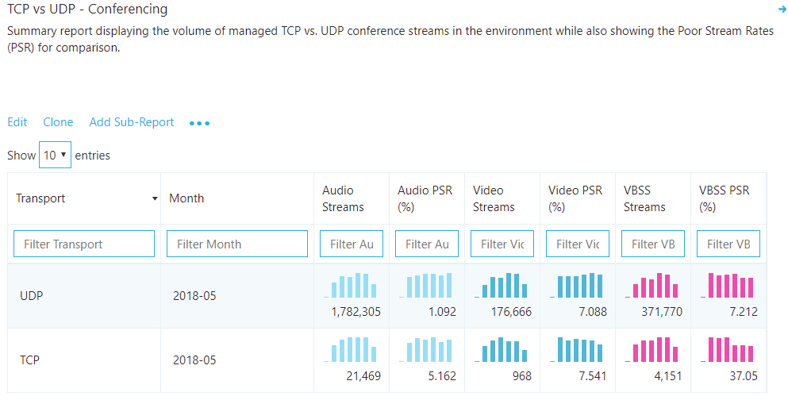

#  <a name="use-cqd-to-manage-call-and-meeting-quality-in-microsoft-teams"></a><span data-ttu-id="1d23c-103">Usare Call Quality dashboard per gestire la qualità delle chiamate e delle riunioni in Microsoft Teams</span><span class="sxs-lookup"><span data-stu-id="1d23c-103">Use CQD to manage call and meeting quality in Microsoft Teams</span></span> 

<span data-ttu-id="1d23c-104">Questo articolo aiuta l'amministratore di teams o il supporto tecnico e l'helpdesk-a sviluppare un processo per il monitoraggio e la manutenzione della qualità delle chiamate e delle riunioni per l'organizzazione usando Microsoft teams Call Quality Dashboard (Call Quality Dashboard).</span><span class="sxs-lookup"><span data-stu-id="1d23c-104">This article will help you - the Teams admin or support and helpdesk engineer - to develop a process for monitoring and maintaining call and meeting quality for your organization by using Microsoft Teams Call Quality Dashboard (CQD).</span></span> <span data-ttu-id="1d23c-105">Le nostre linee guida enfatizzano gli scenari di qualità audio, perché i miglioramenti apportati alla rete per migliorare l'esperienza audio si tradurranno in miglioramenti in video e condivisione.</span><span class="sxs-lookup"><span data-stu-id="1d23c-105">Our guidance emphasizes audio-quality scenarios because any network improvements you make to improve the audio experience will translate to improvements in video and sharing.</span></span>

<span data-ttu-id="1d23c-106">Chiave per queste linee guida sono i due [modelli di Call Quality dashboard curati](https://aka.ms/QERtemplates) : ti consigliamo di scaricarli prima di procedere con le indicazioni in questo articolo.</span><span class="sxs-lookup"><span data-stu-id="1d23c-106">Key to this guidance are the two [curated CQD templates](https://aka.ms/QERtemplates) - we recommend that you download them before you go through the guidance in this article.</span></span>

<span data-ttu-id="1d23c-107">Questo articolo presuppone che tu abbia già [configurato Call Quality dashboard](turning-on-and-using-call-quality-dashboard.md).</span><span class="sxs-lookup"><span data-stu-id="1d23c-107">This article assumes that you've already [set up CQD](turning-on-and-using-call-quality-dashboard.md).</span></span>


## <a name="categories-to-monitor-and-maintain"></a><span data-ttu-id="1d23c-108">Categorie da monitorare e gestire</span><span class="sxs-lookup"><span data-stu-id="1d23c-108">Categories to monitor and maintain</span></span>

<span data-ttu-id="1d23c-109">Dopo aver implementato le riunioni e la voce in teams, è necessario un piano per il monitoraggio e la manutenzione in corso.</span><span class="sxs-lookup"><span data-stu-id="1d23c-109">Once you've rolled out meetings and voice in Teams, you'll need a plan for ongoing monitoring and maintenance.</span></span> <span data-ttu-id="1d23c-110">In questo modo si garantirà che i team siano sempre in esecuzione in maniera ottimale.</span><span class="sxs-lookup"><span data-stu-id="1d23c-110">Doing so will ensure that Teams is always running optimally.</span></span> <span data-ttu-id="1d23c-111">Questo piano deve includere le aree principali elencate di seguito.</span><span class="sxs-lookup"><span data-stu-id="1d23c-111">This plan should include the key areas listed below.</span></span> <span data-ttu-id="1d23c-112">È inoltre necessario stabilire le destinazioni per le metriche di qualità e un piano per la risoluzione dei problemi e per l'isolamento quando si verificano.</span><span class="sxs-lookup"><span data-stu-id="1d23c-112">You should also establish targets for quality metrics and a plan for troubleshooting and isolating problems when they happen.</span></span>

<table>
<thead>
<tr class="header">
<th><span data-ttu-id="1d23c-113">Categoria</span><span class="sxs-lookup"><span data-stu-id="1d23c-113">Category</span></span></th>
<th><span data-ttu-id="1d23c-114">Descrizione</span><span class="sxs-lookup"><span data-stu-id="1d23c-114">Description</span></span></th>
</tr>
</thead>
<tbody>
<tr class="odd">
<td><span data-ttu-id="1d23c-115"><strong>Qualità delle chiamate</strong></span><span class="sxs-lookup"><span data-stu-id="1d23c-115"><strong>Call quality</strong></span></span></td>
<td>
<p><span data-ttu-id="1d23c-116">Suddividere le metriche tramite chiamate interne (all'interno dell'organizzazione, ad esempio VPN, WiFi, Wired) o chiamate esterne</span><span class="sxs-lookup"><span data-stu-id="1d23c-116">Break down the metrics by internal calls (within your organization, such as VPN, WiFi, wired) or external calls</span></span></p>
<p><span data-ttu-id="1d23c-117">Suddividere le metriche in base all'edificio o alla rete</span><span class="sxs-lookup"><span data-stu-id="1d23c-117">Break down the metrics by building or network</span></span></p>
<p><span data-ttu-id="1d23c-118">Chiamate VPN</span><span class="sxs-lookup"><span data-stu-id="1d23c-118">VPN calls</span></span></p>
<p><span data-ttu-id="1d23c-119">Chiamate tramite TCP, UDP o proxy</span><span class="sxs-lookup"><span data-stu-id="1d23c-119">Calls using TCP, UDP, or proxy</span></span></p>
</td>
</tr>
<tr class="even">
<td><span data-ttu-id="1d23c-120"><strong>Affidabilità delle chiamate</strong></span><span class="sxs-lookup"><span data-stu-id="1d23c-120"><strong>Call reliability</strong></span></span></td>
<td><p><span data-ttu-id="1d23c-121">Identificare e correggere eventuali problemi di rete o firewall</span><span class="sxs-lookup"><span data-stu-id="1d23c-121">Identify and remediate any network or firewall problems</span></span></p>
<p><span data-ttu-id="1d23c-122">Acquisire informazioni sulle percentuali degli errori di configurazione e rilascio delle chiamate</span><span class="sxs-lookup"><span data-stu-id="1d23c-122">Gain insights into the percentages of call setup and drop failures</span></span></p>
<p><span data-ttu-id="1d23c-123">Informazioni in cui si verifica la maggior parte degli errori di configurazione e rilascio delle chiamate</span><span class="sxs-lookup"><span data-stu-id="1d23c-123">Learn where the majority of call setup and drop failures occur</span></span></p>
</td>
</tr>
<tr class="odd">
<td><span data-ttu-id="1d23c-124"><strong>Sondaggio degli utenti</strong></span><span class="sxs-lookup"><span data-stu-id="1d23c-124"><strong>User survey</strong></span></span></td>
<td>
<p><span data-ttu-id="1d23c-125">Usare valuta i dati delle chiamate per informazioni sull'esperienza effettiva degli utenti</span><span class="sxs-lookup"><span data-stu-id="1d23c-125">Use Rate My Call data to learn about users' actual experience</span></span></p>
<p><span data-ttu-id="1d23c-126">Dove si verificano le cattive esperienze?</span><span class="sxs-lookup"><span data-stu-id="1d23c-126">Where are the poor experiences occurring?</span></span></p>
<p><span data-ttu-id="1d23c-127">Correlare la scarsa esperienza con qualità delle chiamate, affidabilità e dispositivi</span><span class="sxs-lookup"><span data-stu-id="1d23c-127">Correlate the poor experience with call quality, reliability, and devices</span></span></p>
</td>
</tr>
<tr class="even">
<td><span data-ttu-id="1d23c-128"><strong>Dispositivi</strong></span><span class="sxs-lookup"><span data-stu-id="1d23c-128"><strong>Devices</strong></span></span></td>
<td><p><span data-ttu-id="1d23c-129">Informazioni sui microfoni e gli altoparlanti usati più comunemente e sul loro impatto sulla qualità delle chiamate</span><span class="sxs-lookup"><span data-stu-id="1d23c-129">Learn which microphones and speakers are most commonly used and their impact on call quality</span></span></p>
<p><span data-ttu-id="1d23c-130">I driver audio, video, USB e WiFi di supporto sono regolarmente corretti?</span><span class="sxs-lookup"><span data-stu-id="1d23c-130">Are the supporting audio, video, USB, and WiFi drivers being regularly patched?</span></span></p>
</td>
</tr>
<tr class="odd">
<td><span data-ttu-id="1d23c-131"><strong>Client</strong></span><span class="sxs-lookup"><span data-stu-id="1d23c-131"><strong>Clients</strong></span></span></td>
<td>
<p><span data-ttu-id="1d23c-132">Informazioni sui tipi di client e sulle versioni in uso e sul loro impatto sulla qualità e l'affidabilità delle chiamate</span><span class="sxs-lookup"><span data-stu-id="1d23c-132">Learn which client types and versions are being used and their impact on call quality and reliability</span></span>  </p>
</ol></td>
</tr>
</tbody>
</table>

<span data-ttu-id="1d23c-133">Valutando e rimediando continuamente le aree descritte in questo articolo, è possibile ridurne le potenzialità per influire negativamente sugli utenti.</span><span class="sxs-lookup"><span data-stu-id="1d23c-133">By continually assessing and remediating the areas described in this article, you can reduce their potential to negatively affect your users.</span></span> <span data-ttu-id="1d23c-134">La maggior parte dei problemi degli utenti può essere raggruppata nelle categorie seguenti:</span><span class="sxs-lookup"><span data-stu-id="1d23c-134">Most user problems can be grouped into the following categories:</span></span>

-   <span data-ttu-id="1d23c-135">Firewall o configurazione proxy incompleta</span><span class="sxs-lookup"><span data-stu-id="1d23c-135">Incomplete firewall or proxy configuration</span></span>
-   <span data-ttu-id="1d23c-136">Scarsa copertura Wi-Fi</span><span class="sxs-lookup"><span data-stu-id="1d23c-136">Poor Wi-Fi coverage</span></span>
-   <span data-ttu-id="1d23c-137">Larghezza di banda insufficiente</span><span class="sxs-lookup"><span data-stu-id="1d23c-137">Insufficient bandwidth</span></span>
-   <span data-ttu-id="1d23c-138">VPN</span><span class="sxs-lookup"><span data-stu-id="1d23c-138">VPN</span></span>
-   <span data-ttu-id="1d23c-139">Versioni e driver client non coerenti o obsoleti</span><span class="sxs-lookup"><span data-stu-id="1d23c-139">Inconsistent or outdated client versions and drivers</span></span>
-   <span data-ttu-id="1d23c-140">Dispositivi audio non ottimizzati o incorporati</span><span class="sxs-lookup"><span data-stu-id="1d23c-140">Unoptimized or built-in audio devices</span></span>
-   <span data-ttu-id="1d23c-141">Subnet problematiche o dispositivi di rete</span><span class="sxs-lookup"><span data-stu-id="1d23c-141">Problematic subnets or network devices</span></span>

<span data-ttu-id="1d23c-142">Attraverso una pianificazione e una progettazione adeguate prima di distribuire Team o Skype for business online, è possibile ridurre la quantità di risorse necessarie per mantenere le esperienze di alta qualità.</span><span class="sxs-lookup"><span data-stu-id="1d23c-142">Through proper planning and design before deploying Teams or Skype for Business Online, you can reduce the amount of effort that will be required to maintain high-quality experiences.</span></span>

<span data-ttu-id="1d23c-143">Questo articolo è incentrato sull'uso di Call Quality Dashboard (Call Quality Dashboard) online come strumento principale per segnalare e analizzare ogni area, con un'enfasi particolare sull'audio per massimizzare l'adozione e l'impatto.</span><span class="sxs-lookup"><span data-stu-id="1d23c-143">This article focuses on using the Call Quality Dashboard (CQD) Online as the primary tool to report and investigate each area, with a special emphasis on audio to maximize adoption and impact.</span></span> <span data-ttu-id="1d23c-144">Gli eventuali miglioramenti apportati alla rete per migliorare l'esperienza audio verranno tradotti direttamente anche nei miglioramenti della condivisione di video e desktop.</span><span class="sxs-lookup"><span data-stu-id="1d23c-144">Any improvements made to the network to improve the audio experience will also directly translate to improvements in video and desktop sharing.</span></span>

<span data-ttu-id="1d23c-145">Per accelerare la valutazione, vengono forniti [due modelli di Call Quality dashboard curati](https://aka.ms/qertemplates) : uno è per la gestione di tutte le reti e l'altro è filtrato solo per le reti gestite (interne).</span><span class="sxs-lookup"><span data-stu-id="1d23c-145">To accelerate your assessment, [two curated CQD templates](https://aka.ms/qertemplates) are provided: one is for managing all networks and the other is filtered for managed (internal) networks only.</span></span> <span data-ttu-id="1d23c-146">Anche se i report tutti i modelli di reti sono configurati per visualizzare informazioni su edifici e reti, è comunque possibile usarli mentre si lavora per raccogliere e caricare informazioni sulla creazione.</span><span class="sxs-lookup"><span data-stu-id="1d23c-146">Although the All Networks template reports are configured to display building and network information, they can still be used while you work toward collecting and uploading building information.</span></span> <span data-ttu-id="1d23c-147">Il caricamento di informazioni sulla creazione in Call Quality dashboard consente al servizio di migliorare la creazione di report aggiungendo informazioni personalizzate per la creazione, la rete e la posizione mentre si differenziano internamente dalle subnet esterne.</span><span class="sxs-lookup"><span data-stu-id="1d23c-147">Uploading building information into CQD enables the service to enhance reporting by adding custom building, network, and location information while differentiating internal from external subnets.</span></span> <span data-ttu-id="1d23c-148">Per altre informazioni, vedere [mapping delle costruzioni](CQD-building-mapping.md).</span><span class="sxs-lookup"><span data-stu-id="1d23c-148">For more information, read [Building mapping](CQD-building-mapping.md).</span></span>

### <a name="intended-audience"></a><span data-ttu-id="1d23c-149">Destinatari previsti</span><span class="sxs-lookup"><span data-stu-id="1d23c-149">Intended audience</span></span>

<span data-ttu-id="1d23c-150">Questo articolo è destinato a essere usato dalle parti interessate partner e clienti con ruoli come lead di collaborazione/architetto, consulente, specialista per la gestione/adozione dei cambiamenti, il supporto tecnico lead/help desk, Network lead, desktop lead e IT admin.</span><span class="sxs-lookup"><span data-stu-id="1d23c-150">This article is intended to be used by partner and customer stakeholders with roles such as Collaboration Lead/Architect, Consultant, Change Management/Adoption Specialist, Support/Help Desk Lead, Network Lead, Desktop Lead, and IT Admin.</span></span>

<span data-ttu-id="1d23c-151">Questo articolo è destinato anche a essere usato dal campione o dai campioni di qualità designati.</span><span class="sxs-lookup"><span data-stu-id="1d23c-151">This article is also intended to be used by the designated quality champion(s).</span></span> <span data-ttu-id="1d23c-152">Per altre informazioni, Vedi [il ruolo campione di qualità](4-envision-plan-my-service-management.md#the-quality-champion-role).</span><span class="sxs-lookup"><span data-stu-id="1d23c-152">For more information, see [the Quality Champion role](4-envision-plan-my-service-management.md#the-quality-champion-role).</span></span>


## <a name="what-is-quality"></a><span data-ttu-id="1d23c-153">Che cos'è la qualità?</span><span class="sxs-lookup"><span data-stu-id="1d23c-153">What is quality?</span></span>

<span data-ttu-id="1d23c-154">In questo contesto, la qualità è una combinazione di metriche dei servizi e esperienza utente.</span><span class="sxs-lookup"><span data-stu-id="1d23c-154">In this context, quality is a combination of service metrics and user experience.</span></span>


### <a name="service-metrics"></a><span data-ttu-id="1d23c-155">Metriche del servizio</span><span class="sxs-lookup"><span data-stu-id="1d23c-155">Service metrics</span></span>

<span data-ttu-id="1d23c-156">Le metriche dei servizi sono costituite da specifiche metriche basate sul client.</span><span class="sxs-lookup"><span data-stu-id="1d23c-156">Service metrics consist of specific client-based metrics.</span></span> <span data-ttu-id="1d23c-157">Durante ogni chiamata, il client raccoglie la telemetria per la chiamata e invia un report alla fine di ogni chiamata a cui è possibile accedere in seguito in Call Quality dashboard o in [analisi delle chiamate per utente](set-up-call-analytics.md).</span><span class="sxs-lookup"><span data-stu-id="1d23c-157">During each call, the client collects telemetry for the call and submits a report at the end of each call that can later be accessed in CQD or in [per-user call analytics](set-up-call-analytics.md).</span></span> <span data-ttu-id="1d23c-158">Queste metriche includono (ma non sono limitate a):</span><span class="sxs-lookup"><span data-stu-id="1d23c-158">These metrics include (but aren't limited to):</span></span>

-   <span data-ttu-id="1d23c-159">Flusso di scarsità (in entrata e in uscita)</span><span class="sxs-lookup"><span data-stu-id="1d23c-159">Poor Stream (incoming and outgoing)</span></span>
-   <span data-ttu-id="1d23c-160">Tasso di errore di configurazione</span><span class="sxs-lookup"><span data-stu-id="1d23c-160">Setup Failure Rate</span></span>
-   <span data-ttu-id="1d23c-161">Calo tasso di errore</span><span class="sxs-lookup"><span data-stu-id="1d23c-161">Drop Failure Rate</span></span>


#### <a name="poor-stream-rate"></a><span data-ttu-id="1d23c-162">Tasso di flusso scadente</span><span class="sxs-lookup"><span data-stu-id="1d23c-162">Poor stream rate</span></span>

<span data-ttu-id="1d23c-163">La bassa velocità di flusso (PSR) rappresenta la percentuale complessiva dell'organizzazione di flussi con qualità scadente.</span><span class="sxs-lookup"><span data-stu-id="1d23c-163">The poor stream rate (PSR) represents the organization's overall percentage of streams that have poor quality.</span></span> <span data-ttu-id="1d23c-164">Questa metrica è destinata ad evidenziare le aree in cui l'organizzazione può concentrare lo sforzo per avere l'impatto più forte sulla riduzione di questo valore e sul miglioramento dell'esperienza utente, motivo per cui le [reti gestite](#managed-versus-unmanaged-networks) costituiscono lo stato di primaria importanza quando si esaminano i PSR.</span><span class="sxs-lookup"><span data-stu-id="1d23c-164">This metric is meant to highlight areas where your organization can concentrate effort to have the strongest impact toward reducing this value and improving the user experience, which is why [managed networks](#managed-versus-unmanaged-networks) are the primary focus when looking at PSR.</span></span> <span data-ttu-id="1d23c-165">Anche gli utenti esterni sono importanti, ma le indagini variano in base a un'organizzazione.</span><span class="sxs-lookup"><span data-stu-id="1d23c-165">External users are important too, but investigation differs on an organizational basis.</span></span> <span data-ttu-id="1d23c-166">Valutare la possibilità di fornire le procedure consigliate per gli utenti esterni ed esaminare le chiamate esterne indipendentemente dall'organizzazione complessiva.</span><span class="sxs-lookup"><span data-stu-id="1d23c-166">Consider providing best practices for external users, and investigate external calls independently from the overall organization.</span></span>

<span data-ttu-id="1d23c-167">La misura effettiva in Call Quality dashboard varia in base al carico di lavoro, ma ai fini di questo articolo ci concentriamo principalmente sulla misurazione della _percentuale di scarsità audio_ .</span><span class="sxs-lookup"><span data-stu-id="1d23c-167">The actual measurement in CQD varies by workload, but for the purposes of this article, we focus primarily on the _Audio Poor Percentage_ measurement.</span></span> <span data-ttu-id="1d23c-168">PSR è costituito dalle cinque medie metriche della rete descritte nella tabella seguente.</span><span class="sxs-lookup"><span data-stu-id="1d23c-168">PSR is made up of the five network metric averages described in the following table.</span></span> <span data-ttu-id="1d23c-169">Affinché un flusso venga classificato come scadente, solo una metrica deve superare la soglia definita.</span><span class="sxs-lookup"><span data-stu-id="1d23c-169">For a stream to be classified as poor, only one metric needs to exceed the defined threshold.</span></span> <span data-ttu-id="1d23c-170">Call Quality dashboard fornisce il "povero a causa di..." misure per comprendere meglio quale condizione ha causato la classificazione del flusso come scadente.</span><span class="sxs-lookup"><span data-stu-id="1d23c-170">CQD provides the "Poor Due To…" measurements to better understand what condition caused the stream to be classified as poor.</span></span> <span data-ttu-id="1d23c-171">Per altre informazioni, leggere la [classificazione in Stream in Call Quality dashboard](stream-classification-in-call-quality-dashboard.md).</span><span class="sxs-lookup"><span data-stu-id="1d23c-171">To learn more, read [Stream classification in CQD](stream-classification-in-call-quality-dashboard.md).</span></span>

> [!Note]
> <span data-ttu-id="1d23c-172">Call Quality dashboard fornisce il "povero a causa di..." misure per comprendere meglio quale condizione ha causato la classificazione del flusso come scadente.</span><span class="sxs-lookup"><span data-stu-id="1d23c-172">CQD provides the "Poor due to…" measurements to better understand what condition caused the stream to be classified as poor.</span></span>


##### <a name="audio-poor-quality-metrics"></a><span data-ttu-id="1d23c-173">Metriche audio di qualità scadente</span><span class="sxs-lookup"><span data-stu-id="1d23c-173">Audio poor quality metrics</span></span>

| <span data-ttu-id="1d23c-174">Media metrica</span><span class="sxs-lookup"><span data-stu-id="1d23c-174">Metric average</span></span>     | <span data-ttu-id="1d23c-175">Descrizione</span><span class="sxs-lookup"><span data-stu-id="1d23c-175">Description</span></span>     | <span data-ttu-id="1d23c-176">Esperienza utente</span><span class="sxs-lookup"><span data-stu-id="1d23c-176">User experience</span></span> |
|-------------|-----------------|-----------------|
| <span data-ttu-id="1d23c-177">Jitter \> 30 ms</span><span class="sxs-lookup"><span data-stu-id="1d23c-177">Jitter \>30 ms</span></span>        | <span data-ttu-id="1d23c-178">Questa è la variazione media di ritardo tra i pacchetti successivi.</span><span class="sxs-lookup"><span data-stu-id="1d23c-178">This is the average change in delay between successive packets.</span></span> <span data-ttu-id="1d23c-179">I team e Skype for business possono adattarsi ad alcuni livelli di jitter attraverso il buffering.</span><span class="sxs-lookup"><span data-stu-id="1d23c-179">Teams and Skype for Business can adapt to some levels of jitter through buffering.</span></span> <span data-ttu-id="1d23c-180">Solo quando il jitter supera il buffering che un partecipante Nota gli effetti di jitter.</span><span class="sxs-lookup"><span data-stu-id="1d23c-180">It's only when the jitter exceeds the buffering that a participant notices the effects of jitter.</span></span>      | <span data-ttu-id="1d23c-181">I pacchetti che arrivano a velocità diverse causano la voce di un altoparlante a un suono robotico.</span><span class="sxs-lookup"><span data-stu-id="1d23c-181">The packets arriving at different speeds cause a speaker's voice to sound robotic.</span></span>   |
| <span data-ttu-id="1d23c-182">Tasso di perdita di pacchetti \> 10% o 0,1</span><span class="sxs-lookup"><span data-stu-id="1d23c-182">Packet loss rate \>10% or 0.1</span></span>        | <span data-ttu-id="1d23c-183">Questa operazione viene spesso definita come percentuale di pacchetti persi.</span><span class="sxs-lookup"><span data-stu-id="1d23c-183">This is often defined as a percentage of packets that are lost.</span></span> <span data-ttu-id="1d23c-184">La perdita di pacchetti influenza direttamente la qualità audio, da piccoli pacchetti persi singoli che non hanno quasi alcun impatto sulle perdite di burst di back-to-back che causano il ritaglio completo dell'audio.</span><span class="sxs-lookup"><span data-stu-id="1d23c-184">Packet loss directly affects audio quality—from small, individual lost packets that have almost no impact to back-to-back burst losses that cause audio to cut out completely.</span></span>     | <span data-ttu-id="1d23c-185">I pacchetti che vengono eliminati e che non arrivano alla destinazione desiderata causano lacune nel supporto, con sillabe perse e parole e video e condivisione dispersivi.</span><span class="sxs-lookup"><span data-stu-id="1d23c-185">The packets being dropped and not arriving at their intended destination cause gaps in the media, resulting in missed syllables and words, and choppy video and sharing.</span></span> |
| <span data-ttu-id="1d23c-186">Ora di andata e ritorno \> 500 ms</span><span class="sxs-lookup"><span data-stu-id="1d23c-186">Round-trip time \>500 ms</span></span>        | <span data-ttu-id="1d23c-187">Questo è il tempo necessario per ottenere un pacchetto IP dal punto a al punto B e viceversa al punto a. Questo ritardo di propagazione della rete è legato alla distanza fisica tra i due punti e alla velocità della luce e include un sovraccarico aggiuntivo adottato dai vari dispositivi nel percorso di rete.</span><span class="sxs-lookup"><span data-stu-id="1d23c-187">This is the time it takes to get an IP packet from point A to point B and back to point A. This network propagation delay is tied to the physical distance between the two points and the speed of light, and includes additional overhead taken by the various devices in the network path.</span></span>      | <span data-ttu-id="1d23c-188">I pacchetti che impiegano troppo tempo per arrivare a destinazione causano un effetto walkie-talkie.</span><span class="sxs-lookup"><span data-stu-id="1d23c-188">The packets taking too long to arrive at their destination cause a walkie-talkie effect.</span></span>   |
| <span data-ttu-id="1d23c-189">NMOS degradazione media \> 1,0</span><span class="sxs-lookup"><span data-stu-id="1d23c-189">NMOS degradation average \>1.0</span></span>         | <span data-ttu-id="1d23c-190">Media del Punteggio medio di [valutazione (NMOS)](https://docs.microsoft.com/previous-versions/office/communications-server/bb894481(v=office.12)#network-mos) per il flusso.</span><span class="sxs-lookup"><span data-stu-id="1d23c-190">Average [Network Mean Opinion Score (NMOS)](https://docs.microsoft.com/previous-versions/office/communications-server/bb894481(v=office.12)#network-mos) degradation for the stream.</span></span> <span data-ttu-id="1d23c-191">Rappresenta la quantità di perdite di rete e jitter che ha influenzato la qualità dell'audio ricevuto che ha causato l'eliminazione di NMOS da più di un punto.</span><span class="sxs-lookup"><span data-stu-id="1d23c-191">Represents how much the network loss and jitter has affected the quality of received audio that caused the NMOS to drop by more than one point.</span></span> | <span data-ttu-id="1d23c-192">Si tratta di una combinazione di jitter, perdita di pacchetti e, in misura minore, maggiore tempo di andata e ritorno.</span><span class="sxs-lookup"><span data-stu-id="1d23c-192">This is a combination of jitter, packet loss, and—to a lesser degree—increased round-trip time.</span></span> <span data-ttu-id="1d23c-193">L'utente potrebbe provare una combinazione di questi sintomi.</span><span class="sxs-lookup"><span data-stu-id="1d23c-193">The user might be experiencing a combination of these symptoms.</span></span>   |
| <span data-ttu-id="1d23c-194">Rapporto medio tra campioni nascosti \> 7% o 0,07</span><span class="sxs-lookup"><span data-stu-id="1d23c-194">Average ratio of concealed samples \>7% or 0.07</span></span> | <span data-ttu-id="1d23c-195">Rapporto medio del numero di fotogrammi audio con campioni nascosti generati dalla perdita di pacchetti per la guarigione del numero totale di fotogrammi audio.</span><span class="sxs-lookup"><span data-stu-id="1d23c-195">Average ratio of the number of audio frames with concealed samples generated by packet loss healing to the total number of audio frames.</span></span> <span data-ttu-id="1d23c-196">Un esempio di audio nascosto è una tecnica usata per attenuare la transizione brusca che in genere viene causata da pacchetti di rete eliminati.</span><span class="sxs-lookup"><span data-stu-id="1d23c-196">A concealed audio sample is a technique used to smooth out the abrupt transition that would usually be caused by dropped network packets.</span></span>      | <span data-ttu-id="1d23c-197">I valori alti indicano che i livelli significativi di occultamento delle perdite sono stati applicati e hanno provocato l'audio distorto o perso.</span><span class="sxs-lookup"><span data-stu-id="1d23c-197">High values indicate that significant levels of loss concealment were applied and resulted in distorted or lost audio.</span></span>     |

##### <a name="why-do-we-prefer-to-use-streams-instead-of-calls"></a><span data-ttu-id="1d23c-198">Perché preferiamo usare i flussi anziché le chiamate?</span><span class="sxs-lookup"><span data-stu-id="1d23c-198">Why do we prefer to use streams instead of calls?</span></span>

<span data-ttu-id="1d23c-199">I flussi consentono di sapere quale gamba particolare della chiamata è stata scadente-in uscita o in arrivo.</span><span class="sxs-lookup"><span data-stu-id="1d23c-199">Streams let us know which particular leg of the call was poor - outgoing or incoming.</span></span> <span data-ttu-id="1d23c-200">Quando si guarda l'analisi delle chiamate per una chiamata scadente, determinare se la chiamata scadente è dovuta al flusso del chiamante (in uscita) o al flusso del chiamato (in ingresso).</span><span class="sxs-lookup"><span data-stu-id="1d23c-200">When you're looking at call analytics for a poor call, determine whether the poor call was due to that caller's stream (outbound) or callee's stream (inbound).</span></span> <span data-ttu-id="1d23c-201">La determinazione del flusso che influenza la qualità delle chiamate è ancora più importante per le conferenze.</span><span class="sxs-lookup"><span data-stu-id="1d23c-201">Determining which stream is impacting call quality is even more important for conferences.</span></span> <span data-ttu-id="1d23c-202">Se si esaminano solo i dati delle chiamate, viene visualizzato il numero di conferenze a cui partecipa una persona, ma non è possibile vedere quali persone sono relatori attive, facendo la maggior parte della condivisione dello schermo.</span><span class="sxs-lookup"><span data-stu-id="1d23c-202">If you're only looking at call data, you'll see how many conferences a person participates in, but you won't see which people are active speakers, doing the most screen sharing.</span></span>

<span data-ttu-id="1d23c-203">I dati delle chiamate forniscono le metriche di utilizzo, ma non necessariamente condurrà alla causa radice per una qualità di chiamata scadente.</span><span class="sxs-lookup"><span data-stu-id="1d23c-203">Call data gives you usage metrics, but it won't necessarily lead you to the root cause for poor call quality.</span></span> <span data-ttu-id="1d23c-204">Esaminando la direzione del flusso, puoi identificare fattori come una chiamata non presente in una rete gestita, una chiamata da un altro utente (ad esempio, un fornitore o un utente in una rete diversa).</span><span class="sxs-lookup"><span data-stu-id="1d23c-204">By looking at stream direction, you can identify factors such as a call that's not on a managed network, a call from a non-employee (e.g., a vendor or someone on a different network).</span></span> <span data-ttu-id="1d23c-205">In questi casi, se la connessione di rete dell'altra persona è scadente, l'intera chiamata verrà contrassegnata come povera.</span><span class="sxs-lookup"><span data-stu-id="1d23c-205">In these cases, if the other person's network connection was poor, the entire call will be flagged as poor.</span></span> <span data-ttu-id="1d23c-206">Non è possibile eseguire operazioni su fattori esterni, quindi questi dati non sono utili.</span><span class="sxs-lookup"><span data-stu-id="1d23c-206">You can't do  anything about external factors, so this data isn't helpful.</span></span>

<span data-ttu-id="1d23c-207">La direzione del flusso può anche aiutare a identificare dispositivi o client problematici.</span><span class="sxs-lookup"><span data-stu-id="1d23c-207">Stream direction can also help you identify problematic devices or clients.</span></span>

 - <span data-ttu-id="1d23c-208">Ad esempio, se si ha un budget limitato per i dispositivi e si vogliono specificare solo i dispositivi per gli utenti di audio pesanti, usare il report sull'utilizzo audio (VoIP) e il filtro per i flussi in uscita e i servizi di conferenza.</span><span class="sxs-lookup"><span data-stu-id="1d23c-208">For example, If you have a limited budget for devices and want to provide devices only for heavy audio users, use the audio usage report (VoIP) and filter for outbound streams and conferencing.</span></span> <span data-ttu-id="1d23c-209">Cercare gli utenti di audio ad alto volume che parlano in microfoni incorporati, che potrebbero essere correlati alla qualità delle chiamate più scarsa (e si potrebbe voler inserire dispositivi audio per queste persone).</span><span class="sxs-lookup"><span data-stu-id="1d23c-209">Look for high-volume audio users who are speaking into built-in microphones - these may correlate to poorer call quality (and you might want to provide audio devices for these people).</span></span> <span data-ttu-id="1d23c-210">Per maggiore chiarezza, potresti filtrare per l'utilizzo dei pacchetti, che ti permetterà di indirizzare in particolare gli utenti di audio ad alto volume.</span><span class="sxs-lookup"><span data-stu-id="1d23c-210">For added clarity, you could filter for packet utilization, which will let you target especially high-volume audio users.</span></span> 

  - <span data-ttu-id="1d23c-211">Un altro esempio riguarda la condivisione dello schermo.</span><span class="sxs-lookup"><span data-stu-id="1d23c-211">Another example involves screen sharing.</span></span> <span data-ttu-id="1d23c-212">Se un cliente usa un client di Team obsoleti, le prestazioni di condivisione dello schermo potrebbero essere interessate.</span><span class="sxs-lookup"><span data-stu-id="1d23c-212">If a customer is using an old Teams client, screen sharing performance may be affected.</span></span> <span data-ttu-id="1d23c-213">È possibile risolvere il problema privilegiando gli aggiornamenti del client per gli utenti che eseguono molto la condivisione dello schermo.</span><span class="sxs-lookup"><span data-stu-id="1d23c-213">You could address this problem by prioritizing client upgrades for people who do a lot of screen sharing.</span></span>

 - <span data-ttu-id="1d23c-214">Identificando la direzione di un flusso che causa una qualità di chiamata scadente, puoi determinare se hai un problema relativo al QoS o alla larghezza di banda.</span><span class="sxs-lookup"><span data-stu-id="1d23c-214">By identifying which direction of a stream is causing poor call quality, you can determine whether you've got a QoS or bandwidth-related problem.</span></span> <span data-ttu-id="1d23c-215">Se il QoS non è stato completamente implementato o se si contrassegnano solo i pacchetti nel client e non nel flusso in ingresso, è possibile che venga visualizzato un livello di qualità delle chiamate più scadente.</span><span class="sxs-lookup"><span data-stu-id="1d23c-215">If you haven't fully implemented QoS, or if you only mark packets at the client and not at the inbound stream, you might see poorer call quality.</span></span> <span data-ttu-id="1d23c-216">Esaminando la direzione del flusso, è possibile ottenere una visualizzazione più granulare di perdita di pacchetti, latenza o jitter in una direzione specifica.</span><span class="sxs-lookup"><span data-stu-id="1d23c-216">By looking at stream direction, you can get a more granular view of packet loss, latency, or jitter in a specific direction.</span></span> 

   - <span data-ttu-id="1d23c-217">Supponiamo, ad esempio, che un utente si lamenti dell'audio robot durante una connessione cablata (jitter).</span><span class="sxs-lookup"><span data-stu-id="1d23c-217">For example, let's say a user complains of robotic audio while on a wired connection (jitter).</span></span> <span data-ttu-id="1d23c-218">Esaminando il flusso e la direzione, puoi determinare che il problema si verifica nel flusso in ingresso, solo per un set specifico di subnet.</span><span class="sxs-lookup"><span data-stu-id="1d23c-218">By looking at stream and direction, you can determine that the problem happens on the inbound stream, only for a specific set of subnets.</span></span> <span data-ttu-id="1d23c-219">Dopo aver fornito queste informazioni al team di rete, è possibile rintracciarlo in un acceleratore WAN configurato in maniera non configurata che non bypassa il traffico multimediale.</span><span class="sxs-lookup"><span data-stu-id="1d23c-219">After you give this information to your networking team, they can track it down to a misconfigured WAN accelerator that was not bypassing media traffic.</span></span> <span data-ttu-id="1d23c-220">Dopo che il team di rete ha riconfigurato l'acceleratore WAN, il jitter scompare e la qualità delle chiamate migliora.</span><span class="sxs-lookup"><span data-stu-id="1d23c-220">Once the network team reconfigures the WAN accelerator, jitter disappears and call quality improves.</span></span> 


#### <a name="setup-failure-rate"></a><span data-ttu-id="1d23c-221">Tasso di errore di configurazione</span><span class="sxs-lookup"><span data-stu-id="1d23c-221">Setup Failure Rate</span></span>

<span data-ttu-id="1d23c-222">La frequenza di errore di configurazione, altrimenti nota come misura della _percentuale di errore di configurazione della chiamata totale_ in Call Quality dashboard, è il numero di flussi in cui non è stato possibile stabilire il percorso del supporto tra gli endpoint all'inizio della chiamata.</span><span class="sxs-lookup"><span data-stu-id="1d23c-222">The setup failure rate, otherwise known as the _Total Call Setup Failure Percentage_ measurement in CQD, is the number of streams where the media path couldn't be established between the endpoints at the start of the call.</span></span>

<span data-ttu-id="1d23c-223">Rappresenta qualsiasi flusso multimediale che non è stato possibile stabilire.</span><span class="sxs-lookup"><span data-stu-id="1d23c-223">This represents any media stream that couldn't be established.</span></span> <span data-ttu-id="1d23c-224">Considerata la gravità dell'impatto di questo problema sull'esperienza utente, l'obiettivo è quello di ridurre il valore al più vicino possibile allo zero.</span><span class="sxs-lookup"><span data-stu-id="1d23c-224">Given the severity of the impact of this problem on the user experience, the goal is to reduce this value to as close to zero as possible.</span></span> <span data-ttu-id="1d23c-225">Un valore elevato per questa metrica è più comune nelle nuove distribuzioni con regole del firewall incomplete rispetto a una distribuzione matura, ma è comunque importante controllarle regolarmente.</span><span class="sxs-lookup"><span data-stu-id="1d23c-225">A high value for this metric is more common in new deployments with incomplete firewall rules than a mature deployment, but it's still important to watch on a regular basis.</span></span>

<span data-ttu-id="1d23c-226">Questa metrica viene calcolata prendendo il numero totale di flussi che non sono stati configurati in base al numero totale di flussi che hanno inviato un record di dettaglio delle chiamate (CDR) riuscito:</span><span class="sxs-lookup"><span data-stu-id="1d23c-226">This metric is calculated by taking the total number of streams that failed to set up divided by the total number of streams that submitted a successful call detail record (CDR):</span></span>

-   <span data-ttu-id="1d23c-227">**Tasso di errore di configurazione** = Total call setup non riuscito numero di flusso/totale CDR disponibile Conteggio flusso</span><span class="sxs-lookup"><span data-stu-id="1d23c-227">**Setup Failure Rate** = Total Call Setup Failed Stream Count / Total CDR Available Stream Count</span></span>

#### <a name="drop-failure-rate"></a><span data-ttu-id="1d23c-228">Calo tasso di errore</span><span class="sxs-lookup"><span data-stu-id="1d23c-228">Drop Failure Rate</span></span>

<span data-ttu-id="1d23c-229">La percentuale di errore di rientro, altrimenti nota come misura della _percentuale di errore di chiamata totale rilasciata_ in Call Quality dashboard, è quella dei flussi definiti correttamente in cui il percorso del supporto non è stato interrotto normalmente.</span><span class="sxs-lookup"><span data-stu-id="1d23c-229">The drop failure rate, otherwise known as the _Total Call Dropped Failure Percentage_ measurement in CQD, is the percentage of successfully established streams where the media path didn't terminate normally.</span></span>

<span data-ttu-id="1d23c-230">Rappresenta qualsiasi flusso multimediale terminato in modo imprevisto.</span><span class="sxs-lookup"><span data-stu-id="1d23c-230">This represents any media stream that terminated unexpectedly.</span></span> <span data-ttu-id="1d23c-231">Anche se l'impatto di questa operazione non è così grave come un flusso che non è stato configurato, l'esperienza utente è ancora negativa.</span><span class="sxs-lookup"><span data-stu-id="1d23c-231">Although the impact of this isn't as severe as a stream that failed to set up, it still negatively affects the user experience.</span></span> <span data-ttu-id="1d23c-232">Le cadute di media improvvise e frequenti non solo possono avere un impatto grave sull'esperienza utente, ma determinano la necessità di riconnettersi agli utenti, con conseguente perdita di produttività (per non parlare della frustrazione).</span><span class="sxs-lookup"><span data-stu-id="1d23c-232">Sudden and frequent media drops not only can have a severe impact on the user experience, they result in the need for users to reconnect, resulting in lost productivity (not to mention frustration).</span></span>

<span data-ttu-id="1d23c-233">La metrica viene calcolata prendendo il numero totale di flussi eliminati diviso per il conteggio totale dei flussi configurati correttamente:</span><span class="sxs-lookup"><span data-stu-id="1d23c-233">The metric is calculated by taking the total number of dropped streams divided by the total count of streams that set up successfully:</span></span>

-   <span data-ttu-id="1d23c-234">**Drop failure rate** = Total Call Dropped count flusso/Total call setup numero di flusso riuscito</span><span class="sxs-lookup"><span data-stu-id="1d23c-234">**Drop Failure Rate** = Total Call Dropped Stream Count / Total Call Setup Succeeded Stream Count</span></span>

### <a name="define-your-target-metrics"></a><span data-ttu-id="1d23c-235">Definire le metriche di destinazione</span><span class="sxs-lookup"><span data-stu-id="1d23c-235">Define your target metrics</span></span>

<span data-ttu-id="1d23c-236">In questa sezione vengono illustrate alcune delle metriche di servizio principali che vengono usate per valutare l'integrità dei servizi.</span><span class="sxs-lookup"><span data-stu-id="1d23c-236">This section discusses some of the core service metrics that we use to assess the health of the services.</span></span> <span data-ttu-id="1d23c-237">Valutando e guidando continuamente gli sforzi per mantenere queste metriche al di sotto dei loro obiettivi definiti, ti aiuterai ad assicurarti che gli utenti verifichino una qualità di chiamata affidabile e coerente.</span><span class="sxs-lookup"><span data-stu-id="1d23c-237">By continually assessing and driving efforts to keep these metrics below their defined targets, you'll help ensure that your users experience consistent, reliable call quality.</span></span> <span data-ttu-id="1d23c-238">Come punto di partenza, usare le Destinazioni suggerite nella tabella seguente.</span><span class="sxs-lookup"><span data-stu-id="1d23c-238">As a starting point, use the suggested targets in the table below.</span></span> <span data-ttu-id="1d23c-239">Modificare le destinazioni in base alle esigenze per soddisfare gli obiettivi aziendali.</span><span class="sxs-lookup"><span data-stu-id="1d23c-239">Adjust the targets as needed to meet your business objectives.</span></span>

<table>
<tr>
<th rowspan="2" colspan="2" valign="center"><span data-ttu-id="1d23c-240">Tipo di rete</span><span class="sxs-lookup"><span data-stu-id="1d23c-240">Network type</span></span></th><th rowspan="1"><span data-ttu-id="1d23c-241">Obiettivi di qualità</span><span class="sxs-lookup"><span data-stu-id="1d23c-241">Quality targets</span></span></th><th colspan="2"><span data-ttu-id="1d23c-242">Obiettivi di affidabilità</span><span class="sxs-lookup"><span data-stu-id="1d23c-242">Reliability targets</span></span></th></tr>
<tr><th><span data-ttu-id="1d23c-243">Tasso di flusso audio scadente</span><span class="sxs-lookup"><span data-stu-id="1d23c-243">Audio Poor Stream Rate</span></span></th><th><span data-ttu-id="1d23c-244">Tasso di errore di configurazione</span><span class="sxs-lookup"><span data-stu-id="1d23c-244">Setup Failure Rate</span></span></th><th><span data-ttu-id="1d23c-245">Calo tasso di errore</span><span class="sxs-lookup"><span data-stu-id="1d23c-245">Drop Failure Rate</span></span></th></tr>
<tr><td rowspan="2"><span data-ttu-id="1d23c-246"><strong>All</strong></span><span class="sxs-lookup"><span data-stu-id="1d23c-246"><strong>All</strong></span></span></td><td><span data-ttu-id="1d23c-247">Interno</span><span class="sxs-lookup"><span data-stu-id="1d23c-247">Internal</span></span></td><td><span data-ttu-id="1d23c-248">2,0%</span><span class="sxs-lookup"><span data-stu-id="1d23c-248">2.0%</span></span></td><td><span data-ttu-id="1d23c-249">0,5%</span><span class="sxs-lookup"><span data-stu-id="1d23c-249">0.5%</span></span></td><td><span data-ttu-id="1d23c-250">2,0%</span><span class="sxs-lookup"><span data-stu-id="1d23c-250">2.0%</span></span></td></tr>
<tr><td><span data-ttu-id="1d23c-251">Generale</span><span class="sxs-lookup"><span data-stu-id="1d23c-251">Overall</span></span></td><td><span data-ttu-id="1d23c-252">3,0%</span><span class="sxs-lookup"><span data-stu-id="1d23c-252">3.0%</span></span></td><td><span data-ttu-id="1d23c-253">1,0%</span><span class="sxs-lookup"><span data-stu-id="1d23c-253">1.0%</span></span></td><td><span data-ttu-id="1d23c-254">3,0%</span><span class="sxs-lookup"><span data-stu-id="1d23c-254">3.0%</span></span></td></tr>
<tr><td rowspan="5"><span data-ttu-id="1d23c-255"><strong>Conferenze</strong></span><span class="sxs-lookup"><span data-stu-id="1d23c-255"><strong>Conferencing</strong></span></span></td><td><span data-ttu-id="1d23c-256">Interno</span><span class="sxs-lookup"><span data-stu-id="1d23c-256">Internal</span></span></td><td><span data-ttu-id="1d23c-257">2,0%</span><span class="sxs-lookup"><span data-stu-id="1d23c-257">2.0%</span></span></td><td><span data-ttu-id="1d23c-258">0,5%</span><span class="sxs-lookup"><span data-stu-id="1d23c-258">0.5%</span></span></td><td><span data-ttu-id="1d23c-259">2,0%</span><span class="sxs-lookup"><span data-stu-id="1d23c-259">2.0%</span></span></td></tr>
<tr><td><span data-ttu-id="1d23c-260">Interno cablato</span><span class="sxs-lookup"><span data-stu-id="1d23c-260">Wired internal</span></span></td><td><span data-ttu-id="1d23c-261">1,0%</span><span class="sxs-lookup"><span data-stu-id="1d23c-261">1.0%</span></span></td><td><span data-ttu-id="1d23c-262">0,5%</span><span class="sxs-lookup"><span data-stu-id="1d23c-262">0.5%</span></span></td><td><span data-ttu-id="1d23c-263">1,0%</span><span class="sxs-lookup"><span data-stu-id="1d23c-263">1.0%</span></span></td></tr>
<tr><td><span data-ttu-id="1d23c-264">Wi-Fi 5 GHz interno</span><span class="sxs-lookup"><span data-stu-id="1d23c-264">Wi-Fi 5 GHz internal</span></span></td><td><span data-ttu-id="1d23c-265">1,0%</span><span class="sxs-lookup"><span data-stu-id="1d23c-265">1.0%</span></span></td><td><span data-ttu-id="1d23c-266">0,5%</span><span class="sxs-lookup"><span data-stu-id="1d23c-266">0.5%</span></span></td><td><span data-ttu-id="1d23c-267">1,0%</span><span class="sxs-lookup"><span data-stu-id="1d23c-267">1.0%</span></span></td></tr>
<tr><td><span data-ttu-id="1d23c-268">Wi-Fi 2,4 GHz interno</span><span class="sxs-lookup"><span data-stu-id="1d23c-268">Wi-Fi 2.4 GHz internal</span></span></td><td><span data-ttu-id="1d23c-269">2,0%</span><span class="sxs-lookup"><span data-stu-id="1d23c-269">2.0%</span></span></td><td><span data-ttu-id="1d23c-270">0,5%</span><span class="sxs-lookup"><span data-stu-id="1d23c-270">0.5%</span></span></td><td><span data-ttu-id="1d23c-271">2,0%</span><span class="sxs-lookup"><span data-stu-id="1d23c-271">2.0%</span></span></td></tr>
<tr><td><span data-ttu-id="1d23c-272">Generale</span><span class="sxs-lookup"><span data-stu-id="1d23c-272">Overall</span></span></td><td><span data-ttu-id="1d23c-273">2,0%</span><span class="sxs-lookup"><span data-stu-id="1d23c-273">2.0%</span></span></td><td><span data-ttu-id="1d23c-274">0,5%</span><span class="sxs-lookup"><span data-stu-id="1d23c-274">0.5%</span></span></td><td><span data-ttu-id="1d23c-275">3,0%</span><span class="sxs-lookup"><span data-stu-id="1d23c-275">3.0%</span></span></td></tr>
<tr><td rowspan="4"><span data-ttu-id="1d23c-276"><strong>P2P</strong></span><span class="sxs-lookup"><span data-stu-id="1d23c-276"><strong>P2P</strong></span></span></td><td><span data-ttu-id="1d23c-277">Interno</span><span class="sxs-lookup"><span data-stu-id="1d23c-277">Internal</span></span></td><td><span data-ttu-id="1d23c-278">2,0%</span><span class="sxs-lookup"><span data-stu-id="1d23c-278">2.0%</span></span></td><td><span data-ttu-id="1d23c-279">0,5%</span><span class="sxs-lookup"><span data-stu-id="1d23c-279">0.5%</span></span></td><td><span data-ttu-id="1d23c-280">2,0%</span><span class="sxs-lookup"><span data-stu-id="1d23c-280">2.0%</span></span></td></tr>
<tr><td><span data-ttu-id="1d23c-281">Cablato/Wi-Fi 5 GHz interno</span><span class="sxs-lookup"><span data-stu-id="1d23c-281">Wired/Wi-Fi 5 GHz internal</span></span></td><td><span data-ttu-id="1d23c-282">1,0%</span><span class="sxs-lookup"><span data-stu-id="1d23c-282">1.0%</span></span></td><td><span data-ttu-id="1d23c-283">0,5%</span><span class="sxs-lookup"><span data-stu-id="1d23c-283">0.5%</span></span></td><td><span data-ttu-id="1d23c-284">1,0%</span><span class="sxs-lookup"><span data-stu-id="1d23c-284">1.0%</span></span></td></tr>
<tr><td><span data-ttu-id="1d23c-285">Cablato/Wi-Fi 5 GHz globale</span><span class="sxs-lookup"><span data-stu-id="1d23c-285">Wired/Wi-Fi 5 GHz overall</span></span></td><td><span data-ttu-id="1d23c-286">2,0%</span><span class="sxs-lookup"><span data-stu-id="1d23c-286">2.0%</span></span></td><td><span data-ttu-id="1d23c-287">1,0%</span><span class="sxs-lookup"><span data-stu-id="1d23c-287">1.0%</span></span></td><td><span data-ttu-id="1d23c-288">1,0%</span><span class="sxs-lookup"><span data-stu-id="1d23c-288">1.0%</span></span></td></tr>
<tr><td><span data-ttu-id="1d23c-289">Generale</span><span class="sxs-lookup"><span data-stu-id="1d23c-289">Overall</span></span></td><td><span data-ttu-id="1d23c-290">2,0%</span><span class="sxs-lookup"><span data-stu-id="1d23c-290">2.0%</span></span></td><td><span data-ttu-id="1d23c-291">1,0%</span><span class="sxs-lookup"><span data-stu-id="1d23c-291">1.0%</span></span></td><td><span data-ttu-id="1d23c-292">3,0%</span><span class="sxs-lookup"><span data-stu-id="1d23c-292">3.0%</span></span></td></tr>
</table>

### <a name="user-experience"></a><span data-ttu-id="1d23c-293">Esperienza utente</span><span class="sxs-lookup"><span data-stu-id="1d23c-293">User experience</span></span>

<span data-ttu-id="1d23c-294">L'analisi dell'esperienza utente è più l'arte che la scienza, perché le metriche riunite qui non sempre significano che c'è un problema con la rete o il servizio, ma piuttosto, indicano semplicemente che l'utente percepisce un problema.</span><span class="sxs-lookup"><span data-stu-id="1d23c-294">Analyzing the user experience is more art than science, because the metrics gathered here don't always mean that there's a problem with the network or service but rather, they simply indicate that the user perceives a problem.</span></span> <span data-ttu-id="1d23c-295">Call Quality dashboard include un meccanismo di rilevamento incorporato, Rate My Call (RMC), che consente di valutare l'esperienza complessiva degli utenti.</span><span class="sxs-lookup"><span data-stu-id="1d23c-295">CQD includes a built-in survey mechanism — Rate My Call (RMC) — to help gauge overall user experience.</span></span> <span data-ttu-id="1d23c-296">RMC fornirà informazioni sulle seguenti questioni dal punto di vista degli utenti:</span><span class="sxs-lookup"><span data-stu-id="1d23c-296">RMC will give you insight into the following questions from the perspective of your users:</span></span>

-   <span data-ttu-id="1d23c-297">Si sa come usare la soluzione?</span><span class="sxs-lookup"><span data-stu-id="1d23c-297">Do I know how to use the solution?</span></span>
-   <span data-ttu-id="1d23c-298">La soluzione è facile da usare e intuitiva e supporta le esigenze di comunicazione quotidiane?</span><span class="sxs-lookup"><span data-stu-id="1d23c-298">Is the solution easy to use and intuitive, and does it support my day-to-day communication needs?</span></span>
-   <span data-ttu-id="1d23c-299">La soluzione aiuta a ottenere il lavoro?</span><span class="sxs-lookup"><span data-stu-id="1d23c-299">Does the solution help me get my job done?</span></span>
-   <span data-ttu-id="1d23c-300">Qual è la percezione complessiva della soluzione?</span><span class="sxs-lookup"><span data-stu-id="1d23c-300">What's my overall perception of the solution?</span></span>
-   <span data-ttu-id="1d23c-301">È possibile usare la soluzione in qualsiasi momento, indipendentemente dalla posizione in cui si trova?</span><span class="sxs-lookup"><span data-stu-id="1d23c-301">Can I use the solution at any point in time, regardless of where I am?</span></span>
-   <span data-ttu-id="1d23c-302">È possibile configurare e gestire una chiamata?</span><span class="sxs-lookup"><span data-stu-id="1d23c-302">Can I set up and maintain a call?</span></span>

#### <a name="rate-my-call"></a><span data-ttu-id="1d23c-303">Votare la chiamata</span><span class="sxs-lookup"><span data-stu-id="1d23c-303">Rate My Call</span></span> 

<span data-ttu-id="1d23c-304">Vota la mia chiamata (RMC) è integrata in teams e Skype for business.</span><span class="sxs-lookup"><span data-stu-id="1d23c-304">Rate My Call (RMC) is built into Teams and Skype for Business.</span></span> <span data-ttu-id="1d23c-305">Si apre automaticamente dopo uno ogni 10 chiamate o il 10%.</span><span class="sxs-lookup"><span data-stu-id="1d23c-305">It automatically pops up after one in every 10 calls, or 10 percent.</span></span> <span data-ttu-id="1d23c-306">Questo breve sondaggio chiede all'utente di valutare la chiamata e di specificare un piccolo contesto per il motivo per cui la qualità delle chiamate potrebbe essere stata scadente.</span><span class="sxs-lookup"><span data-stu-id="1d23c-306">This brief survey asks the user to rate the call and provide a little context for why the call quality might have been poor.</span></span> <span data-ttu-id="1d23c-307">Una valutazione di uno o due è considerata scadente, da tre a quattro è buona e cinque è eccellente.</span><span class="sxs-lookup"><span data-stu-id="1d23c-307">A one or two rating is considered poor, three to four is good, and five is excellent.</span></span> <span data-ttu-id="1d23c-308">Anche se è un po' un indicatore di ritardo, questa è una metrica utile per scoprire i problemi che le metriche dei servizi possono perdere.</span><span class="sxs-lookup"><span data-stu-id="1d23c-308">Although it's somewhat of a lagging indicator, this is a useful metric for uncovering issues that service metrics can miss.</span></span>

> [!Note]
> <span data-ttu-id="1d23c-309">Il fattore umano: spesso gli utenti ignorano il sondaggio quando la qualità delle chiamate è buona e la compilano quando la qualità della chiamata è negativa.</span><span class="sxs-lookup"><span data-stu-id="1d23c-309">The human factor: Users often ignore the survey when call quality is good, and they fill it out when call quality is bad.</span></span> <span data-ttu-id="1d23c-310">Di conseguenza, i report RMC potrebbero essere sbilanciati verso il lato scadente anche quando le metriche dei servizi sono valide.</span><span class="sxs-lookup"><span data-stu-id="1d23c-310">As a result, your RMC reports might be skewed to the poor side even while service metrics are good.</span></span>

<span data-ttu-id="1d23c-311">Puoi usare Call Quality dashboard per segnalare le risposte degli utenti RMC e i report di esempio sono inclusi nel modello Call Quality dashboard.</span><span class="sxs-lookup"><span data-stu-id="1d23c-311">You can use CQD to report on RMC user responses, and sample reports are included in the CQD template.</span></span> <span data-ttu-id="1d23c-312">Tuttavia, non vengono discussi in dettaglio in questo articolo.</span><span class="sxs-lookup"><span data-stu-id="1d23c-312">However, they aren't discussed in detail in this article.</span></span> 

#### <a name="client-and-device-readiness"></a><span data-ttu-id="1d23c-313">Disponibilità di client e dispositivi</span><span class="sxs-lookup"><span data-stu-id="1d23c-313">Client and device readiness</span></span>

<span data-ttu-id="1d23c-314">Per garantire agli utenti un'esperienza utente coerente e positiva, è necessaria una strategia di client e dispositivi solidi.</span><span class="sxs-lookup"><span data-stu-id="1d23c-314">You need a solid client and device strategy to help ensure that your users have a consistent and positive user experience.</span></span> <span data-ttu-id="1d23c-315">Alcuni principi chiave guidano ogni strategia di preparazione.</span><span class="sxs-lookup"><span data-stu-id="1d23c-315">A few key principles drive each readiness strategy.</span></span>

##### <a name="client-readiness"></a><span data-ttu-id="1d23c-316">Disponibilità del client</span><span class="sxs-lookup"><span data-stu-id="1d23c-316">Client readiness</span></span>

<span data-ttu-id="1d23c-317">Mantenere aggiornato il client teams garantisce che gli utenti abbiano sempre la migliore esperienza possibile.</span><span class="sxs-lookup"><span data-stu-id="1d23c-317">Keeping the Teams client up-to-date ensures that your users are always getting the best-possible experience.</span></span> <span data-ttu-id="1d23c-318">Microsoft rilascia [aggiornamenti frequenti per il client teams](teams-client-update.md) (l'aggiornamento si installa in background a meno che non si sia disattivata questa funzionalità, che non è consigliabile).</span><span class="sxs-lookup"><span data-stu-id="1d23c-318">Microsoft releases frequent [updates to the Teams client](teams-client-update.md) (the update installs itself in the background unless you've turned off this functionality - which we don't recommend).</span></span> <span data-ttu-id="1d23c-319">È anche importante ricordarsi di patch di rete, video, USB e driver audio, perché spesso sono trascurati e possono influenzare la qualità delle chiamate e delle riunioni.</span><span class="sxs-lookup"><span data-stu-id="1d23c-319">It's also important to remember to patch network, video, USB, and audio drivers, because they're often overlooked and can affect call and meeting quality.</span></span> <span data-ttu-id="1d23c-320">Valutare l'aggiunta di driver di rete, Wi-Fi, video, USB e audio al processo di gestione delle patch corrente.</span><span class="sxs-lookup"><span data-stu-id="1d23c-320">Consider adding network, Wi-Fi, video, USB, and audio drivers to your current patch management process.</span></span>


##### <a name="device-readiness"></a><span data-ttu-id="1d23c-321">Conformità del dispositivo</span><span class="sxs-lookup"><span data-stu-id="1d23c-321">Device readiness</span></span>

<span data-ttu-id="1d23c-322">Nessuna strategia singola può influire sull'esperienza utente in più rispetto alla strategia di preparazione del dispositivo.</span><span class="sxs-lookup"><span data-stu-id="1d23c-322">No one single strategy can affect the user experience more than your device readiness strategy.</span></span> <span data-ttu-id="1d23c-323">Ad esempio, gli utenti che si affidano agli altoparlanti e al microfono del portatile sperimenteranno molto rumore di fondo nelle chiamate e nelle riunioni.</span><span class="sxs-lookup"><span data-stu-id="1d23c-323">For example, users who rely on their laptop speakers and microphone will experience a lot of background noise in calls and meetings.</span></span> <span data-ttu-id="1d23c-324">Teams è progettato per funzionare con quasi tutti i dispositivi, ma se si verificano problemi relativi al dispositivo, vedere il [telefono per i team](phones-for-teams.md).</span><span class="sxs-lookup"><span data-stu-id="1d23c-324">Teams is designed to work with almost any device, but if you're having device-related problems, check out [Phone for Teams](phones-for-teams.md).</span></span>


### <a name="categories-of-quality"></a><span data-ttu-id="1d23c-325">Categorie di qualità</span><span class="sxs-lookup"><span data-stu-id="1d23c-325">Categories of quality</span></span>

<span data-ttu-id="1d23c-326">Operazionalizzare è un set di procedure di gestione della qualità che offre le migliori possibilità di una buona qualità delle chiamate e delle riunioni.</span><span class="sxs-lookup"><span data-stu-id="1d23c-326">Operationalize a set of quality-management practices - this gives you the best chance of good call and meeting quality.</span></span> <span data-ttu-id="1d23c-327">Un buon piano di gestione della qualità risolve queste categorie:</span><span class="sxs-lookup"><span data-stu-id="1d23c-327">A good quality management plan addresses these categories:</span></span>

-   <span data-ttu-id="1d23c-328">**Rete:** Qualità audio incentrata sull'utilizzo di metriche di flusso scarso (PSR), uso TCP, subnet cablata e wireless e identificazione dell'uso di proxy HTTP e VPN</span><span class="sxs-lookup"><span data-stu-id="1d23c-328">**Network:** Audio quality focused on the Poor Stream Ratio (PSR) metric, TCP usage, wired and wireless subnets, and identifying the use of HTTP proxies and VPN</span></span>

-   <span data-ttu-id="1d23c-329">**Endpoint:** Dispositivi audio e client aggiornati</span><span class="sxs-lookup"><span data-stu-id="1d23c-329">**Endpoints:** Audio devices and up-to-date clients</span></span>

-   <span data-ttu-id="1d23c-330">**Gestione dei servizi:** Questa categoria comprende due sezioni:</span><span class="sxs-lookup"><span data-stu-id="1d23c-330">**Service Management:** This category comprises two sections:</span></span>

    -   <span data-ttu-id="1d23c-331">Per prima cosa, la responsabilità di Microsoft è gestire e mantenere i team e i servizi Skype for business online.</span><span class="sxs-lookup"><span data-stu-id="1d23c-331">First is Microsoft's responsibility to manage and maintain the Teams and Skype for Business Online services.</span></span>

    -   <span data-ttu-id="1d23c-332">In secondo luogo, le attività gestite dall'organizzazione per garantire un accesso affidabile al servizio, ad esempio l'aggiornamento delle informazioni sugli edifici e il mantenimento dei firewall per i nuovi indirizzi IP di Office 365 quando l'infrastruttura viene aggiunta al servizio.</span><span class="sxs-lookup"><span data-stu-id="1d23c-332">Second are tasks your organization manages to ensure reliable access to the service, such as updating building information and maintaining firewalls for new Office 365 IP addresses as infrastructure is added to the service.</span></span>

<span data-ttu-id="1d23c-333"></span><span class="sxs-lookup"><span data-stu-id="1d23c-333"></span></span>

<span data-ttu-id="1d23c-334">Esaminare l'elenco seguente di attività consigliate per mantenere la qualità.</span><span class="sxs-lookup"><span data-stu-id="1d23c-334">Review the following list of tasks recommended to maintain quality.</span></span> <span data-ttu-id="1d23c-335">È consigliabile eseguire queste attività regolarmente, ad esempio settimanalmente.</span><span class="sxs-lookup"><span data-stu-id="1d23c-335">You should perform these tasks regularly - for example, weekly.</span></span>

#### <a name="service-management-tasks"></a><span data-ttu-id="1d23c-336">Attività di gestione dei servizi</span><span class="sxs-lookup"><span data-stu-id="1d23c-336">Service management tasks</span></span>

<span data-ttu-id="1d23c-337">Queste attività variano da garantire che la larghezza di banda sia sufficiente per raggiungere il servizio senza saturare i collegamenti Internet, convalidando la qualità del servizio (QoS) in tutte le aree di rete gestite e rimanendo in primo piano sugli [intervalli IP di Office 365 nei firewall](https://aka.ms/o365ips).</span><span class="sxs-lookup"><span data-stu-id="1d23c-337">These tasks range from ensuring there is sufficient bandwidth to reach the service without saturating internet links, validating that quality of service (QoS) is in place on all managed network areas, and staying on top of [Office 365 IP ranges on firewalls](https://aka.ms/o365ips).</span></span>

#### <a name="network-tasks"></a><span data-ttu-id="1d23c-338">Attività di rete</span><span class="sxs-lookup"><span data-stu-id="1d23c-338">Network tasks</span></span>

<span data-ttu-id="1d23c-339">Esistono due categorie di attività di rete: affidabilità e qualità.</span><span class="sxs-lookup"><span data-stu-id="1d23c-339">There are two categories of network tasks: reliability and quality.</span></span> <span data-ttu-id="1d23c-340">L'affidabilità si basa sulla misurazione della capacità dell'utente di effettuare chiamate con successo e rimanere connessi.</span><span class="sxs-lookup"><span data-stu-id="1d23c-340">Reliability focuses on measuring the user's ability to make calls successfully and stay connected.</span></span> <span data-ttu-id="1d23c-341">La qualità si basa sulla telemetria aggregata inviata ai team e Skype for business online dal client dell'utente durante la chiamata e dopo la fine.</span><span class="sxs-lookup"><span data-stu-id="1d23c-341">Quality focuses on the aggregated telemetry sent to Teams and Skype for Business Online by the user's client during the call and after it has ended.</span></span> 

<span data-ttu-id="1d23c-342">Considerato l'impatto critico che l'affidabilità ha sull'esperienza utente, ti consigliamo di valutare e analizzare le metriche di affidabilità prima di immergerti in qualità.</span><span class="sxs-lookup"><span data-stu-id="1d23c-342">Given the critical impact that reliability has on the user experience, we recommend that you assess and investigate reliability metrics before you dive into quality.</span></span> 

#### <a name="endpoints-tasks"></a><span data-ttu-id="1d23c-343">Attività endpoint</span><span class="sxs-lookup"><span data-stu-id="1d23c-343">Endpoints tasks</span></span>

<span data-ttu-id="1d23c-344">L'attività principale in questa categoria rimuove gli eventuali ostacoli agli [aggiornamenti del client di Team](teams-client-update.md)regolari.</span><span class="sxs-lookup"><span data-stu-id="1d23c-344">The main task in this category removing any obstacles to regular [Teams client updates](teams-client-update.md).</span></span> <span data-ttu-id="1d23c-345">Per impostazione predefinita, teams aggiorna automaticamente regolarmente (a meno che non si disattivi l'impostazione, che non è consigliabile).</span><span class="sxs-lookup"><span data-stu-id="1d23c-345">By default, Teams automatically updates regularly (unless you turn off that setting, which we don't recommend).</span></span> 

<span data-ttu-id="1d23c-346">Dovresti anche monitorare i dispositivi e specificare gli aggiornamenti ogni volta che identifichi i problemi relativi a un dispositivo.</span><span class="sxs-lookup"><span data-stu-id="1d23c-346">You should also monitor devices and provide updates whenever you identify problems related to a device.</span></span>

## <a name="use-cqd-to-manage-call-quality"></a><span data-ttu-id="1d23c-347">Usare Call Quality dashboard per gestire la qualità delle chiamate</span><span class="sxs-lookup"><span data-stu-id="1d23c-347">Use CQD to manage call quality</span></span>

<span data-ttu-id="1d23c-348">Dopo aver [configurato Call Quality dashboard](turning-on-and-using-call-quality-dashboard.md), si è pronti per iniziare a usarlo per gestire la qualità delle chiamate e delle riunioni per l'organizzazione.</span><span class="sxs-lookup"><span data-stu-id="1d23c-348">Once you've [set up CQD](turning-on-and-using-call-quality-dashboard.md), you're ready to start using it to manage call and meeting quality for your organization.</span></span>

<span data-ttu-id="1d23c-349">La maggior parte dei problemi relativi alle prestazioni del team rientrano nelle categorie seguenti:</span><span class="sxs-lookup"><span data-stu-id="1d23c-349">Most problems with Teams performance fall into the following categories:</span></span>

-   <span data-ttu-id="1d23c-350">Firewall o configurazione proxy incompleta</span><span class="sxs-lookup"><span data-stu-id="1d23c-350">Incomplete firewall or proxy configuration</span></span>
-   <span data-ttu-id="1d23c-351">Scarsa copertura Wi-Fi</span><span class="sxs-lookup"><span data-stu-id="1d23c-351">Poor Wi-Fi coverage</span></span>
-   <span data-ttu-id="1d23c-352">Larghezza di banda insufficiente</span><span class="sxs-lookup"><span data-stu-id="1d23c-352">Insufficient bandwidth</span></span>
-   <span data-ttu-id="1d23c-353">VPN</span><span class="sxs-lookup"><span data-stu-id="1d23c-353">VPN</span></span>
-   <span data-ttu-id="1d23c-354">Versioni e driver client non coerenti o obsoleti</span><span class="sxs-lookup"><span data-stu-id="1d23c-354">Inconsistent or outdated client versions and drivers</span></span>
-   <span data-ttu-id="1d23c-355">Dispositivi audio non ottimizzati o incorporati</span><span class="sxs-lookup"><span data-stu-id="1d23c-355">Unoptimized or built-in audio devices</span></span>
-   <span data-ttu-id="1d23c-356">Subnet problematiche o dispositivi di rete</span><span class="sxs-lookup"><span data-stu-id="1d23c-356">Problematic subnets or network devices</span></span>

<span data-ttu-id="1d23c-357">Se si prende il tempo necessario prima di distribuire Team per valutare queste aree e correggere eventuali carenze, è possibile ridurre la quantità di sforzi necessarie per mantenere un'esperienza di team di alta qualità per tutti gli utenti.</span><span class="sxs-lookup"><span data-stu-id="1d23c-357">If you take the time before you roll out Teams to assess these areas and remediate any deficiencies, you'll reduce the amount of effort needed to maintain a high-quality Teams experience for all your users.</span></span> <span data-ttu-id="1d23c-358">Per informazioni sulla valutazione della rete in preparazione dell'implementazione del team, leggere [Advisor per i team](use-advisor-teams-roll-out.md) e [preparare la rete per i team](prepare-network.md).</span><span class="sxs-lookup"><span data-stu-id="1d23c-358">For help assessing your network in preparation for your Teams rollout, read [Advisor for Teams](use-advisor-teams-roll-out.md) and [Prepare your network for Teams](prepare-network.md).</span></span>

### <a name="expectations-using-cqd"></a><span data-ttu-id="1d23c-359">Aspettative con Call Quality dashboard</span><span class="sxs-lookup"><span data-stu-id="1d23c-359">Expectations using CQD</span></span>

<span data-ttu-id="1d23c-360">Usa il dashboard qualità chiamata (Call Quality Dashboard) per ottenere informazioni sulla qualità delle chiamate effettuate tramite Team e servizi Skype for business.</span><span class="sxs-lookup"><span data-stu-id="1d23c-360">Use the Call Quality Dashboard (CQD) to gain insight into the quality of calls made by using Teams and Skype for Business services.</span></span> <span data-ttu-id="1d23c-361">Call Quality dashboard è progettato per aiutare i team e gli amministratori di Skype for business e gli ingegneri di rete a ottimizzare la rete e a tenere d'occhio la qualità, l'affidabilità e l'esperienza utente.</span><span class="sxs-lookup"><span data-stu-id="1d23c-361">CQD is designed to help Teams and Skype for Business admins and network engineers optimize the network and keep a close eye on quality, reliability, and the user experience.</span></span> <span data-ttu-id="1d23c-362">Call Quality dashboard analizza la telemetria aggregata per un'intera organizzazione, dove i modelli generali possono diventare evidenti; in questo modo è possibile effettuare valutazioni informate e pianificare il risanamento.</span><span class="sxs-lookup"><span data-stu-id="1d23c-362">CQD looks at aggregate telemetry for an entire organization, where overall patterns can become apparent; this lets you make informed assessments and plan remediation.</span></span> <span data-ttu-id="1d23c-363">Call Quality dashboard fornisce report di metriche che offrono informazioni generali sulla qualità, l'affidabilità e l'esperienza utente.</span><span class="sxs-lookup"><span data-stu-id="1d23c-363">CQD provides reports of metrics that provide insight into overall quality, reliability, and user experience.</span></span>

<span data-ttu-id="1d23c-364">Call Quality dashboard, anche se utile per analizzare le tendenze e le subnet, non sempre offre una causa specifica per un determinato scenario.</span><span class="sxs-lookup"><span data-stu-id="1d23c-364">CQD, although useful for analyzing trends and subnets, doesn't always provide a specific cause for a given scenario.</span></span> <span data-ttu-id="1d23c-365">È importante capire questo aspetto e impostare l'aspettativa corretta quando si usa call Quality Dashboard:</span><span class="sxs-lookup"><span data-stu-id="1d23c-365">It's important to understand this and set the correct expectation when using CQD:</span></span>

-   <span data-ttu-id="1d23c-366">Call Quality Dashboard non offre la causa radice per ogni scenario</span><span class="sxs-lookup"><span data-stu-id="1d23c-366">CQD won't provide the root cause for every scenario</span></span>
-   <span data-ttu-id="1d23c-367">Call Quality Dashboard non conterrà flussi di sistema telefonico o di audioconferenza</span><span class="sxs-lookup"><span data-stu-id="1d23c-367">CQD won't contain Phone System or Audio Conferencing streams</span></span>
-   <span data-ttu-id="1d23c-368">Call Quality dashboard definirà aree per ulteriori indagini in base alle tendenze</span><span class="sxs-lookup"><span data-stu-id="1d23c-368">CQD will call out areas for further investigation based on trends</span></span>

### <a name="cqd-reports-overview"></a><span data-ttu-id="1d23c-369">Panoramica sui report di Call Quality dashboard</span><span class="sxs-lookup"><span data-stu-id="1d23c-369">CQD reports overview</span></span>

<span data-ttu-id="1d23c-370">Usare il menu a discesa nella parte superiore della schermata per aprire un report.</span><span class="sxs-lookup"><span data-stu-id="1d23c-370">Use the drop-down menu at the top of the screen to open a report.</span></span> <span data-ttu-id="1d23c-371">Per un elenco dei dati forniti in ogni report, leggere [i dati disponibili nei report di Call Quality dashboard](CQD-data-and-reports.md#data-available-in-cqd-reports).</span><span class="sxs-lookup"><span data-stu-id="1d23c-371">For a list of the data provided in each report, read [Data available in CQD reports](CQD-data-and-reports.md#data-available-in-cqd-reports).</span></span>

<span data-ttu-id="1d23c-372">Novità di gennaio 2020: [scaricare i modelli di query di Power BI per Call Quality dashboard](https://github.com/MicrosoftDocs/OfficeDocs-SkypeForBusiness/blob/live/Teams/downloads/CQD-Power-BI-query-templates.zip?raw=true).</span><span class="sxs-lookup"><span data-stu-id="1d23c-372">New in January 2020: [Download Power BI query templates for CQD](https://github.com/MicrosoftDocs/OfficeDocs-SkypeForBusiness/blob/live/Teams/downloads/CQD-Power-BI-query-templates.zip?raw=true).</span></span> <span data-ttu-id="1d23c-373">Modelli di Power BI personalizzabili che è possibile usare per analizzare e segnalare i dati di Call Quality dashboard.</span><span class="sxs-lookup"><span data-stu-id="1d23c-373">Customizable Power BI templates you can use to analyze and report your CQD data.</span></span>


### <a name="teams-vs-skype-for-business"></a><span data-ttu-id="1d23c-374">Teams vs Skype for business</span><span class="sxs-lookup"><span data-stu-id="1d23c-374">Teams vs. Skype for Business</span></span>

<span data-ttu-id="1d23c-375">Call Quality dashboard può segnalare sia in team che in Skype for business.</span><span class="sxs-lookup"><span data-stu-id="1d23c-375">CQD can report on both Teams and Skype for Business.</span></span> <span data-ttu-id="1d23c-376">Tuttavia, potrebbero esserci momenti in cui vuoi sviluppare un report per guardare la telemetria di teams separata da Skype for business.</span><span class="sxs-lookup"><span data-stu-id="1d23c-376">However, there might be times when you want to develop a report to look at Teams telemetry separate from Skype for Business.</span></span>

#### <a name="summary-reports"></a><span data-ttu-id="1d23c-377">Report di riepilogo</span><span class="sxs-lookup"><span data-stu-id="1d23c-377">Summary reports</span></span>

<span data-ttu-id="1d23c-378">Per modificare la pagina dei report di riepilogo per visualizzare solo i team o Skype for business, selezionare il menu a discesa **filtro prodotto** nella parte superiore dello schermo e quindi selezionare il prodotto desiderato.</span><span class="sxs-lookup"><span data-stu-id="1d23c-378">To modify the summary reports page to look at only Teams or Skype for Business, select the **Product Filter** drop-down menu from the top of the screen, and then select the product you want.</span></span>


#### <a name="detailed-reports"></a><span data-ttu-id="1d23c-380">Report dettagliati</span><span class="sxs-lookup"><span data-stu-id="1d23c-380">Detailed reports</span></span>

<span data-ttu-id="1d23c-381">Per filtrare tutti i report dettagliati, nella barra del browser accodare il codice seguente alla fine dell'URL:</span><span class="sxs-lookup"><span data-stu-id="1d23c-381">To filter all detailed reports, in the browser bar, append the following to the end of the URL:</span></span>

```PowerShell
/filter/[AllStreams].[Is Teams]|[FALSE]
```

<span data-ttu-id="1d23c-382">**Esempio**</span><span class="sxs-lookup"><span data-stu-id="1d23c-382">**Example:**</span></span>

```https://cqd.teams.microsoft.com/cqd/#/1234567/2018-5/filter/[AllStreams].[Is Teams]|[FALSE]```

<span data-ttu-id="1d23c-383">Per altre informazioni sui filtri URL, vedere [filtrare i report](CQD-data-and-reports.md#report-filters) più avanti in questa sezione.</span><span class="sxs-lookup"><span data-stu-id="1d23c-383">For more information about URL filters, read [Filtering reports](CQD-data-and-reports.md#report-filters) later in this section.</span></span>

<span data-ttu-id="1d23c-384">Per filtrare un singolo report dettagliato, aggiungere il filtro ``Is Teams`` al report e impostarlo su true o false.</span><span class="sxs-lookup"><span data-stu-id="1d23c-384">To filter an individual detailed report, add the filter ``Is Teams`` to the report and set it to True or False.</span></span>


### <a name="managed-versus-unmanaged-networks"></a><span data-ttu-id="1d23c-386">Gestite rispetto alle reti non gestite</span><span class="sxs-lookup"><span data-stu-id="1d23c-386">Managed versus unmanaged networks</span></span>

<span data-ttu-id="1d23c-387">Per impostazione predefinita, tutti gli endpoint in Call Quality dashboard sono classificati come esterni.</span><span class="sxs-lookup"><span data-stu-id="1d23c-387">By default, all endpoints in CQD are classified as external.</span></span> <span data-ttu-id="1d23c-388">Non appena viene introdotto un file di costruzione, possiamo iniziare a esaminare i dati degli endpoint gestiti.</span><span class="sxs-lookup"><span data-stu-id="1d23c-388">As soon as a building file is introduced, we can begin to look at managed endpoint data.</span></span> <span data-ttu-id="1d23c-389">Come descritto in precedenza, le reti in Call Quality dashboard sono definite come segue:</span><span class="sxs-lookup"><span data-stu-id="1d23c-389">As previously discussed, networks in CQD are defined as:</span></span>

-   <span data-ttu-id="1d23c-390">Una _rete gestita_, spesso definita internamente o all'interno, può essere influenzata e controllata dall'organizzazione.</span><span class="sxs-lookup"><span data-stu-id="1d23c-390">A _managed network_, often referred to as internal or inside, can be influenced and controlled by the organization.</span></span> <span data-ttu-id="1d23c-391">Questo include la LAN interna, la WAN remota e la rete VPN.</span><span class="sxs-lookup"><span data-stu-id="1d23c-391">This includes the internal LAN, the remote WAN, and VPN.</span></span>
-   <span data-ttu-id="1d23c-392">L'organizzazione non può essere influenzata o controllata da una _rete non gestita_, spesso definita esternamente o all'esterno.</span><span class="sxs-lookup"><span data-stu-id="1d23c-392">An _unmanaged network_, often referred to as external or outside, can't be influenced or controlled by the organization.</span></span> <span data-ttu-id="1d23c-393">Un esempio di rete non gestita è una rete alberghiera o aeroportuale.</span><span class="sxs-lookup"><span data-stu-id="1d23c-393">An example of an unmanaged network is a hotel or airport network.</span></span>

### <a name="dimensions-measures-and-filters"></a><span data-ttu-id="1d23c-394">Dimensioni, misure e filtri</span><span class="sxs-lookup"><span data-stu-id="1d23c-394">Dimensions, measures, and filters</span></span>

<span data-ttu-id="1d23c-395">Una query Call Quality dashboard ben formata contiene tutti e tre i parametri seguenti:</span><span class="sxs-lookup"><span data-stu-id="1d23c-395">A well-formed CQD query contains all three of the following parameters:</span></span>

-   <span data-ttu-id="1d23c-396">**Dimensione:** Come si vuole eseguire il pivot sui dati.</span><span class="sxs-lookup"><span data-stu-id="1d23c-396">**Dimension:** How I want to pivot on the data.</span></span>

-   <span data-ttu-id="1d23c-397">**Misura:** Cosa voglio segnalare.</span><span class="sxs-lookup"><span data-stu-id="1d23c-397">**Measure:** What I want to report on.</span></span>

-   <span data-ttu-id="1d23c-398">**Filtro:** Come si vuole ridurre il DataSet restituito dalla query.</span><span class="sxs-lookup"><span data-stu-id="1d23c-398">**Filter:** How I want to reduce the dataset the query returns.</span></span>

<span data-ttu-id="1d23c-399">Un altro modo per vedere la _dimensione_ è la funzione di raggruppamento, una _misura_ sono i dati che mi interessano e un _filtro_ è il modo in cui voglio limitare i risultati a quelli rilevanti per la query.</span><span class="sxs-lookup"><span data-stu-id="1d23c-399">Another way to look at this is that a _dimension_ is the grouping function, a _measure_ is the data I'm interested in, and a _filter_ is how I want to narrow down the results to those that are relevant to my query.</span></span>

<span data-ttu-id="1d23c-400">Un esempio di query ben formata è **Mostra i flussi poveri [measure] per subnet [Dimension] per l'edificio 6 [Filter]**.</span><span class="sxs-lookup"><span data-stu-id="1d23c-400">An example of a well-formed query is **Show me Poor Streams [Measure] by Subnet [Dimension] for Building 6 [Filter]**.</span></span> <span data-ttu-id="1d23c-401">Per altre informazioni, vedere [dimensioni e misure disponibili in Call Quality dashboard](https://aka.ms/cqd-dm).</span><span class="sxs-lookup"><span data-stu-id="1d23c-401">For more information, see [Dimensions and measures available in CQD](https://aka.ms/cqd-dm).</span></span>

### <a name="first-vs-second"></a><span data-ttu-id="1d23c-402">Primo contro secondo</span><span class="sxs-lookup"><span data-stu-id="1d23c-402">First vs. second</span></span> 

<span data-ttu-id="1d23c-403">Molte delle dimensioni e delle misure in Call Quality dashboard sono classificate come First o Second.</span><span class="sxs-lookup"><span data-stu-id="1d23c-403">Many of the dimensions and measures in CQD are classified as first or second.</span></span> <span data-ttu-id="1d23c-404">Call Quality Dashboard non usa campi chiamante/chiamato, che sono stati rinominati _prima_ e _seconda_ perché sono presenti passaggi intermedi tra il chiamante e il chiamato.</span><span class="sxs-lookup"><span data-stu-id="1d23c-404">CQD doesn't use caller/callee fields—these have been renamed _first_ and _second_ because there are intervening steps between the caller and callee.</span></span> <span data-ttu-id="1d23c-405">La logica seguente determina quale endpoint in questione è etichettato come primo:</span><span class="sxs-lookup"><span data-stu-id="1d23c-405">The following logic determines which endpoint involved is labeled as first:</span></span>

-   <span data-ttu-id="1d23c-406">**Prima di tutto** sarà sempre un endpoint server (Conference Server, Mediation Server e così via) se un server è coinvolto nel flusso o nella chiamata.</span><span class="sxs-lookup"><span data-stu-id="1d23c-406">**First** will always be a server endpoint (Conference Server, Mediation Server, and so on) if a server is involved in the stream or call.</span></span>

-   <span data-ttu-id="1d23c-407">Il **secondo** sarà sempre un endpoint client, a meno che lo Stream non si trovi tra due endpoint server.</span><span class="sxs-lookup"><span data-stu-id="1d23c-407">**Second** will always be a client endpoint unless the stream is between two server endpoints.</span></span>

-   <span data-ttu-id="1d23c-408">Se entrambi gli endpoint sono dello stesso tipo, la scelta della prima si basa sull'ordinamento interno della categoria agente utente.</span><span class="sxs-lookup"><span data-stu-id="1d23c-408">If both endpoints are the same type, the choice of which is first is based on internal ordering of the user agent category.</span></span> <span data-ttu-id="1d23c-409">Ciò assicura che l'ordinamento sia coerente.</span><span class="sxs-lookup"><span data-stu-id="1d23c-409">This ensures the ordering is consistent.</span></span>

<span data-ttu-id="1d23c-410">Per altre informazioni su come determinare il primo o il secondo endpoint quando sono uguali, vedere [dimensioni e misure disponibili in Call Quality dashboard](https://aka.ms/cqd-dm).</span><span class="sxs-lookup"><span data-stu-id="1d23c-410">For more information about determining the first or second endpoint when they're both the same, see [Dimensions and measures available in CQD](https://aka.ms/cqd-dm).</span></span>

### <a name="stream-vs-call"></a><span data-ttu-id="1d23c-411">Stream vs. chiamata</span><span class="sxs-lookup"><span data-stu-id="1d23c-411">Stream vs. call</span></span>

<span data-ttu-id="1d23c-412">È necessario comprendere la differenza tra una chiamata e uno Stream per scegliere correttamente le dimensioni o le misure da esaminare in Call Quality dashboard.</span><span class="sxs-lookup"><span data-stu-id="1d23c-412">You need to understand the difference between a call and a stream to properly choose which dimensions or measures you'll be looking at in CQD.</span></span> <span data-ttu-id="1d23c-413">Anche se lo stato attivo principale di Call Quality dashboard è sui flussi, sono disponibili anche le misurazioni basate su chiamata.</span><span class="sxs-lookup"><span data-stu-id="1d23c-413">Although CQD's primary focus is on streams, call-based measurements are also available.</span></span>

-   <span data-ttu-id="1d23c-414">**Stream:** Un _flusso_ esiste tra due solo endpoint.</span><span class="sxs-lookup"><span data-stu-id="1d23c-414">**Stream:** A _stream_ exists between only two endpoints.</span></span> <span data-ttu-id="1d23c-415">È disponibile un solo flusso per ogni direzione e sono necessari due flussi per la comunicazione.</span><span class="sxs-lookup"><span data-stu-id="1d23c-415">There is only one stream for each direction, and two streams are required for communication.</span></span> <span data-ttu-id="1d23c-416">I flussi sono utili per analizzare edifici, reti o sottoreti.</span><span class="sxs-lookup"><span data-stu-id="1d23c-416">Streams are useful for investigating buildings, networks, or subnets.</span></span> <span data-ttu-id="1d23c-417">In alcuni casi, sia la chiamata che il flusso vengono usati nel nome della misura (ad esempio, chiama Stream setup o chiama Stream).</span><span class="sxs-lookup"><span data-stu-id="1d23c-417">In some cases, both call and stream are used in the measurement's name (for example, Call Setup Stream or Call Dropped Stream).</span></span> <span data-ttu-id="1d23c-418">Questi sono ancora classificati come flussi.</span><span class="sxs-lookup"><span data-stu-id="1d23c-418">These are still classified as streams.</span></span>

-   <span data-ttu-id="1d23c-419">**Chiamata:** Una _chiamata_ è un raggruppamento di tutti i flussi di tutti i partecipanti.</span><span class="sxs-lookup"><span data-stu-id="1d23c-419">**Call:** A _call_ is a grouping of all streams from all participants.</span></span> <span data-ttu-id="1d23c-420">Una chiamata è costituita da-almeno due flussi.</span><span class="sxs-lookup"><span data-stu-id="1d23c-420">A call consists of—at minimum—two streams.</span></span> <span data-ttu-id="1d23c-421">Una singola chiamata avrà almeno due endpoint, ognuno con un minimo di un flusso.</span><span class="sxs-lookup"><span data-stu-id="1d23c-421">A single call will have at least two endpoints, each with a minimum of one stream.</span></span>

<span data-ttu-id="1d23c-422">Per altre informazioni sul fatto che la dimensione o la misura faccia riferimento a una chiamata o a un flusso, vedere [dimensioni e misure disponibili in Call Quality dashboard](https://aka.ms/cqd-dm)</span><span class="sxs-lookup"><span data-stu-id="1d23c-422">For additional guidance on whether the dimension or measure is referring to a call or a stream, see [Dimensions and measures available in CQD](https://aka.ms/cqd-dm)</span></span>

### <a name="good-poor-and-unclassified-calls"></a><span data-ttu-id="1d23c-423">Chiamate valide, scadenti e non classificate</span><span class="sxs-lookup"><span data-stu-id="1d23c-423">Good, poor, and unclassified calls</span></span>

<span data-ttu-id="1d23c-424">Una chiamata viene categorizzata come valida, scadente o non classificata.</span><span class="sxs-lookup"><span data-stu-id="1d23c-424">A call is categorized either as good, poor, or unclassified.</span></span> <span data-ttu-id="1d23c-425">Prendiamo un momento per parlare di ognuno in modo più dettagliato.</span><span class="sxs-lookup"><span data-stu-id="1d23c-425">Let's take a moment to talk about each one in more detail.</span></span>

-   <span data-ttu-id="1d23c-426">**Buona o povera:** Una chiamata buona o povera è costituita da una chiamata che contiene un set completo di metriche del servizio, per cui è stato generato e ricevuto un report QoE completo dal servizio.</span><span class="sxs-lookup"><span data-stu-id="1d23c-426">**Good or poor:** A good or poor call consists of a call that contains a complete set of service metrics, for which a full QoE report was generated and received by the service.</span></span> <span data-ttu-id="1d23c-427">[In questo articolo](#poor-stream-rate)viene descritto come determinare se un flusso è buono o scadente.</span><span class="sxs-lookup"><span data-stu-id="1d23c-427">Determining whether a stream is good or poor is described [earlier in this article](#poor-stream-rate).</span></span>

-   <span data-ttu-id="1d23c-428">Non **Classificato:** Un flusso non classificato non contiene un set completo di metriche dei servizi.</span><span class="sxs-lookup"><span data-stu-id="1d23c-428">**Unclassified:** An unclassified stream doesn't contain a full set of service metrics.</span></span> <span data-ttu-id="1d23c-429">Queste possono essere chiamate brevi, in genere inferiori a 60 secondi, in cui non è stato possibile calcolare la media e non è stato generato un report QoE.</span><span class="sxs-lookup"><span data-stu-id="1d23c-429">These can be short calls—usually less than 60 seconds—where averages couldn't be computed and a QoE report wasn't generated.</span></span> <span data-ttu-id="1d23c-430">Il motivo più comune per cui le chiamate non sono classificate è che l'utilizzo di pacchetti non è minimo.</span><span class="sxs-lookup"><span data-stu-id="1d23c-430">The most common reason for calls to be unclassified is that there was little to no packet utilization.</span></span> <span data-ttu-id="1d23c-431">Un esempio di questo è un partecipante che partecipa a una riunione in sordina e non parla mai.</span><span class="sxs-lookup"><span data-stu-id="1d23c-431">An example of this would be a participant who joins a meeting on mute and never speaks.</span></span> <span data-ttu-id="1d23c-432">Il partecipante riceve, ma non trasmette, elementi multimediali.</span><span class="sxs-lookup"><span data-stu-id="1d23c-432">The participant is receiving, but not transmitting, media.</span></span> <span data-ttu-id="1d23c-433">Senza la trasmissione di elementi multimediali, non saranno disponibili metriche per Call Quality dashboard da usare per classificare il flusso multimediale in uscita dell'endpoint.</span><span class="sxs-lookup"><span data-stu-id="1d23c-433">Without media being transmitted, there won't be any metrics available for CQD to use to classify the endpoint's outbound media stream.</span></span>

<span data-ttu-id="1d23c-434">Per altre informazioni, leggere la [classificazione in Stream in Call Quality dashboard](stream-classification-in-call-quality-dashboard.md).</span><span class="sxs-lookup"><span data-stu-id="1d23c-434">To learn more, read [Stream classification in CQD](stream-classification-in-call-quality-dashboard.md).</span></span>

### <a name="common-subnets"></a><span data-ttu-id="1d23c-435">Subnet comuni</span><span class="sxs-lookup"><span data-stu-id="1d23c-435">Common subnets</span></span>

<span data-ttu-id="1d23c-436">Le subnet comuni sono sottoreti private specifiche usate da Alberghi, reti Home, hotspot e aree simili.</span><span class="sxs-lookup"><span data-stu-id="1d23c-436">Common subnets are specific private subnets that are used by hotels, home networks, hotspots, and similar areas.</span></span> <span data-ttu-id="1d23c-437">Queste subnet sono difficili da valutare a causa del loro uso diffuso.</span><span class="sxs-lookup"><span data-stu-id="1d23c-437">These subnets are difficult to triage due to their widespread use.</span></span> <span data-ttu-id="1d23c-438">Se l'organizzazione usa una di queste subnet comuni, è consigliabile trasferirla in un'altra subnet.</span><span class="sxs-lookup"><span data-stu-id="1d23c-438">If your organization uses one of these common subnets, we recommend that you move that network to another subnet.</span></span> <span data-ttu-id="1d23c-439">Questo semplifica la creazione di report in Call Quality dashboard.</span><span class="sxs-lookup"><span data-stu-id="1d23c-439">This will make reporting easier in CQD.</span></span> <span data-ttu-id="1d23c-440">Una volta notati, i report nel modello tutte le reti sono stati configurati in modo da escludere queste subnet per eliminarle come origine di qualità scadente.</span><span class="sxs-lookup"><span data-stu-id="1d23c-440">When noted, reports in the All Networks template have been configured to exclude these subnets to eliminate them as a source of poor quality.</span></span> <span data-ttu-id="1d23c-441">Le subnet comuni sono definite di seguito. il loro impatto varia a seconda dell'organizzazione.</span><span class="sxs-lookup"><span data-stu-id="1d23c-441">Common subnets are defined below; their impact will vary by organization.</span></span>

-   <span data-ttu-id="1d23c-442">10.0.0.0/24</span><span class="sxs-lookup"><span data-stu-id="1d23c-442">10.0.0.0/24</span></span>
-   <span data-ttu-id="1d23c-443">192.168.0.0/24</span><span class="sxs-lookup"><span data-stu-id="1d23c-443">192.168.0.0/24</span></span>
-   <span data-ttu-id="1d23c-444">192.168.1.0/24</span><span class="sxs-lookup"><span data-stu-id="1d23c-444">192.168.1.0/24</span></span>
-   <span data-ttu-id="1d23c-445">192.168.2.0/24</span><span class="sxs-lookup"><span data-stu-id="1d23c-445">192.168.2.0/24</span></span>
-   <span data-ttu-id="1d23c-446">172.20.10.0/24</span><span class="sxs-lookup"><span data-stu-id="1d23c-446">172.20.10.0/24</span></span>
-   <span data-ttu-id="1d23c-447">192.168.43.0/24</span><span class="sxs-lookup"><span data-stu-id="1d23c-447">192.168.43.0/24</span></span>

<span data-ttu-id="1d23c-448">Quando si esamina una rete gestita che usa una subnet comune, è necessario usare la seconda dimensione IP locale riflessiva per raggruppare le subnet.</span><span class="sxs-lookup"><span data-stu-id="1d23c-448">When investigating a managed network that uses a common subnet, you'll need to use the Second Reflexive Local IP dimension to group subnets.</span></span> <span data-ttu-id="1d23c-449">Questa dimensione contiene l'indirizzo IP pubblico dell'endpoint.</span><span class="sxs-lookup"><span data-stu-id="1d23c-449">This dimension contains the endpoint's public IP address.</span></span>


## <a name="reliability-investigations"></a><span data-ttu-id="1d23c-450">Indagini sull'affidabilità</span><span class="sxs-lookup"><span data-stu-id="1d23c-450">Reliability investigations</span></span>

<span data-ttu-id="1d23c-451">Il primo passaggio per migliorare la qualità consiste nel valutare lo stato di affidabilità nell'organizzazione.</span><span class="sxs-lookup"><span data-stu-id="1d23c-451">The first step to improving quality is to assess the state of reliability across the organization.</span></span> <span data-ttu-id="1d23c-452">Dato che l'affidabilità è fondamentale per un'esperienza utente positiva, iniziamo con i due componenti che misurano l'affidabilità:</span><span class="sxs-lookup"><span data-stu-id="1d23c-452">Because reliability is vital to a positive user experience, we start with the two components that measure reliability:</span></span>

1.  <span data-ttu-id="1d23c-453">**Errori di configurazione:** Non è stato possibile stabilire la chiamata.</span><span class="sxs-lookup"><span data-stu-id="1d23c-453">**Setup failures:** The call couldn't be established.</span></span>

2.  <span data-ttu-id="1d23c-454">**Eliminare gli errori:** La chiamata è stata stabilita e terminata in modo imprevisto.</span><span class="sxs-lookup"><span data-stu-id="1d23c-454">**Drop failures:** The call was established and unexpectedly terminated.</span></span>

<span data-ttu-id="1d23c-455">In questa sezione verranno illustrati i metodi per analizzare entrambe le aree.</span><span class="sxs-lookup"><span data-stu-id="1d23c-455">Throughout this section, we'll cover methods to investigate both areas.</span></span>

> [!NOTE]
> <span data-ttu-id="1d23c-456">Non tutti i report inclusi nei modelli sono descritti in questo articolo.</span><span class="sxs-lookup"><span data-stu-id="1d23c-456">Not all reports included in the templates are covered in this article.</span></span> <span data-ttu-id="1d23c-457">Tuttavia, i metodi di analisi descritti di seguito si applicano ancora.</span><span class="sxs-lookup"><span data-stu-id="1d23c-457">However, the methods of investigation explained below still apply.</span></span> <span data-ttu-id="1d23c-458">Per altre informazioni, vedere la descrizione del report specifico.</span><span class="sxs-lookup"><span data-stu-id="1d23c-458">Please refer to the individual report description for more information.</span></span>


### <a name="setup-failures"></a><span data-ttu-id="1d23c-459">Errori di configurazione</span><span class="sxs-lookup"><span data-stu-id="1d23c-459">Setup failures</span></span>

<span data-ttu-id="1d23c-460">Definire la priorità per correggere gli errori di configurazione in quest'area, perché questi errori hanno un impatto negativo significativo sull'esperienza utente.</span><span class="sxs-lookup"><span data-stu-id="1d23c-460">Prioritize remediating setup failures in this area first, because these failures have a significant negative impact on the user experience.</span></span>

<span data-ttu-id="1d23c-461">Iniziare la ricerca valutando la percentuale di errori generali di configurazione per l'organizzazione e quindi assegnare la priorità alle aree di indagine in base alla percentuale più alta per edificio o rete.</span><span class="sxs-lookup"><span data-stu-id="1d23c-461">Begin your investigation by assessing the percentage of overall setup failures for the organization, and then prioritize areas of investigation based on the highest percentage by building or network.</span></span> 

#### <a name="setup-failure-trend-analysis"></a><span data-ttu-id="1d23c-462">Analisi delle tendenze di errore di configurazione</span><span class="sxs-lookup"><span data-stu-id="1d23c-462">Setup failure trend analysis</span></span>

<span data-ttu-id="1d23c-463">Questo report Visualizza la quantità totale di flussi, gli errori di configurazione del flusso e la frequenza di errore della configurazione del flusso.</span><span class="sxs-lookup"><span data-stu-id="1d23c-463">This report displays the total amount of streams, stream setup failures, and the stream setup failure rate.</span></span> <span data-ttu-id="1d23c-464">Posizionare il puntatore su una delle colonne per visualizzare i singoli valori.</span><span class="sxs-lookup"><span data-stu-id="1d23c-464">Point to any one of the columns to display its individual values.</span></span> 

##### <a name="analysis"></a><span data-ttu-id="1d23c-465">Analisi</span><span class="sxs-lookup"><span data-stu-id="1d23c-465">Analysis</span></span>

<span data-ttu-id="1d23c-466">Usando questo report, è possibile rispondere alle domande seguenti e determinare la prossima procedura:</span><span class="sxs-lookup"><span data-stu-id="1d23c-466">By using this report, you can answer the following questions and determine your next course of action:</span></span>

-   <span data-ttu-id="1d23c-467">Qual è la percentuale di errore totale della configurazione delle chiamate per il mese corrente?</span><span class="sxs-lookup"><span data-stu-id="1d23c-467">What is the total call setup failure percentage for the current month?</span></span>

-   <span data-ttu-id="1d23c-468">La percentuale di errore di configurazione totale delle chiamate è inferiore o superiore alla metrica di destinazione definita?</span><span class="sxs-lookup"><span data-stu-id="1d23c-468">Is the total call setup failure percentage below or above the defined target metric?</span></span>

-   <span data-ttu-id="1d23c-469">La tendenza al fallimento è peggiore o migliore del mese precedente?</span><span class="sxs-lookup"><span data-stu-id="1d23c-469">Is the failure trend worse or better than the previous month?</span></span>

-   <span data-ttu-id="1d23c-470">La tendenza al fallimento aumenta, ferma o diminuisce?</span><span class="sxs-lookup"><span data-stu-id="1d23c-470">Is the failure trend increasing, steady, or decreasing?</span></span>

<span data-ttu-id="1d23c-471">Indipendentemente dalle risposte a queste domande, è necessario esaminare ulteriormente l'utilizzo dei report secondari per cercare eventuali singoli edifici o subnet che potrebbero richiedere il risanamento.</span><span class="sxs-lookup"><span data-stu-id="1d23c-471">Irrespective of your answers to these questions, take the time to investigate further by using the companion sub-reports to look for any individual buildings or subnets that might need remediation.</span></span> <span data-ttu-id="1d23c-472">Anche se il tasso di errore complessivo potrebbe essere inferiore alla metrica di destinazione, le percentuali di errore per uno o più edifici o reti potrebbero essere superiori alle metriche di destinazione e devono essere investigate.</span><span class="sxs-lookup"><span data-stu-id="1d23c-472">Although the overall failure rate might be below the target metric, the failure rates for one or more buildings or networks might be above the target metric and need investigation.</span></span>

#### <a name="setup-failure-investigations"></a><span data-ttu-id="1d23c-473">Analisi degli errori di installazione</span><span class="sxs-lookup"><span data-stu-id="1d23c-473">Setup failure investigations</span></span> 

<span data-ttu-id="1d23c-474">Questo report riepilogativo viene usato per individuare e isolare eventuali edifici o reti che potrebbero essere necessarie per la correzione.</span><span class="sxs-lookup"><span data-stu-id="1d23c-474">This summary report is used to discover and isolate any buildings or networks that might need remediation.</span></span>

> [!NOTE]
> <span data-ttu-id="1d23c-475">Assicurarsi di regolare il filtro rapporto mese-anno nel mese corrente.</span><span class="sxs-lookup"><span data-stu-id="1d23c-475">Be sure to adjust the Month Year report filter to the current month.</span></span> <span data-ttu-id="1d23c-476">Selezionare **modifica**e regolare il filtro rapporto **mese-anno** per salvare il nuovo mese predefinito.</span><span class="sxs-lookup"><span data-stu-id="1d23c-476">Select **Edit**, and adjust the **Month Year** report filter to save the new default month.</span></span>

##### <a name="remediation"></a><span data-ttu-id="1d23c-477">Correzioni</span><span class="sxs-lookup"><span data-stu-id="1d23c-477">Remediation</span></span> 

<span data-ttu-id="1d23c-478">Concentrare i primi sforzi di correzione per gli edifici o le subnet che hanno il più grande volume di errori.</span><span class="sxs-lookup"><span data-stu-id="1d23c-478">Focus your first remediation efforts on buildings or subnets that have the largest volume of failures.</span></span> <span data-ttu-id="1d23c-479">Questo consente di massimizzare l'impatto sull'esperienza utente e aiutare a ridurre rapidamente la frequenza degli errori di configurazione delle chiamate organizzative.</span><span class="sxs-lookup"><span data-stu-id="1d23c-479">This will maximize impact on the user experience and help to quickly reduce the rate of organizational call setup failures.</span></span> <span data-ttu-id="1d23c-480">Nella tabella seguente sono elencati i due motivi per cui gli errori di configurazione sono riportati da Call Quality dashboard.</span><span class="sxs-lookup"><span data-stu-id="1d23c-480">The following table lists the two reasons for setup failures as reported by CQD.</span></span>

| <span data-ttu-id="1d23c-481">Causa errori di configurazione delle chiamate</span><span class="sxs-lookup"><span data-stu-id="1d23c-481">Call Setup Failures reason</span></span>       | <span data-ttu-id="1d23c-482">Causa tipica</span><span class="sxs-lookup"><span data-stu-id="1d23c-482">Typical cause</span></span>                    |
|----------------------------------|----------------------------------|
| <span data-ttu-id="1d23c-483">Regola di esenzione dall'ispezione profonda del pacchetto FW mancante</span><span class="sxs-lookup"><span data-stu-id="1d23c-483">Missing FW Deep Packet Inspection Exemption Rule</span></span> | <span data-ttu-id="1d23c-484">Indica che le apparecchiature di rete lungo il percorso impedivano che il percorso multimediale venisse stabilito a causa di regole di controllo dei pacchetti approfondite.</span><span class="sxs-lookup"><span data-stu-id="1d23c-484">Indicates that network equipment along the path prevented the media path from being established due to deep packet inspection rules.</span></span> <span data-ttu-id="1d23c-485">Questo è probabilmente dovuto alle regole del firewall che non vengono configurate correttamente.</span><span class="sxs-lookup"><span data-stu-id="1d23c-485">This is likely due to firewall rules not being correctly configured.</span></span> <span data-ttu-id="1d23c-486">In questo scenario l'handshake TCP ha avuto esito positivo, ma l'handshake SSL non è riuscito.</span><span class="sxs-lookup"><span data-stu-id="1d23c-486">In this scenario, the TCP handshake succeeded but the SSL handshake didn't.</span></span>      |
| <span data-ttu-id="1d23c-487">Regola di eccezione del blocco IP FW mancante</span><span class="sxs-lookup"><span data-stu-id="1d23c-487">Missing FW IP Block Exception Rule</span></span>      | <span data-ttu-id="1d23c-488">Indica che le apparecchiature di rete lungo il percorso impedivano che il percorso multimediale venisse stabilito nella rete Microsoft 365 o Office 365.</span><span class="sxs-lookup"><span data-stu-id="1d23c-488">Indicates that network equipment along the path prevented the media path from being established to the Microsoft 365 or Office 365 network.</span></span> <span data-ttu-id="1d23c-489">Questo potrebbe essere dovuto a regole proxy o firewall non configurate correttamente per consentire l'accesso agli indirizzi IP e alle porte usati per i team e il traffico di Skype for business.</span><span class="sxs-lookup"><span data-stu-id="1d23c-489">This might be due to proxy or firewall rules not being correctly configured to allow access to IP addresses and ports used for Teams and Skype for Business traffic.</span></span> |

<span data-ttu-id="1d23c-490">Man mano che si inizia la correzione, è possibile concentrare gli sforzi su un determinato edificio o subnet.</span><span class="sxs-lookup"><span data-stu-id="1d23c-490">As you begin your remediation, you can focus your efforts on a particular building or subnet.</span></span> <span data-ttu-id="1d23c-491">Come illustrato nella tabella precedente, questi problemi sono dovuti a configurazioni di firewall o proxy.</span><span class="sxs-lookup"><span data-stu-id="1d23c-491">As the preceding table shows, these issues are due to firewall or proxy configurations.</span></span> <span data-ttu-id="1d23c-492">Esaminare le opzioni della tabella seguente per le azioni correttive.</span><span class="sxs-lookup"><span data-stu-id="1d23c-492">Review the options in the following table for remediation actions.</span></span>

|      <span data-ttu-id="1d23c-493">Correzioni</span><span class="sxs-lookup"><span data-stu-id="1d23c-493">Remediation</span></span>      |<span data-ttu-id="1d23c-494">Linee guida</span><span class="sxs-lookup"><span data-stu-id="1d23c-494">Guidance</span></span>  |
|-----------------------|----------|
| <span data-ttu-id="1d23c-495">Configurare i firewall</span><span class="sxs-lookup"><span data-stu-id="1d23c-495">Configure firewalls</span></span> | <span data-ttu-id="1d23c-496">Collaborare con il team di rete e verificare la configurazione dei firewall con [l'elenco di indirizzi IP di Office 365](https://aka.ms/o365ips).</span><span class="sxs-lookup"><span data-stu-id="1d23c-496">Work with your network team and verify your firewalls configuration against [the Office 365 IP address list](https://aka.ms/o365ips).</span></span><br><br><span data-ttu-id="1d23c-497">Verificare che le [subnet](https://support.office.com/article/Office-365-URLs-and-IP-address-ranges-8548a211-3fe7-47cb-abb1-355ea5aa88a2#bkmk_teams) e le porte multimediali siano incluse nelle regole del firewall.</span><span class="sxs-lookup"><span data-stu-id="1d23c-497">Verify that the [media subnets](https://support.office.com/article/Office-365-URLs-and-IP-address-ranges-8548a211-3fe7-47cb-abb1-355ea5aa88a2#bkmk_teams) and ports are included in the firewall rules.</span></span> <br><br><span data-ttu-id="1d23c-498">Verificare che le [porte necessarie](prepare-network.md) vengano aperte nel firewall.</span><span class="sxs-lookup"><span data-stu-id="1d23c-498">Verify that the [necessary ports](prepare-network.md) are opened in the firewall.</span></span> <span data-ttu-id="1d23c-499">UDP deve avere la priorità perché TCP è considerato un protocollo di failback per la condivisione dello schermo audio, video e video e il suo uso influirà sulla qualità della chiamata.</span><span class="sxs-lookup"><span data-stu-id="1d23c-499">UDP should be given priority because TCP is considered a failback protocol for audio, video, and video-based screen sharing, and its use will affect the quality of the call.</span></span> <span data-ttu-id="1d23c-500">La condivisione di applicazioni RDP legacy usa solo TCP.</span><span class="sxs-lookup"><span data-stu-id="1d23c-500">Legacy RDP application sharing uses TCP only.</span></span>|

### <a name="drop-failures"></a><span data-ttu-id="1d23c-501">Eliminare gli errori</span><span class="sxs-lookup"><span data-stu-id="1d23c-501">Drop failures</span></span>

<span data-ttu-id="1d23c-502">A differenza dei codici di errore di configurazione, Call Quality Dashboard non ha codice di errore di rilascio per indicare il motivo per cui si verificano errori di rilascio, che rende difficile isolare una causa radice specifica.</span><span class="sxs-lookup"><span data-stu-id="1d23c-502">Unlike setup failure codes, CQD has no drop failure code to indicate why drop failures occur, which makes it difficult to isolate a specific root cause.</span></span> <span data-ttu-id="1d23c-503">Per migliorare la valutazione degli errori di eliminazione, usa un approccio dedotto.</span><span class="sxs-lookup"><span data-stu-id="1d23c-503">To better triage drop failures, use an inferred approach.</span></span> <span data-ttu-id="1d23c-504">Rimediando a qualsiasi area di interesse per il contenuto multimediale, applicando la patch a client e driver e guidando l'uso di dispositivi certificati per team e Skype for business, ci si può aspettare che gli errori di rilascio vengano rifiutati.</span><span class="sxs-lookup"><span data-stu-id="1d23c-504">By remediating any areas of interest for media, patching clients and drivers, and driving usage of certified devices for Teams and Skype for Business, you can expect drop failures to decline.</span></span>

#### <a name="drop-failure-trend-analysis"></a><span data-ttu-id="1d23c-505">Analisi delle tendenze di eliminazione degli errori</span><span class="sxs-lookup"><span data-stu-id="1d23c-505">Drop failure trend analysis</span></span>

<span data-ttu-id="1d23c-506">Questo report Visualizza la quantità totale di flussi audio, gli errori di rilascio totali e la frequenza di errore di rilascio.</span><span class="sxs-lookup"><span data-stu-id="1d23c-506">This report displays the total amount of audio streams, total drop failures, and the drop failure rate.</span></span> <span data-ttu-id="1d23c-507">Posizionare il puntatore su una delle colonne per visualizzarne i valori.</span><span class="sxs-lookup"><span data-stu-id="1d23c-507">Point to any one of the columns to display its values.</span></span> 


##### <a name="analysis"></a><span data-ttu-id="1d23c-508">Analisi</span><span class="sxs-lookup"><span data-stu-id="1d23c-508">Analysis</span></span>

<span data-ttu-id="1d23c-509">Usando questo tipo di report, è possibile rispondere alle domande seguenti:</span><span class="sxs-lookup"><span data-stu-id="1d23c-509">By using this type of report, you can answer the following questions:</span></span>

-   <span data-ttu-id="1d23c-510">Qual è la frequenza di errore di rilascio corrente?</span><span class="sxs-lookup"><span data-stu-id="1d23c-510">What is the current drop failure rate?</span></span>
-   <span data-ttu-id="1d23c-511">La frequenza di errore di rilascio è inferiore alla metrica di destinazione definita?</span><span class="sxs-lookup"><span data-stu-id="1d23c-511">Is the drop failure rate below the defined target metric?</span></span>
-   <span data-ttu-id="1d23c-512">La tendenza al fallimento è peggiore o migliore del mese precedente?</span><span class="sxs-lookup"><span data-stu-id="1d23c-512">Is the failure trend worse or better than the previous month?</span></span>
-   <span data-ttu-id="1d23c-513">La tendenza al fallimento aumenta, ferma o diminuisce?</span><span class="sxs-lookup"><span data-stu-id="1d23c-513">Is the failure trend increasing, steady, or decreasing?</span></span>

<span data-ttu-id="1d23c-514">Indipendentemente dalle risposte alle domande di cui sopra, impiegare il tempo necessario per esaminare l'uso dei report secondari per cercare edifici o reti che potrebbero essere necessarie per la correzione.</span><span class="sxs-lookup"><span data-stu-id="1d23c-514">Irrespective of the answers to the questions above, take the time to investigate using the sub-reports to look for any buildings or networks that might need remediation.</span></span> <span data-ttu-id="1d23c-515">Anche se il tasso di errore globale della perdita potrebbe essere inferiore alla metrica di destinazione, la percentuale di errore di rientro per uno o più edifici o reti potrebbe essere superiore alla metrica di destinazione ed è necessario investigare.</span><span class="sxs-lookup"><span data-stu-id="1d23c-515">Although the overall drop failure rate might be below the target metric, the drop failure rate for one or more buildings or networks might be above the target metric and need investigation.</span></span>

#### <a name="drop-failure-investigations"></a><span data-ttu-id="1d23c-516">Eliminare le indagini di errore</span><span class="sxs-lookup"><span data-stu-id="1d23c-516">Drop failure investigations</span></span>

<span data-ttu-id="1d23c-517">Gli errori segnalati indicano che la chiamata è stata rilasciata in modo imprevisto e ha provocato un'esperienza utente negativa.</span><span class="sxs-lookup"><span data-stu-id="1d23c-517">Failures reported here indicate that the call was dropped unexpectedly and resulted in a negative user experience.</span></span> <span data-ttu-id="1d23c-518">A differenza dei report di tendenza, questi report includono ulteriori informazioni sulle subnet specifiche che richiedono ulteriori indagini.</span><span class="sxs-lookup"><span data-stu-id="1d23c-518">Unlike the trending reports, these reports provide additional insights into specific subnets that need further investigation.</span></span>


##### <a name="remediation"></a><span data-ttu-id="1d23c-519">Correzioni</span><span class="sxs-lookup"><span data-stu-id="1d23c-519">Remediation</span></span>

<span data-ttu-id="1d23c-520">Usando i report tabella inclusi, è possibile isolare le aree problematiche nella rete in cui la frequenza di rilascio è superiore alla metrica di destinazione definita.</span><span class="sxs-lookup"><span data-stu-id="1d23c-520">Using the included table reports, you can isolate problem areas in the network where the drop rate is above the target metric you've defined.</span></span> <span data-ttu-id="1d23c-521">Concentrare i primi sforzi di correzione per gli edifici o le subnet che hanno il numero totale di flussi totali per ottenere l'impatto più elevato.</span><span class="sxs-lookup"><span data-stu-id="1d23c-521">Focus your first remediation efforts on buildings or subnets that have the highest total stream count, to make the biggest impact.</span></span>

<span data-ttu-id="1d23c-522">Cause comuni delle cadute di chiamata:</span><span class="sxs-lookup"><span data-stu-id="1d23c-522">Common causes of call drops:</span></span>

-   <span data-ttu-id="1d23c-523">Rete in base a provisioning o uscita Internet</span><span class="sxs-lookup"><span data-stu-id="1d23c-523">Under-provisioned network or internet egress</span></span>
-   <span data-ttu-id="1d23c-524">Nessun QoS configurato su reti vincolate</span><span class="sxs-lookup"><span data-stu-id="1d23c-524">No QoS configured on constrained networks</span></span>
-   <span data-ttu-id="1d23c-525">Versioni client meno recenti</span><span class="sxs-lookup"><span data-stu-id="1d23c-525">Older client versions</span></span>
-   <span data-ttu-id="1d23c-526">Comportamento degli utenti</span><span class="sxs-lookup"><span data-stu-id="1d23c-526">User behavior</span></span>

<span data-ttu-id="1d23c-527">Dopo aver individuato le aree problematiche, è possibile usare le [analisi delle chiamate per utente](use-call-analytics-to-troubleshoot-poor-call-quality.md) per esaminare ulteriormente gli utenti in tale edificio per problemi specifici.</span><span class="sxs-lookup"><span data-stu-id="1d23c-527">After you discover your problem areas, you can use [per-user call analytics](use-call-analytics-to-troubleshoot-poor-call-quality.md) to further review users in that building for specific issues.</span></span> <span data-ttu-id="1d23c-528">L'analisi delle chiamate contiene dati aggiuntivi di EUII e può essere utile per isolare ulteriormente i possibili motivi per gli errori di rilascio.</span><span class="sxs-lookup"><span data-stu-id="1d23c-528">Call analytics contains additional EUII data and can be useful for further isolating potential reasons for the drop failures.</span></span>

<span data-ttu-id="1d23c-529">Indipendentemente dal passaggio successivo, è consigliabile informare l'helpdesk che è stato individuato un problema con edifici o subnet specifiche.</span><span class="sxs-lookup"><span data-stu-id="1d23c-529">Regardless of your next step, it's a good practice to notify your helpdesk that an issue has been discovered with specific buildings or subnets.</span></span> <span data-ttu-id="1d23c-530">Questo consente all'helpdesk di rispondere in modo più efficiente alle chiamate in arrivo e agli utenti di valutazione.</span><span class="sxs-lookup"><span data-stu-id="1d23c-530">This lets the helpdesk quickly respond to incoming calls and triage users more efficiently.</span></span> <span data-ttu-id="1d23c-531">Gli utenti contrassegnati possono quindi essere restituiti al team di progettazione per ulteriori indagini.</span><span class="sxs-lookup"><span data-stu-id="1d23c-531">Flagged users can then be reported back to the engineering team for further investigation.</span></span>

<span data-ttu-id="1d23c-532">Nella tabella seguente sono elencati alcuni metodi comuni per gestire e correggere gli errori di rilascio.</span><span class="sxs-lookup"><span data-stu-id="1d23c-532">The following table lists some common methods to manage and remediate drop failures.</span></span>

| <span data-ttu-id="1d23c-533">Correzioni</span><span class="sxs-lookup"><span data-stu-id="1d23c-533">Remediation</span></span>                              | <span data-ttu-id="1d23c-534">Linee guida</span><span class="sxs-lookup"><span data-stu-id="1d23c-534">Guidance</span></span>                      |
|------------------------------------------|-------------------------------|
| <span data-ttu-id="1d23c-535">**Rete/Internet**</span><span class="sxs-lookup"><span data-stu-id="1d23c-535">**Network/internet**</span></span>                         | <span data-ttu-id="1d23c-536">**Congestione**: collaborare con il team di rete per monitorare la larghezza di banda in edifici/subnet specifici per verificare che siano presenti problemi di sovrautilizzo.</span><span class="sxs-lookup"><span data-stu-id="1d23c-536">**Congestion**: Work with your network team to monitor bandwidth at specific buildings/subnets to confirm that there are issues with overutilization.</span></span> <span data-ttu-id="1d23c-537">Se si conferma la congestione della rete, valutare la possibilità di aumentare la larghezza di banda in tale edificio o di applicare QoS.</span><span class="sxs-lookup"><span data-stu-id="1d23c-537">If you do confirm that there is network congestion, consider increasing bandwidth to that building or applying QoS.</span></span> <span data-ttu-id="1d23c-538">Usare i [report di riepilogo del flusso di qualità](#quality-investigations) inclusi nei poveri per esaminare le subnet dei problemi per problemi di jitter, latenza e perdita di pacchetti, perché spesso precedono un flusso abbandonato.</span><span class="sxs-lookup"><span data-stu-id="1d23c-538">Use the included [Quality Poor Stream summary reports](#quality-investigations) to review the problem subnets for issues with jitter, latency, and packet loss, because these will often precede a dropped stream.</span></span><br><br><span data-ttu-id="1d23c-539">**QoS**: se la larghezza di banda crescente non è pratica o costi-proibitivi, valutare l'implementazione di QoS.</span><span class="sxs-lookup"><span data-stu-id="1d23c-539">**QoS**: If increasing bandwidth is impractical or cost-prohibitive, consider implementing QoS.</span></span> <span data-ttu-id="1d23c-540">Questo strumento è molto efficace per gestire il traffico congestionato e può garantire che i pacchetti multimediali della rete gestita siano prioritari sopra il traffico non multimediale.</span><span class="sxs-lookup"><span data-stu-id="1d23c-540">This tool is very effective at managing congested traffic and can guarantee that media packets on the managed network are prioritized above non-media traffic.</span></span> <span data-ttu-id="1d23c-541">In alternativa, se non ci sono prove chiare che la larghezza di banda è il colpevole, considera queste soluzioni:</span><span class="sxs-lookup"><span data-stu-id="1d23c-541">Alternatively, if there's no clear evidence that bandwidth is the culprit, consider these solutions:</span></span><ul><li>[<span data-ttu-id="1d23c-542">Guida QoS di Microsoft Teams</span><span class="sxs-lookup"><span data-stu-id="1d23c-542">Microsoft Teams QoS guidance</span></span>](qos-in-teams.md)</li></ul><br><span data-ttu-id="1d23c-543">**Eseguire una valutazione della conformità della rete**: una valutazione della rete fornisce informazioni dettagliate sull'utilizzo previsto della larghezza di banda, su come gestire la larghezza di banda e le modifiche della rete e sulle procedure consigliate per la rete per team e Skype for business.</span><span class="sxs-lookup"><span data-stu-id="1d23c-543">**Perform a network readiness assessment**: A network assessment provides details about expected bandwidth usage, how to cope with bandwidth and network changes, and recommended networking practices for Teams and Skype for Business.</span></span> <span data-ttu-id="1d23c-544">Usando la tabella precedente come origine, è presente un elenco di edifici o sottoreti che sono candidati eccellenti per una valutazione.</span><span class="sxs-lookup"><span data-stu-id="1d23c-544">Using the preceding table as your source, you have a list of buildings or subnets that are excellent candidates for an assessment.</span></span><ul><li>[<span data-ttu-id="1d23c-545">Preparare la rete dell'organizzazione per Teams</span><span class="sxs-lookup"><span data-stu-id="1d23c-545">Prepare your organization's network for Teams</span></span>](prepare-network.md)</li></ul> |
| <span data-ttu-id="1d23c-546">**Client (solo Skype for business online)**</span><span class="sxs-lookup"><span data-stu-id="1d23c-546">**Clients (Skype for Business Online only)**</span></span> | <span data-ttu-id="1d23c-547">Alcuni client Skype for business meno recenti sono noti e documentati con l'affidabilità dei contenuti multimediali.</span><span class="sxs-lookup"><span data-stu-id="1d23c-547">Some older Skype for Business clients have known, documented issues with media reliability.</span></span> <span data-ttu-id="1d23c-548">Esaminare i report di analisi delle chiamate da più utenti interessati oppure creare un report della tabella della versione client personalizzata in Call Quality dashboard filtrato in edifici o subnet specifiche con l'errore totale delle chiamate perse% Measure.</span><span class="sxs-lookup"><span data-stu-id="1d23c-548">Review the Call Analytics reports from multiple affected users, or create a custom Client Version table report in CQD filtered to specific buildings or subnets with Total Call Dropped Failure % measure.</span></span> <span data-ttu-id="1d23c-549">Queste informazioni ti aiuteranno a capire se esiste una relazione tra le cadute delle chiamate in quell'edificio specifico e una versione specifica del client.</span><span class="sxs-lookup"><span data-stu-id="1d23c-549">This information will help you understand whether a relationship exists between call drops in that specific building and a specific version of the client.</span></span>     |
| <span data-ttu-id="1d23c-550">**Dispositivi**</span><span class="sxs-lookup"><span data-stu-id="1d23c-550">**Devices**</span></span>                                  |<span data-ttu-id="1d23c-551">Se i dispositivi sono il colpevole dei problemi di qualità delle chiamate, è consigliabile aggiornare i dispositivi incriminati.</span><span class="sxs-lookup"><span data-stu-id="1d23c-551">If devices are the culprit in call-quality problems, consider updating offending devices.</span></span> <span data-ttu-id="1d23c-552">Leggere [i telefoni per i team](phones-for-teams.md) per saperne di più.</span><span class="sxs-lookup"><span data-stu-id="1d23c-552">Read [Phones for Teams](phones-for-teams.md) to learn more.</span></span> |
| <span data-ttu-id="1d23c-553">**Comportamento degli utenti**</span><span class="sxs-lookup"><span data-stu-id="1d23c-553">**User behavior**</span></span>                            | <span data-ttu-id="1d23c-554">Se si determina che non sono presenti reti, dispositivi o client, valutare la possibilità di sviluppare una strategia di adozione degli utenti per informare i clienti sulle modalità di partecipazione e uscita delle riunioni.</span><span class="sxs-lookup"><span data-stu-id="1d23c-554">If you determine that neither network, devices, or clients are the issue, consider developing a user adoption strategy to educate users how to best join and exit meetings.</span></span> <span data-ttu-id="1d23c-555">Un team più intelligente e un utente di Skype for business produrrà un'esperienza utente migliore per tutti i partecipanti alla riunione.</span><span class="sxs-lookup"><span data-stu-id="1d23c-555">A smarter Teams and Skype for Business user will produce a better user experience for all participants in the meeting.</span></span> <span data-ttu-id="1d23c-556">Ad esempio, un utente che mette il proprio portatile in stato di sospensione (chiudendo il coperchio) senza uscire dalla riunione verrà classificato come un calo di chiamata imprevisto.</span><span class="sxs-lookup"><span data-stu-id="1d23c-556">For example, a user who puts their laptop to sleep (by closing the lid) without exiting the meeting will be classified as an unexpected call drop.</span></span>   |

## <a name="quality-investigations"></a><span data-ttu-id="1d23c-557">Indagini di qualità</span><span class="sxs-lookup"><span data-stu-id="1d23c-557">Quality investigations</span></span>

<span data-ttu-id="1d23c-558">Il passaggio successivo per valutare lo stato di qualità audio in tutta l'organizzazione consiste nell'esaminare l'utilizzo di flussi di flusso scadenti (PSR), TCP e proxy.</span><span class="sxs-lookup"><span data-stu-id="1d23c-558">The next step to assess the state of audio quality across the organization is to investigate Poor Stream Rate (PSR), TCP, and proxy usage.</span></span> <span data-ttu-id="1d23c-559">È importante ricordare che i dati di Call Quality Dashboard non forniscono una causa radice specifica, ma forniscono probabilmente aree problematiche per iniziare una conversazione collaborativa con i team appropriati per le attività di correzione.</span><span class="sxs-lookup"><span data-stu-id="1d23c-559">It's important to remember that CQD data doesn't provide you a specific root cause, but instead provides you with likely problem areas to begin a collaborative conversation with the appropriate teams for remediation activities.</span></span> 

> [!NOTE]
> <span data-ttu-id="1d23c-560">Non tutti i report inclusi nei modelli sono descritti in questo articolo. Tuttavia, i metodi di analisi descritti di seguito verranno comunque applicati per tali report.</span><span class="sxs-lookup"><span data-stu-id="1d23c-560">Not all reports included in the templates are covered in this article; however, the methods of investigation explained below will still apply for those reports.</span></span> <span data-ttu-id="1d23c-561">Per altre informazioni, vedere la descrizione del report specifico.</span><span class="sxs-lookup"><span data-stu-id="1d23c-561">Refer to the individual report description for more information.</span></span> 

### <a name="quality"></a><span data-ttu-id="1d23c-562">Qualità</span><span class="sxs-lookup"><span data-stu-id="1d23c-562">Quality</span></span>

<span data-ttu-id="1d23c-563">Le percentuali PSR vengono usate per indicare se l'organizzazione sta incontrando destinazioni metriche definite per una data area di attivazione.</span><span class="sxs-lookup"><span data-stu-id="1d23c-563">The PSR percentages are used to indicate whether the organization is meeting defined metric targets for a given focus area.</span></span> <span data-ttu-id="1d23c-564">È importante tenere presente che, anche se le percentuali di alto livello si trovano all'interno della destinazione definita, le singole subnet o gli edifici potrebbero non corrispondere agli obiettivi definiti e quindi necessitano di ulteriori indagini.</span><span class="sxs-lookup"><span data-stu-id="1d23c-564">It's important to note that even if the high-level percentages are within the defined target, individual subnets or buildings might not meet the defined targets and, therefore, need further investigation.</span></span> <span data-ttu-id="1d23c-565">Ad esempio, se la percentuale complessiva di V.Q.P.R.D. è pari al 2% in aprile, che soddisfa la destinazione di esempio, i singoli edifici e subnet potrebbero avere ancora esperienze scadenti, a seconda della distribuzione complessiva del 2%.</span><span class="sxs-lookup"><span data-stu-id="1d23c-565">For example, if the overall audio PSR percentage is 2 percent in April, which meets the sample target, individual buildings and subnets might still be having poor experiences, depending on the overall distribution of that 2 percent.</span></span> 

<span data-ttu-id="1d23c-566">Per valutare la percentuale di flussi poveri, usare i report qualità.</span><span class="sxs-lookup"><span data-stu-id="1d23c-566">To assess the percentage of poor streams, use the quality reports.</span></span> <span data-ttu-id="1d23c-567">Vengono forniti diversi report di qualità per esaminare le metriche per le informazioni generali, di conferenza, per due parti, le chiamate PSTN, le VPN e le sale riunioni.</span><span class="sxs-lookup"><span data-stu-id="1d23c-567">Various quality reports are provided to review metrics for overall, conferencing, two-party, PSTN calling, VPN, and meeting rooms.</span></span> <span data-ttu-id="1d23c-568">Vengono forniti report mensili, settimanali e giornalieri per facilitare questo processo.</span><span class="sxs-lookup"><span data-stu-id="1d23c-568">Monthly, weekly, and daily reports are provided to assist in this process.</span></span> <span data-ttu-id="1d23c-569">I report settimanali e giornalieri sono limitati al modello reti gestite per aumentare l'efficacia e ridurre il rumore.</span><span class="sxs-lookup"><span data-stu-id="1d23c-569">Weekly and daily reports are limited to the Managed Networks template to increase their effectiveness and reduce noise.</span></span> 

#### <a name="quality-trend-analysis"></a><span data-ttu-id="1d23c-570">Analisi delle tendenze di qualità</span><span class="sxs-lookup"><span data-stu-id="1d23c-570">Quality trend analysis</span></span>

<span data-ttu-id="1d23c-571">I report di tendenza visualizzano le informazioni sulla qualità nel tempo e vengono usate per identificare e comprendere le tendenze qualitative all'interno di ogni area di interesse.</span><span class="sxs-lookup"><span data-stu-id="1d23c-571">Trending reports display quality information over time and are used to help identify and understand quality trends within each area of interest.</span></span> <span data-ttu-id="1d23c-572">Come indicato in precedenza, sono presenti alberi di report inclusi nei modelli per l'analisi della qualità; conferenze, due parti, chiamate PSTN, VPN e sale riunioni.</span><span class="sxs-lookup"><span data-stu-id="1d23c-572">As noted above, there are report trees included in the templates for investigating quality; conferencing, two-party, PSTN calling, VPN, and meeting rooms.</span></span> <span data-ttu-id="1d23c-573">Allo scopo di analizzare la qualità, il processo investigativo è lo stesso.</span><span class="sxs-lookup"><span data-stu-id="1d23c-573">For the purposes of analyzing quality, the investigative process is the same.</span></span> <span data-ttu-id="1d23c-574">Tuttavia, ti consigliamo di iniziare prima con i servizi di conferenza, perché i miglioramenti apportati alla qualità della conferenza influiranno positivamente anche su tutte le altre aree.</span><span class="sxs-lookup"><span data-stu-id="1d23c-574">However, we recommend that you start with conferencing first, because any improvements in conference quality will also positively affect all other areas.</span></span> 

> [!Note]
> <span data-ttu-id="1d23c-575">Le indagini su due parti, chiamate PSTN e sale riunioni sono simili ai servizi di conferenza.</span><span class="sxs-lookup"><span data-stu-id="1d23c-575">Investigating two-party, PSTN calling, and meeting rooms are similar to investigating conferencing.</span></span> <span data-ttu-id="1d23c-576">Lo stato principale consiste nell'isolare gli edifici o le subnet che hanno la qualità peggiore e identificare il motivo della scarsa qualità.</span><span class="sxs-lookup"><span data-stu-id="1d23c-576">The focus is to isolate buildings or subnets that have the worst quality and identify the reason for the poor quality.</span></span>

> [!Important]
> <span data-ttu-id="1d23c-577">I report basati su VPN vengono filtrati tramite la seconda dimensione VPN.</span><span class="sxs-lookup"><span data-stu-id="1d23c-577">VPN-based reports are filtered by using the Second VPN dimension.</span></span> <span data-ttu-id="1d23c-578">Questa dimensione richiede che la scheda di rete VPN sia registrata correttamente come adattatore di accesso remoto.</span><span class="sxs-lookup"><span data-stu-id="1d23c-578">This dimension requires that the VPN network adapter be properly registered as a Remote Access Adapter.</span></span> <span data-ttu-id="1d23c-579">I fornitori VPN non usano questo contrassegno in modo affidabile e il chilometraggio varia a seconda del fornitore di VPN distribuito nell'organizzazione.</span><span class="sxs-lookup"><span data-stu-id="1d23c-579">VPN vendors don't reliably use this flag, and your mileage will vary depending on the VPN vendor deployed at your organization.</span></span> <span data-ttu-id="1d23c-580">Se necessario, modificare i report [VPN](CQD-upload-tenant-building-data.md#vpn) usando il nome dell'edificio o della rete.</span><span class="sxs-lookup"><span data-stu-id="1d23c-580">Modify the [VPN](CQD-upload-tenant-building-data.md#vpn) reports if needed by using the building or network name.</span></span>

##### <a name="investigation"></a><span data-ttu-id="1d23c-581">Indagine</span><span class="sxs-lookup"><span data-stu-id="1d23c-581">Investigation</span></span>

<span data-ttu-id="1d23c-582">Usando questi report, è possibile rispondere alle domande seguenti:</span><span class="sxs-lookup"><span data-stu-id="1d23c-582">By using these reports, you can answer the following questions:</span></span>

-   <span data-ttu-id="1d23c-583">Qual è il PSR totale per il mese corrente?</span><span class="sxs-lookup"><span data-stu-id="1d23c-583">What is the total PSR for the current month?</span></span>
-   <span data-ttu-id="1d23c-584">Il PSR è sotto la metrica di destinazione definita?</span><span class="sxs-lookup"><span data-stu-id="1d23c-584">Is the PSR below the defined target metric?</span></span>
-   <span data-ttu-id="1d23c-585">PSR è peggiore o migliore del mese precedente?</span><span class="sxs-lookup"><span data-stu-id="1d23c-585">Is PSR worse or better than the previous month?</span></span>
-   <span data-ttu-id="1d23c-586">La tendenza PSR sta aumentando, stabilendo o diminuendo?</span><span class="sxs-lookup"><span data-stu-id="1d23c-586">Is the PSR trend increasing, steady, or decreasing?</span></span>

<span data-ttu-id="1d23c-587">Indipendentemente dalle risposte alle domande di cui sopra, impiegare il tempo necessario per esaminare i report secondari per cercare eventuali edifici o subnet che potrebbero richiedere indagini.</span><span class="sxs-lookup"><span data-stu-id="1d23c-587">Irrespective of the answers to the questions above, take the time to investigate by using the sub-reports to look for any buildings or subnets that might need investigation.</span></span> <span data-ttu-id="1d23c-588">Anche se il PSR complessivo potrebbe essere inferiore alla metrica di destinazione, spesso il PSR per uno o più edifici o reti supera la metrica e richiede il risanamento.</span><span class="sxs-lookup"><span data-stu-id="1d23c-588">Although the overall PSR might be below the target metric, often the PSR for one or more buildings or networks is above the metric and needs remediation.</span></span>

#### <a name="quality-investigations"></a><span data-ttu-id="1d23c-589">Indagini di qualità</span><span class="sxs-lookup"><span data-stu-id="1d23c-589">Quality investigations</span></span>

<span data-ttu-id="1d23c-590">I report di riepilogo qualità consentono di comprendere in modo più approfondito ciò che ha contribuito a classificare i flussi come poveri e consente di isolare le aree problematiche nella rete gestita.</span><span class="sxs-lookup"><span data-stu-id="1d23c-590">The quality summary reports give you deeper insight into what contributed to the streams' being classified as poor and helps to isolate problem areas in the managed network.</span></span>

<span data-ttu-id="1d23c-591">Anche se le dimensioni usate potrebbero differire leggermente tra report, ogni report includerà misure per i flussi totali, il totale dei flussi poveri, il PSR e la qualità scadente a causa di.</span><span class="sxs-lookup"><span data-stu-id="1d23c-591">Although the dimensions used might differ slightly between report, each report will include measures for total streams, total poor streams, PSR, and poor quality due to.</span></span> <span data-ttu-id="1d23c-592">Sono stati creati report per ogni area di interesse: Servizi di conferenza, due parti, chiamate PSTN, VPN e sale riunioni.</span><span class="sxs-lookup"><span data-stu-id="1d23c-592">Reports have been created for each area of interest: conferencing, two-party, PSTN calling, VPN, and meeting rooms.</span></span> <span data-ttu-id="1d23c-593">Il modello di rete gestita include report aggiuntivi per sfruttare le informazioni sulla posizione caricate tramite il file di costruzione.</span><span class="sxs-lookup"><span data-stu-id="1d23c-593">The Managed Network template includes additional reports to take advantage of the location information uploaded via the building file.</span></span>


> [!Note]
> <span data-ttu-id="1d23c-594">Le subnet comuni sono difficili da valutare a causa del loro uso diffuso.</span><span class="sxs-lookup"><span data-stu-id="1d23c-594">Common subnets are difficult to triage due to their widespread use.</span></span> <span data-ttu-id="1d23c-595">Un report distinto che Visualizza l'IP pubblico del client (secondo IP locale riflessivo) è stato aggiunto al modello tutte le reti per facilitare gli uffici di correzione che usano reti comuni.</span><span class="sxs-lookup"><span data-stu-id="1d23c-595">A separate report that displays the client's public IP (Second Reflexive Local IP) has been added to the All Networks template to assist with remediating offices that use common networks.</span></span>


##### <a name="remediation"></a><span data-ttu-id="1d23c-597">Correzioni</span><span class="sxs-lookup"><span data-stu-id="1d23c-597">Remediation</span></span>

<span data-ttu-id="1d23c-598">Concentrare gli sforzi di correzione per gli edifici o le subnet che hanno il più grande volume di flussi, perché questo massimizza l'impatto e contribuisce a migliorare rapidamente l'esperienza utente.</span><span class="sxs-lookup"><span data-stu-id="1d23c-598">Focus your remediation efforts on buildings or subnets that have the largest volume of streams, because this will maximize impact and help to improve the user experience quickly.</span></span> <span data-ttu-id="1d23c-599">Usare le misure per il jitter, la perdita di pacchetti e il tempo di andata e ritorno (RTT) per capire cosa contribuisce alla qualità scadente (è possibile che ci siano più problemi):</span><span class="sxs-lookup"><span data-stu-id="1d23c-599">Use the jitter, packet loss, and round-trip time (RTT) measurements to understand what's contributing to the poor quality (it's possible for there to be more than one problem):</span></span>

-   <span data-ttu-id="1d23c-600">**Jitter**: i pacchetti multimediali arrivano a velocità diverse, che causano l'audio di un altoparlante.</span><span class="sxs-lookup"><span data-stu-id="1d23c-600">**Jitter**: Media packets are arriving at different speeds, which causes a speaker to sound robotic.</span></span>
-   <span data-ttu-id="1d23c-601">**Perdita di pacchetti**: i pacchetti multimediali vengono eliminati, per creare l'effetto di parole o sillabe mancanti.</span><span class="sxs-lookup"><span data-stu-id="1d23c-601">**Packet loss**: Media packets are being dropped, which creates the effect of missing words or syllables.</span></span>
-   <span data-ttu-id="1d23c-602">**RTT**: i pacchetti multimediali impiegano molto tempo per raggiungere la destinazione, creando così un effetto walkie-talkie.</span><span class="sxs-lookup"><span data-stu-id="1d23c-602">**RTT**: Media packets are taking a long time to get to their destination, which creates a walkie-talkie effect.</span></span>

<span data-ttu-id="1d23c-603">Per facilitare l'analisi dei problemi di qualità, USA [analisi delle chiamate per utente](use-call-analytics-to-troubleshoot-poor-call-quality.md).</span><span class="sxs-lookup"><span data-stu-id="1d23c-603">To assist your investigation into quality issues, use [per-user call analytics](use-call-analytics-to-troubleshoot-poor-call-quality.md).</span></span> <span data-ttu-id="1d23c-604">Con le analisi delle chiamate, è possibile esaminare un report specifico sulla chiamata di una conferenza o un utente.</span><span class="sxs-lookup"><span data-stu-id="1d23c-604">With Call Analytics, you can look at a specific conference or user's call report.</span></span> <span data-ttu-id="1d23c-605">Questo report conterrà dati EUII/PII ed è utile quando si sta cercando la causa di un errore.</span><span class="sxs-lookup"><span data-stu-id="1d23c-605">This report will contain EUII/PII data and is useful when you're looking for the cause of a failure.</span></span> <span data-ttu-id="1d23c-606">Dopo aver individuato quale edificio è interessato, dovrebbe essere semplice tenere traccia degli utenti in quell'edificio.</span><span class="sxs-lookup"><span data-stu-id="1d23c-606">After you know which building is affected, it should be straightforward to track down users in that building.</span></span> 

<span data-ttu-id="1d23c-607">Non dimenticare di informare l'helpdesk che queste reti stanno riscontrando problemi di qualità, in modo che possano valutare e rispondere rapidamente alle chiamate in arrivo.</span><span class="sxs-lookup"><span data-stu-id="1d23c-607">Don't forget to let your helpdesk know that these networks are experiencing quality issues, so they can quickly triage and respond to incoming calls.</span></span>

| <span data-ttu-id="1d23c-608">Correzioni</span><span class="sxs-lookup"><span data-stu-id="1d23c-608">Remediation</span></span>                              | <span data-ttu-id="1d23c-609">Linee guida</span><span class="sxs-lookup"><span data-stu-id="1d23c-609">Guidance</span></span>                         |
|------------------------------------------|----------------------------------|
| <span data-ttu-id="1d23c-610">**Reti**</span><span class="sxs-lookup"><span data-stu-id="1d23c-610">**Networks**</span></span>                                 | <span data-ttu-id="1d23c-611">**Congestione**: una rete overused o under-provisioning può causare problemi di qualità multimediale.</span><span class="sxs-lookup"><span data-stu-id="1d23c-611">**Congestion**: An overused or under-provisioned network can cause issues with media quality.</span></span> <span data-ttu-id="1d23c-612">Collaborare con il team di rete per determinare se le connessioni di rete dall'utente al punto di uscita Internet dispongano di larghezza di banda sufficiente per supportare il supporto.</span><span class="sxs-lookup"><span data-stu-id="1d23c-612">Work with the network team to determine whether the network connections from the user to the internet egress point has enough bandwidth to support media.</span></span> <br><br><span data-ttu-id="1d23c-613">**Eseguire una valutazione della conformità della rete**: una valutazione della rete fornisce informazioni dettagliate sull'utilizzo previsto della larghezza di banda, su come gestire la larghezza di banda e le modifiche della rete e sulle procedure consigliate per la rete per team e Skype for business.</span><span class="sxs-lookup"><span data-stu-id="1d23c-613">**Perform a network readiness assessment**: A network assessment provides details about expected bandwidth usage, how to cope with bandwidth and network changes, and recommended networking practices for Teams and Skype for Business.</span></span> <span data-ttu-id="1d23c-614">Usando la tabella precedente come origine, è presente un elenco di edifici o sottoreti che sono candidati eccellenti per una valutazione.</span><span class="sxs-lookup"><span data-stu-id="1d23c-614">Using the preceding table as your source, you have a list of buildings or subnets that are excellent candidates for an assessment.</span></span><ul><li>[<span data-ttu-id="1d23c-615">Preparare la rete dell'organizzazione per Teams</span><span class="sxs-lookup"><span data-stu-id="1d23c-615">Prepare your organization's network for Teams</span></span>](prepare-network.md)</li></ul>|
| <span data-ttu-id="1d23c-616">**QoS (Quality of Service)**</span><span class="sxs-lookup"><span data-stu-id="1d23c-616">**Quality of Service (QoS)**</span></span>  | <span data-ttu-id="1d23c-617">QoS è uno strumento collaudato per dare priorità ai pacchetti in una rete congestionata per assicurarsi che arrivino a destinazione intatto e puntuale.</span><span class="sxs-lookup"><span data-stu-id="1d23c-617">QoS is a proven tool to help prioritize packets on a congested network to ensure they arrive at their destination intact and on time.</span></span> <span data-ttu-id="1d23c-618">Valutare l'implementazione della funzionalità QoS nell'organizzazione per massimizzare la qualità dell'esperienza utente in cui è vincolata la larghezza di banda.</span><span class="sxs-lookup"><span data-stu-id="1d23c-618">Consider implementing QoS across your organization to maximize the quality of the user experience where bandwidth is constrained.</span></span> <span data-ttu-id="1d23c-619">QoS consentirà di risolvere i problemi tipicamente associati ad alti livelli di perdita di pacchetti e, in misura minore, a jitter e tempi di andata e ritorno.</span><span class="sxs-lookup"><span data-stu-id="1d23c-619">QoS will help solve issues typically associated with high levels of packet loss, and—to a lesser degree—jitter and round-trip times.</span></span><ul><li>[<span data-ttu-id="1d23c-620">Guida QoS Teams</span><span class="sxs-lookup"><span data-stu-id="1d23c-620">Teams QoS guidance</span></span>](qos-in-teams.md)</li></ul> |
| <span data-ttu-id="1d23c-621">**Wi-Fi**</span><span class="sxs-lookup"><span data-stu-id="1d23c-621">**Wi-Fi**</span></span>               | <span data-ttu-id="1d23c-622">La rete Wi-Fi può avere un impatto significativo sulla qualità delle chiamate.</span><span class="sxs-lookup"><span data-stu-id="1d23c-622">Wi-Fi can have a significant impact on call quality.</span></span> <span data-ttu-id="1d23c-623">Le distribuzioni Wi-Fi non prendono in genere in considerazione i requisiti di rete per i servizi VoIP e spesso sono una fonte di scarsa qualità.</span><span class="sxs-lookup"><span data-stu-id="1d23c-623">Wi-Fi deployments don't typically take into consideration the network requirements for VoIP services and are often a source of poor quality.</span></span> <span data-ttu-id="1d23c-624">Per altre informazioni su come ottimizzare l'infrastruttura Wi-Fi, vedere [questo articolo sulla pianificazione Wi-Fi](/skypeforbusiness/certification/plan-wifi).</span><span class="sxs-lookup"><span data-stu-id="1d23c-624">For more information about optimizing your Wi-Fi infrastructure, see [this article about Wi-Fi planning](/skypeforbusiness/certification/plan-wifi).</span></span><br><br><span data-ttu-id="1d23c-625">**Driver wireless**: verificare che i driver wireless siano aggiornati.</span><span class="sxs-lookup"><span data-stu-id="1d23c-625">**Wireless driver**: Ensure that wireless drivers are up to date.</span></span> <span data-ttu-id="1d23c-626">Ciò consentirà di mitigare qualsiasi esperienza utente scadente correlata a un driver obsoleto.</span><span class="sxs-lookup"><span data-stu-id="1d23c-626">This will help mitigate any poor user experience related to an outdated driver.</span></span> <span data-ttu-id="1d23c-627">Molte organizzazioni non includono driver wireless nei loro cicli di patch e questi driver possono non essere inviati per anni.</span><span class="sxs-lookup"><span data-stu-id="1d23c-627">Many organizations don't include wireless drivers in their patch cycles, and these drivers can go unpatched for years.</span></span> <span data-ttu-id="1d23c-628">Molti problemi wireless vengono risolti garantendo che i driver wireless siano aggiornati.</span><span class="sxs-lookup"><span data-stu-id="1d23c-628">Many wireless issues are solved by ensuring the wireless drivers are up to date.</span></span><br><br><span data-ttu-id="1d23c-629">**WMM**: Wireless Multimedia Extensions (WMM), noto anche come Wi-Fi Multimedia, offre funzionalità di base QoS alle reti wireless.</span><span class="sxs-lookup"><span data-stu-id="1d23c-629">**WMM**: Wireless Multimedia Extensions (WMM), also known as Wi-Fi Multimedia, provides basic QoS features to wireless networks.</span></span> <span data-ttu-id="1d23c-630">Le moderne reti wireless devono supportare molti dispositivi.</span><span class="sxs-lookup"><span data-stu-id="1d23c-630">Modern wireless networks must support many devices.</span></span> <span data-ttu-id="1d23c-631">Questi dispositivi competono per la larghezza di banda e possono determinare problemi di qualità per i servizi VoIP, dove la velocità e la latenza sono essenziali.</span><span class="sxs-lookup"><span data-stu-id="1d23c-631">These devices compete for bandwidth and can lead to quality issues for VoIP services, where speed and latency are vital.</span></span> <span data-ttu-id="1d23c-632">Consulta il fornitore wireless per informazioni specifiche e valuta l'implementazione di WMM sulla tua rete wireless per dare priorità a Skype for business e a teams media.</span><span class="sxs-lookup"><span data-stu-id="1d23c-632">Consult your wireless vendor for specifics and consider implementing WMM on your wireless network to prioritize Skype for Business and Teams media.</span></span><br><br><span data-ttu-id="1d23c-633">**Densità del punto di accesso**: i punti di accesso possono essere troppo distanti o non in una posizione ideale.</span><span class="sxs-lookup"><span data-stu-id="1d23c-633">**Access point density**: Access points might be too far apart or not in an ideal location.</span></span> <span data-ttu-id="1d23c-634">Per ridurre al minimo le potenziali interferenze, posizionare punti di accesso aggiuntivi nelle sale riunioni e in posizioni non ostruite da muri o altri oggetti in cui il segnale Wi-Fi è debole.</span><span class="sxs-lookup"><span data-stu-id="1d23c-634">To minimize potential interference, place extra access points in conference rooms and in locations that aren't obstructed by walls or other objects where the Wi-Fi signal is weak.</span></span><br><br><span data-ttu-id="1d23c-635">**2,4 GHz versus 5 GHz**: 5 GHz fornisce meno interferenze in background e velocità più elevate e dovrebbe essere prioritario quando si distribuisce VoIP tramite Wi-Fi.</span><span class="sxs-lookup"><span data-stu-id="1d23c-635">**2.4 GHz versus 5 GHz**: 5 GHz provides less background interference and higher speeds, and should be prioritized when deploying VoIP over Wi-Fi.</span></span> <span data-ttu-id="1d23c-636">Tuttavia, 5 GHz non è forte quanto 2,4 GHz e non penetra facilmente nelle pareti.</span><span class="sxs-lookup"><span data-stu-id="1d23c-636">However, 5 GHz isn't as strong as 2.4 GHz and doesn't penetrate walls as easily.</span></span> <span data-ttu-id="1d23c-637">Esaminare il layout dell'edificio per determinare la frequenza su cui si può fare affidamento per la connessione ottimale.</span><span class="sxs-lookup"><span data-stu-id="1d23c-637">Review your building layout to determine which frequency you can rely on for the best connection.</span></span> |
|<span data-ttu-id="1d23c-638">**Dispositivo di rete**</span><span class="sxs-lookup"><span data-stu-id="1d23c-638">**Network device**</span></span> | <span data-ttu-id="1d23c-639">Le organizzazioni più grandi potrebbero avere centinaia di dispositivi distribuiti in rete.</span><span class="sxs-lookup"><span data-stu-id="1d23c-639">Larger organizations might have hundreds of devices spread out across the network.</span></span> <span data-ttu-id="1d23c-640">Collaborare con il team di rete per verificare che i dispositivi di rete dell'utente a Internet vengano mantenuti e aggiornati.</span><span class="sxs-lookup"><span data-stu-id="1d23c-640">Work with your network team to ensure that the network devices from the user to the internet are maintained and up to date.</span></span> |
| <span data-ttu-id="1d23c-641">**VPN**</span><span class="sxs-lookup"><span data-stu-id="1d23c-641">**VPN**</span></span>  | <span data-ttu-id="1d23c-642">Gli apparecchi VPN non sono tradizionalmente progettati per gestire i carichi di lavoro multimediali in tempo reale.</span><span class="sxs-lookup"><span data-stu-id="1d23c-642">VPN appliances aren't traditionally designed to handle real-time media workloads.</span></span> <span data-ttu-id="1d23c-643">Alcune configurazioni VPN vietano l'uso di UDP (che è il protocollo preferito per l'elemento multimediale) e si basano solo su TCP.</span><span class="sxs-lookup"><span data-stu-id="1d23c-643">Some VPN configurations prohibit the use of UDP (which is the preferred protocol for media) and rely on TCP only.</span></span> <span data-ttu-id="1d23c-644">Valutare l'implementazione di una soluzione per la suddivisione in tunnel VPN per ridurre la VPN come fonte di scarsa qualità.</span><span class="sxs-lookup"><span data-stu-id="1d23c-644">Consider implementing a VPN split-tunnel solution to help reduce VPN as a source of poor quality.</span></span> |
| <span data-ttu-id="1d23c-645">**Client**</span><span class="sxs-lookup"><span data-stu-id="1d23c-645">**Clients**</span></span> <br><span data-ttu-id="1d23c-646">(Solo Skype for business online)</span><span class="sxs-lookup"><span data-stu-id="1d23c-646">(Skype for Business Online only)</span></span> | <span data-ttu-id="1d23c-647">Verificare che tutti i client vengano aggiornati regolarmente.</span><span class="sxs-lookup"><span data-stu-id="1d23c-647">Ensure all clients are being regularly updated.</span></span> |
| <span data-ttu-id="1d23c-648">**Dispositivi**</span><span class="sxs-lookup"><span data-stu-id="1d23c-648">**Devices**</span></span> | <span data-ttu-id="1d23c-649">Se i dispositivi sono il colpevole dei problemi di qualità delle chiamate, è consigliabile aggiornare i dispositivi incriminati.</span><span class="sxs-lookup"><span data-stu-id="1d23c-649">If devices are the culprit in call-quality problems, consider updating offending devices.</span></span> <span data-ttu-id="1d23c-650">Leggere [i telefoni per i team](phones-for-teams.md) per saperne di più.</span><span class="sxs-lookup"><span data-stu-id="1d23c-650">Read [Phones for Teams](phones-for-teams.md) to learn more.</span></span> |
| <span data-ttu-id="1d23c-651">**Driver**</span><span class="sxs-lookup"><span data-stu-id="1d23c-651">**Drivers**</span></span> | <span data-ttu-id="1d23c-652">I driver di rete (Ethernet e Wi-Fi), audio, video e USB dovrebbero far parte della strategia di gestione delle patch complessiva.</span><span class="sxs-lookup"><span data-stu-id="1d23c-652">Patching network (Ethernet and Wi-Fi), audio, video, and USB drivers should be part of your overall patch management strategy.</span></span> <span data-ttu-id="1d23c-653">Molti problemi di qualità vengono risolti aggiornando i driver.</span><span class="sxs-lookup"><span data-stu-id="1d23c-653">Many quality issues are solved by updating drivers.</span></span> |
| <span data-ttu-id="1d23c-654">**Sale riunioni su Wi-Fi**</span><span class="sxs-lookup"><span data-stu-id="1d23c-654">**Meeting rooms on Wi-Fi**</span></span> | <span data-ttu-id="1d23c-655">È consigliabile che i dispositivi della sala riunioni siano connessi alla rete utilizzando almeno una connessione Ethernet da 1 Gbps.</span><span class="sxs-lookup"><span data-stu-id="1d23c-655">We highly recommend that meeting room devices be connected to the network by using at least a 1-Gbps Ethernet connection.</span></span> <span data-ttu-id="1d23c-656">I dispositivi della sala riunioni includono in genere più flussi audio e video, oltre al contenuto della riunione, ad esempio la condivisione dello schermo, e hanno requisiti di rete più alti rispetto ad altri team o endpoint di Skype for business.</span><span class="sxs-lookup"><span data-stu-id="1d23c-656">Meeting room devices typically include multiple audio and video streams, along with meeting content such as screen sharing, and have higher network requirements than other Teams or Skype for Business endpoints.</span></span> <span data-ttu-id="1d23c-657">Le sale riunioni sono, per definizione, dispositivi stazionari in cui la rete Wi-Fi offre un vantaggio solo durante l'installazione.</span><span class="sxs-lookup"><span data-stu-id="1d23c-657">Meeting rooms are, by definition, stationary devices where Wi-Fi affords a benefit only during installation.</span></span><br><br><span data-ttu-id="1d23c-658">Le sale riunioni devono essere trattate con cura e attenzione per fare in modo che l'esperienza con questi dispositivi sia conforme o superiore alle aspettative.</span><span class="sxs-lookup"><span data-stu-id="1d23c-658">Meeting rooms need to be treated with extra care and attention to ensure that the experience using these devices is meeting or exceeding expectations.</span></span> <span data-ttu-id="1d23c-659">I problemi di qualità con le sale riunioni vengono in genere escalati rapidamente, perché spesso vengono usati da personale di alto livello.</span><span class="sxs-lookup"><span data-stu-id="1d23c-659">Quality issues with meeting rooms are usually going to be escalated quickly, because they're often used by senior-level staff.</span></span><br><br><span data-ttu-id="1d23c-660">La prestazione Wi-Fi è spesso inferiore a una connessione cablata, a parità di tutte le caratteristiche (a prescindere dalla convenienza).</span><span class="sxs-lookup"><span data-stu-id="1d23c-660">With all things being equal (apart from convenience), Wi-Fi performance is often less than a wired connection.</span></span> <span data-ttu-id="1d23c-661">Con l'aumento dei criteri "porta il tuo dispositivo" e la proliferazione dei portatili, i punti di accesso Wi-Fi sono spesso sovrautilizzati.</span><span class="sxs-lookup"><span data-stu-id="1d23c-661">With the rise of "bring your own device" policies and the proliferation of laptops, Wi-Fi access points are often over-utilized.</span></span> <span data-ttu-id="1d23c-662">Gli elementi multimediali in tempo reale potrebbero non essere classificati in base alle reti Wi-Fi, che possono determinare problemi di qualità durante l'uso dei tempi di punta.</span><span class="sxs-lookup"><span data-stu-id="1d23c-662">Real-time media might not be prioritized on Wi-Fi networks, which can lead to quality issues during peak use times.</span></span> <span data-ttu-id="1d23c-663">Questo uso pesante può coincidere con una riunione in cui potrebbero esserci una dozzina di partecipanti, ognuno con il proprio portatile e smartphone, tutti connessi allo stesso punto di accesso Wi-Fi del dispositivo della sala riunioni.</span><span class="sxs-lookup"><span data-stu-id="1d23c-663">This heavy usage can coincide with a meeting where there might be a dozen people in attendance, each with their own laptop and smartphone, all connected to the same Wi-Fi access point as the meeting room device.</span></span><br><br><span data-ttu-id="1d23c-664">La rete Wi-Fi dovrebbe essere considerata solo una soluzione temporanea, per un'installazione per dispositivi mobili o quando la connessione Wi-Fi è stata provisionata correttamente per supportare elementi multimediali basati su Business Class e in tempo reale.</span><span class="sxs-lookup"><span data-stu-id="1d23c-664">Wi-Fi should only be considered as a temporary solution, for a mobile installation, or when Wi-Fi has been properly provisioned to support business-class, real-time–based media.</span></span> |


### <a name="tcp"></a><span data-ttu-id="1d23c-665">TCP</span><span class="sxs-lookup"><span data-stu-id="1d23c-665">TCP</span></span> 

<span data-ttu-id="1d23c-666">TCP (Transmission Control Protocol) è considerato un trasporto di failback e non il trasporto primario che si vuole usare per i supporti in tempo reale.</span><span class="sxs-lookup"><span data-stu-id="1d23c-666">Transmission Control Protocol (TCP) is considered a failback transport and not the primary transport you want for real-time media.</span></span> <span data-ttu-id="1d23c-667">Il motivo per cui è un trasporto di failback è dovuto alla natura dello stato di TCP.</span><span class="sxs-lookup"><span data-stu-id="1d23c-667">The reason it's a failback transport is due to the stateful nature of TCP.</span></span> <span data-ttu-id="1d23c-668">Ad esempio, se una chiamata viene eseguita in una rete latente e i pacchetti multimediali sono in ritardo, i pacchetti di pochi secondi fa, che non sono più utili, competono per la larghezza di banda per accedere al destinatario, che può peggiorare la situazione.</span><span class="sxs-lookup"><span data-stu-id="1d23c-668">For example, if a call is made on a latent network and media packets are delayed, then packets from a few seconds ago—which are no longer useful—compete for bandwidth to get to the receiver, which can make a bad situation worse.</span></span> <span data-ttu-id="1d23c-669">Questo fa sì che il guaritore audio cucini e si estenda l'audio, ottenendo artefatti udibili, spesso sotto forma di jitter.</span><span class="sxs-lookup"><span data-stu-id="1d23c-669">This makes the audio healer stitch and stretch audio, resulting in audible artifacts, often in the form of jitter.</span></span>

<span data-ttu-id="1d23c-670">I report in questa sezione non distinguono tra flussi buoni e poveri.</span><span class="sxs-lookup"><span data-stu-id="1d23c-670">The reports in this section don't make a distinction between good and poor streams.</span></span> <span data-ttu-id="1d23c-671">In base alle preferenze di UDP, i report cercano l'uso di TCP per la condivisione dello schermo audio, video e video (VBSS).</span><span class="sxs-lookup"><span data-stu-id="1d23c-671">Given that UDP is preferred, the reports look for the use of TCP for audio, video, and video-based screen sharing (VBSS).</span></span> <span data-ttu-id="1d23c-672">Vengono fornite tariffe di flusso insufficienti per confrontare la qualità UDP rispetto alla qualità TCP, in modo da poter concentrare gli sforzi in cui l'impatto è il più grande.</span><span class="sxs-lookup"><span data-stu-id="1d23c-672">Poor stream rates are provided to help compare UDP quality versus TCP quality so that you can focus your efforts where the impact is the greatest.</span></span> <span data-ttu-id="1d23c-673">L'utilizzo di TCP è principalmente causato da regole di firewall incomplete.</span><span class="sxs-lookup"><span data-stu-id="1d23c-673">TCP usage is primarily caused by incomplete firewall rules.</span></span> <span data-ttu-id="1d23c-674">Per altre informazioni sulle regole del firewall per team e Skype for business online, vedere [URL e intervalli di indirizzi IP di Microsoft 365 e Office 365](https://aka.ms/o365ips).</span><span class="sxs-lookup"><span data-stu-id="1d23c-674">For more information about firewall rules for Teams and Skype for Business Online, see [Microsoft 365 and Office 365 URLs and IP address ranges](https://aka.ms/o365ips).</span></span>

> [!Note]
> <span data-ttu-id="1d23c-675">Le funzionalità audio, video e VBSS preferiscono il trasporto principale UDP.</span><span class="sxs-lookup"><span data-stu-id="1d23c-675">Audio, video, and VBSS all prefer UDP as their primary transport.</span></span> <span data-ttu-id="1d23c-676">Il carico di lavoro di condivisione dell'applicazione RDP legacy usa solo TCP.</span><span class="sxs-lookup"><span data-stu-id="1d23c-676">The legacy RDP Application Sharing workload only uses TCP.</span></span>

#### <a name="tcp-usage"></a><span data-ttu-id="1d23c-677">Utilizzo di TCP</span><span class="sxs-lookup"><span data-stu-id="1d23c-677">TCP usage</span></span>

<span data-ttu-id="1d23c-678">I report TCP indicano l'utilizzo complessivo di TCP negli ultimi sette mesi.</span><span class="sxs-lookup"><span data-stu-id="1d23c-678">TCP reports indicates the overall TCP usage over the last seven months.</span></span> <span data-ttu-id="1d23c-679">Tutti gli altri report in questa sezione consentiranno di limitare la riduzione di edifici e subnet specifici in cui TCP viene usato più comunemente.</span><span class="sxs-lookup"><span data-stu-id="1d23c-679">All further reports in this section will focus on narrowing down specific buildings and subnets where TCP is most commonly used.</span></span> <span data-ttu-id="1d23c-680">I report distinti sono disponibili sia per i flussi di conferenza che per quelli a due parti.</span><span class="sxs-lookup"><span data-stu-id="1d23c-680">Separate reports are available for both conferencing and two-party streams.</span></span>


##### <a name="investigation"></a><span data-ttu-id="1d23c-682">Indagine</span><span class="sxs-lookup"><span data-stu-id="1d23c-682">Investigation</span></span>

<span data-ttu-id="1d23c-683">Usando questo report, è possibile rispondere alle domande seguenti:</span><span class="sxs-lookup"><span data-stu-id="1d23c-683">By using this report, you can answer the following questions:</span></span>

-   <span data-ttu-id="1d23c-684">Qual è il volume totale dei flussi TCP per il mese corrente?</span><span class="sxs-lookup"><span data-stu-id="1d23c-684">What is the total volume of TCP streams for the current month?</span></span>
-   <span data-ttu-id="1d23c-685">È peggio o migliore del mese precedente?</span><span class="sxs-lookup"><span data-stu-id="1d23c-685">Is it worse or better than the previous month?</span></span>
-   <span data-ttu-id="1d23c-686">La tendenza all'uso TCP aumenta, si stabilizza o diminuisce?</span><span class="sxs-lookup"><span data-stu-id="1d23c-686">Is the TCP usage trend increasing, steady, or decreasing?</span></span>
-   <span data-ttu-id="1d23c-687">Il PSR TCP è lo stesso del PSR globale?</span><span class="sxs-lookup"><span data-stu-id="1d23c-687">Is the TCP PSR the same as my overall PSR?</span></span>

<span data-ttu-id="1d23c-688">Se si nota che la tendenza all'uso di TCP aumenta o supera l'utilizzo mensile normale, è possibile usare i report secondari per individuare eventuali edifici o reti che potrebbero essere necessarie per la correzione.</span><span class="sxs-lookup"><span data-stu-id="1d23c-688">If you notice that the TCP usage trend is increasing or above normal monthly usage, take the time to investigate by using the sub-reports to look for any buildings or networks that might need remediation.</span></span> <span data-ttu-id="1d23c-689">In teoria, puoi usare il minor numero possibile di sessioni audio basate su TCP nella rete gestita.</span><span class="sxs-lookup"><span data-stu-id="1d23c-689">Ideally, you want as few TCP-based audio sessions as possible on the managed network.</span></span>

#### <a name="tcp-vs-udp"></a><span data-ttu-id="1d23c-690">TCP e UDP</span><span class="sxs-lookup"><span data-stu-id="1d23c-690">TCP vs. UDP</span></span>

<span data-ttu-id="1d23c-691">Questo report identifica il volume di report sull'utilizzo di TCP o UDP nell'ultimo mese per la condivisione dello schermo audio, video e video (VBSS).</span><span class="sxs-lookup"><span data-stu-id="1d23c-691">This report identifies the volume of TCP versus UDP usage reporting on the latest month for audio, video, and video-based screen sharing (VBSS).</span></span> 



##### <a name="analysis"></a><span data-ttu-id="1d23c-693">Analisi</span><span class="sxs-lookup"><span data-stu-id="1d23c-693">Analysis</span></span>

<span data-ttu-id="1d23c-694">Anche se si vuole che l'utilizzo di TCP sia il più basso possibile, potrebbe essere visualizzato un po' di utilizzo di TCP in una distribuzione altrimenti sana.</span><span class="sxs-lookup"><span data-stu-id="1d23c-694">Although you want TCP usage to be as low as possible, you might see a bit of TCP usage in an otherwise healthy deployment.</span></span> <span data-ttu-id="1d23c-695">TCP da solo non contribuirà a una chiamata scadente, quindi vengono fornite tariffe di flusso per determinare se l'uso di TCP è un collaboratore di qualità scadente.</span><span class="sxs-lookup"><span data-stu-id="1d23c-695">TCP by itself won't contribute to a poor call, so stream rates are provided to help identify whether TCP usage is a contributor to poor quality.</span></span> 

#### <a name="tcp-investigations"></a><span data-ttu-id="1d23c-696">Indagini TCP</span><span class="sxs-lookup"><span data-stu-id="1d23c-696">TCP investigations</span></span>

<span data-ttu-id="1d23c-697">Nei modelli di Call Quality dashboard forniti passare ai flussi TCP tramite la creazione e i report di subnet tramite il modello reti gestite o tutte le reti.</span><span class="sxs-lookup"><span data-stu-id="1d23c-697">In the provided CQD templates, navigate to the TCP Streams by Building and Subnet reports by using either the Managed Networks or All Networks template.</span></span> <span data-ttu-id="1d23c-698">Allo scopo di analizzare l'uso di TCP, il processo è lo stesso, quindi concentriamo la discussione qui in conferenza.</span><span class="sxs-lookup"><span data-stu-id="1d23c-698">For the purpose of investigating TCP usage, the process is the same, so we'll focus the discussion here on conferencing.</span></span>


##### <a name="remediation"></a><span data-ttu-id="1d23c-699">Correzioni</span><span class="sxs-lookup"><span data-stu-id="1d23c-699">Remediation</span></span>

<span data-ttu-id="1d23c-700">Questo report identifica edifici e subnet specifici che contribuiscono al volume dell'utilizzo di TCP.</span><span class="sxs-lookup"><span data-stu-id="1d23c-700">This report identifies specific buildings and subnets that are contributing to the volume of TCP usage.</span></span> <span data-ttu-id="1d23c-701">Viene inoltre incluso un report aggiuntivo per identificare l'IP di inoltro Microsoft usato nella chiamata per isolare le regole del firewall mancanti.</span><span class="sxs-lookup"><span data-stu-id="1d23c-701">An additional report is also included to identify the Microsoft Relay IP that was used in the call to help isolate missing firewall rules.</span></span> <span data-ttu-id="1d23c-702">Concentrare gli sforzi di correzione per gli edifici che hanno il volume più alto di flussi TCP per massimizzare l'impatto.</span><span class="sxs-lookup"><span data-stu-id="1d23c-702">Focus your remediation efforts on those buildings that have the highest volume of TCP streams to maximize impact.</span></span>

<span data-ttu-id="1d23c-703">La causa più comune dell'utilizzo di TCP mancano le regole di eccezione nei firewall o nei proxy.</span><span class="sxs-lookup"><span data-stu-id="1d23c-703">The most common cause of TCP usage is missing exception rules in firewalls or proxies.</span></span> <span data-ttu-id="1d23c-704">Parleremo di proxy nella sezione successiva, quindi per ora concentrare gli sforzi sui firewall.</span><span class="sxs-lookup"><span data-stu-id="1d23c-704">We'll be talking about proxies in the next section, so for now focus your efforts on the firewalls.</span></span> <span data-ttu-id="1d23c-705">Usando l'edificio o la subnet fornita, puoi determinare quale firewall deve essere aggiornato.</span><span class="sxs-lookup"><span data-stu-id="1d23c-705">By using the building or subnet provided, you can determine which firewall needs to be updated.</span></span>

| <span data-ttu-id="1d23c-706">Correzioni</span><span class="sxs-lookup"><span data-stu-id="1d23c-706">Remediation</span></span>        | <span data-ttu-id="1d23c-707">Linee guida</span><span class="sxs-lookup"><span data-stu-id="1d23c-707">Guidance</span></span>     |
|--------------------|--------------------------------------|
| <span data-ttu-id="1d23c-708">Configurare il firewall</span><span class="sxs-lookup"><span data-stu-id="1d23c-708">Configure firewall</span></span> | <span data-ttu-id="1d23c-709">Verificare che le [porte e gli indirizzi IP di Microsoft 365 o Office 365](https://aka.ms/o365ips) siano esclusi dal firewall.</span><span class="sxs-lookup"><span data-stu-id="1d23c-709">Verify that [Microsoft 365 or Office 365 IP ports and addresses](https://aka.ms/o365ips) are excluded from your firewall.</span></span> <span data-ttu-id="1d23c-710">Per i problemi TCP correlati ai contenuti multimediali, concentrare gli sforzi iniziali sui seguenti:</span><span class="sxs-lookup"><span data-stu-id="1d23c-710">For media-related TCP issues, focus your initial efforts on the following:</span></span><ul><li><span data-ttu-id="1d23c-711">Verificare che le subnet multimediali client 13.107.64.0/18 e 52.112.0.0/14 siano presenti nelle regole del firewall.</span><span class="sxs-lookup"><span data-stu-id="1d23c-711">Verify that the client media subnets 13.107.64.0/18 and 52.112.0.0/14 are in your firewall rules.</span></span></li><li><span data-ttu-id="1d23c-712">Porte UDP 3478 – 3481 sono le porte multimediali necessarie e devono essere aperte, in caso contrario il client non tornerà alla porta TCP 443.</span><span class="sxs-lookup"><span data-stu-id="1d23c-712">UDP ports 3478–3481 are the required media ports and must be opened, otherwise the client will fail back to TCP port 443.</span></span></li></ul> |
| <span data-ttu-id="1d23c-713">Verificare</span><span class="sxs-lookup"><span data-stu-id="1d23c-713">Verify</span></span>             | <span data-ttu-id="1d23c-714">Usare lo [strumento di valutazione della rete Microsoft](https://www.microsoft.com/download/details.aspx?id=53885) per verificare la connettività a specifici indirizzi IP di Microsoft 365 o Office 365 e alle porte dall'edificio o dalla subnet interessata.</span><span class="sxs-lookup"><span data-stu-id="1d23c-714">Use the [Microsoft Network Assessment Tool](https://www.microsoft.com/download/details.aspx?id=53885) to check for issues with connectivity to specific Microsoft 365 or Office 365 IP addresses and ports from the affected building or subnet.</span></span>    |

### <a name="http-proxy"></a><span data-ttu-id="1d23c-715">Proxy HTTP</span><span class="sxs-lookup"><span data-stu-id="1d23c-715">HTTP proxy</span></span>

<span data-ttu-id="1d23c-716">I proxy HTTP non sono il percorso preferito per la creazione di sessioni multimediali, per una moltitudine di motivi.</span><span class="sxs-lookup"><span data-stu-id="1d23c-716">HTTP proxies aren't the preferred path for establishing media sessions, for a multitude of reasons.</span></span> <span data-ttu-id="1d23c-717">Molti contengono funzionalità Deep Packet Inspection che possono impedire il completamento delle connessioni al servizio e l'introduzione di interruzioni.</span><span class="sxs-lookup"><span data-stu-id="1d23c-717">Many contain deep packet inspection features that can prevent connections to the service from being completed and introduce disruptions.</span></span> <span data-ttu-id="1d23c-718">Inoltre, quasi tutti i proxy forzano TCP invece di consentire l'UDP, consigliato per una qualità audio ottimale.</span><span class="sxs-lookup"><span data-stu-id="1d23c-718">Additionally, almost all proxies force TCP as opposed to allowing UDP, which is recommended for optimal audio quality.</span></span>

<span data-ttu-id="1d23c-719">Ti consigliamo sempre di configurare il client per la connessione diretta ai team e ai servizi Skype for business.</span><span class="sxs-lookup"><span data-stu-id="1d23c-719">We always recommend that you configure the client to directly connect to Teams and Skype for Business services.</span></span> <span data-ttu-id="1d23c-720">Questo aspetto è particolarmente importante per il traffico basato su supporti multimediali.</span><span class="sxs-lookup"><span data-stu-id="1d23c-720">This is especially important for media-based traffic.</span></span>


> [!IMPORTANT]
> <span data-ttu-id="1d23c-721">È consigliabile caricare un file di [compilazione valido](CQD-upload-tenant-building-data.md) in modo da distinguere l'interno da flussi audio esterni durante l'analisi dell'utilizzo del proxy.</span><span class="sxs-lookup"><span data-stu-id="1d23c-721">We recommend that you upload a [valid building file](CQD-upload-tenant-building-data.md) so you can distinguish inside from outside audio streams when analyzing proxy usage.</span></span> 


#### <a name="http-proxy-usage"></a><span data-ttu-id="1d23c-722">Uso del proxy HTTP</span><span class="sxs-lookup"><span data-stu-id="1d23c-722">HTTP proxy usage</span></span>

<span data-ttu-id="1d23c-723">Il report del flusso del proxy HTTP in questa sezione del modello è molto simile ai report TCP.</span><span class="sxs-lookup"><span data-stu-id="1d23c-723">The HTTP proxy stream report in this section of the template is much like the TCP reports.</span></span> <span data-ttu-id="1d23c-724">Non è possibile verificare se le chiamate sono scarse o valide, ma se la chiamata è connessa tramite HTTP.</span><span class="sxs-lookup"><span data-stu-id="1d23c-724">It doesn't look at whether calls are poor or good, but whether the call is connected over HTTP.</span></span>


##### <a name="analysis"></a><span data-ttu-id="1d23c-726">Analisi</span><span class="sxs-lookup"><span data-stu-id="1d23c-726">Analysis</span></span>

<span data-ttu-id="1d23c-727">Si vogliono vedere come pochi flussi multimediali HTTP possibili.</span><span class="sxs-lookup"><span data-stu-id="1d23c-727">You want to see as few HTTP media streams as possible.</span></span> <span data-ttu-id="1d23c-728">Se si hanno flussi che attraversano il proxy, consultare il team di rete per verificare che siano presenti le esclusioni appropriate in modo che i client vengano direttamente indirizzati a teams o alle subnet multimediali di Skype for business online.</span><span class="sxs-lookup"><span data-stu-id="1d23c-728">If you have streams traversing your proxy, consult your networking team to ensure that the proper exclusions are in place so that clients are directly routing to Teams or Skype for Business Online media subnets.</span></span>

<span data-ttu-id="1d23c-729">Se si ha un solo proxy Internet nell'organizzazione, verificare le esclusioni appropriate per gli [URL di Microsoft 365 o di Office 365 e per gli intervalli di indirizzi IP](https://aka.ms/o365ips).</span><span class="sxs-lookup"><span data-stu-id="1d23c-729">If you have only one internet proxy in your organization, verify the proper [Microsoft 365 or Office 365 URLs and IP address range exclusions](https://aka.ms/o365ips).</span></span> <span data-ttu-id="1d23c-730">Se nell'organizzazione sono configurati più proxy Internet, usare il sottoreport HTTP per isolare l'edificio o la subnet interessata.</span><span class="sxs-lookup"><span data-stu-id="1d23c-730">If more than one internet proxy is configured in your organization, use the HTTP sub-report to isolate which building or subnet is affected.</span></span>

<span data-ttu-id="1d23c-731">Per le organizzazioni che non possono ignorare il proxy, assicurati che il client Skype for business sia configurato per l'accesso in modo corretto quando si trova dietro un proxy, come descritto nell'articolo [Skype for business dovrebbe usare il server proxy per accedere invece di provare a connettersi direttamente](https://support.microsoft.com/help/3207112/skype-for-business-should-use-proxy-server-to-sign-in-instead-of-tryin).</span><span class="sxs-lookup"><span data-stu-id="1d23c-731">For organizations that can't bypass the proxy, ensure that the Skype for Business client is configured to sign in properly when it's located behind a proxy, as outlined in the article [Skype for Business should use proxy server to sign in instead of trying direct connection](https://support.microsoft.com/help/3207112/skype-for-business-should-use-proxy-server-to-sign-in-instead-of-tryin).</span></span> 


#### <a name="http-proxy-investigations"></a><span data-ttu-id="1d23c-732">Indagini proxy HTTP</span><span class="sxs-lookup"><span data-stu-id="1d23c-732">HTTP proxy investigations</span></span>

<span data-ttu-id="1d23c-733">Questo report identifica edifici e subnet specifici che contribuiscono all'utilizzo di HTTP.</span><span class="sxs-lookup"><span data-stu-id="1d23c-733">This report identifies specific buildings and subnets that are contributing to HTTP usage.</span></span>


##### <a name="remediation"></a><span data-ttu-id="1d23c-734">Correzioni</span><span class="sxs-lookup"><span data-stu-id="1d23c-734">Remediation</span></span>

<span data-ttu-id="1d23c-735">Ti [consigliamo](proxy-servers-for-skype-for-business-online.md) di ignorare sempre i proxy per Skype for business e teams, in particolare per il traffico multimediale.</span><span class="sxs-lookup"><span data-stu-id="1d23c-735">We [recommend](proxy-servers-for-skype-for-business-online.md) that you always bypass proxies for Skype for Business and Teams, especially media traffic.</span></span> <span data-ttu-id="1d23c-736">I proxy non rendono Skype for business più sicuro, perché il traffico è già crittografato.</span><span class="sxs-lookup"><span data-stu-id="1d23c-736">Proxies don't make Skype for Business more secure, because its traffic is already encrypted.</span></span> <span data-ttu-id="1d23c-737">Possono essere introdotti in un ambiente problemi di prestazioni attraverso latenza e perdita di pacchetti.</span><span class="sxs-lookup"><span data-stu-id="1d23c-737">Performance-related problems can be introduced to the environment through latency and packet loss.</span></span> <span data-ttu-id="1d23c-738">I problemi come questi generano un'esperienza negativa con la condivisione audio, video e dello schermo, dove i flussi in tempo reale sono essenziali.</span><span class="sxs-lookup"><span data-stu-id="1d23c-738">Issues such as these will result in a negative experience with audio, video and screen sharing, where real-time streams are essential.</span></span>

<span data-ttu-id="1d23c-739">La causa più comune dell'utilizzo HTTP mancano le regole di eccezione nei proxy.</span><span class="sxs-lookup"><span data-stu-id="1d23c-739">The most common cause of HTTP usage is missing exception rules in proxies.</span></span> <span data-ttu-id="1d23c-740">Utilizzando l'edificio o la subnet specificata, è possibile determinare rapidamente quale proxy deve essere configurato per il bypass multimediale.</span><span class="sxs-lookup"><span data-stu-id="1d23c-740">By using the building or subnet provided, you can quickly determine which proxy needs to be configured for media bypass.</span></span>

<span data-ttu-id="1d23c-741">Verificare che i nomi di [dominio completi Microsoft 365 o Office 365](https://aka.ms/o365ips) siano disponibili in whitelist nel proxy.</span><span class="sxs-lookup"><span data-stu-id="1d23c-741">Verify that the required [Microsoft 365 or Office 365 FQDNs](https://aka.ms/o365ips) are whitelisted in your proxy.</span></span>

## <a name="endpoint-investigations"></a><span data-ttu-id="1d23c-742">Indagini endpoint</span><span class="sxs-lookup"><span data-stu-id="1d23c-742">Endpoint investigations</span></span>

<span data-ttu-id="1d23c-743">Questa sezione è incentrata sulle attività per la creazione di report sulle versioni client e sull'uso di dispositivi certificati.</span><span class="sxs-lookup"><span data-stu-id="1d23c-743">This section is focused on the tasks for reporting on client versions and the use of certified devices.</span></span> <span data-ttu-id="1d23c-744">I report sono disponibili per strutturare l'utilizzo per le versioni client, il tipo di client, i dispositivi di acquisizione e i driver (microfono), i dispositivi di acquisizione video e il fornitore e le versioni del driver Wi-Fi.</span><span class="sxs-lookup"><span data-stu-id="1d23c-744">Reports are available to outline usage for client versions, client type, capture devices and drivers (microphone), video capture devices, and Wi-Fi vendor and driver versions.</span></span>

> [!NOTE]
> <span data-ttu-id="1d23c-745">Non tutti i report inclusi nei modelli sono descritti in questo articolo. Tuttavia, i metodi di analisi descritti di seguito si applicano ancora.</span><span class="sxs-lookup"><span data-stu-id="1d23c-745">Not all reports included in the templates are covered in this article; however, the methods of investigation explained below still apply.</span></span> <span data-ttu-id="1d23c-746">Per altre informazioni, vedere la descrizione del report specifico.</span><span class="sxs-lookup"><span data-stu-id="1d23c-746">Refer to the individual report description for more information.</span></span>

### <a name="client-versions"></a><span data-ttu-id="1d23c-747">Versioni client</span><span class="sxs-lookup"><span data-stu-id="1d23c-747">Client versions</span></span>

<span data-ttu-id="1d23c-748">Questi report evidenziano l'identificazione delle versioni client Skype for business in uso e il relativo volume relativo nell'ambiente.</span><span class="sxs-lookup"><span data-stu-id="1d23c-748">These reports focus on identifying Skype for Business client versions in use and their relative volume in the environment.</span></span>

> [!IMPORTANT]
> <span data-ttu-id="1d23c-749">Attualmente i client di team vengono distribuiti e aggiornati automaticamente tramite la rete di distribuzione dei contenuti di Azure e verranno mantenuti aggiornati dal servizio.</span><span class="sxs-lookup"><span data-stu-id="1d23c-749">Currently, Teams clients are distributed and updated automatically through the Azure Content Delivery Network and will be kept up to date by the service.</span></span> <span data-ttu-id="1d23c-750">Di conseguenza, non è necessario monitorare le versioni client di Teams (a meno che non si spenga l'aggiornamento automatico, che non è consigliabile).</span><span class="sxs-lookup"><span data-stu-id="1d23c-750">As a result, you don't need to monitor Teams client versions (unless you turn off the auto updating, which we don't recommend).</span></span>

<span data-ttu-id="1d23c-751">A meno che non si escludano i dati dei partecipanti federati, questi report includeranno la telemetria client dagli endpoint federati.</span><span class="sxs-lookup"><span data-stu-id="1d23c-751">Unless you exclude federated participant data, these reports will include client telemetry from federated endpoints.</span></span> <span data-ttu-id="1d23c-752">Per escludere gli endpoint federati, è necessario aggiungere un filtro di query per il secondo ID tenant impostato sull' [ID tenant](CQD-data-and-reports.md#how-to-find-your-tenant-id)dell'organizzazione.</span><span class="sxs-lookup"><span data-stu-id="1d23c-752">To exclude federated endpoints, you must add a query filter for Second Tenant ID set to your organization's [tenant ID](CQD-data-and-reports.md#how-to-find-your-tenant-id).</span></span> <span data-ttu-id="1d23c-753">In alternativa, puoi usare un [filtro URL](CQD-data-and-reports.md#url-filters) per escludere la telemetria dei partecipanti federati.</span><span class="sxs-lookup"><span data-stu-id="1d23c-753">Alternatively, you can use a [URL filter](CQD-data-and-reports.md#url-filters) to exclude federated participant telemetry.</span></span>


#### <a name="remediation"></a><span data-ttu-id="1d23c-754">Correzioni</span><span class="sxs-lookup"><span data-stu-id="1d23c-754">Remediation</span></span>

<span data-ttu-id="1d23c-755">Una parte fondamentale della gestione delle esperienze degli utenti di alta qualità assicura che i client gestiti eseguano versioni aggiornate di Skype for business, oltre a garantire che i driver audio, video, di rete e USB di supporto siano aggiornati.</span><span class="sxs-lookup"><span data-stu-id="1d23c-755">A critical part of driving high-quality user experiences is ensuring that managed clients are running up-to-date versions of Skype for Business, in addition to ensuring the supporting audio, video, network, and USB drivers are up to date.</span></span> <span data-ttu-id="1d23c-756">In questo articolo vengono forniti diversi vantaggi, tra cui:</span><span class="sxs-lookup"><span data-stu-id="1d23c-756">This provides several benefits, among them:</span></span> 

-   <span data-ttu-id="1d23c-757">È più semplice gestire alcune versioni rispetto a molte versioni.</span><span class="sxs-lookup"><span data-stu-id="1d23c-757">It's easier to manage a few versions versus many versions.</span></span>
-   <span data-ttu-id="1d23c-758">Offre un livello di coerenza dell'esperienza.</span><span class="sxs-lookup"><span data-stu-id="1d23c-758">It provides a level of consistency of experience.</span></span>
-   <span data-ttu-id="1d23c-759">Semplifica la risoluzione dei problemi relativi alla qualità delle chiamate e all'usabilità.</span><span class="sxs-lookup"><span data-stu-id="1d23c-759">It makes it easier to troubleshoot problems with call quality and usability.</span></span>
-   <span data-ttu-id="1d23c-760">Microsoft apporta continuamente miglioramenti e ottimizzazioni generali in tutto il prodotto.</span><span class="sxs-lookup"><span data-stu-id="1d23c-760">Microsoft continually makes general improvements and optimizations across the product.</span></span> <span data-ttu-id="1d23c-761">Assicurarsi che gli utenti ricevano questi aggiornamenti riducano il rischio di un problema già risolto.</span><span class="sxs-lookup"><span data-stu-id="1d23c-761">Ensuring that users receive these updates reduces their risk of running into a problem that has already been solved.</span></span>

<span data-ttu-id="1d23c-762">La limitazione della distribuzione alle versioni client con meno di sei mesi migliorerà l'esperienza complessiva degli utenti e migliorerà la gestibilità riducendo il numero di versioni che devono essere supportate.</span><span class="sxs-lookup"><span data-stu-id="1d23c-762">Limiting your deployment to client versions that are less than six months old will improve the overall user experience and improve manageability by reducing the number of versions that need to be supported.</span></span>

<span data-ttu-id="1d23c-763">Se si usa solo Office a portata di clic, è possibile passare automaticamente all'interno della finestra di sei mesi.</span><span class="sxs-lookup"><span data-stu-id="1d23c-763">If you're using only Office Click-to-Run, you'll automatically be within the six-month window.</span></span> <span data-ttu-id="1d23c-764">Non è necessaria alcuna ulteriore azione.</span><span class="sxs-lookup"><span data-stu-id="1d23c-764">No further action is required.</span></span>

<span data-ttu-id="1d23c-765">Se si ha una combinazione di pacchetti a portata di clic e di installazione (MSI), è possibile usare il report per verificare che i client MSI vengano aggiornati regolarmente.</span><span class="sxs-lookup"><span data-stu-id="1d23c-765">If you have a mix of Click-to-Run and installer packages (MSI), you can use the report to verify that the MSI clients are being updated regularly.</span></span> <span data-ttu-id="1d23c-766">Se si nota che i clienti sono in ritardo, collaborare con il team responsabile della gestione degli aggiornamenti di Office e verificare che l'approvazione e la distribuzione delle patch client siano regolari.</span><span class="sxs-lookup"><span data-stu-id="1d23c-766">If you notice clients are falling behind, work with the team responsible for managing Office updates and ensure that they're approving and deploying client patches regularly.</span></span>

<span data-ttu-id="1d23c-767">È inoltre importante considerare e verificare che anche i driver di rete, video, USB e audio vengano corretti.</span><span class="sxs-lookup"><span data-stu-id="1d23c-767">It's also important to consider and ensure that the network, video, USB, and audio drivers are being patched as well.</span></span> <span data-ttu-id="1d23c-768">Può essere facile ignorare questi driver e non includerli nella strategia di gestione delle patch.</span><span class="sxs-lookup"><span data-stu-id="1d23c-768">It can be easy to overlook these drivers and not include them in your patch management strategy.</span></span>

<span data-ttu-id="1d23c-769">I numeri di versione per Skype for business possono essere trovati tramite i collegamenti seguenti:</span><span class="sxs-lookup"><span data-stu-id="1d23c-769">Version numbers for Skype for Business can be found via the links below:</span></span>

-   [<span data-ttu-id="1d23c-770">Rilasciare informazioni per gli aggiornamenti delle app Microsoft 365</span><span class="sxs-lookup"><span data-stu-id="1d23c-770">Release information for updates to Microsoft 365 Apps</span></span>](https://docs.microsoft.com/officeupdates/release-notes-office365-proplus)
-   [<span data-ttu-id="1d23c-771">Cronologia degli aggiornamenti per le app Microsoft 365 per le aziende</span><span class="sxs-lookup"><span data-stu-id="1d23c-771">Update history for Microsoft 365 Apps for enterprise</span></span>](https://docs.microsoft.com/officeupdates/update-history-office365-proplus-by-date)
-   [<span data-ttu-id="1d23c-772">Download e aggiornamenti per Skype for Business</span><span class="sxs-lookup"><span data-stu-id="1d23c-772">Skype for Business downloads and updates</span></span>](/SkypeForBusiness/software-updates)

### <a name="devices"></a><span data-ttu-id="1d23c-773">Dispositivi</span><span class="sxs-lookup"><span data-stu-id="1d23c-773">Devices</span></span>

<span data-ttu-id="1d23c-774">Per usare il report del dispositivo microfonico, è necessario comprendere il concetto di Punteggio di opinione media (MOS).</span><span class="sxs-lookup"><span data-stu-id="1d23c-774">To make use of the microphone device report, we need to understand the concept of the mean opinion score (MOS).</span></span> <span data-ttu-id="1d23c-775">MOS è la misura standard Gold per valutare la qualità audio percepita.</span><span class="sxs-lookup"><span data-stu-id="1d23c-775">MOS is the gold-standard measurement to gauge the perceived audio quality.</span></span> <span data-ttu-id="1d23c-776">È rappresentato come un numero intero compreso tra 0 e 5.</span><span class="sxs-lookup"><span data-stu-id="1d23c-776">It's represented as an integer rating from 0 to 5.</span></span>

<span data-ttu-id="1d23c-777">La base di tutte le misure di qualità vocale è il modo in cui una persona percepisce la qualità del discorso.</span><span class="sxs-lookup"><span data-stu-id="1d23c-777">The basis of all measures of voice quality is how a person perceives the quality of speech.</span></span> <span data-ttu-id="1d23c-778">Dato che è influenzato dalla percezione umana, è intrinsecamente soggettivo.</span><span class="sxs-lookup"><span data-stu-id="1d23c-778">Because it's affected by human perception, it's inherently subjective.</span></span> <span data-ttu-id="1d23c-779">Esistono diverse metodologie per i test soggettivi.</span><span class="sxs-lookup"><span data-stu-id="1d23c-779">There are several different methodologies for subjective testing.</span></span> <span data-ttu-id="1d23c-780">La maggior parte delle misure di qualità vocale si basa su una scala di classificazione assoluta (ACR).</span><span class="sxs-lookup"><span data-stu-id="1d23c-780">Most voice quality measures are based on an absolute categorization rating (ACR) scale.</span></span>

<span data-ttu-id="1d23c-781">In un test soggettivo di ACR un numero statisticamente significativo di persone valuta la qualità dell'esperienza in una scala da 1 (cattivo) a 5 (eccellente).</span><span class="sxs-lookup"><span data-stu-id="1d23c-781">In an ACR subjective test, a statistically significant number of people rate their quality of experience on a scale of 1 (bad) to 5 (excellent).</span></span> <span data-ttu-id="1d23c-782">La media dei punteggi è il MOS.</span><span class="sxs-lookup"><span data-stu-id="1d23c-782">The average of the scores is the MOS.</span></span> <span data-ttu-id="1d23c-783">Il MOS risultante dipende dall'intervallo di esperienze che sono state esposte al gruppo e dal tipo di esperienza che si sta valutando.</span><span class="sxs-lookup"><span data-stu-id="1d23c-783">The resulting MOS depends on the range of experiences that were exposed to the group and to the type of experience being rated.</span></span>

<span data-ttu-id="1d23c-784">Dato che non è pratico eseguire test soggettivi di qualità vocale per un sistema di comunicazione live, Microsoft teams e Skype for business generano valori MOS usando algoritmi avanzati per prevedere oggettivamente i risultati di un test soggettivo.</span><span class="sxs-lookup"><span data-stu-id="1d23c-784">Because it's impractical to conduct subjective tests of voice quality for a live communication system, Microsoft Teams and Skype for Business generate MOS values by using advanced algorithms to objectively predict the results of a subjective test.</span></span>

<span data-ttu-id="1d23c-785">Il set disponibile di MOS e metriche associate consente di visualizzare la qualità dell'esperienza che viene recapitata agli utenti da un dispositivo audio.</span><span class="sxs-lookup"><span data-stu-id="1d23c-785">The available set of MOS and associated metrics provide a view into the quality of the experience being delivered to the users by an audio device.</span></span> 

<span data-ttu-id="1d23c-786">Fornendo agli utenti i dispositivi certificati per i team e Skype for business, è possibile ridurre la probabilità di incontrare esperienze negative dovute al dispositivo stesso (che è più probabile, ad esempio, con gli altoparlanti e i microfoni del portatile integrati).</span><span class="sxs-lookup"><span data-stu-id="1d23c-786">By supplying users with devices certified for Teams and Skype for Business, you reduce the likelihood of encountering negative experiences due to the device itself (which is more likely, for example, with built-in laptop speakers and microphones).</span></span> <span data-ttu-id="1d23c-787">Per altre informazioni, vedere questi articoli sul [programma di certificazione](/SkypeForBusiness/certification/overview) e il [Catalogo soluzioni partner](https://partnersolutions.skypeforbusiness.com/solutionscatalog/personal-peripherals-pcs).</span><span class="sxs-lookup"><span data-stu-id="1d23c-787">For more information, see these articles on the [certification program](/SkypeForBusiness/certification/overview) and the [partner solutions catalog](https://partnersolutions.skypeforbusiness.com/solutionscatalog/personal-peripherals-pcs).</span></span>

<span data-ttu-id="1d23c-788">I report del dispositivo vengono usati per valutare l'uso del dispositivo in base al Punteggio di volume e MOS (solo audio) e possono essere trovati nei modelli di accompagnamento in client & dispositivi.</span><span class="sxs-lookup"><span data-stu-id="1d23c-788">The device reports are used to assess device usage by volume and MOS score (audio only), and can be found in the accompanying templates under Clients & Devices.</span></span> 

> [!IMPORTANT]
> <span data-ttu-id="1d23c-789">A meno che non si escludano i dati dei partecipanti federati, questi report includeranno la telemetria client dagli endpoint federati.</span><span class="sxs-lookup"><span data-stu-id="1d23c-789">Unless you exclude federated participant data, these reports will include client telemetry from federated endpoints.</span></span> <span data-ttu-id="1d23c-790">Per escludere gli endpoint federati, è necessario aggiungere un filtro di query per il **secondo ID tenant** impostato sull' [ID tenant](CQD-data-and-reports.md#how-to-find-your-tenant-id)dell'organizzazione.</span><span class="sxs-lookup"><span data-stu-id="1d23c-790">To exclude federated endpoints, you must add a query filter for **Second Tenant ID** set to your organization's [tenant ID](CQD-data-and-reports.md#how-to-find-your-tenant-id).</span></span> <span data-ttu-id="1d23c-791">In alternativa, puoi usare un [filtro URL](CQD-data-and-reports.md#url-filters) per escludere la telemetria dei partecipanti federati.</span><span class="sxs-lookup"><span data-stu-id="1d23c-791">ALternatively, you can use a [URL filter](CQD-data-and-reports.md#url-filters) to exclude federated participant telemetry.</span></span>


> [!Note]
> <span data-ttu-id="1d23c-792">Quando si visualizza questo report, è possibile che venga visualizzato lo stesso dispositivo segnalato più volte.</span><span class="sxs-lookup"><span data-stu-id="1d23c-792">You might notice when viewing this report that you see the same device reported multiple times.</span></span> <span data-ttu-id="1d23c-793">Ciò è dovuto al modo in cui il dispositivo viene segnalato come segnalato in Call Quality dashboard.</span><span class="sxs-lookup"><span data-stu-id="1d23c-793">This is due to the way the device is reported being reported to CQD.</span></span> <span data-ttu-id="1d23c-794">Le differenze tra le impostazioni locali dell'hardware e del sistema operativo causano differenze nella modalità di segnalazione dei dati del dispositivo.</span><span class="sxs-lookup"><span data-stu-id="1d23c-794">Differences in hardware and OS locale cause differences in how device data is reported.</span></span>

##### <a name="remediation"></a><span data-ttu-id="1d23c-795">Correzioni</span><span class="sxs-lookup"><span data-stu-id="1d23c-795">Remediation</span></span>

<span data-ttu-id="1d23c-796">In genere, è necessario individuare e eliminare gradualmente i dispositivi non certificati e sostituirli con i dispositivi certificati.</span><span class="sxs-lookup"><span data-stu-id="1d23c-796">Typically, you'll need to discover and phase out non-certified devices and replace them with certified devices.</span></span> <span data-ttu-id="1d23c-797">Alcune considerazioni relative alla revisione dei report sui dispositivi includono:</span><span class="sxs-lookup"><span data-stu-id="1d23c-797">Some considerations when reviewing the device reports include:</span></span>

-   <span data-ttu-id="1d23c-798">I dispositivi in uso sono certificati per i team e Skype for business?</span><span class="sxs-lookup"><span data-stu-id="1d23c-798">Are the devices in use certified for Teams and Skype for Business?</span></span> 
-   <span data-ttu-id="1d23c-799">Puoi identificare gli utenti di un dispositivo specifico usando le [analisi delle chiamate per utente](use-call-analytics-to-troubleshoot-poor-call-quality.md).</span><span class="sxs-lookup"><span data-stu-id="1d23c-799">You can identify users of a specific device by using [per-user call analytics](use-call-analytics-to-troubleshoot-poor-call-quality.md).</span></span> <span data-ttu-id="1d23c-800">Verificare che abbiano i driver di dispositivo più recenti e che il dispositivo non sia connesso tramite un hub USB o una docking station.</span><span class="sxs-lookup"><span data-stu-id="1d23c-800">Check to make sure they have the latest device drivers and that their device isn't connected through a USB hub or docking station.</span></span> 
-   <span data-ttu-id="1d23c-801">Quante versioni diverse di diversi driver sono in uso?</span><span class="sxs-lookup"><span data-stu-id="1d23c-801">How many different versions of various drivers are in use?</span></span> <span data-ttu-id="1d23c-802">Vengono regolarmente corretti?</span><span class="sxs-lookup"><span data-stu-id="1d23c-802">Are they being patched regularly?</span></span> <span data-ttu-id="1d23c-803">Verificare che i driver audio, video e Wi-Fi vengano corretti regolarmente per risolvere i problemi di qualità e rendere più prevedibile e coerente l'esperienza utente.</span><span class="sxs-lookup"><span data-stu-id="1d23c-803">Ensuring that audio, video, and Wi-Fi drivers are being patched regularly will help eliminate these as a source of quality issues and make the user experience more predictable and consistent.</span></span>

##### <a name="audio"></a><span data-ttu-id="1d23c-804">Audio</span><span class="sxs-lookup"><span data-stu-id="1d23c-804">Audio</span></span>

<span data-ttu-id="1d23c-805">L'attività successiva consiste nel determinare l'utilizzo complessivo dei [dispositivi audio certificati](https://partnersolutions.skypeforbusiness.com/solutionscatalog/personal-peripherals-pcs).</span><span class="sxs-lookup"><span data-stu-id="1d23c-805">The next task is to determine the overall usage of [certified audio devices](https://partnersolutions.skypeforbusiness.com/solutionscatalog/personal-peripherals-pcs).</span></span> <span data-ttu-id="1d23c-806">È consigliabile che almeno 80% di tutti i flussi audio usi un dispositivo audio certificato.</span><span class="sxs-lookup"><span data-stu-id="1d23c-806">We recommend that at least 80 percent of all audio streams use a certified audio device.</span></span> <span data-ttu-id="1d23c-807">Questa operazione viene eseguita in modo ottimale esportando il report dispositivi microfono in Excel per calcolare l'utilizzo di dispositivi certificati o approvati.</span><span class="sxs-lookup"><span data-stu-id="1d23c-807">This is best accomplished by exporting the microphone devices report to Excel to calculate the usage of certified or approved devices.</span></span> <span data-ttu-id="1d23c-808">Le organizzazioni in genere mantengono un elenco di tutti i dispositivi approvati, quindi filtrare e ordinare i dati dovrebbero essere semplici.</span><span class="sxs-lookup"><span data-stu-id="1d23c-808">Organizations typically keep a list of all approved devices, so filtering and sorting the data should be straightforward.</span></span>

##### <a name="video"></a><span data-ttu-id="1d23c-809">Video</span><span class="sxs-lookup"><span data-stu-id="1d23c-809">Video</span></span>

<span data-ttu-id="1d23c-810">I driver video sono importanti anche per essere sempre aggiornati.</span><span class="sxs-lookup"><span data-stu-id="1d23c-810">Video drivers are important to keep updated as well.</span></span> <span data-ttu-id="1d23c-811">Assicurarsi che le schede video vengano regolarmente patchate aiuteranno ad escludere i driver video come fonte di qualità scadente per i flussi video.</span><span class="sxs-lookup"><span data-stu-id="1d23c-811">Ensuring that video cards are being regularly patched will help exclude video drivers as a source of poor quality for video streams.</span></span> <span data-ttu-id="1d23c-812">L'uso di [dispositivi video certificati](https://partnersolutions.skypeforbusiness.com/solutionscatalog/personal-peripherals-pcs) consente di garantire un'esperienza utente fluida e di alta qualità.</span><span class="sxs-lookup"><span data-stu-id="1d23c-812">Using [certified video devices](https://partnersolutions.skypeforbusiness.com/solutionscatalog/personal-peripherals-pcs) will help ensure a smooth and high-quality user experience.</span></span> <span data-ttu-id="1d23c-813">I dispositivi video che supportano la codifica nativa H. 264 sono preferiti per ridurre l'utilizzo della CPU durante la videoconferenza.</span><span class="sxs-lookup"><span data-stu-id="1d23c-813">Video devices that support H.264 native encoding are preferred, to reduce CPU usage during video conferencing.</span></span>

##### <a name="wi-fi"></a><span data-ttu-id="1d23c-814">Wi-Fi</span><span class="sxs-lookup"><span data-stu-id="1d23c-814">Wi-Fi</span></span>

<span data-ttu-id="1d23c-815">Anche i driver Wi-Fi devono essere corretti per una cadenza regolare e devono essere inclusi nella strategia di gestione delle patch.</span><span class="sxs-lookup"><span data-stu-id="1d23c-815">Wi-Fi drivers also need to be patched on a regular cadence as well and should be included in your patch management strategy.</span></span> <span data-ttu-id="1d23c-816">Molti problemi di qualità possono essere corretti mantenendo i driver Wi-Fi aggiornati.</span><span class="sxs-lookup"><span data-stu-id="1d23c-816">Many quality issues can be corrected by maintaining up-to-date Wi-Fi drivers.</span></span> <span data-ttu-id="1d23c-817">Per altre informazioni su come ottimizzare l'infrastruttura Wi-Fi, vedere [questo articolo sulla pianificazione Wi-Fi](/skypeforbusiness/certification/networking-wifi).</span><span class="sxs-lookup"><span data-stu-id="1d23c-817">For more information about optimizing your Wi-Fi infrastructure, see [this article about Wi-Fi planning](/skypeforbusiness/certification/networking-wifi).</span></span>


## <a name="related-topics"></a><span data-ttu-id="1d23c-818">Argomenti correlati</span><span class="sxs-lookup"><span data-stu-id="1d23c-818">Related topics</span></span>

[<span data-ttu-id="1d23c-819">Usare Advisor per Teams</span><span class="sxs-lookup"><span data-stu-id="1d23c-819">Use Advisor for Teams</span></span>](use-advisor-teams-roll-out.md)

[<span data-ttu-id="1d23c-820">Preparare la rete per Teams</span><span class="sxs-lookup"><span data-stu-id="1d23c-820">Prepare your network for Teams</span></span>](prepare-network.md)

[<span data-ttu-id="1d23c-821">Principi di connettività di rete di Office 365</span><span class="sxs-lookup"><span data-stu-id="1d23c-821">Office 365 Network Connectivity Principles</span></span>](https://aka.ms/pnc)

[<span data-ttu-id="1d23c-822">Analisi e creazione di report in teams</span><span class="sxs-lookup"><span data-stu-id="1d23c-822">Teams analytics and reporting</span></span>](teams-analytics-and-reports/teams-reporting-reference.md)

[<span data-ttu-id="1d23c-823">Gestire i dispositivi in Teams</span><span class="sxs-lookup"><span data-stu-id="1d23c-823">Manage your devices in Teams</span></span>](device-management.md)

[<span data-ttu-id="1d23c-824">Migliorare e monitorare la qualità delle chiamate per i team</span><span class="sxs-lookup"><span data-stu-id="1d23c-824">Improve and monitor call quality for Teams</span></span>](monitor-call-quality-qos.md)

[<span data-ttu-id="1d23c-825">Che cos'è Call Quality dashboard?</span><span class="sxs-lookup"><span data-stu-id="1d23c-825">What is CQD?</span></span>](CQD-what-is-call-quality-dashboard.md)

[<span data-ttu-id="1d23c-826">Configurare il dashboard sulla qualità delle chiamate (Call Quality Dashboard)</span><span class="sxs-lookup"><span data-stu-id="1d23c-826">Set up Call Quality Dashboard (CQD)</span></span>](turning-on-and-using-call-quality-dashboard.md)

[<span data-ttu-id="1d23c-827">Caricare i dati del tenant e della creazione</span><span class="sxs-lookup"><span data-stu-id="1d23c-827">Upload tenant and building data</span></span>](CQD-upload-tenant-building-data.md)

[<span data-ttu-id="1d23c-828">Dati e report di Call Quality dashboard</span><span class="sxs-lookup"><span data-stu-id="1d23c-828">CQD data and reports</span></span>](CQD-data-and-reports.md)

[<span data-ttu-id="1d23c-829">Dimensioni e misure disponibili in Call Quality dashboard</span><span class="sxs-lookup"><span data-stu-id="1d23c-829">Dimensions and measures available in CQD</span></span>](dimensions-and-measures-available-in-call-quality-dashboard.md)

[<span data-ttu-id="1d23c-830">Classificazione del flusso in Call Quality dashboard</span><span class="sxs-lookup"><span data-stu-id="1d23c-830">Stream Classification in CQD</span></span>](stream-classification-in-call-quality-dashboard.md)

[<span data-ttu-id="1d23c-831">Usare Power BI per analizzare i dati di Call Quality dashboard</span><span class="sxs-lookup"><span data-stu-id="1d23c-831">Use Power BI to analyze CQD data</span></span>](CQD-Power-BI-query-templates.md)
