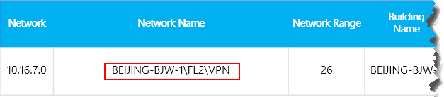

# <a name="quality-of-experience-review-guide"></a>Guida sul controllo della qualità dell'esperienza

<!-- Note that this link to the Word doc is intentionally NOT the aka.ms/qerquide link -->
Questa guida riguarda la fase di valori di unità per Microsoft teams e Skype for business online. È possibile [scaricare una versione di Word](https://github.com/MicrosoftDocs/OfficeDocs-SkypeForBusiness/blob/live/Teams/downloads/quality-of-experience-review-guide.docx?raw=true) di questa guida.

## <a name="introduction"></a>Introduzione

Per avere il massimo impatto sul miglioramento dell'esperienza utente, le organizzazioni devono operazionalizzare le aree principali visualizzate nella figura seguente. Altre aree includono l'identificazione di attività operative, la definizione di obiettivi per le metriche di qualità, la determinazione delle metriche da usare per valutare il successo dell'organizzazione e la restrizione delle aree di indagine in base alle esigenze.


_Figura 1-aree operative chiave descritte in questa guida_

Valutando e rimediando continuamente le aree descritte in questa guida, è possibile ridurre le proprie potenzialità per influire negativamente sulla qualità dell'esperienza degli utenti. La maggior parte dei problemi di esperienza utente incontrati in una distribuzione può essere raggruppata nelle categorie seguenti:

-   Firewall o configurazione proxy incompleta
-   Scarsa copertura Wi-Fi
-   Larghezza di banda insufficiente
-   VPN
-   Versioni e driver client non coerenti o obsoleti
-   Dispositivi audio non ottimizzati o incorporati
-   Subnet problematiche o dispositivi di rete

Attraverso una pianificazione e una progettazione adeguate prima di distribuire Team o Skype for business online, è possibile ridurre la quantità di risorse necessarie per mantenere le esperienze di alta qualità.

Questa guida è incentrata sull'uso di Call Quality Dashboard (Call Quality Dashboard) online come strumento principale per segnalare e analizzare ogni area, con un'enfasi particolare sull'audio per massimizzare l'adozione e l'impatto. Gli eventuali miglioramenti apportati alla rete per migliorare l'esperienza audio verranno tradotti direttamente anche nei miglioramenti della condivisione di video e desktop.

Per accelerare la valutazione, vengono forniti [due modelli di Call Quality dashboard curati](https://aka.ms/qertemplates) : uno è per la gestione di tutte le reti e l'altro è filtrato solo per le reti gestite (interne). Anche se i report tutti i modelli di reti sono configurati per visualizzare informazioni su edifici e reti, è comunque possibile usarli mentre si lavora per raccogliere e caricare informazioni sulla creazione. Il caricamento di informazioni sulla creazione in Call Quality dashboard consente al servizio di migliorare la creazione di report aggiungendo informazioni personalizzate per la creazione, la rete e la posizione mentre si differenziano internamente dalle subnet esterne. Per altre informazioni, vedere [creazione](#building-mapping) di un mapping più avanti in questa guida.

### <a name="intended-audience"></a>Destinatari previsti

Questa guida è destinata a essere usata dalle parti interessate partner e clienti con ruoli come lead di collaborazione/architetto, consulente, specialista per la gestione/adozione dei cambiamenti, il supporto tecnico lead, il lead di rete, il lead desktop e l'amministratore IT.

Questa guida è destinata anche all'uso da parte dei campioni di qualità designati. Per altre informazioni, Vedi [il ruolo campione di qualità](4-envision-plan-my-service-management.md#the-quality-champion-role).

## <a name="assign-roles-for-accessing-cqd"></a>Assegnare ruoli per l'accesso a Call Quality dashboard

Prima di usare questa guida, verificare che siano assegnati i [ruoli](https://docs.microsoft.com/office365/admin/add-users/about-admin-roles) del tenant appropriati in modo da poter accedere a Call Quality dashboard.

Questa tabella Mostra gli elementi che ogni ruolo può eseguire in Call Quality Dashboard:


|  |Visualizzare i report  |Visualizzare i campi EUII  |Creare report  |Caricare i dati dell'edificio  |
|---------|:-------:|:-------:|:-------:|:-------:|
|Amministratore globale di Office 365     |Sì         |Sì         |Sì         |Supporto per più paesi         |
|Amministratore del servizio Teams     |Sì         |Sì         |Sì         |Supporto per più paesi         |
|Amministratore comunicazioni Teams     |Sì         |Sì         |Sì         |Supporto per più paesi         |
|Tecnico supporto comunicazioni Teams     |Sì         |Sì         |Sì         |No         |
|Specialista supporto comunicazioni Teams     |Sì         |No         |Sì         |No         |
|Amministratore di Skype for business     |Sì         |Sì         |Sì         |Supporto per più paesi         |
|Lettore globale di Azure AD |Sì         |Sì         |Sì         |No         |
|Lettore di report di Office 365<sup>1</sup>     |Sì         |No         |Sì         |No         |

<sup>1</sup> oltre a leggere i report di Call Quality dashboard, il lettore di report di Office 365 può visualizzare tutti i [report attività](https://support.office.com/article/activity-reports-0d6dfb17-8582-4172-a9a9-aed798150263) nell'interfaccia di amministrazione e tutti i report del [pacchetto di contenuto adoption di Microsoft 365](https://support.office.com/article/Office-365-Adoption-content-pack-77ff780d-ab19-4553-adea-09cb65ad0f1f).

> [!NOTE]
> Se non si vedono EUII (informazioni identificative per gli utenti finali) e si ha uno dei ruoli consentiti per vedere queste informazioni, tenere presente che Call Quality dashboard mantiene solo EUII per 30 giorni. Viene eliminato qualsiasi valore antecedente di 30 giorni.

## <a name="what-is-quality"></a>Che cos'è la qualità?

Quando si discute di qualità in teams e Skype for business, è importante definire il termine per ottenere una comprensione comune. La qualità, come definita qui, è una combinazione di metriche dei servizi e esperienza utente.

<!-- Note: need to update graphic-->


_Figura 2-che cos'è la qualità?_

### <a name="service-metrics"></a>Metriche del servizio

Le metriche dei servizi sono costituite da specifiche metriche basate sul client. Durante ogni chiamata, il client raccoglie informazioni di telemetria sulla chiamata e invia un report alla fine di ogni chiamata a cui è possibile accedere in seguito tramite Call Quality dashboard o [Call Analytics](https://techcommunity.microsoft.com/t5/Skype-for-Business-Blog/Introducing-Call-Analytics/ba-p/57309). Queste metriche includono:

-   Tasso di flusso scadente
-   Tasso di errore di configurazione
-   Calo tasso di errore


#### <a name="poor-stream-rate"></a>Tasso di flusso scadente

La bassa velocità di flusso (PSR) rappresenta la percentuale complessiva dell'organizzazione di flussi con qualità scadente. Questa metrica è destinata ad evidenziare le aree in cui l'organizzazione può concentrare lo sforzo per avere l'impatto più forte sulla riduzione di questo valore e sul miglioramento dell'esperienza utente, motivo per cui le [reti gestite](#managed-vs-unmanaged-networks) costituiscono lo stato di primaria importanza quando si esaminano i PSR. Anche gli utenti esterni sono importanti, ma le indagini variano in base a un'organizzazione. Valutare la possibilità di fornire le procedure consigliate per gli utenti esterni ed esaminare le chiamate esterne indipendentemente dall'organizzazione complessiva.

La misurazione effettiva in Call Quality dashboard varia in base al carico di lavoro, ma ai fini della revisione dell'esperienza di qualità concentriamoci principalmente sulla misurazione della _percentuale di scarsità audio_ . PSR è costituito dalle cinque medie metriche della rete descritte nella tabella seguente. Affinché un flusso venga classificato come scadente, solo una metrica deve superare la soglia definita. Per altre informazioni sul processo di classificazione del flusso, vedere [questo articolo](stream-classification-in-call-quality-dashboard.md).

> [!Note]
> Call Quality dashboard fornisce il "povero a causa di..." misure per comprendere meglio quale condizione ha causato la classificazione del flusso come scadente.


_Tabella 1-metriche audio di qualità scadente_

| Media metrica     | Descrizione     | Esperienza utente |
|-------------|-----------------|-----------------|
| Jitter \>30 ms        | Questa è la variazione media di ritardo tra i pacchetti successivi. I team e Skype for business possono adattarsi ad alcuni livelli di jitter attraverso il buffering. Solo quando il jitter supera il buffering che un partecipante Nota gli effetti di jitter.      | I pacchetti che arrivano a velocità diverse causano la voce di un altoparlante a un suono robotico.   |
| Tasso \>di perdita di pacchetti 10% o 0,1        | Questa operazione viene spesso definita come percentuale di pacchetti persi. La perdita di pacchetti influenza direttamente la qualità audio, da piccoli pacchetti persi singoli che non hanno quasi alcun impatto sulle perdite di burst di back-to-back che causano il ritaglio completo dell'audio.     | I pacchetti che vengono eliminati e che non arrivano alla destinazione desiderata causano lacune nel supporto, con sillabe perse e parole e video e condivisione dispersivi. |
| Ora \>di andata e ritorno 500 ms        | Questo è il tempo necessario per ottenere un pacchetto IP dal punto a al punto B e viceversa al punto a. Questo ritardo di propagazione della rete è legato alla distanza fisica tra i due punti e alla velocità della luce e include un sovraccarico aggiuntivo adottato dai vari dispositivi nel percorso di rete.      | I pacchetti che impiegano troppo tempo per arrivare a destinazione causano un effetto walkie-talkie.   |
| NMOS degradazione \>media 1,0         | Media del Punteggio medio di [valutazione (NMOS)](https://docs.microsoft.com/previous-versions/office/communications-server/bb894481(v=office.12)#network-mos) per il flusso. Rappresenta la quantità di perdite di rete e jitter che ha influenzato la qualità dell'audio ricevuto che ha causato l'eliminazione di NMOS da più di un punto. | Si tratta di una combinazione di jitter, perdita di pacchetti e, in misura minore, maggiore tempo di andata e ritorno. L'utente potrebbe provare una combinazione di questi sintomi.   |
| Rapporto medio tra campioni \>nascosti 7% o 0,07 | Rapporto medio del numero di fotogrammi audio con campioni nascosti generati dalla perdita di pacchetti per la guarigione del numero totale di fotogrammi audio. Un esempio di audio nascosto è una tecnica usata per attenuare la transizione brusca che in genere viene causata da pacchetti di rete eliminati.      | I valori alti indicano che i livelli significativi di occultamento delle perdite sono stati applicati e hanno provocato l'audio distorto o perso.     |

#### <a name="setup-failure-rate"></a>Tasso di errore di configurazione

La frequenza di errore di configurazione, altrimenti nota come misura della _percentuale di errore di configurazione della chiamata totale_ in Call Quality dashboard, è il numero di flussi in cui non è stato possibile stabilire il percorso del supporto tra gli endpoint all'inizio della chiamata.

Rappresenta qualsiasi flusso multimediale che non è stato possibile stabilire. In base alla gravità dell'impatto sull'esperienza utente misurata qui, l'obiettivo è quello di ridurre il valore al più vicino possibile allo zero. Un valore elevato per questa metrica è più comune nelle nuove distribuzioni con regole del firewall incomplete rispetto a una distribuzione matura, ma è comunque importante controllarle regolarmente.

Questa metrica viene calcolata prendendo il numero totale di flussi che non sono stati configurati in base al numero totale di flussi che hanno inviato un record di dettaglio delle chiamate (CDR) riuscito:

-   **Tasso di errore di configurazione** = Total call setup non riuscito numero di flusso/totale CDR disponibile Conteggio flusso

#### <a name="drop-failure-rate"></a>Calo tasso di errore

La percentuale di errore di rientro, altrimenti nota come misura della _percentuale di errore di chiamata totale rilasciata_ in Call Quality dashboard, è quella dei flussi definiti correttamente in cui il percorso del supporto non è stato interrotto normalmente.

Rappresenta qualsiasi flusso multimediale terminato in modo imprevisto. Anche se l'impatto di questa operazione non è così grave come un flusso che non è stato configurato, influirà negativamente sull'esperienza utente. Le cadute di media improvvise e frequenti non solo possono avere un impatto grave sull'esperienza utente, ma determinano la necessità di riconnettersi agli utenti, con conseguente perdita di produttività.

La metrica viene calcolata prendendo il numero totale di flussi eliminati diviso per il conteggio totale dei flussi configurati correttamente:

-   **Drop failure rate** = Total Call Dropped count flusso/Total call setup numero di flusso riuscito

### <a name="define-your-target-metrics"></a>Definire le metriche di destinazione

In questa sezione vengono illustrate alcune delle metriche dei servizi principali che vengono usate per valutare l'integrità dei servizi. Valutando e guidando continuamente gli sforzi per mantenere queste metriche al di sotto dei loro obiettivi definiti, ti aiuterai ad assicurarti che gli utenti verifichino una qualità di chiamata affidabile e coerente. Per iniziare, vengono fornite le destinazioni seguenti.

_Tabella 2-metriche di valutazione dell'integrità di destinazione principali_
<table>
<tr>
<th rowspan="2" colspan="2" valign="center">Tipo di rete</th><th rowspan="1">Obiettivi di qualità</th><th colspan="2">Obiettivi di affidabilità</th></tr>
<tr><th>Tasso di flusso audio scadente</th><th>Tasso di errore di configurazione</th><th>Calo tasso di errore</th></tr>
<tr><td rowspan="2"><strong>All</strong></td><td>Interno</td><td>2,0%</td><td>0,5%</td><td>2,0%</td></tr>
<tr><td>Generale</td><td>3,0%</td><td>1,0%</td><td>3,0%</td></tr>
<tr><td rowspan="5"><strong>Conferenze</strong></td><td>Interno</td><td>2,0%</td><td>0,5%</td><td>2,0%</td></tr>
<tr><td>Interno cablato</td><td>1,0%</td><td>0,5%</td><td>1,0%</td></tr>
<tr><td>Wi-Fi 5 GHz interno</td><td>1,0%</td><td>0,5%</td><td>1,0%</td></tr>
<tr><td>Wi-Fi 2,4 GHz interno</td><td>2,0%</td><td>0,5%</td><td>2,0%</td></tr>
<tr><td>Generale</td><td>2,0%</td><td>0,5%</td><td>3,0%</td></tr>
<tr><td rowspan="4"><strong>P2P</strong></td><td>Interno</td><td>2,0%</td><td>0,5%</td><td>2,0%</td></tr>
<tr><td>Cablato/Wi-Fi 5 GHz interno</td><td>1,0%</td><td>0,5%</td><td>1,0%</td></tr>
<tr><td>Cablato/Wi-Fi 5 GHz globale</td><td>2,0%</td><td>1,0%</td><td>1,0%</td></tr>
<tr><td>Generale</td><td>2,0%</td><td>1,0%</td><td>3,0%</td></tr>
</table>


È importante discutere e definire gli obiettivi dell'organizzazione per soddisfare gli obiettivi aziendali.

### <a name="user-experience"></a>Esperienza utente

L'analisi dell'esperienza utente è più l'arte che la scienza, perché le metriche riunite qui non sempre significano che c'è un problema con la rete o il servizio, ma piuttosto, indicano semplicemente che l'utente percepisce un problema. Microsoft offre un meccanismo di rilevamento incorporato, noto come tasso di chiamata (RMC), che consente di valutare l'esperienza complessiva degli utenti. RMC ti aiuterà a rispondere alle seguenti domande dal punto di vista degli utenti:

-   Si sa come usare la soluzione?
-   La soluzione è facile da usare e intuitiva e supporta le esigenze di comunicazione quotidiane?
-   La soluzione aiuta a ottenere il lavoro?
-   Qual è la percezione complessiva della soluzione?
-   È possibile usare la soluzione in qualsiasi momento, indipendentemente dalla posizione in cui si trova?
-   È possibile configurare e gestire una chiamata?

#### <a name="rate-my-call"></a>Votare la chiamata 

Vota la mia chiamata (RMC) è integrata in teams e Skype for business e viene automaticamente configurata per essere visualizzata al partecipante dopo uno ogni 10 chiamate o 10%. Questo breve sondaggio chiede all'utente di valutare la chiamata e di specificare un piccolo contesto per il motivo per cui la qualità delle chiamate potrebbe essere stata scadente. Una valutazione di uno o due è considerata scadente, da tre a quattro è buona e cinque è eccellente. Anche se è un po' un indicatore di ritardo, questa è una metrica utile per scoprire i problemi che le metriche dei servizi possono perdere.

> [!Note]
> Fino a quando gli utenti vengono istruiti per rispondere ai sondaggi RMC fornendo un buon feedback oltre al male, le risposte in genere ritornano in modo estremamente negativo. La maggior parte degli utenti risponde solo quando la qualità della chiamata è scadente. Per questo motivo, i report RMC potrebbero essere sbilanciati verso il lato scadente anche quando le metriche dei servizi sono valide.

Puoi usare Call Quality dashboard per segnalare le risposte degli utenti RMC e i report di esempio sono inclusi nel modello Call Quality dashboard. Tuttavia, non vengono discussi in dettaglio in questa guida. Per altre informazioni su RMC in Skype for business online e indicazioni per educare gli utenti a fornire utili risposte RMC, vedere [questo post di Blog](https://blogs.technet.microsoft.com/jenstr/2015/05/05/rate-my-call-in-skype-for-business-2015/).

#### <a name="client-and-device-readiness"></a>Disponibilità di client e dispositivi

Per garantire agli utenti un'esperienza utente coerente e positiva, è necessaria una strategia di client e dispositivi solidi. Alcuni principi chiave guidano ogni strategia di preparazione.

##### <a name="client-readiness"></a>Disponibilità del client

Una strategia di preparazione del client forte assicura che gli utenti eseguano la versione più recente del client, godendo di una migliore esperienza possibile. Microsoft applica regolarmente le patch al client Skype for business; Verificare che sia sempre aggiornato nell'ambiente sia fondamentale per il successo globale. È anche importante ricordarsi di patch di rete, video, USB e driver audio, perché spesso sono trascurati e possono influire sull'esperienza dell'utente. Valutare l'aggiunta di driver di rete, Wi-Fi, video, USB e audio al processo di gestione delle patch corrente.

Ti consigliamo di non lasciare che le versioni del client cadano dietro di più di sei mesi. Se si usa Office a portata di clic, si è già tenuti aggiornati dal servizio. Usare le [versioni client](#client-versions)incluse, come descritto più avanti in questa guida, per assistervi in questo processo. È anche possibile sfruttare i report di esempio tasso di chiamata per migliorare ulteriormente la strategia di preparazione del client.

> [!IMPORTANT]
> Attualmente i client di team vengono distribuiti e aggiornati automaticamente tramite la rete di distribuzione dei contenuti di Azure e verranno mantenuti aggiornati dal servizio. A questo scopo, la disponibilità del cliente e le attività investigative non sono applicabili ai team.


##### <a name="device-readiness"></a>Conformità del dispositivo

Nessuna strategia singola può influire sull'esperienza utente in più rispetto alla strategia di preparazione del dispositivo. La maggior parte delle organizzazioni è felice di rimuovere dispositivi non necessari, ad esempio telefoni da tavolo o altri dispositivi audio dedicati, e spesso si tratta di una giustificazione principale per il passaggio a teams o Skype for business. Tuttavia, le stesse organizzazioni talvolta esitano a specificare dispositivi sostitutivi, anche se questi dispositivi sono meno costosi. I computer portatili e i PC moderni, anche se dotati di microfono e altoparlante integrati, non sono ottimizzati per la funzionalità VoIP (Voice over IP) di classe business. Questo spesso crea una scarsa esperienza per tutti i partecipanti, in particolare se l'oratore si trova in un ambiente rumoroso. Il programma di certificazione dei dispositivi Microsoft garantisce che quando un utente partecipa a una telefonata usando qualsiasi dispositivo certificato per Teams o Skype for business, produce un'esperienza superiore a un dispositivo non certificato. 

È sempre consigliabile che i team e gli utenti di Skype for business usino un auricolare o un altoparlante certificato quando partecipano a una chiamata vocale tramite il client desktop. Per altre informazioni sui dispositivi certificati Microsoft, vedere questi articoli sul [programma di certificazione](/SkypeForBusiness/certification/overview) e visualizzare il [Catalogo soluzioni partner](https://partnersolutions.skypeforbusiness.com/solutionscatalog/personal-peripherals-pcs). Usare il [report dispositivi](#devices), descritto più avanti in questa guida, per assistenza nella gestione dei dispositivi.


### <a name="categories-of-quality"></a>Categorie di qualità

Il successo di operationalizing una distribuzione affidabile e di alta qualità dipende dal rigore operativo della tua costruzione. In particolare, prestare particolare attenzione alle tre categorie illustrate nella figura seguente; Questi sono i punti di riferimento di questa guida:

-   **Rete:** Qualità audio incentrata sull'uso di metriche di flusso scarso (PSR), utilizzo TCP, subnet Wired e wireless e identificazione dell'utilizzo di proxy HTTP e VPN.

-   **Endpoint:** Dispositivi audio e versioni client (solo Skype for business).

-   **Gestione dei servizi:** Questa categoria comprende due sezioni:

    -   Per prima cosa, la responsabilità di Microsoft è gestire e mantenere i team e i servizi Skype for business online.

    -   In secondo luogo, le attività che l'organizzazione deve gestire per garantire un accesso affidabile al servizio, ad esempio l'aggiornamento delle informazioni sulla creazione e la gestione dei firewall per i nuovi indirizzi IP di Office 365, quando l'infrastruttura viene aggiunta al servizio.


_Figura 3-categorie critiche per i team e la distribuzione di Skype for business online_

L'elemento grafico seguente illustra le attività che è necessario eseguire per ogni categoria. È consigliabile eseguire queste attività una volta alla settimana, come minimo.

La prima volta che si eseguono queste attività sarà necessario uno sforzo maggiore rispetto alle iterazioni successive, poiché molte di queste categorie richiedono la convalida delle configurazioni di distribuzione. Dopo aver raggiunto lo stato desiderato soddisfando le destinazioni definite, l'esecuzione di queste attività consentirà di mantenere tale stato.

<!--  This is a net new graphic, never was included in the online article. OOPS! -->


#### <a name="service-management-tasks"></a>Attività di gestione dei servizi

In un mondo cloud-First è necessario eseguire alcune attività di gestione dei servizi per mantenere le esperienze degli utenti di alta qualità. Queste attività variano da garantire che la larghezza di banda sia sufficiente per raggiungere il servizio senza saturare i collegamenti Internet, convalidando la qualità del servizio (QoS) in tutte le aree di rete gestite e, infine, rimanendo in primo piano sugli [intervalli IP di Office 365 nei firewall](https://aka.ms/o365ips).

#### <a name="network-tasks"></a>Attività di rete

Esistono due categorie di attività di rete: affidabilità e qualità. L'affidabilità si basa sulla misurazione della capacità dell'utente di effettuare chiamate con successo e rimanere connessi. La qualità si basa sulla telemetria aggregata inviata ai team e Skype for business online dal client dell'utente durante la chiamata e dopo la fine. 

Considerato l'impatto critico che l'affidabilità ha sull'esperienza utente, è importante iniziare a valutare e analizzare tali metriche prima di tuffarsi in qualità. 

#### <a name="endpoints-tasks"></a>Attività endpoint

L'attività principale in questa categoria consiste nel convalidare le versioni client che usano Skype for business sulle build desktop degli ultimi sei mesi, per garantire agli utenti il beneficio delle continue ottimizzazioni apportate al client desktop Skype for business. Questo semplifica inoltre le attività complessive di gestione dei client e offre un'esperienza utente coerente.

L'altra area importante è il monitoraggio dei dispositivi prevalenti nella distribuzione e la Guida all'uso di dispositivi certificati per garantire la migliore esperienza utente.


> [!IMPORTANT]
> Attualmente i client di team vengono distribuiti e aggiornati automaticamente tramite la rete di distribuzione dei contenuti di Azure e verranno mantenuti aggiornati dal servizio. La disponibilità del client e le attività investigative non sono applicabili ai team.

## <a name="cqd-basics"></a>Nozioni di base su Call Quality dashboard

Questa sezione descrive le nozioni fondamentali sull'uso di Call Quality dashboard. Vengono fornite indicazioni per gli argomenti seguenti:

-   Che cos'è Call Quality dashboard?
-   Aspettative con Call Quality dashboard
-   Ricerca dell'ID tenant
-   Creazione di report in Microsoft teams versus Skype for business
-   Classificazioni First versus Second
-   Dimensioni, misure e filtri
-   Flussi versus chiamate
-   Chiamate valide, scadenti e non classificate
-   Subnet comuni

Per una formazione e risorse più approfondite, vedere l' [appendice](#other-resources).

### <a name="what-is-cqd"></a>Che cos'è Call Quality dashboard?

Si usa il dashboard qualità chiamata (Call Quality Dashboard) per ottenere informazioni sulla qualità delle chiamate effettuate tramite Team e servizi Skype for business. Call Quality dashboard è progettato per aiutare gli amministratori di Skype for business e teams e gli ingegneri di rete a ottimizzare la rete e a tenere d'occhio la qualità, l'affidabilità e l'esperienza utente. Call Quality dashboard analizza la telemetria aggregata per un'intera organizzazione in cui i modelli generali possono diventare evidenti, consentendo al personale di effettuare valutazioni informate e pianificare le attività di bonifica per massimizzare l'impatto. Call Quality dashboard fornisce report di metriche che offrono informazioni generali sulla qualità, l'affidabilità e l'esperienza utente.

Questa guida ti aiuterà a comprendere i concetti di base di Call Quality dashboard per massimizzare l'impatto che puoi fare per migliorare l'esperienza degli utenti con team o Skype for business online. Altre risorse di Call Quality dashboard possono essere trovate nell' [appendice](#other-resources).

### <a name="expectations-using-cqd"></a>Aspettative con Call Quality dashboard

Call Quality dashboard, anche se utile per analizzare le tendenze e le subnet, non sempre offre una causa specifica per un determinato scenario. È importante capire questo aspetto e impostare l'aspettativa corretta quando si usa call Quality Dashboard:

-   Call Quality Dashboard non offre la causa radice per ogni scenario.
-   Call Quality Dashboard non conterrà flussi di sistema telefonico o di audioconferenza.
-   Call Quality dashboard chiamerà le aree per ulteriori indagini in base alle tendenze.

### <a name="report-editions"></a>Edizioni di report

In Call Quality dashboard online sono disponibili due edizioni di report: riepilogo e dettagli. Usare il menu a discesa situato nella barra nella parte superiore della schermata per aprire un'edizione di report. Il nome dell'edizione del report selezionata viene visualizzato nella parte superiore dello schermo.

-   I report di riepilogo sono statici e non possono essere modificati, scaricati o esportati. 
-   I report dettagliati sono completamente personalizzabili e possono essere scaricati in un file CSV, esportati o clonati.

Per una descrizione completa della differenza tra le due edizioni, vedere [questo articolo](turning-on-and-using-call-quality-dashboard.md).

Novità di gennaio 2020: [scaricare i modelli di query di Power BI per Call Quality dashboard](https://github.com/MicrosoftDocs/OfficeDocs-SkypeForBusiness/blob/live/Teams/downloads/CQD-Power-BI-query-templates.zip?raw=true). Modelli di Power BI personalizzabili che è possibile usare per analizzare e segnalare i dati di Call Quality dashboard.

_Figura 4-categorie di report Call Quality dashboard_

I report di riepilogo sono suddivisi in quattro categorie:

-   I **report di riepilogo** sono incentrati sull'analisi delle tendenze qualitative con i report giornalieri, mensili e della tabella per facilitare l'identificazione delle subnet con qualità scadente. Questa è la pagina di destinazione predefinita quando si accede per la prima volta a Call Quality dashboard online.
-   I **report sulla posizione** sono incentrati sull'analisi delle tendenze qualitative in base alle informazioni sulla posizione. Per usare questi report, è necessario aver caricato un file di costruzione.
-   I **report sull'affidabilità si riferiscono** all'analisi delle tendenze di affidabilità per l'audio, il video, la condivisione dello schermo basata su video (VBSS) e la condivisione delle app.
-   I **report sulla qualità dei** risultati dell'esperienza sono una versione "snella" dei modelli di QER dettagliati, focalizzati sulle aree chiave per analizzare la qualità audio e l'affidabilità.

### <a name="report-types"></a>Tipi di report

È possibile scegliere tra due tipi di report in Call Quality dashboard, a seconda di come si vogliono visualizzare i dati. Anche se questa guida non comprende le specifiche della creazione di un tipo di report su un altro, i modelli di Call Quality dashboard di QER consentono di usare i grafici personalizzabili e i report di tabella:

-   I report grafici creano grafici a barre grafici per rappresentare i dati in un formato visivo. I report del grafico vengono usati in modo ottimale per visualizzare i dati in un determinato periodo di tempo.
-   I report tabella sono utili per esaminare singole misure e dimensioni quando si esportano i report in file CSV per la manipolazione in Microsoft Excel.

### <a name="tenant-id"></a>ID tenant

Alcuni report di Call Quality Dashboard richiedono l'inserimento di un filtro per l'ID tenant. A causa del modo in cui call Quality dashboard aggrega i dati, viene inclusa la telemetria dei partecipanti federati. Anche se questa operazione può rivelarsi utile quando si analizzano le tendenze, i report client e dispositivi richiedono la filtrazione dei dati in un tenant specifico per escludere la telemetria del partecipante federato. Se non si conosce l'ID tenant, è possibile usare uno dei metodi seguenti per trovarlo.

> [!Note]
> Questi metodi richiedono le autorizzazioni seguenti:<ul><li>Ruolo amministratore globale</li><li>Ruolo di amministratore di Skype for business</li></ul>

#### <a name="azure-portal"></a>Portale di Azure

1.  Accedere al portale di Microsoft Azure:<https://portal.azure.com>

2.  Selezionare **Azure Active Directory**.

3.  In **Gestisci**selezionare **Proprietà**. L'ID tenant viene visualizzato nella casella **ID directory** .

#### <a name="azure-powershell"></a>PowerShell di Azure

1. [Installare il modulo di gestione dei servizi di Microsoft Azure PowerShell](https://docs.microsoft.com/powershell/azure/servicemanagement/install-azure-ps?view=azuresmps-4.0.0).

2. Aprire una finestra di comando di PowerShell di Azure ed eseguire lo script seguente immettendo le credenziali di Office 365 quando richiesto: 

   ```PowerShell
   Login-AzureRmAccount
   ```

3. L'ID tenant è elencato nell'output.

#### <a name="skype-for-business-online-admin-center"></a>Interfaccia di amministrazione di Skype for business online

1.  Passare a <https://portal.office.com>.

2.  Accedere con l'account dell'organizzazione dell'amministratore del tenant.

3.  Selezionare **Skype for business** in **centri di amministrazione**.

4.  L'ID tenant è elencato come **ID organizzazione** nella pagina di benvenuto.

#### <a name="skype-for-business-online-using-powershell"></a>Skype for business online con PowerShell

1. [Configurare il computer per Windows PowerShell](/SkypeForBusiness/set-up-your-computer-for-windows-powershell/set-up-your-computer-for-windows-powershell).

2. Eseguire il comando seguente:

   ```PowerShell
   (Get-cstenant).tenantid
   ```

3. L'ID tenant viene visualizzato come GUID.

### <a name="teams-vs-skype-for-business"></a>Teams vs Skype for business

Call Quality dashboard può segnalare sia in team che in telemetria Skype for business. Tuttavia, potrebbero esserci momenti in cui vuoi sviluppare un report per guardare la telemetria di teams separata da Skype for business.

#### <a name="summary-reports"></a>Report di riepilogo

Per modificare la pagina dei report di riepilogo per visualizzare solo i team o Skype for business, selezionare il menu a discesa **filtro prodotto** nella parte superiore dello schermo e quindi selezionare il prodotto desiderato.


_Figura 5-Selezionare un filtro prodotto_

#### <a name="detailed-reports"></a>Report dettagliati

Per filtrare tutti i report dettagliati, nella barra del browser accodare il codice seguente alla fine dell'URL:

```PowerShell
/filter/[AllStreams].[Is Teams]|[FALSE]
```

**Esempio**

```https://cqd.lync.com/cqd/#/1234567/2018-5/filter/[AllStreams].[Is Teams]|[FALSE]```

Per altre informazioni sui filtri URL, vedere [filtrare i report](#filtering-reports) più avanti in questa sezione.

Per filtrare un singolo report dettagliato, aggiungere il filtro ``Is Teams`` al report e impostarlo su true o false. Per altre informazioni, vedere [modifica di report](#editing-reports) più avanti in questa sezione.


_Figura 6-aggiunta di un filtro Microsoft Teams a un report_


### <a name="managed-vs-unmanaged-networks"></a>Reti gestite e non gestite

Per impostazione predefinita, tutti gli endpoint in Call Quality dashboard sono classificati come esterni. Non appena viene introdotto un file di costruzione, possiamo iniziare a esaminare i dati degli endpoint gestiti. Come descritto in precedenza, le reti in Call Quality dashboard sono definite come segue:

-   Una _rete gestita_, spesso definita internamente o all'interno, può essere influenzata e controllata dall'organizzazione. Questo include la LAN interna, la WAN remota e la rete VPN.
-   L'organizzazione non può essere influenzata o controllata da una _rete non gestita_, spesso definita esternamente o all'esterno. Un esempio di rete non gestita è una rete alberghiera o aeroportuale.

### <a name="dimensions-measures-and-filters"></a>Dimensioni, misure e filtri

Una query Call Quality dashboard ben formata contiene tutti e tre i parametri seguenti:

-   **Dimensione:** Come si vuole eseguire il pivot sui dati.

-   **Misura:** Cosa voglio segnalare.

-   **Filtro:** Come si vuole ridurre il DataSet restituito dalla query.

Un altro modo per vedere la _dimensione_ è la funzione di raggruppamento, una _misura_ sono i dati che mi interessano e un _filtro_ è il modo in cui voglio limitare i risultati a quelli rilevanti per la query.

Un esempio di query ben formata è **Mostra i flussi poveri [measure] per subnet [Dimension] per l'edificio 6 [Filter]**. Per altre informazioni, vedere [dimensioni e misure disponibili in Call Quality dashboard](https://aka.ms/cqd-dm).

### <a name="first-vs-second"></a>Primo contro secondo 

Molte delle dimensioni e delle misure in Call Quality dashboard sono classificate come First o Second. Call Quality Dashboard non usa campi chiamante/chiamato, che sono stati rinominati _prima_ e _seconda_ perché sono presenti passaggi intermedi tra il chiamante e il chiamato. La logica seguente determina quale endpoint in questione è etichettato come primo:

-   **Prima di tutto** sarà sempre un endpoint server (Conference Server, Mediation Server e così via) se un server è coinvolto nel flusso o nella chiamata.

-   Il **secondo** sarà sempre un endpoint client, a meno che lo Stream non si trovi tra due endpoint server.

-   Se entrambi gli endpoint sono dello stesso tipo, la scelta della prima si basa sull'ordinamento interno della categoria agente utente. Ciò assicura che l'ordinamento sia coerente.

Per altre informazioni su come determinare il primo o il secondo endpoint quando sono uguali, vedere [dimensioni e misure disponibili in Call Quality dashboard](https://aka.ms/cqd-dm).

### <a name="stream-vs-call"></a>Stream vs. chiamata

È necessario comprendere la differenza tra una chiamata e uno Stream per scegliere correttamente le dimensioni o le misure da esaminare in Call Quality dashboard. Anche se lo stato attivo principale di Call Quality dashboard è sui flussi, sono disponibili anche le misurazioni basate su chiamata.

-   **Stream:** Un _flusso_ esiste tra due solo endpoint. È disponibile un solo flusso per ogni direzione e sono necessari due flussi per la comunicazione. I flussi sono utili per analizzare edifici, reti o sottoreti. In alcuni casi, sia la chiamata che il flusso vengono usati nel nome della misura (ad esempio, chiama Stream setup o chiama Stream). Questi sono ancora classificati come flussi.

-   **Chiamata:** Una _chiamata_ è un raggruppamento di tutti i flussi di tutti i partecipanti. Una chiamata è costituita da-almeno due flussi. Una singola chiamata avrà almeno due endpoint, ognuno con un minimo di un flusso.

Per altre informazioni sul fatto che la dimensione o la misura faccia riferimento a una chiamata o a un flusso, vedere [dimensioni e misure disponibili in Call Quality dashboard](https://aka.ms/cqd-dm)

### <a name="good-poor-and-unclassified-calls"></a>Chiamate valide, scadenti e non classificate

Una chiamata viene categorizzata come valida, scadente o non classificata. Prendiamo un momento per parlare di ognuno in modo più dettagliato.

-   **Buona o povera:** Una chiamata buona o povera è costituita da una chiamata che contiene un set completo di metriche del servizio, per cui è stato generato e ricevuto un report QoE completo dal servizio. Per determinare se un flusso è buono o scadente, è descritto [in precedenza in questa guida](#poor-stream-rate).

-   Non **Classificato:** Un flusso non classificato non contiene un set completo di metriche dei servizi. Queste possono essere chiamate brevi, in genere inferiori a 60 secondi, in cui non è stato possibile calcolare la media e non è stato generato un report QoE. Il motivo più comune per cui le chiamate non sono classificate è che l'utilizzo di pacchetti non è minimo. Un esempio di questo è un partecipante che partecipa a una riunione in sordina e non parla mai. Il partecipante riceve, ma non trasmette, elementi multimediali. Senza la trasmissione di elementi multimediali, non saranno disponibili metriche per Call Quality dashboard da usare per classificare il flusso multimediale in uscita dell'endpoint.

Per altre informazioni sul processo di classificazione del flusso, vedere [questo articolo](stream-classification-in-call-quality-dashboard.md).

### <a name="common-subnets"></a>Subnet comuni

Le subnet comuni sono sottoreti private specifiche usate da Alberghi, reti Home, hotspot e aree simili. Queste subnet sono difficili da valutare a causa del loro uso diffuso. Se l'organizzazione usa una di queste subnet comuni, è consigliabile trasferirla in un'altra subnet. Questo semplifica la creazione di report in Call Quality dashboard. Una volta notati, i report nel modello tutte le reti sono stati configurati in modo da escludere queste subnet per eliminarle come origine di qualità scadente. Le subnet comuni sono definite di seguito. il loro impatto varia a seconda dell'organizzazione.

-   10.0.0.0/24
-   192.168.0.0/24
-   192.168.1.0/24
-   192.168.2.0/24
-   172.20.10.0/24
-   192.168.43.0/24

Quando si esamina una rete gestita che usa una subnet comune, è necessario usare la seconda dimensione IP locale riflessiva per raggruppare le subnet. Questa dimensione contiene l'indirizzo IP pubblico dell'endpoint.

## <a name="cqd-online"></a>Call Quality dashboard online

Questa sezione descrive le nozioni fondamentali sull'accesso a Call Quality dashboard. Vengono fornite indicazioni per gli argomenti seguenti:

-   Accesso a Call Quality dashboard online
-   Guida introduttiva a Call Quality dashboard
-   Modifica di report in Call Quality dashboard
-   Filtrare i report in Call Quality dashboard
-   Importazione di report in Call Quality dashboard

Per una formazione e risorse più approfondite, vedere l' [appendice](#other-resources).

### <a name="access-cqd-online"></a>Accedere a Call Quality dashboard online

È possibile accedere a Call Quality dashboard uno dei tre modi seguenti:

-   Passare a <https://cqd.lync.com>.

-   Accedere all'interfaccia di **amministrazione di Microsoft teams** e selezionare il collegamento a Call Quality dashboard, come illustrato nella figura seguente.


_Figura 7-accesso a Call Quality dashboard tramite l'interfaccia di amministrazione di Microsoft Teams_

-   Accedere agli > **strumenti**di interfaccia di **amministrazione di Skype for business**legacy e selezionare il collegamento a Call Quality dashboard, come illustrato nella figura seguente.


_Figura 8-accesso a Call Quality dashboard tramite l'interfaccia di amministrazione di Skype for business_


### <a name="getting-started"></a>Introduzione

La prima volta che si accede a Call Quality dashboard, verrà visualizzata la pagina report di riepilogo. La maggior parte dei report descritti in questa guida è una relazione dettagliata personalizzata. Per iniziare a usare i report dettagliati, selezionare **report di riepilogo** nella parte superiore della pagina e quindi scegliere **report dettagliati**.


_Figura 9-spostarsi in report dettagliati_

La pagina report dettagliati in Call Quality dashboard è simile alla figura seguente.


|             |           |
| ------------|-----------|
|  | Il riquadro riepilogo Mostra il contesto per il set di report visualizzato a destra. |
|  | È possibile selezionare **modifica** nel riquadro di riepilogo per impostare le proprietà del rapporto-livello (inclusa l'altezza dell'asse y) e per importare nuovi modelli. |
|  | Il percorso di spostamento consente agli utenti di identificare la posizione corrente nella gerarchia dei set di report. |
|  | I report con report figlio vengono visualizzati con un collegamento blu. Selezionando il collegamento, è possibile eseguire il drill-down per i report figlio. |

_Figura 10-pagina report dettagliati_

Posizionare il puntatore sul grafico a barre e sulle linee di tendenza nel report per visualizzare i valori dettagliati. Il report con lo stato attiva mostrerà il menu azione: **modifica**, **clona**, **Elimina**, **Scarica**ed **Esporta albero dei report**.

### <a name="editing-reports"></a>Modifica di report

Quando si seleziona **modifica** nel menu azione di un report, è possibile aprire l'editor di query. Ogni report viene supportato da una query in Call Quality dashboard. Un report è una visualizzazione dei dati restituiti dalla query. L'editor di query è un'interfaccia utente per la modifica di queste query, oltre alle opzioni di visualizzazione per il report, come illustrato nella figura seguente.


|             |           |
| ------------|-----------|
|  | È possibile scegliere dimensioni, misure e filtri dal riquadro sinistro. Se si punta a un valore esistente, viene visualizzato un pulsante Chiudi (**X**) che è possibile selezionare per rimuovere il valore.<ul><li>Selezionando la quota o la misura, è possibile modificare il titolo modificando il campo **titolo** . È anche possibile modificare l'ordine selezionando le frecce blu in alto o in basso nel riquadro superiore.</li><li>Selezionando**+**() accanto a un titolo si apre la finestra di dialogo per l'aggiunta di una nuova dimensione, misura o filtro.</li><li>Immettere le prime lettere della dimensione, della misura o del filtro nel campo **trova un** per filtrare l'elenco per semplificare la ricerca.</li></ul> |
|  | Il riquadro superiore mostra le opzioni per la personalizzazione del grafico. |
|  | L'editor di query Mostra un'anteprima del report. |
|  | Usare la casella di **modifica** nella parte inferiore dello schermo per creare o modificare una descrizione dettagliata del report. |

_Figura 11-editor di query_

### <a name="filtering-reports"></a>Filtrare i report

I modelli forniti includono diverse query predefinite e filtri di report. Nelle sezioni seguenti vengono descritti i filtri più comuni usati in tutti i modelli.

#### <a name="url-filter"></a>Filtro URL

È possibile usare un filtro URL per filtrare ogni report per una dimensione specifica. I filtri URL più comuni vengono usati per filtrare i report per escludere la telemetria dei partecipanti federati o lo stato attivo sui team o Skype for business online. Quando si usano i filtri, è consigliabile aggiungerli ai segnalibri per una facile consultazione. 

L'esclusione di dati federati da report Call Quality dashboard è utile quando si rimediano edifici gestiti o reti in cui gli endpoint federati potrebbero influenzare i report.

Per implementare un filtro URL, nella barra degli indirizzi del browser aggiungere la seguente alla fine dell'URL:

```PowerShell
/filter/[AllStreams].[Second Tenant Id]\|[YOUR TENANT ID HERE]
```

Esempio  

```https://cqd.lync.com/cqd/#/1234567/2018-08/filter/[AllStreams].[Second Tenant Id]|[TENANTID]```

Per filtrare i report per Teams o Skype for business, aggiungere il codice seguente alla fine dell'URL:

```PowerShell
/filter/[AllStreams].[Is Teams]|[TRUE | FALSE]
```

Esempio

```https://cqd.lync.com/cqd/#/1234567/2018-08/filter/[AllStreams].[Is Teams]|[TRUE]```


> [!NOTE]
> Gli esempi di URL descritti sopra sono solo per la rappresentazione visiva. Usare il collegamento Call Quality dashboard predefinito di <https://cqd.lync.com>.


#### <a name="query-filters"></a>Filtri di query

I filtri di query vengono implementati usando l'editor di query in Call Quality dashboard. Questi filtri vengono usati per ridurre il numero di record restituiti da Call Quality dashboard, riducendo al minimo le dimensioni complessive del report e i tempi di query. Questo è particolarmente utile per filtrare le reti non gestite. I filtri elencati nella tabella seguente usano le espressioni regolari (RegEx).

_Tabella 3-filtri delle query_

| Filter         | Descrizione          | Esempio di filtro di query Call Quality dashboard      |
|----------------|----------------------|-------------------------------|
| Nessun valore vuoto   | Alcuni filtri non hanno la possibilità di filtrare i valori vuoti. Per filtrare manualmente i valori vuoti, usare l'espressione vuota e impostare il filtro su uguale o non uguale, a seconda delle proprie esigenze.      | \< \> Nome \^dell' \\edificio secondo s\*\$                       |
| Escludi subnet comuni | Senza un file di compilazione valido per separare il Managed from Managed Networks, le reti Home verranno incluse nei report. Queste subnet Home esulano dall'ambito del controllo e possono essere rapidamente escluse da un report. Le subnet comuni, come definite in questa guida, sono 10.0.0.0, 192.168.1.0 e 192.168.0.0. | Seconda subnet \< \> 10.0.0.0 \| 192.168.0.0 \| 192.168.1.0 |
| Solo all'interno della visualizzazione  | Usato per filtrare un report per Managed (Inside) o non Managed (all'esterno). Il modello Call Quality dashboard gestito è già preconfigurato con questi filtri.       | Secondo all'interno di Corp = all'interno        |

#### <a name="report-filters"></a>Filtri di report

I filtri di report vengono implementati aggiungendo un filtro al report di cui è stato eseguito il rendering nell'editor di query o direttamente nel report. I filtri di report seguenti vengono usati in tutto il modello.

_Tabella 4-filtri per i report_

| Filter     | Descrizione                            | Esempio di filtro report Call Quality dashboard         |
|------------|----------------------------------------|-----------------------------------|
| Month      | Iniziare con l'anno prima e poi mese. | 2017-10                           |
| Alfabetico | Filtri per qualsiasi carattere alfabetico. | [a-z]                             |
| Numerico    | Filtri per qualsiasi carattere numerico.    | [0-9]                             |
| Percentuale | Filtri per una percentuale.              | ([3-9]\\.) \|([3-9])\|([1-9] [0-9]) |

## <a name="import-the-cqd-templates"></a>Importare i modelli di Call Quality dashboard

Questa guida include [due modelli di Call Quality dashboard curati](https://aka.ms/qertemplates). Questi modelli accelerano l'uso di Call Quality dashboard e ti permettono di sfruttare rapidamente le funzionalità di Call Quality dashboard per avere un impatto sui team degli utenti o sull'esperienza di Skype for business. Il modello tutte le reti, anche se ottimizzato per l'uso con un file di dati dell'edificio, può essere usato mentre si lavora per la raccolta e il caricamento di informazioni sulla compilazione in Call Quality dashboard, come descritto nella sezione successiva.

**Per importare i modelli (. CQDX) in Call Quality dashboard online**

1. Passare a <https://cqd.lync.com>.

2. Eseguire l'autenticazione usando le credenziali amministrative di Office 365.

   > [!NOTE]
   > Per accedere a Call Quality dashboard è necessario avere l'amministratore globale di Office 365, l'amministratore di Skype for business o il ruolo di report Reader. 

3. Selezionare il menu **report di riepilogo** nella parte superiore della pagina e quindi scegliere **report dettagliati**.

4. Nel riquadro riepilogo selezionare **Importa**. Accedere alla posizione salvata di CQDX, selezionare il modello CQDX e quindi selezionare **Apri**.

5. Dopo il caricamento del modello, nella finestra popup verrà visualizzato il messaggio "l'importazione di report è stata completata". Selezionare **OK.**

   

6. Ripetere i passaggi 4 e 5 per il secondo modello di Call Quality dashboard.

> [!NOTE]
> I modelli Call Quality dashboard vengono importati per ogni utente. Se altri utenti devono usare il report, devono eseguire l'accesso e importare i modelli nella relativa istanza di Call Quality dashboard. 


## <a name="building-mapping"></a>Mapping della creazione

In una distribuzione di teams o Skype for business online tutti i client sono esterni. Con l'implicazione che per impostazione predefinita, tutti i client vengono segnalati come esterni in Call Quality dashboard online, indipendentemente dal fatto che il client sia connesso a una rete aziendale interna.

Quando si usa call Quality dashboard, è necessario conoscere la posizione di un endpoint e stabilire se si è connessi a una rete che è possibile gestire o a una rete che non si riesce a gestire, poiché il presupposto è che è possibile migliorare solo le reti che è possibile gestire. Caricando subnet e costruendo informazioni in Call Quality dashboard online, puoi abilitare Call Quality dashboard per determinare se l'endpoint è connesso a una rete aziendale/gestita interna o a una rete esterna/non gestita.

### <a name="building-data-file-structure"></a>Struttura del file di dati della creazione

Il formato del file di dati caricato deve soddisfare i requisiti seguenti per superare il controllo di convalida prima del caricamento.

-   Il file deve essere un file TSV, che significa che per ogni riga, ogni colonna è separata da un carattere di tabulazione o da un file CSV in cui ogni colonna è separata da una virgola.

-   Il file non può essere maggiore di 50 MB.

-   Il contenuto del file di dati *non deve includere le intestazioni di tabella*. In altre parole, la prima riga del file di dati deve essere dati reali, non intestazioni di colonna, ad esempio "rete".

-   Per ogni colonna, il tipo di dati può essere solo String, Number o bool. Se il tipo di dati è num, il valore deve essere un valore numerico; Se si tratta di bool, il valore deve essere 0 o 1.

-   Per ogni colonna, se il tipo di dati è stringa, i dati possono essere vuoti (ma deve essere comunque separato da un delimitatore appropriato, ovvero un carattere di tabulazione o una virgola). Questo assegna un valore di stringa vuoto solo al campo.

-   Per ogni riga devono essere presenti 14 colonne. Ogni colonna deve avere il tipo di dati descritto nella tabella seguente e le colonne devono essere nell'ordine elencato nella tabella.

_Tabella 5-struttura dei file in costruzione_

| Nome colonna        | Tipo di dati | Esempio                   | Linee guida    |
|--------------------|-----------|---------------------------|-------------|
| Rete            | Stringa    | 192.168.1.0               | Obbligatorio    |
| NetworkName        | Stringa    | USA/Seattle/SEATTLE-SEA-1 | Obbligatorio\*  |
| NetworkRange       | Numero    | 26                        | Obbligatorio    |
| Buildingname       | Stringa    | SEATTLE-SEA-1             | Obbligatorio\*  |
| OwnershipType      | Stringa    | Contoso                   | Facoltativo    |
| BuildingType       | Stringa    | Terminazione IT            | Facoltativo    |
| BuildingOfficeType | Stringa    | Ingegneria               | Facoltativo    |
| Città               | Stringa    | Seattle                   | Consigliato |
| ZipCode            | Stringa    | 98001                     | Consigliato |
| Paese            | Stringa    | NOI                        | Consigliato |
| Stato              | Stringa    | WA                        | Consigliato |
| Area             | Stringa    | MSUS                      | Consigliato |
| InsideCorp         | Bool      | 1                         | Obbligatorio    |
| ExpressRoute       | Bool      | 0                         | Obbligatorio    |

\*Anche se non richiesto da Call Quality dashboard, i modelli sono configurati per visualizzare il nome dell'edificio e della rete.

#### <a name="supernetting"></a>SuperNet

Puoi usare il Supernetting, comunemente denominato CIDR (Inter-Domain Routing), al posto della definizione di ogni subnet. Un *SuperNet* è una combinazione di più subnet che condividono un unico prefisso di routing. Invece di aggiungere una voce per ogni subnet, è possibile usare l'indirizzo supernetted. Il Supernetting è supportato, ma non è consigliabile usarlo.

Ad esempio, l'edificio di marketing di Contoso è costituito dalle subnet seguenti:

-   10.1.0.0/24-primo piano
-   10.1.1.0/24-secondo piano
-   10.1.2.0/24-terzo piano
-   10.1.3.0/24-quarto piano

Invece di aggiungere una voce per ogni subnet, è possibile usare l'indirizzo supernetted, in questo esempio 10.1.0.0/22.

-   Network = 10.1.0.0
-   Intervallo di rete = 22

Ecco alcuni aspetti da considerare prima di implementare il Supernetting:

-   Il Supernetting può essere usato solo in un mapping della subnet con una maschera da 8 bit a 28 bit.

-   La Supernetting richiede meno tempo in anticipo, ma viene a scapito della riduzione della ricchezza dei dati. Supponiamo che ci sia un problema di qualità che coinvolge la subnet 200.1.2.0. Se è stata implementata la Supernetting, non si sa dove si trova l'edificio della subnet o quale tipo di rete è (ad esempio, un Lab). Se sono state definite tutte le subnet per un edificio e sono state caricate le informazioni sulla posizione del piano, è possibile vedere la distinzione.

-   È importante assicurarsi che l'indirizzo della Supernetting sia corretto e che non sia necessario intercettare subnet indesiderate.

-   È abbastanza comune trovare 192.168.0.0 nei dati. Per molte organizzazioni, questo indica che l'utente è in casa. Per altri utenti, si tratta dello schema di indirizzi IP per un ufficio satellite. Se l'organizzazione ha uffici che usano questa configurazione, non includerla nel file dell'edificio, perché è difficile distinguere tra le reti domestiche e quelle interne usando subnet comuni. Vedere la sezione informazioni sulle [subnet comuni](#common-subnets), in precedenza in questa guida.

> [!IMPORTANT]
> L'intervallo di rete può essere usato per rappresentare un SuperNet. Tutti i caricamenti dei file di dati della nuova costruzione verranno controllati per gli intervalli sovrapposti. Se in precedenza è stato caricato un file di costruzione, è consigliabile scaricare il file corrente e caricarlo di nuovo per identificare eventuali sovrapposizioni e risolvere il problema. Qualsiasi sovrapposizione nei file caricati in precedenza può comportare l'errata mappatura delle subnet agli edifici nei report.

#### <a name="vpn"></a>VPN

I dati di qualità dell'esperienza (QoE) che i client inviano a Office 365, da cui vengono provenienti i dati di Call Quality dashboard, includono un contrassegno VPN. Call Quality dashboard vedrà questo come la prima VPN e le seconde dimensioni VPN. Tuttavia, questo contrassegno si basa sulla creazione di report dei fornitori VPN in Windows che la scheda di rete VPN registrata è un adattatore di accesso remoto. Non tutti i fornitori di VPN registrano correttamente gli adapter di accesso remoto. Per questo motivo, potresti non essere in grado di usare i filtri di query VPN predefiniti. Esistono due approcci per ospitare subnet VPN nel file di informazioni sull'edificio:

- Definire un **nome di rete** usando il testo "VPN" in questo campo per le subnet VPN.

  

  _Figura 12-VPN tramite il nome di rete_

- Definire un **nome di edificio** usando il testo "VPN" in questo campo per le subnet VPN.

  

  _Figura 13-VPN con il nome dell'edificio_

> [!IMPORTANT]
> Alcune implementazioni VPN non segnalano in modo accurato le informazioni sulla subnet. Se questo problema si verifica nella creazione di report, è consigliabile aggiungere voci separate per ogni indirizzo della subnet VPN in una rete separata a 32 bit quando si aggiunge una subnet VPN al file di compilazione. Ogni riga può avere gli stessi metadati dell'edificio. Ad esempio, invece di una riga per 172.16.18.0/24, hai 253 righe, con una riga per ogni indirizzo da 172.16.18.1/32 a 172.16.18.254/32, incluso.


> [!NOTE]
> Le connessioni VPN sono note per non identificare la connessione di rete come cablata quando la connessione Internet sottostante è wireless. Quando si esamina la qualità tramite connessioni VPN, non è possibile supporre che il tipo di connessione sia stato accuratamente identificato.

### <a name="uploading-building-information"></a>Caricamento delle informazioni sulle costruzioni

Il dashboard report di riepilogo di Call Quality dashboard include una pagina di **caricamento dei dati del tenant** , a cui si accede selezionando il tag di collegamento **Carica dati tenant** nell'angolo in alto a destra (cercare l'icona dell'ingranaggio). Questa pagina viene usata per gli amministratori per caricare le proprie informazioni, ad esempio il mapping di indirizzi IP e informazioni geografiche, la mappatura di ogni punto di accesso wireless e il relativo indirizzo MAC e così via.

1. Accedere a Call Quality dashboard online esplorando <https://cqd.lync.com>.

2. Selezionare l'icona dell'ingranaggio nell'angolo in alto a destra e scegliere **Carica dati tenant** dalla pagina **report di riepilogo** .

   

   _Figura 14-menu Carica dati tenant_

3. In alternativa, se è la prima volta che visiti Call Quality dashboard, ti verrà chiesto di caricare i dati dell'edificio. È possibile selezionare **carica ora** per passare rapidamente alla pagina di **caricamento dei dati del tenant** .

   

   _Figura 15-creazione di banner per il caricamento dei dati_

4. Nella pagina **caricamento dati tenant** selezionare **Sfoglia** per scegliere un file di dati.

5. Dopo aver selezionato un file di dati, specificare **Data di inizio** e, facoltativamente, specificare una data di fine.

6. Dopo aver selezionato **Data inizio**, selezionare **carica** per caricare il file in Call Quality dashboard. <br><br>Prima che il file venga caricato, viene convalidato. Se la convalida non riesce, viene visualizzato un messaggio di errore che richiede di correggere il file. La figura seguente mostra un errore che si verifica quando il numero di colonne nel file di dati non è corretto.

   
 
   _Figura 16-errore di caricamento dei dati di compilazione_

7. Se non si verificano errori durante la convalida, il caricamento del file avrà esito positivo. È quindi possibile **visualizzare il file** di dati caricati nella tabella uploads, che mostra l'elenco completo di tutti i file caricati per il tenant corrente nella parte inferiore della pagina.

> [!NOTE]
> Per completare l'elaborazione del file di costruzione, possono essere necessarie fino a quattro ore. <br><br> Se è già stato caricato un file di costruzione ed è necessario aggiungere subnet che potrebbero essere state perse o escluse, modificare il file originale aggiungendo le nuove subnet, rimuovere il file corrente e caricare di nuovo il file appena modificato. In Call Quality dashboard può essere presente un solo file di dati dell'edificio attivo. 


### <a name="updating-a-building-file"></a>Aggiornamento di un file di edificio

Durante la raccolta di informazioni sulla creazione e la subnet, gli amministratori spesso caricano il file di costruzione in più iterazioni nel tempo, aggiungendo nuove subnet e le relative informazioni edilizie Man mano che diventano disponibili. Quando si verifica questo problema, è necessario ricaricare il file della costruzione. Questo processo è simile al caricamento iniziale, come descritto nella sezione precedente, con alcune eccezioni, come indicato nella sezione seguente.

> [!Important]
> Solo un file di compilazione può essere attivo alla volta. Più file di compilazione non sono cumulativi.

#### <a name="adding-net-new-subnets"></a>Aggiunta di nuove subnet nette

In alcuni casi è necessario aggiungere nuove subnet a Call Quality dashboard che in origine non facevano parte della topologia di rete. Per aggiungere nuove subnet nette, eseguire le operazioni seguenti nel portale di caricamento dei dati del tenant di Call Quality Dashboard:

1.  Modificare il file di costruzione originale e specificare una data di fine che si verifica almeno un giorno prima dell'acquisizione delle nuove subnet nette.
2.  Scaricare il file originale, se non si ha già una copia aggiornata.
3.  Aggiungere le nuove subnet nette al file di costruzione originale.
4.  Caricare il file di costruzione appena modificato seguendo lo stesso processo indicato sopra e impostare la data di inizio per un giorno dopo la fine del file di costruzione precedente.

#### <a name="updating-the-current-building-file"></a>Aggiornamento del file di costruzione corrente

Se un file di costruzione è già caricato ma è necessario aggiungere subnet mancanti, eseguire le operazioni seguenti nel portale di caricamento dei dati del tenant di Call Quality Dashboard:

1.  Scaricare il file originale, se non si ha già una copia aggiornata.
2.  Rimuovere il file corrente in Call Quality dashboard.
3.  Aggiungere le nuove subnet al file originale.
4.  Caricare il file di costruzione. Assicurati di impostare la data di inizio su almeno otto mesi prima che Call Quality dashboard elabori i dati cronologici.

### <a name="missing-subnets"></a>Subnet mancanti

Dopo aver caricato le informazioni sulla creazione per le reti gestite, ogni rete gestita dovrebbe avere un'associazione di edifici. Tuttavia, questo non è sempre il caso; in genere, vengono perse alcune subnet. Questa sezione illustra come convalidare le reti mancanti.

Passare alla pagina **report dettagliati** in Call Quality dashboard online e passare al **report subnet mancante** incluso nei modelli di Call Quality dashboard. In questo modo vengono presentate tutte le subnet con 10 o più flussi audio non definiti nel file di dati dell'edificio e contrassegnati come esterni. Verificare che non ci siano reti gestite in questo elenco. Se mancano sottoreti, aggiornare il file di dati della costruzione originale e caricarlo di nuovo in Call Quality dashboard.

> [!IMPORTANT]
> È necessario aggiungere l'ID tenant come filtro di query per il **secondo ID tenant** al report per filtrare il report per visualizzare solo i dati del tenant dell'organizzazione. In caso contrario, il report mostrerà subnet federate.

> [!NOTE] 
> Assicurarsi di regolare il filtro rapporto mese-anno nel mese corrente. Selezionare **modifica**e regolare il filtro rapporto **mese-anno** per salvare il nuovo mese predefinito.


_Figura 17-report edificio mancante_

### <a name="building-mapping-tools"></a>Strumenti di mapping della creazione

Ammettiamolo, la mappatura delle subnet nell'organizzazione può essere difficile. Le grandi reti globali sono molto complesse, con team diversi che gestiscono le rispettive aree geografiche e non può esserci una singola fonte di verità per la topologia di rete. Sono disponibili due strumenti per facilitare l'avvio dell'esercizio di mapping della creazione, descritto nelle sezioni seguenti.

#### <a name="cqd-tools"></a>Strumenti call Quality dashboard

Questi strumenti sono basati su PowerShell e possono sfruttare i siti e i servizi di Active Directory (AD) e i servizi DHCP Microsoft per aiutare a precompilare il file di costruzione.  Questi strumenti saranno utili per le attività seguenti:

1.  Eseguire query su siti e servizi di annunci e creare un file di costruzione basato sulle informazioni contenute in.
2.  Eseguire una query su un server DHCP o server Microsoft per estrarre le informazioni sulla subnet e creare automaticamente un file di costruzione.
3.  Convalidare un file di costruzione esistente, verificando i duplicati e le sovrapposizioni.
4.  Trovare subnet non mappate in Call Quality dashboard.

Per altre informazioni su questo strumento, vedere [questo post di Blog](https://aka.ms/cqdtools).

#### <a name="network-planner"></a>Network Planner

Network Planner determina e organizza i requisiti di rete per la distribuzione di Voice cloud in pochi semplici passaggi. Fornendo i dettagli di rete dell'organizzazione e l'uso delle voci cloud, è possibile ottenere un calcolo approssimativo dei requisiti di rete per la distribuzione di Voice cloud, gestire ed esportare questi dettagli per la creazione di report e visualizzare le aree per ulteriori indagini e passaggi successivi.

Anche se Network Planner non automatizza completamente il processo di mapping delle costruzioni, dopo aver immesso le informazioni di rete in Network Planner può quindi essere esportato in un file di costruzione pronto per il caricamento.

## <a name="reliability-investigations"></a>Indagini sull'affidabilità

Il primo passaggio per migliorare la qualità consiste nel valutare lo stato di affidabilità nell'organizzazione. Dato che l'affidabilità è fondamentale per un'esperienza utente positiva, iniziamo con i due componenti che misurano l'affidabilità:

1.  **Errori di configurazione:** Non è stato possibile stabilire la chiamata.

2.  **Eliminare gli errori:** La chiamata è stata stabilita e terminata in modo imprevisto.

In questa sezione verranno illustrati i metodi per analizzare entrambe le aree.

> [!NOTE]
> Non tutti i report inclusi nei modelli sono descritti in questa guida.  Tuttavia, i metodi di analisi descritti di seguito si applicano ancora. Per altre informazioni, vedere la descrizione del report specifico.


### <a name="setup-failures"></a>Errori di configurazione

Definire la priorità per correggere gli errori di configurazione in quest'area, perché questi errori hanno un impatto negativo significativo sull'esperienza utente.

Iniziare la ricerca valutando la percentuale di errori generali di configurazione per l'organizzazione e quindi assegnare la priorità alle aree di indagine in base alla percentuale più alta per edificio o rete. 

#### <a name="setup-failure-trend-analysis"></a>Analisi delle tendenze di errore di configurazione

Questo report Visualizza la quantità totale di flussi, gli errori di configurazione del flusso e la frequenza di errore della configurazione del flusso. Posizionare il puntatore su una delle colonne per visualizzare i singoli valori, come illustrato nella figura seguente. 


_Figura 19-affidabilità audio-errori di configurazione del flusso_

##### <a name="analysis"></a>Analisi

Usando questo report, è possibile rispondere alle domande seguenti e determinare la prossima procedura:

-   Qual è la percentuale di errore totale della configurazione delle chiamate per il mese corrente?

-   La percentuale di errore di configurazione totale delle chiamate è inferiore o superiore alla metrica di destinazione definita?

-   La tendenza al fallimento è peggiore o migliore del mese precedente?

-   La tendenza al fallimento aumenta, ferma o diminuisce?

Indipendentemente dalle risposte precedenti, impiegare il tempo necessario per esaminare ulteriormente l'utilizzo dei report secondari per cercare eventuali singoli edifici o subnet che potrebbero richiedere il risanamento. Anche se il tasso di errore complessivo potrebbe essere inferiore alla metrica di destinazione, le percentuali di errore per uno o più edifici o reti potrebbero essere superiori alle metriche di destinazione e devono essere investigate.

#### <a name="setup-failure-investigations"></a>Analisi degli errori di installazione 

Questo report riepilogativo viene usato per individuare e isolare eventuali edifici o reti che potrebbero essere necessarie per la correzione.

> [!NOTE]
> Assicurarsi di regolare il filtro rapporto mese-anno nel mese corrente. Selezionare **modifica**e regolare il filtro rapporto **mese-anno** per salvare il nuovo mese predefinito.


_Figura 20-errori di configurazione audio per subnet_

##### <a name="remediation"></a>Correzioni 

Concentrare i primi sforzi di correzione per gli edifici o le subnet che hanno il più grande volume di errori. Questo consente di massimizzare l'impatto sull'esperienza utente e aiutare a ridurre rapidamente la frequenza degli errori di configurazione delle chiamate organizzative. Nella tabella seguente sono elencati i due motivi per cui gli errori di configurazione sono riportati da Call Quality dashboard.

_Tabella 7-motivi per gli errori di configurazione delle chiamate_

| Causa errori di configurazione delle chiamate       | Causa tipica                    |
|----------------------------------|----------------------------------|
| Regola di esenzione dall'ispezione profonda del pacchetto FW mancante | Indica che le apparecchiature di rete lungo il percorso impedivano che il percorso multimediale venisse stabilito a causa di regole di controllo dei pacchetti approfondite. Questo è probabilmente dovuto alle regole del firewall che non vengono configurate correttamente. In questo scenario l'handshake TCP ha avuto esito positivo, ma l'handshake SSL non è riuscito.      |
| Regola di eccezione del blocco IP FW mancante      | Indica che le apparecchiature di rete lungo il percorso impedivano che il percorso multimediale venisse stabilito nella rete di Office 365. Questo potrebbe essere dovuto a regole proxy o firewall non configurate correttamente per consentire l'accesso agli indirizzi IP e alle porte usati per i team e il traffico di Skype for business. |

Ora, quando si inizia la correzione, è possibile concentrare gli sforzi su un determinato edificio o subnet. Come illustrato nella tabella precedente, questi problemi sono dovuti a configurazioni di firewall o proxy. Esaminare le opzioni della tabella seguente per le azioni correttive.

_Tabella 8-passaggi successivi per la risoluzione dei problemi di installazione delle chiamate_


|      Correzioni      |                                                                                                                                                                                                                                                                                                                                                                   Linee guida                                                                                                                                                                                                                                                                                                                                                                   |
|-----------------------|----------------------------------------------------------------------------------------------------------------------------------------------------------------------------------------------------------------------------------------------------------------------------------------------------------------------------------------------------------------------------------------------------------------------------------------------------------------------------------------------------------------------------------------------------------------------------------------------------------------------------------------------------------------------------------------------------------------------------------------------|
| Configurare i firewall | Collaborare con il team di rete e verificare la configurazione del firewall con [l'elenco di indirizzi IP di Office 365](https://aka.ms/o365ips).<br><br>Verificare che le [subnet](https://support.office.com/article/Office-365-URLs-and-IP-address-ranges-8548a211-3fe7-47cb-abb1-355ea5aa88a2#bkmk_teams) e le porte multimediali siano incluse nelle regole del firewall. <br><br>Verificare che nel firewall siano aperte le porte necessarie (elencate di seguito). UDP deve avere la priorità perché TCP è considerato un protocollo di failback per la condivisione dello schermo audio, video e video e il suo uso influirà sulla qualità della chiamata. La condivisione di applicazioni RDP legacy usa solo TCP.<br><ul><li>**TCP:** porta 443</li><li>**UDP:** porte 3478-3481</li><ul> |
|        Verificare         |                                                                                                                                                                                                                                                                 Usare lo [strumento di valutazione della rete Microsoft](https://www.microsoft.com/download/details.aspx?id=53885) per verificare la connettività dall'edificio o dalla subnet interessata tramite la funzione controllo connettività.                                                                                                                                                                                                                                                                  |

### <a name="drop-failures"></a>Eliminare gli errori

A differenza dei codici di errore di configurazione, CDQ non ha codice di errore di rilascio per indicare il motivo per cui si verificano errori di rilascio, che rende difficile isolare una causa radice specifica. Per migliorare la valutazione degli errori di eliminazione, usa un approccio dedotto. Rimediando a qualsiasi area di interesse per il contenuto multimediale, applicando la patch a client e driver e guidando l'uso di dispositivi certificati per team e Skype for business, ci si può aspettare che gli errori di rilascio vengano rifiutati.

#### <a name="drop-failure-trend-analysis"></a>Analisi delle tendenze di eliminazione degli errori

Questo report Visualizza la quantità totale di flussi audio, gli errori di rilascio totali e la frequenza di errore di rilascio. Posizionare il puntatore su una delle colonne per visualizzarne i valori, come illustrato nella figura seguente. 


_Figura 21-tasso di flusso abbandonato_

##### <a name="analysis"></a>Analisi

Usando questo tipo di report, è possibile rispondere alle domande seguenti:

-   Qual è la frequenza di errore di rilascio corrente?
-   La frequenza di errore di rilascio è inferiore alla metrica di destinazione definita?
-   La tendenza al fallimento è peggiore o migliore del mese precedente?
-   La tendenza al fallimento aumenta, ferma o diminuisce?

Indipendentemente dalle risposte alle domande di cui sopra, impiegare il tempo necessario per esaminare l'uso dei report secondari per cercare edifici o reti che potrebbero essere necessarie per la correzione. Anche se il tasso di errore globale della perdita potrebbe essere inferiore alla metrica di destinazione, la percentuale di errore di rientro per uno o più edifici o reti potrebbe essere superiore alla metrica di destinazione ed è necessario investigare.

#### <a name="drop-failure-investigations"></a>Eliminare le indagini di errore

Gli errori segnalati indicano che la chiamata è stata rilasciata in modo imprevisto e ha provocato un'esperienza utente negativa. A differenza dei report di tendenza, questi report includono ulteriori informazioni sulle subnet specifiche che richiedono ulteriori indagini.

> [!NOTE]
> Assicurarsi di regolare il filtro del mese per il mese corrente. Selezionare **modifica**e regolare **anno mese** per salvare il nuovo mese predefinito.


_Figura 22-eliminare gli errori per subnet_

##### <a name="remediation"></a>Correzioni

Usando i report tabella inclusi, è possibile isolare le aree problematiche nella rete in cui la frequenza di rilascio è superiore alla metrica di destinazione definita. Concentrare i primi sforzi di correzione per gli edifici o le subnet che hanno il numero totale di flussi totali per ottenere l'impatto più elevato.

Cause comuni delle cadute di chiamata:

-   Rete in base a provisioning o uscita Internet
-   Nessun QoS configurato su reti vincolate
-   Versioni client meno recenti
-   Comportamento degli utenti

Dopo aver individuato le aree problematiche, è possibile usare la [chiamata analitica](https://techcommunity.microsoft.com/t5/Skype-for-Business-Blog/Introducing-Call-Analytics/ba-p/57309) per esaminare ulteriormente gli utenti in tale edificio per problemi specifici. L'analisi delle chiamate contiene dati PII aggiuntivi e può essere utile per isolare ulteriormente i possibili motivi per gli errori di rilascio.

Indipendentemente dal passaggio successivo, è consigliabile informare l'helpdesk che è stato individuato un problema con edifici o subnet specifiche. In questo modo, possono rispondere rapidamente alle chiamate in arrivo e agli utenti della valutazione in modo più efficiente. Gli utenti contrassegnati possono quindi essere restituiti al team di progettazione per ulteriori indagini.

Nella tabella seguente sono elencati alcuni metodi comuni per gestire e correggere gli errori di rilascio.

_Tabella 9-passaggi successivi per il risanamento delle chiamate in calo_

| Correzioni                              | Linee guida                      |
|------------------------------------------|-------------------------------|
| **Rete/Internet**                         | **Congestione**: collaborare con il team di rete per monitorare la larghezza di banda in edifici/subnet specifici per verificare che siano presenti problemi di sovrautilizzo. Se si conferma la congestione della rete, valutare la possibilità di aumentare la larghezza di banda in tale edificio o di applicare QoS. Usare i [report di riepilogo del flusso di qualità](#quality-investigations) inclusi nei poveri per esaminare le subnet dei problemi per problemi di jitter, latenza e perdita di pacchetti, perché spesso precedono un flusso abbandonato.<br><br>**QoS**: se la larghezza di banda crescente non è pratica o costi-proibitivi, valutare l'implementazione di QoS. Questo strumento è molto efficace per gestire il traffico congestionato e può garantire che i pacchetti multimediali della rete gestita siano prioritari sopra il traffico non multimediale. In alternativa, se non ci sono prove chiare che la larghezza di banda è il colpevole, considera queste soluzioni:<ul><li>[Guida QoS di Microsoft Teams](qos-in-teams.md)</li></ul><br>**Eseguire una valutazione della conformità della rete**: una valutazione della rete fornisce informazioni dettagliate sull'utilizzo previsto della larghezza di banda, su come gestire la larghezza di banda e le modifiche della rete e sulle procedure consigliate per la rete per team e Skype for business. Usando la tabella precedente come origine, è presente un elenco di edifici o sottoreti che sono candidati eccellenti per una valutazione.<ul><li>[Valutazione della conformità della rete di Microsoft Teams](3-envision-evaluate-my-environment.md#test-the-network)</li></ul><br>**Strumento di valutazione della rete Microsoft:** Usare questo strumento per un semplice test delle prestazioni di rete per determinare la modalità di esecuzione della rete per una chiamata di teams o Skype for business online. Lo strumento consente di valutare le prestazioni di una subnet e di convalidare la disponibilità della rete in base [ai requisiti](https://aka.ms/performancerequirements)di prestazioni Microsoft.<ul><li>[Scaricare lo strumento di valutazione della rete](https://www.microsoft.com/download/details.aspx?id=53885)</li></ul> |
| **Client (solo Skype for business online)** | Alcuni client meno recenti hanno problemi noti e documentati con l'affidabilità dei contenuti multimediali. Esaminare i report di analisi delle chiamate da più utenti interessati oppure creare un report della tabella della versione client personalizzata in Call Quality dashboard filtrato in edifici o subnet specifiche con l'errore totale delle chiamate perse% Measure. Queste informazioni ti aiuteranno a capire se esiste una relazione tra le cadute delle chiamate in quell'edificio specifico e una versione specifica del client.     |
| **Dispositivi**                                  | È consigliabile che tutti gli utenti che hanno una chiamata o le chiamate non consentite in generale e che usano dispositivi integrati debbano eseguire il provisioning di un [auricolare o un vivavoce certificato](https://partnersolutions.skypeforbusiness.com/solutionscatalog/personal-peripherals-pcs) per eliminarlo come potenziale fonte di scarsa qualità e affidabilità. |
| **Comportamento degli utenti**                            | Se si determina che non sono presenti reti, dispositivi o client, valutare la possibilità di sviluppare una strategia di adozione degli utenti per informare i clienti sulle modalità di partecipazione e uscita delle riunioni. Un team più intelligente e un utente di Skype for business produrrà un'esperienza utente migliore per tutti i partecipanti alla riunione. Un utente che inserisce il proprio portatile in modalità sospensione (chiudendo il coperchio) senza uscire dalla riunione verrà classificato come un calo di chiamata imprevisto.   |

## <a name="quality-investigations"></a>Indagini di qualità

Il passaggio successivo per valutare lo stato di qualità audio in tutta l'organizzazione consiste nell'esaminare l'utilizzo di flussi di flusso scadenti (PSR), TCP e proxy. È importante ricordare che i dati di Call Quality Dashboard non forniscono una causa radice specifica, ma forniscono probabilmente aree problematiche per iniziare una conversazione collaborativa con i team appropriati per le attività di correzione. 

> [!NOTE]
> Non tutti i report inclusi nei modelli sono descritti in questa guida. Tuttavia, i metodi di analisi descritti di seguito verranno comunque applicati per tali report. Per altre informazioni, vedere la descrizione del report specifico. 

### <a name="quality"></a>Qualità

Le percentuali PSR vengono usate per indicare se l'organizzazione sta incontrando destinazioni metriche definite per una data area di attivazione. È importante tenere presente che, anche se le percentuali di alto livello si trovano all'interno della destinazione definita, le singole subnet o gli edifici potrebbero non corrispondere agli obiettivi definiti e quindi necessitano di ulteriori indagini. Ad esempio, se la percentuale complessiva di V.Q.P.R.D. è pari al 2% in aprile, che soddisfa la destinazione di esempio, i singoli edifici e subnet potrebbero avere ancora esperienze scadenti, a seconda della distribuzione complessiva del 2%. 

Per valutare la percentuale di flussi poveri, usare i report qualità. Vengono forniti diversi report di qualità per esaminare le metriche per le informazioni generali, di conferenza, per due parti, le chiamate PSTN, le VPN e le sale riunioni. Vengono forniti report mensili, settimanali e giornalieri per facilitare questo processo. I report settimanali e giornalieri sono limitati al modello reti gestite per aumentare l'efficacia e ridurre il rumore. 

#### <a name="quality-trend-analysis"></a>Analisi delle tendenze di qualità

I report di tendenza visualizzano le informazioni sulla qualità nel tempo e vengono usate per identificare e comprendere le tendenze qualitative all'interno di ogni area di interesse. Come indicato in precedenza, sono presenti alberi di report inclusi nei modelli per l'analisi della qualità; conferenze, due parti, chiamate PSTN, VPN e sale riunioni. Allo scopo di analizzare la qualità, il processo investigativo è lo stesso. Tuttavia, ti consigliamo di iniziare prima con i servizi di conferenza, perché i miglioramenti apportati alla qualità della conferenza influiranno positivamente anche su tutte le altre aree. 

> [!Note]
> Le indagini su due parti, chiamate PSTN e sale riunioni sono simili ai servizi di conferenza. Lo stato principale è Isloate edifici o sottoreti che hanno la qualità peggiore e che identificano il motivo della scarsa qualità.

> [!Important]
> I report basati su VPN vengono filtrati tramite la seconda dimensione VPN. Questa dimensione richiede che la scheda di rete VPN sia registrata correttamente come adattatore di accesso remoto. I fornitori VPN non usano questo contrassegno in modo affidabile e il chilometraggio varia a seconda del fornitore di VPN distribuito nell'organizzazione. Seguire le indicazioni descritte [in precedenza in questa guida](#vpn) per modificare i report VPN, se necessario, usando il nome dell'edificio o della rete.


_Figura 23-qualità audio-servizi di conferenza_

##### <a name="investigation"></a>Indagine

Usando questi report, è possibile rispondere alle domande seguenti:

-   Qual è il PSR totale per il mese corrente?
-   Il PSR è sotto la metrica di destinazione definita?
-   PSR è peggiore o migliore del mese precedente?
-   La tendenza PSR sta aumentando, stabilendo o diminuendo?

Indipendentemente dalle risposte alle domande di cui sopra, impiegare il tempo necessario per esaminare i report secondari per cercare eventuali edifici o subnet che potrebbero richiedere indagini. Anche se il PSR complessivo potrebbe essere inferiore alla metrica di destinazione, spesso il PSR per uno o più edifici o reti supera la metrica e richiede il risanamento.

#### <a name="quality-investigations"></a>Indagini di qualità

I report di riepilogo qualità consentono di comprendere in modo più approfondito ciò che ha contribuito a classificare i flussi come poveri e consente di isolare le aree problematiche nella rete gestita.

Anche se le dimensioni usate potrebbero differire leggermente tra report, ogni report includerà misure per i flussi totali, il totale dei flussi poveri, il PSR e la qualità scadente a causa di. Sono stati creati report per ogni area di interesse: Servizi di conferenza, due parti, chiamate PSTN, VPN e sale riunioni. Il modello di rete gestita include report aggiuntivi per sfruttare le informazioni sulla posizione caricate tramite il file di costruzione.

> [!NOTE]
> Assicurarsi di regolare il filtro del mese per il mese corrente. Selezionare **modifica**e regolare **anno mese** per salvare il nuovo mese predefinito.

> [!Note]
> Le subnet comuni sono difficili da valutare a causa del loro uso diffuso. Un report distinto che Visualizza l'IP pubblico del client (secondo IP locale riflessivo) è stato aggiunto al modello tutte le reti per facilitare gli uffici di correzione che usano reti comuni.


_Figura 24-Riepilogo del flusso audio scadente tramite la creazione e la subnet-conferenza_

##### <a name="remediation"></a>Correzioni

Concentrare gli sforzi di correzione per gli edifici o le subnet che hanno il più grande volume di flussi, perché questo massimizza l'impatto e contribuisce a migliorare rapidamente l'esperienza utente. Usare le misure per il jitter, la perdita di pacchetti e il tempo di andata e ritorno (RTT) per capire cosa contribuisce alla qualità scadente (è possibile che ci siano più problemi):

-   **Jitter**: i pacchetti multimediali arrivano a velocità diverse, che causano l'audio di un altoparlante.
-   **Perdita di pacchetti**: i pacchetti multimediali vengono eliminati, per creare l'effetto di parole o sillabe mancanti.
-   **RTT**: i pacchetti multimediali impiegano molto tempo per raggiungere la destinazione, creando così un effetto walkie-talkie.

Per facilitare l'analisi dei problemi di qualità, è possibile sfruttare le [analisi delle chiamate](https://techcommunity.microsoft.com/t5/Skype-for-Business-Blog/Introducing-Call-Analytics/ba-p/57309). Con le analisi delle chiamate, è possibile esaminare un report specifico per le conferenze o le chiamate dettagliate degli utenti. Questo report conterrà dati PII ed è utile quando si cerca la causa di un errore. Dopo aver individuato quale edificio è interessato, dovrebbe essere semplice tenere traccia degli utenti in quell'edificio. 

Non dimenticare di informare l'helpdesk che queste reti sperimentano problemi di qualità, in modo che possano valutare e rispondere rapidamente alle chiamate in arrivo.

_Tabella 10-collaboratori comuni di High PSR_

| Correzioni                              | Linee guida                         |
|------------------------------------------|----------------------------------|
| **Reti**                                 | **Congestione**: una rete overused o under-provisioning può causare problemi di qualità multimediale. Collaborare con il team di rete per determinare se le connessioni di rete dall'utente al punto di uscita Internet dispongano di larghezza di banda sufficiente per supportare il supporto. <br><br>**Eseguire una valutazione della conformità della rete**: una valutazione della rete fornisce informazioni dettagliate sull'utilizzo previsto della larghezza di banda, su come gestire la larghezza di banda e le modifiche della rete e sulle procedure consigliate per la rete per team e Skype for business. Usando la tabella precedente come origine, è presente un elenco di edifici o sottoreti che sono candidati eccellenti per una valutazione.<ul><li>[Valutazione della conformità della rete di Microsoft Teams](3-envision-evaluate-my-environment.md#test-the-network)</li></ul><br>**Strumento di valutazione della rete Microsoft:** Usare questo strumento per un semplice test delle prestazioni di rete per determinare la modalità di esecuzione della rete per una chiamata di teams o Skype for business online. Lo strumento consente di valutare le prestazioni di una subnet e di convalidare la disponibilità della rete in base [ai requisiti](https://aka.ms/performancerequirements)di prestazioni Microsoft.<ul><li>[Scaricare lo strumento di valutazione della rete](https://www.microsoft.com/download/details.aspx?id=53885)</li></ul><br> |
| **QoS (Quality of Service)**  | QoS è uno strumento collaudato per dare priorità ai pacchetti in una rete congestionata per assicurarsi che arrivino a destinazione intatto e puntuale. Valutare l'implementazione della funzionalità QoS nell'organizzazione per massimizzare la qualità dell'esperienza utente in cui è vincolata la larghezza di banda. QoS consentirà di risolvere i problemi tipicamente associati ad alti livelli di perdita di pacchetti e, in misura minore, a jitter e tempi di andata e ritorno.<ul><li>[Guida QoS di Microsoft Teams](qos-in-teams.md)</li></ul> |
| **Wi-Fi**               | La rete Wi-Fi può avere un impatto significativo sulla qualità delle chiamate. Le distribuzioni Wi-Fi non prendono in genere in considerazione i requisiti di rete per i servizi VoIP e spesso sono una fonte di scarsa qualità. Per altre informazioni su come ottimizzare l'infrastruttura Wi-Fi, vedere [questo articolo sulla pianificazione Wi-Fi](/skypeforbusiness/certification/plan-wifi).<br><br>**Driver wireless**: verificare che i driver wireless siano aggiornati. Ciò consentirà di mitigare qualsiasi esperienza utente scadente correlata a un driver obsoleto. Molte organizzazioni non includono driver wireless nei loro cicli di patch e questi driver possono non essere inviati per anni. Molti problemi wireless vengono risolti garantendo che i driver wireless siano aggiornati.<br><br>**WMM**: Wireless Multimedia Extensions (WMM), noto anche come Wi-Fi Multimedia, offre funzionalità di base QoS alle reti wireless. Le moderne reti wireless devono supportare molti dispositivi. Questi dispositivi competono per la larghezza di banda e possono determinare problemi di qualità per i servizi VoIP, dove la velocità e la latenza sono essenziali. Consulta il fornitore wireless per informazioni specifiche e valuta l'implementazione di WMM sulla tua rete wireless per dare priorità a Skype for business e a teams media.<br><br>**Densità del punto di accesso**: i punti di accesso possono essere troppo distanti o non in una posizione ideale. Per ridurre al minimo le potenziali interferenze, posizionare punti di accesso aggiuntivi nelle sale riunioni e in posizioni non ostruite da muri o altri oggetti in cui il segnale Wi-Fi è debole.<br><br>**2,4 GHz versus 5 GHz**: 5 GHz fornisce meno interferenze in background e velocità più elevate e dovrebbe essere prioritario quando si distribuisce VoIP tramite Wi-Fi. Tuttavia, 5 GHz non è forte quanto 2,4 GHz e non penetra facilmente nelle pareti. Esaminare il layout dell'edificio per determinare la frequenza su cui si può fare affidamento per la connessione ottimale. |
|**Dispositivo di rete** | Le organizzazioni più grandi potrebbero avere centinaia di dispositivi distribuiti in rete. Collaborare con il team di rete per verificare che i dispositivi di rete dell'utente a Internet vengano mantenuti e aggiornati. |
| **VPN**  | Gli apparecchi VPN non sono tradizionalmente progettati per gestire i carichi di lavoro multimediali in tempo reale. Alcune configurazioni VPN vietano l'uso di UDP (che è il protocollo preferito per l'elemento multimediale) e si basano solo su TCP. Valutare l'implementazione di una soluzione per la suddivisione in tunnel VPN per ridurre la VPN come fonte di scarsa qualità. |
| **Client** <br>(Solo Skype for business online) | Verificare che tutti i client vengano aggiornati regolarmente. |
| **Dispositivi** | L'uso di [dispositivi ottimizzati](https://partnersolutions.skypeforbusiness.com/solutionscatalog) può contribuire a migliorare significativamente l'esperienza utente. Con tutto il necessario, i dispositivi ottimizzati sono progettati per massimizzare l'esperienza utente con team e Skype for business e produrre qualità superiore. |
| **Driver** | I driver di rete (Ethernet e Wi-Fi), audio, video e USB dovrebbero far parte della strategia di gestione delle patch complessiva. Molti problemi di qualità vengono risolti aggiornando i driver. |
| **Sale riunioni su Wi-Fi** | È consigliabile che i dispositivi della sala riunioni siano connessi alla rete utilizzando almeno una connessione Ethernet da 1 Gbps. I dispositivi della sala riunioni includono in genere più flussi audio e video, oltre al contenuto della riunione, ad esempio la condivisione dello schermo, e hanno requisiti di rete più alti rispetto ad altri team o endpoint di Skype for business. Le sale riunioni sono, per definizione, dispositivi stazionari in cui la rete Wi-Fi offre un vantaggio solo durante l'installazione.<br><br>Le sale riunioni devono essere trattate con cura e attenzione per fare in modo che l'esperienza con questi dispositivi sia conforme o superiore alle aspettative. I problemi di qualità con le sale riunioni vengono in genere escalati rapidamente, perché spesso vengono usati da personale di alto livello.<br><br>La prestazione Wi-Fi è spesso inferiore a una connessione cablata, a parità di tutte le caratteristiche (a prescindere dalla convenienza). Con l'aumento dei criteri "porta il tuo dispositivo" e la proliferazione dei portatili, i punti di accesso Wi-Fi sono spesso sovrautilizzati. Gli elementi multimediali in tempo reale potrebbero non essere classificati in base alle reti Wi-Fi, che possono determinare problemi di qualità durante l'uso dei tempi di punta. Questo uso pesante può coincidere con una riunione in cui potrebbero esserci una dozzina di partecipanti, ognuno con il proprio portatile e smartphone, tutti connessi allo stesso punto di accesso Wi-Fi del dispositivo della sala riunioni.<br><br>La rete Wi-Fi dovrebbe essere considerata solo una soluzione temporanea, per un'installazione per dispositivi mobili o quando la connessione Wi-Fi è stata provisionata correttamente per supportare elementi multimediali basati su Business Class e in tempo reale. |


### <a name="tcp"></a>TCP

TCP è considerato un trasporto di failback e non il trasporto primario desiderato per l'elemento multimediale in tempo reale. Il motivo per cui è un trasporto di failback è dovuto alla natura dello stato di TCP. Ad esempio, se una chiamata viene eseguita in una rete latente e i pacchetti multimediali sono in ritardo, i pacchetti di pochi secondi fa, che non sono più utili, competono per la larghezza di banda per accedere al destinatario, che può peggiorare la situazione. Questo fa sì che il guaritore audio cucini e si estenda l'audio, ottenendo artefatti udibili, spesso sotto forma di jitter.

I report in questa sezione non distinguono tra flussi buoni e poveri. In base alle preferenze di UDP, i report cercano l'uso di TCP per la condivisione dello schermo audio, video e video (VBSS). Vengono fornite tariffe di flusso insufficienti per confrontare la qualità UDP rispetto alla qualità TCP, in modo da poter concentrare gli sforzi in cui l'impatto è il più grande. L'utilizzo di TCP è principalmente causato da regole di firewall incomplete. Per altre informazioni sulle regole del firewall per team e Skype for business online, vedere [URL e intervalli di indirizzi IP di Office 365](https://aka.ms/o365ips).

> [!Important]
> È vivamente consigliabile caricare un [file di compilazione valido](#building-mapping) , in modo da poter distinguere rapidamente l'interno dai flussi esterni quando si esamina l'uso di TCP.

> [!Note]
> Le funzionalità audio, video e VBSS preferiscono il trasporto principale UDP. Il carico di lavoro di condivisione dell'applicazione RDP legacy usa solo TCP.

#### <a name="tcp-usage"></a>Utilizzo di TCP

I report TCP indicano l'utilizzo complessivo di TCP negli ultimi sette mesi. Tutti gli altri report in questa sezione consentiranno di limitare la riduzione di edifici e subnet specifici in cui TCP viene usato più comunemente. I report distinti sono disponibili sia per i flussi di conferenza che per quelli a due parti.


TCP_Figura 25-flussi audio con l'utilizzo TCP_


##### <a name="investigation"></a>Indagine

Usando questo report, è possibile rispondere alle domande seguenti:

-   Qual è il volume totale dei flussi TCP per il mese corrente?
-   È peggio o migliore del mese precedente?
-   La tendenza all'uso TCP aumenta, si stabilizza o diminuisce?
-   Il PSR TCP è lo stesso del PSR globale?

Se si nota che la tendenza all'uso di TCP aumenta o supera l'utilizzo mensile normale, è possibile usare i report secondari per individuare eventuali edifici o reti che potrebbero essere necessarie per la correzione. In teoria, puoi usare il minor numero possibile di sessioni audio basate su TCP nella rete gestita.

#### <a name="tcp-vs-udp"></a>TCP e UDP

Questo report identifica il volume di report sull'utilizzo di TCP o UDP nell'ultimo mese per la condivisione dello schermo audio, video e video (VBSS). 


_Figura 26-TCP e UDP-conferenza_

##### <a name="analysis"></a>Analisi

Anche se si vuole che l'utilizzo di TCP sia il più basso possibile, potrebbe essere visualizzato un po' di utilizzo di TCP in una distribuzione altrimenti sana. TCP da solo non contribuirà a una chiamata scadente, quindi vengono fornite tariffe di flusso per determinare se l'uso di TCP è un collaboratore di qualità scadente. 

#### <a name="tcp-investigations"></a>Indagini TCP

Nei modelli di Call Quality dashboard forniti passare ai flussi TCP tramite la creazione e i report di subnet tramite il modello reti gestite o tutte le reti. Allo scopo di analizzare l'uso di TCP, il processo è lo stesso, quindi concentriamo la discussione qui in conferenza.

> [!IMPORTANT]
> È consigliabile disporre di un [file di edificio](#building-mapping) valido caricato in modo da poter distinguere rapidamente l'interno dai flussi esterni quando si esamina l'utilizzo di TCP. 

> [!NOTE]
> Assicurarsi di regolare il filtro del mese per il mese corrente. Selezionare **modifica**e regolare **anno mese** per salvare il nuovo mese predefinito.                                  |


_Figura 27-flussi TCP tramite la creazione e la subnet-conferenza_

##### <a name="remediation"></a>Correzioni

Questo report identifica edifici e subnet specifici che contribuiscono al volume dell'utilizzo di TCP. Viene inoltre incluso un report aggiuntivo per identificare l'IP di inoltro Microsoft usato nella chiamata per isolare le regole del firewall mancanti. Concentrare gli sforzi di correzione per gli edifici che hanno il volume più alto di flussi TCP per massimizzare l'impatto.

La causa più comune dell'utilizzo di TCP mancano le regole di eccezione nei firewall o nei proxy. Parleremo di proxy nella sezione successiva, quindi per ora concentrare gli sforzi sui firewall. Usando l'edificio o la subnet fornita, puoi determinare quale firewall deve essere aggiornato.


_Tabella 11-linee guida per la correzione dei flussi TCP tramite la creazione e la subnet_

| Correzioni        | Linee guida     |
|--------------------|--------------------------------------|
| Configurare il firewall | Verificare che le [porte e gli indirizzi IP di Office 365](https://aka.ms/o365ips) siano esclusi dal firewall. Per i problemi TCP correlati ai contenuti multimediali, concentrare gli sforzi iniziali sui seguenti:<ul><li>Verificare che le subnet multimediali client 13.107.64.0/18 e 52.112.0.0/14 siano presenti nelle regole del firewall.</li><li>Porte UDP 3478 – 3481 sono le porte multimediali necessarie e devono essere aperte, in caso contrario il client non tornerà alla porta TCP 443.</li></ul> |
| Verificare             | Usare lo [strumento di valutazione della rete Microsoft](https://www.microsoft.com/download/details.aspx?id=53885) per verificare la connettività a determinati indirizzi IP e porte di Office 365 dall'edificio o dalla subnet interessata.    |

### <a name="http-proxy"></a>Proxy HTTP

I proxy HTTP non sono il percorso preferito per la creazione di sessioni multimediali, per una moltitudine di motivi. Molti contengono funzionalità Deep Packet Inspection che possono impedire il completamento delle connessioni al servizio e l'introduzione di interruzioni. Inoltre, quasi tutti i proxy forzano TCP invece di consentire l'UDP, consigliato per una qualità audio ottimale.

Ti consigliamo sempre di configurare il client per la connessione diretta ai team e ai servizi Skype for business. Questo aspetto è particolarmente importante per il traffico basato su supporti multimediali.


> [!IMPORTANT]
> Il caricamento di un [file di compilazione](#building-mapping) valido consente di distinguere correttamente l'interno da flussi audio esterni durante l'analisi dell'utilizzo del proxy. 


#### <a name="http-proxy-usage"></a>Uso del proxy HTTP

Il report del flusso del proxy HTTP in questa sezione del modello è molto simile ai report TCP. Non è possibile verificare se le chiamate sono scarse o valide, ma se la chiamata è connessa tramite HTTP.


_Figura 28-flussi audio con utilizzo di proxy HTTP_

##### <a name="analysis"></a>Analisi

Si vogliono visualizzare i piccoli flussi multimediali HTTP possibili. Se si hanno flussi che attraversano il proxy, consultare il team di rete per verificare che siano presenti le esclusioni appropriate in modo che i client vengano direttamente indirizzati a teams o alle subnet multimediali di Skype for business online.

Se si ha un solo proxy Internet nell'organizzazione, verificare gli URL di [Office 365 appropriati e le esclusioni degli intervalli di indirizzi IP](https://aka.ms/o365ips). Se nell'organizzazione sono configurati più proxy Internet, usare il sottoreport HTTP per isolare l'edificio o la subnet interessata.

Per le organizzazioni che non possono ignorare il proxy, assicurati che il client Skype for business sia configurato per l'accesso in modo corretto quando si trova dietro un proxy, come descritto nell'articolo [Skype for business dovrebbe usare il server proxy per accedere invece di provare a connettersi direttamente](https://support.microsoft.com/help/3207112/skype-for-business-should-use-proxy-server-to-sign-in-instead-of-tryin). 


#### <a name="http-proxy-investigations"></a>Indagini proxy HTTP

Questo report identifica edifici e subnet specifici che contribuiscono all'utilizzo di HTTP.

> [!IMPORTANT]
> Il caricamento di un [file di compilazione](#building-mapping) valido consente di distinguere correttamente l'interno da flussi audio esterni durante l'analisi dell'utilizzo del proxy.

> [!NOTE]
> Assicurarsi di regolare il filtro del mese per il mese corrente. Selezionare **modifica**e regolare **anno mese** per salvare il nuovo mese predefinito.


_Figura 29-utilizzo del proxy HTTP tramite la creazione e la subnet_

##### <a name="remediation"></a>Correzioni

Ti [consigliamo](proxy-servers-for-skype-for-business-online.md) di ignorare sempre i proxy per Skype for business e teams, in particolare per il traffico multimediale. I proxy non rendono Skype for business più sicuro, perché il traffico è già crittografato. Possono essere introdotti in un ambiente problemi di prestazioni attraverso latenza e perdita di pacchetti. I problemi come questi generano un'esperienza negativa con la condivisione audio, video e dello schermo, dove i flussi in tempo reale sono essenziali.

La causa più comune dell'utilizzo HTTP mancano le regole di eccezione nei proxy. Utilizzando l'edificio o la subnet specificata, è possibile determinare rapidamente quale proxy deve essere configurato per il bypass multimediale.

Verificare che i nomi di [dominio completi di Office 365](https://aka.ms/o365ips) necessari siano presenti in whitelist nel proxy.

Per altre informazioni sull'uso di proxy con Skype for business online e teams, vedere [questo articolo](proxy-servers-for-skype-for-business-online.md).

## <a name="endpoint-investigations"></a>Indagini endpoint

Questa sezione è incentrata sulle attività per la creazione di report sulle versioni client e sull'uso di dispositivi certificati. I report sono disponibili per strutturare l'utilizzo per le versioni client, il tipo di client, i dispositivi di acquisizione e i driver (microfono), i dispositivi di acquisizione video e il fornitore e le versioni del driver Wi-Fi.

> [!NOTE]
> Non tutti i report inclusi nei modelli sono descritti in questa guida. Tuttavia, i metodi di analisi descritti di seguito si applicano ancora. Per altre informazioni, vedere la descrizione del report specifico.

### <a name="client-versions"></a>Versioni client

I report in questo spazio riguardano l'identificazione delle versioni client Skype for business in uso e il relativo volume relativo nell'ambiente.

> [!IMPORTANT]
> Attualmente i client di team vengono distribuiti e aggiornati automaticamente tramite la rete di distribuzione dei contenuti di Azure e verranno mantenuti aggiornati dal servizio. La disponibilità del client e le attività investigative non sono applicabili ai team.

> [!Important]
> A meno che non si escludano i dati dei partecipanti federati, questi report includeranno la telemetria client dagli endpoint federati. Per escludere gli endpoint federati, è necessario aggiungere un [filtro di query](#query-filters) per il secondo ID tenant impostato sull' [ID tenant](#tenant-id)dell'organizzazione. In alternativa, puoi usare un [filtro URL](#url-filter) per escludere la telemetria dei partecipanti federati.

> [!NOTE]
> Assicurarsi di regolare il filtro del mese per il mese corrente. Selezionare **modifica**e regolare **anno mese** per salvare il nuovo mese predefinito.


_Figura 30-report versione client_

#### <a name="remediation"></a>Correzioni

Una parte fondamentale della gestione delle esperienze degli utenti di alta qualità assicura che i client gestiti eseguano versioni aggiornate di Skype for business, oltre a garantire che i driver audio, video, di rete e USB di supporto siano aggiornati. In questo articolo vengono forniti diversi vantaggi, tra cui: 

-   È più semplice gestire alcune versioni rispetto a molte versioni.
-   Offre un livello di coerenza dell'esperienza.
-   Semplifica la risoluzione dei problemi relativi alla qualità delle chiamate e all'usabilità.
-   Microsoft apporta continuamente miglioramenti e ottimizzazioni generali in tutto il prodotto. Assicurarsi che gli utenti ricevano questi aggiornamenti riducano il rischio di un problema già risolto.

La limitazione della distribuzione alle versioni client con meno di sei mesi migliorerà l'esperienza complessiva degli utenti e migliorerà la gestibilità riducendo il numero di versioni che devono essere supportate.

Se si usa solo Office a portata di clic, è possibile passare automaticamente all'interno della finestra di sei mesi. Non è necessaria alcuna ulteriore azione.

Se si ha una combinazione di pacchetti a portata di clic e di installazione (MSI), è possibile usare il report per verificare che i client MSI vengano aggiornati regolarmente. Se si nota che i clienti sono in ritardo, collaborare con il team responsabile della gestione degli aggiornamenti di Office e verificare che l'approvazione e la distribuzione delle patch client siano regolari.

È inoltre importante considerare e verificare che anche i driver di rete, video, USB e audio vengano corretti. Può essere facile ignorare questi driver e non includerli nella strategia di gestione delle patch.

I numeri di versione per Skype for business possono essere trovati tramite i collegamenti seguenti:

-   [Rilasciare informazioni per gli aggiornamenti a Office ProPlus](https://docs.microsoft.com/officeupdates/release-notes-office365-proplus)
-   [Cronologia degli aggiornamenti per Office 365 ProPlus](https://docs.microsoft.com/officeupdates/update-history-office365-proplus-by-date)
-   [Download e aggiornamenti per Skype for Business](/SkypeForBusiness/software-updates)

### <a name="devices"></a>Dispositivi

Per usare il report del dispositivo microfonico, è necessario comprendere il concetto di Punteggio di opinione media (MOS). MOS è la misura standard Gold per valutare la qualità audio percepita. È rappresentato come un numero intero compreso tra 0 e 5.

La base di tutte le misure di qualità vocale è il modo in cui una persona percepisce la qualità del discorso. Dato che è influenzato dalla percezione umana, è intrinsecamente soggettivo. Esistono diverse metodologie per i test soggettivi. La maggior parte delle misure di qualità vocale si basa su una scala di classificazione assoluta (ACR).

In un test soggettivo di ACR un numero statisticamente significativo di persone valuta la qualità dell'esperienza in una scala da 1 (cattivo) a 5 (eccellente). La media dei punteggi è il MOS. Il MOS risultante dipende dall'intervallo di esperienze che sono state esposte al gruppo e dal tipo di esperienza che si sta valutando.

Dato che non è pratico eseguire test soggettivi di qualità vocale per un sistema di comunicazione live, Microsoft teams e Skype for business generano valori MOS usando algoritmi avanzati per prevedere oggettivamente i risultati di un test soggettivo.

Il set disponibile di MOS e metriche associate consente di visualizzare la qualità dell'esperienza che viene recapitata agli utenti da un dispositivo audio. 

Fornendo agli utenti i dispositivi certificati per i team e Skype for business, è possibile ridurre la probabilità di incontrare esperienze negative dovute al dispositivo stesso (che è più probabile, ad esempio, con gli altoparlanti e i microfoni del portatile integrati). Per altre informazioni, vedere questi articoli sul [programma di certificazione](/SkypeForBusiness/certification/overview) e il [Catalogo soluzioni partner](https://partnersolutions.skypeforbusiness.com/solutionscatalog/personal-peripherals-pcs).

I report del dispositivo vengono usati per valutare l'uso del dispositivo in base al Punteggio di volume e MOS (solo audio) e possono essere trovati nei modelli di accompagnamento in client & dispositivi. 

> [!IMPORTANT]
> A meno che non si escludano i dati dei partecipanti federati, questi report includeranno la telemetria client dagli endpoint federati. Per escludere gli endpoint federati, è necessario aggiungere un filtro di query per il **secondo ID tenant** impostato sull' [ID tenant](#tenant-id)dell'organizzazione. In alternativa, puoi usare un [filtro URL](#url-filter) per escludere la telemetria dei partecipanti federati.

> [!NOTE] 
> Assicurarsi di regolare il filtro del mese per il mese corrente. Selezionare **modifica**e regolare **anno mese** per salvare il nuovo mese predefinito.

> [!Note]
> Quando si visualizza questo report, è possibile che venga visualizzato lo stesso dispositivo segnalato più volte. Ciò è dovuto al modo in cui il dispositivo viene segnalato come segnalato in Call Quality dashboard. Le differenze tra le impostazioni locali dell'hardware e del sistema operativo causano differenze nella modalità di segnalazione dei dati del dispositivo.


_Figura 31-report dispositivi (microfono)_

##### <a name="remediation"></a>Correzioni

In genere, è necessario individuare e eliminare gradualmente i dispositivi non certificati e sostituirli con i dispositivi certificati. Alcune considerazioni relative alla revisione dei report sui dispositivi includono:

-   I dispositivi in uso sono certificati per i team e Skype for business? 
-   Puoi identificare gli utenti di un dispositivo specifico tramite le [analisi delle chiamate](https://techcommunity.microsoft.com/t5/Skype-for-Business-Blog/Introducing-Call-Analytics/ba-p/57309). Verificare che abbiano i driver di dispositivo più recenti e che il dispositivo non sia connesso tramite un hub USB o una docking station. 
-   Quante versioni diverse di diversi driver sono in uso? Vengono regolarmente corretti? Verificare che i driver audio, video e Wi-Fi vengano corretti regolarmente per risolvere i problemi di qualità e rendere più prevedibile e coerente l'esperienza utente.

##### <a name="audio"></a>Audio

L'attività successiva consiste nel determinare l'utilizzo complessivo dei [dispositivi audio certificati](https://partnersolutions.skypeforbusiness.com/solutionscatalog/personal-peripherals-pcs). È consigliabile che almeno 80% di tutti i flussi audio usi un dispositivo audio certificato. Questa operazione viene eseguita in modo ottimale esportando il report dispositivi microfono in Excel per calcolare l'utilizzo di dispositivi certificati o approvati. Le organizzazioni in genere mantengono un elenco di tutti i dispositivi approvati, quindi filtrare e ordinare i dati dovrebbero essere semplici.

##### <a name="video"></a>Video

I driver video sono importanti anche per essere sempre aggiornati. Assicurarsi che le schede video vengano regolarmente patchate aiuteranno ad escludere i driver video come fonte di qualità scadente per i flussi video. L'uso di [dispositivi video certificati](https://partnersolutions.skypeforbusiness.com/solutionscatalog/personal-peripherals-pcs) consente di garantire un'esperienza utente fluida e di alta qualità. I dispositivi video che supportano la codifica nativa H. 264 sono preferiti per ridurre l'utilizzo della CPU durante la videoconferenza.

##### <a name="wi-fi"></a>Wi-Fi

Anche i driver Wi-Fi devono essere corretti per una cadenza regolare e devono essere inclusi nella strategia di gestione delle patch. Molti problemi di qualità possono essere corretti mantenendo i driver Wi-Fi aggiornati. Per altre informazioni su come ottimizzare l'infrastruttura Wi-Fi, vedere [questo articolo sulla pianificazione Wi-Fi](/skypeforbusiness/certification/networking-wifi).

## <a name="appendix"></a>Appendice 

### <a name="office-365-network-connectivity-principles"></a>Principi di connettività di rete di Office 365

Prima di iniziare a pianificare la rete per la connettività di rete di Office 365, è importante comprendere i principi di connettività per gestire in modo sicuro il traffico di Office 365 e ottenere le migliori prestazioni possibili. L'articolo seguente consente di comprendere le linee guida più recenti per ottimizzare in modo sicuro la connettività di rete di Office 365:

[Principi di connettività di rete di Office 365](https://aka.ms/pnc)

### <a name="planning-for-wi-fi"></a>Pianificazione della rete Wi-Fi

L'approccio di Microsoft per guidare la qualità e l'agilità nelle reti wireless è disponibile in tre parti: pianificazione finale, procedure consigliate per la distribuzione e manutenzione e operazioni proattive. Questa soluzione illustra brevemente questo processo per garantire un'esperienza di Skype for business wireless di livello aziendale:

[Garantire un'esperienza di Skype for business senza fili di classe Enterprise](https://www.microsoft.com/download/details.aspx?id=47257)

### <a name="lync-networking-guide"></a>Guida alla rete Lync

Per altre informazioni sui concetti e sulle motivazioni di networking di Skype for business per la loro importanza per la qualità, la [Guida alla rete di Lync Server 2013](https://blogs.technet.microsoft.com/nexthop/2013/06/03/lync-server-2013-networking-guide-network-planning-monitoring-and-troubleshooting-with-microsoft-lync-server/) è ancora applicabile.

### <a name="network-performance-requirements"></a>Requisiti per le prestazioni di rete

La qualità dei contenuti multimediali in tempo reale (audio, video e condivisione applicazioni) tramite IP è fortemente influenzata dalla qualità della connettività di rete end-to-end. Per un team ottimale o una qualità multimediale di Skype for business, la rete deve soddisfare le metriche delle prestazioni di rete seguenti.

_Tabella 12-requisiti per le prestazioni di rete_

| Metrica                            | Client in Microsoft Edge           | Customer Edge to Microsoft Edge    |
|-----------------------------------|------------------------------------|------------------------------------|
| Latenza (solo andata)                 | \<50 ms                            | \<30 ms                            |
| Latenza (RTT o ora di andata e ritorno) | \<100 ms                           | \<60 ms                            |
| Perdita di pacchetti burst                 | \<10% durante qualsiasi intervallo di 200-ms   | \<1% durante qualsiasi intervallo di 200-ms    |
| Perdita di pacchetti                       | \<1% durante l'intervallo di 15 secondi    | \<0,1% durante l'intervallo di 15 secondi  |
| Jitter tra i pacchetti di arrivo       | \<30 ms durante l'intervallo di 15 secondi | \<15 ms durante l'intervallo di 15 secondi |
| Riordino dei pacchetti                    | \<0,05% pacchetti fuori ordine       | \<0,01% pacchetti fuori ordine      |

Per altre informazioni, vedere [questo articolo sulla qualità dei contenuti multimediali e sulle prestazioni di rete](https://aka.ms/performancerequirements) per Teams e Skype for business online.

### <a name="other-resources"></a>Altre risorse

#### <a name="building-data-file"></a>Creazione di file di dati

-   [Attivazione e utilizzo di Call Quality dashboard per Microsoft teams e Skype for business online](turning-on-and-using-call-quality-dashboard.md)

#### <a name="cqd-training"></a>Formazione su Call Quality dashboard

-   <https://aka.ms/sof-cqd>

-   Guida [introduttiva a Call Quality dashboard](https://www.skypeoperationsframework.com/Academy?SOFTrainings=Configuring%20Call%20Quality%20Dashboard%20to%20monitor%20your%20Skype%20for%20Business%20Online%20Environment) e workshop

-   [Dimensioni e misure disponibili in Dashboard Qualità della chiamata](https://aka.ms/cqd-dm)

### <a name="call-analytics-training"></a>Formazione sulle analisi delle chiamate

-   [Introduzione all'analisi delle chiamate](https://techcommunity.microsoft.com/t5/Skype-for-Business-Blog/Introducing-Call-Analytics/ba-p/57309)

-   [Configurare l'analisi delle chiamate](set-up-call-analytics.md)

-   [Qual è la differenza tra Call Analytics e Call Quality dashboard?](difference-between-call-analytics-and-call-quality-dashboard.md)

-   [Uso dell'analisi delle chiamate per risolvere problemi di bassa qualità delle chiamate](use-call-analytics-to-troubleshoot-poor-call-quality.md)

### <a name="call-analytics-support"></a>Supporto di Call Analytics

-   Community: [programma di anteprima di Skype for business](https://techcommunity.microsoft.com/t5/Skype-for-Business-Preview/bd-p/SkypeforBusinessPreviewProgram)

### <a name="devices"></a>Dispositivi

-   [Catalogo di soluzioni Skype for business per le periferiche personali & PC](http://partnersolutions.skypeforbusiness.com/solutionscatalog/personal-peripherals-pcs)

### <a name="tenant-reporting"></a>Creazione di report tenant

-   [Office 365 adoption Content Pack](https://www.microsoft.com/microsoft-365/blog/2017/05/22/announcing-the-public-preview-of-the-office-365-adoption-content-pack-in-powerbi/)

-   [Analisi dell'utilizzo di Microsoft 365](https://support.office.com/article/Microsoft-365-usage-analytics-77ff780d-ab19-4553-adea-09cb65ad0f1f)

-   [Creazione di report di Skype for Business online](/SkypeForBusiness/skype-for-business-online-reporting/skype-for-business-online-reporting)

-   [Report di Microsoft Teams](https://techcommunity.microsoft.com/t5/Microsoft-Teams-Blog/New-usage-reports-for-Microsoft-Teams/ba-p/132614)
