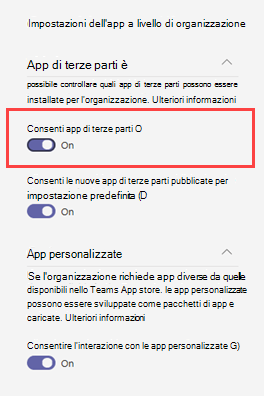

# Consenso specifico delle risorse in Microsoft Teams

[!INCLUDE [preview-feature](includes/preview-feature.md)]

Il consenso specifico delle risorse in Microsoft Teams consente ai proprietari del team di fornire il consenso alle app per accedere ai dati del team. Esempi di questo tipo di accesso includono la possibilità di leggere i messaggi dei canali, creare ed eliminare canali e creare e rimuovere le schede dei canali.

Gli amministratori possono controllare se i proprietari dei team dell'organizzazione possono concedere il consenso tramite le impostazioni configurate usando il modulo PowerShell di Azure Active Directory (Azure AD) o il portale di Azure e l'interfaccia di amministrazione di Microsoft Teams.  

## Specificare se i proprietari del team possono concedere il consenso alle app

Ecco le impostazioni che occorre impostare per controllare se i proprietari del team possono concedere il consenso alle app. Assicurati di rivedere tutte le impostazioni seguenti.

### Impostazioni nel portale di Azure Active Directory

Le due impostazioni seguenti determinano se i proprietari del team possono concedere il consenso alle app.

> [!IMPORTANT]
> La modifica di queste impostazioni non influisce sull'accesso ai dati per le app a cui è già stato fornito il consenso. Ad esempio, se si configurano queste impostazioni per impedire ai proprietari del team di fornire il consenso, tali modifiche non rimuovono l'accesso ai dati già concesso.

#### Impostazione "Gli utenti possono fornire il consenso alle app che accedono ai dati aziendali per loro conto"

Questa impostazione controlla se gli utenti dell'organizzazione possono fornire il consenso alle app per loro conto. Per consentire ai proprietari del team di fornire il consenso, questa impostazione deve essere impostata su **Sì**. Per gestire questa impostazione, eseguire le operazioni seguenti:

1. Nel portale di Azure, passare ad **Applicazioni aziendali** > **Impostazioni utente**.
2. In **Applicazioni aziendali**, impostare **Gli utenti possono fornire il consenso alle app che accedono ai dati aziendali per loro conto** su **No** o **Sì**.

È anche possibile gestire questa impostazione con PowerShell. Per altre informazioni, vedere [Configurare i contenuti dell'utente per le applicazioni](/azure/active-directory/manage-apps/configure-user-consent#configure-user-consent-to-applications).

#### Impostazione "EnableGroupSpecificConsent"

Questa impostazione controlla se gli utenti dell'organizzazione possono fornire il consenso alle app che accedono ai dati aziendali per i gruppi di cui sono proprietari. Questa impostazione deve essere abilitata per consentire ai proprietari del team di fornire il consenso. Per istruzioni su come gestire questa impostazione tramite PowerShell, vedere [Configurare il consenso del proprietario del gruppo alle app che accedono ai dati del gruppo](/azure/active-directory/manage-apps/configure-user-consent#configure-group-owner-consent-to-apps-accessing-group-data).

### Impostazioni nell'interfaccia di amministrazione di Microsoft Teams

Oltre alle impostazioni di Azure AD, [le impostazioni delle app a livello di organizzazione](manage-apps.md#manage-org-wide-app-settings) nella pagina [Gestisci app](manage-apps.md), se un'app è bloccata o consentita nella pagina [Gestisci app](manage-apps.md#allow-and-block-apps), i [criteri di autorizzazione dell'app](teams-app-permission-policies.md) assegnati al proprietario del team determinano se un proprietario del team può dare il consenso.

> [!IMPORTANT]
> La modifica di queste impostazioni non influisce sull'accesso ai dati per le app a cui è già stato fornito il consenso. Ad esempio, se disabiliti le app di terze parti a livello di organizzazione o si bloccano le app specifiche per impedire ai proprietari del team di dare il consenso, queste modifiche non rimuovono l'accesso ai dati già concesso.  

#### L'impostazione "Consenti app di terze parti" nelle impostazioni delle app a livello di organizzazione

Questa impostazione delle app a livello di organizzazione controlla se gli utenti dell'organizzazione possono usare app di terze parti. Questa impostazione deve essere abilitata per consentire ai proprietari del team di fornire il consenso. Per gestire questa impostazione, eseguire le operazioni seguenti:

1. Accedere all'interfaccia di amministrazione di Teams e accedere alle app  > **di Teams****[Gestire le app](https://admin.teams.microsoft.com/policies/manage-apps)**.
1. Seleziona **Impostazioni app a livello di organizzazione** e in **App di terze parti** disattiva o attiva **Consenti app di terze parti**.

    

Possono essere necessarie fino a 24 ore prima che le modifiche diventino effettive.

#### Consentire o bloccare le app a livello di organizzazione

Quando si blocca o si consente un'app nella pagina [Gestisci app](manage-apps.md#allow-and-block-apps), tale app viene bloccata o consentita per tutti gli utenti dell'organizzazione. I proprietari del team possono dare il consenso a un'app solo se l'app è consentita. Per consentire o bloccare un'app a livello di organizzazione, eseguire le operazioni seguenti:

1. Accedere all'interfaccia di amministrazione di Teams e accedere alle app  > **di Teams****[Gestire le app](https://admin.teams.microsoft.com/policies/manage-apps)**.
1. Nella pagina Gestisci app seleziona l'app e quindi **seleziona Blocca** per bloccarla o **Consenti** per consentirla.

    

#### Criteri di autorizzazione dell'app assegnati al proprietario del team

I proprietari del team possono fornire il consenso solo alle app i cui criteri di autorizzazione delle app consentono loro di eseguire. Per visualizzare e gestire i criteri di autorizzazione dell'app assegnati a un proprietario del team, eseguire le operazioni seguenti:

1. Nel riquadro di spostamento sinistro dell'interfaccia di amministrazione di Microsoft Teams, passare a **Utenti**.
1. Fare doppio clic sul nome visualizzato del proprietario del team e quindi selezionare **Criteri**.
1. I criteri assegnati al proprietario del team sono elencati in **Criteri di autorizzazione app**.
    - Per assegnare un criterio diverso, selezionare **Modifica** e quindi selezionare il criterio da assegnare.
    - Per modificare le impostazioni del criterio assegnato al proprietario del team, selezionare il nome del criterio e quindi apportare le modifiche desiderate.  

## Caricare app personalizzate

Quando si carica un'app personalizzata (operazione anche nota come sideload) che usa il consenso specifico delle risorse, l'app deve provenire dal tenant in cui viene installata. In altre parole, la registrazione dell'app Azure AD deve provenire da questo tenant. Gli amministratori globali sono esenti da questa restrizione e possono caricare app personalizzate da qualsiasi tenant, direttamente in un team (sideload) o nel catalogo app tenant.

## Articoli correlati

- [Autorizzazioni RSC disponibili](/microsoftteams/platform/graph-api/rsc/resource-specific-consent)
- [Microsoft Graph](https://developer.microsoft.com/graph)
- [Gestire le app nell'interfaccia di amministrazione di Microsoft Teams](manage-apps.md)
- [Gestire i criteri di autorizzazione delle app in Teams](teams-app-permission-policies.md)
