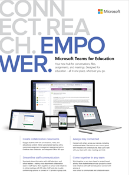
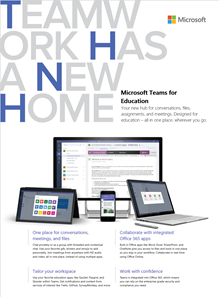
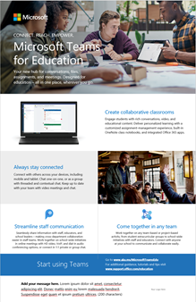

Risorse di Microsoft teams per gli amministratori dell'istruzione
==============================================

## Contenuto adoption

Creare messaggi di posta elettronica, poster e volantini personalizzati con le informazioni e il logo della scuola. In alternativa, è possibile usare poster, volantini e altri stampati per preparare l'organizzazione a Microsoft teams.

|Modelli di posta elettronica personalizzabili |         |
|---------|---------|
|**Informazioni di base sui team** [Scaricare il file zip](https://github.com/MicrosoftDocs/OfficeDocs-SkypeForBusiness/blob/live/Teams/downloads/edu-resources/getting-started.zip?raw=true)     |**Personalizzare l'ambiente di apprendimento** [Scaricare il file zip](https://github.com/MicrosoftDocs/OfficeDocs-SkypeForBusiness/blob/live/Teams/downloads/edu-resources/customize-learning.zip?raw=true)        |
|**Vedere come semplificare il flusso di lavoro in teams** [Scaricare il file zip](https://github.com/MicrosoftDocs/OfficeDocs-SkypeForBusiness/blob/live/Teams/downloads/edu-resources/workflows.zip?raw=true)      |**Informazioni su come chattare come un professionista** [Scaricare il file zip](https://github.com/MicrosoftDocs/OfficeDocs-SkypeForBusiness/blob/live/Teams/downloads/edu-resources/chat.zip?raw=true)         |
|**Portare team ovunque** [Scaricare il file zip](https://github.com/MicrosoftDocs/OfficeDocs-SkypeForBusiness/blob/live/Teams/downloads/edu-resources/get-teams.zip?raw=true)     |          |

|Volantini e poster personalizzabili e pronti per la stampa  |        |
|---------|---------|
|**Introduzione a Microsoft teams for Education-values** [Scaricare il file con estensione docx personalizzabile](https://github.com/MicrosoftDocs/OfficeDocs-SkypeForBusiness/blob/live/Teams/downloads/edu-resources/teams-edu-customizable-poster-intro-values.docx?raw=true) [Scaricare il file PDF pronto per la stampa](https://github.com/MicrosoftDocs/OfficeDocs-SkypeForBusiness/blob/live/Teams/downloads/edu-resources/teams-edu-posters-values.pdf?raw=true)     |**Introduzione a Microsoft teams per l'istruzione-caratteristiche** [Scaricare il file con estensione docx personalizzabile](https://github.com/MicrosoftDocs/OfficeDocs-SkypeForBusiness/blob/live/Teams/downloads/edu-resources/team-edu-customizable-poster-intro-features.docx?raw=true) [Scaricare il file PDF pronto per la stampa](https://github.com/MicrosoftDocs/OfficeDocs-SkypeForBusiness/blob/live/Teams/downloads/edu-resources/teams-edu-poster-features.pdf?raw=true)           |
|**Empower con Microsoft teams-values** [Scaricare il file con estensione docx personalizzabile](https://github.com/MicrosoftDocs/OfficeDocs-SkypeForBusiness/blob/live/Teams/downloads/edu-resources/teams-edu-customizable-poster-empower-values.docx?raw=true) [Scaricare il file PDF pronto per la stampa](https://github.com/MicrosoftDocs/OfficeDocs-SkypeForBusiness/blob/live/Teams/downloads/edu-resources/teams-edu-posters-values.pdf?raw=true)    |**Empower con Microsoft Teams-caratteristiche** [Scaricare il file con estensione docx personalizzabile](https://github.com/MicrosoftDocs/OfficeDocs-SkypeForBusiness/blob/live/Teams/downloads/edu-resources/teams-edu-customizable-poster-empower-features.docx?raw=true) [Scaricare il file PDF pronto per la stampa](https://github.com/MicrosoftDocs/OfficeDocs-SkypeForBusiness/blob/live/Teams/downloads/edu-resources/teams-edu-poster-features.pdf?raw=true)           |
|**Il valore di Microsoft teams per l'istruzione** [Scaricare il file con estensione docx personalizzabile](https://github.com/MicrosoftDocs/OfficeDocs-SkypeForBusiness/blob/live/Teams/downloads/edu-resources/teams-edu-customizable-flyer-values.docx?raw=true) [Scaricare il file PDF pronto per la stampa](https://github.com/MicrosoftDocs/OfficeDocs-SkypeForBusiness/blob/live/Teams/downloads/edu-resources/teams-edu-flyer-values.pdf?raw=true)     |**Caratteristiche di Microsoft teams per l'istruzione** [Scaricare il file con estensione docx personalizzabile](https://github.com/MicrosoftDocs/OfficeDocs-SkypeForBusiness/blob/live/Teams/downloads/edu-resources/teams-edu-customizable-flyer-values.docx?raw=true) [Scaricare il file PDF pronto per la stampa](https://github.com/MicrosoftDocs/OfficeDocs-SkypeForBusiness/blob/live/Teams/downloads/edu-resources/teams-edu-flyer-features.pdf?raw=true)         |

|Pacchetti pronti per la stampa  |        |
|---------|---------|
|**Introduzione a Microsoft teams per l'istruzione: suggerimenti e trucchi** [Scaricare il file PDF pronto per la stampa](https://github.com/MicrosoftDocs/OfficeDocs-SkypeForBusiness/blob/live/Teams/downloads/edu-resources/teams-edu-packet-get-started.pdf?raw=true)     |

## Chiamata all'azione

- Consulta la [demo interattiva di Microsoft teams](https://teamsdemo.office.com/) (5 minuti per il completamento)
- Attivare Microsoft teams nell'interfaccia di [amministrazione di microsoft 365](https://portal.office.com/adminportal/home#/Settings/ServicesAndAddIns) (accedere come amministratore di Office 365)
- Scaricare i client teams: [ottenere teams in tutti i dispositivi](https://teams.microsoft.com/downloads)
- Ulteriori informazioni su Office 365 per l'istruzione presso il [centro assistenza](https://support.office.com/education) per l'istruzione

## Risorse aggiuntive

- [Roadmap di Microsoft Teams](https://aka.ms/teamsroadmap)
- Tieniti aggiornato con il [Blog della community di tecnologia](https://techcommunity.microsoft.com/t5/Microsoft-Teams-Blog/bg-p/MicrosoftTeamsBlog)
- Blog di Matt Soseman "il cloud produttivo" sul [supporto di Microsoft teams PowerShell](https://blogs.technet.microsoft.com/skypehybridguy/2017/11/07/microsoft-teams-powershell-support/)
- [Inviare un suggerimento](https://aka.ms/eduuservoice)
- [Contattare il supporto](https://aka.ms/o365portal)
- [Chiedere alla community Teams](https://aka.ms/msteamscommunity)
- [Trovare altre risorse per l'istruzione](https://education.microsoft.com/)

