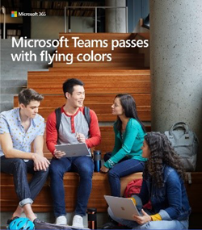

Risorse di Microsoft teams per gli amministratori dell'istruzioneMicrosoft Teams resources for Education admins
==============================================

## Contenuto adoptionAdoption content

Ottenere la tua scuola entusiasta di Microsoft teams con messaggi di posta elettronica, poster, stampati e altre risorse che ora puoi usare gratuitamente.Get your school excited about Microsoft Teams with emails, posters, handouts, and more resources that you are free to use now. È anche possibile raggiungere studenti online e in tutta la città universitaria con il nuovo toolkit digitale pieno di banner, gif e video.You can also reach students online and across campus with the new digital toolkit filled with banners, GIFs, and videos. Iniziare oggi stesso.Get started today!

Leggere i [termini e le condizioni prima di](https://github.com/MicrosoftDocs/OfficeDocs-SkypeForBusiness/blob/live/Teams/downloads/edu-resources/license_agreement_teams_for_education.pdf?raw=true) usare questi materiali.Please read the [terms and conditions](https://github.com/MicrosoftDocs/OfficeDocs-SkypeForBusiness/blob/live/Teams/downloads/edu-resources/license_agreement_teams_for_education.pdf?raw=true) before you use these materials.

### Asset fisiciPhysical assets

| |  |
|---------|---------|
|Poster- [personalizzabili](https://github.com/MicrosoftDocs/OfficeDocs-SkypeForBusiness/blob/live/Teams/downloads/edu-resources/posters-customizable.zip?raw=true) e [pronti](https://github.com/MicrosoftDocs/OfficeDocs-SkypeForBusiness/blob/live/Teams/downloads/edu-resources/posters-print-ready.zip?raw=true) per la stampaPosters - [customizable](https://github.com/MicrosoftDocs/OfficeDocs-SkypeForBusiness/blob/live/Teams/downloads/edu-resources/posters-customizable.zip?raw=true) and [print-ready](https://github.com/MicrosoftDocs/OfficeDocs-SkypeForBusiness/blob/live/Teams/downloads/edu-resources/posters-print-ready.zip?raw=true)      |[DispenseHandouts](https://github.com/MicrosoftDocs/OfficeDocs-SkypeForBusiness/blob/live/Teams/downloads/edu-resources/handouts.zip?raw=true) |
|[VolantiniFlyers](https://github.com/MicrosoftDocs/OfficeDocs-SkypeForBusiness/blob/live/Teams/downloads/edu-resources/flyers.zip?raw=true)    |[Annunci di libriBook adverts](https://github.com/MicrosoftDocs/OfficeDocs-SkypeForBusiness/blob/live/Teams/downloads/edu-resources/book-adverts.zip?raw=true)          |

### Asset digitaliDigital assets

Assicurati di controllare le indicazioni per il [Digital Toolkit](https://github.com/MicrosoftDocs/OfficeDocs-SkypeForBusiness/blob/live/Teams/downloads/edu-resources/digital-toolkit-guidance.zip?raw=true) per massimizzare l'avvio del team.Be sure to check out the [Digital Toolkit Guidance](https://github.com/MicrosoftDocs/OfficeDocs-SkypeForBusiness/blob/live/Teams/downloads/edu-resources/digital-toolkit-guidance.zip?raw=true) to maximize your Teams launch! 

|  |  |
|---------|---------|
|[Modelli di posta elettronicaEmail templates](https://github.com/MicrosoftDocs/OfficeDocs-SkypeForBusiness/blob/live/Teams/downloads/edu-resources/email-templates.zip?raw=true)      |[GifGIFs](https://github.com/MicrosoftDocs/OfficeDocs-SkypeForBusiness/blob/live/Teams/downloads/edu-resources/gifs.zip?raw=true)         |
|[Banner WebWeb banners](https://github.com/MicrosoftDocs/OfficeDocs-SkypeForBusiness/blob/live/Teams/downloads/edu-resources/web-banners.zip?raw=true)     |[VideoVideos](https://github.com/MicrosoftDocs/OfficeDocs-SkypeForBusiness/blob/live/Teams/downloads/edu-resources/videos.zip?raw=true)           |
|[Annunci sullo schermo digitaliDigital screen adverts](https://github.com/MicrosoftDocs/OfficeDocs-SkypeForBusiness/blob/live/Teams/downloads/edu-resources/digital-screen-adverts.zip?raw=true)    |      |

## Invito all'azioneCall to action

- Visita la [pagina teams for Education](https://www.microsoft.com/en-us/education/products/teams/default.aspx) per corsi di formazione, video e demo interattiviVisit the [Teams for Education page](https://www.microsoft.com/en-us/education/products/teams/default.aspx) for trainings, videos, and interactive demos
- Attivare team nell'interfaccia di [amministrazione di Microsoft 365](https://portal.office.com/adminportal/home#/Settings/ServicesAndAddIns) (accedere come amministratore di Office 365)Turn on Teams in the [Microsoft 365 admin center](https://portal.office.com/adminportal/home#/Settings/ServicesAndAddIns) (sign in as an Office 365 admin)
- Scaricare i client teams: [ottenere teams in tutti i dispositivi](https://teams.microsoft.com/downloads)Download Teams clients: [Get Teams on all your devices](https://teams.microsoft.com/downloads)
- Ulteriori informazioni su Office 365 per l'istruzione presso il [centro assistenza](https://support.office.com/education) per l'istruzioneLearn more about Office 365 for Education at the [Education help center](https://support.office.com/education)

## Risorse aggiuntiveAdditional resources

- [Roadmap TeamsTeams roadmap](https://aka.ms/teamsroadmap)
- Tieniti aggiornato con il [Blog della community di tecnologia](https://techcommunity.microsoft.com/t5/Microsoft-Teams-Blog/bg-p/MicrosoftTeamsBlog)Stay up to date with our [Tech Community Blog](https://techcommunity.microsoft.com/t5/Microsoft-Teams-Blog/bg-p/MicrosoftTeamsBlog)
- [Panoramica di PowerShell TeamsTeams PowerShell overview](teams-powershell-overview.md)
- [Inviare un suggerimentoSend a suggestion](https://aka.ms/eduuservoice)
- [Contattare il supportoContact support](https://aka.ms/o365portal)
- [Chiedere alla community TeamsAsk the Teams community](https://aka.ms/msteamscommunity)
- [Trovare altre risorse per l'istruzioneFind more resources for education](https://education.microsoft.com/)
