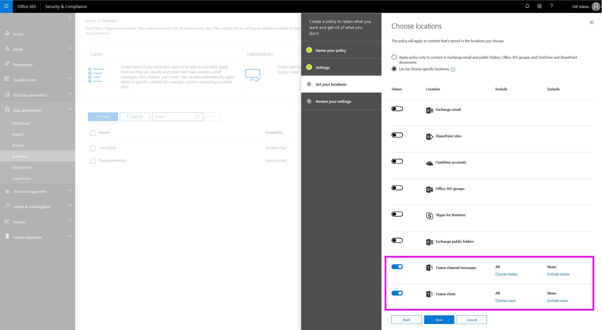

# Criteri di conservazione in Microsoft Teams

Le conversazioni dei team sono permanenti e mantenute per sempre per impostazione predefinita. Con l'introduzione dei criteri di conservazione, gli amministratori possono configurare i criteri di conservazione (conservazione ed eliminazione) nel centro sicurezza & conformità per i messaggi di chat e canali di teams. In questo modo le organizzazioni mantengono i dati per la conformità (ovvero i criteri di conservazione) per un determinato periodo o eliminano i dati (vale a dire i criteri di eliminazione) se considerati passività dopo un determinato periodo. I criteri di conservazione dei team garantiscono che quando si eliminano i dati, questa viene rimossa da tutti i percorsi di archiviazione dati permanenti nel servizio teams. 

Per gestire i criteri di conservazione **dei** > team, usare le impostazioni e i cmdlet nel centro conformità & sicurezza di Office 365 in**conservazione**della governance dati.

I criteri di conservazione dei team supportano: 
    
- Conservazione: mantenere i dati del team per una durata specifica e quindi non eseguire alcuna operazione
- Conservazione e quindi eliminazione: mantenere i dati del team per una durata specifica e quindi eliminare
- Eliminazione: eliminare i dati di teams dopo una durata specificata

I criteri di conservazione dei team non supportano ancora:

- I criteri di conservazione avanzati non si applicano alle posizioni dei messaggi del canale chat teams e teams
- Durata di meno di 30 giorni

Gli amministratori possono configurare criteri di conservazione separati per le chat private di Teams (1:1 o 1: molte chat) e i messaggi del canale teams. In molti casi, le organizzazioni considerano i dati della chat privata come un numero maggiore di passività rispetto ai messaggi del canale, che in genere sono più conversazioni correlate al progetto. Configurare questi criteri nel centro conformità & sicurezza, > **conservazione**della **governance dei dati**. Attivare **i messaggi del canale teams** e le **chat** di teams e quindi definire i criteri di conservazione per queste posizioni (anche illustrato nel diagramma seguente). 

Quando si attivano **i messaggi del canale teams**, è possibile specificare i team a cui applicare i criteri. Ad esempio, per i team X, Y e Z, l'amministratore può impostare i criteri di eliminazione per 1 anno (selezionando questi team singolarmente) e applicare un criterio di eliminazione di 3 anni al resto dei team. 

Puoi eseguire la stessa operazione per le **chat** di teams selezionando utenti specifici e applicando criteri di conservazione univoci. 

> [!IMPORTANT]
> Le posizioni dei messaggi del canale teams e delle chat teams sono indirizzate solo alle conversazioni dei team archiviati nelle cassette postali di Exchange Online (cassette postali utente e gruppo). I messaggi vengono eliminati da tutti i percorsi di archiviazione rilevanti, vale a dire le cassette postali, il substrato e il servizio chat. 
> 
> Per gestire i criteri di conservazione per i file di Team, archiviati in OneDrive for business e SharePoint, usare i criteri di conservazione.

In base alla progettazione, i criteri di eliminazione per i file di team vengono configurati tramite SharePoint Online e OneDrive for business. Di conseguenza, è possibile che un criterio possa eliminare un file a cui si fa riferimento in una chat o un messaggio di canale di teams prima che i messaggi vengano eliminati. In questo caso, il file verrà ancora visualizzato nel messaggio teams, ma se si fa clic sul file, viene visualizzato un errore "file non trovato" (ciò può verificarsi anche in assenza di un criterio, se un utente elimina manualmente un file da SharePoint Online o OneDrive for business).

Per informazioni dettagliate sulla configurazione dei criteri di conservazione per Office 365, vedere [Cenni preliminari sui criteri di conservazione](https://support.office.com/article/overview-of-retention-policies-5e377752-700d-4870-9b6d-12bfc12d2423).
 
