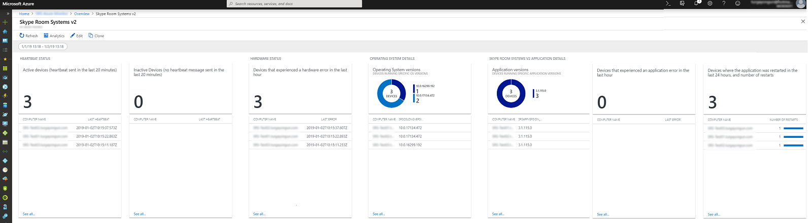
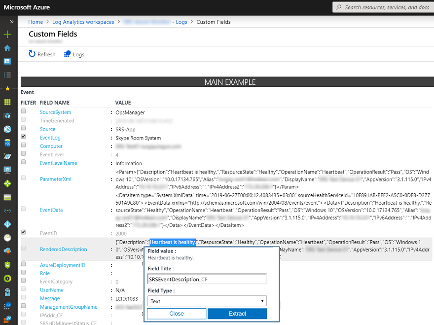
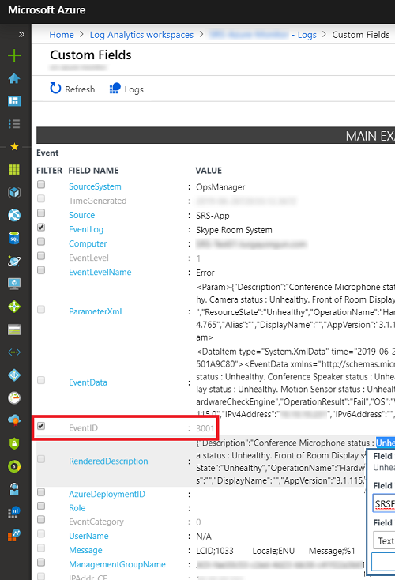

# <a name="deploy-no-loc-textmicrosoft-teams-rooms-management-with-no-loc-textazure-monitor"></a><span data-ttu-id="cd860-103">Distribuire :::no-loc text="Microsoft Teams Rooms"::: la gestione con:::no-loc text="Azure Monitor":::</span><span class="sxs-lookup"><span data-stu-id="cd860-103">Deploy :::no-loc text="Microsoft Teams Rooms"::: management with :::no-loc text="Azure Monitor":::</span></span>

<span data-ttu-id="cd860-104">Questo articolo illustra come configurare e distribuire la gestione integrata e end-to-end dei :::no-loc text="Microsoft Teams Rooms"::: dispositivi tramite. :::no-loc text="Azure Monitor":::</span><span class="sxs-lookup"><span data-stu-id="cd860-104">This article discusses how to set up and deploy integrated, end-to-end management of :::no-loc text="Microsoft Teams Rooms"::: devices by using :::no-loc text="Azure Monitor":::.</span></span>

<span data-ttu-id="cd860-105">Puoi configurare :::no-loc text="Log Analytics"::: l'interno :::no-loc text="Azure Monitor"::: per fornire la telemetria di base e gli avvisi che :::no-loc text="Microsoft Teams Rooms"::: ti aiuteranno a gestire i dispositivi della sala riunioni.</span><span class="sxs-lookup"><span data-stu-id="cd860-105">You can configure :::no-loc text="Log Analytics"::: within :::no-loc text="Azure Monitor"::: to provide basic telemetry and alerts that will help you manage :::no-loc text="Microsoft Teams Rooms"::: meeting room devices.</span></span> <span data-ttu-id="cd860-106">Man mano che la soluzione di gestione è matura, è possibile decidere di distribuire altre funzionalità di gestione e dati per creare una visualizzazione più dettagliata della disponibilità e delle prestazioni dei dispositivi.</span><span class="sxs-lookup"><span data-stu-id="cd860-106">As your management solution matures, you might decide to deploy additional data and management capabilities to create a more detailed view of device availability and performance.</span></span>

<span data-ttu-id="cd860-107">Seguendo questa guida, è possibile usare un dashboard come l'esempio seguente per ottenere report di stato dettagliati per la disponibilità dei dispositivi, l'integrità dell' :::no-loc text="Microsoft Teams Rooms"::: applicazione e dell'hardware e la distribuzione delle versioni delle applicazioni e del sistema operativo.</span><span class="sxs-lookup"><span data-stu-id="cd860-107">By following this guide, you can use a dashboard like the following example to get detailed status reporting for device availability, application and hardware health, and :::no-loc text="Microsoft Teams Rooms"::: application and operating system version distribution.</span></span>

<span data-ttu-id="cd860-108"></span><span class="sxs-lookup"><span data-stu-id="cd860-108"></span></span>

<span data-ttu-id="cd860-109">A livello elevato, è necessario eseguire le attività seguenti:</span><span class="sxs-lookup"><span data-stu-id="cd860-109">At a high level, you need to perform the following tasks:</span></span>


1. [<span data-ttu-id="cd860-110">Convalidare :::no-loc text="Log Analytics"::: la configurazione</span><span class="sxs-lookup"><span data-stu-id="cd860-110">Validate :::no-loc text="Log Analytics"::: configuration</span></span>](azure-monitor-deploy.md#validate_LogAnalytics)
2. [<span data-ttu-id="cd860-111">Configurare i dispositivi di :::no-loc text="Log Analytics"::: test per la configurazione della gestione</span><span class="sxs-lookup"><span data-stu-id="cd860-111">Configure test devices for :::no-loc text="Log Analytics"::: management setup</span></span>](azure-monitor-deploy.md#configure_test_devices)
3. [<span data-ttu-id="cd860-112">Mappare i campi personalizzati</span><span class="sxs-lookup"><span data-stu-id="cd860-112">Map custom fields</span></span>](azure-monitor-deploy.md#Custom_fields)
4. [<span data-ttu-id="cd860-113">Definire le :::no-loc text="Microsoft Teams Rooms"::: visualizzazioni in:::no-loc text="Log Analytics":::</span><span class="sxs-lookup"><span data-stu-id="cd860-113">Define the :::no-loc text="Microsoft Teams Rooms"::: views in :::no-loc text="Log Analytics":::</span></span>](azure-monitor-deploy.md#Define_Views)
5. [<span data-ttu-id="cd860-114">Definire gli avvisi</span><span class="sxs-lookup"><span data-stu-id="cd860-114">Define alerts</span></span>](azure-monitor-deploy.md#Alerts)
6. [<span data-ttu-id="cd860-115">Configurare tutti i dispositivi per il monitoraggio</span><span class="sxs-lookup"><span data-stu-id="cd860-115">Configure all devices for Monitoring</span></span>](azure-monitor-deploy.md#configure_all_devices)
7. [<span data-ttu-id="cd860-116">Configurare soluzioni :::no-loc text="Azure Monitor"::: aggiuntive</span><span class="sxs-lookup"><span data-stu-id="cd860-116">Configure additional :::no-loc text="Azure Monitor"::: solutions</span></span>](azure-monitor-deploy.md#Solutions)

> [!IMPORTANT]
> <span data-ttu-id="cd860-117">Anche se con una configurazione :::no-loc text="Azure Monitor"::: :::no-loc text="Log Analytics"::: minima, è possibile monitorare un :::no-loc text="Windows"::: computer che esegue un sistema operativo, :::no-loc text="Microsoft Teams Rooms":::ma è necessario eseguire alcuni passaggi specifici prima di iniziare la distribuzione di agenti in :::no-loc text="Microsoft Teams Rooms"::: tutti i dispositivi.</span><span class="sxs-lookup"><span data-stu-id="cd860-117">Although with minimal configuration, :::no-loc text="Azure Monitor"::: :::no-loc text="Log Analytics"::: can monitor a computer running a :::no-loc text="Windows"::: operating system, there are still some :::no-loc text="Microsoft Teams Rooms":::–specific steps that you need to take before you start deploying agents to all :::no-loc text="Microsoft Teams Rooms"::: devices.</span></span>
> <span data-ttu-id="cd860-118">Per questo motivo, ti consigliamo vivamente di eseguire tutti i passaggi di configurazione nell'ordine corretto per una configurazione e un'impostazione controllate.</span><span class="sxs-lookup"><span data-stu-id="cd860-118">Therefore, we highly recommend you perform all configuration steps in the right order for a controlled setup and configuration.</span></span> <span data-ttu-id="cd860-119">La qualità del risultato finale dipende molto dalla qualità della configurazione iniziale.</span><span class="sxs-lookup"><span data-stu-id="cd860-119">The quality of the end result very much depends on the quality of the initial configuration.</span></span>

## <a name="validate-no-loc-textlog-analytics-configuration"></a><span data-ttu-id="cd860-120">Convalidare :::no-loc text="Log Analytics"::: la configurazione</span><span class="sxs-lookup"><span data-stu-id="cd860-120">Validate :::no-loc text="Log Analytics"::: configuration</span></span>
<span data-ttu-id="cd860-121"><a name="validate_LogAnalytics"> </a></span><span class="sxs-lookup"><span data-stu-id="cd860-121"><a name="validate_LogAnalytics"> </a></span></span>

<span data-ttu-id="cd860-122">Per iniziare a raccogliere i :::no-loc text="Log Analytics"::: log dai :::no-loc text="Microsoft Teams Rooms"::: dispositivi, è necessario disporre di un'area di lavoro.</span><span class="sxs-lookup"><span data-stu-id="cd860-122">You need to have a :::no-loc text="Log Analytics"::: workspace to start collecting logs from :::no-loc text="Microsoft Teams Rooms"::: devices.</span></span> <span data-ttu-id="cd860-123">Un'area di lavoro è :::no-loc text="Log Analytics"::: un ambiente univoco con il proprio archivio dati, origini dati e soluzioni.</span><span class="sxs-lookup"><span data-stu-id="cd860-123">A workspace is a unique :::no-loc text="Log Analytics"::: environment with its own data repository, data sources, and solutions.</span></span> <span data-ttu-id="cd860-124">Se si dispone già di un' :::no-loc text="Log Analytics"::: area di lavoro esistente, è possibile usarla :::no-loc text="Microsoft Teams Rooms"::: per monitorare la distribuzione o, in alternativa, per :::no-loc text="Log Analytics"::: creare un'area di :::no-loc text="Microsoft Teams Rooms"::: lavoro dedicata specifica delle esigenze di monitoraggio.</span><span class="sxs-lookup"><span data-stu-id="cd860-124">If you already have an existing :::no-loc text="Log Analytics"::: workspace, you might use it to monitor your :::no-loc text="Microsoft Teams Rooms"::: deployment or alternatively, you can create a dedicated :::no-loc text="Log Analytics"::: workspace specific to your :::no-loc text="Microsoft Teams Rooms"::: monitoring needs.</span></span>

<span data-ttu-id="cd860-125">Se è necessario creare una nuova :::no-loc text="Log Analytics"::: area di lavoro, seguire le istruzioni dell'articolo [creare un' :::no-loc text="Log Analytics"::: area di lavoro :::no-loc text="Azure"::: nel portale](https://docs.microsoft.com/azure/azure-monitor/learn/quick-create-workspace)</span><span class="sxs-lookup"><span data-stu-id="cd860-125">If you need to create a new :::no-loc text="Log Analytics"::: workspace, follow the instructions in the article [Create a :::no-loc text="Log Analytics"::: workspace in the :::no-loc text="Azure"::: portal](https://docs.microsoft.com/azure/azure-monitor/learn/quick-create-workspace)</span></span>

> [!NOTE]
> <span data-ttu-id="cd860-126">Per :::no-loc text="Log Analytics"::: usarlo :::no-loc text="Azure Monitor":::, è necessario avere un abbonamento attivo :::no-loc text="Azure"::: .</span><span class="sxs-lookup"><span data-stu-id="cd860-126">To use :::no-loc text="Log Analytics"::: with :::no-loc text="Azure Monitor":::, you need to have an active :::no-loc text="Azure"::: subscription.</span></span> <span data-ttu-id="cd860-127">Se non si dispone di :::no-loc text="Azure"::: un abbonamento, è possibile creare [un abbonamento di valutazione gratuito](https://azure.microsoft.com/free) come punto di partenza.</span><span class="sxs-lookup"><span data-stu-id="cd860-127">If you don’t have an :::no-loc text="Azure"::: subscription, you can create [a free trial subscription](https://azure.microsoft.com/free) as a starting point.</span></span>

### <a name="configure-no-loc-textlog-analytics-to-collect-no-loc-textmicrosoft-teams-rooms-event-logs"></a><span data-ttu-id="cd860-128">Configurare :::no-loc text="Log Analytics"::: per raccogliere :::no-loc text="Microsoft Teams Rooms"::: i log eventi</span><span class="sxs-lookup"><span data-stu-id="cd860-128">Configure :::no-loc text="Log Analytics"::: to collect :::no-loc text="Microsoft Teams Rooms"::: event logs</span></span>

<span data-ttu-id="cd860-129">:::no-loc text="Log Analytics":::raccoglie solo gli eventi dai registri :::no-loc text="Windows"::: eventi specificati nelle impostazioni.</span><span class="sxs-lookup"><span data-stu-id="cd860-129">:::no-loc text="Log Analytics"::: only collects events from the :::no-loc text="Windows"::: event logs that are specified in the settings.</span></span> <span data-ttu-id="cd860-130">Per ogni log, vengono raccolti solo gli eventi con i severi selezionati.</span><span class="sxs-lookup"><span data-stu-id="cd860-130">For each log, only the events with the selected severities are collected.</span></span>

<span data-ttu-id="cd860-131">È necessario configurare :::no-loc text="Log Analytics"::: per raccogliere i log necessari per monitorare :::no-loc text="Microsoft Teams Rooms"::: lo stato del dispositivo e dell'applicazione.</span><span class="sxs-lookup"><span data-stu-id="cd860-131">You need to configure :::no-loc text="Log Analytics"::: to collect the logs required to monitor :::no-loc text="Microsoft Teams Rooms"::: device and application status.</span></span> <span data-ttu-id="cd860-132">:::no-loc text="Microsoft Teams Rooms":::i dispositivi usano **:::no-loc text="Skype Room System":::** il log eventi.</span><span class="sxs-lookup"><span data-stu-id="cd860-132">:::no-loc text="Microsoft Teams Rooms"::: devices use the **:::no-loc text="Skype Room System":::** event log.</span></span>

<span data-ttu-id="cd860-133">Per configurare :::no-loc text="Log Analytics"::: la raccolta degli :::no-loc text="Microsoft Teams Rooms"::: eventi, vedere [ :::no-loc text="Windows"::: origini dati del log eventi :::no-loc text="Azure Monitor"::: in](https://docs.microsoft.com/azure/azure-monitor/platform/data-sources-windows-events)</span><span class="sxs-lookup"><span data-stu-id="cd860-133">To configure :::no-loc text="Log Analytics"::: to collect the :::no-loc text="Microsoft Teams Rooms"::: events, see [:::no-loc text="Windows"::: event log data sources in :::no-loc text="Azure Monitor":::](https://docs.microsoft.com/azure/azure-monitor/platform/data-sources-windows-events)</span></span>

<span data-ttu-id="cd860-134"></span><span class="sxs-lookup"><span data-stu-id="cd860-134"></span></span>

> [!IMPORTANT]
> <span data-ttu-id="cd860-135">Configurare :::no-loc text="Windows"::: le impostazioni del log eventi **:::no-loc text="Skype Room System":::** e immettere il nome del log eventi e quindi selezionare le caselle di controllo **errore**, **avviso**e **informazioni** .</span><span class="sxs-lookup"><span data-stu-id="cd860-135">Configure :::no-loc text="Windows"::: Event Log settings and enter **:::no-loc text="Skype Room System":::** as event log name, and then select the **Error**, **Warning**, and **Information** check boxes.</span></span>

## <a name="configure-test-devices-for-azure-monitoring"></a><span data-ttu-id="cd860-136">Configurare i dispositivi di test per il monitoraggio di Azure</span><span class="sxs-lookup"><span data-stu-id="cd860-136">Configure test devices for Azure Monitoring</span></span>
<span data-ttu-id="cd860-137"><a name="configure_test_devices"> </a></span><span class="sxs-lookup"><span data-stu-id="cd860-137"><a name="configure_test_devices"> </a></span></span>

<span data-ttu-id="cd860-138">È necessario prepararsi :::no-loc text="Log Analytics"::: per poter monitorare :::no-loc text="Microsoft Teams Rooms":::gli eventi correlati.</span><span class="sxs-lookup"><span data-stu-id="cd860-138">You need to prepare :::no-loc text="Log Analytics"::: to be able to monitor :::no-loc text="Microsoft Teams Rooms":::–related events.</span></span> <span data-ttu-id="cd860-139">Per iniziare, è necessario distribuire :::no-loc text="Microsoft Monitoring"::: gli agenti in uno o due :::no-loc text="Microsoft Teams Rooms"::: dispositivi a cui si ha accesso fisico e ottenere quei dispositivi di test che generano alcuni dati e lo spingono all' :::no-loc text="Log Analytics"::: area di lavoro.</span><span class="sxs-lookup"><span data-stu-id="cd860-139">To start with, you need to deploy :::no-loc text="Microsoft Monitoring"::: agents to just one or two :::no-loc text="Microsoft Teams Rooms"::: devices that you have physical access to, and get those test devices generate some data and push it to the :::no-loc text="Log Analytics"::: workspace.</span></span>

### <a name="install-no-loc-textmicrosoft-monitoring-agents-to-test-devices"></a><span data-ttu-id="cd860-140">Installare :::no-loc text="Microsoft Monitoring"::: gli agenti per testare i dispositivi</span><span class="sxs-lookup"><span data-stu-id="cd860-140">Install :::no-loc text="Microsoft Monitoring"::: agents to test devices</span></span>

<span data-ttu-id="cd860-141">Distribuire l' :::no-loc text="Microsoft Monitoring"::: agente nei dispositivi di test usando le istruzioni fornite in [connettere :::no-loc text="Windows"::: i computer al :::no-loc text="Log Analytics"::: servizio :::no-loc text="Azure"::: ](https://docs.microsoft.com/azure/azure-monitor/platform/agent-windows).</span><span class="sxs-lookup"><span data-stu-id="cd860-141">Deploy the :::no-loc text="Microsoft Monitoring"::: agent to the test devices by using the instructions provided in [Connect :::no-loc text="Windows"::: computers to the :::no-loc text="Log Analytics"::: service in :::no-loc text="Azure":::](https://docs.microsoft.com/azure/azure-monitor/platform/agent-windows).</span></span> <span data-ttu-id="cd860-142">In questo articolo vengono fornite informazioni dettagliate sui passaggi per :::no-loc text="Microsoft Monitoring"::: la distribuzione :::no-loc text="Windows":::dell'agente, le istruzioni :::no-loc text="Log Analytics"::: per ottenere l' ***ID area di lavoro*** e la ***chiave primaria*** per ottenere :::no-loc text="Microsoft Teams Rooms"::: i dispositivi connessi alla :::no-loc text="Azure Monitor"::: distribuzione e i passaggi :::no-loc text="Log Analytics"::: per verificare la connettività dell'agente all'istanza.</span><span class="sxs-lookup"><span data-stu-id="cd860-142">This article provides detailed information about the steps for deploying :::no-loc text="Microsoft Monitoring"::: Agent for :::no-loc text="Windows":::, instructions for obtaining the :::no-loc text="Log Analytics"::: ***Workspace ID*** and the ***primary key*** to get :::no-loc text="Microsoft Teams Rooms"::: devices connected to your :::no-loc text="Azure Monitor"::: deployment, and steps to verify agent connectivity to :::no-loc text="Log Analytics"::: instance.</span></span>

### <a name="generate-sample-no-loc-textmicrosoft-teams-rooms-events"></a><span data-ttu-id="cd860-143">Generare eventi :::no-loc text="Microsoft Teams Rooms"::: di esempio</span><span class="sxs-lookup"><span data-stu-id="cd860-143">Generate sample :::no-loc text="Microsoft Teams Rooms"::: events</span></span>

<span data-ttu-id="cd860-144">Dopo che :::no-loc text="Microsoft Monitoring"::: l'agente è stato distribuito sui dispositivi di test, verificare che i dati del log eventi necessari :::no-loc text="Azure Monitor":::vengano raccolti da.</span><span class="sxs-lookup"><span data-stu-id="cd860-144">After the :::no-loc text="Microsoft Monitoring"::: agent is deployed onto the test devices, verify that the required event log data is collected by :::no-loc text="Azure Monitor":::.</span></span>

> [!NOTE]
> <span data-ttu-id="cd860-145">Riavviare il dispositivo dopo l'installazione dell' :::no-loc text="Microsoft Monitoring"::: agente e verificare che :::no-loc text="Microsoft Teams Rooms"::: l'app riunione venga avviata, in modo che possa generare nuovi eventi nel log eventi.</span><span class="sxs-lookup"><span data-stu-id="cd860-145">Reboot the device after the installation of the :::no-loc text="Microsoft Monitoring"::: agent, and make sure that :::no-loc text="Microsoft Teams Rooms"::: Meeting app is started, so that it can generate new events into the Event Log.</span></span>

1.  <span data-ttu-id="cd860-146">Accedere al [ :::no-loc text="Microsoft Azure"::: portale](https://portal.azure.com) e :::no-loc text="Log Analytics"::: selezionare l'area di lavoro.</span><span class="sxs-lookup"><span data-stu-id="cd860-146">Sign in to the [:::no-loc text="Microsoft Azure"::: portal](https://portal.azure.com) and go to :::no-loc text="Log Analytics"::: and select your workspace.</span></span>

2.  <span data-ttu-id="cd860-147">Elencare gli eventi heartbeat generati da :::no-loc text="Microsoft Teams Rooms"::: un dispositivo:</span><span class="sxs-lookup"><span data-stu-id="cd860-147">List the heartbeat events generated by a :::no-loc text="Microsoft Teams Rooms"::: device:</span></span>
    1.  <span data-ttu-id="cd860-148">Selezionare l'area di lavoro e accedere ai **registri** e usare una query per recuperare i record heartbeat con i campi personalizzati :::no-loc text="Microsoft Teams Rooms":::.</span><span class="sxs-lookup"><span data-stu-id="cd860-148">Select your workspace and go to **Logs** and use a query to retrieve the heartbeat records that will have the custom fields for :::no-loc text="Microsoft Teams Rooms":::.</span></span>
    2.  <span data-ttu-id="cd860-149">Query di esempio:`Event | where Source == "SRS-App" and EventID == 2000`</span><span class="sxs-lookup"><span data-stu-id="cd860-149">Sample query: `Event | where Source == "SRS-App" and EventID == 2000`</span></span>

3.  <span data-ttu-id="cd860-150">Verificare che la query restituisca i record di log che includono gli eventi :::no-loc text="Microsoft Teams Rooms"::: generati dall'app riunioni.</span><span class="sxs-lookup"><span data-stu-id="cd860-150">Make sure that the query returns log records that include events generated by the :::no-loc text="Microsoft Teams Rooms"::: meetings app.</span></span>

4.  <span data-ttu-id="cd860-151">Generare un problema hardware e verificare che gli eventi necessari siano connessi :::no-loc text="Azure Log Analytics":::.</span><span class="sxs-lookup"><span data-stu-id="cd860-151">Generate a hardware issue, and validate that the required events are logged in :::no-loc text="Azure Log Analytics":::.</span></span>
    1.  <span data-ttu-id="cd860-152">Scollegare uno dei dispositivi periferici nel sistema di test :::no-loc text="Microsoft Teams Rooms"::: .</span><span class="sxs-lookup"><span data-stu-id="cd860-152">Unplug one of the peripheral devices on the test :::no-loc text="Microsoft Teams Rooms"::: system.</span></span> <span data-ttu-id="cd860-153">Potrebbe essere la fotocamera, il vivavoce, il microfono o la visualizzazione della sala anteriore</span><span class="sxs-lookup"><span data-stu-id="cd860-153">This could be the camera, speakerphone, microphone, or Front Room Display</span></span>
    2.  <span data-ttu-id="cd860-154">Attendere 10 minuti per il popolamento del log eventi :::no-loc text="Azure Log Analytics":::.</span><span class="sxs-lookup"><span data-stu-id="cd860-154">Wait 10 minutes for the event log to be populated in :::no-loc text="Azure Log Analytics":::.</span></span>
    3.  <span data-ttu-id="cd860-155">Usare una query per elencare gli eventi di errore hardware:`Event | where Source == "SRS-App" and EventID == 3001`</span><span class="sxs-lookup"><span data-stu-id="cd860-155">Use a query to list hardware error events: `Event | where Source == "SRS-App" and EventID == 3001`</span></span>

5.  <span data-ttu-id="cd860-156">Generare un problema di applicazione e verificare che gli eventi necessari vengano registrati.</span><span class="sxs-lookup"><span data-stu-id="cd860-156">Generate an application issue, and validate that the required events are logged.</span></span>
    1.  <span data-ttu-id="cd860-157">Modificare :::no-loc text="Microsoft Teams Rooms"::: la configurazione dell'applicazione e digitare un indirizzo SIP (Session Initiation Protocol) non corretto o una coppia di password.</span><span class="sxs-lookup"><span data-stu-id="cd860-157">Modify :::no-loc text="Microsoft Teams Rooms"::: application configuration, and type an incorrect Session Initiation Protocol (SIP) address/password pair.</span></span>
    2.  <span data-ttu-id="cd860-158">Attendere 10 minuti per il popolamento del log eventi :::no-loc text="Azure Log Analytics":::.</span><span class="sxs-lookup"><span data-stu-id="cd860-158">Wait 10 minutes for the event log to be populated in :::no-loc text="Azure Log Analytics":::.</span></span>
    3.  <span data-ttu-id="cd860-159">Usare una query per elencare gli eventi di errore dell'applicazione:`Event | where Source == "SRS-App" and EventID == 2001 and EventLevel == 1`</span><span class="sxs-lookup"><span data-stu-id="cd860-159">Use a query to list application error events: `Event | where Source == "SRS-App" and EventID == 2001 and EventLevel == 1`</span></span>

> [!IMPORTANT]
> <span data-ttu-id="cd860-160">Questi registri eventi di esempio sono necessari prima che i campi personalizzati possano essere configurati.</span><span class="sxs-lookup"><span data-stu-id="cd860-160">These sample event logs are required before custom fields can be configured.</span></span> <span data-ttu-id="cd860-161">Non procedere al passaggio successivo finché non vengono raccolti i registri eventi necessari.</span><span class="sxs-lookup"><span data-stu-id="cd860-161">Don’t proceed to the next step until you have collected the required event logs.</span></span>

## <a name="map-custom-fields"></a><span data-ttu-id="cd860-162">Mappare i campi personalizzati</span><span class="sxs-lookup"><span data-stu-id="cd860-162">Map custom fields</span></span>
<span data-ttu-id="cd860-163"><a name="Custom_fields"> </a></span><span class="sxs-lookup"><span data-stu-id="cd860-163"><a name="Custom_fields"> </a></span></span>

<span data-ttu-id="cd860-164">Si usano campi personalizzati per estrarre dati specifici dai registri eventi.</span><span class="sxs-lookup"><span data-stu-id="cd860-164">You use custom fields to extract specific data from the event logs.</span></span> <span data-ttu-id="cd860-165">È necessario definire i campi personalizzati che verranno usati in seguito con i riquadri, le visualizzazioni dashboard e gli avvisi.</span><span class="sxs-lookup"><span data-stu-id="cd860-165">You need to define custom fields that will be used later with your tiles, dashboard views, and alerts.</span></span> <span data-ttu-id="cd860-166">Vedere i [campi personalizzati :::no-loc text="Log Analytics"::: ](https://docs.microsoft.com/azure/azure-monitor/platform/custom-fields) e acquisire familiarità con i concetti prima di iniziare a creare i campi personalizzati.</span><span class="sxs-lookup"><span data-stu-id="cd860-166">See [Custom fields in :::no-loc text="Log Analytics":::](https://docs.microsoft.com/azure/azure-monitor/platform/custom-fields) and become familiar with the concepts before you start creating your custom fields.</span></span>

<span data-ttu-id="cd860-167">Per estrarre i campi personalizzati dai registri eventi acquisiti, eseguire le operazioni seguenti:</span><span class="sxs-lookup"><span data-stu-id="cd860-167">To extract your custom fields out of the captured event logs, follow these steps:</span></span>

1.  <span data-ttu-id="cd860-168">Accedere al [ :::no-loc text="Microsoft Azure"::: portale](https://portal.azure.com) e :::no-loc text="Log Analytics"::: selezionare l'area di lavoro.</span><span class="sxs-lookup"><span data-stu-id="cd860-168">Sign in to the [:::no-loc text="Microsoft Azure"::: portal](https://portal.azure.com) and go to :::no-loc text="Log Analytics"::: and select your workspace.</span></span>

2. <span data-ttu-id="cd860-169">Elencare gli eventi generati da :::no-loc text="Microsoft Teams Rooms"::: un dispositivo:</span><span class="sxs-lookup"><span data-stu-id="cd860-169">List the events generated by a :::no-loc text="Microsoft Teams Rooms"::: device:</span></span>
   1.  <span data-ttu-id="cd860-170">Accedere a **log** e usare una query per recuperare i record che avranno il campo personalizzato.</span><span class="sxs-lookup"><span data-stu-id="cd860-170">Go to **Logs** and use a query to retrieve the records that will have the custom field.</span></span>
   2.  <span data-ttu-id="cd860-171">Query di esempio:`Event | where Source == "SRS-App" and EventID == 2000`</span><span class="sxs-lookup"><span data-stu-id="cd860-171">Sample query: `Event | where Source == "SRS-App" and EventID == 2000`</span></span>

3. <span data-ttu-id="cd860-172">Selezionare uno dei record, selezionare il pulsante a sinistra e avviare l'estrazione guidata campi.</span><span class="sxs-lookup"><span data-stu-id="cd860-172">Select one of the records, select the button to the left, and start the field extraction wizard.</span></span>
4. <span data-ttu-id="cd860-173">Evidenziare i dati che si desidera estrarre da RenderedDescription e specificare un titolo di campo.</span><span class="sxs-lookup"><span data-stu-id="cd860-173">Highlight the data you’d like to extract from the RenderedDescription and provide a Field Title.</span></span> <span data-ttu-id="cd860-174">I nomi dei campi da usare sono forniti nella tabella 1.</span><span class="sxs-lookup"><span data-stu-id="cd860-174">The field names that you should use are provided in Table 1.</span></span>

   <span data-ttu-id="cd860-175"></span><span class="sxs-lookup"><span data-stu-id="cd860-175"></span></span>

5. <span data-ttu-id="cd860-176">Usare i mapping visualizzati nella *tabella 1*.</span><span class="sxs-lookup"><span data-stu-id="cd860-176">Use the mappings shown in *Table 1*.</span></span> <span data-ttu-id="cd860-177">:::no-loc text="Log Analytics":::verrà accodata automaticamente \*\* \_\*\* la stringa CF quando si definisce il nuovo campo.</span><span class="sxs-lookup"><span data-stu-id="cd860-177">:::no-loc text="Log Analytics"::: will automatically append the **\_CF** string when you define the new field.</span></span>

> [!IMPORTANT]
> <span data-ttu-id="cd860-178">Ricorda che tutti i campi :::no-loc text="Log Analytics"::: e i JSON sono con distinzione tra maiuscole e minuscole.</span><span class="sxs-lookup"><span data-stu-id="cd860-178">Remember that all JSON and :::no-loc text="Log Analytics"::: fields are case-sensitive.</span></span>
> 
> <span data-ttu-id="cd860-179">Prestare attenzione alle query necessarie per ogni campo personalizzato nella tabella seguente.</span><span class="sxs-lookup"><span data-stu-id="cd860-179">Pay attention to the queries required for each custom field in the table below.</span></span> <span data-ttu-id="cd860-180">È necessario usare le query corrette per :::no-loc text="Log Analytics"::: estrarre correttamente i valori dei campi personalizzati.</span><span class="sxs-lookup"><span data-stu-id="cd860-180">You need to use the correct queries for :::no-loc text="Log Analytics"::: to successfully extract custom field values.</span></span>
> 
 <span data-ttu-id="cd860-181"></span><span class="sxs-lookup"><span data-stu-id="cd860-181"></span></span>

<span data-ttu-id="cd860-182">**Tabella 1**</span><span class="sxs-lookup"><span data-stu-id="cd860-182">**Table 1**</span></span>

| <span data-ttu-id="cd860-183">**Campo JSON**</span><span class="sxs-lookup"><span data-stu-id="cd860-183">**JSON field**</span></span>                   | <span data-ttu-id="cd860-184">**:::no-loc text="Log Analytics":::campo personalizzato**</span><span class="sxs-lookup"><span data-stu-id="cd860-184">**:::no-loc text="Log Analytics"::: custom field**</span></span> | <span data-ttu-id="cd860-185">**ID evento**</span><span class="sxs-lookup"><span data-stu-id="cd860-185">**Event ID**</span></span> | <span data-ttu-id="cd860-186">**Query da usare con l'estrazione**</span><span class="sxs-lookup"><span data-stu-id="cd860-186">**Query to use with the extraction**</span></span>                   |
|:---------------------------------|:-------------------------------|:-------------|:-------------------------------------------------------|
| <span data-ttu-id="cd860-187">Descrizione</span><span class="sxs-lookup"><span data-stu-id="cd860-187">Description</span></span>                      | <span data-ttu-id="cd860-188">SRSEventDescription</span><span class="sxs-lookup"><span data-stu-id="cd860-188">SRSEventDescription</span></span>         | <span data-ttu-id="cd860-189">**2000**</span><span class="sxs-lookup"><span data-stu-id="cd860-189">**2000**</span></span>     | <span data-ttu-id="cd860-190">Evento \| where source = = "SRS-app" e EventID = = 2000</span><span class="sxs-lookup"><span data-stu-id="cd860-190">Event \| where Source == "SRS-App" and EventID == 2000</span></span> |
| <span data-ttu-id="cd860-191">ResourceState</span><span class="sxs-lookup"><span data-stu-id="cd860-191">ResourceState</span></span>                    | <span data-ttu-id="cd860-192">SRSResourceState</span><span class="sxs-lookup"><span data-stu-id="cd860-192">SRSResourceState</span></span>            | <span data-ttu-id="cd860-193">**2000**</span><span class="sxs-lookup"><span data-stu-id="cd860-193">**2000**</span></span>     | <span data-ttu-id="cd860-194">Evento \| where source = = "SRS-app" e EventID = = 2000</span><span class="sxs-lookup"><span data-stu-id="cd860-194">Event \| where Source == "SRS-App" and EventID == 2000</span></span> |
| <span data-ttu-id="cd860-195">NomeOperazione</span><span class="sxs-lookup"><span data-stu-id="cd860-195">OperationName</span></span>                    | <span data-ttu-id="cd860-196">SRSOperationName</span><span class="sxs-lookup"><span data-stu-id="cd860-196">SRSOperationName</span></span>            | <span data-ttu-id="cd860-197">**2000**</span><span class="sxs-lookup"><span data-stu-id="cd860-197">**2000**</span></span>     | <span data-ttu-id="cd860-198">Evento \| where source = = "SRS-app" e EventID = = 2000</span><span class="sxs-lookup"><span data-stu-id="cd860-198">Event \| where Source == "SRS-App" and EventID == 2000</span></span> |
| <span data-ttu-id="cd860-199">OperationResult</span><span class="sxs-lookup"><span data-stu-id="cd860-199">OperationResult</span></span>                  | <span data-ttu-id="cd860-200">SRSOperationResult</span><span class="sxs-lookup"><span data-stu-id="cd860-200">SRSOperationResult</span></span>          | <span data-ttu-id="cd860-201">**2000**</span><span class="sxs-lookup"><span data-stu-id="cd860-201">**2000**</span></span>     | <span data-ttu-id="cd860-202">Evento \| where source = = "SRS-app" e EventID = = 2000</span><span class="sxs-lookup"><span data-stu-id="cd860-202">Event \| where Source == "SRS-App" and EventID == 2000</span></span> |
| <span data-ttu-id="cd860-203">OS</span><span class="sxs-lookup"><span data-stu-id="cd860-203">OS</span></span>                               | <span data-ttu-id="cd860-204">SRSOSVersion</span><span class="sxs-lookup"><span data-stu-id="cd860-204">SRSOSVersion</span></span>                | <span data-ttu-id="cd860-205">**2000**</span><span class="sxs-lookup"><span data-stu-id="cd860-205">**2000**</span></span>     | <span data-ttu-id="cd860-206">Evento \| where source = = "SRS-app" e EventID = = 2000</span><span class="sxs-lookup"><span data-stu-id="cd860-206">Event \| where Source == "SRS-App" and EventID == 2000</span></span> |
| <span data-ttu-id="cd860-207">OSVersion</span><span class="sxs-lookup"><span data-stu-id="cd860-207">OSVersion</span></span>                        | <span data-ttu-id="cd860-208">SRSOSLongVersion</span><span class="sxs-lookup"><span data-stu-id="cd860-208">SRSOSLongVersion</span></span>            | <span data-ttu-id="cd860-209">**2000**</span><span class="sxs-lookup"><span data-stu-id="cd860-209">**2000**</span></span>     | <span data-ttu-id="cd860-210">Evento \| where source = = "SRS-app" e EventID = = 2000</span><span class="sxs-lookup"><span data-stu-id="cd860-210">Event \| where Source == "SRS-App" and EventID == 2000</span></span> |
| <span data-ttu-id="cd860-211">Alias</span><span class="sxs-lookup"><span data-stu-id="cd860-211">Alias</span></span>                            | <span data-ttu-id="cd860-212">SRSAlias</span><span class="sxs-lookup"><span data-stu-id="cd860-212">SRSAlias</span></span>                    | <span data-ttu-id="cd860-213">**2000**</span><span class="sxs-lookup"><span data-stu-id="cd860-213">**2000**</span></span>     | <span data-ttu-id="cd860-214">Evento \| where source = = "SRS-app" e EventID = = 2000</span><span class="sxs-lookup"><span data-stu-id="cd860-214">Event \| where Source == "SRS-App" and EventID == 2000</span></span> |
| <span data-ttu-id="cd860-215">DisplayName</span><span class="sxs-lookup"><span data-stu-id="cd860-215">DisplayName</span></span>                      | <span data-ttu-id="cd860-216">SRSDisplayName</span><span class="sxs-lookup"><span data-stu-id="cd860-216">SRSDisplayName</span></span>              | <span data-ttu-id="cd860-217">**2000**</span><span class="sxs-lookup"><span data-stu-id="cd860-217">**2000**</span></span>     | <span data-ttu-id="cd860-218">Evento \| where source = = "SRS-app" e EventID = = 2000</span><span class="sxs-lookup"><span data-stu-id="cd860-218">Event \| where Source == "SRS-App" and EventID == 2000</span></span> |
| <span data-ttu-id="cd860-219">AppVersion</span><span class="sxs-lookup"><span data-stu-id="cd860-219">AppVersion</span></span>                       | <span data-ttu-id="cd860-220">SRSAppVersion</span><span class="sxs-lookup"><span data-stu-id="cd860-220">SRSAppVersion</span></span>               | <span data-ttu-id="cd860-221">**2000**</span><span class="sxs-lookup"><span data-stu-id="cd860-221">**2000**</span></span>     | <span data-ttu-id="cd860-222">Evento \| where source = = "SRS-app" e EventID = = 2000</span><span class="sxs-lookup"><span data-stu-id="cd860-222">Event \| where Source == "SRS-App" and EventID == 2000</span></span> |
| <span data-ttu-id="cd860-223">Indirizzoipv4</span><span class="sxs-lookup"><span data-stu-id="cd860-223">IPv4Address</span></span>                      | <span data-ttu-id="cd860-224">SRSIPv4Address</span><span class="sxs-lookup"><span data-stu-id="cd860-224">SRSIPv4Address</span></span>              | <span data-ttu-id="cd860-225">**2000**</span><span class="sxs-lookup"><span data-stu-id="cd860-225">**2000**</span></span>     | <span data-ttu-id="cd860-226">Evento \| where source = = "SRS-app" e EventID = = 2000</span><span class="sxs-lookup"><span data-stu-id="cd860-226">Event \| where Source == "SRS-App" and EventID == 2000</span></span> |
| <span data-ttu-id="cd860-227">Indirizzoipv6</span><span class="sxs-lookup"><span data-stu-id="cd860-227">IPv6Address</span></span>                      | <span data-ttu-id="cd860-228">SRSIPv6Address</span><span class="sxs-lookup"><span data-stu-id="cd860-228">SRSIPv6Address</span></span>              | <span data-ttu-id="cd860-229">**2000**</span><span class="sxs-lookup"><span data-stu-id="cd860-229">**2000**</span></span>     | <span data-ttu-id="cd860-230">Evento \| where source = = "SRS-app" e EventID = = 2000</span><span class="sxs-lookup"><span data-stu-id="cd860-230">Event \| where Source == "SRS-App" and EventID == 2000</span></span> |
| <span data-ttu-id="cd860-231">Stato microfono conferenza</span><span class="sxs-lookup"><span data-stu-id="cd860-231">Conference Microphone status</span></span>     | <span data-ttu-id="cd860-232">SRSConfMicrophoneStatus</span><span class="sxs-lookup"><span data-stu-id="cd860-232">SRSConfMicrophoneStatus</span></span>     | <span data-ttu-id="cd860-233">**3001**</span><span class="sxs-lookup"><span data-stu-id="cd860-233">**3001**</span></span>     | <span data-ttu-id="cd860-234">Evento \| where source = = "SRS-app" e EventID = = 3001</span><span class="sxs-lookup"><span data-stu-id="cd860-234">Event \| where Source == "SRS-App" and EventID == 3001</span></span> |
| <span data-ttu-id="cd860-235">Stato altoparlante conferenza</span><span class="sxs-lookup"><span data-stu-id="cd860-235">Conference Speaker status</span></span>        | <span data-ttu-id="cd860-236">SRSConfSpeakerStatus</span><span class="sxs-lookup"><span data-stu-id="cd860-236">SRSConfSpeakerStatus</span></span>        | <span data-ttu-id="cd860-237">**3001**</span><span class="sxs-lookup"><span data-stu-id="cd860-237">**3001**</span></span>     | <span data-ttu-id="cd860-238">Evento \| where source = = "SRS-app" e EventID = = 3001</span><span class="sxs-lookup"><span data-stu-id="cd860-238">Event \| where Source == "SRS-App" and EventID == 3001</span></span> |
| <span data-ttu-id="cd860-239">Stato altoparlante predefinito</span><span class="sxs-lookup"><span data-stu-id="cd860-239">Default Speaker status</span></span>           | <span data-ttu-id="cd860-240">SRSDefaultSpeakerStatus</span><span class="sxs-lookup"><span data-stu-id="cd860-240">SRSDefaultSpeakerStatus</span></span>     | <span data-ttu-id="cd860-241">**3001**</span><span class="sxs-lookup"><span data-stu-id="cd860-241">**3001**</span></span>     | <span data-ttu-id="cd860-242">Evento \| where source = = "SRS-app" e EventID = = 3001</span><span class="sxs-lookup"><span data-stu-id="cd860-242">Event \| where Source == "SRS-App" and EventID == 3001</span></span> |
| <span data-ttu-id="cd860-243">Stato fotocamera</span><span class="sxs-lookup"><span data-stu-id="cd860-243">Camera status</span></span>                    | <span data-ttu-id="cd860-244">SRSCameraStatus</span><span class="sxs-lookup"><span data-stu-id="cd860-244">SRSCameraStatus</span></span>             | <span data-ttu-id="cd860-245">**3001**</span><span class="sxs-lookup"><span data-stu-id="cd860-245">**3001**</span></span>     | <span data-ttu-id="cd860-246">Evento \| where source = = "SRS-app" e EventID = = 3001</span><span class="sxs-lookup"><span data-stu-id="cd860-246">Event \| where Source == "SRS-App" and EventID == 3001</span></span> |
| <span data-ttu-id="cd860-247">Inizio dello stato di visualizzazione della sala</span><span class="sxs-lookup"><span data-stu-id="cd860-247">Front of Room Display status</span></span>     | <span data-ttu-id="cd860-248">SRSFORDStatus</span><span class="sxs-lookup"><span data-stu-id="cd860-248">SRSFORDStatus</span></span>               | <span data-ttu-id="cd860-249">**3001**</span><span class="sxs-lookup"><span data-stu-id="cd860-249">**3001**</span></span>     | <span data-ttu-id="cd860-250">Evento \| where source = = "SRS-app" e EventID = = 3001</span><span class="sxs-lookup"><span data-stu-id="cd860-250">Event \| where Source == "SRS-App" and EventID == 3001</span></span> |
| <span data-ttu-id="cd860-251">Stato sensore movimento</span><span class="sxs-lookup"><span data-stu-id="cd860-251">Motion Sensor status</span></span>             | <span data-ttu-id="cd860-252">SRSMotionSensorStatus</span><span class="sxs-lookup"><span data-stu-id="cd860-252">SRSMotionSensorStatus</span></span>       | <span data-ttu-id="cd860-253">**3001**</span><span class="sxs-lookup"><span data-stu-id="cd860-253">**3001**</span></span>     | <span data-ttu-id="cd860-254">Evento \| where source = = "SRS-app" e EventID = = 3001</span><span class="sxs-lookup"><span data-stu-id="cd860-254">Event \| where Source == "SRS-App" and EventID == 3001</span></span> |
| <span data-ttu-id="cd860-255">Stato di ingestione HDMI</span><span class="sxs-lookup"><span data-stu-id="cd860-255">HDMI Ingest status</span></span>               | <span data-ttu-id="cd860-256">SRSHDMIIngestStatus</span><span class="sxs-lookup"><span data-stu-id="cd860-256">SRSHDMIIngestStatus</span></span>         | <span data-ttu-id="cd860-257">**3001**</span><span class="sxs-lookup"><span data-stu-id="cd860-257">**3001**</span></span>     | <span data-ttu-id="cd860-258">Evento \| where source = = "SRS-app" e EventID = = 3001</span><span class="sxs-lookup"><span data-stu-id="cd860-258">Event \| where Source == "SRS-App" and EventID == 3001</span></span> |


## <a name="define-the-no-loc-textmicrosoft-teams-rooms-views-in-no-loc-textlog-analytics"></a><span data-ttu-id="cd860-259">Definire le :::no-loc text="Microsoft Teams Rooms"::: visualizzazioni in:::no-loc text="Log Analytics":::</span><span class="sxs-lookup"><span data-stu-id="cd860-259">Define the :::no-loc text="Microsoft Teams Rooms"::: views in :::no-loc text="Log Analytics":::</span></span>
<span data-ttu-id="cd860-260"><a name="Define_Views"> </a></span><span class="sxs-lookup"><span data-stu-id="cd860-260"><a name="Define_Views"> </a></span></span>

<span data-ttu-id="cd860-261">Dopo la raccolta dei dati e i campi personalizzati, è possibile usare la finestra di progettazione di visualizzazione per sviluppare un dashboard contenente :::no-loc text="Microsoft Teams Rooms"::: diversi riquadri per monitorare gli eventi.</span><span class="sxs-lookup"><span data-stu-id="cd860-261">After data is collected and custom fields are mapped, you can use View Designer to develop a dashboard containing various tiles to monitor :::no-loc text="Microsoft Teams Rooms"::: events.</span></span> <span data-ttu-id="cd860-262">Usare la finestra di progettazione di visualizzazione per creare i riquadri seguenti.</span><span class="sxs-lookup"><span data-stu-id="cd860-262">Use View Designer to create the following tiles.</span></span> <span data-ttu-id="cd860-263">Per altre informazioni, vedere [creare visualizzazioni personalizzate tramite la finestra di progettazione :::no-loc text="Log Analytics"::: di visualizzazione in](https://docs.microsoft.com/azure/azure-monitor/platform/view-designer)</span><span class="sxs-lookup"><span data-stu-id="cd860-263">For more information, see [Create custom views by using View Designer in :::no-loc text="Log Analytics":::](https://docs.microsoft.com/azure/azure-monitor/platform/view-designer)</span></span>

> [!NOTE]
> <span data-ttu-id="cd860-264">I passaggi precedenti di questa guida devono essere stati completati per il corretto funzionamento dei riquadri del dashboard.</span><span class="sxs-lookup"><span data-stu-id="cd860-264">Previous steps in this guide should have been completed for the dashboard tiles to work properly.</span></span>

### <a name="create-a-microsoft-teams-rooms-dashboard-by-using-the-import-method"></a><span data-ttu-id="cd860-265">Creare un dashboard di Microsoft teams Rooms usando il metodo Import</span><span class="sxs-lookup"><span data-stu-id="cd860-265">Create a Microsoft Teams Rooms dashboard by using the import method</span></span>

<span data-ttu-id="cd860-266">È possibile importare un :::no-loc text="Microsoft Teams Rooms"::: dashboard e avviare il monitoraggio rapido dei dispositivi.</span><span class="sxs-lookup"><span data-stu-id="cd860-266">You can import an :::no-loc text="Microsoft Teams Rooms"::: dashboard and start monitoring your devices quickly.</span></span> <span data-ttu-id="cd860-267">Eseguire la procedura seguente per importare il Dashboard:</span><span class="sxs-lookup"><span data-stu-id="cd860-267">Take the following steps to import the dashboard:</span></span>

1.  <span data-ttu-id="cd860-268">Ottenere il file del dashboard [SkypeRoomSystems_v2. omsview](https://go.microsoft.com/fwlink/?linkid=835675) .</span><span class="sxs-lookup"><span data-stu-id="cd860-268">Get the [SkypeRoomSystems_v2.omsview](https://go.microsoft.com/fwlink/?linkid=835675) dashboard file.</span></span>
2.  <span data-ttu-id="cd860-269">Accedere al [ :::no-loc text="Microsoft Azure"::: portale](https://portal.azure.com) e :::no-loc text="Log Analytics"::: selezionare l'area di lavoro.</span><span class="sxs-lookup"><span data-stu-id="cd860-269">Sign in to the [:::no-loc text="Microsoft Azure"::: portal](https://portal.azure.com) and go to :::no-loc text="Log Analytics"::: and select your workspace.</span></span>
3.  <span data-ttu-id="cd860-270">Aprire **Progettazione visualizzazioni**.</span><span class="sxs-lookup"><span data-stu-id="cd860-270">Open **View Designer**.</span></span>
4.  <span data-ttu-id="cd860-271">Selezionare **Importa**e quindi selezionare il file **SkypeRoomSystems_v2. omsview** .</span><span class="sxs-lookup"><span data-stu-id="cd860-271">Select **Import**, and then select the **SkypeRoomSystems_v2.omsview** file.</span></span>
5.  <span data-ttu-id="cd860-272">Selezionare **Salva**.</span><span class="sxs-lookup"><span data-stu-id="cd860-272">Select **Save**.</span></span>

### <a name="create-a-microsoft-teams-rooms-dashboard-manually"></a><span data-ttu-id="cd860-273">Creare manualmente un dashboard di Microsoft teams rooms</span><span class="sxs-lookup"><span data-stu-id="cd860-273">Create a Microsoft Teams Rooms dashboard manually</span></span>

<span data-ttu-id="cd860-274">In alternativa, è possibile creare un dashboard personalizzato e aggiungere solo i riquadri che si desidera monitorare.</span><span class="sxs-lookup"><span data-stu-id="cd860-274">Alternatively, you can create your own dashboard and add only the tiles that you wish to monitor.</span></span>

#### <a name="configure-the-overview-tile"></a><span data-ttu-id="cd860-275">Configurare il riquadro Panoramica</span><span class="sxs-lookup"><span data-stu-id="cd860-275">Configure the Overview Tile</span></span>

1.  <span data-ttu-id="cd860-276">Aprire **Progettazione visualizzazioni**.</span><span class="sxs-lookup"><span data-stu-id="cd860-276">Open **View Designer**.</span></span>
2.  <span data-ttu-id="cd860-277">Selezionare **riquadro Panoramica**e quindi selezionare **due numeri** dalla raccolta.</span><span class="sxs-lookup"><span data-stu-id="cd860-277">Select **Overview Tile**, and then select **Two numbers** from the gallery.</span></span>
3.  <span data-ttu-id="cd860-278">Assegnare un nome **:::no-loc text="Microsoft Teams Rooms":::** al riquadro.</span><span class="sxs-lookup"><span data-stu-id="cd860-278">Name the tile **:::no-loc text="Microsoft Teams Rooms":::**.</span></span>
4.  <span data-ttu-id="cd860-279">Definire il **primo riquadro**:</span><span class="sxs-lookup"><span data-stu-id="cd860-279">Define the **First Tile**:</span></span><br>
    <span data-ttu-id="cd860-280">**Legenda:** Dispositivi che hanno inviato un battito cardiaco almeno una volta nell'ultimo mese</span><span class="sxs-lookup"><span data-stu-id="cd860-280">**Legend:** Devices that sent a heartbeat at least once within the last month</span></span><br>
    <span data-ttu-id="cd860-281">**Query:**```Event | where EventLog == "Skype Room System" and TimeGenerated > ago(30d) | summarize TotalSRSDevices = dcount(Computer)```</span><span class="sxs-lookup"><span data-stu-id="cd860-281">**Query:** ```Event | where EventLog == "Skype Room System" and TimeGenerated > ago(30d) | summarize TotalSRSDevices = dcount(Computer)```</span></span>
5.  <span data-ttu-id="cd860-282">Definire il **secondo riquadro**:</span><span class="sxs-lookup"><span data-stu-id="cd860-282">Define the **Second Tile**:</span></span><br>
    <span data-ttu-id="cd860-283">**Legenda:** Dispositivi attivi che hanno inviato un battito cardiaco nell'ultima ora</span><span class="sxs-lookup"><span data-stu-id="cd860-283">**Legend:** Active devices that sent a heartbeat within the last hour</span></span><br>
    <span data-ttu-id="cd860-284">**Query:**```Event | where EventLog == "Skype Room System" and SRSOperationName_CF == "Heartbeat" and TimeGenerated > ago(1h) | summarize TotalSRSDevices = dcount(Computer)```</span><span class="sxs-lookup"><span data-stu-id="cd860-284">**Query:** ```Event | where EventLog == "Skype Room System" and SRSOperationName_CF == "Heartbeat" and TimeGenerated > ago(1h) | summarize TotalSRSDevices = dcount(Computer)```</span></span>
6.  <span data-ttu-id="cd860-285">Selezionare **applica**.</span><span class="sxs-lookup"><span data-stu-id="cd860-285">Select **Apply**.</span></span>

### <a name="create-a-tile-that-displays-active-devices"></a><span data-ttu-id="cd860-286">Creare un riquadro in cui sono visualizzati i dispositivi attivi</span><span class="sxs-lookup"><span data-stu-id="cd860-286">Create a tile that displays active devices</span></span>

1.  <span data-ttu-id="cd860-287">Selezionare **Visualizza dashboard** per iniziare ad aggiungere i riquadri.</span><span class="sxs-lookup"><span data-stu-id="cd860-287">Select **View Dashboard** to start adding your tiles.</span></span>
2.  <span data-ttu-id="cd860-288">Selezionare **numero & elenco** nella raccolta</span><span class="sxs-lookup"><span data-stu-id="cd860-288">Select **Number & list** from the gallery</span></span>
3.  <span data-ttu-id="cd860-289">Definire le proprietà **generali** :</span><span class="sxs-lookup"><span data-stu-id="cd860-289">Define the **General** properties:</span></span><br>
    <span data-ttu-id="cd860-290">**Titolo del gruppo:** Stato heartbeat</span><span class="sxs-lookup"><span data-stu-id="cd860-290">**Group Title:** Heartbeat Status</span></span><br>
    <span data-ttu-id="cd860-291">**Nuovo gruppo:** Selezionato</span><span class="sxs-lookup"><span data-stu-id="cd860-291">**New Group:** Selected</span></span>
4.  <span data-ttu-id="cd860-292">Definire le proprietà del **riquadro** :</span><span class="sxs-lookup"><span data-stu-id="cd860-292">Define the **Tile** properties:</span></span><br>
    <span data-ttu-id="cd860-293">**Legenda:** Dispositivi attivi (heartbeat inviato negli ultimi 20 minuti)</span><span class="sxs-lookup"><span data-stu-id="cd860-293">**Legend:** Active devices (heartbeat sent in the last 20 minutes)</span></span><br>
    <span data-ttu-id="cd860-294">**Query riquadro:**```Event | where EventLog == "Skype Room System" and SRSOperationName_CF == "Heartbeat" and TimeGenerated > ago(20m) | summarize AggregatedValue = count() by Computer | count```</span><span class="sxs-lookup"><span data-stu-id="cd860-294">**Tile Query:** ```Event | where EventLog == "Skype Room System" and SRSOperationName_CF == "Heartbeat" and TimeGenerated > ago(20m) | summarize AggregatedValue = count() by Computer | count```</span></span>
5.  <span data-ttu-id="cd860-295">Definire le proprietà dell' **elenco** :</span><span class="sxs-lookup"><span data-stu-id="cd860-295">Define the **List** properties:</span></span><br>
    <span data-ttu-id="cd860-296">**Query di elenco:**```Event | where EventLog == "Skype Room System" and SRSOperationName_CF == "Heartbeat" and TimeGenerated > ago(20m) | summarize TimeGenerated = max(TimeGenerated) by Computer | order by TimeGenerated```</span><span class="sxs-lookup"><span data-stu-id="cd860-296">**List Query:** ```Event | where EventLog == "Skype Room System" and SRSOperationName_CF == "Heartbeat" and TimeGenerated > ago(20m) | summarize TimeGenerated = max(TimeGenerated) by Computer | order by TimeGenerated```</span></span>
6.  <span data-ttu-id="cd860-297">Definire i **titoli di colonna**:</span><span class="sxs-lookup"><span data-stu-id="cd860-297">Define **Column Titles**:</span></span><br>
    <span data-ttu-id="cd860-298">**Nome:** Nome computer</span><span class="sxs-lookup"><span data-stu-id="cd860-298">**Name:** Computer Name</span></span><br>
    <span data-ttu-id="cd860-299">**Valore:** Ultimo heartbeat</span><span class="sxs-lookup"><span data-stu-id="cd860-299">**Value:** Last Heartbeat</span></span>
7.  <span data-ttu-id="cd860-300">Definire la **query di spostamento**.</span><span class="sxs-lookup"><span data-stu-id="cd860-300">Define **Navigation Query**.</span></span><br>
    ```search {selected item} | where EventLog == "Skype Room System" and SRSOperationName_CF == "Heartbeat" | summarize arg_max(TimeGenerated, *) by Computer | project TimeGenerated, Computer, SRSAlias_CF, SRSAppVersion_CF, SRSOSVersion_CF, SRSOSLongVersion_CF, SRSIPv4Address_CF, SRSIPv6Address_CF, SRSOperationName_CF, SRSOperationResult_CF, SRSResourceState_CF, SRSEventDescription_CF```
8.  <span data-ttu-id="cd860-301">Selezionare **applica**e quindi **Chiudi**.</span><span class="sxs-lookup"><span data-stu-id="cd860-301">Select **Apply**, and then **Close**.</span></span>

### <a name="create-a-tile-that-displays-devices-that-have-connectivity-issues"></a><span data-ttu-id="cd860-302">Creare un riquadro in cui vengono visualizzati i dispositivi con problemi di connettività</span><span class="sxs-lookup"><span data-stu-id="cd860-302">Create a tile that displays devices that have connectivity issues</span></span>

1.  <span data-ttu-id="cd860-303">Selezionare **numero & elenco** nella raccolta e quindi aggiungere un nuovo riquadro.</span><span class="sxs-lookup"><span data-stu-id="cd860-303">Select **Number & list** from the gallery, and then add a new tile.</span></span>
2.  <span data-ttu-id="cd860-304">Definire le proprietà **generali** :</span><span class="sxs-lookup"><span data-stu-id="cd860-304">Define the **General** properties:</span></span><br>
    <span data-ttu-id="cd860-305">**Titolo del gruppo:** Lascia vuoto</span><span class="sxs-lookup"><span data-stu-id="cd860-305">**Group Title:** Leave empty</span></span><br>
    <span data-ttu-id="cd860-306">**Nuovo gruppo:** Non selezionato</span><span class="sxs-lookup"><span data-stu-id="cd860-306">**New Group:** Not Selected</span></span>
3.  <span data-ttu-id="cd860-307">Definire le proprietà del **riquadro** :</span><span class="sxs-lookup"><span data-stu-id="cd860-307">Define the **Tile** properties:</span></span><br>
    <span data-ttu-id="cd860-308">**Legenda:** Dispositivi inattivi (nessun messaggio di heartbeat inviato negli ultimi 20 minuti)</span><span class="sxs-lookup"><span data-stu-id="cd860-308">**Legend:** Inactive Devices (no heartbeat message sent in the last 20 minutes)</span></span><br>
    <span data-ttu-id="cd860-309">**Query riquadro:**```Event | where EventLog == "Skype Room System" and SRSOperationName_CF == "Heartbeat" | summarize LastHB = max(TimeGenerated) by Computer | where LastHB < ago(20m) | count```</span><span class="sxs-lookup"><span data-stu-id="cd860-309">**Tile Query:** ```Event | where EventLog == "Skype Room System" and SRSOperationName_CF == "Heartbeat" | summarize LastHB = max(TimeGenerated) by Computer | where LastHB < ago(20m) | count```</span></span>
4.  <span data-ttu-id="cd860-310">Definire le proprietà dell' **elenco** :</span><span class="sxs-lookup"><span data-stu-id="cd860-310">Define the **List** properties:</span></span><br>
    <span data-ttu-id="cd860-311">**Query di elenco:**```Event | where EventLog == "Skype Room System" and SRSOperationName_CF == "Heartbeat" | summarize TimeGenerated = max(TimeGenerated) by Computer | where TimeGenerated < ago(20m) | order by TimeGenerated```</span><span class="sxs-lookup"><span data-stu-id="cd860-311">**List Query:** ```Event | where EventLog == "Skype Room System" and SRSOperationName_CF == "Heartbeat" | summarize TimeGenerated = max(TimeGenerated) by Computer | where TimeGenerated < ago(20m) | order by TimeGenerated```</span></span>
5.  <span data-ttu-id="cd860-312">Definire i **titoli di colonna**:</span><span class="sxs-lookup"><span data-stu-id="cd860-312">Define **Column Titles**:</span></span><br>
    <span data-ttu-id="cd860-313">**Nome:** Nome computer</span><span class="sxs-lookup"><span data-stu-id="cd860-313">**Name:** Computer Name</span></span><br>
    <span data-ttu-id="cd860-314">**Valore:** Ultimo heartbeat</span><span class="sxs-lookup"><span data-stu-id="cd860-314">**Value:** Last Heartbeat</span></span>
6.  <span data-ttu-id="cd860-315">Definire la **query di spostamento**:</span><span class="sxs-lookup"><span data-stu-id="cd860-315">Define **Navigation Query**:</span></span><br>
    ```search {selected item} | where EventLog == "Skype Room System" and SRSOperationName_CF == "Heartbeat" | summarize arg_max(TimeGenerated, *) by Computer | project TimeGenerated, Computer, SRSAlias_CF, SRSAppVersion_CF, SRSOSVersion_CF, SRSOSLongVersion_CF, SRSIPv4Address_CF, SRSIPv6Address_CF, SRSOperationName_CF, SRSOperationResult_CF, SRSResourceState_CF, SRSEventDescription_CF```
7.  <span data-ttu-id="cd860-316">Selezionare **applica**e quindi **Chiudi**.</span><span class="sxs-lookup"><span data-stu-id="cd860-316">Select **Apply**, and then **Close**.</span></span>

### <a name="create-a-tile-that-displays-devices-that-have-a-hardware-error"></a><span data-ttu-id="cd860-317">Creare un riquadro in cui sono visualizzati dispositivi con un errore hardware</span><span class="sxs-lookup"><span data-stu-id="cd860-317">Create a tile that displays devices that have a hardware error</span></span>

1.  <span data-ttu-id="cd860-318">Selezionare **numero & elenco** nella raccolta e quindi aggiungere un nuovo riquadro.</span><span class="sxs-lookup"><span data-stu-id="cd860-318">Select **Number & list** from the gallery, and then add a new tile.</span></span>
2.  <span data-ttu-id="cd860-319">Definire le proprietà **generali** :</span><span class="sxs-lookup"><span data-stu-id="cd860-319">Define the **General** properties:</span></span><br>
    <span data-ttu-id="cd860-320">**Titolo del gruppo:** Stato hardware</span><span class="sxs-lookup"><span data-stu-id="cd860-320">**Group Title:** Hardware Status</span></span><br>
    <span data-ttu-id="cd860-321">**Nuovo gruppo:** Selezionato</span><span class="sxs-lookup"><span data-stu-id="cd860-321">**New Group:** Selected</span></span>
3.  <span data-ttu-id="cd860-322">Definire le proprietà del **riquadro** :</span><span class="sxs-lookup"><span data-stu-id="cd860-322">Define the **Tile** properties:</span></span><br>
    <span data-ttu-id="cd860-323">**Legenda:** Dispositivi che hanno registrato un errore hardware nell'ultima ora</span><span class="sxs-lookup"><span data-stu-id="cd860-323">**Legend:** Devices that experienced a hardware error in the last hour</span></span><br>
    <span data-ttu-id="cd860-324">**Query riquadro:**```Event | where EventLog == "Skype Room System" and EventLevelName == "Error" and EventID == "3001" and TimeGenerated > ago(1h) | summarize AggregatedValue = count() by Computer | count```</span><span class="sxs-lookup"><span data-stu-id="cd860-324">**Tile Query:** ```Event | where EventLog == "Skype Room System" and EventLevelName == "Error" and EventID == "3001" and TimeGenerated > ago(1h) | summarize AggregatedValue = count() by Computer | count```</span></span>
4.  <span data-ttu-id="cd860-325">Definire le proprietà dell' **elenco** :</span><span class="sxs-lookup"><span data-stu-id="cd860-325">Define the **List** properties:</span></span><br>
    <span data-ttu-id="cd860-326">**Query di elenco:**```Event | where EventLog == "Skype Room System" and EventLevelName == "Error" and EventID == "3001" and TimeGenerated > ago(1h) | summarize TimeGenerated = max(TimeGenerated) by Computer | order by TimeGenerated```</span><span class="sxs-lookup"><span data-stu-id="cd860-326">**List Query:** ```Event | where EventLog == "Skype Room System" and EventLevelName == "Error" and EventID == "3001" and TimeGenerated > ago(1h) | summarize TimeGenerated = max(TimeGenerated) by Computer | order by TimeGenerated```</span></span>
5.  <span data-ttu-id="cd860-327">Definire i **titoli di colonna**:</span><span class="sxs-lookup"><span data-stu-id="cd860-327">Define **Column Titles**:</span></span><br>
    <span data-ttu-id="cd860-328">**Nome:** Nome computer</span><span class="sxs-lookup"><span data-stu-id="cd860-328">**Name:** Computer Name</span></span><br>
    <span data-ttu-id="cd860-329">**Valore:** Ultimo errore</span><span class="sxs-lookup"><span data-stu-id="cd860-329">**Value:** Last Error</span></span>
6.  <span data-ttu-id="cd860-330">Definire la **query di spostamento**:</span><span class="sxs-lookup"><span data-stu-id="cd860-330">Define **Navigation Query**:</span></span><br>
    ```search {selected item} | where EventLog == "Skype Room System" and EventID == 3001 and EventLevelName == "Error" | summarize arg_max(TimeGenerated, *) by Computer | project TimeGenerated, Computer, SRSAlias_CF, SRSAppVersion_CF, SRSOSVersion_CF, SRSOSLongVersion_CF, SRSIPv4Address_CF, SRSIPv6Address_CF, SRSOperationName_CF, SRSOperationResult_CF, SRSResourceState_CF, SRSConfMicrophoneStatus_CF, SRSConfSpeakerStatus_CF, SRSDefaultSpeakerStatus_CF, SRSCameraStatus_CF, SRSFORDStatus_CF, SRSMotionSensorStatus_CF, SRSHDMIIngestStatus_CF, SRSEventDescription_CF | sort by TimeGenerated desc```
7.  <span data-ttu-id="cd860-331">Selezionare **applica**e quindi **Chiudi**.</span><span class="sxs-lookup"><span data-stu-id="cd860-331">Select **Apply**, and then **Close**.</span></span>

### <a name="create-a-tile-that-displays-no-loc-textmicrosoft-teams-rooms-operating-system-versions"></a><span data-ttu-id="cd860-332">Creare un riquadro che visualizza :::no-loc text="Microsoft Teams Rooms"::: le versioni del sistema operativo</span><span class="sxs-lookup"><span data-stu-id="cd860-332">Create a tile that displays :::no-loc text="Microsoft Teams Rooms"::: Operating System versions</span></span>

1.  <span data-ttu-id="cd860-333">Selezionare **elenco & ciambella** nella raccolta e quindi aggiungere un nuovo riquadro.</span><span class="sxs-lookup"><span data-stu-id="cd860-333">Select **Donut & list** from the gallery, and then add a new tile.</span></span>
2.  <span data-ttu-id="cd860-334">Definire le proprietà **generali** :</span><span class="sxs-lookup"><span data-stu-id="cd860-334">Define the **General** properties:</span></span><br>
    <span data-ttu-id="cd860-335">**Titolo del gruppo:** Dettagli del sistema operativo</span><span class="sxs-lookup"><span data-stu-id="cd860-335">**Group Title:** Operating System details</span></span><br>
    <span data-ttu-id="cd860-336">**Nuovo gruppo:** Selezionato</span><span class="sxs-lookup"><span data-stu-id="cd860-336">**New Group:** Selected</span></span>
3.  <span data-ttu-id="cd860-337">Definire le proprietà dell' **intestazione** :</span><span class="sxs-lookup"><span data-stu-id="cd860-337">Define the **Header** properties:</span></span><br>
    <span data-ttu-id="cd860-338">**Titolo:** Versioni del sistema operativo</span><span class="sxs-lookup"><span data-stu-id="cd860-338">**Title:** Operating System versions</span></span><br>
    <span data-ttu-id="cd860-339">**Sottotitoli:** Dispositivi con versioni specifiche del sistema operativo</span><span class="sxs-lookup"><span data-stu-id="cd860-339">**Subtitle:** Devices running specific OS versions</span></span>
4.  <span data-ttu-id="cd860-340">Definire le proprietà della **ciambella** :</span><span class="sxs-lookup"><span data-stu-id="cd860-340">Define the **Donut** properties:</span></span><br>
    <span data-ttu-id="cd860-341">**Query:**```Event | where EventLog == "Skype Room System" and SRSOperationName_CF == "Heartbeat" | summarize OS_Version = max(SRSOSLongVersion_CF) by Computer | summarize AggregatedValue = count() by OS_Version | sort by OS_Version asc```</span><span class="sxs-lookup"><span data-stu-id="cd860-341">**Query:** ```Event | where EventLog == "Skype Room System" and SRSOperationName_CF == "Heartbeat" | summarize OS_Version = max(SRSOSLongVersion_CF) by Computer | summarize AggregatedValue = count() by OS_Version | sort by OS_Version asc```</span></span><br>
    <span data-ttu-id="cd860-342">**Testo centrale:** Dispositivi</span><span class="sxs-lookup"><span data-stu-id="cd860-342">**Center Text:** Devices</span></span><br>
    <span data-ttu-id="cd860-343">**Operazione:** Somma</span><span class="sxs-lookup"><span data-stu-id="cd860-343">**Operation:** Sum</span></span>
5.  <span data-ttu-id="cd860-344">Definire le proprietà dell' **elenco** .</span><span class="sxs-lookup"><span data-stu-id="cd860-344">Define the **List** properties.</span></span><br>
    <span data-ttu-id="cd860-345">**Query di elenco:**```Event | where EventLog == "Skype Room System" and SRSOperationName_CF == "Heartbeat" | summarize SRSOSLongVersion_CF = max(SRSOSLongVersion_CF) by Computer | sort by Computer asc```</span><span class="sxs-lookup"><span data-stu-id="cd860-345">**List Query:** ```Event | where EventLog == "Skype Room System" and SRSOperationName_CF == "Heartbeat" | summarize SRSOSLongVersion_CF = max(SRSOSLongVersion_CF) by Computer | sort by Computer asc```</span></span><br>
    <span data-ttu-id="cd860-346">**Nascondi grafico:** Selezionato</span><span class="sxs-lookup"><span data-stu-id="cd860-346">**Hide Graph:** Selected</span></span><br>
    <span data-ttu-id="cd860-347">**Abilitare i grafici sparkline:** Non selezionato</span><span class="sxs-lookup"><span data-stu-id="cd860-347">**Enable Sparklines:** Not selected</span></span>
6.  <span data-ttu-id="cd860-348">Definire i **titoli di colonna**.</span><span class="sxs-lookup"><span data-stu-id="cd860-348">Define **Column Titles**.</span></span><br>
    <span data-ttu-id="cd860-349">**Nome:** Nome computer</span><span class="sxs-lookup"><span data-stu-id="cd860-349">**Name:** Computer Name</span></span><br>
    <span data-ttu-id="cd860-350">**Valore:** Lascia vuoto</span><span class="sxs-lookup"><span data-stu-id="cd860-350">**Value:** Leave Empty</span></span>
7.  <span data-ttu-id="cd860-351">Definire la **query di spostamento**.</span><span class="sxs-lookup"><span data-stu-id="cd860-351">Define **Navigation Query**.</span></span><br>
    ```search {selected item} | where EventLog == "Skype Room System" and SRSOperationName_CF == "Heartbeat" | summarize arg_max(TimeGenerated, *) by Computer | project TimeGenerated, Computer, SRSDisplayName_CF, SRSAlias_CF, SRSAppVersion_CF, SRSOSVersion_CF, SRSOSLongVersion_CF, SRSIPv4Address_CF, SRSIPv6Address_CF, SRSOperationName_CF, SRSOperationResult_CF, SRSResourceState_CF, SRSEventDescription_CF```
8.  <span data-ttu-id="cd860-352">Selezionare **applica** e quindi **Chiudi**.</span><span class="sxs-lookup"><span data-stu-id="cd860-352">Select **Apply** and then **Close**.</span></span>

### <a name="create-a-tile-that-displays-no-loc-textmicrosoft-teams-rooms-application-versions"></a><span data-ttu-id="cd860-353">Creare un riquadro che visualizza :::no-loc text="Microsoft Teams Rooms"::: le versioni delle applicazioni</span><span class="sxs-lookup"><span data-stu-id="cd860-353">Create a tile that displays :::no-loc text="Microsoft Teams Rooms"::: application versions</span></span>

1.  <span data-ttu-id="cd860-354">Selezionare **elenco & ciambella** nella raccolta e quindi aggiungere un nuovo riquadro.</span><span class="sxs-lookup"><span data-stu-id="cd860-354">Select **Donut & list** from the gallery, and then add a new tile.</span></span>
2.  <span data-ttu-id="cd860-355">Definire le proprietà **generali** :</span><span class="sxs-lookup"><span data-stu-id="cd860-355">Define the **General** properties:</span></span><br>
    <span data-ttu-id="cd860-356">**Titolo del gruppo:** :::no-loc text="Microsoft Teams Rooms"::: dettagli applicazione</span><span class="sxs-lookup"><span data-stu-id="cd860-356">**Group Title:** :::no-loc text="Microsoft Teams Rooms"::: application details</span></span><br>
    <span data-ttu-id="cd860-357">**Nuovo gruppo:** Selezionato</span><span class="sxs-lookup"><span data-stu-id="cd860-357">**New Group:** Selected</span></span>
3.  <span data-ttu-id="cd860-358">Definire le proprietà dell' **intestazione** :</span><span class="sxs-lookup"><span data-stu-id="cd860-358">Define the **Header** properties:</span></span><br>
    <span data-ttu-id="cd860-359">**Titolo:** Versioni delle applicazioni</span><span class="sxs-lookup"><span data-stu-id="cd860-359">**Title:** Application versions</span></span><br>
    <span data-ttu-id="cd860-360">**Sottotitoli:** Dispositivi che gestiscono versioni specifiche delle applicazioni</span><span class="sxs-lookup"><span data-stu-id="cd860-360">**Subtitle:** Devices running specific application versions</span></span>
4.  <span data-ttu-id="cd860-361">Definire le proprietà della **ciambella** :</span><span class="sxs-lookup"><span data-stu-id="cd860-361">Define the **Donut** properties:</span></span><br>
    <span data-ttu-id="cd860-362">**Query:**```Event | where EventLog == "Skype Room System" and SRSOperationName_CF == "Heartbeat" | summarize App_Version = max(SRSAppVersion_CF) by Computer | summarize AggregatedValue = count() by App_Version | sort by App_Version asc```</span><span class="sxs-lookup"><span data-stu-id="cd860-362">**Query:** ```Event | where EventLog == "Skype Room System" and SRSOperationName_CF == "Heartbeat" | summarize App_Version = max(SRSAppVersion_CF) by Computer | summarize AggregatedValue = count() by App_Version | sort by App_Version asc```</span></span><br>
    <span data-ttu-id="cd860-363">**Testo centrale:** Dispositivi</span><span class="sxs-lookup"><span data-stu-id="cd860-363">**Center Text:** Devices</span></span><br>
    <span data-ttu-id="cd860-364">**Operazione:** Somma</span><span class="sxs-lookup"><span data-stu-id="cd860-364">**Operation:** Sum</span></span>
5.  <span data-ttu-id="cd860-365">Definire le proprietà dell' **elenco** .</span><span class="sxs-lookup"><span data-stu-id="cd860-365">Define the **List** properties.</span></span><br>
    <span data-ttu-id="cd860-366">**Query di elenco:**```Event | where EventLog == "Skype Room System" and SRSOperationName_CF == "Heartbeat" | summarize SRSAppVersion_CF = max(SRSAppVersion_CF) by Computer | sort by Computer asc```</span><span class="sxs-lookup"><span data-stu-id="cd860-366">**List Query:** ```Event | where EventLog == "Skype Room System" and SRSOperationName_CF == "Heartbeat" | summarize SRSAppVersion_CF = max(SRSAppVersion_CF) by Computer | sort by Computer asc```</span></span><br>
    <span data-ttu-id="cd860-367">**Nascondi grafico:** Selezionato</span><span class="sxs-lookup"><span data-stu-id="cd860-367">**Hide Graph:** Selected</span></span><br>
    <span data-ttu-id="cd860-368">**Abilitare i grafici sparkline:** Non selezionato</span><span class="sxs-lookup"><span data-stu-id="cd860-368">**Enable Sparklines:** Not selected</span></span>
6.  <span data-ttu-id="cd860-369">Definire i **titoli di colonna**.</span><span class="sxs-lookup"><span data-stu-id="cd860-369">Define **Column Titles**.</span></span><br>
    <span data-ttu-id="cd860-370">**Nome:** Nome computer</span><span class="sxs-lookup"><span data-stu-id="cd860-370">**Name:** Computer Name</span></span><br>
    <span data-ttu-id="cd860-371">**Valore:** Lascia vuoto</span><span class="sxs-lookup"><span data-stu-id="cd860-371">**Value:** Leave Empty</span></span>
7.  <span data-ttu-id="cd860-372">Definire la **query di spostamento**.</span><span class="sxs-lookup"><span data-stu-id="cd860-372">Define **Navigation Query**.</span></span><br>
    ```search {selected item} | where EventLog == "Skype Room System" and SRSOperationName_CF == "Heartbeat" | summarize arg_max(TimeGenerated, *) by Computer | project TimeGenerated, Computer, SRSAlias_CF, SRSAppVersion_CF, SRSOSVersion_CF, SRSOSLongVersion_CF, SRSIPv4Address_CF, SRSIPv6Address_CF, SRSOperationName_CF, SRSOperationResult_CF, SRSResourceState_CF, SRSEventDescription_CF```
8.  <span data-ttu-id="cd860-373">Selezionare **applica** e quindi **Chiudi**.</span><span class="sxs-lookup"><span data-stu-id="cd860-373">Select **Apply** and then **Close**.</span></span>

### <a name="create-a-tile-that-displays-devices-that-have-an-application-error"></a><span data-ttu-id="cd860-374">Creare un riquadro in cui vengono visualizzati i dispositivi con un errore di applicazione</span><span class="sxs-lookup"><span data-stu-id="cd860-374">Create a tile that displays devices that have an application error</span></span>

1.  <span data-ttu-id="cd860-375">Selezionare **numero & elenco** nella raccolta e quindi aggiungere un nuovo riquadro.</span><span class="sxs-lookup"><span data-stu-id="cd860-375">Select **Number & list** from the gallery, and then add a new tile.</span></span>
2.  <span data-ttu-id="cd860-376">Definire le proprietà **generali** .</span><span class="sxs-lookup"><span data-stu-id="cd860-376">Define the **General** properties.</span></span><br>
    <span data-ttu-id="cd860-377">**Titolo del gruppo:** Lascia vuoto</span><span class="sxs-lookup"><span data-stu-id="cd860-377">**Group Title:** Leave empty</span></span><br>
    <span data-ttu-id="cd860-378">**Nuovo gruppo:** Non selezionato</span><span class="sxs-lookup"><span data-stu-id="cd860-378">**New Group:** Not Selected</span></span>
3.  <span data-ttu-id="cd860-379">Definire le proprietà del **riquadro** .</span><span class="sxs-lookup"><span data-stu-id="cd860-379">Define the **Tile** properties.</span></span><br>
    <span data-ttu-id="cd860-380">**Legenda:** Dispositivi con un errore di applicazione nell'ultima ora</span><span class="sxs-lookup"><span data-stu-id="cd860-380">**Legend:** Devices that experienced an application error in the last hour</span></span><br>
    <span data-ttu-id="cd860-381">**Query riquadro:**```Event | where EventLog == "Skype Room System" and EventLevelName == "Error" and EventID == "2001" and TimeGenerated > ago(1h) | summarize AggregatedValue = count() by Computer | count```</span><span class="sxs-lookup"><span data-stu-id="cd860-381">**Tile Query:** ```Event | where EventLog == "Skype Room System" and EventLevelName == "Error" and EventID == "2001" and TimeGenerated > ago(1h) | summarize AggregatedValue = count() by Computer | count```</span></span>
4.  <span data-ttu-id="cd860-382">Definire le proprietà dell' **elenco** .</span><span class="sxs-lookup"><span data-stu-id="cd860-382">Define the **List** properties.</span></span><br>
    <span data-ttu-id="cd860-383">**Query di elenco:**```Event | where EventLog == "Skype Room System" and EventLevelName == "Error" and EventID == "2001" and TimeGenerated > ago(1h) | summarize TimeGenerated = max(TimeGenerated) by Computer | order by TimeGenerated```</span><span class="sxs-lookup"><span data-stu-id="cd860-383">**List Query:** ```Event | where EventLog == "Skype Room System" and EventLevelName == "Error" and EventID == "2001" and TimeGenerated > ago(1h) | summarize TimeGenerated = max(TimeGenerated) by Computer | order by TimeGenerated```</span></span>
5.  <span data-ttu-id="cd860-384">Definire i **titoli di colonna**.</span><span class="sxs-lookup"><span data-stu-id="cd860-384">Define **Column Titles**.</span></span><br>
    <span data-ttu-id="cd860-385">**Nome:** Nome computer</span><span class="sxs-lookup"><span data-stu-id="cd860-385">**Name:** Computer Name</span></span><br>
    <span data-ttu-id="cd860-386">**Valore:** Ultimo errore</span><span class="sxs-lookup"><span data-stu-id="cd860-386">**Value:** Last Error</span></span>
6.  <span data-ttu-id="cd860-387">Definire la **query di spostamento**.</span><span class="sxs-lookup"><span data-stu-id="cd860-387">Define **Navigation Query**.</span></span><br>
    ```search {selected item} | where EventLog == "Skype Room System" and EventID == 2001 and EventLevelName == "Error" | summarize arg_max(TimeGenerated, *) by Computer | project TimeGenerated, Computer, SRSAlias_CF, SRSAppVersion_CF, SRSOSVersion_CF, SRSOSLongVersion_CF, SRSIPv4Address_CF, SRSIPv6Address_CF, SRSOperationName_CF, SRSOperationResult_CF, SRSResourceState_CF, SRSEventDescription_CF | sort by TimeGenerated desc```
7.  <span data-ttu-id="cd860-388">Selezionare **applica** e quindi **Chiudi**.</span><span class="sxs-lookup"><span data-stu-id="cd860-388">Select **Apply** and then **Close**.</span></span>

### <a name="create-a-tile-that-displays-devices-that-have-been-restarted"></a><span data-ttu-id="cd860-389">Creare un riquadro in cui sono visualizzati i dispositivi riavviati</span><span class="sxs-lookup"><span data-stu-id="cd860-389">Create a tile that displays devices that have been restarted</span></span>

1.  <span data-ttu-id="cd860-390">Selezionare **numero & elenco** nella raccolta e quindi aggiungere un nuovo riquadro.</span><span class="sxs-lookup"><span data-stu-id="cd860-390">Select **Number & list** from the gallery, and then add a new tile.</span></span>
2.  <span data-ttu-id="cd860-391">Definire le proprietà **generali** .</span><span class="sxs-lookup"><span data-stu-id="cd860-391">Define the **General** properties.</span></span><br>
    <span data-ttu-id="cd860-392">**Titolo del gruppo:** Lascia vuoto</span><span class="sxs-lookup"><span data-stu-id="cd860-392">**Group Title:** Leave empty</span></span><br>
    <span data-ttu-id="cd860-393">**Nuovo gruppo:** Non selezionato</span><span class="sxs-lookup"><span data-stu-id="cd860-393">**New Group:** Not Selected</span></span>
3.  <span data-ttu-id="cd860-394">Definire le proprietà del **riquadro** .</span><span class="sxs-lookup"><span data-stu-id="cd860-394">Define the **Tile** properties.</span></span><br>
    <span data-ttu-id="cd860-395">**Legenda:** Dispositivi in cui l'applicazione è stata riavviata nelle ultime 24 ore e numero di riavvii</span><span class="sxs-lookup"><span data-stu-id="cd860-395">**Legend:** Devices where the application was restarted in the last 24 hours, and number of restarts</span></span><br>
    <span data-ttu-id="cd860-396">**Query riquadro:**```Event | where EventLog == "Skype Room System" and EventID == "4000" and TimeGenerated > ago(24h) | summarize AggregatedValue = count() by Computer | count```</span><span class="sxs-lookup"><span data-stu-id="cd860-396">**Tile Query:** ```Event | where EventLog == "Skype Room System" and EventID == "4000" and TimeGenerated > ago(24h) | summarize AggregatedValue = count() by Computer | count```</span></span>
4.  <span data-ttu-id="cd860-397">Definire le proprietà dell' **elenco** .</span><span class="sxs-lookup"><span data-stu-id="cd860-397">Define the **List** properties.</span></span><br>
    <span data-ttu-id="cd860-398">**Query di elenco:**```Event | where EventLog == "Skype Room System" and EventID == "4000" and TimeGenerated > ago(24h) | order by TimeGenerated | summarize AggregatedValue = count(EventID) by Computer```</span><span class="sxs-lookup"><span data-stu-id="cd860-398">**List Query:** ```Event | where EventLog == "Skype Room System" and EventID == "4000" and TimeGenerated > ago(24h) | order by TimeGenerated | summarize AggregatedValue = count(EventID) by Computer```</span></span>
5.  <span data-ttu-id="cd860-399">Definire i **titoli di colonna**.</span><span class="sxs-lookup"><span data-stu-id="cd860-399">Define **Column Titles**.</span></span><br>
    <span data-ttu-id="cd860-400">**Nome:** Nome computer</span><span class="sxs-lookup"><span data-stu-id="cd860-400">**Name:** Computer Name</span></span><br>
    <span data-ttu-id="cd860-401">**Valore:** Numero di riavvii</span><span class="sxs-lookup"><span data-stu-id="cd860-401">**Value:** Number of Restarts</span></span>
6.  <span data-ttu-id="cd860-402">Definire la **query di spostamento**.</span><span class="sxs-lookup"><span data-stu-id="cd860-402">Define **Navigation Query**.</span></span><br>
    ```search {selected item} | where EventLog == "Skype Room System" and EventID == "4000" and TimeGenerated > ago(24h) | project TimeGenerated, Computer, SRSAlias_CF, SRSAppVersion_CF, SRSOSVersion_CF, SRSOSLongVersion_CF, SRSIPv4Address_CF, SRSIPv6Address_CF, SRSOperationName_CF, SRSOperationResult_CF, SRSResourceState_CF, SRSEventDescription_CF```
7.  <span data-ttu-id="cd860-403">Selezionare **applica** e quindi **Chiudi**.</span><span class="sxs-lookup"><span data-stu-id="cd860-403">Select **Apply** and then **Close**.</span></span>
8.  <span data-ttu-id="cd860-404">Selezionare **Salva** per salvare il dashboard.</span><span class="sxs-lookup"><span data-stu-id="cd860-404">Select **Save** to save your dashboard.</span></span>

<span data-ttu-id="cd860-405">Ora hai completato la creazione delle visualizzazioni.</span><span class="sxs-lookup"><span data-stu-id="cd860-405">Now you’ve completed creating your views.</span></span>

## <a name="configure-alerts-in-no-loc-textazure-monitor"></a><span data-ttu-id="cd860-406">Configurare gli avvisi in:::no-loc text="Azure Monitor":::</span><span class="sxs-lookup"><span data-stu-id="cd860-406">Configure Alerts in :::no-loc text="Azure Monitor":::</span></span>
<span data-ttu-id="cd860-407"><a name="Alerts"> </a></span><span class="sxs-lookup"><span data-stu-id="cd860-407"><a name="Alerts"> </a></span></span>

<span data-ttu-id="cd860-408">:::no-loc text="Azure Monitor":::può generare avvisi per avvisare gli amministratori quando una :::no-loc text="Microsoft Teams Rooms"::: console incontra un problema.</span><span class="sxs-lookup"><span data-stu-id="cd860-408">:::no-loc text="Azure Monitor"::: can raise alerts to notify the administrators, when a :::no-loc text="Microsoft Teams Rooms"::: console encounters an issue.</span></span>

<span data-ttu-id="cd860-409">:::no-loc text="Azure Monitor":::include un meccanismo di avviso incorporato che viene eseguito tramite ricerche di log pianificate a intervalli regolari.</span><span class="sxs-lookup"><span data-stu-id="cd860-409">:::no-loc text="Azure Monitor"::: includes a built-in alerting mechanism that runs through scheduled log searches at regular intervals.</span></span> <span data-ttu-id="cd860-410">Se i risultati della ricerca del log corrispondono a determinati criteri specifici, viene creato un record di avviso.</span><span class="sxs-lookup"><span data-stu-id="cd860-410">If the results of the log search match some particular criteria, an alert record is created.</span></span>

<span data-ttu-id="cd860-411">La regola può quindi eseguire automaticamente una o più azioni per avvisare in modo proattivo l'avviso o richiamare un altro processo.</span><span class="sxs-lookup"><span data-stu-id="cd860-411">The rule can then automatically run one or more actions to proactively notify you of the alert or invoke another process.</span></span> <span data-ttu-id="cd860-412">Le opzioni possibili con gli avvisi sono:</span><span class="sxs-lookup"><span data-stu-id="cd860-412">The possible options with alerts are:</span></span>
-   <span data-ttu-id="cd860-413">Invio di un messaggio di posta elettronica</span><span class="sxs-lookup"><span data-stu-id="cd860-413">Sending an email</span></span>
-   <span data-ttu-id="cd860-414">Richiamo di un processo esterno tramite una richiesta POST HTTP</span><span class="sxs-lookup"><span data-stu-id="cd860-414">Invoking an external process through an HTTP POST request</span></span>
-   <span data-ttu-id="cd860-415">Avvio di un Runbook :::no-loc text="Azure Automation"::: in servizio</span><span class="sxs-lookup"><span data-stu-id="cd860-415">Starting a runbook in :::no-loc text="Azure Automation"::: service</span></span>

<span data-ttu-id="cd860-416">Per ulteriori informazioni sugli avvisi in :::no-loc text="Azure Monitor":::, vedere registrare gli [avvisi :::no-loc text="Azure Monitor"::: ](https://docs.microsoft.com/azure/azure-monitor/platform/alerts-unified-log) .</span><span class="sxs-lookup"><span data-stu-id="cd860-416">See [Log alerts in :::no-loc text="Azure Monitor":::](https://docs.microsoft.com/azure/azure-monitor/platform/alerts-unified-log) to learn more about the alerts in :::no-loc text="Azure Monitor":::.</span></span>

> [!NOTE]
> <span data-ttu-id="cd860-417">Gli esempi seguenti inviano avvisi tramite posta :::no-loc text="Microsoft Teams Rooms"::: elettronica quando un dispositivo genera un errore hardware o dell'applicazione.</span><span class="sxs-lookup"><span data-stu-id="cd860-417">The following examples send email alerts when a :::no-loc text="Microsoft Teams Rooms"::: device generates a hardware or an application error.</span></span>

### <a name="configure-an-email-alert-for-no-loc-textmicrosoft-teams-rooms-hardware-issues"></a><span data-ttu-id="cd860-418">Configurare un avviso di posta :::no-loc text="Microsoft Teams Rooms"::: elettronica per problemi hardware</span><span class="sxs-lookup"><span data-stu-id="cd860-418">Configure an email alert for :::no-loc text="Microsoft Teams Rooms"::: hardware issues</span></span>

<span data-ttu-id="cd860-419">Configurare una regola di avviso che controlli :::no-loc text="Microsoft Teams Rooms"::: i dispositivi che hanno riscontrato problemi hardware nell'ultima ora.</span><span class="sxs-lookup"><span data-stu-id="cd860-419">Configure an alert rule that checks for :::no-loc text="Microsoft Teams Rooms"::: devices that have encountered hardware issues within the last hour.</span></span>
1.  <span data-ttu-id="cd860-420">Accedere al [ :::no-loc text="Microsoft Azure"::: portale](https://portal.azure.com) e :::no-loc text="Log Analytics"::: selezionare l'area di lavoro.</span><span class="sxs-lookup"><span data-stu-id="cd860-420">Sign in to the [:::no-loc text="Microsoft Azure"::: portal](https://portal.azure.com) and go to :::no-loc text="Log Analytics"::: and select your workspace.</span></span>

2. <span data-ttu-id="cd860-421">Passare all' :::no-loc text="Log Analytics"::: area di lavoro e selezionare **avvisi** e quindi selezionare **nuova regola di avviso**</span><span class="sxs-lookup"><span data-stu-id="cd860-421">Navigate to your :::no-loc text="Log Analytics"::: workspace and select **Alerts** and then select **New alert rule**</span></span>

3. <span data-ttu-id="cd860-422">Selezionare **Aggiungi condizione** e quindi **Ricerca log personalizzata**</span><span class="sxs-lookup"><span data-stu-id="cd860-422">Select **Add condition** and then **Custom log search**</span></span>

4.  <span data-ttu-id="cd860-423">Immettere la query seguente nella casella di testo query di ricerca.</span><span class="sxs-lookup"><span data-stu-id="cd860-423">Enter the following query to the Search query text box.</span></span><br>
    ```
    Event
    | where EventLog == "Skype Room System" and EventLevelName == "Error" and EventID == "3001" and TimeGenerated > ago(1h)
    | summarize arg_max(TimeGenerated, *) by Computer
    | project TimeGenerated, Computer, SRSAlias_CF, SRSAppVersion_CF, SRSOSVersion_CF, SRSOSLongVersion_CF, SRSIPv4Address_CF, SRSIPv6Address_CF, SRSOperationName_CF, SRSOperationResult_CF, SRSResourceState_CF, SRSConfMicrophoneStatus_CF, SRSConfSpeakerStatus_CF, SRSDefaultSpeakerStatus_CF, SRSCameraStatus_CF, SRSFORDStatus_CF, SRSMotionSensorStatus_CF, SRSHDMIIngestStatus_CF, SRSEventDescription_CF
    |sort by TimeGenerated desc
    ```

5.  <span data-ttu-id="cd860-424">Configurare le impostazioni della logica di avviso:</span><span class="sxs-lookup"><span data-stu-id="cd860-424">Configure the Alert logic settings:</span></span><br>
    <span data-ttu-id="cd860-425">**Basato su:** Numero di risultati</span><span class="sxs-lookup"><span data-stu-id="cd860-425">**Based on:** Number of results</span></span><br>
    <span data-ttu-id="cd860-426">**Condizione:** Maggiore di</span><span class="sxs-lookup"><span data-stu-id="cd860-426">**Condition:** Greater then</span></span><br>
    <span data-ttu-id="cd860-427">**Soglia:** 0</span><span class="sxs-lookup"><span data-stu-id="cd860-427">**Threshold:** 0</span></span><br>

6. <span data-ttu-id="cd860-428">Configurare le impostazioni di valutazione e selezionare **fine**:</span><span class="sxs-lookup"><span data-stu-id="cd860-428">Configure Evaluation settings and select **Done**:</span></span> <br>
    <span data-ttu-id="cd860-429">**Periodo (in minuti):** 60</span><span class="sxs-lookup"><span data-stu-id="cd860-429">**Period (in minutes):** 60</span></span><br>
    <span data-ttu-id="cd860-430">**Frequenza (in minuti):** 60</span><span class="sxs-lookup"><span data-stu-id="cd860-430">**Frequency (in minutes):** 60</span></span><br>

7. <span data-ttu-id="cd860-431">Configurare i gruppi di azioni:</span><span class="sxs-lookup"><span data-stu-id="cd860-431">Configure action groups:</span></span>
    1.  <span data-ttu-id="cd860-432">Selezionare **Crea nuovo**</span><span class="sxs-lookup"><span data-stu-id="cd860-432">Select **Create New**</span></span>
    2.  <span data-ttu-id="cd860-433">Specificare nomi appropriati per il *nome del gruppo di azioni* e i campi *nome breve* .</span><span class="sxs-lookup"><span data-stu-id="cd860-433">Provide suitable names for the *Action group name* and *Short Name* fields.</span></span>
    3.  <span data-ttu-id="cd860-434">Specificare un *nome di azione* univoco e selezionare **posta elettronica/SMS/push/Voice**e quindi selezionare **Modifica dettagli**.</span><span class="sxs-lookup"><span data-stu-id="cd860-434">Specify a unique *Action Name* and select **Email/SMS/Push/Voice**, and then select **Edit details**.</span></span>
    4.  <span data-ttu-id="cd860-435">Selezionare la casella di controllo **posta elettronica** e specificare l'indirizzo di posta elettronica della persona o del gruppo che riceverà gli avvisi.</span><span class="sxs-lookup"><span data-stu-id="cd860-435">Select the **Email** checkbox and provide the email address of the person or group that will receive the alerts.</span></span>
    5.  <span data-ttu-id="cd860-436">È anche possibile specificare il numero di telefono per ricevere una notifica tramite SMS, una chiamata vocale o entrambi.</span><span class="sxs-lookup"><span data-stu-id="cd860-436">You may also provide your phone number to get notified with SMS, a voice call or both.</span></span>
    6. <span data-ttu-id="cd860-437">Selezionare **OK**.</span><span class="sxs-lookup"><span data-stu-id="cd860-437">Select **OK**.</span></span>

8. <span data-ttu-id="cd860-438">**Personalizzare le azioni** se si vuole ignorare la riga dell'oggetto dei messaggi di posta elettronica di avviso.</span><span class="sxs-lookup"><span data-stu-id="cd860-438">**Customize Actions** if you like to override the subject line of the alert emails.</span></span>

9. <span data-ttu-id="cd860-439">Specificare un nome e una descrizione della regola.</span><span class="sxs-lookup"><span data-stu-id="cd860-439">Specify a rule name and description.</span></span><br>
    <span data-ttu-id="cd860-440">**Nome regola:** :::no-loc text="Microsoft Teams Rooms"::: avviso di errore hardware</span><span class="sxs-lookup"><span data-stu-id="cd860-440">**Rule Name:** :::no-loc text="Microsoft Teams Rooms"::: Hardware Failure Alert</span></span><br>
    <span data-ttu-id="cd860-441">**Descrizione:** Elenco dei dispositivi che hanno rilevato un problema hardware nell'ultima ora</span><span class="sxs-lookup"><span data-stu-id="cd860-441">**Description:** List of devices that encountered a hardware issue within the last hour</span></span><br>

10. <span data-ttu-id="cd860-442">Selezionare la gravità desiderata e verificare che la regola sia abilitata.</span><span class="sxs-lookup"><span data-stu-id="cd860-442">Select the intended severity and make sure the rule is enabled.</span></span>

11. <span data-ttu-id="cd860-443">Selezionare **Crea regola di avviso**.</span><span class="sxs-lookup"><span data-stu-id="cd860-443">Select **Create alert rule**.</span></span>

### <a name="configure-an-email-alert-for-no-loc-textmicrosoft-teams-rooms-application-issues"></a><span data-ttu-id="cd860-444">Configurare un avviso di posta :::no-loc text="Microsoft Teams Rooms"::: elettronica per problemi di applicazione</span><span class="sxs-lookup"><span data-stu-id="cd860-444">Configure an email alert for :::no-loc text="Microsoft Teams Rooms"::: application issues</span></span>

<span data-ttu-id="cd860-445">Ripetere la stessa procedura, ma usare la query seguente per elencare i dispositivi che hanno riscontrato problemi di applicazione nell'ultima ora.</span><span class="sxs-lookup"><span data-stu-id="cd860-445">Repeat the same procedure but use the following query to list devices that have encountered application issues within the last hour.</span></span>

    ```
    Event
    | where EventLog == "Skype Room System" and EventLevelName == "Error" and EventID == "2001" and TimeGenerated > ago(1h)
    | summarize arg_max(TimeGenerated, *) by Computer
    | project TimeGenerated, Computer, SRSAlias_CF, SRSAppVersion_CF, SRSOSVersion_CF, SRSOSLongVersion_CF, SRSIPv4Address_CF, SRSIPv6Address_CF, SRSOperationName_CF, SRSOperationResult_CF, SRSResourceState_CF, SRSEventDescription_CF
    | sort by TimeGenerated desc
    ```

<span data-ttu-id="cd860-446">Ora hai completato la definizione degli avvisi.</span><span class="sxs-lookup"><span data-stu-id="cd860-446">Now you’ve completed defining alerts.</span></span> <span data-ttu-id="cd860-447">Puoi definire altri avvisi usando gli esempi descritti sopra.</span><span class="sxs-lookup"><span data-stu-id="cd860-447">You can define additional alerts by using the examples above.</span></span>

<span data-ttu-id="cd860-448">Quando viene generato un avviso, viene visualizzato un messaggio di posta elettronica che elenca i dispositivi che hanno rilevato un problema entro l'ultima ora.</span><span class="sxs-lookup"><span data-stu-id="cd860-448">When an alert is generated, you’ll get an email that lists the devices that encountered an issue within the last hour.</span></span>

<span data-ttu-id="cd860-449">! [Esempio :::no-loc text="Azure Monitor"::: di messaggio di posta elettronica Alert] (.. /media/Deploy-Azure-Monitor-6.png "messaggio :::no-loc text="Azure Monitor"::: di avviso di esempio")</span><span class="sxs-lookup"><span data-stu-id="cd860-449"></span></span>

## <a name="configure-all-devices-for-no-loc-textazure-monitoring"></a><span data-ttu-id="cd860-450">Configurare tutti i dispositivi per:::no-loc text="Azure Monitoring":::</span><span class="sxs-lookup"><span data-stu-id="cd860-450">Configure all devices for :::no-loc text="Azure Monitoring":::</span></span>
<span data-ttu-id="cd860-451"><a name="configure_all_devices"></a> Una volta configurati i dashboard e gli avvisi, è possibile impostare e :::no-loc text="Microsoft Monitoring"::: configurare Agent in :::no-loc text="Microsoft Teams Rooms"::: tutti i dispositivi per completare la distribuzione del monitoraggio.</span><span class="sxs-lookup"><span data-stu-id="cd860-451"><a name="configure_all_devices"> </a> After the dashboards and alerts are configured, you can set up and configure :::no-loc text="Microsoft Monitoring"::: agent on all :::no-loc text="Microsoft Teams Rooms"::: devices to complete your monitoring deployment.</span></span>

<span data-ttu-id="cd860-452">Anche se è possibile installare e configurare :::no-loc text="Microsoft Monitoring"::: l'agente manualmente su ogni dispositivo, è consigliabile sfruttare gli strumenti e i metodi di distribuzione del software esistenti.</span><span class="sxs-lookup"><span data-stu-id="cd860-452">Although you can install and configure the :::no-loc text="Microsoft Monitoring"::: agent manually on each device, we highly recommend you leverage existing software deployment tools and methods.</span></span>

<span data-ttu-id="cd860-453">Se si stanno costruendo i :::no-loc text="Microsoft Teams Rooms"::: dispositivi per la prima volta, è possibile includere la procedura di :::no-loc text="Microsoft Monitoring"::: installazione e configurazione dell'agente come parte del processo di compilazione.</span><span class="sxs-lookup"><span data-stu-id="cd860-453">If you’re building your :::no-loc text="Microsoft Teams Rooms"::: devices for the first time, you might want to include the :::no-loc text="Microsoft Monitoring"::: agent setup and configuration steps as part of your build process.</span></span> <span data-ttu-id="cd860-454">Per altre informazioni, vedere [installare l'agente tramite la riga di comando](https://docs.microsoft.com/azure/azure-monitor/platform/agent-windows#install-the-agent-using-the-command-line).</span><span class="sxs-lookup"><span data-stu-id="cd860-454">For more information, see [Install the agent using the command line](https://docs.microsoft.com/azure/azure-monitor/platform/agent-windows#install-the-agent-using-the-command-line).</span></span>

### <a name="deploying-no-loc-textmicrosoft-monitoring-agent-by-using-a-group-policy-object-gpo"></a><span data-ttu-id="cd860-455">Distribuzione :::no-loc text="Microsoft Monitoring"::: di un agente tramite un oggetto Criteri di gruppo</span><span class="sxs-lookup"><span data-stu-id="cd860-455">Deploying :::no-loc text="Microsoft Monitoring"::: agent by using a Group Policy Object (GPO)</span></span>

<span data-ttu-id="cd860-456">Se i :::no-loc text="Microsoft Teams Rooms"::: dispositivi sono già stati distribuiti prima di :::no-loc text="Azure Monitoring":::implementarli, è possibile usare lo script specificato per configurare gli agenti e configurarli tramite gli oggetti Criteri di :::no-loc text="Active Directory"::: gruppo.</span><span class="sxs-lookup"><span data-stu-id="cd860-456">If you already deployed your :::no-loc text="Microsoft Teams Rooms"::: devices before you implement :::no-loc text="Azure Monitoring":::, you can use the provided script to set up and configure the agents by using :::no-loc text="Active Directory"::: group policy objects.</span></span>

1.  <span data-ttu-id="cd860-457">Creare un percorso di rete condiviso e concedere l'accesso in lettura al gruppo **Domain Computers** .</span><span class="sxs-lookup"><span data-stu-id="cd860-457">Create a shared network path and grant read access to **Domain Computers** group.</span></span>

2.  <span data-ttu-id="cd860-458">Scaricare la versione a 64 bit dell' :::no-loc text="Microsoft Monitoring"::: agente da :::no-loc text="Windows":::<https://go.microsoft.com/fwlink/?LinkID=517476></span><span class="sxs-lookup"><span data-stu-id="cd860-458">Download the 64-bit version of the :::no-loc text="Microsoft Monitoring"::: Agent for :::no-loc text="Windows"::: from <https://go.microsoft.com/fwlink/?LinkID=517476></span></span>

3.  <span data-ttu-id="cd860-459">Estrarre il contenuto del pacchetto di installazione nella condivisione di rete.</span><span class="sxs-lookup"><span data-stu-id="cd860-459">Extract the contents of the setup package into the network share.</span></span>
    1.  <span data-ttu-id="cd860-460">Aprire una finestra del prompt dei comandi e quindi eseguire **MMASetup-amd64. exe/c**</span><span class="sxs-lookup"><span data-stu-id="cd860-460">Open a Command Prompt window, and then execute **MMASetup-AMD64.exe /c**</span></span>
    2.  <span data-ttu-id="cd860-461">Specifica la condivisione appena creata ed Estrai il contenuto.</span><span class="sxs-lookup"><span data-stu-id="cd860-461">Specify the share you just created, and extract the content.</span></span>

4.  <span data-ttu-id="cd860-462">Creare un nuovo oggetto Criteri di gruppo e assegnarlo all'unità organizzativa in :::no-loc text="Microsoft Teams Rooms"::: cui si trovano gli account del computer.</span><span class="sxs-lookup"><span data-stu-id="cd860-462">Create a new Group Policy Object and assign it to the organizational unit where :::no-loc text="Microsoft Teams Rooms"::: machine accounts are located.</span></span>

5.  <span data-ttu-id="cd860-463">Configurare i criteri di esecuzione di PowerShell:</span><span class="sxs-lookup"><span data-stu-id="cd860-463">Configure PowerShell execution policy:</span></span>
    1.  <span data-ttu-id="cd860-464">Modificare l'oggetto Criteri di gruppo appena creato e passare a componenti \\ \\ :::no-loc text="Windows"::: \\ dei \\ modelli amministrativi di criteri di configurazione del computer:::no-loc text="Windows PowerShell":::</span><span class="sxs-lookup"><span data-stu-id="cd860-464">Edit the newly created Group Policy Object and navigate to Computer Configuration \\ Policies \\ Administrative Templates \\ :::no-loc text="Windows"::: Components \\ :::no-loc text="Windows PowerShell":::</span></span>
    2.  <span data-ttu-id="cd860-465">Abilitare l' **esecuzione attiva dello script** e impostare i **criteri di esecuzione** per consentire gli **script locali**.</span><span class="sxs-lookup"><span data-stu-id="cd860-465">Enable the **Turn on Script Execution** and set **Execution Policy** to **Allow Local Scripts**.</span></span>

6.  <span data-ttu-id="cd860-466">Configurare lo script di avvio:</span><span class="sxs-lookup"><span data-stu-id="cd860-466">Configure the startup script:</span></span>
    1.  <span data-ttu-id="cd860-467">Copiare lo script seguente e salvarlo come Install-MMAgent. ps1.</span><span class="sxs-lookup"><span data-stu-id="cd860-467">Copy the following script and save it as Install-MMAgent.ps1.</span></span>
    2.  <span data-ttu-id="cd860-468">Modificare i parametri WorkspaceId, WorkspaceKey e SetupPath in base alla configurazione.</span><span class="sxs-lookup"><span data-stu-id="cd860-468">Modify WorkspaceId, WorkspaceKey, and SetupPath parameters to match your configuration.</span></span>
    3.  <span data-ttu-id="cd860-469">Modificare lo stesso oggetto Criteri di gruppo e passare a script \\ di \\ :::no-loc text="Windows"::: impostazioni \\ dei criteri di configurazione del computer (avvio/arresto)</span><span class="sxs-lookup"><span data-stu-id="cd860-469">Edit the same Group Policy Object and navigate to Computer Configuration \\ Policies \\ :::no-loc text="Windows"::: Settings \\ Scripts (Startup/Shutdown)</span></span>
    4.  <span data-ttu-id="cd860-470">Fare doppio clic per selezionare **avvio**e quindi selezionare **script di PowerShell**.</span><span class="sxs-lookup"><span data-stu-id="cd860-470">Double-click to select **Startup**, and then select **PowerShell Scripts**.</span></span>
    5.  <span data-ttu-id="cd860-471">Selezionare **Mostra file**e quindi copiare il file **Install-mmagent. ps1** in tale cartella.</span><span class="sxs-lookup"><span data-stu-id="cd860-471">Select **Show Files**, and then copy the **Install-MMAgent.ps1** file to that folder.</span></span>
    6.  <span data-ttu-id="cd860-472">Selezionare **Aggiungi**e quindi **Sfoglia**.</span><span class="sxs-lookup"><span data-stu-id="cd860-472">Select **Add**, and then **Browse**.</span></span>
    7.  <span data-ttu-id="cd860-473">Selezionare lo script ps1 appena copiato.</span><span class="sxs-lookup"><span data-stu-id="cd860-473">Select the ps1 script you just copied.</span></span>

7.  <span data-ttu-id="cd860-474">:::no-loc text="Microsoft Teams Rooms":::i dispositivi devono installare e configurare :::no-loc text="Microsoft Monitoring"::: l'agente con il secondo riavvio.</span><span class="sxs-lookup"><span data-stu-id="cd860-474">:::no-loc text="Microsoft Teams Rooms"::: devices should install and configure the :::no-loc text="Microsoft Monitoring"::: agent with the second reboot.</span></span>

```PowerShell
# Install-MMAgent.ps1
<#
Date:        04/20/2018
Script:      Install-MMAgent.ps1
Version:     1.0
#>

# Set the parameters
$WorkspaceId = "<your workspace id>"
$WorkspaceKey = "<your workspace key>"
$SetupPath = "\\Server\Share"

$SetupParameters = "/qn NOAPM=1 ADD_OPINSIGHTS_WORKSPACE=1 OPINSIGHTS_WORKSPACE_AZURE_CLOUD_TYPE=0 OPINSIGHTS_WORKSPACE_ID=$WorkspaceId OPINSIGHTS_WORKSPACE_KEY=$WorkspaceKey AcceptEndUserLicenseAgreement=1"

# $SetupParameters = $SetupParameters + " OPINSIGHTS_PROXY_URL=<Proxy server URL> OPINSIGHTS_PROXY_USERNAME=<Proxy server username> OPINSIGHTS_PROXY_PASSWORD=<Proxy server password>"

# Start PowerShell logging
Start-Transcript -Path C:\Temp\MMA-Install.Log

# Check if the Microsoft Monitoring Agent is installed
$mma = New-Object -ComObject 'AgentConfigManager.MgmtSvcCfg'

# Check if the Microsoft Monitoring agent is installed
if (!$mma)
{
    #Install agent
    Start-Process -FilePath "$SetupPath\Setup.exe" -ArgumentList $SetupParameters -ErrorAction Stop -Wait
}

# Check if the agent has a valid configuration
$CheckMMA = $mma.GetCloudWorkspace($WorkspaceId).AgentId
if (!$CheckMMA)
{
    # Apply new configuration
    $mma.AddCloudWorkspace($WorkspaceId, $WorkspaceKey)
    $mma.ReloadConfiguration()
}

Stop-Transcript
```

> [!NOTE]
> <span data-ttu-id="cd860-475">È possibile fare riferimento all'articolo [gestione e manutenzione dell' :::no-loc text="Log Analytics"::: agente](https://docs.microsoft.com/azure/azure-monitor/platform/agent-manage) quando è necessario riconfigurare un agente, spostarlo in un'area di lavoro diversa o modificare le impostazioni del proxy dopo l'installazione iniziale.</span><span class="sxs-lookup"><span data-stu-id="cd860-475">You can refer to the article [Managing and maintaining the :::no-loc text="Log Analytics"::: agent](https://docs.microsoft.com/azure/azure-monitor/platform/agent-manage) when you need to reconfigure an agent, move it to a different workspace, or modify proxy settings after the initial installation.</span></span>

## <a name="additional-solutions"></a><span data-ttu-id="cd860-476">Soluzioni aggiuntive</span><span class="sxs-lookup"><span data-stu-id="cd860-476">Additional Solutions</span></span>
<span data-ttu-id="cd860-477"><a name="Solutions"> </a></span><span class="sxs-lookup"><span data-stu-id="cd860-477"><a name="Solutions"> </a></span></span>

<span data-ttu-id="cd860-478">:::no-loc text="Azure Monitor":::fornisce soluzioni di gestione predefinite tramite la [raccolta](https://docs.microsoft.com/azure/azure-monitor/insights/solutions) soluzioni per consentire di monitorare ulteriormente l'ambiente.</span><span class="sxs-lookup"><span data-stu-id="cd860-478">:::no-loc text="Azure Monitor"::: provides built-in management solutions through its [solution gallery](https://docs.microsoft.com/azure/azure-monitor/insights/solutions) to further help you monitor your environment.</span></span> <span data-ttu-id="cd860-479">Ti consigliamo vivamente di aggiungere soluzioni per la [gestione degli avvisi](https://docs.microsoft.com/azure/azure-monitor/platform/alert-management-solution) e [ :::no-loc text="Azure Log Analytics"::: l'integrità degli agenti](https://docs.microsoft.com/azure/azure-monitor/insights/solution-agenthealth) anche all'area di lavoro.</span><span class="sxs-lookup"><span data-stu-id="cd860-479">We highly recommend that you add [Alert Management](https://docs.microsoft.com/azure/azure-monitor/platform/alert-management-solution) and [:::no-loc text="Azure Log Analytics"::: Agent Health](https://docs.microsoft.com/azure/azure-monitor/insights/solution-agenthealth) solutions to your workspace as well.</span></span>

> [!NOTE]
> <span data-ttu-id="cd860-480">La soluzione per l'integrità dell'agente può aiutare a identificare gli agenti :::no-loc text="Microsoft Monitoring"::: obsoleti o interrotti all'interno dell'ambiente e la soluzione di gestione degli avvisi fornisce informazioni dettagliate sugli avvisi generati entro un determinato periodo.</span><span class="sxs-lookup"><span data-stu-id="cd860-480">The Agent Health solution can help you identify outdated or broken :::no-loc text="Microsoft Monitoring"::: agents within your environment, and the Alert Management solution provides details about the alerts that have been raised within a given period.</span></span>

## <a name="see-also"></a><span data-ttu-id="cd860-481">Vedere anche</span><span class="sxs-lookup"><span data-stu-id="cd860-481">See also</span></span>

[<span data-ttu-id="cd860-482">Pianificare :::no-loc text="Microsoft Teams Rooms"::: la gestione con:::no-loc text="Azure Monitor":::</span><span class="sxs-lookup"><span data-stu-id="cd860-482">Plan :::no-loc text="Microsoft Teams Rooms"::: management with :::no-loc text="Azure Monitor":::</span></span>](azure-monitor-plan.md)

[<span data-ttu-id="cd860-483">Gestire :::no-loc text="Microsoft Teams Rooms"::: i dispositivi con:::no-loc text="Azure Monitor":::</span><span class="sxs-lookup"><span data-stu-id="cd860-483">Manage :::no-loc text="Microsoft Teams Rooms"::: devices with :::no-loc text="Azure Monitor":::</span></span>](azure-monitor-manage.md)
