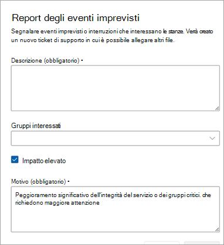

# Ticket di eventi imprevisti segnalati dal cliente

Per qualsiasi tipo di incidente non contrassegnato da Microsoft o per domande sul servizio/funzionalità, i clienti o i partner per conto dei clienti possono usare la funzionalità Segnala incidente per avvisare Microsoft di indagare sul problema o di rispondere alla domanda.

Nel campo Descrizione descrivere il più possibile il problema per cui è necessaria l'assistenza di Microsoft. È possibile aggiungere una o più sale.

Verificare  **l'impatto elevato** se l'evento imprevisto causa un peggioramento significativo dell'integrità del servizio o di una sala critica. Per consentire a Microsoft di assegnare correttamente la priorità alla richiesta, descrivere in dettaglio il motivo per cui si tratta di un impatto elevato.

> [!NOTE]
> Non usare questo campo per domande generali, chat room e/o problemi che non hanno una mitigazione disponibile.

Gli incidenti segnalati dai clienti sono considerati ticket critici, il che significa che il centro operativo del servizio Teams Rooms prima di valutare questi ticket. Vedere il contratto di servizio (SLA) relativo alla descrizione del servizio per gli eventi imprevisti segnalati dal cliente [qui](microsoft-teams-rooms-premium.md). Quando una stanza è (o le stanze sono) selezionate come parte del CRI, ogni camera verrà contrassegnata come **non integra** fino a quando il CRI non viene chiuso.

## Chiusura dei ticket di eventi imprevisti segnalati dal cliente

Gli eventi imprevisti segnalati dal cliente possono essere chiusi dal cliente, dai partner che gestiscono sale per conto dei clienti o dai tecnici del Centro operativo del servizio Microsoft.

**Per chiudere un evento imprevisto**

1. Seleziona **Chiudi ticket**.

   

1. Scegli un motivo per la chiusura selezionando una categoria dall'elenco.

   Dopo aver confermato il motivo della chiusura, il ticket viene chiuso e spostato in **Risolto**.

   

Nella sezione Panoramica dettagli del ticket viene indicato che il ticket è stato chiuso dal servizio Managed Rooms (Microsoft) o dal nome del cliente/partner.  

 

## Domande frequenti

**Qualcuno può chiudere i biglietti?**

Solo gli eventi imprevisti segnalati dai clienti possono essere chiusi da un utente o dal centro operativo del servizio Managed Rooms di Microsoft. I clienti che hanno assegnato un partner per gestire le stanze con autorizzazioni di gestione ticket avranno la possibilità di chiudere gli eventi imprevisti segnalati dai clienti.

**È possibile limitare chi può chiudere i biglietti?**

Al momento no. Tutti gli utenti che dispongono delle autorizzazioni di gestione dei ticket possono chiudere un CRI.

**Si riceve una notifica quando si chiude un ticket di richiesta di assistenza segnalato dal cliente?**

Al momento no.