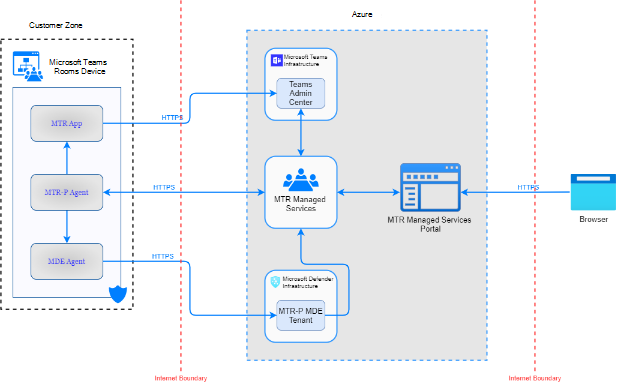

# Approccio

I clienti che usano servizi gestiti affidano a Microsoft i loro beni più preziosi: i dati. Si fidano che la sua privacy sarà protetta e che sarà utilizzata solo in un modo coerente con le loro aspettative.

La tecnologia segue i processi di privacy per assicurarsi che rispetti le promesse del cliente nella raccolta e nell'utilizzo dei dati che eseguono correttamente il servizio.

## Raccolta dati

I dati raccolti dalla tecnologia sono limitati alle informazioni necessarie per monitorare l'integrità, la causa principale e mitigare i problemi identificati nelle chat room registrate.

La tecnologia monitorerà i dispositivi, raccoglierà i dati di telemetria e consentirà a Microsoft di accedere e gestire in remoto i dispositivi come amministratore.

I dati di telemetria raccolti sono specifici di un account della sala, non di un singolo utente. Riferimenti accidentali a un singolo utente possono essere presenti nel log attività durante l'uso del dispositivo.

### Chi può accedere ai dati

Il servizio tecnologico adottare misure rigorose per proteggere i dati dei clienti da accessi o utilizzi non appropriati da parte di persone non autorizzate. Ciò include la limitazione dell'accesso da parte di personale e subcontraenti Microsoft.

### Zero archiviazione dei dati di accesso permanente

La tecnologia riduce i rischi associati agli account con accesso privilegiato – da parte di attori malintenzionati sia all'interno che all'esterno di un'organizzazione – attraverso il principio di accesso permanente zero. In questo modo il servizio può operare senza privilegi disponibili per qualsiasi utente per impostazione predefinita. In combinazione con i principi Just-In-Time e Just-Enough-Access, offre un framework affidabile per essere sicuro e conforme per impostazione predefinita. I dati di diagnostica sono disponibili per il nostro team operativo del servizio tramite un portale interno.

## Gestione dei dati

Microsoft è disciplinata da standard rigorosi per la trasmissione, l'archiviazione, l'uso e la conservazione dei dati. Microsoft ha definito criteri standard di gestione dei dati che illustrano come devono essere gestiti i dati in base alla classificazione dei dati.

Microsoft estende i diritti di protezione dei dati del Regolamento generale sulla protezione dei dati (GDPR) a tutti i clienti in tutto il mondo, non solo in Europa.

## Classificazione dei dati

La classificazione dei dati può essere usata per rispettare i requisiti e i processi di sicurezza, conformità e privacy per la raccolta, l'archiviazione e l'uso delle informazioni personali dell'utente.

|Classificazione|Descrizione|Esempio|
| :- | :- | :- |
|Contenuto del cliente|Contenuto fornito/creato direttamente da amministratori e utenti.|
- BLOB generati dal cliente o dati di archiviazione strutturati

- Segreti di proprietà del cliente/forniti (password, certificati, chiavi di crittografia, chiavi di archiviazione)
|
|Informazioni identificabili dall'utente finale (EUII)|Dati che identificano o potrebbero essere usati per identificare l'utente di un servizio Microsoft. EUII non contiene contenuto del cliente.|
- Nome utente o nome visualizzato (DOMINIO\NomeUtetore)

- Nome entità utente (name@company.com)

- Indirizzo IP specifico dell'utente
|
|Dati dell'account|
Informazioni relative alla fatturazione del cliente e allo strumento di pagamento, incluse le informazioni di contatto dell'amministratore, ad esempio il tenant

il nome, l'indirizzo o l'indirizzo dell'amministratore

numero di telefono.
|
- Informazioni di contatto per l'amministratore del tenant (ad esempio,

nome, indirizzo, indirizzo e-mail, numero di telefono dell'amministratore tenant)

- Provisioning del cliente

Informazioni
|
|Identificatori eupi (End User Pseudonymous Identifiers)|
Identificatore creato da Microsoft associato all'utente di un servizio Microsoft. Quando EUPI viene combinato con altre informazioni, ad esempio una tabella di mapping, identifica l'utente finale. EUPI non contiene informazioni caricate o create dal cliente

(Contenuto del cliente o EUII)
|
- GUID utente, PUID o SID

- ID sessione
|
|Informazioni identificabili dall'organizzazione|Dati che possono essere usati per identificare un tenant, in genere dati di configurazione o di utilizzo. Questi dati non sono collegabili a un utente e non contengono contenuto del cliente.|
- ID tenant (non GUID)

- Nome di dominio nell'indirizzo di posta elettronica (xxx@contoso.com) o in un altro dominio specifico del tenant

Informazioni
|
|Metadati di sistema|Dati generati durante l'esecuzione del servizio o del programma che non è collegabile a un utente o a un tenant.|
- Registri eventi

- Dati sull'utilizzo

- Dati di configurazione
|

Descrizione della tecnologia

La tecnologia invierà dati a Microsoft allo scopo di monitorare, diagnosticare e attenuare eventuali problemi nella distribuzione. Gli esempi includono

1. Verificare che il dispositivo sia aggiornato (tra cui App, sistema operativo, driver, F/W)
1. Verificare che il dispositivo sia pronto per l'uso (accesso, tutte le periferiche che segnalano lo stato integro e così via)
1. Verificare che l'ambiente sia pronto (account di cui è stato eseguito il provisioning, velocità di rete sufficientemente veloci e così via)
1. Determinare se possono verificarsi problemi hardware o di installazione (ad esempio la disabilitazione allentata)
1. Euristica per determinare i problemi (riavvii eccessivi e così via) 

La tecnologia gestirà il dispositivo con azioni come

1. Aggiornare il software
1. Riduci i problemi tramite riavvii, reimpostazione delle connessioni USB & stati
1. Raccogliere log specifici per diagnosticare più facilmente i problemi

La tecnologia non monitora né registra audio, video, contenuti multimediali o contenuti delle riunioni da Solution Kits. 

### Categorie di dati raccolti dal servizio
 
|Categoria|Dettagli|Motivo della query|
| :- | :- | :- |
|Gestione & della raccolta dei dati in corso|Indirizzo IP, identità dell'account della sala (Exchange, Skype for Business e/o Teams), coordinate della posizione, e-mail e comunicazioni all'interno del portale con Microsoft o software|Identificare e connettersi al sistema in gestione; Identificare, diagnosticare e ridurre gli errori; Tenere traccia dell'utilizzo, dell'analisi e dei dati analitici; Stato della connettività di Query & Repair|
|Gestione & raccolta dati ad hoc|
Informazioni sul registro eventi, attività/identità utente dal file di log della sala utente connesso insieme a informazioni\* di diagnostica, query di sistema di Windows (esempi: elenco di dispositivi USB,

stato di alimentazione e così via)
|Identificare, diagnosticare e ridurre gli errori e per l'utilizzo, l'analisi e le informazioni dettagliate|
|
Registrazione di valutazione e

Installazione
|
Query di sistema di Windows

Esempi: Elenco di dispositivi USB, stato di alimentazione e così via
|
Obbligatorio per la registrazione, l'onboarding, l'ordine e la consegna,

e configurazione per la versione di valutazione.
|

\* Le informazioni personali sensibili nel log attività dispositivo vengono redatte localmente (non raccolte dalla tecnologia):

1. Corpo & oggetto della riunione
1. Informazioni sulla scheda contatto per i partecipanti alla riunione, ad esempio Titolo, Numero di telefono e così via.
1. Contenuto del messaggio istantaneo della riunione

>> [!NOTE]
>Man mano che Microsoft evolve la tecnologia, i dati specifici sono soggetti a modifiche. 

### Classificazione dei dati dell'agente

**Descrizione dettagliata di tutti i dati raccolti dall'agente MTRP durante il monitoraggio in corso**
|Dati raccolti Descrizione|Classificazione|
| :- | :- |
|Identità di un dispositivo condiviso|Informazioni personali|
|ID cliente|Informazioni personali|
|Posizione directory agente MMR|Metadati di sistema|
|L'app MTR registra il percorso della directory|Metadati di sistema|
|Numero di serie del dispositivo|Metadati di sistema|
|Informazioni sul bios del dispositivo|Metadati di sistema|

|Versione dell'agente MMR|Metadati di sistema|
| :- | :- |
|Versione dell'app MTR|Metadati di sistema|
|Versione dell'app Teams|Metadati di sistema|
|Tempo di lavoro di manutenzione notturna per l'app MTR|Metadati di sistema|
|URL di aggiornamento dell'agente MMR|Metadati di sistema|
|Anello agente MMR|Metadati di sistema|
|Versione del sistema operativo Windows|Metadati di sistema|
|Utente attualmente connesso|Metadati di sistema|
|GUID sessione agente MMR|Metadati di sistema|
|Nome di dominio|Metadati di sistema|
|Tempo dall'ultimo riavvio del sistema operativo|Metadati di sistema|
|Tempo dall'inizio dell'ultimo agente MMR|Metadati di sistema|
|Realizzare e modellare dispositivi MTR|Metadati di sistema|
|Stato di utilizzo del dispositivo|Metadati di sistema|
|Tipo di onboarding del dispositivo|Metadati di sistema|
|Numero di monitor connessi|Metadati di sistema|
|Dettagli altoparlante MTR|Metadati di sistema|
|Dettagli microfono MTR|Metadati di sistema|
|Dettagli predefiniti degli altoparlanti MTR|Metadati di sistema|
|Impostazione di condivisione automatica dello schermo dell'app MTR|Metadati di sistema|
|Impostazione annuncio Bluetooth dell'app MTR|Metadati di sistema|
|Data dell'ultima modifica della password|Metadati di sistema|
|Impostazione della rotazione della password MTR|Metadati di sistema|
|Impostazione Teams/Skype for Business dell'app MTR|Metadati di sistema|
|Anello di aggiornamento dell'app MTR|Metadati di sistema|
|Impostazione della fotocamera del contenuto dell'app MTR|Metadati di sistema|
|Impostazione dei nomi delle riunioni dell'app MTR|Metadati di sistema|
|Impostazione davanti agli schermi della sala dell'app MTR|Metadati di sistema|
|GUID dell'app MTR|Metadati di sistema|
|Indirizzo proxy e porta|Metadati di sistema|
|Integrità del dispositivo MTR|Metadati di sistema|
|Dettagli dell'account della sala MTR|Informazioni personali|
|Indirizzo IPV4 e indirizzo IPV6|Informazioni personali|
|Longitudine e latitudine|Informazioni personali|
|Nome host dispositivo MTR|Informazioni personali|
|Fuso orario dispositivo MTR|Metadati di sistema|
|Stato dell'app MTR|Metadati di sistema|
|Dettagli del servizio Crestron|Metadati di sistema|
|Versione del firmware Logitech e versione di sincronizzazione Logitech|Metadati di sistema|
|Percentuale totale della CPU in uso|Metadati di sistema|
|Ram totale in uso|Metadati di sistema|
|CPU utilizzata da app Skype o Teams MTR|Metadati di sistema|
|Temperatura dispositivo MTR|Metadati di sistema|
|Stato delle unità disco interne|Metadati di sistema|
|Dettagli di un'app MTR si arresta in modo anomalo|Metadati di sistema|
|Dettagli di eventuali perdite di memoria rilevate causate dalle app nel dispositivo|Metadati di sistema|

|
Dettagli di eventuali errori con schermata blu del dispositivo che hanno avuto luogo nel

ultime 24 ore
|Metadati di sistema|
| :- | :- |
|
Dettagli degli eventuali errori rilevati dall'app MTR durante le riunioni in

il dispositivo
|Metadati di sistema|
|Dettagli software installati|Metadati di sistema|
|Dettagli delle correzioni rapide installate/in sospeso/mancanti|Metadati di sistema|
|Dettagli hardware riconosciuti|Metadati di sistema|
|Dettagli di tutti i driver nel dispositivo|Metadati di sistema|
|Dettagli di eventuali correzioni del dispositivo MMR|Metadati di sistema|
|Dettagli sull'utilizzo della sala durante le ultime 24 ore, orari e conteggi delle riunioni|Metadati di sistema|
|Dettagli degli aggiornamenti automatici di Windows Store|Metadati di sistema|
|Dettagli degli aggiornamenti del sistema operativo Windows|Metadati di sistema|
|Dettagli della schiacciamento dell'agente MMR|Metadati di sistema|
|Dettagli dell'errore di connessione dell'agente MMR|Metadati di sistema|
|Dettagli su se la sicurezza TPM è abilitata|Metadati di sistema|
|Dettagli sullo stato della connessione del dispositivo MTR|Metadati di sistema|

**Agente MTRP dati raccoglie per la diagnostica e la correzione degli eventi imprevisti**
|Dati raccolti Descrizione|Classificazione|
| :- | :- |
|
Registri eventi: Sistema, Applicazione, Skype Room System, Microsoft- Windows-AppXDeploymentServer%4Operational, Microsoft-Windows- PowerShell%4Operational, Microsoft-Windows- AppXDeployment%4Operational,Microsoft-Windows- AppXDeploymentServer%4Operational, Microsoft-Windows- TWinUI%4Operational, Microsoft Managed Rooms, Microsoft-Windows-

TaskScheduler%4Operational, Security
|Metadati di sistema|
|Log delle app MTR con redacted\*|Metadati di sistema|
|Log di Microsoft Teams|Metadati di sistema|
|Agente MMR sqlLitedb|Metadati di sistema|
|Dettagli delle informazioni sullo stato di alimentazione del dispositivo|Metadati di sistema|
|Informazioni su Criteri di gruppo per i dispositivi|Metadati di sistema|
|Traccia di controllo di tutte le azioni dell'agente MMR|Metadati di sistema|
\* Le informazioni personali riservate nel log attività dispositivo vengono disattivate localmente.

### Iscrizione

Questa tecnologia verrà registrata con il portale online per i servizi automatizzati di monitoraggio e supporto, inclusi i servizi di diagnostica e creazione di report. La registrazione viene eseguita tramite comunicazioni di rete crittografate tramite la chiave pubblica basata su TPM (Trusted Platform Module) del dispositivo.

### Annullamento della registrazione

È possibile annullare la registrazione del dispositivo disinstallando la tecnologia. Microsoft rimuoverà inoltre il dispositivo dal monitoraggio back-end durante la rimozione e potrà eliminare i dati raccolti su richiesta.

### Flusso di dati

La tecnologia aggiungerà un flusso di dati dall'agente ai servizi gestiti MTR.

Abilitando l'integrazione di Microsoft Defender per endpoint verrà introdotto un flusso di dati aggiuntivo dall'agente MDE all'infrastruttura di Microsoft Defender.

## Conformità

Tutti gli ingegneri che lavorano sul prodotto sono tenuti a sottoporsi a formazione sulla sicurezza e sulla privacy. Microsoft garantisce inoltre che tutto il personale certifica l'accettazione delle responsabilità per i requisiti di privacy.

La tecnologia fornisce supporto regionale per la residenza dei dati tramite i data center in Europa (UE), Asia Pacifico (APAC) e il Stati Uniti (Stati Uniti). Questo significa che i clienti del servizio avranno i dati correlati all'organizzazione archiviati nel data center dell'area geografica scelta.

## Risorse aggiuntive

Microsoft Teams Rooms Security:/microsoftteams/rooms/security Informativa sulla privacy di Microsoft: https://aka.ms/privacy Gestione dei dati presso Microsoft: https://www.microsoft.com/trust-center/privacy/data-management Descrizione del servizio tecnologico[: Microsoft Teams Servizio gestito da sala](microsoft-teams-rooms-premium.md)
