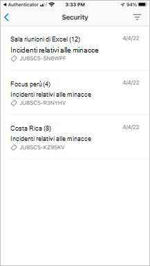
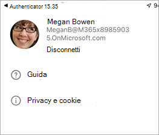

# Funzionalità delle applicazioni client per dispositivi mobili Teams Rooms

A volte può essere necessario gestire Teams Rooms Managed Services (MTMS) dal dispositivo mobile. L'app per dispositivi mobili offre molte funzionalità che è possibile gestire dal dispositivo mobile o tablet.
## Prima di iniziare

Per usare l'app per dispositivi mobili Teams Rooms, è necessario essere un amministratore di un'organizzazione Microsoft 365.
Scarica l'app per dispositivi mobili Teams Rooms dal [App Store Apple](https://apps.apple.com/app/apple-store/id761397963?pt=80423&ct=docsaboutadminapp&mt=8) o dal [Google Play Store](https://play.google.com/store/search?q=Microsoft%20Teams%20Rooms&c=apps).

**Per ottenere l'app MTMS per dispositivi mobili**

1. Cerca Teams Rooms Servizi gestiti nell'App Store per il tuo dispositivo e installalo.
2. Accedere con l'indirizzo di posta elettronica dell'amministratore globale e visualizzare il dashboard per visualizzare l'integrità dei servizi, monitorare le licenze utente e visualizzare i messaggi e le richieste di servizio.
## Gestione degli eventi imprevisti

Ecco alcune delle funzionalità disponibili nell'app per dispositivi mobili per la gestione degli eventi imprevisti.

- Ricevere notifiche push per i nuovi eventi imprevisti.
- Toccare la notifica per aprire e visualizzare immediatamente i dettagli dell'incidente.
- Elencare tutti gli eventi imprevisti attivi e risolti, inclusi lo stato letto e non letto nei messaggi.
- Visualizzare i dettagli di base dell'incidente con le informazioni sui ticket, inclusi i messaggi.
- Visualizzare allegati e file dei ticket.
- Disconnettersi da un pannello utente (le notifiche/messaggi vengono disabilitati se sono disconnessi).

### Pagina eventi imprevisti

La pagina Eventi imprevisti mostra i tipi di eventi imprevisti aperti.

<!-- Immagine approvata da Microsoft per autore.>

## Gestione dei ticket
Ecco alcune delle funzionalità disponibili nell'app per dispositivi mobili per la gestione dei ticket.

- Confermare l'evento imprevisto (contrassegnare come letto).
- Leggi, pubblica e rispondi ai messaggi su un ticket.
- Passa alla modalità scura.
- Aggiungere un allegato (scattare e caricare immagini).
- Segnalare un evento imprevisto (creare un ticket).

### Messaggi di ticket

### Dettagli biglietto

### Segnalare un evento imprevisto

### Visualizzare un evento imprevisto per categoria

<!-- Immagine approvata da Microsoft per autore.>
### Sicurezza gestita con Microsoft Defender

### Comunicazione con gli esperti

### Disconnetti

<!-- Immagine approvata da Microsoft per autore.>
## Domande frequenti

Di seguito sono riportate le risposte alle domande frequenti.

**Cosa devo fare per poter usare l'app?**

Per usare l'app è necessario disporre delle autorizzazioni di amministratore e di un abbonamento valido Microsoft 365.

**Quali lingue sono supportate dall'app?**

**Come si condividono gli eventi imprevisti e i messaggi con il resto dell'organizzazione?**

**È possibile usare questa app con più account o tenant?**

**Non riesco ad accedere o la mia app si comporta in modo divertente. Cosa posso fare per risolvere il problema?**

Puoi provare alcuni passaggi comuni per la risoluzione dei problemi relativi alle app per dispositivi mobili:
- Chiudere e riaprire l'app.
- Disinstalla e reinstalla l'app. Assicurati di avere la versione più recente dell'app.
- Se nel dispositivo è installata Microsoft Authenticator o l'app portale aziendale, prova a reinstallarla o ad aggiornare alla versione più recente. Se non funziona, puoi inviarci un'e-mail all feedback365@microsoft.com per comunicarcelo.

**Cosa fare se non viene trovata una risposta alla domanda?**

## Passaggi successivi

Il client mobile offre funzionalità di creazione di ticket e di gestione degli incidenti all'interno dell'organizzazione.

**Per usare l'app per dispositivi mobili Teams Rooms**

1. Scarica l'app [dall'App Store Apple]() o dal [Google Play Store]()
1. Verificare di avere un abbonamento valido Microsoft 365.
1. Usare le credenziali di lavoro usate per accedere all'app desktop Teams Rooms.
