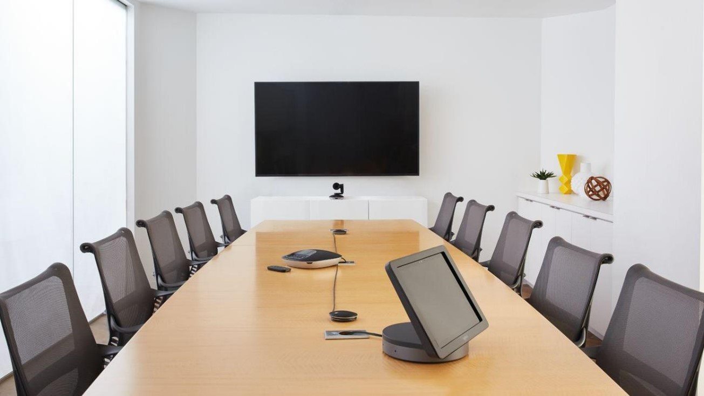

<h1>Microsoft Teams Rooms</h1>
<ul class="panelContent cardsW cols cols2">
    <li>
        

            

                

                    

                        
Trasforma gli spazi delle riunioni che vanno dalle piccole aree di calco alle ampie sale riunioni con un'esperienza di Team collaborativa ricca che&#39;semplice da usare, distribuire e gestire. 

                        
Avviare le riunioni in tempo con l'aggiunta di un tocco, quindi proiettare istantaneamente la visualizzazione nella sala e condividerla con i partecipanti remoti. 

                        
Selezionare il sistema giusto e le periferiche audio video da uno dei nostri partner: Yealink, Logitech, Crestron, Polycom, Lenovo e HP.

                        

                    

                

            

        

    </li>
    <li>
        

            

                

                    

                        

                            
                        

                    

                

            

        

    </li>
</ul>
<ul class="panelContent cardsFTitle">
    <li>
        <a href="https://docs.microsoft.com/MicrosoftTeams/rooms/rooms-plan">
        

            

                

                    

                        

                            
                        

                    

                    

                        <h3>Piano</h3>
                    

                

            

        

        </a>
    </li>
    <li>
        <a href="https://docs.microsoft.com/MicrosoftTeams/rooms/rooms-deploy">
        

            

                

                    

                        

                            
                        

                    

                    

                        <h3>Distribuzione</h3>
                    

                

            

        

        </a>
    </li>
    <li>
        <a href="https://docs.microsoft.com/MicrosoftTeams/rooms/rooms-manage">
        

            

                

                    

                        

                            
                        

                    

                    

                        <h3>Gestione</h3>
                    

                

            

        

        </a>
    </li>
</ul>

> [!NOTE]
> Microsoft teams Rooms è progettato per l'uso con Microsoft teams, Skype for business online, Skype for Business Server 2019 o Skype for Business Server 2015.    Non è previsto che le piattaforme precedenti come Lync Server 2013 funzionino con le sale di Microsoft teams.

Questi articoli sono destinati agli utenti che hanno il compito di pianificare, distribuire e gestire questi dispositivi e non per quelli del sistema. Gli utenti saranno più interessati alla guida di Microsoft teams Rooms [online](https://support.office.com/article/Skype-Room-Systems-version-2-help-e667f40e-5aab-40c1-bd68-611fe0002ba2).

> [!NOTE]
> [Skype room System](../rooms/lrs-migration.md) (in precedenza Lync room System) e Microsoft teams Rooms sono prodotti diversi con diverse dipendenze e procedure di distribuzione.
