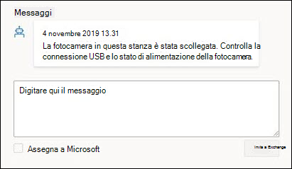
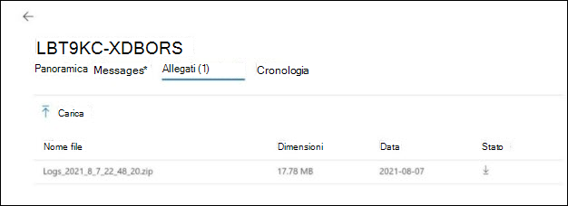

# Portale delle sale riunioni gestite da Microsoft

## Panoramica

Il portale Sale riunioni gestite ("Portale sale") offre una panoramica dell'integrità delle sale riunioni. Una visualizzazione cliente di questo portale è per la tua visibilità e il tuo feedback e per facilitare gli strumenti e le procedure di monitoraggio esistenti.

L'ambito di applicazione del monitoraggio è

- Visualizzazione degli incidenti
  - Problemi principali che interessano le stanze
  - Azioni necessarie per ripristinare lo stato integro dei gruppi
  - Problemi in fase di analisi da parte di Microsoft
- Visualizzazione dei dispositivi room di Microsoft Teams
  - Snapshot dello stato a livello di dispositivo Microsoft Teams Rooms (MTR)
  - Cronologia di base e dettagli per ogni dispositivo

**Visualizzazione dei dispositivi room di Microsoft Teams**

- Snapshot dello stato a livello di dispositivo Microsoft Teams Rooms (MTR)
- Cronologia di base e dettagli per ogni dispositivo

> [!Important]
> Vedere [**Assegnare utenti al ruolo Amministratore del servizio gestito**](enrolling-mtrp-managed-service.md#assign-users-to-the-managed-service-administrator-role) e verificare che l'accesso al portale sia limitato in base alle esigenze aziendali.

## Terminologia

Ecco i termini usati di frequente nel portale.

|Termine |Significato |
| :- | :- |
|**Software di monitoraggio** |Agente di monitoraggio distribuito in ognuno dei dispositivi di Microsoft Teams Room. |
|**App** |App Microsoft Teams Room System (indipendentemente dal fatto che usi Skype for Business o Microsoft Teams come servizio di collaborazione. |
|**Sala/Dispositivo** |Il dispositivo certificato Microsoft Teams Room System. |
|**Non monitorato** | Il software di monitoraggio Microsoft distribuito nell'ambito dei servizi gestiti non è in grado di connettersi ai servizi cloud. Non riceviamo dati di telemetria sul dispositivo. |
|
**Integro /** 

**Malsano** 
|Anomalie nel dispositivo/periferica. |
|**Soppresso** |Se un dispositivo è noto per essere in manutenzione e gli avvisi devono essere ignorati, il dispositivo può essere soppresso deliberatamente. |
|**Onboarding** |Lo stato di un dispositivo della sala durante l'aggiunta della configurazione, ma non è pronto come sala regolarmente supportata. |
|**Incidente** |Un problema che interessa le esperienze di riunione degli utenti finali che richiedono un intervento. |
|**Configurazione non configurata correttamente** |La configurazione rilevata non è corretta/ usata comunemente. |
|**Ticket di supporto** |Identificatore di monitoraggio Microsoft interno che tiene traccia di tutte le comunicazioni/azioni relative a un evento imprevisto. |

## Visualizzazione Eventi imprevisti

Questa visualizzazione offre una panoramica della scheda Eventi imprevisti nel portale sale gestite. Questa pagina è la home page predefinita del portale.

### Riepilogo principale 
Il riepilogo principale mostra a colpo d'occhio i problemi che interessano le chat room, le operazioni che è necessario eseguire e le azioni che Microsoft sta svolgendo su di esse:

|# |Spiegazione |
| :- | :- |
|1 |Tipi di incidenti che interessano le stanze |
|2 |**NEED ACTION**: elementi che richiedono l'intervento dell'utente per la risoluzione. |
|3 |**ASSEGNATO A MICROSOFT**: elementi attualmente oggetto di indagine da parte del personale Microsoft. |
|4 |**INDAGINE IN SOSPESO**: gli elementi in coda devono essere esaminati dal personale Microsoft. |

Si prevede che gli incidenti si trovino in uno dei tre stati seguenti:

- **Azione necessaria**: assegnata per l'azione
- **Assegnato a Microsoft**: Assegnato a Microsoft per l'azione successiva
- **Indagine in sospeso**: in fase di analisi per i passaggi successivi

### Revisione degli incidenti

L'immagine seguente elenca tutti gli incidenti attualmente attivi nelle chat room. I passaggi successivi sono quelli assegnati *all'utente nella parte superiore* . Ecco cosa occorre fare per eseguire i passaggi successivi. Inoltre, quelle assegnate a Microsoft o le indagini in sospeso contengono dettagli che è possibile usare per intervenire.

Se si fa clic su uno degli elementi con lo stato "**Azione necessaria**", vengono visualizzati altri dettagli sull'evento imprevisto.

## Tipi di incidenti

Gli incidenti sono classificati in due tipi di gravità generali:

- **Importante**: eventi imprevisti che probabilmente causano problemi nelle riunioni e che devono essere classificati in ordine di priorità.
- **Avviso** : eventi imprevisti che sono notifiche per pianificare azioni di manutenzione. Se non vengono curate, nel corso del tempo è più probabile che le stanze riscontreranno un problema. Gli avvisi hanno lo scopo di dare tempo per pianificare e orchestrare il supporto.

Un avviso potrebbe passare a "**Importante**" se non ha partecipato per un po'.

## Stato di integrità del dispositivo e eventi imprevisti

Gli incidenti classificati come **"Importanti"** in gravità influiscono sullo stato di integrità di un dispositivo. Se è presente almeno un incidente di **Gravità = "Importante"** associato a un dispositivo, viene classificato come dispositivo **_non integro_** .

Gli incidenti classificati come **gravità "Avviso"** non influiscono sullo stato di integrità segnalato su un dispositivo. Tuttavia, se a un dispositivo sono associati incidenti di livello di avviso, lo stato di integrità del dispositivo viene indicato come segue.

Ecco alcuni tipi di incidenti che potrebbero essere visualizzati e le spiegazioni per ogni tipo. Per ogni tipo, l'azione associata all'evento imprevisto sarà più specifica a seconda del problema.

**Tabella 1: eventi imprevisti con gravità "Importante"**

|Tipo |Spiegazione |
| :- | :- |
|**Schermo** |Lo schermo collegato al dispositivo non sembra essere integro.|
|**Microfono conferenza, altoparlante conferenza** |I dispositivi audio (microfono/altoparlante) sembrano non essere configurati correttamente. |
|**Fotocamera** |La fotocamera collegata al dispositivo non sembra essere integro. |
|**HDMI Ingest** |L'ingerito HDMI non è sano. |
|**Accesso** (Exchange) |Microsoft Teams Rooms'app accede alle informazioni del calendario da Exchange e qualsiasi problema relativo all'esito positivo dell'accesso verrà segnalato con un evento imprevisto di accesso. |
|**Accesso** (Teams) |Microsoft Teams Rooms'app accede al dispositivo e l'errore di accesso verrà segnalato con questo evento imprevisto (se il cliente usa Teams). |
|**Accesso** (Skype for Business) |Microsoft Teams Rooms'app accede al dispositivo e l'errore di accesso verrà segnalato con questo evento imprevisto (se il cliente usa Skype for Business). |
|**Sensore di prossimità** |Microsoft Teams Rooms'app invita i partecipanti a partecipare a una riunione se si trovano nelle vicinanze. Gli errori in questa funzionalità verranno segnalati in base a questo evento imprevisto. |

**Tabella 2: eventi imprevisti con gravità "Avviso"**

|Tipo |Spiegazione |
| :- | :- |
|**Versione dell'app** |La versione dell'app Microsoft Teams Room in esecuzione sul dispositivo non è aggiornata. Le versioni non aggiornate sono cause note dei problemi riscontrati dagli utenti. |
|**Versione del sistema operativo** |La versione del sistema operativo Windows in esecuzione nella sala riunioni non è più consigliata. |
|**Rete** |Ciò verrà rimosso come tipo di avviso a breve termine a causa del lavoro aggiuntivo richiesto dopo la valutazione. |

## Risposta a eventi imprevisti

Gli eventi imprevisti possono essere suddivisi in tre categorie: Richiede un'azione, Indagine in sospeso o Assegnata a Microsoft.

### Richieste di intervento

Gli eventi imprevisti con stato impostato su **"Azioni necessarie"** vengono assegnati all'utente per intraprendere un'azione correttiva.

Ogni incidente di questo tipo avrà un campo di azione con un'azione consigliata da Microsoft come indicato di seguito:

- Se l'azione è stata eseguita, è possibile rispondere all'evento con le note nella casella Rispondi e quindi scegliere "Assegna a Microsoft" prima di pubblicare.
- È anche possibile che la notifica non sia corretta in base alla tua recensione. In tal caso, fornisci il feedback e riassci a Microsoft.
- Infine, se si vuole aggiungere un commento per fornire un contesto aggiuntivo per il proprio team o per il team di Microsoft, pubblicare il messaggio senza attivare "Assegna a Microsoft".

>[!NOTE]
>L'azione correttiva potrebbe risolvere il problema e il monitoraggio delle sale gestite cancella l'evento imprevisto dall'elenco. Nella situazione precedente, potresti non avere la possibilità di risolvere il problema e assegnarlo di nuovo a Microsoft. Questo problema verrà risolto in una versione futura.

### Eventi imprevisti "Indagine in sospeso"

Per gli incidenti in fase di indagine, il campo descrizione contiene informazioni sull'incidente, sulle cause tipiche e sulle risoluzioni che possono essere utili per risolvere determinati problemi in modo da poter agire senza ritardi.

### Eventi imprevisti "Assegnati a Microsoft"

Per gli eventi imprevisti assegnati a Microsoft, il campo "Azione" conterrà brevi dettagli sui passaggi correttivi pianificati o in corso. Questi passaggi potrebbero richiedere la collaborazione con il team e la collaborazione estesa verrà eseguita tramite posta elettronica/chiamate in base alle esigenze. Una volta risolti, questi problemi scompariranno dal portale e in futuro vi sarà una cronologia per tenere traccia di tali incidenti e la loro risoluzione.

## Visualizzazione Sale

Ogni dispositivo è un proxy per una stanza e le relative periferiche connesse. Un dispositivo integro rappresenta una sala integra e un dispositivo non integro rappresenta una sala che probabilmente causa problemi durante le riunioni. Oltre alla visualizzazione Eventi imprevisti, il portale Sale gestite offre anche una panoramica dell'integrità delle chat room e consente di risolvere i dettagli del dispositivo e di comprendere gli errori ripetuti con la cronologia degli eventi imprevisti.

**Sano, non sano, disconnesso** Il riquadro superiore della visualizzazione Sale fornisce un rapido snapshot del numero di dispositivi in uno stato di buono stato("Integro"), del numero di dispositivi interessati da problemi ("Non integro"), del numero di dispositivi che non forniscono la telemetria ("Disconnesso") e del numero di dispositivi per i quali non viene eseguito l'avviso (come override). Le camere sono monitorate per la salute utilizzando criteri ed euristica in evoluzione. L'obiettivo è riflettere la realtà dell'esperienza utente nella stanza nel modo più accurato possibile e renderla fruibile.

**Stanze sane/non sane**:

I dispositivi/periferiche che non presentano incidenti di gravità "Importante" soddisfano gli attuali criteri di integrità sono contrassegnati come integri. Tuttavia, non implica che ci sia un'interruzione di stanza per ogni dispositivo non integro nel portale. La descrizione e l'azione dell'incidente contengono dettagli più specifici sul problema e il potenziale impatto sull'esperienza utente.

**Dispositivo disconnesso:**

L'agente di monitoraggio Microsoft distribuito nell'ambito del progetto pilota Managed Rooms viene disconnesso dai servizi cloud delle chat room gestite. Non riceviamo dati di telemetria sulla stanza e non abbiamo lo stato di integrità più recente. Ciò può verificarsi a causa di problemi di rete, modifiche ai criteri del firewall o se sono state apportate modifiche all'immagine del dispositivo.

## Dettagli sala: stato e modifiche

**Dettagli sala: Stato** La scheda *Stato* dispositivo fornisce una visualizzazione consolidata dello stato di un dispositivo, tutti i problemi attivi per il dispositivo, le azioni necessarie per risolverli o in corso. La scheda Stato contiene anche la suddivisione dei diversi componenti di integrità per il dispositivo *nella scheda Eventi imprevisti*. Se un dispositivo è disconnesso, i dettagli dello stato non saranno disponibili.

**Mostra tutti i segnali:** Per visualizzare tutti i segnali contenuti in una categoria di segnale, abilita l'interruttore Mostra tutti i segnali. Le frecce di espansione verranno visualizzate accanto alle intestazioni di categoria su cui è possibile fare clic per espandere la visualizzazione fisarmonica.

**Sopprime/Unsuppress Ticket** Quando una chat room è registrata, si indica che si vogliono ricevere notifiche per le modifiche apportate alla telemetria della sala. In alcuni casi, un particolare dispositivo o periferica si trova in uno stato noto in cui non si desidera generare ticket o notifiche. Utilizzando la funzionalità Elimina ticket, tutte le notifiche relative a quel particolare segnale verranno silenziate. Quando si è pronti per il servizio per monitorare e avvisare su quel segnale, basta annullare il singolo segnale.

**Espansione della categoria ticket attivo** In ogni categoria di ticket, verranno visualizzati tutti i ticket attivi o risolti più di recente insieme alla gravità e alla data dell'ultimo aggiornamento del ticket. Facendo clic sulla freccia di espansione, tutti i biglietti appariranno con un link attivo alle informazioni sul biglietto.

Espansione della categoria di ticket attivo: in ogni categoria di ticket, verranno visualizzati tutti i ticket attivi o risolti più di recente, insieme alla gravità e alla data dell'ultimo aggiornamento del ticket. Facendo clic sulla freccia di espansione, tutti i biglietti appariranno con un link attivo alle informazioni sul biglietto.

## Ticket attivo: panoramica

Ogni evento imprevisto creato identifica il problema rilevato e le azioni correttive da intraprendere per ripristinare lo stato integro della chat room. Il ticket generato trasmetterà una panoramica degli eventi imprevisti con tutti i messaggi generati dall'intelligenza artificiale dei servizi gestiti e dal team di progettazione dei servizi Microsoft che sta analizzando il problema. Verranno elencati tutti gli allegati raccolti per la risoluzione dei problemi degli incidenti. La scheda cronologia contiene le date identificate per i problemi.

Ticket attivo: messaggi L'interfaccia utente dei messaggi è lo strumento di comunicazione principale per interagire con i tecnici del servizio Microsoft che lavorano per risolvere il problema identificato. È importante riconoscere le comunicazioni di Microsoft per garantire che venga fornito il miglior servizio possibile. Se sono state intraprese le azioni consigliate, rispondere a questo evento con le note nella casella Rispondi e assegnarle a Microsoft facendo clic su "Assegna a Microsoft" prima di pubblicare.
È anche possibile che la notifica non sia corretta in base alla tua recensione. In tal caso, fornisci il feedback e riassci a Microsoft.
Infine, se vuoi aggiungere un commento per fornire ulteriore contesto al tuo team o al team Microsoft, pubblica semplicemente il messaggio senza attivare "Assegna a Microsoft

Ticket attivo: allegati In alcuni casi i tecnici del servizio Microsoft hanno bisogno di informazioni aggiuntive per approfondire l'analisi del problema. La scheda degli allegati consente di caricare immagini, video o log richiesti.

Ticket attivo: cronologia Ogni segnale della stanza ha un solo numero di biglietto assegnato appositamente. Una periferica o un dispositivo della sala persiste in una stanza e potrebbe presentare problemi nel tempo. Mantenendo queste informazioni in un id univoco specifico, tutte le informazioni storiche vengono mantenute e possono essere analizzate per individuare modelli di comportamento. L'interfaccia utente Cronologia fornisce una visualizzazione di tutte le azioni di ticket create e risolte per questo segnale.

Domande frequenti In che modo i ticket dinamici influiscono su me e sulle operazioni delle mie stanze?  
I clienti vedranno la creazione di biglietti e correzioni più intelligenti che si espandono oltre un ticket di segnale binario. Ad esempio, in una sala riunioni possono essere presenti un massimo di tre schermi (schermo 1, schermo 2 & schermo del touch panel MTR). Tuttavia, è presente solo un (uno) segnale di visualizzazione integro o non integro. Con i nuovi biglietti dinamici, ora possiamo generare biglietti unici per ogni segnale di visualizzazione.
