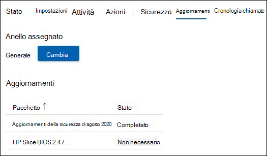

# Gestione degli aggiornamenti 
Una moderna sala riunioni è dotata di un dispositivo Microsoft Teams Rooms e di altre periferiche, ad esempio una fotocamera, un microfono o un altoparlante, e potenzialmente più dispositivi per creare un'esperienza di riunione inclusiva ed efficace. L'attrezzatura di diversi tipi di OEM fornisce l'esperienza organizzativa desiderata; tuttavia, devono essere mantenuti con software e firmware su base continuativa.  

Microsoft Teams Rooms Pro Management garantisce che ogni chat room dell'organizzazione verrà mantenuta ai livelli consigliati per offrire una chat room sempre pronta e funzionante correttamente. L'obiettivo di Microsoft è ridurre la complessità e il lavoro del personale operativo grazie all'intelligenza e all'automazione. La risoluzione dei problemi o la diagnostica viene eseguita il più rapidamente possibile. 

## Transizione di un dispositivo a Gestione pro 
L'onboarding dei dispositivi sala alla gestione pro ha in genere una cronologia e una pratica di gestione delle modifiche diverse dalle nostre indicazioni.  

- Per trarre vantaggio da Pro Management, è necessario eseguire la transizione della gestione delle modifiche per tutti gli aggiornamenti del portfolio Di gestione pro.
- Più origini dei contratti di servizio per l'impatto sulla gestione delle modifiche perché è presente un'individuazione e una correzione che verranno riavviate di nuovo se si verifica un evento imprevisto nella sala.
- Microsoft ha implementato controlli e controlli per implementare criteri che possono variare da un'organizzazione all'altra e la possibilità di intervenire in situazioni eccezionali.
- Alla fine, i dispositivi della sala verranno aggiornati secondo standard comuni, ad eccezione delle eccezioni a causa di problemi con un'installazione hardware specifica.  

## Dispositivi di transizione: controlli di conformità di base 
La maggior parte dei guasti imprevisti derivano da cambiamenti nell'immagine di base con una storia incerta della gestione dei cambiamenti. 

È consigliabile eseguire semplici controlli di conformità:  

- **Immagine di** base: l'immagine di base deve provenire dall'OEM specifico. Se il dispositivo è stato ricostruito in passato e mostra errori o comportamenti imprevisti nelle attività comuni, è necessario ripristinare l'immagine di base. È possibile fornire assistenza, ma non è possibile ricostruire in remoto il dispositivo della sala, quindi è necessario un tecnico del sito locale.  
- **Sistema operativo base, Edizione:** Il sistema operativo e l'edizione di base devono soddisfare i requisiti dei dispositivi Microsoft Teams Rooms. In caso contrario, deve essere corretto nell'ambito dell'onboarding. Microsoft Teams Rooms richiede gli SKU Windows 10 IoT Enterprise o Windows 10 Enterprise nelle opzioni di manutenzione di Semi-Annual Channel. Per ulteriori informazioni, consulta la [guida ufficiale di MTR](rooms-lifecycle-support.md#windows-10-release-support) .

## Controlli di conformità

Sono disponibili alcuni prerequisiti per la ricezione degli aggiornamenti tramite il servizio di gestione pro: 

|Software |Linee guida |
|:- |:- |
|Logitech Sync Services  |Deve essere installato e in esecuzione nei dispositivi della sala riunioni Logitech. I servizi di sincronizzazione obbligatori verranno installati automaticamente da Windows Aggiornamenti a meno che non vengano bloccati. È anche possibile installare il pacchetto di sincronizzazione completo. |
|Aggiornamenti del sistema operativo Windows |Deve essere mantenuto abilitato e non reindirizzato a WSUS, né bloccato da una prospettiva di rete. Né criteri Criteri di gruppo né criteri MDM devono essere usati per gestire gli aggiornamenti del sistema operativo. |
|Aggiornamenti di Microsoft Store   |Dovrebbe essere disattivata. Se disponibili, i servizi gestiti disattiveranno gli aggiornamenti dello Store. |
|Software antivirus |Se si esegue il software AV su questi dispositivi, è necessario assicurarsi che av presenti esclusioni per Le DLL di Teams e Skype. Per altre informazioni, vedere [Come includere o escludere Teams dalle applicazioni antivirus o DLP](/microsoftteams/troubleshoot/teams-administration/include-exclude-teams-from-antivirus-dlp) . |
|Software aggiuntivo |Software aggiuntivo, ad esempio la visualizzazione del desktop remoto di terze parti e così via, deve essere esaminato con i servizi gestiti per escludere gli effetti collaterali. |
|Gestione aggiuntiva delle modifiche|Può interferire con gli aggiornamenti coperti e" non dovrebbe essere introdotto. |

## Aggiornamenti gestiti: funzionamento 
Esistono due modi principali di gestire gli aggiornamenti:  

- **Gestito automaticamente**: i Aggiornamenti vengono installati nel dispositivo della chat room in base alla valutazione di Pro Management. Non è richiesto alcun intervento per gli aggiornamenti gestiti nel nostro portafoglio.
- **Circuito convalidato**: configurare un sistema ad anello per visualizzare in anteprima gli aggiornamenti su dispositivi specifici in modo da poterli monitorare senza il lavoro della gamba associato. La configurazione dell'anello fornisce un ulteriore livello di due diligenza prima di implementi ampie.  

### Gestito automaticamente

Se si sceglie di essere gestiti automaticamente, non è necessario alcun intervento per gli aggiornamenti. Tuttavia, è consigliabile esaminare l'attuale portfolio di aggiornamenti supportati dal servizio Di gestione pro. Il portafoglio viene costantemente aggiornato ed è nostra priorità coprire gli aggiornamenti più frequenti e di grande impatto per garantire la stabilità della tua stanza. Controllare l'elenco corrente (nella sezione "Gestione degli aggiornamenti" di questo documento) per pianificare eventuali altre operazioni di gestione delle modifiche necessarie per l'organizzazione.  

**Raccomandazione:** Non installare gli aggiornamenti coperti dal servizio di gestione pro in qualsiasi dispositivo gestito autonomamente. 

### Convalida anello

Quando si sceglie la convalida dell'anello, vedere le sezioni seguenti sul funzionamento dei circuiti nel portale di Gestione pro e sulle opzioni disponibili per personalizzarlo per l'organizzazione. Anche con la convalida dell'anello, si tenta di garantire che le stanze non siano scaduto in base agli aggiornamenti consigliati. A seconda della situazione, una chat room potrebbe ricevere aggiornamenti di "aggiornamento" per assicurarsi che sia conforme ai suggerimenti di Microsoft.  

 Controlla la disponibilità di annunci nella home page del portale e nella documentazione di Pro Management man mano che nuovi tipi di software e firmware diventano disponibili nel portfolio. 

### Pianificazione 
Aggiornamenti sono pianificate per le sale in base alle attrezzature presenti nella sala e se non soddisfano gli standard consigliati per software e firmware applicabili. 

- Per aiutare i clienti a soddisfare i requisiti di gestione delle modifiche, l'implementazione degli aggiornamenti inizia **il mercoledì** nell'anello di gestione temporanea. Se è necessario un aggiornamento critico, questa pianificazione verrà ignorata e l'aggiornamento rilasciato non appena sarà disponibile. 
- Aggiornamenti vengono sequenziati in base alla necessità in una particolare stanza. 
- Se hai anelli di configurazione per convalidare gli aggiornamenti, l'aggiornamento progredisce nell'ordine di squillo. 
- Un nuovo aggiornamento può sostituisce un aggiornamento che viene accodato se viene determinato che la stabilità della stanza migliorerà, in base alla tua situazione.  
- Aggiornamenti vengono in genere applicati durante la nostra finestra di manutenzione notturna, che è l'ora locale della stanza **12:00 - 5:00** per evitare qualsiasi tipo di interruzione. 

## Criteri relativi al ciclo di vita degli aggiornamenti delle app di Microsoft Teams Rooms 
I criteri relativi al supporto del team di progettazione MTR prevedono che tutto il supporto termini dopo la scadenza del ciclo di vita di dodici (12) mesi per una versione o se da allora sono stati rilasciati più di due aggiornamenti. I clienti devono quindi eseguire l'aggiornamento a una versione supportata. Fai riferimento [Microsoft Teams Rooms supporto della versione dell'app - Microsoft Teams | Microsoft Docs](rooms-lifecycle-support.md) per una descrizione dettagliata del servizio. 

## Walk-through dell'esperienza di gestione degli aggiornamenti  
Per visualizzare gli aggiornamenti, accedere al portale di gestione di Pro e passare alla pagina Aggiornamenti.

Il riquadro Aggiornamenti mostra una panoramica generale della gestione degli aggiornamenti per le chat room con le schede seguenti:

- **Aggiornamenti**: aggiornamenti del software o del firmware applicabili all'organizzazione.  
- **Sale**: la scheda Sale offre una vista delle stanze e degli anelli a cui appartiene ogni chat room.
- **Anelli**: la scheda Anelli mostra gli anelli delle sale per l'organizzazione.

### Aggiornamenti  

Questa visualizzazione mostra gli aggiornamenti pertinenti per il tenant e il rispettivo stato. Per visualizzare gli aggiornamenti passati non più attivi, seleziona l'interruttore **Includi aggiornamenti passati** su ATTIVATO.  

Qualsiasi aggiornamento può essere in uno degli stati seguenti:

| Stato | Descrizione |
|:- |:- |
| Programmato | È pianificato un aggiornamento per le sale in un determinato anello. Tieni presente che un aggiornamento mostrerà Pianificato solo dopo che la progressione avrà colpito l'anello in cui si trova la stanza. Ad esempio, se un nuovo aggiornamento si trova nell'anello Di gestione temporanea, mostrerà solo i gruppi Pianificati per nell'anello di gestione temporanea.  
 Gli altri anelli avranno lo stato "Non richiesto" fino a quando l'aggiornamento non progredisce su tale anello.
 |
| In corso | È in corso un aggiornamento e i singoli anelli mostrano lo stato. Questo stato mostra lo stato generale dell'anello e quindi se si applica un aggiornamento a una singola sala nell'anello di gestione temporanea nel tenant, l'aggiornamento avrà lo stato "In corso" fino al raggiungimento dell'anello Dirigenti. |
| Completato con errori | Un aggiornamento ha completato la progressione attraverso tutti gli anelli configurati e non è riuscito in almeno una stanza. |
| Completato | Un aggiornamento ha completato la progressione attraverso tutti gli anelli configurati e installato correttamente in tutte le sale applicabili.|
| Deprecato | È stato disattivato un aggiornamento. L'ulteriore spiegamento è stato interrotto. Questo è tipico perché l'aggiornamento è stato superato da una nuova versione. |
| Pausa | Un aggiornamento è in stato di sospensione. |
| Non obbligatorio | L'aggiornamento non viene ancora valutato per la chat room o non si applica alla chat room. |

### Camere  

La scheda Sale mostra tutte le chat room nel tenant e a quale anello appartengono.  

Per configurare l'anello a cui deve appartenere una chat room:  

1. Fare clic sulla sala per visualizzare la visualizzazione dettagliata.  
1. In **Anello** fare clic su **Cambia**.  
1. Selezionare l'Anello a cui deve appartenere la chat room.  
1. Fare clic su **Assegna**.  

La visualizzazione dettagliata della sala mostra gli aggiornamenti pertinenti e il relativo stato nel nodo **Aggiornamenti**.  

### Anelli  

Gli anelli vengono usati per ridurre il rischio di problemi derivanti dalla distribuzione degli aggiornamenti delle funzionalità. Questa operazione viene eseguita gradualmente distribuendo l'aggiornamento all'intero sito. Ogni anello deve avere un elenco di chat room di Microsoft Teams e una pianificazione di implementazione corrispondente. La definizione di anelli è in genere un evento una tantum (o almeno poco frequente), ma l'IT dovrebbe rivedere di tanto in tanto questi gruppi per assicurarsi che la sequenziazione sia ancora corretta.  

La scheda **Anelli** elenca tutti gli anelli del tenant. Sono disponibili tre anelli preconfigurati:  

- **Gestione temporanea**: assegnare sale all'anello di gestione temporanea, che è il letto di prova. Tutti i nuovi aggiornamenti verranno implementati prima qui. In generale, è consigliabile assicurarsi che l'anello di gestione temporanea rappresenti le sale con la diversità dei tipi di dispositivo nell'ambiente. Se esistono determinati tipi di sale con una configurazione insolita o una cronologia dei problemi visualizzati, è consigliabile rappresentarli in Gestione temporanea.

- **Generale**: Per impostazione predefinita, tutte le stanze sono posizionate in questo anello. La maggior parte dei dispositivi sala utilizzati in tutta l'azienda rientrano in questa categoria. 

- **Dirigenti**: questo gruppo deve includere le chat room di alto profilo in cui si vogliono ridurre al minimo le interruzioni in modo proattivo. Un buon esempio è una grande sala riunioni usata per le riunioni dei dirigenti o per le riunioni del team di grandi dimensioni. 

### Specifica della sequenza temporale di implementazione

Aggiornamenti il completamento in tutti gli anelli non può superare i 60 giorni.  

|Parametro |Spiegazione |
|:- |:- |
|Periodo di differimento|Una volta che un aggiornamento inizia con il primo anello, il periodo di differimento è il ritardo tra i giorni prima che l'aggiornamento venga avviato su questo anello.|
|Durata implementazione|
Una volta avviato l'aggiornamento su questo circuito, questo è il momento di distribuire in questo anello. Ad esempio, se la durata è di 5 giorni, verrà distribuita in più di 5 giorni nelle sale in questo anello una volta che l'aggiornamento avrà inizio in questo anello.|
|Periodo di prova|Il numero di giorni per testare/convalidare l'aggiornamento in un anello una volta applicato all'anello. Il periodo di test inizia dopo il completamento dell'implementazione e, una volta completato, l'aggiornamento passa all'anello successivo.|
|Ora completamento|La colonna "Tempo di completamento" indica il numero totale di giorni (durata dell'implementazione + periodo di test) per il completamento dell'anello.|
|Tempo totale|Nella parte inferiore si trova la riga "Totale" che indica il tempo necessario per completare un aggiornamento dal primo all'ultimo anello.|

### Creazione di anelli personalizzati

1. Passare alla scheda **Anelli** .  
1. Fare clic su **Aggiungi anello**.  
1. Specifica l'ordine in cui questo anello riceverà l'aggiornamento, dove 1 è il primo e 9 è l'ultimo.  
1. Assegna un nome a questo anello.  
1. Fornisci una descrizione, se lo desideri.  
1. Specifica il numero di giorni per cui verrà distribuito l'aggiornamento in questo anello.  
1. Specificare il periodo di prova.  
1. Fare clic su **Invia**.  

> [!NOTE]
> "Giorni impostati da altri anelli" indica il numero totale di giorni necessari per il completamento di un aggiornamento in tutti gli anelli. I "Giorni rimanenti" indicano i giorni *massimi per il* completamento dell'anello. La somma di "Durata dell'implementazione in giorni" e "Periodo di prova in giorni" non può superare questo importo.  

**Modificare un anello**

1. Passare alla scheda **Anelli** .
1. Fai clic sull'anello per eliminarlo.  
1. Fare clic su **Modifica anello**.  
1. Modificare il numero di giorni di implementazione e test, se necessario.

**Eliminare un anello**

1. Passare alla scheda **Anelli** .  
1. Fai clic sull'anello per eliminarlo.  
1. Fare clic su **Elimina anello**.  

> [!NOTE]
> I circuiti predefiniti non possono essere eliminati.  

**Spostare gruppi**

Le stanze mobili da un anello all'altro sono possibili in due modi:

1. Passare alla scheda **Anelli** .  
1. Fai clic sull'anello da cui vuoi spostare i gruppi di lavoro  
1. Fare clic su **Sposta gruppi**.  
1. Selezionare i gruppi da spostare **nell'elenco delle sale**.  
1. Scegliere l'anello Destinazione in cui verranno spostate le sale selezionate nell'elenco a discesa.  
1. Fare clic su **Sposta gruppi**.  

**O**

1. Aprire i dettagli della chat room per la chat room da spostare (tramite Eventi imprevisti, Sale o Aggiornamenti -> sale).
1. Fare clic sulla scheda **Aggiornamenti**.  
1. In **Anello assegnato** fare clic su **Cambia**.
1. Nell'elenco a discesa selezionare il nuovo anello.  
1. Fare clic su **Assegna**.

## Aggiornamenti automatizzati: Visibilità e controllo

Gli aggiornamenti automatici in Gestione pro organizzano gli aggiornamenti nell'intera organizzazione. Tuttavia, si dispone della visibilità e del controllo per intervenire, se necessario. Ecco i modi: 

- In caso di errore di aggiornamento, viene generato automaticamente un ticket per il monitoraggio. 
- Se visualizzi un aggiornamento che causa problemi, puoi sospendere l'aggiornamento con il pulsante **Pausa** . Premendo il pulsante Sospendi verrà richiesto di creare un ticket Registra un problema per consentire al team di analizzare il problema.
- Se viene visualizzato un aggiornamento non riuscito in una chat room e hai corretto un motivo plausibile, ad esempio la disconnessione della rete, puoi riprovare l'aggiornamento con il pulsante **Riprova tutti gli errori** .  
- Potrebbero verificarsi situazioni urgenti in cui potresti decidere di rendere disponibile un aggiornamento in precedenza. In questo caso, è possibile usare il pulsante **Forza aggiornamenti** . Quando si usa l'opzione Forza aggiornamento, è possibile scegliere di forzare l'aggiornamento immediatamente o quando la sala successiva è disponibile.  

> [!NOTE]
> **Non è consigliabile "Forzare Aggiornamenti"** come strategia di gestione generale degli aggiornamenti, in quanto potrebbero verificarsi problemi noti con tali aggiornamenti.

- Inoltre, per garantire buone procedure di gestione delle modifiche, registriamo ogni aggiornamento forzato internamente nel servizio. In futuro, ci aspettiamo di renderlo visibile anche a voi.
