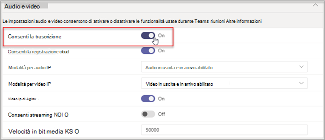

# Gestire i controlli della tecnologia di riconoscimento vocale per un altoparlante intelligente

Un altoparlante intelligente usa le informazioni del profilo vocale per riconoscere chi ha detto cosa nella trascrizione in tempo reale. Quando un Microsoft Teams Rooms per Windows sala riunioni è dotato di altoparlante intelligente, durante la riunione è possibile usare la trascrizione in tempo reale. Questo articolo spiega come l'amministratore del tenant controlla la profilatura vocale usata per il riconoscimento vocale per generare la trascrizione in tempo reale. È possibile controllare in che misura l'organizzazione usa il riconoscimento vocale e le caratteristiche seguenti:

- Modificare il nome del relatore nelle trascrizioni.
- Modificare l'altoparlante di una singola espressione nella trascrizione o cambiare l'altoparlante in tutte le espressioni nella trascrizione (ma non nelle trascrizioni future).
- Modificare l'identificazione del relatore per le persone elencate nella riunione.
- Rimuovere l'identificazione di una o più espressioni identificate come relatore, in ogni trascrizione.

## Esaminare i requisiti degli altoparlanti intelligenti

Un altoparlante intelligente include uno speciale array di sette microfoni. Il sistema usa le informazioni del profilo vocale per identificare le voci di un massimo di 10 persone nelle sale riunioni.

Gli elementi seguenti sono i requisiti dell'altoparlante intelligente:

- Il tenant del cliente deve trovarsi negli Stati Uniti (Nord America). 1
- La sala riunioni deve avere un massimo di 10 persone presenti di persona.
- La sala riunioni ha un collegamento di caricamento di almeno 7 Mbps.

 1 Un altoparlante intelligente e il profilo vocale associato e l'utilizzo saranno disponibili solo in lingua EN-US e per i tenant degli Stati Uniti (area geografica NA-US). Entrambe le condizioni devono essere vere per un utente tenant per registrare e usare un altoparlante intelligente per la trascrizione con attributi.

## Configurare un altoparlante intelligente

Un altoparlante intelligente si connette direttamente tramite USB alla Teams Rooms console. Per risultati ottimali, un altoparlante intelligente a marchio Yealink deve essere usato con una console a marchio Yealink.

> [!NOTE]
> Un altoparlante intelligente Yealink **deve** essere usato con una console Yealink.

> [!NOTE]
> Non è possibile supportare un altoparlante intelligente connesso a Logitech Surface Pro Microsoft Teams Rooms. Esiste un problema noto che Teams Rooms non è in grado di riconoscere l'altoparlante intelligente tramite il dock.

Un altoparlante intelligente deve essere posizionato ad almeno 20 cm di distanza dai muri e dagli oggetti di grandi dimensioni, come i portatili. Se il cavo USB dell'altoparlante intelligente non è abbastanza lungo per la configurazione, usare gli estensori dei cavi.

1. Accedere alla console come amministratore.
2. Impostare le impostazioni Teams dispositivo in modo che corrispondano al microfono e all'altoparlante dell'altoparlante dell'altoparlante intelligente.
   È anche possibile farlo tramite il portale TAC invece che nella console della sala.

   Il diagramma mostra come l'altoparlante intelligente è connesso al dispositivo se il dispositivo include una casella dati.

   

   Il diagramma mostra come l'altoparlante intelligente è connesso al dispositivo se il dispositivo non include una casella dati.

   

> [!Note]
> I dispositivi EPOS e Yealink devono avere il prefisso "EPOS" o "Yealink" e contenere "UAC2_RENDER" nel nome dell'altoparlante e "UAC2_TEAMS" nel nome del microfono. Se questi nomi di microfono e altoparlante non sono presenti nel menu a discesa, riavviare il dispositivo Altoparlante intelligente.

## Abilitare il riconoscimento dell'utente di un altoparlante intelligente

I dati del profilo vocale possono essere usati in qualsiasi riunione con un altoparlante intelligente. Per [informazioni sulle Teams riunione,](../meeting-policies-in-teams.md#allow-transcription) vedere i criteri per le riunioni di PowerShell e i cmdlet per le riunioni di [PowerShell.](/powershell/module/skype/set-csteamsmeetingpolicy?view=skype-ps)

I dati del profilo vocale dell'utente vengono creati quando il criterio è impostato per distinguere o un invitato non invitato alla riunione entra durante la riunione. I dati del profilo vocale vengono ignorati alla fine della riunione.

Di seguito sono riportati i criteri necessari per impostare un altoparlante intelligente e il riconoscimento utente.

|Criterio|Descrizione|Valori e comportamento|
|-|-|-|
|enrollUserOverride|Consente di impostare l'acquisizione o la registrazione del profilo vocale nelle Teams per un tenant. |**Disattiva** <ul><li> Gli utenti che non si sono mai registrati non possono visualizzare, registrare o registrare di nuovo.<li>Il punto di ingresso al flusso di registrazione verrà nascosto.<li>Se gli utenti selezionano un collegamento alla pagina di registrazione, verrà visualizzato un messaggio che indica che questa caratteristica non è abilitata per l'organizzazione.  <li>Gli utenti registrati possono visualizzare e rimuovere il proprio profilo vocale nelle impostazioni Teams utente. Dopo aver rimosso il profilo vocale, non potranno visualizzare, accedere o completare il flusso di registrazione.</li></ul> **Abilitato** <ul><li> Gli utenti possono visualizzare, accedere e completare il flusso di registrazione.<li>Il punto di ingresso verrà visualizzato nella Teams impostazioni della scheda **Riconoscimento.**</li></ul>|
|roomAttributeUserOverride|Controllare l'identificazione utente basata sulla voce nelle sale riunioni. Questa impostazione è obbligatoria per gli Teams Rooms account.| **Disattivato** <ul><li>Il Teams Rooms non invierà larghezza di banda per il risparmio di flussi audio dalla sala. <li>Gli utenti delle sale riunioni non verranno attribuiti o distinti e le firme vocali non verranno recuperate o usate.<li>Gli utenti delle sale riunioni sono sconosciuti.</li></ul>  **Attributo** <ul><li>Gli utenti delle chat room verranno attribuiti in base allo stato di registrazione.<li>Gli utenti registrati vengono visualizzati con il nome nella trascrizione.  <li>Gli utenti che non sono registrati vengono visualizzati come relatore n.<li>Il Teams Rooms invia sette flussi audio dalla sala.</ul>  **Distinguere**  *Questa impostazione sarà disponibile in un secondo momento.*|
|AllowTranscription|Obbligatorio per gli account Teams chat room.|**Vero** e **Falso**|
||||

Nell'Teams di amministrazione impostare il criterio Consenti **trascrizione.** Impostazioni sono **disattivate per** impostazione predefinita.

## Domande frequenti (FAQ)

**Dove sono archiviati i dati del profilo vocale?**

I dati del profilo vocale vengono archiviati nel cloud Office 365 con il contenuto dell'utente.

**Che cos'è la sequenza temporale e i criteri di conservazione?**

I criteri di conservazione generali sono indicati in [Panoramica sulla conservazione dei dati.](/compliance/assurance/assurance-data-retention-deletion-and-destruction-overview) Inoltre, i dati del profilo vocale di un utente verranno eliminati dopo 3 anni se l'utente non viene invitato a riunioni con un altoparlante intelligente entro tale periodo di 3 anni. I dati non vengono usati nelle riunioni per i dipendenti esistenti. Se un dipendente ha lasciato l'azienda, i dati del profilo vocale vengono considerati contenuto dell'utente e vengono trattati come tali Office 365 criteri di conservazione dei dati descritti in Panoramica [sulla conservazione dei dati.](/compliance/assurance/assurance-data-retention-deletion-and-destruction-overview)

**I dati del profilo vocale vengono usati servizi Microsoft?**

No, i dati del profilo vocale vengono usati solo per lo scopo per cui l'utente ha fornito il consenso. Microsoft non userà i dati del profilo vocale se non in Teams di riconoscimento vocale.

Ad esempio, Microsoft non userà i dati nelle situazioni seguenti:

**I dati del profilo vocale vengono usati quando si partecipa a una riunione in un'altra organizzazione?**

Non solo nelle riunioni organizzate da un utente dell'organizzazione.

**Come si esporta il profilo vocale?**

L'amministratore IT può esportare i dati audio in qualsiasi momento.

## Argomenti correlati

[Articolo del supporto tecnico: Usare gli altoparlanti intelligenti per identificare i partecipanti nella sala ](https://support.microsoft.com/office/use-teams-intelligent-speakers-to-identify-in-room-participants-in-meeting-transcription-a075d6c0-30b3-44b9-b218-556a87fadc00)
