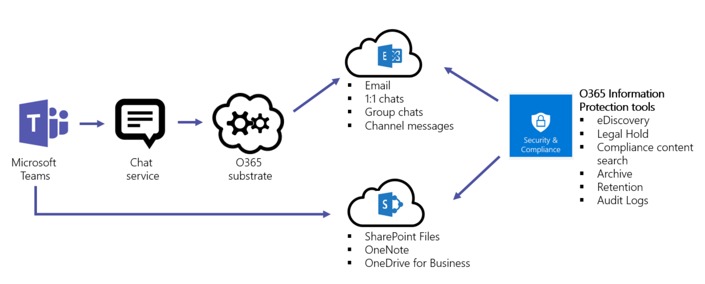
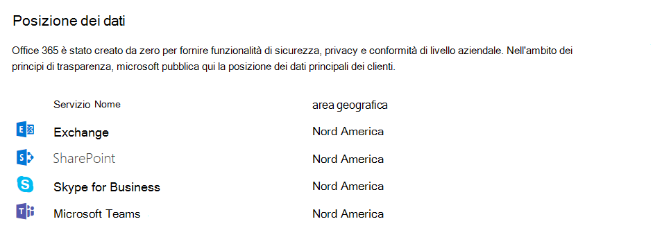

# Sicurezza e conformità in Microsoft Teams

> [!IMPORTANT]
> Come cliente di Office 365, si è proprietari e si controllano i dati. Microsoft non usa i dati per altro che fornire il servizio a cui si è sottoscritto. In qualità di provider di servizi non analizziamo la posta elettronica, i documenti o i team per la pubblicità o per scopi non correlati ai servizi. Microsoft non ha accesso al contenuto caricato. Come OneDrive for business e SharePoint Online, i dati dei clienti restano all'interno del tenant. Per altre informazioni sui dati relativi a attendibilità e sicurezza, visitare il [Centro protezione Microsoft](https://microsoft.com/trustcenter). Teams segue le stesse linee guida e i principi del Centro protezione Microsoft.

Microsoft teams è basato sul cloud di livello aziendale di Office 365 Hyper-Grade, offrendo le funzionalità avanzate di sicurezza e conformità che i nostri clienti si aspettano. Per altre informazioni sulla pianificazione della sicurezza in Office 365, leggere il contenuto di Office 365. [La roadmap di sicurezza di Office 365](https://docs.microsoft.com/microsoft-365/security/office-365-security/security-roadmap) è un buon punto di partenza. Per altre informazioni sulla pianificazione della conformità in Office 365, è possibile iniziare con [l'articolo piano per la sicurezza e la conformità](https://docs.microsoft.com/microsoft-365/compliance/plan-for-security-and-compliance) .

In questo articolo verranno fornite ulteriori informazioni sulla sicurezza e la conformità specifiche per i team. È consigliabile rivedere i video di Microsoft Mechanics relativi alla sicurezza e alla conformità:

- [Elementi essenziali di Microsoft teams per it: sicurezza e conformità](https://youtu.be/91lHNKVVvQ4) (12:42 min)
- [Controlli Microsoft teams per la sicurezza e la conformità](https://www.youtube.com/watch?v=Km4T4hMM__k) (10:54 min)

## Sicurezza

Teams impone l'autenticazione a livello di team e a livello di organizzazione a due fattori, Single Sign-on tramite Active Directory e la crittografia dei dati in transito e a riposo. I file sono archiviati in SharePoint e sono supportate dalla crittografia di SharePoint. Le note sono archiviate in OneNote e sono supportate dalla crittografia di OneNote. I dati di OneNote sono archiviati nel sito del team di SharePoint. La scheda wiki può essere usata anche per l'acquisizione di note e il relativo contenuto viene archiviato anche nel sito del team di SharePoint.

Leggere i [modelli di identità e l'autenticazione](identify-models-authentication.md) per approfondire l'autenticazione e i team e [come funziona l'autenticazione moderna](sign-in-teams.md) in particolare per l'autenticazione moderna.

Poiché teams lavora in collaborazione con SharePoint, OneNote, Exchange e altro ancora, è consigliabile gestire la sicurezza in Office 365. Per altre informazioni sulla sicurezza di Office 365, vedere [configurare il tenant di office 365 per aumentare la sicurezza](https://docs.microsoft.com/office365/securitycompliance/tenant-wide-setup-for-increased-security).

> [!NOTE]
> Attualmente, i [canali privati](private-channels.md) supportano funzionalità limitate di sicurezza e conformità. Il supporto per il set completo di caratteristiche di sicurezza e conformità nei canali privati sarà disponibile a breve.

### Advance Threat Protection (ATP)

Advance Threat Protection (ATP) è disponibile per Microsoft teams, insieme a SharePoint e OneDrive for business, applicazioni che si integrano con team per la gestione del contenuto. ATP consente di determinare se il contenuto di queste applicazioni è di tipo maligno e di bloccare questo contenuto dall'accesso degli utenti.

Modalità di gestione del contenuto interessato dopo il rilevamento dipende dalle impostazioni selezionate in Office 365. Ti consigliamo vivamente di prendere in considerazione tutte le applicazioni per la configurazione di ATP e per l'ulteriore lettura l'articolo [Office 365 ATP per SharePoint, OneDrive e Microsoft teams](https://docs.microsoft.com/microsoft-365/security/office-365-security/atp-for-spo-odb-and-teams) avrà informazioni dettagliate su come iniziare.

### Collegamenti sicuri

Mentre, in questo momento, i collegamenti sicuri ATP non sono disponibili in Microsoft teams, ora sono in anteprima pubblica tramite il nostro programma di adozione della tecnologia (TAP) e mentre una data di rilascio per la disponibilità generale non è impostata, verrà aggiornato questo articolo quando arriverà il momento. Per informazioni sui collegamenti sicuri di Office 365, vedere la pagina relativa ai collegamenti sicuri per [Office 365 ATP](https://docs.microsoft.com/office365/securitycompliance/atp-safe-links#how-to-get-atp-safe-links-protection).

### Funzionamento dei criteri di accesso condizionale per i team

Microsoft teams si basa molto su Exchange Online, SharePoint Online e Skype for business online per scenari di produttività di base, come riunioni, calendari, chat di interoperabilità e condivisione di file. I criteri di accesso condizionale impostati per queste app Cloud si applicano a Microsoft teams quando un utente accede direttamente a Microsoft teams-in qualsiasi client.

Microsoft teams è supportato separatamente come app cloud nei criteri di accesso condizionale di Azure Active Directory. I criteri di accesso condizionale impostati per l'app cloud di Microsoft teams si applicano a Microsoft teams quando un utente accede. Tuttavia, senza i criteri corretti per altre app come Exchange Online e SharePoint Online, gli utenti potrebbero essere ancora in grado di accedere direttamente a tali risorse. Per altre informazioni sulla configurazione di criteri di accesso condizionale in Azure Portal, vedere: [Guida introduttiva di Azure Active Directory](https://docs.microsoft.com/azure/active-directory/active-directory-conditional-access-azure-portal-get-started).

I client desktop di Microsoft teams per Windows e Mac supportano l'autenticazione moderna. L'autenticazione moderna porta l'accesso in base alla libreria di autenticazione di Azure Active Directory (ADAL) alle applicazioni client di Microsoft Office tra piattaforme.

L'applicazione desktop Microsoft teams supporta AppLocker.  Per altre informazioni sui prerequisiti di AppLocker, vedere: requisiti per l'uso di [AppLocker](https://docs.microsoft.com/windows/security/threat-protection/windows-defender-application-control/applocker/requirements-to-use-applocker).

## Conformità

Teams offre una vasta gamma di informazioni per aiutarti con le aree di conformità, inclusi i criteri di conservazione, la protezione dalla perdita dei dati (DLP), la eDiscovery e il blocco legale per canali, chat e file, la ricerca nel log di controllo e la gestione delle applicazioni per dispositivi mobili con Microsoft Intune. Sono state fornite informazioni su tutti questi argomenti e si può accedere al centro conformità & sicurezza di Office 365 per gestire queste impostazioni.

### Criteri di conservazione

I criteri di conservazione in Microsoft teams consentono di mantenere i dati importanti per l'organizzazione, per motivi normativi, legali, aziendali o di altro tipo, e anche per rimuovere contenuti e comunicazioni che non sono rilevanti per il mantenimento. È anche possibile usare i criteri di conservazione per mantenere i dati per un periodo di tempo e quindi eliminarli. Per altre informazioni, vedere l'articolo sui [criteri di conservazione in Microsoft teams](retention-policies.md) .

### Prevenzione della perdita dei dati (DLP)

La prevenzione della perdita dei dati (DLP) in Microsoft teams, oltre alla storia DLP più grande per Office 365, ruota attorno alla disponibilità aziendale quando si tratta di proteggere i dati e i documenti riservati in Office 365. Indipendentemente dal fatto che siano presenti informazioni riservate in messaggi o documenti, i criteri di prevenzione della perdita dei dati saranno in grado di garantire che gli utenti non condividano questo dato sensibile con le persone sbagliate.

Per informazioni sulla prevenzione della perdita dei dati in teams, consultare [DLP per Microsoft teams](https://docs.microsoft.com/microsoft-365/compliance/dlp-microsoft-teams). Un buon articolo per i problemi di O36 [https://docs.microsoft.com/microsoft-365/compliance/data-loss-prevention-policies](https://docs.microsoft.com/microsoft-365/compliance/data-loss-prevention-policies)DLP è.

### eDiscovery

Electronic Discovery, o eDiscovery, è l'aspetto elettronico dell'identificazione, della raccolta e della produzione di informazioni archiviate elettronicamente (ESI) in risposta a una richiesta di produzione in una causa legale o in un'inchiesta. Le funzionalità includono la gestione dei casi, la conservazione, la ricerca, l'analisi e l'esportazione di dati Team. Questo include chat, messaggistica e file, riepiloghi di riunioni e chiamate. Per le riunioni e le chiamate dei team, un riepilogo degli eventi accaduti nella riunione e nella chiamata viene creato e reso disponibile in eDiscovery.

Per altre informazioni su come eseguire Office 365 eDiscovery in Security & Compliance Center ed eseguire la ricerca di contenuto di conformità per il contenuto dei team, visitare i collegamenti seguenti:

[eDiscovery](https://docs.microsoft.com/microsoft-365/compliance/manage-legal-investigations)

[Ricerca contenuto](https://docs.microsoft.com/microsoft-365/compliance/search-for-content)

Abbiamo un articolo specifico per le squadre per altre informazioni, [eDiscovery delle chat Guest-to-Guest](eDiscovery-investigation.md).

I clienti possono sfruttare eDiscovery sul posto o [Advanced eDiscovery] per i loro [requisiti](https://docs.microsoft.com/microsoft-365/compliance/office-365-advanced-ediscovery). La tabella seguente illustra le differenze tra i due:

| |EDiscovery sul posto  |EDiscovery avanzato  |
|---------|---------|---------|
|Gestione dei casi     |X        |X         |
|Controllo di accesso  |X         |X         |
|Ricerche di contenuto     |X         | X        |
|Blocco/i   |X         | X        |
|Esportazione     |X         |X         |
|Rilevamento della duplicazione     |-         |X         |
|Ricerca della pertinenza con l'apprendimento automatico    |-         |X         |
|Analisi dei dati non strutturata      |-         |X         |

### Blocco legale

Durante le controversie, potrebbe essere necessario che tutti i dati associati a un utente (custode) o a un team vengano mantenuti come non modificabili, in modo che possano essere usati come elementi di prova per il caso. A questo scopo, è possibile inserire un utente (cassetta postale dell'utente) o un team in attesa legale. Per un blocco legale del team, la cassetta postale del team può essere inserita nelle seguenti esenzioni:

- Blocco sul posto (un sottoinsieme della cassetta postale o della raccolta siti tramite query di destinazione o contenuto filtrato viene inserito) oppure
- Blocco per controversia legale (l'intera cassetta postale o raccolta siti viene inserita in attesa).

In entrambi i casi, una volta impostato il blocco, assicura che, anche se gli utenti finali eliminano o modificano i messaggi di canale presenti nella cassetta postale del gruppo, le copie non modificabili del contenuto vengono mantenute e disponibili tramite la ricerca eDiscovery. Le esenzioni legali vengono in genere applicate nel contesto di un caso di eDiscovery.

Vedere la [Panoramica dell'](https://docs.microsoft.com/microsoft-365/compliance/retention-policies) articolo sui criteri di conservazione per altre informazioni sulla conservazione e l'archiviazione nel centro conformità & sicurezza di Office 365. Per altre informazioni specifiche sulle squadre in attesa legale, è anche possibile [inserire un utente o un team di Microsoft teams in un articolo per il blocco legale](legal-hold.md) per saperne di più.

### Ricerca di contenuto di conformità

La ricerca di contenuto può essere usata per cercare tutti i dati dei team tramite ricche funzionalità di filtro. I dati risultanti possono essere esportati in un contenitore specifico per il supporto della conformità e del contenzioso. Questa operazione può essere eseguita con o senza un caso di eDiscovery. In questo modo gli amministratori della conformità possono raccogliere i dati dei team in tutti gli utenti, rivederli ed esportarli per ulteriori elaborazioni. Per altre informazioni su come eseguire una ricerca di contenuto di conformità per Microsoft teams e altri contenuti di Office 365 nel centro protezione & conformità di Office 365, vedere la pagina relativa alla [ricerca di contenuti nell'](https://docs.microsoft.com/microsoft-365/compliance/content-search) articolo di Office 365.

> [!TIP]
> Usando la ricerca di contenuto, è possibile filtrare solo il contenuto di Microsoft teams, ad esempio messaggi di chat e canali, riunioni e chiamate, se necessario.

Per altre informazioni specifiche per le squadre sulla configurazione della ricerca di contenuto, vedere l'articolo [Ricerca contenuto in Microsoft teams](content-search.md) .

### Controllo e creazione di report

La ricerca nel log di controllo si inserisce direttamente nel centro conformità & sicurezza di Office 365 e offre la possibilità di impostare gli avvisi, nonché di segnalare eventi di controllo, consentendo l'esportazione di set di eventi specifici o generici per il carico di lavoro per l'uso di amministratori e le indagini in una sequenza temporale di controllo illimitata. È possibile configurare gli avvisi per tutti i dati del log di controllo all'interno del centro conformità & sicurezza di Office 365 e filtrare ed esportare questi dati per un'ulteriore analisi. Per altre informazioni su come eseguire un log di controllo per Office 365, fare riferimento alla sezione [cercare l'articolo del log di controllo](https://docs.microsoft.com/microsoft-365/compliance/search-the-audit-log-in-security-and-compliance) . Per altre informazioni sulla ricerca di eventi di Microsoft Teams nel centro conformità & sicurezza di Office 365, è anche possibile eseguire il [controllo attiva nell'articolo teams](audit-log-events.md) per la revisione.

## Architettura di protezione delle informazioni

La figura seguente indica il flusso di ingestione dei dati del team sia in Exchange che in SharePoint per i file e i messaggi del team.

Nella figura seguente viene indicato il flusso di ingestione delle riunioni di team e la chiamata di dati a Exchange.

> [!IMPORTANT]
> Per individuare il contenuto di teams, è possibile attendere fino a 24 ore di ritardo.

## Licenze

Per quanto riguarda le funzionalità di protezione delle informazioni, gli abbonamenti a Office 365 e le licenze autonome associate determineranno il set di caratteristiche disponibile.

Per informazioni su come determinare le licenze necessarie per implementare le funzionalità per la sicurezza e la conformità, vedere la pagina relativa alle [licenze per Office 365](https://docs.microsoft.com/office365/servicedescriptions/office-365-platform-service-description/office-365-securitycompliance-center).

> [!NOTE]
> La ricerca di contenuto e eDiscovery non devono essere abilitate nel centro sicurezza & conformità per il lavoro.

## Posizione dei dati in Teams

I dati in teams si trovano nell'area geografica associata al tenant di Office 365. Per visualizzare le aree geografiche supportate attualmente, vedere [la posizione dei dati in Microsoft teams](location-of-data-in-teams.md).

Per informazioni sull'area geografica in cui sono alloggiati i dati per il tenant, visitare il**profilo dell'organizzazione****delle impostazioni** > dell'interfaccia di [Amministrazione](https://portal.office.com/adminportal/home) > di Microsoft 365. Scorrere verso il basso fino a **posizione dati**.

## Standard di conformità

Teams è conforme a livello D. Sono inclusi i seguenti standard: ISO 27001, ISO 27018, SSAE16 SOC 1 e SOC 2, HIPAA e clausole modello EU (EUMC). In Microsoft Compliance Framework Microsoft classifica le applicazioni e i servizi di Office 365 in quattro categorie. Ogni categoria è definita da specifici impegni di conformità che devono essere soddisfatti per un servizio di Office 365 o un servizio Microsoft correlato, da elencare in tale categoria.

I servizi nelle categorie di conformità C e D che hanno impegni di conformità leader del settore sono abilitati per impostazione predefinita. I servizi nelle categorie A e B sono dotati di controlli per attivare o disattivare questi servizi per un'intera organizzazione. I dettagli sono disponibili nel [Framework conformità per gli standard e le normative del settore](https://download.microsoft.com/download/1/4/3/1434ABAB-B8E9-412D-8C3A-187B5FCB7A2F/Compliance%20Framework%20document.pdf). Teams supporta anche la conformità a Cloud Security Alliance.

## Argomenti correlati

[Conformità M365](https://docs.microsoft.com/microsoft-365/compliance/) sicurezza M365
