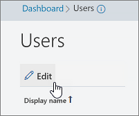

# Impostare i numeri di telefono inclusi negli inviti in Microsoft TeamsSet the phone numbers included on invites in Microsoft Teams

I servizi di audioconferenza in Office 365 consentono agli utenti dell'organizzazione di creare riunioni di Microsoft teams e quindi consentire agli utenti di accedere a tali riunioni con un telefono.Audio Conferencing in Office 365 enables users in your organization to create Microsoft Teams meetings, and then allow users to dial in to those meetings using a phone.
  
Un ponte per conferenze offre un insieme di numeri di telefono di accesso esterno per l'organizzazione.A conferencing bridge gives you a set of dial-in phone numbers for your organization. Tutti questi numeri possono essere utilizzati per accedere alle riunioni create dall'organizzatore, ma è possibile selezionare quelli che verranno inclusi negli inviti alle riunioni.All of them can be used to join the meetings that a meeting organizer has created, but you can select which ones will be included on their meeting invites.
  
> [!NOTE]
> Vi è un massimo per organizzatore di un numero a pagamento e un numero verde nell'invito alla riunione, ma è disponibile anche un collegamento nella parte inferiore di ogni invito che consente di aprire l'elenco completo di tutti i numeri di telefono di accesso esterno che possono essere utilizzati per accedere ad una riunione.There can be a maximum of one toll and one toll-free phone number on the meeting invite for a meeting organizer, but there is also a link located at the bottom of each meeting invite that opens the full list of all dial-in phone numbers that can be used to join a meeting. 

> [!NOTE]
> [!INCLUDE [updating-admin-interfaces](includes/updating-admin-interfaces.md)]
  
## Assegnazione iniziale dei numeri di telefono inclusi negli inviti alla riunione per i nuovi utentiInitial assignment of phone numbers that are included in the meeting invites for new users

I numeri di telefono inclusi negli inviti alle riunioni degli utenti abilitati per i servizi di audioconferenza sono definiti dal numero di telefono predefinito per i servizi di conferenza e dalle impostazioni predefinite dell'utente del numero di telefono gratuito per i servizi di conferenza.The phone numbers that get included in the meeting invites of users enabled for Audio Conferencing are defined by the default conferencing toll phone number and the default conferencing toll-free phone number user's settings. Ogni impostazione specifica il numero verde e il pedaggio che verrà incluso nell'invito alla riunione di un utente specifico.Each setting specifies which toll and toll-free number will be included in the meeting invite of a given user. Come indicato sopra, ogni invito alla riunione contiene un numero a pagamento, un numero verde facoltativo e un collegamento che apre l'elenco completo di tutti i numeri di telefono di accesso esterno che possono essere usati per partecipare a una determinata riunione.As noted above, each meeting invite contains one toll number, one optional toll-free number and a link that opens the full list of all dial-in phone numbers that can be used to join a given meeting.

Per un nuovo utente, i numeri a pagamento predefiniti per i servizi di conferenza vengono assegnati in base al paese impostato nel profilo di Office 365 dell'utente quando l'utente è abilitato per il servizio di audioconferenza.For a new user, the default conferencing toll numbers is assigned based on the country that is set in the Office 365 profile of the user when the user is enabled for the Audio Conferencing service. Se nel Bridge di conferenza è presente un numero a pagamento che corrisponde al paese dell'utente, tale numero verrà assegnato automaticamente come numero di pedaggio predefinito per l'utente.If there is a toll number in the conference bridge that matches the country of the user, that number will be automatically assigned as the default toll number of the user. Se non è presente, il numero definito come numero di pedaggio predefinito del Bridge di conferenza verrà assegnato come numero di pedaggio predefinito per l'utente.If there isn't one, the number that is defined as the default toll number of the conference bridge will be assigned as the default toll number of the user.  

Quando l'utente è abilitato per il servizio di audioconferenza, il numero di telefono predefinito e il numero verde dell'utente possono essere modificati dall'amministratore del tenant dai valori iniziali in qualsiasi momento.Once the user is enabled for the Audio Conferencing service, the default toll and toll-free phone numbers of the user can be changed by the tenant administrator from their initial values at any moment.

## Impostare o modificare il numero di telefono predefinito per l'audioconferenza per un organizzatore o un utente di una riunioneSet or change the default audio conferencing phone number for a meeting organizer or user

 di Microsoft teams **con l'interfaccia di amministrazione di Microsoft teams** **Using the Microsoft Teams admin center**

1. Nella barra di spostamento sinistra fare clic su **utenti**e quindi selezionare l'utente nell'elenco degli utenti disponibili.In the left navigation, click **Users**, and then select the user from the list of available users.

    

2. Nella parte superiore della pagina, fai clic su **Modifica**.At the top of the page, click **Edit**.

    

3. Accanto a servizi di **audioconferenza**fare clic su **modifica**.Next to **Audio Conferencing**, click **Edit**. 
    
    

4. Usare il **numero a pagamento** o i campi **numero verde** per immettere i numeri per l'utente.Use the **Toll number** or **Toll-free number** fields to enter the numbers for the user.

> [!IMPORTANT]
> Quando si modificano le impostazioni di conferenza audio di un utente, le riunioni di Microsoft teams e future devono essere aggiornate e inviate ai partecipanti.When you change a user's audio conferencing settings, recurring and future Microsoft Teams meetings must be updated and sent to attendees. 

## Desideri utilizzare Windows PowerShell?Want to use Windows PowerShell?

Windows PowerShell riguarda la gestione degli utenti e le azioni che sono autorizzati o meno a eseguire. Con Windows PowerShell puoi gestire Office 365 tramite un unico punto di amministrazione, che ti agevola il lavoro quotidiano quando hai molte attività da svolgere. Per iniziare a usare Windows PowerShell, vedi i seguenti argomenti:Windows PowerShell is all about managing users and what users are allowed or not allowed to do. With Windows PowerShell, you can manage Office 365 using a single point of administration that can simplify your daily work when you have multiple tasks to do. To get started with Windows PowerShell, see these topics:
    
  - [Sei motivi per utilizzare Windows PowerShell per gestire Office 365Why you need to use Office 365 PowerShell](https://go.microsoft.com/fwlink/?LinkId=525041)
    
  - [Modi migliori per gestire Office 365 con Windows PowerShellBest ways to manage Office 365 with Windows PowerShell](https://go.microsoft.com/fwlink/?LinkId=525142)
    
Per altre informazioni su Windows PowerShell, vedere la pagina di [riferimento di PowerShell per Microsoft teams](https://docs.microsoft.com/powershell/module/teams/?view=teams-ps) per altre informazioni.For more information about Windows PowerShell, see the [Microsoft Teams PowerShell reference](https://docs.microsoft.com/powershell/module/teams/?view=teams-ps) for more information. 
  
    
## Argomenti correlatiRelated topics

[Provare o acquistare le audioconferenze in Office 365Try or purchase Audio Conferencing in Office 365](/SkypeForBusiness/audio-conferencing-in-office-365/try-or-purchase-audio-conferencing-in-office-365)

[Cambiare i numeri di telefono del bridge per i servizi di audioconferenzaChange the phone numbers on your Audio Conferencing bridge](change-the-phone-numbers-on-your-audio-conferencing-bridge.md)
