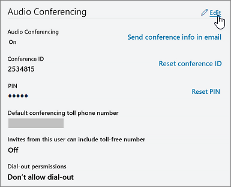

# Impostare i numeri di telefono inclusi negli inviti in Microsoft Teams

I servizi di audioconferenza in Microsoft 365 e Office 365 consentono agli utenti dell'organizzazione di creare riunioni di Microsoft teams e quindi consentire agli utenti di accedere a tali riunioni con un telefono.
  
Un ponte per conferenze offre un insieme di numeri di telefono di accesso esterno per l'organizzazione. Tutti questi numeri possono essere utilizzati per accedere alle riunioni create dall'organizzatore, ma è possibile selezionare quelli che verranno inclusi negli inviti alle riunioni.
  
> [!NOTE]
> Vi è un massimo per organizzatore di un numero a pagamento e un numero verde nell'invito alla riunione, ma è disponibile anche un collegamento nella parte inferiore di ogni invito che consente di aprire l'elenco completo di tutti i numeri di telefono di accesso esterno che possono essere utilizzati per accedere ad una riunione. 

> [!NOTE]
> [!INCLUDE [updating-admin-interfaces](includes/updating-admin-interfaces.md)]
  
## Assegnazione iniziale dei numeri di telefono inclusi negli inviti alla riunione per i nuovi utenti

I numeri di telefono inclusi negli inviti alle riunioni degli utenti abilitati per i servizi di audioconferenza sono definiti dal numero di telefono predefinito per i servizi di conferenza e dalle impostazioni predefinite dell'utente del numero di telefono gratuito per i servizi di conferenza. Ogni impostazione specifica il numero verde e il pedaggio che verrà incluso nell'invito alla riunione di un utente specifico. Come indicato sopra, ogni invito alla riunione contiene un numero a pagamento, un numero verde facoltativo e un collegamento che apre l'elenco completo di tutti i numeri di telefono di accesso esterno che possono essere usati per partecipare a una determinata riunione.

Per un nuovo utente, i numeri a pagamento predefiniti per i servizi di conferenza vengono assegnati in base alla posizione di utilizzo impostata nell'interfaccia di amministrazione di Microsoft 365 dell'utente quando l'utente è abilitato per il servizio di audioconferenza. Se nel Bridge di conferenza è presente un numero a pagamento che corrisponde al paese dell'utente, tale numero verrà assegnato automaticamente come numero di pedaggio predefinito per l'utente. Se non è presente, il numero definito come numero di pedaggio predefinito del Bridge di conferenza verrà assegnato come numero di pedaggio predefinito per l'utente.  

Quando l'utente è abilitato per il servizio di audioconferenza, il numero di telefono predefinito e il numero verde dell'utente possono essere modificati dall'amministratore del tenant dai valori iniziali in qualsiasi momento.

## Impostare o modificare il numero di telefono predefinito per l'audioconferenza per un organizzatore o un utente di una riunione

 **Usare l'interfaccia di amministrazione di Microsoft Teams**

Per apportare queste modifiche, è necessario essere un amministratore.

1. Accedere all'interfaccia di amministrazione di <a href="https://go.microsoft.com/fwlink/p/?linkid=2024339" target="_blank">https://admin.microsoft.com</a> .

2. Nella barra di spostamento sinistra fare clic su **utenti**.

    

3. Fare clic sul nome utente nell'elenco degli utenti disponibili.

4. Accanto a servizi di **audioconferenza**fare clic su **modifica**. 
    
    

5. Usare il **numero a pagamento** o i campi **numero verde** per immettere i numeri per l'utente.

> [!IMPORTANT]
> Quando si modificano le impostazioni di conferenza audio di un utente, le riunioni di Microsoft teams e future devono essere aggiornate e inviate ai partecipanti. 

## Desideri utilizzare Windows PowerShell?

Windows PowerShell is all about managing users and what users are allowed or not allowed to do. Con Windows PowerShell è possibile gestire Microsoft 365 o Office 365 usando un unico punto di amministrazione in grado di semplificare il lavoro quotidiano quando si hanno più attività da eseguire. Per iniziare a usare Windows PowerShell, vedere i seguenti argomenti:
    
  - [Sei motivi per utilizzare Windows PowerShell per gestire Office 365](https://go.microsoft.com/fwlink/?LinkId=525041)
    
  - [Procedure consigliate per gestire Microsoft 365 o Office 365 con Windows PowerShell](https://go.microsoft.com/fwlink/?LinkId=525142)
    
Per altre informazioni su Windows PowerShell, vedere la pagina di [riferimento di PowerShell per Microsoft teams](https://docs.microsoft.com/powershell/module/teams/?view=teams-ps) per altre informazioni. 
  
    
## Argomenti correlati

[Provare o acquistare servizi di audioconferenza in Microsoft 365 o Office 365](/SkypeForBusiness/audio-conferencing-in-office-365/try-or-purchase-audio-conferencing-in-office-365)

[Cambiare i numeri di telefono del bridge per i servizi di audioconferenza](change-the-phone-numbers-on-your-audio-conferencing-bridge.md)
