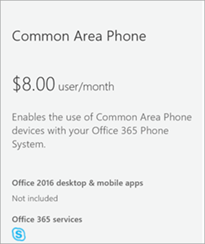

# Configurare la licenza Common Area Phone per Microsoft Teams
> [!NOTE]
> I telefoni dell'area comune non supportano la segreteria telefonica.

Un telefono di area comune è in genere posizionato in un'area come una sala d'attesa o un'altra area che è disponibile a molte persone per effettuare una chiamata; ad esempio un'area di ricezione, una sala d'attesa o un telefono per conferenze. I telefoni dell'area comune sono connessi con account collegati a una licenza Common Area Phone. Anche il criterio TeamsIPPhone deve essere impostato in modo appropriato perché il telefono abbia un'esperienza utente nell'area comune.

Nei passaggi seguenti verrà illustrato come configurare un account per Sistema telefonico per distribuire i telefoni delle aree comuni per l'organizzazione. Per un'esperienza più completa nelle sale riunioni, incluse le audioconferenze, è consigliabile acquistare la licenza dedicata per la sala riunioni con un dispositivo della sala riunioni. 

Prima di tutto, è necessario acquistare una licenza Common Area Phone (CAP) e assicurarsi di avere un telefono certificato. Per cercare e altre informazioni sui telefoni certificati, vai a [Dispositivi Microsoft Teams.](https://products.office.com/microsoft-teams/across-devices?ms.url=officecomteamsdevices&rtc=1) 

## Passaggio 1: acquista le licenze

1. Nell'interfaccia di amministrazione di Microsoft 365 passare a **Servizi** di acquisto fatturazione  >   e quindi espandere **Altri piani.**

    

2. Selezionare **Area comune Telefono** Acquista  >  **ora**.

3. Nella pagina Checkout fare clic su **Acquista ora.**

4. Espandere **Abbonamenti ai componenti aggiuntivi e** quindi fare clic per acquistare un piano per chiamate. Scegli **Piano di chiamata domestico** o **Piano di chiamata nazionale e internazionale**.

> [!NOTE]
> Se si usa Microsoft Phone System Direct Routing, non è necessaria una licenza per il piano di chiamata.

> [!NOTE]
> Non è necessario aggiungere una licenza sistema telefonico. È inclusa con la licenza per il Telefono di area comune.

Per altre informazioni sulle licenze, vedere Licenze per i componenti aggiuntivi di [Microsoft Teams.](./teams-add-on-licensing/microsoft-teams-add-on-licensing.md)

La licenza Common Area Phone supporta: 

|   |  Telefono di area comune  |
|---------|---------|
|Skype for Business |   &#x2714; |
|Microsoft Teams |   &#x2714; |
|Sistema telefonico |    &#x2714; |
|Audioconferenza |       &#x2718; &sup1;  |
|Microsoft Intune |    &#x2718; |
|Disponibilità in tutto il mondo |       &#x2718; &sup2;  |
|Disponibilità del canale |    EA, EAS, CSP, GCC, EES, Web Direct  |
|      |         |

&sup1; Area comune I telefoni possono partecipare a conferenze audio tramite il numero di accesso fornito dall'organizzatore della riunione

&sup2; Non disponibile nei cloud sovrani  

## Passaggio 2: crea un nuovo account utente per il telefono e assegna le licenze

1. Nell'interfaccia di amministrazione di Microsoft 365 passare **a Utenti** attivi  >  **che**  >  **aggiungono un utente.**

2. Immettere un nome utente come "Principale" per il nome e "Ricezione" per il secondo nome.

3. Immettere un nome visualizzato se non lo rigenera automaticamente, ad esempio "Ricezione principale".

4. Immettere un nome utente come "MainReception" o "Mainlobby".

5. Per i telefoni dell'area comune, è consigliabile impostare manualmente una password o avere la stessa password per tutti i telefoni dell'area comune. Inoltre, è consigliabile deselezionare la casella di controllo Imposta come utente la **modifica della password** al primo accesso.

6. Assegnare le licenze all'utente. Nella stessa pagina, fai clic per espandere **Licenze di prodotto**. Attiva il Telefono area comune e scegli un **piano** per chiamate nazionali o un piano per chiamate **nazionali e internazionali.** 

    

> [!NOTE]
> Se si usa Microsoft Phone System Direct Routing, non è necessario assegnare una licenza per il piano di chiamata.

Per altre informazioni, vedere [Assegnare licenze agli utenti.](/microsoft-365/admin/manage/assign-licenses-to-users)

## Passaggio 3: assegna un numero di telefono all'account utente del telefono di area comune

Usare l'interfaccia di amministrazione di Teams per assegnare un numero all'utente.

1. Nell'interfaccia di amministrazione di Teams selezionare **Numeri di telefono**  >  **vocale**.

3.    Seleziona un numero dall'elenco di numeri di telefono e fai clic su **Assegnare**.

4. Nella **casella** Utente vocale della pagina Assegna digitare il nome dell'utente che usa il telefono e quindi selezionarlo nell'elenco **a** discesa Selezionare un utente vocale.

5. Successivamente, è necessario aggiungere un indirizzo per gli interventi di emergenza. Scegliere **Cerca per città,** Cerca  per descrizione o Cerca per posizione nell'elenco a discesa e quindi immettere la città, la descrizione o la posizione nella casella di testo.  Dopo aver cercato, cerca in **Seleziona l'indirizzo per gli interventi** di emergenza per scegliere quello giusto per te.

6. Clicca su **Salvare** e il tuo utente dovrebbe apparire così:

   

> [!NOTE]
> Gli utenti verranno visualizzati solo se è applicata una licenza sistema telefonico. Se lo hai appena fatto, a volte ci vuole un po' perché l'utente venga visualizzato nell'elenco.

Per altre informazioni, vedere [Ottenere numeri di telefono per gli utenti.](getting-phone-numbers-for-your-users.md)

È anche possibile prendere il numero di telefono che si ha con un altro gestore e "porta" o trasferirlo a Microsoft 365 o Office 365. Vedere [Trasferire numeri di telefono in Teams](phone-number-calling-plans/transfer-phone-numbers-to-teams.md).