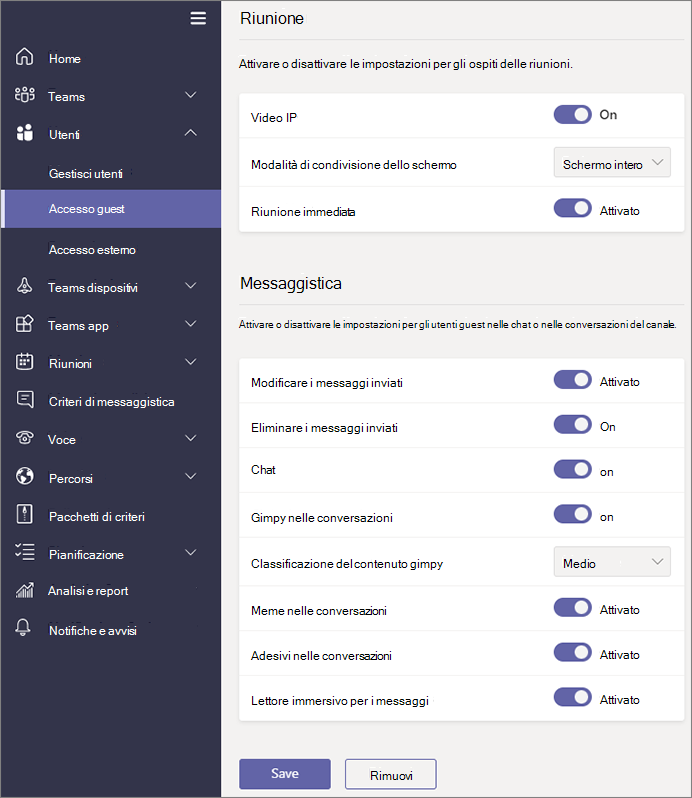

# Attivare o disattivare l'accesso guest in Microsoft Teams.

> [!Note]

> Fino **a febbraio 2021,** l'accesso guest è disattivato per impostazione predefinita. È necessario attivare l'accesso guest per Teams prima che gli amministratori o i proprietari del team possano aggiungere guest. Dopo aver attivo l'accesso guest, l'applicazione delle modifiche potrebbe richiedere alcune ore. Se gli utenti  visualizzano il messaggio Contattare l'amministratore quando provano ad aggiungere un guest al team, è probabile che l'accesso guest non sia stato attivato o che le impostazioni non siano ancora efficaci.

> Dopo **febbraio 2021,** l'accesso guest in Microsoft Teams verrà attivato per impostazione predefinita per i nuovi clienti & clienti esistenti che non hanno configurato questa impostazione. Quando questa modifica viene implementata, se non è già stata configurata la funzionalità di accesso guest in Microsoft Teams, tale funzionalità verrà abilitata nel tenant. Se si vuole che l'accesso guest rimanga disabilitato per l'organizzazione, è necessario verificare che l'impostazione di accesso guest sia impostata su Disattivato **invece** che su **Servizio predefinito.**

> [!IMPORTANT]
> L'attivazione dell'accesso guest dipende dalle impostazioni in Azure Active Directory, Microsoft 365, SharePoint e Teams. Per maggiori informazioni, vedere [Collaborare con gli utenti guest in un team](/microsoft-365/solutions/collaborate-as-team).

## Configurare l'accesso guest nell'interfaccia di amministrazione di Teams

1. Accedere all'[interfaccia di amministrazione di Microsoft Teams](https://admin.teams.microsoft.com/).

2. Selezionare **Impostazioni a livello di organizzazione** > **Accesso guest**.

3. Impostare **Consenti accesso guest in Microsoft Teams** su **Attivato**.

    

4. In **Chiamata**, **Riunione**, and **Messaggistica**, selezionare **Attivato** o **Disattivato** per ciascuna funzionalità, a seconda di ciò che si desidera consentire agli utenti guest.

      - **Effettua chiamate private**: passare questa impostazione su **Attivato** per consentire agli utenti guest di effettuare chiamate peer-to-peer.
      - **Consenti video IP**: passare questa impostazione su **Attivato** per consentire agli utenti guest di usare il video durante le chiamate e le riunioni.
      - **Modalità condivisione dello schermo**: questa impostazione controlla la disponibilità della condivisione dello schermo per gli utenti guest.
          - Passare questa impostazione su **Disattivato** per rimuovere la possibilità agli utenti guest di condividere i propri schermi in Teams.
          - Passare questa impostazione su **Singola applicazione** per consentire la condivisione di singole applicazioni.
          - Passare questa impostazione su **Schermo interno** per consentire la condivisione dello schermo completa.
      - **Consenti Riunione immediata**: passare questa impostazione su **Attivato** per consentire agli utenti guest di usare la funzionalità Riunione immediata in Microsoft Teams.
      - **Modifica messaggi inviati**: passare questa impostazione su **Attivato** per consentire agli utenti guest di modificare i messaggi inviati in precedenza.
      - **Gli utenti guest possono eliminare i messaggi inviati**: passare questa impostazione su **Attivato** per consentire agli utenti guest di eliminare i messaggi inviati in precedenza.
      - **Chat**: passare questa impostazione su **Attivato** per dare agli utenti guest la possibilità di usare la chat in Teams.
      - **Usa Giphys nelle conversazioni**: passare questa impostazione su **Attivato** per consentire agli utenti guest di usare Giphy nelle conversazioni. Giphy è un database online e un motore di ricerca che consente agli utenti di cercare e condividere file GIF animati. A ogni Giphy viene assegnata una classificazione dei contenuti.
      - **Classificazione contenuti Giphy**: selezionare una classificazione dall’elenco a discesa:
          - **Consenti tutti i contenuti**: gli utenti guest potranno inserire tutti i contenuti Giphy nelle chat, indipendentemente dalla loro classificazione.
          - **Moderato**: gli utenti guest potranno inserire contenuti Giphy nelle chat, ma i contenuti per adulti saranno moderatamente limitati.
          - **Rigorosa:** gli ospiti possono inserire Giphys nelle chat, ma non potranno inserire contenuti per adulti.
      - **Usa meme nelle conversazioni**: passare questa impostazione su **Attivato** per consentire agli utenti guest di usare meme nelle conversazioni.
      - **Usa adesivi nelle conversazioni**: passare questa impostazione su **Attivato** per consentire agli utenti guest di usare adesivi nelle conversazioni.

    

5. Selezionare **Salva**.

## Accesso esterno (federazione) e accesso guest

[!INCLUDE [guest-vs-external-access](includes/guest-vs-external-access.md)]

## Vedere anche

[Configurare la collaborazione sicura con Microsoft 365](/microsoft-365/solutions/setup-secure-collaboration-with-teams)

[Bloccare gli utenti guest di un team specifico](/microsoft-365/solutions/per-group-guest-access)

[Set-CsTeamsClientConfiguration](/powershell/module/skype/set-csteamsclientconfiguration)