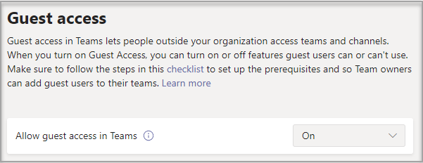

# Attivare o disattivare l'accesso guest in Microsoft Teams

Questo articolo descrive come configurare le impostazioni di accesso guest, incluse chiamate, riunioni e chat, in Teams. L'accesso guest in Teams richiede anche la configurazione di altre impostazioni in Microsoft 365, incluse quelle in Azure AD, Gruppi di Microsoft 365 e SharePoint. Quando si è pronti a invitare utenti guest a Teams, leggere una delle opzioni seguenti:

- Per configurare l'accesso degli utenti guest per l’uso generale di Teams, vedere [Collaborare con gli utenti guest in un team](/microsoft-365/solutions/collaborate-as-team).
- Per collaborare con un'organizzazione partner che usa Azure Active Directory e consentire agli utenti guest di iscriversi autonomamente per l'accesso a Teams, vedere [Creare una Extranet B2B con utenti guest gestiti](/microsoft-365/solutions/b2b-extranet).

> [!NOTE]
> Se si vuole semplicemente trovare, chiamare, chattare e configurare riunioni con persone di altre organizzazioni, usare l’[accesso esterno](manage-external-access.md).

## Configurare l'accesso guest nell'interfaccia di amministrazione di Teams

1. Accedere all'[interfaccia di amministrazione di Microsoft Teams](https://admin.teams.microsoft.com/).

2. Selezionare **UtentiAccesso** >  **in ingresso**.

3. Impostare **Consenti accesso guest in Teams** su **Attivato**.

    

4. In **Chiamate**, **riunioni** e **messaggistica** selezionare **Attivato** o **Disattivato** per ogni funzionalità, a seconda di ciò che si vuole consentire agli utenti guest.

      - **Effettua chiamate private**: passare questa impostazione su **Attivato** per consentire agli utenti guest di effettuare chiamate peer-to-peer.
      - **Video IP** - Attivare **questa impostazione per** consentire agli utenti guest di usare il video nelle chiamate e nelle riunioni.
      - **Modalità di condivisione dello schermo** : questa impostazione controlla la disponibilità della condivisione dello schermo per gli utenti guest.
          - Passare questa impostazione su **Disattivato** per rimuovere la possibilità agli utenti guest di condividere i propri schermi in Teams.
          - Passare questa impostazione su **Singola applicazione** per consentire la condivisione di singole applicazioni.
          - Passare questa impostazione su **Schermo interno** per consentire la condivisione dello schermo completa.
      - **Riunione immediata**: attivare **questa impostazione per** consentire agli utenti guest di usare la funzionalità Riunione immediata in Microsoft Teams.
      - **Modifica messaggi inviati**: passare questa impostazione su **Attivato** per consentire agli utenti guest di modificare i messaggi inviati in precedenza.
      - **Elimina i messaggi inviati** : attiva **questa impostazione per** consentire agli utenti guest di eliminare i messaggi che hanno inviato in precedenza.
      - **Chat**: passare questa impostazione su **Attivato** per dare agli utenti guest la possibilità di usare la chat in Teams.
      - **Giphy nelle conversazioni** - Attiva **questa impostazione per** consentire agli ospiti di usare Giphy nelle conversazioni. Giphy è un database online e un motore di ricerca che consente agli utenti di cercare e condividere file GIF animati. A ogni Giphy viene assegnata una classificazione dei contenuti.
      - **Classificazione contenuti Giphy**: selezionare una classificazione dall’elenco a discesa:
          - **Consenti tutti i contenuti**: gli utenti guest potranno inserire tutti i contenuti Giphy nelle chat, indipendentemente dalla loro classificazione.
          - **Moderato**: gli utenti guest potranno inserire contenuti Giphy nelle chat, ma i contenuti per adulti saranno moderatamente limitati.
          - **Strict** - Gli ospiti possono inserire Giphy nelle chat, ma sarà limitato dall'inserimento di contenuti per adulti.
      - **Memi nelle conversazioni** - Attiva **questa impostazione per** consentire agli utenti guest di usare memi nelle conversazioni.
      - **Adesivi nelle conversazioni** : attivare **questa impostazione per** consentire agli ospiti di usare adesivi nelle conversazioni.
      - **Strumento di lettura immersiva per i messaggi**: attivare **questa impostazione per** consentire agli utenti guest di usare lo [strumento di lettura immersiva in Teams](https://support.microsoft.com/topic/a700c0d0-bc53-4696-a94d-4fbc86ac7a9a).

    

5. Selezionare **Salva**.

## Disattivazione dell’accesso guest

Se si disattiva l'accesso guest in Teams, gli utenti guest esistenti perdono l'accesso al proprio team. Tuttavia, non vengono rimossi dal team. Sono ancora visibili ai membri del team e possono essere @menzionati. Se si riattiva l'accesso guest di Teams, l'accesso verrà recuperato.

Se si ha intenzione di lasciare disattivato l'accesso guest, si consiglia di informare i proprietari dei team di rimuovere manualmente gli account guest dai team. Anche se questi guest non hanno accesso, avere i loro account visibili nel team potrebbe creare confusione per altre persone del team.

## Vedere anche

[Configurare la collaborazione sicura con Microsoft 365](/microsoft-365/solutions/setup-secure-collaboration-with-teams)

[Bloccare i guest di un team specifico](/microsoft-365/solutions/per-group-guest-access)

[Set-CsTeamsClientConfiguration](/powershell/module/skype/set-csteamsclientconfiguration)
