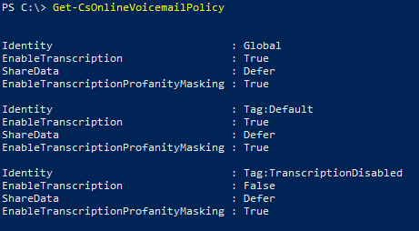

# <a name="set-up-cloud-voicemail"></a>Configurare la segreteria telefonica cloud

Questo articolo riguarda l' [amministratore di Office 365](https://support.office.com/article/da585eea-f576-4f55-a1e0-87090b6aaa9d) che vuole configurare la funzionalità per il cloud Voicemail per tutti gli utenti dell'azienda.

> [!NOTE]
> Cloud Voicemail supporta il deposito dei messaggi della segreteria telefonica solo in una cassetta postale di Exchange e non supporta sistemi di posta elettronica di terze parti. 

## <a name="cloud-only-environments-set-up-cloud-voicemail"></a>Ambienti solo cloud: configurare la segreteria telefonica cloud

Per gli utenti di Skype for business online e per i piani di chiamata, cloud Voicemail viene configurato automaticamente e provisionato per gli utenti dopo l'assegnazione di una licenza per il **sistema telefonico** e di un numero di telefono.
  
1. Se la funzione Sistema telefonico non è inclusa nel tuo piano, può essere necessario acquistare licenze per il componente aggiuntivo **Sistema telefonico**. Inoltre è necessario acquistare una licenza Exchange Online. Vedere [licenze per i componenti aggiuntivi Microsoft teams](teams-add-on-licensing/microsoft-teams-add-on-licensing.md).
    
2. [Assegnare o rimuovere licenze per Office 365 for business](http://support.office.com/article/997596b5-4173-4627-b915-36abac6786dc), [assegnare le licenze di Microsoft teams](assign-teams-licenses.md)e le licenze di Exchange Online agli utenti della propria azienda. Terminate queste operazioni, potranno ricevere i messaggi vocali.
    
3. Il supporto per la trascrizione segreteria telefonica è stato aggiunto a partire da marzo 2017 ed è attivato per impostazione predefinita per tutte le organizzazioni e gli utenti. Puoi disattivare la trascrizione per la tua organizzazione usando Windows PowerShell e attenendoti alle seguenti istruzioni.

## <a name="phone-system-with-on-premises-environments"></a>Sistema telefonico con ambienti locali

Le informazioni seguenti includono la configurazione della segreteria telefonica cloud per l'utilizzo con ambienti di piano chiamante locali.
  
1. Se la funzione Sistema telefonico non è inclusa nel tuo piano, può essere necessario acquistare licenze per il componente aggiuntivo **Sistema telefonico**. Inoltre è necessario acquistare una licenza Exchange Online. Vedere [licenze per i componenti aggiuntivi Microsoft teams](teams-add-on-licensing/microsoft-teams-add-on-licensing.md).
    
2. [Assegnare o rimuovere licenze per Office 365 for business](http://support.office.com/article/997596b5-4173-4627-b915-36abac6786dc), [assegnare le licenze di Microsoft teams](assign-teams-licenses.md)e le licenze di Exchange Online agli utenti della propria azienda.
    
3. Seguire le istruzioni corrispondenti alla soluzione di chiamate PSTN locale distribuita per gli utenti. Per Cloud Connector Edition, seguire le istruzioni nella sezione **Enable Users for Phone System Voice and voicemail Services** della [Guida alla configurazione di Skype for Business Cloud Connector Edition](https://technet.microsoft.com/library/mt605228.aspx). Per le chiamate PSTN con Skype for Business Server, seguire [consentire agli utenti di VoIP aziendale in locale](https://docs.microsoft.com/en-us/skypeforbusiness/skype-for-business-hybrid-solutions/plan-your-phone-system-cloud-pbx-solution/enable-the-users-for-enterprise-voice-on-premises). Per il routing diretto di teams, seguire la sezione **configurare il numero di telefono e abilitare l'organizzazione vocale e la segreteria telefonica** di [Configura routing diretto](https://docs.microsoft.com/en-us/microsoftteams/direct-routing-configure#configure-the-phone-number-and-enable-enterprise-voice-and-voicemail).

4. Il supporto per la trascrizione segreteria telefonica è stato aggiunto a partire da marzo 2017 ed è attivato per impostazione predefinita per tutte le organizzazioni e gli utenti. Puoi disattivare la trascrizione per la tua organizzazione usando Windows PowerShell e attenendoti alle seguenti istruzioni.

5. I messaggi della segreteria telefonica vengono recapitati alla cassetta postale di Exchange degli utenti tramite SMTP instradato tramite Exchange Online Protection. Per consentire il corretto recapito di questi messaggi, verificare che i connettori di Exchange siano configurati correttamente tra i server Exchange e la protezione di Exchange Online. [Usare i connettori per configurare il flusso di posta](https://docs.microsoft.com/en-us/exchange/mail-flow-best-practices/use-connectors-to-configure-mail-flow/use-connectors-to-configure-mail-flow). 

6. Per abilitare le caratteristiche della segreteria telefonica, ad esempio la personalizzazione dei messaggi di saluto e la segreteria telefonica visiva nei client Skype for business, è necessaria la connettività da Office 365 alla cassetta postale di Exchange Server tramite servizi Web Exchange. Per abilitare questa connettività, è necessario configurare il nuovo protocollo di autenticazione OAuth di Exchange descritto in [configurare l'autenticazione OAuth tra le organizzazioni Exchange e Exchange Online](https://technet.microsoft.com/en-us/library/dn594521(v=exchg.150).aspx)oppure eseguire la procedura guidata ibrida di Exchange da Exchange 2013 CU5 o maggiore. Inoltre, è necessario configurare Integration e OAuth tra Skype for business online ed Exchange Server descritto in [configurare Integration e OAuth tra Skype for business online ed Exchange Server](https://docs.microsoft.com/en-us/skypeforbusiness/deploy/integrate-with-exchange-server/oauth-with-online-and-on-premises). 

## <a name="setting-voicemail-policies-in-your-organization"></a>Impostazione dei criteri di segreteria telefonica dell'organizzazione

> [!WARNING]
> Per i clienti Skype for business, la disabilitazione della segreteria telefonica tramite un criterio di chiamata di Microsoft teams può anche disabilitare il servizio di segreteria telefonica per gli utenti di Skype for business.

La trascrizione della segreteria telefonica è abilitata per impostazione predefinita e il mascheramento di volgarità è disabilitato per impostazione predefinita per tutte le organizzazioni e utenti. Tuttavia, è possibile controllarli utilizzando il cmdlet [Set-CsOnlineVoicemailPolicy](https://technet.microsoft.com/library/mt798310.aspx) e [Grant-CsOnlineVoicemailPolicy](https://technet.microsoft.com/library/mt798311.aspx).

I messaggi della segreteria telefonica ricevuti dagli utenti dell'organizzazione vengono trascritti nell'area geografica in cui è ospitato il tenant di Office 365. L'area in cui è ospitato il tenant potrebbe non essere la stessa area in cui si trova l'utente che riceve il messaggio della segreteria telefonica. Per visualizzare l'area geografica in cui è ospitato il tenant, accedere alla pagina del [profilo dell'organizzazione](https://go.microsoft.com/fwlink/p/?linkid=2067339) e quindi fare clic su **Visualizza dettagli** accanto a **posizione dati**.

> [!IMPORTANT]
> Non è possibile creare una nuova istanza di criteri per la trascrizione e la trascrizione delle maschere profane usando il cmdlet **New-CsOnlineVoiceMailPolicy** e non è possibile rimuovere un'istanza di criteri esistente usando il cmdlet **Remove-CsOnlineVoiceMailPolicy** .

È possibile gestire le impostazioni di trascrizione per gli utenti che utilizzano i criteri segreteria telefonica. Per visualizzare tutte le istanze dei criteri di segreteria telefonica disponibili, è possibile usare il cmdlet [Get-CsOnlineVoicemailPolicy](https://technet.microsoft.com/library/mt798311.aspx) .

 **PS C:\\> Get-CsOnlineVoicemailPolicy**
  

  
### <a name="turning-off-transcription-for-your-organization"></a>Disattivare la trascrizione per la propria organizzazione

Dato che l'impostazione predefinita per la trascrizione è attiva per la propria organizzazione, si consiglia di disabilitarla utilizzando il cmdlet [set-CsOnlineVoicemailPolicy](https://technet.microsoft.com/library/mt798310.aspx). Per farlo, eseguire quanto segue:

```
Set-CsOnlineVoicemailPolicy -EnableTranscription $false
```

### <a name="turning-on-transcription-profanity-masking-for-your-organization"></a>Attivazione del mascheramento di volgarità sulla trascrizione per la propria organizzazione

Il mascheramento di volgarità sulla trascrizione è disabilitato per impostazione predefinita per l'organizzazione. Se non vi è un requisito aziendale per abilitarlo, è possibile abilitare il mascheramento di volgarità sulla trascrizione tramite [Set-CsOnlineVoicemailPolicy](https://technet.microsoft.com/library/mt798310.aspx). Per farlo, eseguire quanto segue:

```
Set-CsOnlineVoicemailPolicy -EnableTranscriptionProfanityMasking $true
```

### <a name="turning-off-transcription-for-a-user"></a>Disattivare la trascrizione per un utente

I criteri utente vengono valutati prima delle impostazioni predefinite dell'organizzazione. Ad esempio, se la trascrizione della segreteria telefonica è abilitata per tutti gli utenti, puoi assegnare un criterio per disabilitare la trascrizione per un utente specifico usando il cmdlet [Grant-CsOnlineVoicemailPolicy](https://technet.microsoft.com/library/mt798309.aspx) .

Per disabilitare la trascrizione per un singolo utente, eseguire:

```
Grant-CsOnlineVoicemailPolicy -PolicyName TranscriptionDisabled -Identity sip:amosmar@contoso.com
```

### <a name="turning-on-transcription-profanity-masking-for-a-user"></a>Attivazione del mascheramento di volgarità sulla trascrizione per un utente

Per abilitare il mascheramento di volgarità sulla trascrizione per un utente specifico, è possibile assegnare un criterio per abilitare il mascheramento di volgarità sulla trascrizione per un utente specifico utilizzando il cmdlet [Grant-CsOnlineVoicemailPolicy](https://technet.microsoft.com/library/mt798309.aspx).

Per abilitare il mascheramento di volgarità sulla trascrizione per un singolo utente, eseguire:

```
Grant-CsOnlineVoicemailPolicy -PolicyName TranscriptionProfanityMaskingEnabled -Identity sip:amosmar@contoso.com
```

> [!IMPORTANT]
> Il servizio di segreteria telefonica in Office 365 memorizza in cache i criteri di segreteria telefonica e aggiorna la cache ogni 4 ore. Perciò le modifiche apportate ai criteri possono impiegare fino a 4 ore per essere applicate.

## <a name="help-your-users-learn-skype-for-business-voicemail-features"></a>Aiutare gli utenti a imparare le funzioni della segreteria telefonica Skype for Business

Abbiamo informazioni e articoli di formazione per aiutare gli utenti a usare con successo la segreteria telefonica Skype for Business. Questi sono gli articoli che gli utenti vorranno consultare:

- [Controllare le opzioni e la segreteria telefonica di Skype for Business](https://support.office.com/article/2deea7f8-831f-4e85-a0d4-b34da55945a8): Questo articolo illustra come ascoltare i messaggi vocali in Skype for Business e ascoltare i messaggi vocali a velocità diverse.

- [Formazione per Skype for Business 2016](https://support.office.com/article/eb2081bc-fd0a-4eda-94da-5a39f369ee74)

## <a name="related-topics"></a>Argomenti correlati
[Configurare Skype for Business online](/skypeforbusiness/set-up-skype-for-business-online/set-up-skype-for-business-online)

[Ecco cosa offre il Sistema telefonico in Office 365](here-s-what-you-get-with-phone-system.md)

[Pianificare la migrazione a Skype for Business Server e Exchange Server](https://docs.microsoft.com/en-us/SkypeForBusiness/hybrid/plan-um-migration)


