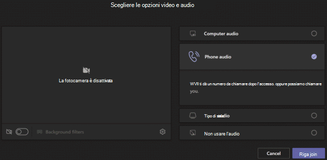

# Configurare la funzionalità Chiamami per gli utenti

In Microsoft Teams, la **funzionalità Chiamami** offre agli utenti un modo per partecipare alla parte audio di una riunione telefonicamente. Questo è utile negli scenari in cui l'uso di un computer per l'audio potrebbe non essere possibile. Gli utenti ottengono la parte audio della riunione tramite il cellulare o la linea di terra e la parte di contenuto della riunione, ad esempio quando un altro partecipante alla riunione condivide lo schermo o riproduce un video tramite il &mdash; &mdash; computer.

> [!IMPORTANT]
> 
> Nei periodi in cui il volume di riunioni è elevato (come abbiamo sperimentato durante l'epidemia di COVID-19), si consiglia agli utenti di partecipare alle riunioni facendo clic sul pulsante <strong>Partecipa alla riunione di Teams</strong> anziché chiamare utilizzando i numeri di conferenza PSTN o utilizzando <strong>Chiamami a</strong>. In questo modo la qualità dell’audio è migliore durante i periodi in cui il numero elevato delle riunioni causa una congestione della rete PSTN.

> [!NOTE]
> [!INCLUDE [updating-admin-interfaces](includes/updating-admin-interfaces.md)]

## Esperienza utente

### Partecipare a una riunione usando il telefono per l'audio

Fare **clic su** Partecipa per partecipare a una riunione, quindi Telefono **audio** nella schermata Scegli le opzioni video e **audio** e fare clic su Partecipa **ora**. Da qui, gli utenti possono avere la chiamata alla riunione e partecipare o accedere manualmente alla riunione.

**Consentire al Teams di una riunione**

Nella schermata **Usa telefono per l'audio,** l'utente immette il numero di telefono e quindi fa clic **su Chiama.** La riunione chiama l'utente e lo partecipa alla riunione.

**Effettuare l'accesso manualmente**

Un altro modo per partecipare è accedere direttamente alla riunione. Nella schermata Usa telefono per  **l'audio** fare clic su Accesso esterno manualmente per ottenere un elenco di numeri di telefono da usare per accedere alla riunione.

### Ricevere una chiamata quando si verifica un problema con l'audio durante una riunione

Se un utente verifica problemi audio quando usa il computer durante una riunione, può passare facilmente all'uso del telefono per l'audio. Teams rileva quando si verifica un problema audio o dispositivo e reindirizza l'utente all'uso del telefono visualizzando l'opzione **Chiamami indietro.**

Ecco un esempio del messaggio  e dell'opzione Richiamami che viene visualizzata quando Teams non rileva un microfono.

L'utente fa clic **su Chiamami indietro**, che visualizza lo **schermo Usa telefono per l'audio.** Da qui, possono immettere il proprio numero di telefono e fare Teams chiamata alla riunione e partecipare alla riunione o effettuare l'accesso manualmente alla riunione.

## Configurare la funzionalità Chiama

Per abilitare la funzionalità Chiamami per gli utenti dell'organizzazione, è necessario configurare quanto segue:

- L'audioconferenza è abilitata per gli utenti dell'organizzazione che pianificano riunioni (organizzatori delle riunioni). Per altre informazioni, vedere Configurare le audioconferenze [per](set-up-audio-conferencing-in-teams.md) Teams [e Gestire le impostazioni di audioconferenza](manage-the-audio-conferencing-settings-for-a-user-in-teams.md)per un utente in Teams .

- L'organizzatore della riunione può effettuare chiamate in uscita dalle riunioni. Per altre informazioni, vedere [Gestire le impostazioni di audioconferenza per un utente in Teams](manage-the-audio-conferencing-settings-for-a-user-in-teams.md).

Se l'organizzatore della riunione non ha abilitato la chiamata in uscita dalle riunioni, l'opzione **audio Telefono** nella schermata Scegli le opzioni video e **audio** non è disponibile per nessuno e gli altri utenti non possono ricevere una chiamata per partecipare alla riunione. Per gli utenti con accesso esterno abilitato, dopo aver partecipato alla riunione, possono partecipare ad altri componendo il proprio numero **dall'icona Mostra partecipanti.**
