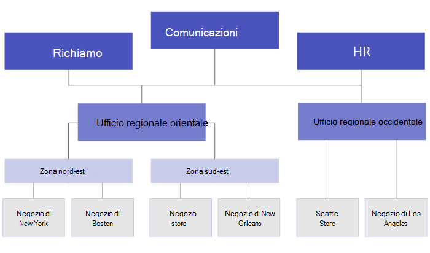

# <a name="set-up-your-team-targeting-hierarchy"></a><span data-ttu-id="fde9d-103">Configurare la gerarchia di destinazione del team</span><span class="sxs-lookup"><span data-stu-id="fde9d-103">Set up your team targeting hierarchy</span></span>

<span data-ttu-id="fde9d-104">L'impostazione di una gerarchia di targeting del team consentirà all'organizzazione di pubblicare contenuto in un ampio set di team.</span><span class="sxs-lookup"><span data-stu-id="fde9d-104">Setting up a team targeting hierarchy will allow your organization to publish content to a large set of teams.</span></span> <span data-ttu-id="fde9d-105">La gerarchia di destinazione del team definisce in che modo tutti i team della gerarchia sono correlati tra loro, in quali utenti possono pubblicare attività e in quali team gli utenti hanno le autorizzazioni per la pubblicazione.</span><span class="sxs-lookup"><span data-stu-id="fde9d-105">The team targeting hierarchy defines how all the teams in your hierarchy are related to each other, which users can publish tasks, and which teams users have permissions to publish to.</span></span> <span data-ttu-id="fde9d-106">Le funzionalità di pubblicazione sono disabilitate per tutti gli utenti, a meno che non sia stata impostata una gerarchia di destinazione del team per l'organizzazione.</span><span class="sxs-lookup"><span data-stu-id="fde9d-106">Publishing features are disabled for all users unless a team targeting hierarchy is set up for your organization.</span></span> <span data-ttu-id="fde9d-107">Per impostare una gerarchia di destinazione del team, è necessario creare un file che definisce la gerarchia e quindi caricarlo in Teams per applicarlo all'organizzazione.</span><span class="sxs-lookup"><span data-stu-id="fde9d-107">To set up a team targeting hierarchy, you'll need to create a file that defines the hierarchy and then upload it to Teams to apply it to your organization.</span></span> <span data-ttu-id="fde9d-108">Dopo il caricamento dello schema, le app all'interno di Teams possono usarlo.</span><span class="sxs-lookup"><span data-stu-id="fde9d-108">After the schema is uploaded, apps within Teams can use it.</span></span>

> [!IMPORTANT]
> <span data-ttu-id="fde9d-109">Per il rilascio iniziale, solo l'app Attività supporta i team gerarchici.</span><span class="sxs-lookup"><span data-stu-id="fde9d-109">For the initial release, only the Tasks app supports hierarchical teams.</span></span>  <span data-ttu-id="fde9d-110">L'applicazione di una gerarchia di destinazione del team all'organizzazione consentirà [la pubblicazione delle attività](https://support.microsoft.com/office/publish-task-lists-to-create-and-track-work-in-your-organization-095409b3-f5af-40aa-9f9e-339b54e705df) nell'app Attività.</span><span class="sxs-lookup"><span data-stu-id="fde9d-110">Applying a team targeting hierarchy to your organization will enable [task publishing](https://support.microsoft.com/office/publish-task-lists-to-create-and-track-work-in-your-organization-095409b3-f5af-40aa-9f9e-339b54e705df) in the Tasks app.</span></span> <span data-ttu-id="fde9d-111">Non verrà visualizzata una gerarchia di team in altre aree di Microsoft Teams.</span><span class="sxs-lookup"><span data-stu-id="fde9d-111">You won't see a hierarchy of teams in other areas of Microsoft Teams.</span></span>

<span data-ttu-id="fde9d-112">Ecco un esempio di come è rappresentata la gerarchia nell'app Attività in Teams.</span><span class="sxs-lookup"><span data-stu-id="fde9d-112">Here's an example of how the hierarchy is represented in the Tasks app in Teams.</span></span> <span data-ttu-id="fde9d-113">Dopo aver creato un elenco attività, i membri del team di pubblicazione possono selezionare i team di destinatari a cui inviare (pubblicare) l'elenco attività.</span><span class="sxs-lookup"><span data-stu-id="fde9d-113">After a task list is created, members of the publishing team can then select the recipient teams to send (publish) the task list to.</span></span> <span data-ttu-id="fde9d-114">Quando si selezionano i team, il team di pubblicazione può filtrare per gerarchia, per attributi o per una combinazione di entrambi.</span><span class="sxs-lookup"><span data-stu-id="fde9d-114">When selecting teams, the publishing team can filter by hierarchy, by attributes, or a combination of both.</span></span><br>


## <a name="terminology"></a><span data-ttu-id="fde9d-116">Terminologia</span><span class="sxs-lookup"><span data-stu-id="fde9d-116">Terminology</span></span>

<span data-ttu-id="fde9d-117">Durante l'esplorazione delle gerarchie, i termini seguenti saranno importanti.</span><span class="sxs-lookup"><span data-stu-id="fde9d-117">The following terms will be important as you navigate hierarchies.</span></span> <span data-ttu-id="fde9d-118">I team verranno chiamati **nodi.**</span><span class="sxs-lookup"><span data-stu-id="fde9d-118">Teams will be referred to as **nodes**.</span></span>

* <span data-ttu-id="fde9d-119">**I nodi radice** sono i nodi principali della gerarchia.</span><span class="sxs-lookup"><span data-stu-id="fde9d-119">**Root nodes** are the topmost nodes in the hierarchy.</span></span> <span data-ttu-id="fde9d-120">Nell'esempio, Retail Communications è un nodo radice.</span><span class="sxs-lookup"><span data-stu-id="fde9d-120">In the example, Retail Communications is a root node.</span></span>
* <span data-ttu-id="fde9d-121">**I nodi padre** **e i nodi figlio** sono termini che rappresentano una relazione tra due nodi connessi.</span><span class="sxs-lookup"><span data-stu-id="fde9d-121">**Parent nodes** and **child nodes** are terms that represent a relationship between two connected nodes.</span></span> <span data-ttu-id="fde9d-122">Nell'esempio, il distretto 01 è un nodo figlio dell'Area 1.</span><span class="sxs-lookup"><span data-stu-id="fde9d-122">In the example, District 01 is a child node of Area 1.</span></span>
* <span data-ttu-id="fde9d-123">Più livelli di figli sono definiti **discendenti.**</span><span class="sxs-lookup"><span data-stu-id="fde9d-123">Multiple levels of children are referred to as **descendants**.</span></span> <span data-ttu-id="fde9d-124">Distretto 01, Store 01, Store 03, Store 07, Distretto 02 e Distretto 03 sono tutti discendenti dell'Area 1.</span><span class="sxs-lookup"><span data-stu-id="fde9d-124">District 01, Store 01, Store 03, Store 07, District 02, and District 03 are all descendants of Area 1.</span></span>
* <span data-ttu-id="fde9d-125">Un nodo senza figli è denominato **nodo foglia.**</span><span class="sxs-lookup"><span data-stu-id="fde9d-125">A node with no children is called a **leaf node**.</span></span> <span data-ttu-id="fde9d-126">Si tratta della parte inferiore di una gerarchia.</span><span class="sxs-lookup"><span data-stu-id="fde9d-126">They are at the bottom of a hierarchy.</span></span>
* <span data-ttu-id="fde9d-127">**I team** dei destinatari sono team che sono stati selezionati per ricevere un set specifico di contenuti da pubblicare.</span><span class="sxs-lookup"><span data-stu-id="fde9d-127">**Recipient teams** are teams that have been selected to receive a specific set of content to be published.</span></span> <span data-ttu-id="fde9d-128">Devono essere nodi di foglie.</span><span class="sxs-lookup"><span data-stu-id="fde9d-128">They must be leaf nodes.</span></span>

## <a name="plan-your-hierarchy"></a><span data-ttu-id="fde9d-129">Pianificare la gerarchia</span><span class="sxs-lookup"><span data-stu-id="fde9d-129">Plan your hierarchy</span></span>

<span data-ttu-id="fde9d-130">Prima di creare lo schema che definisce la gerarchia, è necessario eseguire alcune pianificazioni e decidere come modellare l'organizzazione.</span><span class="sxs-lookup"><span data-stu-id="fde9d-130">Before you create the schema that defines your hierarchy, you need to do some planning and decide how you want to shape your organization.</span></span>  <span data-ttu-id="fde9d-131">Una delle prime priorità consiste nel decidere quali gruppi dell'organizzazione devono pubblicare le attività in altri gruppi.</span><span class="sxs-lookup"><span data-stu-id="fde9d-131">One of the first priorities is deciding which organizational groups need to publish tasks to other groups.</span></span> <span data-ttu-id="fde9d-132">Ogni nodo nella gerarchia rappresenta un gruppo di lavoro o un gruppo di gruppi.</span><span class="sxs-lookup"><span data-stu-id="fde9d-132">Each node in the hierarchy represents a working group or group of groups.</span></span>

### <a name="permissions-to-publish"></a><span data-ttu-id="fde9d-133">Autorizzazioni per la pubblicazione</span><span class="sxs-lookup"><span data-stu-id="fde9d-133">Permissions to publish</span></span>

<span data-ttu-id="fde9d-134">L'autorizzazione per la pubblicazione dipende dal fatto che un utente sia membro di qualsiasi team nella gerarchia più la relazione di tale team o set di team con altri team nella gerarchia.</span><span class="sxs-lookup"><span data-stu-id="fde9d-134">Permission to publish depends on whether a user is a member of any teams in the hierarchy plus the relationship of that team or set of teams to other teams in the hierarchy.</span></span>

> [!NOTE]
> <span data-ttu-id="fde9d-135">Al proprietario di un team vengono concesse anche le autorizzazioni di pubblicazione.</span><span class="sxs-lookup"><span data-stu-id="fde9d-135">The owner of a team is also granted publishing permissions.</span></span>

* <span data-ttu-id="fde9d-136">Se un utente è membro di almeno un team con discendenti nella gerarchia, può pubblicare su tali discendenti senza essere membro di tutti i team in cui vuole pubblicare.</span><span class="sxs-lookup"><span data-stu-id="fde9d-136">If a user is a member of at least one team that has descendants in the hierarchy, that user can publish to those descendants without being a member of all teams they want to publish to.</span></span>
* <span data-ttu-id="fde9d-137">Se un utente è membro di almeno un team nella gerarchia ma non è membro di un team con discendenti nella gerarchia, potrà visualizzare e ricevere il contenuto pubblicato dall'organizzazione.</span><span class="sxs-lookup"><span data-stu-id="fde9d-137">If a user is a member of a least one team in the hierarchy but isn't a member of any team with descendants in the hierarchy, that user can see and receive published content from their organization.</span></span>
* <span data-ttu-id="fde9d-138">Se un utente non è membro di un team della gerarchia, non ne visualizza le funzionalità correlate alla pubblicazione.</span><span class="sxs-lookup"><span data-stu-id="fde9d-138">If a user isn't a member of any team in the hierarchy, that user won't see any publishing-related functionality.</span></span>

### <a name="guidelines"></a><span data-ttu-id="fde9d-139">Linee guida</span><span class="sxs-lookup"><span data-stu-id="fde9d-139">Guidelines</span></span>

* <span data-ttu-id="fde9d-140">Per ogni organizzazione può essere applicato un solo file della gerarchia.</span><span class="sxs-lookup"><span data-stu-id="fde9d-140">There can only be one hierarchy file applied per organization.</span></span> <span data-ttu-id="fde9d-141">Tuttavia, è possibile includere diverse parti dell'organizzazione come gerarchie distinte di nodi all'interno di un file CSV.</span><span class="sxs-lookup"><span data-stu-id="fde9d-141">However, you can include different parts of your organization together as distinct hierarchies of nodes within one CSV file.</span></span> <span data-ttu-id="fde9d-142">Ad esempio, Contoso Pharmaceuticals ha un nodo radice di farmacia e un nodo radice di vendita al dettaglio.</span><span class="sxs-lookup"><span data-stu-id="fde9d-142">For example, Contoso Pharmaceuticals has a Pharmacy root node and a Retail root node.</span></span> <span data-ttu-id="fde9d-143">Entrambi i nodi radice hanno più righe di elementi discendenti e non esistono sovrapposizioni tra di essi.</span><span class="sxs-lookup"><span data-stu-id="fde9d-143">Both root nodes have multiple rows of descendants and there's no overlap between them.</span></span>
* <span data-ttu-id="fde9d-144">Solo i nodi foglie possono essere destinatari di una pubblicazione.</span><span class="sxs-lookup"><span data-stu-id="fde9d-144">Only leaf nodes can be recipients of a publication.</span></span> <span data-ttu-id="fde9d-145">Gli altri nodi nella gerarchia sono utili per selezionare i destinatari di una pubblicazione.</span><span class="sxs-lookup"><span data-stu-id="fde9d-145">Other nodes in the hierarchy are helpful for selecting recipients of a publication.</span></span>
* <span data-ttu-id="fde9d-146">Un team può essere rappresentato una sola volta in una gerarchia.</span><span class="sxs-lookup"><span data-stu-id="fde9d-146">A team can only be represented one time in a hierarchy.</span></span>
* <span data-ttu-id="fde9d-147">Una gerarchia può contenere fino a 15.000 nodi.</span><span class="sxs-lookup"><span data-stu-id="fde9d-147">A hierarchy can contain up to 15,000 nodes.</span></span> <span data-ttu-id="fde9d-148">Microsoft prevede di collaborare con i clienti per aumentare questo limite per le organizzazioni più grandi.</span><span class="sxs-lookup"><span data-stu-id="fde9d-148">We plan to work with customers to raise this limit for larger organizations.</span></span>

### <a name="example-hierarchy"></a><span data-ttu-id="fde9d-149">Gerarchia di esempio</span><span class="sxs-lookup"><span data-stu-id="fde9d-149">Example hierarchy</span></span>

<span data-ttu-id="fde9d-150">Ad esempio, nella gerarchia seguente, Recall, Communications e HR possono pubblicare attività in ogni nodo inferiore (team) della gerarchia, mentre l'area nord-est può pubblicare attività solo nei team di New York Store e Milano Store.</span><span class="sxs-lookup"><span data-stu-id="fde9d-150">For example, in the following hierarchy, Recall, Communications, and HR can publish tasks to every bottom node (team) in the hierarchy, but Northeast Zone can only publish tasks to the New York Store and Boston Store teams.</span></span> <span data-ttu-id="fde9d-151">La gerarchia di esempio consente ai gruppi di richiamo, comunicazioni e risorse umane di pubblicare attività applicabili all'intera società, ad esempio informazioni sui vantaggi o messaggi inviati dal CEO.</span><span class="sxs-lookup"><span data-stu-id="fde9d-151">The example hierarchy allows the Recall, Communications, and HR groups to publish tasks that apply to the entire company, such as benefits information or messages from the CEO.</span></span> <span data-ttu-id="fde9d-152">L'area nord-est può pubblicare attività come la pianificazione del personale, le informazioni meteo e così via, solo per i team di New York Store e Milano Store.</span><span class="sxs-lookup"><span data-stu-id="fde9d-152">Northeast Zone can publish tasks like personnel scheduling, weather information, and so on, only to the New York Store and Boston Store teams.</span></span>



## <a name="create-your-hierarchy"></a><span data-ttu-id="fde9d-154">Creare la gerarchia</span><span class="sxs-lookup"><span data-stu-id="fde9d-154">Create your hierarchy</span></span>

> [!NOTE]
> <span data-ttu-id="fde9d-155">Nella parte restante di questo articolo viene illustrata la configurazione di una gerarchia di team nel contesto della pubblicazione di attività per i team dei destinatari.</span><span class="sxs-lookup"><span data-stu-id="fde9d-155">The remainder of this article discusses setting up a team hierarchy in the context of publishing tasks to recipient teams.</span></span> <span data-ttu-id="fde9d-156">Fare riferimento [a Gestisci l'app Attività per l'organizzazione in Teams](https://docs.microsoft.com/MicrosoftTeams/manage-tasks-app) per una panoramica dell'app Attività, in cui la pubblicazione delle attività viene visualizzata quando è abilitata.</span><span class="sxs-lookup"><span data-stu-id="fde9d-156">Refer to [Manage the Tasks app for your organization in Teams](https://docs.microsoft.com/MicrosoftTeams/manage-tasks-app) for an overview of the Tasks app, where task publishing appears when enabled.</span></span>

<span data-ttu-id="fde9d-157">Lo schema che definisce la gerarchia si basa su un file con valori delimitati da virgole (CSV).</span><span class="sxs-lookup"><span data-stu-id="fde9d-157">The schema that defines your hierarchy is based on a comma-separated values (CSV) file.</span></span> <span data-ttu-id="fde9d-158">Ogni riga nel file CSV corrisponde a un nodo nella gerarchia dei team.</span><span class="sxs-lookup"><span data-stu-id="fde9d-158">Each row in the CSV file corresponds to one node within the hierarchy of teams.</span></span> <span data-ttu-id="fde9d-159">Ogni riga contiene informazioni che nominano il nodo all'interno della gerarchia, lo collegano facoltativamente a un team e includono attributi che possono essere usati per filtrare i team nelle app che lo supportano.</span><span class="sxs-lookup"><span data-stu-id="fde9d-159">Each row contains information that names the node within the hierarchy, optionally links it to a team, and includes attributes that can be used to filter teams in apps that support it.</span></span>

<span data-ttu-id="fde9d-160">È anche possibile definire i **contenitori,** ovvero categorie che il team di pubblicazione può usare per organizzare il contenuto inviato ai team dei destinatari, in modo che possano visualizzare, ordinare e concentrarsi sul contenuto pertinente.</span><span class="sxs-lookup"><span data-stu-id="fde9d-160">You can also define **buckets**, which are categories that the publishing team can use to organize content sent to recipient teams to make it easier for them to view, sort, and focus on relevant content.</span></span>

### <a name="add-required-columns"></a><span data-ttu-id="fde9d-161">Aggiungere le colonne obbligatorie</span><span class="sxs-lookup"><span data-stu-id="fde9d-161">Add required columns</span></span>

<span data-ttu-id="fde9d-162">Il file CSV deve contenere le tre colonne seguenti, nell'ordine seguente, a partire dalla prima colonna.</span><span class="sxs-lookup"><span data-stu-id="fde9d-162">The CSV file must contain the following three columns, in the following order, starting at the first column.</span></span> <span data-ttu-id="fde9d-163">Per ricevere attività, un nodo deve essere collegato a un team.</span><span class="sxs-lookup"><span data-stu-id="fde9d-163">A node must be linked to a team for it to receive tasks.</span></span>

| <span data-ttu-id="fde9d-164">Nome colonna</span><span class="sxs-lookup"><span data-stu-id="fde9d-164">Column name</span></span>   | <span data-ttu-id="fde9d-165">Obbligatorio</span><span class="sxs-lookup"><span data-stu-id="fde9d-165">Required</span></span> | <span data-ttu-id="fde9d-166">Descrizione</span><span class="sxs-lookup"><span data-stu-id="fde9d-166">Description</span></span>   |
----------------|----------|---------------|
| <span data-ttu-id="fde9d-167">DisplayName</span><span class="sxs-lookup"><span data-stu-id="fde9d-167">DisplayName</span></span>    | <span data-ttu-id="fde9d-168">Sì</span><span class="sxs-lookup"><span data-stu-id="fde9d-168">Yes</span></span>      | <span data-ttu-id="fde9d-169">Questo campo è il nome del nodo.</span><span class="sxs-lookup"><span data-stu-id="fde9d-169">This field is the name of the node.</span></span> <span data-ttu-id="fde9d-170">Il nome può essere lungo fino a 100 caratteri e contenere solo i caratteri A-Z, a-z e 0-9.</span><span class="sxs-lookup"><span data-stu-id="fde9d-170">The name can be up to 100 characters long and contain only the characters A-Z, a-z, and 0-9.</span></span> <span data-ttu-id="fde9d-171">I nomi dei nodi devono essere univoci.</span><span class="sxs-lookup"><span data-stu-id="fde9d-171">Node names must be unique.</span></span> |
| <span data-ttu-id="fde9d-172">ParentName</span><span class="sxs-lookup"><span data-stu-id="fde9d-172">ParentName</span></span>    | <span data-ttu-id="fde9d-173">Sì</span><span class="sxs-lookup"><span data-stu-id="fde9d-173">Yes</span></span>       | <span data-ttu-id="fde9d-174">Nome del nodo padre.</span><span class="sxs-lookup"><span data-stu-id="fde9d-174">This is the name of the parent node.</span></span> <span data-ttu-id="fde9d-175">Il valore specificato qui deve corrispondere esattamente al valore nel **campo DisplayName** del nodo padre.</span><span class="sxs-lookup"><span data-stu-id="fde9d-175">The value you specify here must match the value in the **DisplayName** field of the parent node exactly.</span></span> <span data-ttu-id="fde9d-176">Per aggiungere più di un nodo padre, separare ogni nome del nodo padre con un punto e virgola (;).</span><span class="sxs-lookup"><span data-stu-id="fde9d-176">If you want to add more than one parent node, separate each parent node name with a semicolon (;).</span></span> <span data-ttu-id="fde9d-177">È possibile aggiungere fino a 25 nodi padre e ogni nome di nodo padre può contenere fino a 2500 caratteri.</span><span class="sxs-lookup"><span data-stu-id="fde9d-177">You can add up to 25 parent nodes, and each parent node name can be up to 2500 characters long.</span></span> <span data-ttu-id="fde9d-178">Un nodo può avere più nodi padre solo se i nodi padre sono nodi radice.</span><span class="sxs-lookup"><span data-stu-id="fde9d-178">A node can have multiple parent nodes only if the parent nodes are root nodes.</span></span>   <br><br><span data-ttu-id="fde9d-179">**IMPORTANTE** Prestare attenzione a non creare un ciclo in cui un elemento padre più in alto nella gerarchia faccia riferimento a un nodo figlio più basso nella gerarchia.</span><span class="sxs-lookup"><span data-stu-id="fde9d-179">**IMPORTANT** Be careful not to create a loop where a parent higher up in the hierarchy references a child node lower in the hierarchy.</span></span> <span data-ttu-id="fde9d-180">Questa funzionalità non è supportata.</span><span class="sxs-lookup"><span data-stu-id="fde9d-180">This isn't supported.</span></span> |
| <span data-ttu-id="fde9d-181">TeamId</span><span class="sxs-lookup"><span data-stu-id="fde9d-181">TeamId</span></span>        | <span data-ttu-id="fde9d-182">Sì, se il team pubblica attività o riceve attività da un nodo padre</span><span class="sxs-lookup"><span data-stu-id="fde9d-182">Yes, if the team publishes tasks or receives tasks from a parent node</span></span>       | <span data-ttu-id="fde9d-183">Contiene l'ID del team a cui si vuole collegare un nodo.</span><span class="sxs-lookup"><span data-stu-id="fde9d-183">This contains the ID of the team you want to link a node to.</span></span> <span data-ttu-id="fde9d-184">Ogni nodo deve fare riferimento a un team univoco, in modo che ogni valore Di TeamId venga visualizzato una sola volta nel file della gerarchia.</span><span class="sxs-lookup"><span data-stu-id="fde9d-184">Each node must refer to a unique team, so each TeamId value may appear only once in the hierarchy file.</span></span> <span data-ttu-id="fde9d-185">Per ottenere l'ID di un team a cui si vuole collegare un nodo, eseguire il comando di PowerShell seguente: `Get-Team | Export-Csv TeamList.csv` .</span><span class="sxs-lookup"><span data-stu-id="fde9d-185">To get the ID of a team you want to link a node to, run the following PowerShell command: `Get-Team | Export-Csv TeamList.csv`.</span></span> <span data-ttu-id="fde9d-186">Questo comando elenca i team dell'organizzazione e include il nome e l'ID di ogni team.</span><span class="sxs-lookup"><span data-stu-id="fde9d-186">This command lists the teams in your organization and includes the name and ID for each team.</span></span> <span data-ttu-id="fde9d-187">Trovare il nome del team a cui si vuole creare il collegamento e quindi copiare l'ID in questo campo.</span><span class="sxs-lookup"><span data-stu-id="fde9d-187">Find the name of the team you want to link to, and then copy the ID into this field.</span></span>|

> [!NOTE]
> <span data-ttu-id="fde9d-188">Se un nodo non è un nodo radice o un nodo foglia e non è necessaria l'appartenenza al team per concedere le autorizzazioni corrispondenti per la pubblicazione e la creazione di report, è possibile lasciare vuoto TeamId.</span><span class="sxs-lookup"><span data-stu-id="fde9d-188">If a node isn't a root node or a leaf node and you don't need the team membership to grant the corresponding permissions for publishing and reporting, you can leave the TeamId blank.</span></span> <span data-ttu-id="fde9d-189">Questo metodo può essere usato per aggiungere maggiore granularità quando si scelgono i team dei destinatari o per visualizzare i report di completamento senza avere un team corrispondente.</span><span class="sxs-lookup"><span data-stu-id="fde9d-189">This method can be used to add more granularity when choosing recipient teams or for viewing completion reports without having a corresponding team.</span></span>

### <a name="add-attribute-columns"></a><span data-ttu-id="fde9d-190">Aggiungere colonne di attributi</span><span class="sxs-lookup"><span data-stu-id="fde9d-190">Add attribute columns</span></span>

<span data-ttu-id="fde9d-191">Dopo aver aggiunto le tre colonne obbligatorie, è possibile aggiungere colonne di attributi facoltative.</span><span class="sxs-lookup"><span data-stu-id="fde9d-191">After you add the three required columns, you can add optional attribute columns.</span></span> <span data-ttu-id="fde9d-192">Questi attributi possono essere usati per filtrare i nodi in modo da selezionare più facilmente quelli in cui pubblicare le attività.</span><span class="sxs-lookup"><span data-stu-id="fde9d-192">These attributes can be used to filter nodes so that you can more easily select the ones you want to publish tasks to.</span></span> <span data-ttu-id="fde9d-193">Esistono due modi per definire gli attributi, a seconda che i valori per l'attributo si escludono a vicenda.</span><span class="sxs-lookup"><span data-stu-id="fde9d-193">There are two ways to define your attributes, depending on whether values for that attribute are mutually exclusive.</span></span>

|<span data-ttu-id="fde9d-194">Metodi per l'aggiunta di attributi</span><span class="sxs-lookup"><span data-stu-id="fde9d-194">Ways to add attributes</span></span>|<span data-ttu-id="fde9d-195">Descrizione</span><span class="sxs-lookup"><span data-stu-id="fde9d-195">Description</span></span> |<span data-ttu-id="fde9d-196">Esempio</span><span class="sxs-lookup"><span data-stu-id="fde9d-196">Example</span></span>  |
|---|---------|---------|
|<span data-ttu-id="fde9d-197">Se i valori per un attributo si escludono a vicenda, il nome della colonna specificato diventa il nome dell'attributo.</span><span class="sxs-lookup"><span data-stu-id="fde9d-197">If the values for an attribute are mutually exclusive, the column name you specify becomes the name of the attribute.</span></span>|<span data-ttu-id="fde9d-198">Ogni riga può contenere un valore per l'attributo e ogni colonna dell'attributo può includere fino a 50 valori univoci.</span><span class="sxs-lookup"><span data-stu-id="fde9d-198">Each row can contain one value for that attribute, and each attribute column can have up to 50 unique values.</span></span> <span data-ttu-id="fde9d-199">Ogni valore può contenere al massimo 100 caratteri.</span><span class="sxs-lookup"><span data-stu-id="fde9d-199">Each value can be up to 100 characters long.</span></span> <span data-ttu-id="fde9d-200">Il set di valori degli attributi specificato nella colonna dell'attributo verrà visualizzato come valori di filtro per l'attributo quando si selezionano i team dei destinatari usando la gerarchia di destinazione del team.</span><span class="sxs-lookup"><span data-stu-id="fde9d-200">The set of attribute values you specify in the attribute column will be displayed as filter values for that attribute when selecting recipient teams using the team targeting hierarchy.</span></span>|<span data-ttu-id="fde9d-201">Si vuole consentire agli utenti di filtrare i negozi in base al layout.</span><span class="sxs-lookup"><span data-stu-id="fde9d-201">You want users to be able to filter stores by layout.</span></span> <span data-ttu-id="fde9d-202">I valori per questo attributo si escludono a vicenda perché un archivio può avere un solo layout.</span><span class="sxs-lookup"><span data-stu-id="fde9d-202">The values for this attribute are mutually exclusive because a store can have only one layout.</span></span> <br><br><span data-ttu-id="fde9d-203">Per aggiungere un attributo per filtrare i negozi in base al layout, aggiungere una colonna denominata Layout archivio.</span><span class="sxs-lookup"><span data-stu-id="fde9d-203">To add an attribute to filter stores by layout, add a column named Store layout.</span></span> <span data-ttu-id="fde9d-204">In questo esempio i valori per l'attributo layout Store sono Compact, Standard e Large.</span><span class="sxs-lookup"><span data-stu-id="fde9d-204">In this example, values for the Store layout attribute are Compact, Standard, and Large.</span></span>
|<span data-ttu-id="fde9d-205">Se è necessario indicare più valori per un attributo e i valori non si escludono a vicenda, usare il formato **AttributeName:UniqueValue** per i nomi di colonna.</span><span class="sxs-lookup"><span data-stu-id="fde9d-205">If you need to indicate multiple values for an attribute and the values aren't mutually exclusive, use the **AttributeName:UniqueValue** format for the column names.</span></span> <br><br><span data-ttu-id="fde9d-206">**IMPORTANTE** Assicurarsi di usare i due punti solo in inglese (:) perché unicode non è supportato come delimitatore di colonna degli attributi.</span><span class="sxs-lookup"><span data-stu-id="fde9d-206">**IMPORTANT** Make sure to use the English-only colon (:) as unicode isn't supported as an attribute column delimiter.</span></span> |<span data-ttu-id="fde9d-207">Stringa di testo prima dei due punti (:) diventa il nome dell'attributo.</span><span class="sxs-lookup"><span data-stu-id="fde9d-207">The text string before the colon (:) becomes the name of the attribute.</span></span> <span data-ttu-id="fde9d-208">Tutte le colonne che contengono la stessa stringa di testo prima dei due punti (:) sono raggruppate in una sezione del menu di filtro.</span><span class="sxs-lookup"><span data-stu-id="fde9d-208">All columns that contain the same text string before the colons (:) are grouped together into a section in the filtering menu.</span></span> <span data-ttu-id="fde9d-209">Ognuna delle stringhe dopo i due punti diventa i valori per quella sezione.</span><span class="sxs-lookup"><span data-stu-id="fde9d-209">Each of the strings after the colon become the values for that section.</span></span><br><br><span data-ttu-id="fde9d-210">Ogni riga può avere un valore pari a 0 (zero) o 1 per l'attributo.</span><span class="sxs-lookup"><span data-stu-id="fde9d-210">Each row can have a value of 0 (zero) or 1 for that attribute.</span></span> <span data-ttu-id="fde9d-211">Il valore 0 indica che l'attributo non è applicabile al nodo e il valore 1 indica che l'attributo si applica a tale nodo.</span><span class="sxs-lookup"><span data-stu-id="fde9d-211">A value of 0 means that the attribute doesn't apply to the node and a value of 1 means that the attribute applies to that node.</span></span>|<span data-ttu-id="fde9d-212">Si vuole consentire agli utenti di filtrare i negozi per reparto.</span><span class="sxs-lookup"><span data-stu-id="fde9d-212">You want users to be able to filter stores by department.</span></span> <span data-ttu-id="fde9d-213">Un archivio può avere più reparti, quindi i valori per l'attributo non si escludono a vicenda.</span><span class="sxs-lookup"><span data-stu-id="fde9d-213">A store can have multiple departments and so the values for this attribute aren't mutually exclusive.</span></span><br><br><span data-ttu-id="fde9d-214">In questo esempio si aggiungono Reparti:Abbigliamento, Reparti:Elettronica, Reparti:Alimenti, Reparti:Casa e Giardino, Reparti:Beni sportivi come colonne di attributi.</span><span class="sxs-lookup"><span data-stu-id="fde9d-214">In this example, we add Departments:Clothing, Departments:Electronics, Departments:Foods, Departments:Home and Garden, Departments:Sporting goods as attribute columns.</span></span> <span data-ttu-id="fde9d-215">I reparti diventano il nome dell'attributo e gli utenti possono filtrare in base ai reparti abbigliamento, elettronica, alimenti, casa e giardino e articoli sportivi.</span><span class="sxs-lookup"><span data-stu-id="fde9d-215">Departments becomes the attribute name and users can filter by the Clothing, Electronics, Foods, Home and Garden, and Sporting goods departments.</span></span>|

<span data-ttu-id="fde9d-216">Quando si aggiunge una colonna attributo, tenere presente quanto segue:</span><span class="sxs-lookup"><span data-stu-id="fde9d-216">When you add an attribute column, keep the following in mind:</span></span>

* <span data-ttu-id="fde9d-217">Il nome della colonna specificato o quello specificato prima dei due punti (:) diventa il nome dell'attributo.</span><span class="sxs-lookup"><span data-stu-id="fde9d-217">The column name you specify or the column name that you specify before the colon (:) becomes the name of the attribute.</span></span> <span data-ttu-id="fde9d-218">Questo valore verrà visualizzato nelle app di Teams che usano la gerarchia.</span><span class="sxs-lookup"><span data-stu-id="fde9d-218">This value will be displayed in the Teams apps that use the hierarchy.</span></span>
* <span data-ttu-id="fde9d-219">Nella gerarchia possono essere presenti fino a 50 colonne di attributi.</span><span class="sxs-lookup"><span data-stu-id="fde9d-219">You can have up to 50 attribute columns in your hierarchy.</span></span>
* <span data-ttu-id="fde9d-220">Il nome della colonna può essere lungo fino a 100 caratteri e contenere solo i caratteri A-Z, a-z, 0-9 e spazi.</span><span class="sxs-lookup"><span data-stu-id="fde9d-220">The column name can be up to 100 characters long and contain only the characters A-Z, a-z, and 0-9, and spaces.</span></span> <span data-ttu-id="fde9d-221">I nomi di colonna devono essere univoci.</span><span class="sxs-lookup"><span data-stu-id="fde9d-221">Column names must be unique.</span></span>

### <a name="add-bucket-columns"></a><span data-ttu-id="fde9d-222">Aggiungere le colonne del contenitore</span><span class="sxs-lookup"><span data-stu-id="fde9d-222">Add bucket columns</span></span>

<span data-ttu-id="fde9d-223">È possibile aggiungere colonne del contenitore per creare contenitori, ovvero raggruppamenti in cui è possibile organizzare le attività.</span><span class="sxs-lookup"><span data-stu-id="fde9d-223">You can add bucket columns to create buckets, which are groupings into which tasks can be organized.</span></span> <span data-ttu-id="fde9d-224">Ogni contenitore ottiene una propria colonna nel file CSV.</span><span class="sxs-lookup"><span data-stu-id="fde9d-224">Each bucket gets its own column in the CSV file.</span></span> <span data-ttu-id="fde9d-225">I contenitori creati vengono resi disponibili al team di pubblicazione.</span><span class="sxs-lookup"><span data-stu-id="fde9d-225">The buckets you create are made available to the publishing team.</span></span> <span data-ttu-id="fde9d-226">Il team di pubblicazione può quindi usare questi contenitori per categorizzare le attività per i team dei destinatari.</span><span class="sxs-lookup"><span data-stu-id="fde9d-226">The publishing team can then use these buckets to categorize tasks for the recipient teams.</span></span> <span data-ttu-id="fde9d-227">Se un contenitore non esiste già in un team, i contenitori vengono creati su richiesta quando le attività vengono pubblicate.</span><span class="sxs-lookup"><span data-stu-id="fde9d-227">If a bucket doesn't already exist on a team, buckets are created on-demand when tasks are published.</span></span>

<span data-ttu-id="fde9d-228">Categorizzando gli elementi di lavoro una volta a livello centrale, il team di pubblicazione può pre-organizzare l'elenco attività per tutti i decine, centinaia o migliaia di team destinatari che ricevono l'elenco attività.</span><span class="sxs-lookup"><span data-stu-id="fde9d-228">By categorizing the work items one time centrally, the publishing team can pre-organize the task list for all the tens, hundreds, or thousands of recipient teams that receive the task list.</span></span> <span data-ttu-id="fde9d-229">I team dei destinatari possono quindi ordinare e filtrare le attività per contenitore per concentrarsi sull'area più rilevante per il proprio lavoro.</span><span class="sxs-lookup"><span data-stu-id="fde9d-229">The recipient teams can then sort and filter their tasks by bucket to focus on the area most relevant to their work.</span></span>

<span data-ttu-id="fde9d-230">Quando si aggiunge una colonna del contenitore, tenere presente quanto segue:</span><span class="sxs-lookup"><span data-stu-id="fde9d-230">When you add a bucket column, note the following:</span></span>

* <span data-ttu-id="fde9d-231">Il nome della colonna diventa il nome del contenitore.</span><span class="sxs-lookup"><span data-stu-id="fde9d-231">The column name becomes the name of the bucket.</span></span> <span data-ttu-id="fde9d-232">Ogni contenitore specificato verrà visualizzato nell'elenco Contenitori nelle app di Teams che usano la gerarchia.</span><span class="sxs-lookup"><span data-stu-id="fde9d-232">Each bucket you specify will appear in the Buckets list in the Teams apps that use the hierarchy.</span></span>
* <span data-ttu-id="fde9d-233">È consigliabile non includere informazioni riservate nei nomi dei contenitori.</span><span class="sxs-lookup"><span data-stu-id="fde9d-233">We recommend that you don't include sensitive information in bucket names.</span></span> <span data-ttu-id="fde9d-234">Al momento, i team di pubblicazione non possono rimuovere un contenitore tramite pubblicazione dopo la sua creazione.</span><span class="sxs-lookup"><span data-stu-id="fde9d-234">At this time, publishing teams can't remove a bucket through publishing after it's created.</span></span>
* <span data-ttu-id="fde9d-235">Il nome della colonna deve essere preceduto da un hashtag (#).</span><span class="sxs-lookup"><span data-stu-id="fde9d-235">The column name must be preceded by a hashtag (#).</span></span> <span data-ttu-id="fde9d-236">Può contenere fino a 100 caratteri e contenere solo i caratteri A-Z, a-z e 0-9.</span><span class="sxs-lookup"><span data-stu-id="fde9d-236">It can be up to 100 characters long and contain only the characters A-Z, a-z, and 0-9.</span></span> <span data-ttu-id="fde9d-237">Ad esempio, #Operations e #Frozen beni.</span><span class="sxs-lookup"><span data-stu-id="fde9d-237">For example, #Operations and #Frozen Goods.</span></span>
* <span data-ttu-id="fde9d-238">Una gerarchia può contenere fino a 25 colonne di contenitori.</span><span class="sxs-lookup"><span data-stu-id="fde9d-238">A hierarchy may contain up to 25 bucket columns.</span></span> <span data-ttu-id="fde9d-239">Microsoft prevede di collaborare con i clienti per aumentare questo limite per le organizzazioni più grandi.</span><span class="sxs-lookup"><span data-stu-id="fde9d-239">We plan to work with customers to increase this limit for larger organizations.</span></span>

### <a name="example"></a><span data-ttu-id="fde9d-240">Esempio</span><span class="sxs-lookup"><span data-stu-id="fde9d-240">Example</span></span>

<span data-ttu-id="fde9d-241">Ecco un esempio di file CSV di schema che verrebbe creato per supportare la gerarchia mostrata nell'immagine precedente.</span><span class="sxs-lookup"><span data-stu-id="fde9d-241">Here's an example of a schema CSV file that would be created to support the hierarchy shown in the previous image.</span></span> <span data-ttu-id="fde9d-242">Questo schema contiene quanto segue:</span><span class="sxs-lookup"><span data-stu-id="fde9d-242">This schema contains the following:</span></span>

* <span data-ttu-id="fde9d-243">Tre colonne obbligatorie `TargetName` denominate `ParentName` , e `TeamId`</span><span class="sxs-lookup"><span data-stu-id="fde9d-243">Three required columns named `TargetName`, `ParentName`, and `TeamId`</span></span>
* <span data-ttu-id="fde9d-244">Tre colonne di attributi `Store layout` `Departments:Clothing` denominate, , e `Departments:Foods`</span><span class="sxs-lookup"><span data-stu-id="fde9d-244">Three attribute columns named `Store layout`, `Departments:Clothing`, and `Departments:Foods`</span></span>
* <span data-ttu-id="fde9d-245">Tre colonne del contenitore `Fresh Foods` denominate `Frozen Foods` , , e `Women's Wear`</span><span class="sxs-lookup"><span data-stu-id="fde9d-245">Three bucket columns named `Fresh Foods`, `Frozen Foods`, and `Women's Wear`</span></span>

<span data-ttu-id="fde9d-246">`Store layout`L'attributo ha valori che includono , e `Compact` `Standard` `Large` .</span><span class="sxs-lookup"><span data-stu-id="fde9d-246">The `Store layout` attribute has values that include `Compact`, `Standard`, and `Large`.</span></span> <span data-ttu-id="fde9d-247">Le `Departments` colonne degli attributi possono essere impostate su un valore pari a `0` (zero) o `1` .</span><span class="sxs-lookup"><span data-stu-id="fde9d-247">The `Departments` attribute columns can be set to a value of `0` (zero) or `1`.</span></span> <span data-ttu-id="fde9d-248">Il `Store` layout e gli attributi non sono visualizzati `Departments` nell'immagine precedente.</span><span class="sxs-lookup"><span data-stu-id="fde9d-248">The `Store` layout and `Departments` attributes aren't shown in the image above.</span></span> <span data-ttu-id="fde9d-249">Vengono aggiunti qui per mostrare in che modo è possibile aggiungere attributi alle voci del nodo.</span><span class="sxs-lookup"><span data-stu-id="fde9d-249">They're added here to help show how attributes can be added to node entries.</span></span> <span data-ttu-id="fde9d-250">Lo stesso vale per le tre colonne del contenitore.</span><span class="sxs-lookup"><span data-stu-id="fde9d-250">The same is true for the three bucket columns.</span></span>

```CSV
"TargetName,ParentName,TeamId,Store layout,Departments:Clothing,Departments:Foods,#Fresh Foods,#Frozen Foods,#Women's Wear"
"Recall,,db23e6ba-04a6-412a-95e8-49e5b01943ba,,,,,,"
"Communications,,145399ce-a761-4843-a110-3077249037fc,,,,,,"
"HR,,,,,,,,,,"
"East Regional Office,,,,,,,,,,"
"West Regional Office,,,,,,,,,,"
"Northeast Zone,East Regional Office,,,,,,,,"
"Southeast Zone,East Regional Office,,,,,,,,"
"New York Store,Northeast Zone,e2ba65f6-25e7-488b-b8f0-b8562d5de60a,Large,1,1,,,"
"Boston Store,Northeast Zone,0454f08a-0507-437c-969a-682eb2fae7fc,Standard,1,1,,,"
"Miami Store,Southeast Zone,619d6e4e-5f68-4b36-8e1f-16c98d7396c1,Compact,0,1,,,"
"New Orleans Store,Southeast Zone,6be960b8-72af-4561-a343-9ac4711874eb,Compact,0,1,,,"
"Seattle Store,West Regional Zone,487c0d20-4e55-4dc2-8187-a24c826e0fee,Standard,1,1,,,"
"Los Angeles Store,West Regional Zone,204a1287-2efb-4a8a-88e0-56fbaf5a2389,Large,1,1,,,"
```

## <a name="apply-your-hierarchy"></a><span data-ttu-id="fde9d-251">Applicare la gerarchia</span><span class="sxs-lookup"><span data-stu-id="fde9d-251">Apply your hierarchy</span></span>

<span data-ttu-id="fde9d-252">Dopo aver definito la gerarchia nel file CSV di schema, è possibile caricarla in Teams.</span><span class="sxs-lookup"><span data-stu-id="fde9d-252">After you've defined your hierarchy in the schema CSV file, you're ready to upload it to Teams.</span></span> <span data-ttu-id="fde9d-253">A questo scopo, eseguire il comando seguente.</span><span class="sxs-lookup"><span data-stu-id="fde9d-253">To do this, run the following command.</span></span> <span data-ttu-id="fde9d-254">Per eseguire questo passaggio è necessario essere un amministratore globale o un amministratore dei servizi di Teams.</span><span class="sxs-lookup"><span data-stu-id="fde9d-254">You must be a global admin or Teams service admin to do this step.</span></span>

```powershell
Set-TeamTargetingHierarchy -FilePath "C:\ContosoTeamSchema.csv"
```

### <a name="update-your-hierarchy"></a><span data-ttu-id="fde9d-255">Aggiornare la gerarchia</span><span class="sxs-lookup"><span data-stu-id="fde9d-255">Update your hierarchy</span></span>

<span data-ttu-id="fde9d-256">È possibile caricare una nuova gerarchia per sostituire quella precedente usando lo stesso comando di PowerShell riportato sopra.</span><span class="sxs-lookup"><span data-stu-id="fde9d-256">You can upload a new hierarchy to replace the old one using the same PowerShell command as above.</span></span> <span data-ttu-id="fde9d-257">Ogni volta che si carica una nuova gerarchia, questa sostituisce quella precedente.</span><span class="sxs-lookup"><span data-stu-id="fde9d-257">Each time you upload a new hierarchy, it replaces the previous hierarchy.</span></span>

### <a name="check-the-status-of-your-hierarchy"></a><span data-ttu-id="fde9d-258">Controllare lo stato della gerarchia</span><span class="sxs-lookup"><span data-stu-id="fde9d-258">Check the status of your hierarchy</span></span>

<span data-ttu-id="fde9d-259">È possibile eseguire il comando seguente per controllare lo stato di caricamento della gerarchia.</span><span class="sxs-lookup"><span data-stu-id="fde9d-259">You can run the following command to check the status of your hierarchy upload.</span></span>

```powershell
Get-TeamTargetingHierarchyStatus
```

<span data-ttu-id="fde9d-260">Il comando restituirà i campi seguenti:</span><span class="sxs-lookup"><span data-stu-id="fde9d-260">The command will return the following fields:</span></span>

<span data-ttu-id="fde9d-261">Campo</span><span class="sxs-lookup"><span data-stu-id="fde9d-261">Field</span></span>|<span data-ttu-id="fde9d-262">Descrizione</span><span class="sxs-lookup"><span data-stu-id="fde9d-262">Description</span></span>
-----|------------
<span data-ttu-id="fde9d-263">ID</span><span class="sxs-lookup"><span data-stu-id="fde9d-263">Id</span></span> | <span data-ttu-id="fde9d-264">ID univoco per il caricamento.</span><span class="sxs-lookup"><span data-stu-id="fde9d-264">The unique ID for the upload.</span></span>
<span data-ttu-id="fde9d-265">Stato</span><span class="sxs-lookup"><span data-stu-id="fde9d-265">Status</span></span> | <span data-ttu-id="fde9d-266">Stato caricamento.</span><span class="sxs-lookup"><span data-stu-id="fde9d-266">Upload status.</span></span> <span data-ttu-id="fde9d-267">I valori **includono Starting,** **Validating,** **Successful** e **Failed**</span><span class="sxs-lookup"><span data-stu-id="fde9d-267">Values include **Starting**, **Validating**, **Successful**, and **Failed**</span></span>
<span data-ttu-id="fde9d-268">ErrorDetails</span><span class="sxs-lookup"><span data-stu-id="fde9d-268">ErrorDetails</span></span> | <span data-ttu-id="fde9d-269">Dettagli se si verifica un errore di caricamento.</span><span class="sxs-lookup"><span data-stu-id="fde9d-269">Details if there's an upload error.</span></span> <span data-ttu-id="fde9d-270">Per altre informazioni sui dettagli dell'errore, vedere la sezione Risoluzione dei problemi.</span><span class="sxs-lookup"><span data-stu-id="fde9d-270">For more information about the error details, see the Troubleshooting section.</span></span> <span data-ttu-id="fde9d-271">Se non si verificano errori, questo campo è vuoto.</span><span class="sxs-lookup"><span data-stu-id="fde9d-271">If there's no error, this field is blank.</span></span>
<span data-ttu-id="fde9d-272">LastUpdatedAt</span><span class="sxs-lookup"><span data-stu-id="fde9d-272">LastUpdatedAt</span></span> | <span data-ttu-id="fde9d-273">Data e ora dell'ultimo aggiornamento del file.</span><span class="sxs-lookup"><span data-stu-id="fde9d-273">Timestamp and date of when the file was last updated.</span></span>
<span data-ttu-id="fde9d-274">LastModifiedBy</span><span class="sxs-lookup"><span data-stu-id="fde9d-274">LastModifiedBy</span></span> | <span data-ttu-id="fde9d-275">ID dell'ultimo utente che ha modificato il file.</span><span class="sxs-lookup"><span data-stu-id="fde9d-275">The ID of the last user who modified the file.</span></span>
<span data-ttu-id="fde9d-276">FileName</span><span class="sxs-lookup"><span data-stu-id="fde9d-276">FileName</span></span> | <span data-ttu-id="fde9d-277">Il nome file del file CSV.</span><span class="sxs-lookup"><span data-stu-id="fde9d-277">The file name of the CSV.</span></span>

## <a name="remove-your-hierarchy"></a><span data-ttu-id="fde9d-278">Rimuovere la gerarchia</span><span class="sxs-lookup"><span data-stu-id="fde9d-278">Remove your hierarchy</span></span>

<span data-ttu-id="fde9d-279">Per disabilitare immediatamente la scheda **Elenchi** pubblicati per tutti gli utenti dell'organizzazione, è possibile rimuovere la gerarchia.</span><span class="sxs-lookup"><span data-stu-id="fde9d-279">If you want to immediately disable the **Published lists** tab for all users in your organization, you can remove your hierarchy.</span></span> <span data-ttu-id="fde9d-280">Gli utenti non hanno accesso alla scheda **Elenchi** pubblicati o alle funzionalità nella scheda.  Questo include la possibilità di creare nuovi elenchi di attività per pubblicare, accedere alle bozze degli elenchi, pubblicare, annullare la pubblicazione e duplicare gli elenchi e visualizzare i report.</span><span class="sxs-lookup"><span data-stu-id="fde9d-280">Users won't have access to the **Published lists** tab or any of the functionalities on the tab.  This includes the ability to create new task lists to publish, access draft lists, publish, unpublish, and duplicate lists, and view reporting.</span></span> <span data-ttu-id="fde9d-281">La rimozione della gerarchia non annulla la pubblicazione delle attività pubblicate in precedenza.</span><span class="sxs-lookup"><span data-stu-id="fde9d-281">Removing the hierarchy doesn't unpublish tasks that were previously published.</span></span> <span data-ttu-id="fde9d-282">Queste attività rimarranno disponibili per il completamento dei team dei destinatari.</span><span class="sxs-lookup"><span data-stu-id="fde9d-282">These tasks will remain available for recipient teams to complete.</span></span>

<span data-ttu-id="fde9d-283">Per rimuovere la gerarchia, eseguire il comando seguente.</span><span class="sxs-lookup"><span data-stu-id="fde9d-283">To remove your hierarchy, run the following command.</span></span> <span data-ttu-id="fde9d-284">Per eseguire questo passaggio, è necessario essere un amministratore.</span><span class="sxs-lookup"><span data-stu-id="fde9d-284">You must be an admin to perform this step.</span></span>

```powershell
Remove-TeamTargetingHierarchy
```

<span data-ttu-id="fde9d-285">Quando si conferma l'eliminazione, nel messaggio di stato viene comunque visualizzato lo schema precedente, anche se se si tenta di eliminarlo di nuovo viene restituito un errore che indica che l'oggetto è Null.</span><span class="sxs-lookup"><span data-stu-id="fde9d-285">When confirming deletion, the status message will still display the previous schema is present, although attempting to delete again returns an error that the object is null.</span></span>

## <a name="create-a-sample-hierarchy"></a><span data-ttu-id="fde9d-286">Creare una gerarchia di esempio</span><span class="sxs-lookup"><span data-stu-id="fde9d-286">Create a sample hierarchy</span></span>

### <a name="install-the-teams-powershell-module"></a><span data-ttu-id="fde9d-287">Installare il modulo Teams di PowerShell</span><span class="sxs-lookup"><span data-stu-id="fde9d-287">Install the Teams PowerShell module</span></span>

> [!IMPORTANT]
> <span data-ttu-id="fde9d-288">Per eseguire questo passaggio, è necessario installare e usare il modulo di anteprima pubblica di Teams PowerShell dalla [raccolta PowerShell.](https://www.powershellgallery.com/packages/MicrosoftTeams/)</span><span class="sxs-lookup"><span data-stu-id="fde9d-288">To perform this step, you must install and use the Teams PowerShell public preview module from the [PowerShell Gallery](https://www.powershellgallery.com/packages/MicrosoftTeams/).</span></span> <span data-ttu-id="fde9d-289">Per istruzioni su come installare il modulo, vedere [Installare Teams PowerShell.](teams-powershell-install.md)</span><span class="sxs-lookup"><span data-stu-id="fde9d-289">For steps on how to install the module, see [Install Teams PowerShell](teams-powershell-install.md).</span></span>

### <a name="sample-script"></a><span data-ttu-id="fde9d-290">Script di esempio</span><span class="sxs-lookup"><span data-stu-id="fde9d-290">Sample script</span></span>

<span data-ttu-id="fde9d-291">Lo script seguente può essere usato per creare i team e caricare un file CSV nel tenant di Microsoft Teams.</span><span class="sxs-lookup"><span data-stu-id="fde9d-291">The following script can be used to create the teams and upload a .csv file to your Microsoft Teams tenant.</span></span> <span data-ttu-id="fde9d-292">Se è già presente una gerarchia, questo script la sostituirà.</span><span class="sxs-lookup"><span data-stu-id="fde9d-292">If you have an existing hierarchy, this script will replace it.</span></span>

#### <a name="create-teams-for-a-simple-hierarchy"></a><span data-ttu-id="fde9d-293">Creare team per una gerarchia semplice</span><span class="sxs-lookup"><span data-stu-id="fde9d-293">Create teams for a simple hierarchy</span></span>

```powershell
$tm1 = New-Team -DisplayName "HQ"
$tm2 = New-Team -DisplayName "North"
$tm3 = New-Team -DisplayName "Store 1"
$tm4 = New-Team -DisplayName "Store 2"
$tm5 = New-Team -DisplayName "South"
$tm6 = New-Team -DisplayName "Store 3"
$tm7 = New-Team -DisplayName "Store 4"
```

#### <a name="use-team-data-to-create-comma-separated-output-displayname-parentname-teamid"></a><span data-ttu-id="fde9d-294">Usare i dati del team per creare un output con valori delimitati da virgole (DisplayName, ParentName, TeamId)</span><span class="sxs-lookup"><span data-stu-id="fde9d-294">Use team data to create comma-separated output (DisplayName, ParentName, TeamId)</span></span>

```powershell
$csvOutput = "DisplayName" + "," + "ParentName" + "," + "TeamId" + "`n"
$csvOutput = $csvOutput + $tm1.DisplayName + "," + "," + $tm1.GroupID + "`n"
$csvOutput = $csvOutput + $tm2.DisplayName + "," + $tm1.DisplayName + "," + $tm2.GroupID + "`n"
$csvOutput = $csvOutput + $tm3.DisplayName + "," + $tm2.DisplayName + "," + $tm3.GroupID + "`n"
$csvOutput = $csvOutput + $tm4.DisplayName + "," + $tm2.DisplayName + "," + $tm4.GroupID + "`n"
$csvOutput = $csvOutput + $tm5.DisplayName + "," + $tm1.DisplayName + "," + $tm5.GroupID + "`n"
$csvOutput = $csvOutput + $tm6.DisplayName + "," + $tm5.DisplayName + "," + $tm6.GroupID + "`n"
$csvOutput = $csvOutput + $tm7.DisplayName + "," + $tm5.DisplayName + "," + $tm7.GroupID 
```

#### <a name="save-output-to-a-csv-file-in-the-downloads-folder"></a><span data-ttu-id="fde9d-295">Salvare l'output in un file CSV nella **cartella** Download</span><span class="sxs-lookup"><span data-stu-id="fde9d-295">Save output to a .csv file in the **Downloads** folder</span></span>

```powershell
$csvOutputPath = $env:USERPROFILE + "\downloads\testhierarchy-" + (Get-Date -Format "yyyy-MM-dd-hhmmss") + ".csv" 
$csvOutput | Out-File $csvOutputPath
```

#### <a name="upload-the-hierarchy"></a><span data-ttu-id="fde9d-296">Caricare la gerarchia</span><span class="sxs-lookup"><span data-stu-id="fde9d-296">Upload the hierarchy</span></span>

```powershell
Set-TeamTargetingHierarchy -FilePath $csvOutputPath
Get-TeamTargetingHierarchyStatus
```

## <a name="troubleshooting"></a><span data-ttu-id="fde9d-297">Risoluzione dei problemi</span><span class="sxs-lookup"><span data-stu-id="fde9d-297">Troubleshooting</span></span>

### <a name="how-to-view-error-details"></a><span data-ttu-id="fde9d-298">Come visualizzare i dettagli degli errori</span><span class="sxs-lookup"><span data-stu-id="fde9d-298">How to view error details</span></span>

<span data-ttu-id="fde9d-299">È possibile eseguire il comando seguente per comprendere la causa dell'errore e restituire i dettagli dell'errore.</span><span class="sxs-lookup"><span data-stu-id="fde9d-299">You can run the following command to understand what is causing an error and return the error details.</span></span>

```powershell
(Get-TeamTargetingHierarchyStatus).ErrorDetails.ErrorMessage
```

### <a name="you-receive-an-error-message-when-you-upload-your-schema-csv-file"></a><span data-ttu-id="fde9d-300">Viene visualizzato un messaggio di errore quando si carica il file CSV di schema</span><span class="sxs-lookup"><span data-stu-id="fde9d-300">You receive an error message when you upload your schema CSV file</span></span>

<span data-ttu-id="fde9d-301">Prendere nota del messaggio di errore, perché dovrebbe includere informazioni sulla risoluzione dei problemi per indicare il motivo per cui non è stato possibile caricare lo schema.</span><span class="sxs-lookup"><span data-stu-id="fde9d-301">Take note of the error message as it should include troubleshooting information to indicate why the schema couldn't be uploaded.</span></span> <span data-ttu-id="fde9d-302">Rivedere e modificare il file CSV di schema in base alle informazioni contenute nel messaggio di errore e quindi riprovare.</span><span class="sxs-lookup"><span data-stu-id="fde9d-302">Review and edit your schema CSV file based on the information in the error message and then try again.</span></span>

### <a name="you-receive-an-error-invalidteamid-error-message-when-you-upload-your-schema-csv-file"></a><span data-ttu-id="fde9d-303">Viene visualizzato un messaggio di errore "Errore: InvalidTeamId" quando si carica il file CSV di schema</span><span class="sxs-lookup"><span data-stu-id="fde9d-303">You receive an "Error: InvalidTeamId" error message when you upload your schema CSV file</span></span>

<span data-ttu-id="fde9d-304">Quando si prova a caricare il file CSV di schema, viene visualizzato il messaggio di errore seguente:</span><span class="sxs-lookup"><span data-stu-id="fde9d-304">When you try to upload your schema CSV file, you get the following error message:</span></span>

```console
Error: InvalidTeamId
Description: TeamID in row # doesn't match a valid Group ID. Please view our documentation to learn how to get the proper GroupID for each team.
```

<span data-ttu-id="fde9d-305">Verificare di usare l'ID team corretto per il team nel file CSV di schema.</span><span class="sxs-lookup"><span data-stu-id="fde9d-305">Check to make sure that you're using the correct TeamId for the team in your schema CSV file.</span></span> <span data-ttu-id="fde9d-306">L'ID Team deve essere uguale all'ID gruppo del gruppo di Microsoft 365 che backup il team.</span><span class="sxs-lookup"><span data-stu-id="fde9d-306">The TeamId should be the same as the Group ID of the Microsoft 365 group that backs the team.</span></span> <span data-ttu-id="fde9d-307">È possibile cercare l'ID gruppo del team nell'interfaccia di amministrazione di Microsoft Teams.</span><span class="sxs-lookup"><span data-stu-id="fde9d-307">You can look up the Group ID of the team in the Microsoft Teams admin center.</span></span>

1. <span data-ttu-id="fde9d-308">Nella barra di spostamento sinistra dell'interfaccia [di amministrazione di Microsoft Teams,](https://admin.teams.microsoft.com/)passa a Gestisci team di   >  **Teams.**</span><span class="sxs-lookup"><span data-stu-id="fde9d-308">In the left navigation of the [Microsoft Teams admin center](https://admin.teams.microsoft.com/), go to **Teams** > **Manage teams**.</span></span>
2. <span data-ttu-id="fde9d-309">Se la **colonna ID** gruppo non è visualizzata nella tabella, selezionare Modifica colonne nell'angolo **superiore** destro della tabella e quindi attivare **ID gruppo.**</span><span class="sxs-lookup"><span data-stu-id="fde9d-309">If the **Group ID** column isn't displayed in the table, select **Edit columns** in the upper-right corner of the table, and then turn on **Group ID**.</span></span>
3. <span data-ttu-id="fde9d-310">Trovare il team nell'elenco e quindi individuare l'ID gruppo.</span><span class="sxs-lookup"><span data-stu-id="fde9d-310">Find the team in the list, and then locate the Group ID.</span></span>

<span data-ttu-id="fde9d-311">Assicurarsi che l'ID team nel file CSV di schema corrisponda all'ID gruppo visualizzato nell'interfaccia di amministrazione di Microsoft Teams.</span><span class="sxs-lookup"><span data-stu-id="fde9d-311">Make sure that the TeamId in your schema CSV file matches the Group ID that's displayed in the Microsoft Teams admin center.</span></span>

## <a name="related-topics"></a><span data-ttu-id="fde9d-312">Argomenti correlati</span><span class="sxs-lookup"><span data-stu-id="fde9d-312">Related topics</span></span>

* [<span data-ttu-id="fde9d-313">Gestire l'app Attività per l'organizzazione in Teams</span><span class="sxs-lookup"><span data-stu-id="fde9d-313">Manage the Tasks app for your organization in Teams</span></span>](manage-tasks-app.md)
* [<span data-ttu-id="fde9d-314">Panoramica di PowerShell per Teams</span><span class="sxs-lookup"><span data-stu-id="fde9d-314">Teams PowerShell overview</span></span>](teams-powershell-overview.md)
