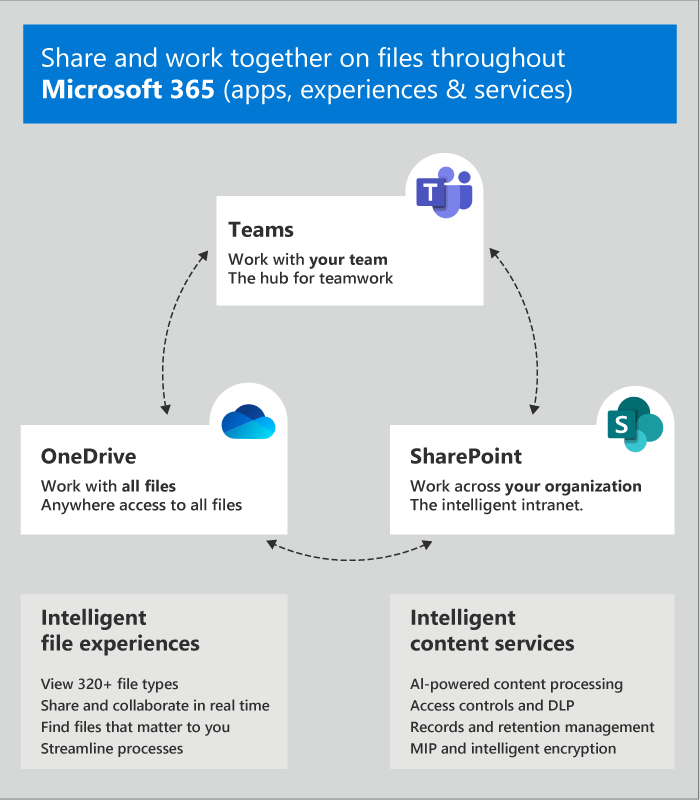

# Condivisione di file in Microsoft Teams

> [!INCLUDE [new feature coming soon](includes/new-feature-coming-soon-article.md)]

Le funzionalità di condivisione di file in team consentono agli utenti di condividere contenuti con altri utenti di teams nell'organizzazione. La condivisione in teams si basa sulle impostazioni configurate in SharePoint e OneDrive, quindi qualsiasi configurazione per SharePoint e OneDrive controllerà la condivisione anche in teams.

Condivisione teams consente agli utenti di eseguire le operazioni seguenti:

- Condividere file da OneDrive.

- Impostare le autorizzazioni per i file che si vuole condividere con altri utenti.

- Condividere file tra team.

- Condividere file dall'elenco dei file di recente accesso (in genere, questi sono i file che gli utenti sono più interessati alla condivisione).

- Rimanere in teams quando si fa clic sul nome di un file per aprire un file.

Teams accorcia gli URL di SharePoint e gli URL del browser lunghi che puntano a un file. Teams USA solo il nome del file per creare un collegamento a un file. Inoltre, l'opzione **Ottieni collegamento** è stata cambiata in **copia collegamento** per eliminare qualsiasi confusione che gli utenti potrebbero avere per consentire ad altri di accedere a un file.

## Configurare la condivisione in OneDrive e SharePoint

Per altre informazioni sulla condivisione di file in OneDrive e SharePoint, tra cui la configurazione della condivisione e la modalità di attivazione e disattivazione della condivisione, vedere:

- [Panoramica della condivisione esterna](https://docs.microsoft.com/sharepoint/external-sharing-overview) : descrive cosa succede quando gli utenti condividono, a seconda di cosa stanno condividendo e con chi.

- [Attivare o disattivare la condivisione esterna](https://docs.microsoft.com/sharepoint/turn-external-sharing-on-or-off) : descrive in che modo gli amministratori globali e di SharePoint possono modificare le impostazioni di condivisione a livello di organizzazione per SharePoint e OneDrive.

- [Modificare la condivisione esterna per un sito](https://docs.microsoft.com/sharepoint/change-external-sharing-site) : descrive in che modo gli amministratori globali e di SharePoint possono attivare o disattivare la condivisione esterna per un sito.

- [Modificare il tipo di collegamento predefinito quando gli utenti ottengono collegamenti per la condivisione](https://docs.microsoft.com/sharepoint/change-default-sharing-link) : descrive come impostare il tipo di collegamento predefinito in modo che sia più restrittivo.

## Ulteriori informazioni

- [Come interagire con SharePoint Online e OneDrive for business con Microsoft Teams](sharepoint-onedrive-interact.md)

- [SharePoint e teams: meglio insieme](https://techcommunity.microsoft.com/t5/Microsoft-SharePoint-Blog/SharePoint-and-Teams-Better-Together/ba-p/189593).

- [Condividere file e cartelle di OneDrive](https://support.office.com/article/Share-OneDrive-files-and-folders-9fcc2f7d-de0c-4cec-93b0-a82024800c07#OS_Type=OneDrive_-_Business)

- [Condividere file o cartelle di SharePoint](https://support.office.com/article/share-sharepoint-files-or-folders-1fe37332-0f9a-4719-970e-d2578da4941c)

