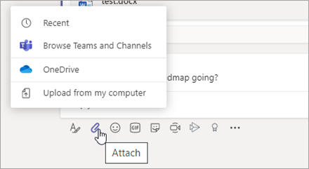
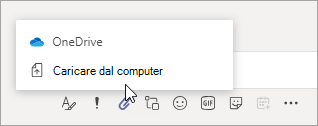
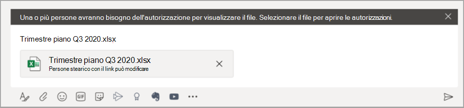

# Condividere file in Microsoft Teams

In Microsoft Teams, gli utenti possono condividere contenuti con altri utenti di Teams all'interno e all'esterno della propria organizzazione. La condivisione di file e cartelle in Teams si basa sulle impostazioni configurate in SharePoint e OneDrive, quindi qualsiasi impostazione configurata per SharePoint e OneDrive influirà anche sulla condivisione in Teams.

## Panoramica

Gli utenti possono condividere file da OneDrive, da team e siti a cui hanno accesso e dal proprio computer. Per condividere un file, gli utenti possono eseguire le seguenti operazioni:

- In un canale, fare click su **Allega** (l’icona a forma di graffetta), selezionare **Recenti**, **Sfoglia team e canali**, **OneDrive** o **Carica dal computer locale**, quindi scegliere i file che si desidera condividere.  
    
- In un chat, fare click su **Allega** (l’icona a forma di graffetta), selezionare **OneDrive** o **Carica dal computer locale**, quindi scegliere i file che si desidera condividere. 
    
- Copia e incolla il link di condivisione nella casella di composizione. 
    

### Autorizzazioni di file condivisi e collegamenti di condivisione

Quando gli utenti condividono un file direttamente da Teams, possono impostare chi può accedere al file proprio come fanno in Microsoft 365. Possono concedere l'accesso a chiunque, persone all’interno dell’organizzazione, persone con accesso esistente o persone specifiche (che possono includere le persone in una chat 1:1, chat di gruppo o canale).  Quando un file viene condiviso, l'anteprima del file è disponibile nel messaggio, insieme a tutte le azioni sui file come **Apri online**, **Scarica**, e **Copia link**. Per impostazione predefinita, il file si apre in Teams.

Quando gli utenti condividono un file in una chat o in un canale, vengono avvisati se alcuni o tutti i destinatari non sono autorizzati a visualizzare il file. Possono modificare le autorizzazioni sul file prima di condividerlo facendo clic sulla freccia accanto all'anteprima del file che ora appare nel messaggio.

## Argomenti correlati

[Modalità di interazione di SharePoint Online e OneDrive for Business con Microsoft Teams](sharepoint-onedrive-interact.md)

[Modificare il tipo di collegamento predefinito per un sito](https://docs.microsoft.com/sharepoint/change-default-sharing-link)

[Collaborare con guest in un team](https://docs.microsoft.com/microsoft-365/solutions/collaborate-as-team)