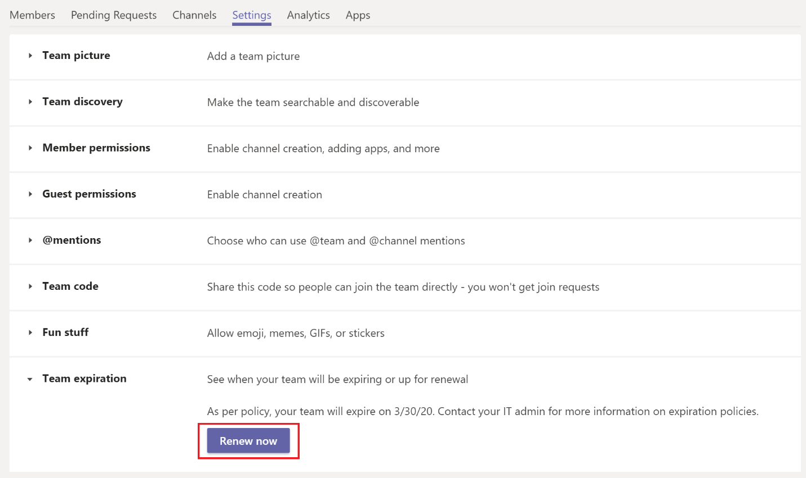

# Scadenza e rinnovo del team in Microsoft Teams

Le organizzazioni con un numero elevato di team hanno spesso team che non vengono mai effettivamente usati. Questo problema può verificarsi a causa di diversi motivi, tra cui la sperimentazione del prodotto, la collaborazione a breve termine del team o i proprietari del team che lasciano l'organizzazione. Nel tempo, questi team possono accumularsi e creare un onere per le risorse del tenant.  

Per limitare il numero di Team inutilizzati, come amministratore, è possibile usare i [criteri di scadenza del gruppo di Office 365](https://docs.microsoft.com/office365/admin/create-groups/office-365-groups-expiration-policy) per pulire automaticamente i team inutilizzati. Poiché i team sono supportate da gruppi, i criteri di scadenza del gruppo si applicano automaticamente anche ai team.

Quando si applicano criteri di scadenza a un team, un proprietario del team riceve una notifica per il rinnovo del team di 30 giorni, 15 giorni e 1 giorno prima della data di scadenza del team. Quando il proprietario del team riceve la notifica, può fare clic su **rinnova ora** nelle impostazioni del team per rinnovare il team.

Se il proprietario del team non rinnova il team, il team viene inserito in uno stato "Soft-deleted", il che significa che può essere ripristinato entro i prossimi 30 giorni.

## Rinnovo automatico del team

Non è possibile che un proprietario del team possa rinnovare il team, perché si è dimenticato di rinnovare o non è più disponibile al momento del rinnovo. In questi scenari, un team in uso attivo può essere eliminato a causa di criteri di scadenza che si applicano al team.  

Per evitare l'eliminazione accidentale, il rinnovo automatico viene abilitato automaticamente per un team nei criteri di scadenza del gruppo. Quando viene configurato il criterio di scadenza del gruppo, qualsiasi team che abbia almeno una visita di un canale da qualsiasi membro del team prima della data di scadenza viene rinnovato automaticamente senza alcun intervento manuale da parte del proprietario del team.

## Problemi noti

**La data di scadenza del team e il gruppo sottostante non corrispondono**

Prima che un team venga rinnovato, il gruppo che appoggia il team viene rinnovato per primo. Come parte del rinnovo, una nuova data di scadenza viene impostata sul gruppo per una data futura. Questa nuova data potrebbe non essere immediatamente visibile in teams. La sincronizzazione può richiedere fino a 24 ore. Se viene visualizzata una discrepanza tra la data di scadenza per un team e il relativo gruppo sottostante, attendere 24 ore prima di richiedere ulteriore supporto.
