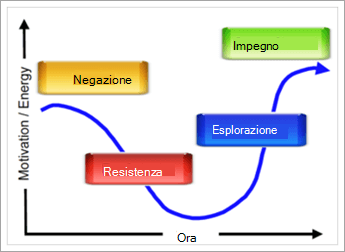

# Quanto è pronta l'organizzazione per Microsoft Teams?

Ora che il team di progetto si è riunito e si sta iniziando a vedere cosa può fare Teams per l'organizzazione, è importante valutare la preparazione dell'organizzazione per la transizione Teams lavoro. Per valutare la conformità, è necessario:

1. Valutare gli stakeholder.
2. Identificare gli utenti che adottano in anticipo.
3. Valutare la conformità dell'organizzazione alle modifiche. 

## Valutare gli stakeholder

Elencare gli stakeholder principali e i responsabili aziendali dell'organizzazione. Per ogni individuo, porre le domande seguenti:
 
1. Questo leader è amico delle nuove tecnologie?
2. Valuta la soddisfazione di questo leader per la tua tecnologia attuale.
3. Questo leader è disposto a usare una tecnologia non avanzata per accelerare i risultati o creare un'esperienza migliore per i membri del team?
4. Questo leader è sotto un elevato livello di pressione per ottenere risultati aziendali chiave? 
5. Questo leader sarà disposto a evangelizzare la sua esperienza con Teams aiutare nella transizione?
6. Questo responsabile ha una relazione positiva con i membri chiave del team di progetto esistente?
7. A questo leader piace essere visto come un "agente del cambiamento" all'interno dell'organizzazione?  

È possibile aggiungere altre domande rilevanti per l'organizzazione. Per le due fasi iniziali (avvio e esperimento), verranno visualizzati i leader che sono disponibili per il cambiamento, un po' insoddisfatti della tecnologia corrente e con cui si ha una buona relazione. Questi responsabili devono essere inseriti nel team di progetto di base come consulenti aziendali e potrebbero avere progetti che saranno essenziali per la fase di sperimentazione. È importante selezionare situazioni reali di impatto con cui sperimentare ed evitare progetti ad alto rischio per gli esperimenti iniziali.
   
> [!NOTE]
> Anche se è possibile assegnare un punteggio a questo tipo di questionario che ridurrebbe al minimo l'impatto dell'elemento umano delle relazioni all'interno dell'organizzazione, il cambiamento dipende dalla chimica del team tanto quanto dalle loro competenze tecniche o dal loro acume aziendale. Esaminare l'elenco con i membri del team per discutere della "forma" dei vari responsabili con questo progetto mentre si selezionano i progetti e il personale per le fasi successive. 

## Identificare i primi utenti

I primi utenti condividono determinati tratti, indipendentemente dalle dimensioni o dal settore dell'organizzazione. In genere, i primi utenti condividono questi tratti:

- Interessato alla tecnologia
- Desideroso di partecipare al cambiamento
- Cercare di apportare miglioramenti
- Collaborazione per natura
- Disposti a condividere le loro osservazioni e le loro apprendimenti con il gruppo
- Sono persone a rischio; in altri, sono disposti a provare qualcosa per vedere se funziona

Usare una forma semplice in Microsoft 365 o Office 365 per consentire a questi utenti di acconsentire esplicitamente al programma di adozione iniziale per Teams. A seconda delle dimensioni e della complessità dell'organizzazione, è possibile scegliere di abilitare alcuni o tutti questi utenti per la fase di sperimentazione. In questo programma accettano di partecipare attivamente alla fase di sperimentazione e di fornire regolarmente feedback al team di progetto. Evitare di avere persone che vogliono semplicemente testare le nuove tecnologie. Fagli sapere che, fornendo questo feedback attivo, contribuisce a creare il risultato del progetto. Si userà questo elenco di persone nella [fase 2 - esperimento.](teams-adoption-phase2-experiment.md)

La nostra Guida al programma Early Adopter è una risorsa utile per dare il via a questo programma nel tuo ambiente.  
 
## Valutare la conformità dell'organizzazione alle modifiche

Il cambiamento è un processo umano che non ha nulla a che fare con la tecnologia. C'è la psicologia comportamentale e le nevrosi che ci informano sulla naturale resistenza al cambiamento. Per rendere accettabile il cambiamento, è fondamentale anticipare le esigenze degli utenti, esprimere la propria comprensione della situazione e creare soluzioni che migliorino tale situazione. Anche in questo modo si riscontra una naturale resistenza al cambiamento.  

Ogni approccio dell'organizzazione cambia in modo diverso, a seconda dell'area geografica, dello stile di lavoro, del profilo professionale e di altri elementi dell'organizzazione. Per valutare la conformità dell'organizzazione, vedere Valutare la conformità [alle modifiche dell'organizzazione.](upgrade-org-change-readiness.md) Usare le linee guida per rispondere alle domande seguenti:

1. Quale percentuale di utenti rientra in ogni contenitore? (*Resistenza alla modifica*)
    - **Early adopters:** richiedere la soluzione prima che sia disponibile.
    - **Utenti informati:** usare la soluzione una volta dimostrato il suo valore.
    - **Dissidenti:** consente di tornare indietro su qualsiasi modifica.
    
   > [!TIP]
   > I primi utenti adottano grandi tester pilota e campioni peer. Gli utenti che sono lenti ad adottare nuovi strumenti richiedono ulteriore incentivo e più tempo per adeguarsi. 

2. Qual è la competenza degli utenti per la modifica? (*Formazione*)
    - **Per iniziare è** necessario solo un collegamento a un video.
    - **I generatori di team** sono molto bene con la formazione di gruppo.
    - **Gli studenti uno-a-uno** richiedono il supporto personale.

    > [!TIP]
    > Personalizzare il tipo e l'importo della formazione in base alle competenze e alle persone. Mantenete aggiornati i corsi di formazione non appena verranno online le nuove funzionalità.

3. Oltre a questa distribuzione del servizio, quante altre modifiche sono in corso? (*Adattabilità*)  Le modifiche potrebbero includere Office/Windows, spostamenti in ufficio, fusioni, rielivi e così via.
    - Nessuno
    - 1-3 modifiche
    - Più di 3 modifiche
 
    > [!TIP] 
    > Un cambiamento troppo grande può ostacolare l'accettazione e la produttività. Se sono in corso più di 3 modifiche, è consigliabile impostarne la spaziatura o creare un tema per raggruppare le modifiche.  

Combinare questi dati con i profili degli stakeholder e i dipendenti che vogliono acconsentire esplicitamente al programma early adopter. In questo modo sarà possibile identificare i gruppi pronti e in grado di assorbire il cambiamento insieme ai compiti esistenti. Questo metodo consente di creare partner nella modifica.

È possibile usare campioni interni per risolvere il problema della presenza di tipi di modifica diversi. In questo caso, il feedback è la chiave per il successo: incoraggiare le persone a condividere le proprie sfide e le proprie esigenze. Abbracciare dissidenti e dissidenti dando a questi individui o gruppi un posto a tavola durante la sperimentazione. Questa procedura consigliata aprirà la strada a una distribuzione più fluida e ampia dei miglioramenti alla collaborazione.  

 Successivo: [Microsoft Teams fase di adozione 2: Esperimento](teams-adoption-phase2-experiment.md) 
