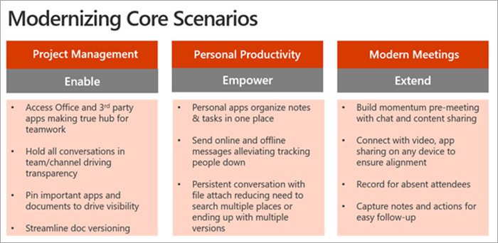
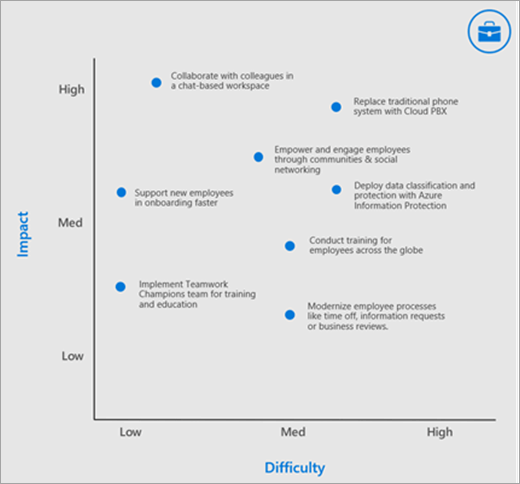

# Definire scenari di utilizzo per Microsoft TeamsDefine usage scenarios for Microsoft Teams

Verificare di aver compreso i progetti commerciali (scenari) che avranno l'ambito per questa fase dell'implementazione.Make sure that you understand the business projects (scenarios) that will be in scope for this phase of your implementation. Ecco l'elenco degli scenari di esempio che sono ottimi candidati per un programma Early Adopter.Take a look at this list of example scenarios that are great candidates for an early adopter program. È possibile iniziare a usare WINS semplici, ad esempio:You can get started with easy wins such as:

- Produttività personalePersonal productivity
- Gestione di progetti modernaModern project management
- Riunioni moderneModern meetings

Altri scenari da considerare sono:Additional scenarios to consider are:

- Impegno e comunicazione dei dipendentiEmployee engagement and communication
- Avvicinare le campagne al mercato più rapidamenteBring campaigns to market faster
- Aumentare la produttività delle vendite e incrementare i ricaviIncrease sales productivity and grow revenue
- Semplificare le revisioni aziendaliStreamline business reviews

Pensare a questo scenario di modernizzazione del movimento come processo cumulativo: ottenere le informazioni in scenari più semplici per creare entusiasmo, familiarità e credibilità con questo nuovo modo di lavorare.Think of this scenario modernization motion as a cumulative process – get things going with more basic scenarios to create enthusiasm, familiarity, and credibility with this new way of working. Passa quindi alle aree di impatto più ambiziose.Then move on to more ambitious areas of impact. Dato che più impatto con Microsoft teams è dimostrato per i colleghi aziendali, più di loro si immetteranno e lo slancio verrà creato.As more impact with Microsoft Teams is demonstrated to your business colleagues, more of them will get engaged and momentum will build. Per molti dei nostri clienti, una volta ottenuta questa procedura, scoprono che gli stakeholder aziendali li avvicinano dopo aver appreso come i loro colleghi hanno ottenuto un valore da Microsoft teams.For many of our customers, once they get this process going they find that business stakeholders approach them after learning how their colleagues got value from Microsoft Teams.

## Intervistare gli stakeholder aziendaliInterview business stakeholders

Per confermare la selezione di questi progetti iniziali, consigliamo la riunione direttamente con le parti interessate identificate in precedenza in questo processo.To confirm the selection of these early projects we recommend meeting directly with the stakeholders you identified earlier in this process. Il tuo obiettivo a questo punto è ascoltare e ottenere informazioni aggiuntive sulle loro attività.Your goal at this point is to listen and learn additional information about their business. Prendere in considerazione le domande seguenti per guidare la conversazione:Consider the following questions to drive the conversation:

- Quali sono le sfide dell'organizzazione o i punti di dolore correlati alla comunicazione e alla collaborazione?What are some of the organization’s challenges or pain points related to communication and collaboration?
- Quali sono le aree in cui si vuole migliorare l'organizzazione?What are the areas in which your organization would like to improve?
- Quali sono le iniziative strategiche dell'organizzazione o i progetti di trasformazione correnti che i team possono supportare?What are the organization’s strategic initiatives or current transformation projects that Teams can support?
- Quali metodi di comunicazione e collaborazione sono in genere meglio ricevuti dall'organizzazione rispetto ad altri?What methods of communication and collaboration are typically better received by your organization than others?
- Qual è la procedura per la stesura, la distribuzione e la condivisione di informazioni?What is the process for drafting, distributing, and sharing information?

## Mappare e assegnare priorità agli scenari aziendaliMap and prioritize business scenarios

Per avere la certezza di avere le informazioni giuste sullo scenario aziendale, è consigliabile usare il formato seguente per documentare lo scenario dalla prospettiva del dipendente che completa il lavoro e il proprietario aziendale del processo.To be sure that you have the right information about the business scenario, consider using the following format to document the scenario from the perspective of the employee completing the work and the business owner of the process. Entrambe le prospettive sono necessarie per creare un percorso efficace in avanti.Both perspectives are required to craft a successful path forward.

Dopo aver parlato con uno o più stakeholder aziendali, è possibile assegnare priorità agli scenari in base alla difficoltà Impact vs.After speaking to one or more business stakeholders you can prioritize your scenarios based on impact vs. difficulty. Gli scenari potrebbero essere oltre agli scenari suggeriti sopra. I candidati appropriati per la fase di sperimentazione dovrebbero avere un impatto maggiore e una difficoltà medio-bassa.(Your scenarios may be in addition to the scenarios we suggest above.) Appropriate candidates for your experimentation phase should have higher impact and low to medium difficulty. Ciò garantirà che il progetto non sia influenzato da inconvenienti di ambito o problemi tecnici prima di poter visualizzare il valore del lavoro.This will ensure your project isn't affected by scope creep or technical difficulties before you are able to show the value of your work. Di seguito è illustrato un grafico di esempio.An example chart is shown below.

> [!Note]
> Siamo sempre ansiosi di conoscere in che modo i nostri clienti usano i team in nuovi modi innovativi.We are always eager to learn about how our customers use Teams in new an innovative ways. Condividi i tuoi #TeamsStories con noi nel nostro forum di discussione sulle adozioni di guida.Share your #TeamsStories with us in our [Driving Adoption discussion forum]. Includi l'hashtag **#TeamsStories** nel post.Include the hashtag **#TeamsStories** in your post. Siamo sempre interessati a come si usano i team nell'organizzazione.We are always interested in how you use Teams in your organization.

 successivo: [onboard early adopters e raccogliere feedback](teams-adoption-onboard-early-adopters.md). Next: [Onboard early adopters and gather feedback](teams-adoption-onboard-early-adopters.md).
