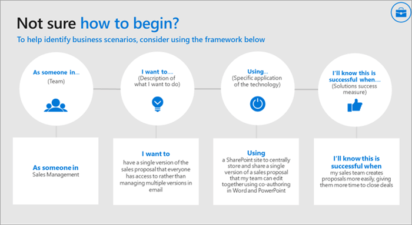

# Definire scenari di utilizzo per Microsoft Teams

Assicurarsi di comprendere i progetti commerciali (scenari) che si troveranno nell'ambito per questa fase dell'implementazione. Esaminare questo elenco di scenari di esempio che sono ottimi candidati per un programma early adopter. Puoi iniziare con vincite semplici, ad esempio:

- Produttività personale
- Gestione dei progetti moderna
- Riunioni moderne

Altri scenari da considerare sono:

- Coinvolgimento e comunicazione dei dipendenti
- Introdurre le campagne sul mercato più velocemente
- Aumentare la produttività delle vendite e aumentare i ricavi
- Semplificare le recensioni aziendali

Questo movimento di modernizzazione dello scenario può essere considerato come un processo cumulativo: questo nuovo modo di lavorare consente di creare entusiasmo, familiarità e credibilità. Poi passa a aree di impatto più ambiziose. Man mano che si dimostra un maggiore impatto con Microsoft Teams ai colleghi aziendali, più di loro saranno coinvolti e si otterrà un maggiore impulso. Per molti dei nostri clienti, una volta avviato questo processo, scopriranno che gli stakeholder si avvicinano a loro dopo aver scoperto come i loro colleghi hanno ottenuto valore da Microsoft Teams.

## Intervista agli stakeholder dell'azienda

Per confermare la selezione di questi primi progetti, è consigliabile incontrarsi direttamente con le parti interessate identificate in precedenza in questo processo. L'obiettivo a questo punto è quello di ascoltare e ottenere altre informazioni sulla propria attività. Prendere in considerazione le domande seguenti per guidare la conversazione:

- Quali sono le difficoltà o i problemi dell'organizzazione in relazione alla comunicazione e alla collaborazione?
- Quali sono le aree in cui l'organizzazione vuole migliorare?
- Quali sono le iniziative strategiche o gli attuali progetti di trasformazione dell'organizzazione che Teams può supportare?
- Quali metodi di comunicazione e collaborazione sono in genere meglio ricevuti dall'organizzazione rispetto ad altri?
- Qual è il processo di redazione, distribuzione e condivisione delle informazioni?

## Mappare e assegnare priorità agli scenari aziendali

Per assicurarsi di avere le informazioni corrette sullo scenario aziendale, è consigliabile usare il formato seguente per documentare lo scenario dal punto di vista del dipendente che completa il lavoro e del proprietario aziendale del processo. Entrambi i punti di vista sono necessari per compiere un percorso positivo.

Dopo aver parlato con uno o più stakeholder dell'azienda, è possibile assegnare priorità agli scenari in base all'impatto e alla difficoltà. Gli scenari potrebbero essere in aggiunta agli scenari suggeriti in precedenza. I candidati appropriati per la fase di sperimentazione devono avere un impatto maggiore e difficoltà da bassa a media. In questo modo, il progetto non sarà influenzato da difficoltà tecniche o di scorrimento dell'ambito prima di poter mostrare il valore del lavoro. Di seguito è riportato un grafico di esempio.

> [!Note]
> Siamo sempre ansiosi di scoprire come i nostri clienti usano Teams in nuovi modi innovativi. Condividi il tuo #TeamsStories con noi nel [forum di discussione Driving Adoption](https://techcommunity.microsoft.com/t5/driving-adoption/ct-p/DrivingAdoption). Includere **l'hashtag #TeamsStories** nel post. Siamo sempre interessati a come usi Teams nella tua organizzazione.

 Successivo: [Onboard early adopters e raccogliere feedback](teams-adoption-onboard-early-adopters.md).
