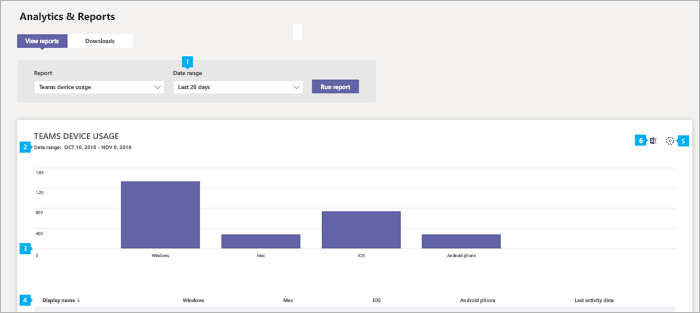

# Microsoft Teams utilizzo del dispositivo

Il report Teams utilizzo dei dispositivi nell'interfaccia Microsoft Teams di amministrazione fornisce informazioni su come gli utenti si connettono a Teams. È possibile usare il report per visualizzare i dispositivi usati all'interno dell'organizzazione, incluso il numero di Teams da dispositivi mobili quando si è in viaggio.  

## Visualizzare il report sull'utilizzo del dispositivo

1. Nel riquadro di spostamento sinistro dell'interfaccia Microsoft Teams di amministrazione fare clic su **Analisi & report**  >  **utilizzo**. Nella scheda **Visualizza report,** in **Report,** selezionare Teams **utilizzo del dispositivo.**
2. In **Intervallo di date** selezionare un intervallo e quindi fare clic su Esegui **report.**

    

## Interpretare il report

|Callout |Descrizione  |
|--------|-------------|
|**1**   |Il Teams di utilizzo dei dispositivi può essere visualizzato per le tendenze degli ultimi 7 o 30 giorni.  |
|**2**   |Ogni report ha una data in cui è stato generato il report. I report in genere riflettono una latenza di 24 ore dal momento dell'attività. |
|**3**   |<ul><li>L'asse X del grafico rappresenta i diversi dispositivi (**Windows**, **Mac**, **Linux**, **iOS**, **Android Telefono**, **Web**) usati per connettersi a Teams. </li><li>L'asse Y è il numero di utenti che usano il dispositivo nel periodo di tempo selezionato.</li> </ul>Passare il puntatore del mouse sulla barra che rappresenta un dispositivo per visualizzare il numero di utenti che usano il dispositivo per connettersi a Teams.|
|**4**   |La tabella fornisce una suddivisione dell'utilizzo del dispositivo per utente. <ul><li>**Nomeutente** è il nome visualizzato dell'utente. È possibile fare clic sul nome visualizzato per passare alla pagina delle impostazioni dell'utente nell'Microsoft Teams di amministrazione. </li><li>**Windows** selezionato se l'utente era attivo nel client desktop Teams in un computer Windows basato su Windows.</li><li>**Mac** è selezionato se l'utente era attivo nel client desktop Teams in un computer macOS. </li> <li>**Linux** è selezionato se l'utente era attivo nel client desktop Teams in un computer Linux. </li> <li>**iOS** è selezionato se l'utente era attivo nel client Teams per dispositivi mobili per iOS.</li><li>**Il telefono Android** è selezionato se l'utente era attivo nel client Teams mobile per Android. <li><li>**Web** è selezionato se l'utente era attivo nel client Teams Web. <li>**L'ultima attività** è l'ultima data (UTC) a cui l'utente ha partecipato a un'Teams attività.</li> </ul> Si noti che se un account utente non esiste più in Azure AD, il nome utente viene visualizzato come "--" nella tabella.   Per visualizzare le informazioni desiderate nella tabella, assicurarsi di aggiungere le colonne alla tabella. |
|**5**   |Selezionare **Modifica colonne** per aggiungere o rimuovere colonne nella tabella. |
|**6**   |È possibile esportare il report in un file CSV per l'analisi offline. Fare **clic su Esporta in Excel** e quindi nella scheda **Download** fare clic su **Scarica** per scaricare il report quando è pronto.  |

## Rendere anonimi i dati specifici dell'utente

Per rendere anonimi i Teams di utilizzo dei dispositivi, è necessario essere un amministratore globale. In questo modo si nasconderanno le informazioni identificabili, ad esempio il nome visualizzato, la posta elettronica e AAD ID utente nel report e la relativa esportazione.

1. In interfaccia di amministrazione di Microsoft 365 passare alla scheda  Impostazioni Org Impostazioni e nella scheda Servizi \> scegliere **Report.** 
    
2. Selezionare **Report** e quindi scegliere **Visualizza identificatori anonimi**. Questa impostazione viene applicata sia ai report di utilizzo in interfaccia di amministrazione di Microsoft 365 che all'Teams di amministrazione.
  
3. Selezionare **Salva modifiche**.

## Argomenti correlati

- [Analisi e creazione dei report di Teams](teams-reporting-reference.md).
