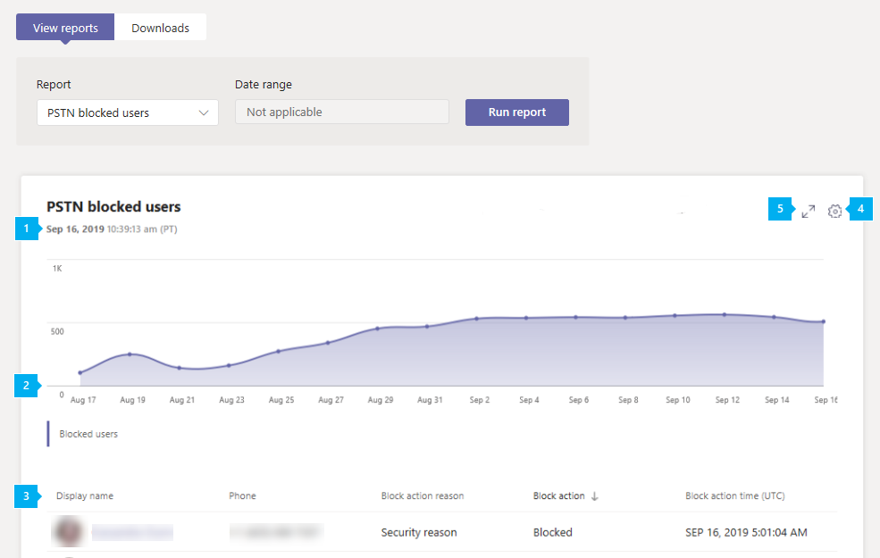

# Report utenti bloccati PSTN di Microsoft TeamsMicrosoft Teams PSTN blocked users report

Il report utenti bloccati PSTN nell'interfaccia di amministrazione di Microsoft teams Mostra gli utenti dell'organizzazione bloccati dall'esecuzione di chiamate PSTN in teams.The PSTN blocked users report in the Microsoft Teams admin center shows you the users in your organization who are blocked from making PSTN calls in Teams. È possibile visualizzare altre informazioni su ogni utente bloccato, incluso il numero di telefono assegnato e il motivo per cui sono stati bloccati dall'esecuzione delle chiamate.You can view more information about each blocked user, including their assigned phone number and the reason they were blocked from making calls.

## Visualizzare il report utenti bloccati PSTNView the PSTN blocked users report

Nella barra di spostamento sinistra dell'interfaccia di amministrazione di Microsoft teams fare clic su **analisi &** report  >  **sull'utilizzo** dei rapporti.In the left navigation of the Microsoft Teams admin center, click **Analytics & reports** > **Usage reports**. Nella scheda **Visualizza report** , in **report**, selezionare **utenti bloccati PSTN** e quindi fare clic su **Esegui report**.On the **View reports** tab, under **Report**, select **PSTN blocked users**, and then click **Run report**.

## Interpretare il reportInterpret the report

|CalloutCallout |DescrizioneDescription  |
|--------|-------------|
|**1****1**   |Ogni report ha una data per quando è stata generata.Each report has a date for when it was generated. In genere, i report presentano una latenza di 24-48 ore dal momento dell'attività.The reports usually reflect a 24 to 48 hour latency from time of activity. |
|**2****2**   |L'asse X è la data.The X axis is the date. L'asse Y è il numero di utenti.The Y axis is the number of users.  Posizionare il puntatore del mouse sul punto in una data specificata per visualizzare il numero di utenti bloccati in tale data.Hover over the dot on a given date to see the number of users blocked on that date. |
|**3****3**   |La tabella fornisce una ripartizione di tutti gli utenti bloccati dall'esecuzione di chiamate PSTN.The table gives a breakdown of all users who are blocked from making PSTN calls.  Mostra tutti gli utenti con sistema telefonico o servizi di audioconferenza assegnati e fornisce altre informazioni su ogni utente.It shows all users who have Phone System or Audio Conferencing assigned and gives you more information about each user. <ul><li>**Nome visualizzato** è il nome visualizzato dell'utente.**Display name** is the display name of the user. È possibile fare clic sul nome visualizzato per accedere alla pagina di impostazione dell'utente nell'interfaccia di amministrazione di Microsoft teams.You can click the display name to go to the user's setting page in the Microsoft Teams admin center. </li> <li>**Telefono** è il numero assegnato all'utente.**Phone** is the number that's assigned to the user.</li> <li>Il **motivo bloccato** è il motivo per cui l'utente è bloccato dall'esecuzione delle chiamate.**Blocked reason** is the reason the user is blocked from making calls.</li><li>L' **azione bloccata** indica se l'utente è bloccato o sbloccato dall'esecuzione di chiamate PSTN in teams.**Blocked action**  tells you whether the user is blocked or unblocked from making PSTN calls in Teams.</li> <li>**Ora bloccata** è la data e l'ora (UTC) in cui l'utente è stato bloccato per effettuare chiamate.**Blocked time** is the date and time (UTC) that the user was blocked from making calls.</li></li> </ul>Per visualizzare le informazioni desiderate nella tabella, assicurarsi di aggiungere le colonne alla tabella.To see the information that you want in the table, make sure to add the columns to the table. |
|**4****4**   |Selezionare **modifica colonne** per aggiungere o rimuovere colonne nella tabella.Select **Edit columns** to add or remove columns in the table.|
|**5****5**   |Selezionare **schermo intero** per visualizzare il report in modalità schermo intero.Select **Full screen** to view the report in full screen mode.|

## Argomenti correlatiRelated topics

- [Analisi e creazione di report in teamsTeams analytics and reporting](teams-reporting-reference.md)