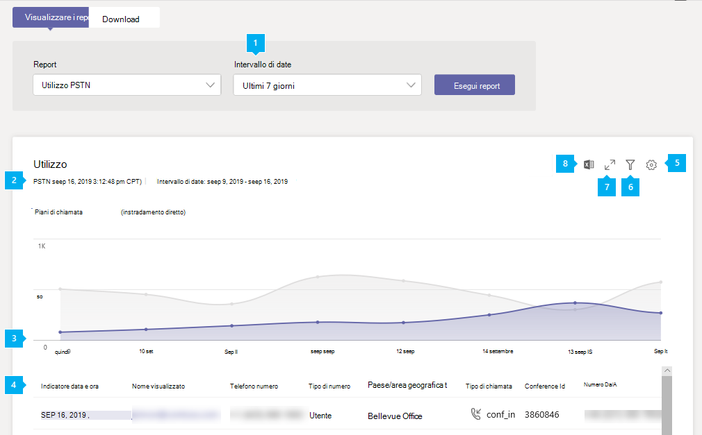
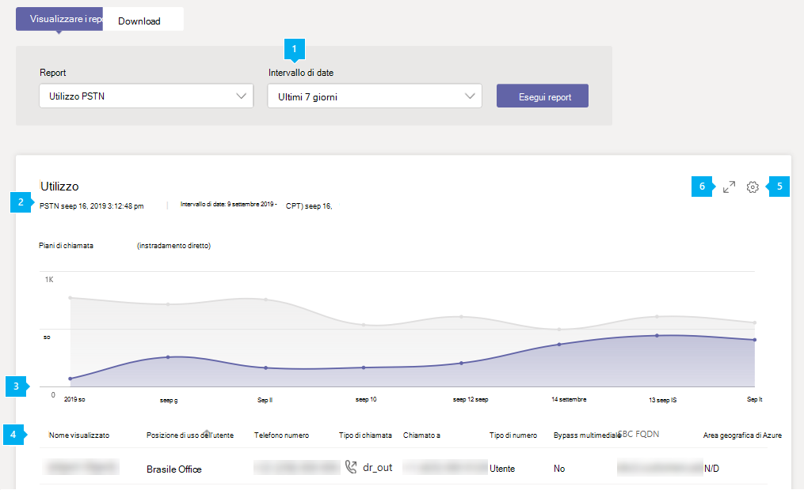

# Report utilizzo PSTN di Microsoft Teams

Il report utilizzo PSTN teams nell'interfaccia di amministrazione di Microsoft teams offre una panoramica delle attività di audioconferenza e delle chiamate nell'organizzazione. È possibile visualizzare un'attività di chiamata dettagliata per i piani di chiamata se si usa Microsoft come gestore di telefonia e per il routing diretto se si usa il proprio gestore di telefonia.

La scheda **piani di chiamata** Mostra le informazioni che includono il numero di minuti che gli utenti hanno trascorso nelle chiamate PSTN in ingresso e in uscita e il costo di queste chiamate. La scheda **routing diretto** Mostra le informazioni che includono l'indirizzo SIP e l'ora di inizio e di fine delle chiamate. Usare le informazioni contenute in questo report per scoprire l'uso della rete PSTN nell'organizzazione e consentire l'analisi, pianificare e prendere decisioni aziendali.

## Visualizzare il report

1. Nella barra di spostamento sinistra dell'interfaccia di amministrazione di Microsoft teams fare clic su **analisi &** > report**sull'utilizzo**dei rapporti. Nella scheda **Visualizza report** , in **report**, selezionare **report sull'utilizzo PSTN**.
2. In **intervallo di date**selezionare un intervallo predefinito di 7 o 28 giorni oppure impostare un intervallo personalizzato e quindi selezionare **Esegui report**.

## Interpretare il report

### Piani di chiamata

|Callout |Descrizione  |
|--------|-------------|
|**1**   |Il report può essere visualizzato per le tendenze degli ultimi 7 giorni, 28 giorni o un intervallo di date personalizzato impostato |
|**2**   |Ogni report ha una data per quando è stata generata. In genere, i report presentano una latenza di 24-48 ore dal momento dell'attività. |
|**3**   |L'asse X è l'intervallo di date selezionato per il report specifico. L'asse Y è il numero totale di chiamate nel periodo di tempo selezionato.  Posizionare il puntatore del mouse sul punto in una data specificata per visualizzare le chiamate totali in tale data.  |
|**4**   |La tabella offre una ripartizione dell'utilizzo PSTN per chiamata. <ul><li>**Data/ora (UTC)** è l'ora in cui è stata avviata la chiamata.</li><li>**Nome visualizzato** è il nome visualizzato dell'utente. È possibile fare clic sul nome visualizzato per accedere alla pagina di impostazione dell'utente nell'interfaccia di amministrazione di Microsoft teams.</li><li>**Username** è il nome di accesso dell'utente.</li><li>**Numero di telefono** è il numero che ha ricevuto la chiamata per le chiamate in ingresso o il numero composto per le chiamate in uscita.</li><li>**Tipo di chiamata** indica se la chiamata è stata chiamata in uscita PSTN o in ingresso e il tipo di chiamata, ad esempio una chiamata effettuata da un utente o da una conferenza audio. I tipi di chiamate che potrebbero essere visualizzati includono:  **Tipi di chiamata utente Teams**<ul><li>**user_in** -l'utente ha ricevuto una chiamata PSTN in ingresso.</li><li>**user_out** -l'utente ha effettuato una chiamata PSTN in uscita</li><li>**user_out_conf** -l'utente ha aggiunto due o più partecipanti PSTN alla chiamata, ad esempio una conferenza telefonica a tre vie</li><li>**user_out_transfer** -l'utente ha trasferito la chiamata a un numero PSTN</li><li>**user_out_forwarding** -l'utente ha inoltrato la chiamata a un numero PSTN</li><li>**conf_in** -una chiamata in entrata per il Bridge di audioconferenza</li><li>**conf_out** -una chiamata in uscita dal Bridge di audioconferenza in genere per aggiungere un numero PSTN alla conferenza</li></ul> **Tipi di chiamata di bots Teams**<ul><li>**ucap_in** -una chiamata PSTN in ingresso a teams bot come operatore automatico o coda di chiamata</li><li>**ucap_out** : chiamata PSTN in uscita da un bot di teams come operatore automatico o coda di chiamata</li></ul> <li>**Chiamata a** è il numero composto.</li><li>**Per paese o area geografica** è il paese o l'area geografica chiamata.</li><li>Called **from** è il numero che ha posto la chiamata.</li><li>**Da paese o area geografica** è il paese o l'area geografica in cui è stata inserita la chiamata.</li><li>**Addebito** è la quantità di denaro o il costo della chiamata addebitata al tuo account. </li><li>**Valuta** è il tipo di valuta usato per calcolare il costo della chiamata. </li><li>**Durata** è il tempo per cui resta connessa la chiamata.</li><li>**Nazionale/internazionale** indica se la chiamata è stata domestica (all'interno di un paese o area geografica) o internazionale (all'esterno di un paese o area geografica) in base alla posizione dell'utente.</li><li>**ID chiamata** è l'ID della chiamata. È un identificatore univoco per la chiamata che puoi usare per chiamare il supporto tecnico Microsoft.</li><li>**Tipo di numero** è il tipo di numero di telefono dell'utente, ad esempio un servizio di numero verde. </li><li>**Paese o area geografica** è la posizione di utilizzo. </li> <li>**ID conferenza** è l'ID conferenza della conferenza audio. </li><li>**Capacità** è la licenza usata per la chiamata. I tipi di licenza che si possono vedere includono:<ul><li>**MCOPSTNPP** -Credits comunicazioni</li><li>**MCOPSTN1** -piano per chiamate nazionali (3000 min US/1200 min eu plans)</li><li>**MCOPSTN2** -piano per chiamate internazionali</li><li>**MCOPSTN5** -piano per chiamate nazionali (piano per chiamate 120 min)</li><li>**MCOPSTN6** -piano per chiamate nazionali (piano per chiamate 240 min)</li><li>**MCOMEETADD** -audioconferenza</li><li>**MCOMEETACPEA** -pay per minute audioconferenza</li></ul></li></ul> Per visualizzare le informazioni desiderate nella tabella, assicurarsi di aggiungere le colonne alla tabella.|
|**5**   |Selezionare **modifica colonne** per aggiungere o rimuovere colonne nella tabella. |
|**6**   |Selezionare **filtro** per filtrare il report per nome utente o tipo di chiamata |
|**7**   |Selezionare **schermo intero** per visualizzare il report in modalità schermo intero. |
|**8**   |È possibile esportare il report in un file CSV per l'analisi offline. Fare clic su **Esporta in Excel**, quindi nella scheda **download** fare clic su **Scarica** per scaricare il report quando è pronto.|

### Routing diretto

|Callout |Descrizione  |
|--------|-------------|
|**1**   |Il report può essere visualizzato per le tendenze degli ultimi 7 giorni o 28 giorni. |
|**2**   |Ogni report ha una data per quando è stata generata. In genere, i report presentano una latenza di 24-48 ore dal momento dell'attività. |
|**3**   |L'asse X è l'intervallo di date selezionato per il report specifico. L'asse Y è il numero totale di chiamate nel periodo di tempo selezionato. Posizionare il puntatore del mouse sul punto in una data specificata per visualizzare le chiamate totali in tale data.  |
|**4**   |La tabella offre una ripartizione dell'utilizzo PSTN per chiamata. <ul><li>**Data/ora (UTC)** è l'ora in cui è stata avviata la chiamata.</li><li>**Nome visualizzato** è il nome visualizzato dell'utente. È possibile fare clic sul nome visualizzato per accedere alla pagina di impostazione dell'utente nell'interfaccia di amministrazione di Microsoft teams.</li><li>**Indirizzo SIP** è l'indirizzo SIP dell'utente che ha ricevuto o eseguito la chiamata.</li><li>**Numero di telefono** è il numero dell'utente che ha eseguito la chiamata. </li><li>**Tipo di chiamata** indica se la chiamata è stata chiamata in uscita PSTN o in ingresso e il tipo di chiamata, ad esempio una chiamata effettuata da un utente o da una conferenza audio. I tipi di chiamate che potrebbero essere visualizzati includono:  **Tipi di chiamata utente Teams**<ul><li>**dr_in** -l'utente ha ricevuto una chiamata PSTN in ingresso</li><li>**dr_out** -l'utente ha effettuato una chiamata PSTN in uscita</li><li>**dr_out_user_conf** -l'utente ha aggiunto un partecipante PSTN alla chiamata</li><li>**user_out_transfer** -l'utente ha trasferito la chiamata a un numero PSTN</li><li>**dr_out_user_forwarding** -l'utente ha inoltrato la chiamata a un numero PSTN</li><li>**dr_out_user_transfer** -l'utente ha trasferito la chiamata a un numero PSTN</li><li>**dr_emergency_out** -l'utente effettua una chiamata di emergenza</li></ul> **Tipi di chiamata di bots Teams**<ul><li>**dr_in_ucap** : chiamata PSTN in ingresso a un bot di teams come operatore automatico o coda di chiamata</li><li>**dr_out_ucap** : chiamata PSTN in uscita da un bot di teams come operatore automatico o coda di chiamata</li></ul> <li>**Chiamata a** è il numero dell'utente che ha ricevuto la chiamata.</li><li>**Ora di inizio (UTC)** è il momento in cui la chiamata è connessa.</li><li>L' **ora di invito (UTC)** è l'ora in cui è stata avviata la chiamata.</li><li>**Ora di errore (UTC)** è il momento in cui la chiamata non è riuscita. (Solo per le chiamate non riuscite)</li><li>**Ora di fine (UTC)** è il momento in cui la chiamata è terminata. (Solo per le chiamate con esito positivo)</li><li>**Durata** è il tempo per cui resta connessa la chiamata.</li><li>**Tipo di numero** è il tipo di numero di telefono dell'utente, ad esempio un servizio di numero verde. </li><li>Il **bypass multimediale** indica se il trunk è stato abilitato per il bypass multimediale </li> <li>L' **FQDN di SBC** è il nome di dominio completo (FQDN) di Session Border Controller (SBC). </li><li>L' **area di Azure** è il Data Center usato per la segnalazione.</li><li>**Tipo di evento** è il tipo di evento per la chiamata. Verrà visualizzato l'esito positivo per le chiamate e il tentativo di chiamate non riuscite. </li><li>Il **codice SIP finale** è il codice con cui è terminata la chiamata.</li><li>Il **sottocodice Microsoft finale** è un codice che indica azioni specifiche che si sono verificate.</li><li>La **frase finale SIP** è la descrizione del codice SIP e del sottocodice Microsoft.</li><li>L' **ID di coorelzione** è un identificatore univoco per la chiamata che puoi usare per chiamare il supporto tecnico Microsoft.</li></ul> Per visualizzare le informazioni desiderate nella tabella, assicurarsi di aggiungere le colonne alla tabella.|
|**5**   |Selezionare **modifica colonne** per aggiungere o rimuovere colonne nella tabella. |
|**6**   |Selezionare **schermo intero** per visualizzare il report in modalità schermo intero. |

## Argomenti correlati

- [Analisi e creazione di report in teams](teams-reporting-reference.md)