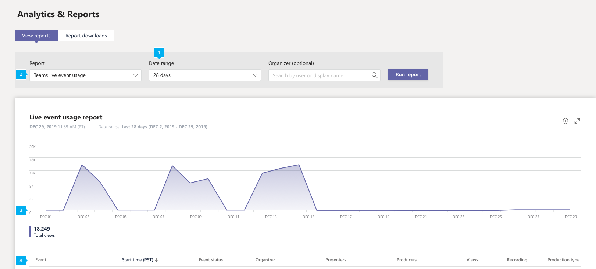
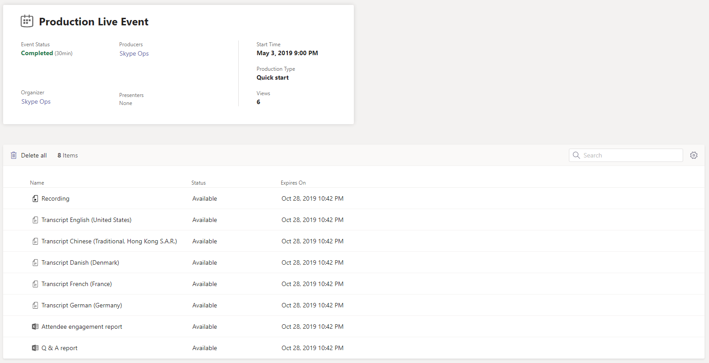

# Report sull'utilizzo degli eventi di Microsoft teams LiveMicrosoft Teams live event usage report

Il report utilizzo eventi di teams Live nell'interfaccia di amministrazione di Microsoft teams Mostra la panoramica delle attività per gli eventi dinamici nell'organizzazione.The Teams live event usage report in the Microsoft Teams admin center shows you the activity overview for live events held in your organization. È possibile visualizzare le informazioni sull'utilizzo, inclusi lo stato dell'evento, l'ora di inizio, le visualizzazioni e il tipo di produzione per ogni evento.You can view usage information, including event status, start time, views, and production type for each event. Puoi ottenere informazioni sulle tendenze di utilizzo e vedere chi nell'organizzazione pianifica, presenta e produce eventi dinamici.You can gain insight into usage trends and see who in your organization schedules, presents, and produces live events. 

Screenshot ![del report sull'utilizzo dell'evento teams Live nell'] interfaccia di amministrazione di Microsoft Teams Screenshot (../media/teams-live-event-usage-report.png "del report utilizzo teams nell'interfaccia di amministrazione")

## Visualizzare il reportView the report

1. Nella barra di spostamento sinistra dell'interfaccia di amministrazione di Microsoft teams, fare clic su **analisi & report**e quindi in **report**Selezionare **utilizzo eventi live**di teams.In the left navigation of the Microsoft Teams admin center, click **Analytics & reports**, and then under **Report**, select **Teams live event usage**.
2. In **intervallo di date**selezionare un intervallo predefinito o impostare un intervallo personalizzato.Under **Date range**, select a predefined range or set a custom range. È possibile impostare un intervallo in cui visualizzare i dati fino a un anno, sei mesi prima e dopo la data corrente.You can set a range to show  data up to a year, six months before and after the current date.
3. Opzionale In **Organizer**puoi scegliere di visualizzare solo gli eventi dinamici organizzati da un utente specifico.(Optional) Under **Organizer**, you can choose to show only live events organized by a specific user.
4. Fare clic su **Esegui report**.Click **Run report**.  

## Interpretare il reportInterpret the report

Screenshot ![del report sull'utilizzo dell'evento teams Live nell'] interfaccia di amministrazione di Microsoft Teams Screenshot (../media/teams-live-event-usage-report-with-callouts.png "del report sull'utilizzo di teams Live Events nell'interfaccia di amministrazione con callout numerati")

|CalloutCallout |DescrizioneDescription  |
|--------|-------------|
|**1****1**   |Il report dell'evento teams Live può essere visualizzato per le tendenze degli ultimi 7 giorni, 28 giorni o un intervallo di date personalizzato impostato.The Teams live event report can be viewed for trends over the last 7 days, 28 days, or a custom date range that you set. |
|**2****2**   |Ogni report ha una data per quando è stata generata.Each report has a date for when it was generated. Il report riflette l'attività in tempo reale quando la pagina viene aggiornata.The report reflects near real time activity when the page is refreshed. |
|**3****3**   |<ul><li>L'asse X nel grafico è l'intervallo di date selezionato per il report.The X axis on the chart is the selected date range for the report.</li> <li> L'asse Y è il numero totale di visualizzazioni.The Y axis is the total view count.</li> </ul>Posizionare il puntatore del mouse sul punto in una data specifica per visualizzare il numero di visualizzazioni in tutti gli eventi dinamici in tale data.Hover over the dot on a given date to see the number of views across all live events on that date.|
|**4****4**   |La tabella offre una ripartizione di ogni evento dinamico.The table gives you a breakdown of each live event. <ul><li>L' **evento** è il nome visualizzato dell'evento Live.**Event** is the display name of the live event. Fare clic sul nome dell'evento per [ottenere maggiori dettagli](#view-event-details) sull'evento.Click the the event name to [get more details](#view-event-details) about the event. </li> <li>L' **ora di inizio** si riferisce alla data e all'ora di inizio dell'evento.**Start Time** refers to the start date and time of the event.</li> <li>**Lo stato dell'evento** indica se l'evento è avvenuto.**Event Status** shows whether the event has taken place.  </li><li>**Organizer** è il nome dell'organizzatore di eventi.**Organizer** is the name of the event organizer.</li> <li>\*\*\*\* I relatori sono i nomi dei relatori dell'evento.**Presenters** are the names of the  event presenters.</li><li>I **produttori** sono i nomi dei produttori di eventi.**Producers** are the names of the event producers.</li><li>**Visualizzazioni** è il numero di visualizzazioni univoche.**Views** is the number of unique views.</li><li>La **registrazione** Mostra se l'impostazione di registrazione è attivata o disattivata.**Recording** shows whether the recording setting is on or off.</li><li>Il **tipo di produzione** indica se l'evento viene prodotto in teams o da un'applicazione o da un dispositivo esterno.**Production Type** shows whether the event is produced in Teams or by an external application or device.</li></li> </ul>Tieni presente che se un account utente non esiste più in Azure AD, il nome utente viene visualizzato come "--" nella tabella.Note that if a user account no longer exists in Azure AD, the user name is displayed as "--" in the table.   Per visualizzare le informazioni desiderate nella tabella, assicurarsi di aggiungere le colonne alla tabella.To see the information that you want in the table, make sure to add the columns to the table. |
|**5****5**   |Selezionare **modifica colonne** per aggiungere o rimuovere colonne nella tabella.Select **Edit columns** to add or remove columns in the table.|

## Visualizzare i dettagli dell'eventoView event details

La pagina Dettagli evento dinamico offre un riepilogo dei dettagli di un evento dinamico ed elenca tutti i file, inclusi trascrizioni e registrazioni, associati all'evento.The live event details page gives you a summary of the details of a live event and lists all the files, including transcripts and recordings, associated with the event. Fare clic sul nome di un file per visualizzare o scaricare il file.Click a file name to view or download the file.

Se l'organizzazione è abilitata per [hive](https://www.hivestreaming.com/partners/integration-partners/microsoft/) ECDN o [Kollective](https://kollective.com) eCDN, è possibile ottenere ulteriori analisi dei partecipanti facendo clic sul collegamento rapporto partner.If your organization is enabled for [Hive](https://www.hivestreaming.com/partners/integration-partners/microsoft/) eCDN or [Kollective](https://kollective.com) eCDN, you can get additional attendee analytics by clicking the partner report link.

## Argomenti correlatiRelated topics
- [Analisi e creazione di report in teamsTeams analytics and reporting](teams-reporting-reference.md)
- [Cosa sono gli eventi teams Live?What are Teams live events?](../teams-live-events/what-are-teams-live-events.md)