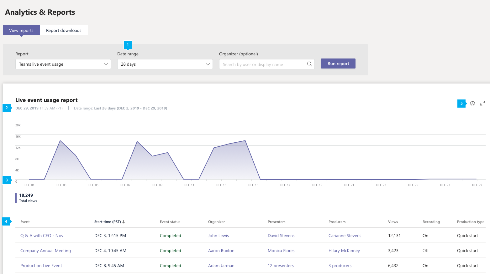

# Report sull'utilizzo degli eventi di Microsoft teams Live

Il report utilizzo eventi di teams Live nell'interfaccia di amministrazione di Microsoft teams Mostra la panoramica delle attività per gli eventi dinamici nell'organizzazione. È possibile visualizzare le informazioni sull'utilizzo, inclusi lo stato dell'evento, l'ora di inizio, le visualizzazioni e il tipo di produzione per ogni evento. Puoi ottenere informazioni sulle tendenze di utilizzo e vedere chi nell'organizzazione pianifica, presenta e produce eventi dinamici.

## Visualizzare il report

1. Nella barra di spostamento sinistra dell'interfaccia di amministrazione di Microsoft teams fare clic su **analisi &** > report**sull'utilizzo**dei rapporti. Nella scheda **Visualizza report** , in **report**, selezionare **utilizzo eventi teams Live**.
2. In **intervallo di date**selezionare un intervallo predefinito o impostare un intervallo personalizzato. È possibile impostare un intervallo in cui visualizzare i dati fino a un anno, sei mesi prima e dopo la data corrente.
3. Opzionale In **Organizer**puoi scegliere di visualizzare solo gli eventi dinamici organizzati da un utente specifico.
4. Fare clic su **Esegui report**.  

    

## Interpretare il report

|Callout |Descrizione  |
|--------|-------------|
|**1**   |Il report dell'evento teams Live può essere visualizzato per le tendenze degli ultimi 7 giorni, 28 giorni o un intervallo di date personalizzato impostato. |
|**2**   |Ogni report ha una data per quando è stata generata. Il report riflette l'attività in tempo reale quando la pagina viene aggiornata. |
|**3**   |<ul><li>L'asse X nel grafico è l'intervallo di date selezionato per il report.</li> <li> L'asse Y è il numero totale di visualizzazioni.</li> </ul>Posizionare il puntatore del mouse sul punto in una data specifica per visualizzare il numero di visualizzazioni in tutti gli eventi dinamici in tale data.|
|**4**   |La tabella offre una ripartizione di ogni evento dinamico. <ul><li>L' **evento** è il nome visualizzato dell'evento Live. Fare clic sul nome dell'evento per [ottenere maggiori dettagli](#view-event-details) sull'evento. </li> <li>L' **ora di inizio** si riferisce alla data e all'ora di inizio dell'evento.</li> <li>**Lo stato dell'evento** indica se l'evento è avvenuto.  </li><li>**Organizer** è il nome dell'organizzatore di eventi.</li> <li>I **relatori** sono i nomi dei relatori dell'evento.</li><li>I **produttori** sono i nomi dei produttori di eventi.</li><li>**Visualizzazioni** è il numero di visualizzazioni univoche.</li><li>La **registrazione** Mostra se l'impostazione di registrazione è attivata o disattivata.</li><li>Il **tipo di produzione** indica se l'evento viene prodotto in teams o da un'applicazione o da un dispositivo esterno.</li></li> </ul>Tieni presente che se un account utente non esiste più in Azure AD, il nome utente viene visualizzato come "--" nella tabella.   Per visualizzare le informazioni desiderate nella tabella, assicurarsi di aggiungere le colonne alla tabella. |
|**5**   |Selezionare **modifica colonne** per aggiungere o rimuovere colonne nella tabella.|

## Visualizzare i dettagli dell'evento

La pagina Dettagli evento dinamico offre un riepilogo dei dettagli di un evento dinamico ed elenca tutti i file, inclusi trascrizioni e registrazioni, associati all'evento. Fare clic sul nome di un file per visualizzare o scaricare il file.

Se l'organizzazione è abilitata per [hive](https://www.hivestreaming.com/partners/integration-partners/microsoft/) ECDN o [Kollective](https://kollective.com) eCDN, è possibile ottenere ulteriori analisi dei partecipanti facendo clic sul collegamento rapporto partner.

## Argomenti correlati

- [Analisi e creazione di report in teams](teams-reporting-reference.md)
- [Cosa sono gli eventi live di Teams?](../teams-live-events/what-are-teams-live-events.md)