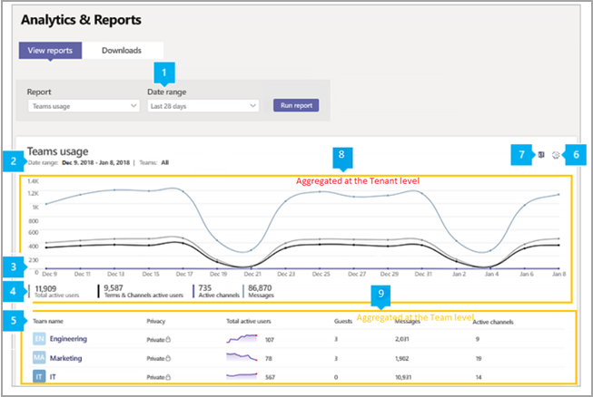

# Microsoft Teams utilizzo

Il report sull'utilizzo di Teams nell'interfaccia di amministrazione di Microsoft Teams offre una panoramica dell'attività di utilizzo in Teams, incluso il numero di utenti e canali attivi, in modo da vedere rapidamente quanti utenti dell'organizzazione usano Teams per comunicare e collaborare. È possibile visualizzare le informazioni sull'utilizzo per i team, tra cui il numero di utenti e canali attivi, guest e messaggi in ogni team.

## Visualizzare il report sull'utilizzo

1. Nel riquadro di spostamento sinistro dell'interfaccia Microsoft Teams di amministrazione fare clic su Analisi & **report**  >  **utilizzo**. Nella scheda **Visualizza report,** in **Report,** selezionare Teams **utilizzo.**
2. In **Intervallo di date** selezionare un intervallo e quindi fare clic su Esegui **report.**

    

## Interpretare il report

|Callout |Descrizione  |
|--------|-------------|
|**1**   |Il Teams attività di utilizzo può essere visualizzato per le tendenze degli ultimi 7, 30 o 90 giorni. |
|**2**   |Ogni report riporta la data in cui è stato generato. In genere, i report presentano una latenza di 24-48 ore dal momento dell'attività. |
|**3**   |<ul><li>L'asse X del grafico è l'intervallo di date selezionato per il report.</li> <li> L'asse Y è il conteggio degli elementi attivi o delle attività.</li> </ul>Posizionare il puntatore del mouse sul punto che rappresenta un elemento o un'attività in una data specifica per visualizzare il numero di istanze dell'elemento o dell'attività in tale data.|
|**4**   |È possibile filtrare gli elementi visualizzati nel grafico facendo clic su un elemento nella legenda. Ad esempio, **fare** clic su Totale utenti attivi ,  Teams & canali utenti **attivi**, Canali **attivi** o Messaggi per visualizzare solo le informazioni correlate a ognuno di essi. La modifica di questa selezione non modifica le informazioni nella tabella. |
|**5**   |La tabella fornisce una suddivisione dell'utilizzo in base al team. <ul><li>**Il nome del** team è il nome visualizzato del team. È possibile fare clic sul nome del team per passare alla pagina delle impostazioni del team nell'Microsoft Teams di amministrazione. </li> <li>**Per privacy** si intende se il team è un team privato o un team pubblico.</li> <li>**Utenti attivi** è il numero di utenti attivi nel team nel periodo di tempo specificato.</li><li>**Guest** è il numero di guest nel team nel periodo di tempo specificato.</li> <li>**Canali attivi** è il numero di canali che hanno almeno un utente attivo nel periodo di tempo specificato.</li> <li>**Pubblica messaggi** è il numero di tutti i messaggi dei post nei canali nel periodo di tempo specificato.</li> <li>**Messaggi di** risposta è il numero di tutti i messaggi di risposta nei canali nel periodo di tempo specificato.</li> <li>**Riunioni organizzate** è il numero di riunioni pianificate e ad hoc organizzate da un utente durante il periodo di tempo specificato. </li><li>**Messaggi urgenti** è il numero di tutti i messaggi urgenti nel periodo di tempo specificato.</li><li>**Reazioni** è il numero di tutte le reazioni ai messaggi nel periodo di tempo specificato.</li><li>**Menzioni** è il numero di tutte le menzioni usate nei messaggi nel periodo di tempo specificato.</li><li>**Messaggi del** canale è il numero di messaggi univoci che gli utenti del team hanno pubblicato in una chat del team durante il periodo di tempo specificato.</li> </li> </ul>Si noti che se un account utente non esiste più in Azure AD, il nome utente viene visualizzato come "--" nella tabella.   Per visualizzare le informazioni desiderate nella tabella, assicurarsi di aggiungere le colonne alla tabella. |
|**6**   |Selezionare **Modifica colonne** per aggiungere o rimuovere colonne nella tabella.|
|**7**   |È possibile esportare il report in un file CSV per l'analisi offline. Fare **clic su Esporta Excel** e quindi nella scheda **Download** fare clic su **Scarica** per scaricare il report quando è pronto.  |
|**8** |I punti dati della serie temporale nel grafico mostrano metriche di utilizzo diverse aggregate nel tenant|
|**9** |I dati tabulari rappresentavano metriche di utilizzo diverse aggregate per ogni team|

[!INCLUDE [teams-reports-definitions](../includes/teams-reports-definitions.md)]

## Argomenti correlati

- [Analisi e creazione dei report di Teams](teams-reporting-reference.md).
