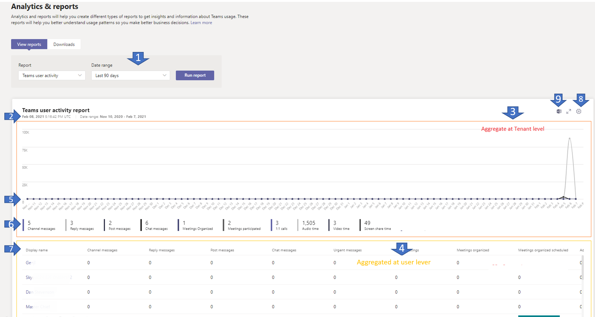

# Microsoft Teams attività utente

Il report Teams attività degli utenti offre informazioni approfondite sui tipi di attività che gli utenti dell'organizzazione ese in Teams. È possibile vedere quanti utenti comunicano in modo non pianificato tramite riunioni non pianificate (1:1 e chiamate di gruppo). Vedere quante riunioni un Teams ha organizzato e le riunioni a cui un Teams ha partecipato. Visualizza i dettagli sui minuti dello schermo, video e audio e le statistiche sulle comunicazioni chat, ad esempio il numero di utenti che rispondono e pubblicano messaggi del canale e il numero di utenti che si impegnano in messaggi di chat 1:1 o di gruppo.

> [!NOTE]
> La possibilità di pianificare un report attività utente non è al momento disponibile.

## Visualizzare il report attività utente

Per apportare queste modifiche, è necessario essere un amministratore del servizio Teams. Vedere [Usare i ruoli di amministratore di Teams per gestire Teams](../using-admin-roles.md) per informazioni su come ottenere ruoli e autorizzazioni di amministratore.

1. Nel riquadro di spostamento sinistro dell'interfaccia Microsoft Teams di amministrazione selezionare **Analisi & report**  >  **sull'utilizzo**. Nella scheda **Visualizza report,** in **Report,** selezionare Teams **utente.**
2. In **Intervallo di date** selezionare un intervallo e quindi selezionare Esegui **report.**

    

## Interpretare il report

| Callout |Descrizione  |
|--------|-------------|
|**1**   |Il Teams attività degli utenti può essere visualizzato per le tendenze degli ultimi 7, 30 o 90 giorni. |
|**2**   |Ogni report riporta la data in cui è stato generato. I report in genere riflettono una latenza di 24 ore dal momento dell'attività. |
|**3**   |I punti dati della serie temporale nel grafico mostrano metriche di utilizzo diverse aggregate nel tenant. |
|**4**   |I dati tabulari rappresentavano metriche di utilizzo diverse aggregate per utente. |
|**5**   |<ul><li>L'asse X del grafico è l'intervallo di date selezionato per il report.</li> <li> L'asse Y è il conteggio degli elementi attivi o delle attività.</li> </ul>Posizionare il puntatore del mouse sul punto che rappresenta un elemento o un'attività in una data specifica per visualizzare il numero di istanze dell'elemento o dell'attività in tale data.|
|**6**   | Ognuna delle metriche rappresentate nel grafico a livello di tenant. Filtrare gli elementi visualizzati nel grafico selezionando un elemento nella legenda. Selezionare **Messaggi del canale,** **Rispondi** ai messaggi,  **Messaggi chat** o Riunioni **organizzate** per visualizzare le informazioni correlate a ognuno di essi. La modifica di questa selezione non modifica le informazioni nella tabella. |
|**7**   |La tabella fornisce una suddivisione dell'utilizzo in base all'utente.   <ul><li>**Nome visualizzato** è il nome visualizzato dell'utente. Selezionare il nome visualizzato per passare alla pagina dei dettagli utente nell'Microsoft Teams di amministrazione.</li><li>**Messaggi del** canale è il numero di messaggi univoci che l'utente ha pubblicato in un canale del team durante il periodo di tempo specificato.</li><li>**Messaggi di risposta** è il numero di messaggi di risposta univoci che l'utente ha pubblicato in un canale del team durante il periodo di tempo specificato.</li> <li>**Pubblica messaggi** è il numero di messaggi di post univoci che l'utente ha pubblicato in un canale del team durante il periodo di tempo specificato.</li><li>**Messaggi chat** è il numero di messaggi univoci che l'utente ha pubblicato in una chat privata durante il periodo di tempo specificato.</li><li>**Messaggi urgenti** è il numero di messaggi urgenti che l'utente ha pubblicato in una chat durante il periodo di tempo specificato.</li><li>**Totale riunioni organizzate** è la somma di una riunione pianificata, ricorrente, non pianificata e <em>non</em> classificata organizzata da un utente durante il periodo di tempo specificato.</li><li>**Riunioni organizzate una sola volta** è il numero di riunioni pianificate una sola volta organizzate da un utente durante il periodo di tempo specificato.</li><li>**Riunioni organizzate ricorrenti pianificate** è il numero di riunioni ricorrenti organizzate da un utente durante il periodo di tempo specificato.</li><li>**Riunioni organizzate adhoc** è il numero di riunioni non pianificate organizzate da un utente durante il periodo di tempo specificato.</li><li>**Totale riunioni partecipate** è la somma delle riunioni programmate, ricorrenti, non pianificate e <em>non</em> classificate a cui un utente ha partecipato durante il periodo di tempo specificato.</li><li>**Riunioni partecipate programmate una sola** volta è il numero di riunioni programmate a cui un utente ha partecipato durante il periodo di tempo specificato.</li><li>**Riunioni partecipate ricorrenti pianificate** è il numero di riunioni ricorrenti a cui un utente ha partecipato durante il periodo di tempo specificato.</li><li>**Riunioni partecipate adhoc** è il numero di riunioni non pianificate a cui un utente ha partecipato durante il periodo di tempo specificato.</li><li>**Chiamate 1:1** è il numero di chiamate 1:1 a cui l'utente ha partecipato durante il periodo di tempo specificato.</li><li>**Il tempo audio** è il tempo audio totale (minuti) a cui l'utente ha partecipato durante il periodo di tempo specificato.</li><li>**Il tempo video** è il tempo video totale (minuti) a cui l'utente ha partecipato durante il periodo di tempo specificato.</li><li>**Il tempo di condivisione dello** schermo è il tempo totale di condivisione dello schermo (minuti) a cui l'utente ha partecipato durante il periodo di tempo specificato.</li>  <li>**L'ultima attività** è l'ultima data (UTC) a cui l'utente ha partecipato a un'Teams attività.</li><li>**Altre attività** rilevano quando l'utente è considerato attivo, ma ha un valore pari a zero per i messaggi di chat, le chiamate 1:1, i messaggi del canale, il totale delle riunioni e le riunioni organizzate. Esempi di azioni sono quando un utente apre un post di messaggio del canale ma non risponde o quando un utente riceve un messaggio privato e lo legge ma non risponde.</li> <li>**Le riunioni non classificate** sono quelle che non possono essere classificate come programmate o ricorrenti o non pianificate. Si tratta di numeri brevi e per lo più non identificabili a causa di informazioni di telemetria manomissioni</li> </ul>**Le chiamate di** gruppo sono state sostituite da Riunioni **organizzate adhoc** e **Riunioni adhoc.** La somma di questi due valori è uguale a quella misurata dalle **chiamate di gruppo.**
|**8**   |Selezionare **Modifica colonne** per aggiungere o rimuovere colonne nella tabella. |
|**9**   |Esportare il report in un file CSV per l'analisi offline. Selezionare **Esporta in Excel** e quindi nella scheda **Download** selezionare **Scarica** per scaricare il report quando è pronto.    Quando si visualizza il report in Excel, viene visualizzata anche una colonna **ID,** che rappresenta l'ID utente. Un ID utente è in genere una stringa alfanumerica. |

[!INCLUDE [teams-reports-definitions](../includes/teams-reports-definitions.md)]

## Rendere anonimi i dati specifici dell'utente

Per rendere anonimi i Teams report attività utente, è necessario essere un amministratore globale. In questo modo si nasconderanno le informazioni identificabili (usando hash MD5), ad esempio il nome visualizzato, la posta elettronica e l'ID AAD nel report e nella relativa esportazione.

1. In interfaccia di amministrazione di Microsoft 365 passare alla  scheda Impostazioni Org Impostazioni e nella scheda Servizi \> scegliere **Report.** 
    
2. Selezionare **Report** e quindi scegliere **Visualizza identificatori anonimi**. Questa impostazione viene applicata sia ai report di utilizzo in interfaccia di amministrazione di Microsoft 365 e Teams di amministrazione.
  
3. Selezionare **Salva modifiche**.

## Argomenti correlati

- [Analisi e creazione dei report di Teams](teams-reporting-reference.md).
