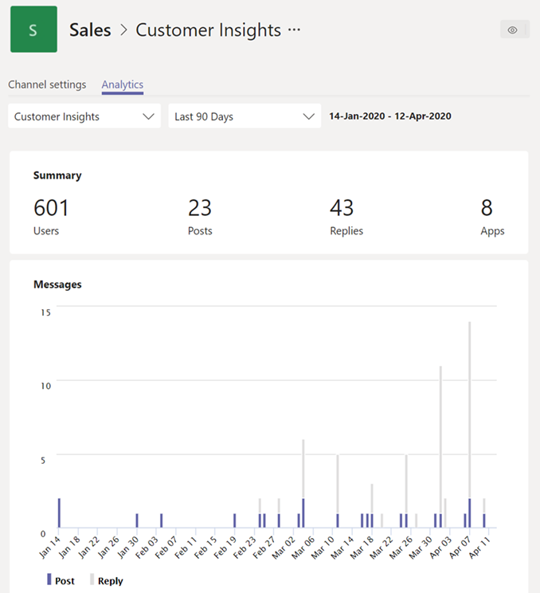

# Visualizzazione di analisi in teams

In Microsoft teams gli utenti possono visualizzare le analisi per i team e i canali di cui fanno parte. Questa informazione consente agli utenti di comprendere i modelli di utilizzo e le attività nei rispettivi team. Gli utenti possono visualizzare dati come il numero di utenti attivi, post, risposte e altro ancora su tre livelli.

- **Analisi cross-team** offre agli utenti un'ampia panoramica dei dati sull'utilizzo per tutti i team di cui sono membri o proprietari in una singola visualizzazione elenco.
- **Analisi per Team** offre agli utenti una visualizzazione più granulare che mostra i dati sull'utilizzo per un team specifico.
- L' **analisi per canale** offre agli utenti una visualizzazione ancora più granulare che mostra i dati sull'utilizzo per un canale specifico.

Gli utenti possono filtrare qualsiasi visualizzazione per visualizzare i dati per un periodo di tempo specificato.

## Visualizzazione di analisi cross-team

1. In teams, nella parte inferiore dell'elenco teams, accanto a **partecipa o crea un team**, fai clic su **Gestisci** team.
2. Fare clic sulla scheda **analisi** .
3. Selezionare un intervallo di date per visualizzare i dati sull'utilizzo per tutti i team di cui si è membri o proprietari.

    

    |Elemento |Descrizione  |
    |--------|-------------|
    |**Nome**   |Nome del team. |
    |**Utenti attivi**   |Numero di utenti attivi del team e della linea di tendenza dell'attività del team durante il periodo di tempo specificato.
    |**Persone**   |Numero totale di persone del team nel periodo di tempo specificato. Questo include i proprietari del team, i membri del team e gli utenti.|
    |**Ospiti**   |Numero di Guest nel team durante il periodo di tempo specificato. |
    |**Post**   |Numero di nuovi messaggi pubblicati in chat del team durante il periodo di tempo specificato. |
    |**Risposte**   |Numero di risposte nella chat del team durante il periodo di tempo specificato. |
    |**Tipo**   |Indipendentemente dal fatto che il team sia un team privato o un team pubblico.|

## Visualizzazione di analisi per Team

1. In teams andare al team desiderato, fare clic su **altre opzioni (...)** e quindi fare clic su **Gestisci team**.
2. Fare clic sulla scheda **analisi** .
4. Selezionare un intervallo di date per visualizzare i dati sull'utilizzo per il team.  

    

    |Elemento |Descrizione  |
    |--------|-------------|
    |**Riepilogo**   |Riepilogo dell'attività del team, inclusi i seguenti:<ul><li>**Utenti**: numero totale di utenti nel periodo di tempo specificato. Questo include i proprietari del team, i membri del team e gli utenti.</li> <li>**Post**: numero di nuovi messaggi pubblicati in chat del team durante il periodo di tempo specificato.</li><li>**Risposte**: numero di risposte nella chat del team durante il periodo di tempo specificato.</li> <li>**App**: numero di app aggiunte al team.</li><li>**Riunioni**: numero di riunioni di teams organizzate a livello di team.</li> </ul> |
    |**Utenti attivi**   |Numero di utenti attivi e inattivi.|
    |**Ruolo**   |Numero di utenti per ruolo, inclusi i proprietari del team, i membri del team e i guest.|
    |Grafico **utenti attivi**  |Numero di attivi giornalieri. Posizionare il puntatore del mouse sul punto in una data specificata per visualizzare il numero di utenti attivi in tale data.|
    |Grafico **messaggi**  |Numero totale di messaggi pubblicati in chat del team per data. Posizionare il puntatore del mouse sul punto in una data specifica per visualizzare il numero di nuovi post e risposte pubblicate in tale data.|

> [!TIP]
> È anche possibile visualizzare le analisi per team facendo clic su un team nell'elenco nella [visualizzazione analisi cross-team](#view-cross-team-analytics).

## Visualizzazione di analisi per canale

1. In teams, vai al canale che vuoi, fai clic su **altre opzioni (...)** e quindi fai clic su **Manage Channel**.
2. Fare clic sulla scheda **analisi** .
3. Selezionare un intervallo di date per visualizzare i dati sull'utilizzo per il canale.  

    

    |Elemento |Descrizione  |
    |--------|-------------|
    |**Riepilogo**   |Riepilogo delle attività dei canali, inclusi i seguenti:<ul><li>**Utenti**: numero totale di utenti nel periodo di tempo specificato. Questo include i proprietari del team, i membri del team e gli utenti.</li> <li>**Post**: numero di nuovi messaggi pubblicati nel canale durante il periodo di tempo specificato.</li><li>**Risposte**: numero di risposte nel canale durante il periodo di tempo specificato.</li> <li>**App**: numero di app aggiunte al canale.</li> </ul> |
    |Grafico **messaggi**  |Numero totale di messaggi pubblicati nella chat del canale per data. Posizionare il puntatore del mouse sul punto in una data specifica per visualizzare il numero di nuovi post e risposte pubblicate in tale data.|

> [!TIP]
> È anche possibile visualizzare le analisi per canale selezionando un canale nella casella di riepilogo a discesa nella [visualizzazione analisi per Team](#view-per-team-analytics).
    
> [!NOTE]
> Definiamo gli utenti attivi come utenti che eseguono un'azione intenzionale nel client desktop, nel client mobile e nel client Web. Gli esempi di un'azione intenzionale includono l'avvio di una chat, l'immissione di una chiamata, la condivisione di un file, la modifica di un documento all'interno di Team, la partecipazione a una riunione e così via. Disponiamo di azioni passive come l'avvio automatico, riducendo al minimo uno schermo o chiudendo l'app. È anche possibile deduplicare tutte le azioni in un singolo ID utente.

## Argomenti correlati

- [Visualizzare i dati analitici per i team](https://support.office.com/article/view-analytics-for-your-teams-5b8ad4b1-af34-4217-aff4-cd11a820b56b)
- [Analisi e creazione di report in teams](teams-reporting-reference.md)