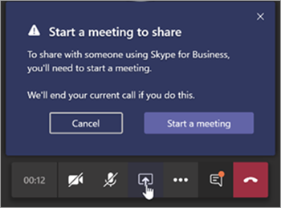

# Informazioni sulla coesistenza e l'interoperabilità di Microsoft teams e Skype for business

Questo articolo fa parte della fase di definizione del progetto del viaggio di aggiornamento, un'attività completa dopo aver creato una coalizione di sponsorizzazione e un team di progetto e definito l'ambito, gli obiettivi e la visione per il progetto. Prima di procedere, verificare di aver completato le attività seguenti:

- [Elenco delle parti interessate del progetto](upgrade-enlist-stakeholders.md)
- [Definizione dell'ambito del progetto](https://aka.ms/SkypetoTeams-Scope)

Se l'organizzazione usa Skype for business oggi e si inizia a usare teams insieme a Skype for business o si inizia a eseguire l'aggiornamento a teams, è importante capire come coesistono le due applicazioni, quando e come interagiscono e come gestire la migrazione degli utenti fino al loro eventuale aggiornamento da Skype for business a teams.

> [!Tip]
> Per informazioni sulla [coesistenza e l'interoperabilità,](https://aka.ms/teams-upgrade-coexistence-interop)vedere la sessione seguente.
>
> Inoltre, puoi unirti a noi per laboratori dinamici e interattivi in cui condivideremo le indicazioni, le procedure consigliate e le risorse progettate per avviare la pianificazione e l'implementazione dell'aggiornamento.
>
> Prima di tutto, partecipa al piano della sessione di [aggiornamento](https://aka.ms/SkypeToTeamsPlanning) per iniziare.

## Coesistenza di teams e Skype for business

Oltre alle funzionalità di collaborazione, teams offre funzionalità di chat, chiamate e riunioni. A seconda di come si sceglie di distribuire Team, queste funzionalità potrebbero sovrapporsi alle funzionalità fornite da Skype for business per un utente specifico. La modalità predefinita consiste nell'eseguire teams insieme a Skype for business con le funzionalità sovrapposte; a un utente può tuttavia essere assegnata una delle diverse modalità di coesistenza (note anche come modalità di aggiornamento) progettate per garantire che queste funzionalità non si sovrappongano per tale utente (in questo caso è disponibile l'interoperabilità tra team e Skype for business). Ad esempio, se si hanno asset aziendali locali Skype for business significativi con una distribuzione VoIP aziendale complessa, ma si vuole che gli utenti possano godere di riunioni moderne il più rapidamente possibile, è consigliabile valutare [prima le riunioni](meetings-first.md) come percorso alternativo.

Ti consigliamo di esaminare le seguenti modalità di coesistenza per determinare il percorso appropriato per l'organizzazione.

> [!Important]
> L'introduzione di nuove tecnologie o l'adozione di modifiche nell'ambiente esistente e familiare di Skype for business, offrendo così nuovi vantaggi per le aziende, possono essere di disturbo per gli utenti. Richiedere tempo per valutare la disponibilità degli utenti e implementare un piano di comunicazione e formazione prima di implementare le modifiche descritte in questo articolo. Inoltre, consigliamo vivamente di pilotare il piano con un gruppo di utenti selezionato prima di implementarlo nell'organizzazione.

### Modalità Isole

Per impostazione predefinita, gli utenti possono eseguire teams insieme a Skype for business come due soluzioni separate che garantiscono funzionalità simili e sovrapposte, ad esempio presenza, chat, chiamate e riunioni. Gli utenti di teams possono anche sfruttare le nuove funzionalità di collaborazione come team e canali, accedere ai file in Microsoft 365 o Office 365 e applicazioni.

In questa modalità di coesistenza, denominata **Islands**, ognuna delle applicazioni client funziona come un'isola separata. I colloqui di Skype for business con Skype for business e i colloqui di teams con teams. È previsto che gli utenti eseguano entrambi i client in qualsiasi momento e possano comunicare in modo nativo nel client da cui è stata avviata la comunicazione. Di conseguenza, non c'è bisogno di interoperabilità in modalità **isole** .

Per evitare un'esperienza di Skype for business confusa o regressione, le comunicazioni esterne (federate), i servizi vocali PSTN e le applicazioni vocali, l'integrazione di Office, i controlli HID per i dispositivi USB e molte altre integrazioni continuano a essere gestiti da Skype for business e non sono disponibili in modalità teams in **Islands** . Il sistema telefonico non è supportato in teams in modalità **Islands** ; in questa modalità l'unico client VoIP aziendale è Skype for business.

> [!Important]
> In modalità **isole** tutti i messaggi e le chiamate provenienti da utenti federati (persone esterne all'organizzazione) vengono recapitati a Skype for business. Dopo l'aggiornamento alla modalità **solo teams** , tutti i messaggi e le chiamate all'esterno dell'organizzazione vengono recapitati a teams.

> [!Tip]
> Il percorso consigliato per i clienti di Skype for business online è iniziare con la modalità **isole** predefinite, guidare la saturazione delle adozioni teams nell'organizzazione e quindi procedere rapidamente alla modalità **solo teams** . I clienti locali e ibridi, in particolare quelli complessi, potrebbero trarre vantaggio dall'implementazione della modalità di **collaborazione di Skype for business con teams** come punto di partenza e non in modalità **isole** , oltre che per passare a **Skype for business con la modalità di collaborazione e riunione di teams** (ovvero riunioni prima), se necessario, e alla modalità **solo teams** quando l'organizzazione è pronta ad adottare team.

### Solo Teams

Un utente **solo teams** (detto anche utente *aggiornato* ) ha accesso a tutte le funzionalità in teams. Possono mantenere il client Skype for business per partecipare a riunioni su Skype for business organizzati da utenti non aggiornati o da parti esterne. Un utente aggiornato può continuare a comunicare con altri utenti dell'organizzazione che usano ancora Skype for business usando le funzionalità di interoperabilità tra teams e Skype for business (purché gli utenti di Skype for business non siano in modalità **isole** ). Tuttavia, un utente aggiornato non può avviare una chat, una chiamata o una riunione Skype for business.

Non appena l'organizzazione è pronta per consentire ad alcuni o a tutti gli utenti di usare teams come unico strumento di comunicazione e collaborazione, è possibile aggiornare gli utenti alla modalità **solo teams** . Se si esegue l'aggiornamento dalla modalità **Islands** , è consigliabile saturare prima di tutto l'adozione di teams in tutta l'organizzazione prima di iniziare il processo di aggiornamento. In questo modo si evitano scenari di comunicazione interrotti a causa della modalità **Islands** che non offre interoperabilità.

Quando si è in modalità **solo teams** , teams è l'app predefinita per il protocollo SIP/Tel. Ciò significa che i collegamenti nella scheda contatto di un utente in Outlook per la chiamata o la chat verranno gestiti da teams.

Per altre considerazioni su come passare alla modalità **solo teams** , vedere [considerazioni sulla modalità solo teams](teams-only-mode-considerations.md).

### Solo Skype for Business

In questa modalità di coesistenza gli utenti rimangono in Skype for business, non in team, per le funzionalità di chat, riunioni e chiamate e non usano team per team e canali. Questa modalità è oggi disponibile; Tuttavia, nell'implementazione corrente i team e i canali non vengono disattivati automaticamente per l'utente. Questa operazione può essere eseguita usando i criteri delle autorizzazioni dell'app per nascondere team e canali.

Questa modalità può essere usata prima di avviare una distribuzione gestita di teams per impedire agli utenti di iniziare a usare teams prima di aver creato la disponibilità o come metodo per abilitare la partecipazione autenticata alle riunioni di team per gli utenti di Skype for business, purché gli utenti dispongano della licenza per i team.

### Collaborazione tra Skype for business e teams

Usa questa modalità per introdurre team nell'ambiente mentre continui a sfruttare gli investimenti esistenti in Skype for business. In questa modalità si lascia invariati Skype for business per le funzionalità di chat, chiamate e riunioni e si aggiungono le funzionalità di collaborazione dei team, ovvero team e canali, l'accesso ai file in Microsoft 365 o Office 365 e le applicazioni. Le funzionalità di comunicazione di teams: chat privata, chiamate e riunioni di programmazione sono disattivate per impostazione predefinita in questa modalità.

Le organizzazioni che hanno un punto di partenza di Skype for Business Server in locale o ibrido dovrebbero considerare questa modalità come alternativa alla modalità **isole** , se vogliono dare agli utenti l'interoperabilità e la prevedibilità per le comunicazioni, oltre ad avere una sequenza temporale prevedibile per il loro aggiornamento ai team (invece di affidarsi alla saturazione dell'adozione in modalità **isole** ).

### Skype for business con la collaborazione e le riunioni di teams, note anche come riunioni per primo

Usa questa modalità di coesistenza per accelerare la disponibilità delle funzionalità di riunione di teams nell'organizzazione, oltre alle funzionalità di collaborazione, consentendo agli utenti di sfruttare l'esperienza di riunioni di Team superiori-qualità eccellente, funzionalità innovative come la trascrizione e la traduzione o la sfocatura dello sfondo e un'esperienza utente superiore in tutte le piattaforme, inclusi i dispositivi mobili e i browser.

Insieme all'uso di team per le conversazioni basate su team e canali in questa modalità, gli utenti useranno team per pianificare e condurre le riunioni. Chat e chiamate private restano in Skype for business. I team e Skype for business traggono vantaggio da un'ampia gamma di funzionalità di "migliore collaborazione", come la riconciliazione della presenza, il supporto automatico di blocco/sospensione e la gestione dei dispositivi HID in entrambe le applicazioni. Tieni presente che è possibile nascondere team e canali, se necessario, usando i criteri delle autorizzazioni dell'app.

Questa modalità di coesistenza è particolarmente utile per le organizzazioni con le distribuzioni locali di Skype for business con Enterprise Voice, che probabilmente richiederà del tempo per eseguire l'aggiornamento a teams e vuole trarre vantaggio dalle riunioni di teams superiori il più presto possibile.

> [!TIP]
> Per identificare la modalità di aggiornamento consigliata in base alle funzionalità che si vogliono abilitare in teams mentre Skype for business è ancora in uso, sfruttare la [procedura guidata di aggiornamento di Skype to teams](https://aka.ms/SkypeToTeamsWizard).

Per altre informazioni sulle modalità di coesistenza, sui prerequisiti e sulla gestione, Vedi [linee guida per la migrazione e l'interoperabilità per le organizzazioni che usano team insieme a Skype for business](https://aka.ms/SkypeToTeams-Interop) e per [impostare le impostazioni di coesistenza e aggiornamento](https://aka.ms/SkypeToTeams-SetCoexistence).

| | | |
|---|---|---|
||Punto decisionale|<ul><li>Quali modalità di coesistenza si adattano meglio alle esigenze dell'organizzazione e degli utenti?</li></ul>|
||Passaggio successivo|<ul><li>Scegliere l'approccio migliore per il viaggio di aggiornamento.</li></ul>|

## Interoperabilità di teams e Skype for business

L'interoperabilità è la possibilità per gli utenti di team e Skype for business nella stessa organizzazione di comunicare tra team e Skype for business.

L'interoperabilità è regolata dalla modalità di coesistenza (nota anche come modalità di aggiornamento) del destinatario. Non c'è interoperabilità quando il destinatario è in modalità **isole** .

> [!Note]
> Quando viene distribuita in qualsiasi modalità di coesistenza eccetto le **isole**, i team e Skype for business possono [interagire](#interoperability-of-teams-and-skype-for-business), consentendo agli utenti di chattare e chiamarsi a vicenda e garantendo che le comunicazioni rimangano fluide nell'organizzazione durante il viaggio di aggiornamento in teams. La modalità di coesistenza regola l'interoperabilità. La modalità di coesistenza del destinatario determina se l'interoperabilità sarà disponibile. Ad esempio, se il destinatario si trova in una modalità in cui la chat è disponibile solo in un solo client (ad affermare Team), l'interoperabilità della chat sarà in genere disponibile nel caso in cui l'iniziatore usi l'altro client (in questo caso Skype for business) per avviare la chat. Se invece il destinatario si trova nella modalità in cui la chat è disponibile in entrambi i client (modalità isole), l'interoperabilità non sarà disponibile per la chat. Il messaggio verrà ricevuto dal destinatario nello stesso client in cui l'initiator ha avviato la chat. Di conseguenza, la comunicazione corretta in modalità **isole** richiede la saturazione dell'adozione di Teams; ovvero tutti gli utenti che usano e controllano attivamente entrambi i client.

> [!Note]
> **Per avere l'esperienza di coesistenza più recente, la versione client deve essere l'ultimo client disponibile nel canale di distribuzione di Office dell'utente.**

### Interoperabilità nativa e escalation di interoperabilità

Esistono due tipi di esperienze di interoperabilità, ad escalation nativo e di interoperabilità.

- Un'esperienza di _interoperabilità nativa_ si verifica nel client che l'utente sta attualmente usando. Un utente sarà nel client Skype for business, l'altro in teams. Un'esperienza di interoperabilità nativa non li porterà in un altro client per comunicare, ma gli utenti potranno eseguire la conversazione nel client che sta usando. Le esperienze di interoperabilità native sono chat e chiamate uno-a-uno.
- Un'esperienza di _escalation di interoperabilità_ significa che, nell'aiutare gli utenti a eseguire un'azione avanzata, ad esempio la condivisione del desktop, il client facilita la creazione di una riunione a cui gli utenti possono partecipare per continuare l'esperienza di tale riunione. La riunione viene creata sulla piattaforma dell'iniziatore dell'azione. L'utente o gli utenti che non fanno parte della piattaforma ricevono un collegamento a una riunione. Mentre fanno clic su questo collegamento, vengono uniti alla riunione in un client compatibile (browser, app Web o client completo, a seconda della configurazione). L'escalation di interoperabilità da Skype for business richiede un client recente. L'escalation di interoperabilità da teams è ora disponibile. Entrambi sono supportati in esperienze di interoperabilità in-tenant e per la comunicazione federata tra tenant.

### Esperienze di interoperabilità Native

A seconda delle modalità di coesistenza assegnate agli utenti, come descritto in precedenza, sono disponibili le seguenti esperienze di interoperabilità Native:

Gli utenti di Skype for business possono chattare uno-a-uno con gli utenti di teams e viceversa. Una chat di interoperabilità deve passare attraverso un gateway di interoperabilità che fa parte dei servizi cloud di Teams (e quindi esiste solo online). Le chat di interoperabilità sono di testo normale: testo RTF ed emoticon non sono supportate. Gli utenti in teams e in Skype for Business ricevono una notifica che la conversazione è una conversazione di interoperabilità.

<!---->

Gli utenti di Skype for business possono effettuare chiamate vocali e video uno-a-uno agli utenti di teams e viceversa.

<!---->

> [!Important]
> Le esperienze di interoperabilità con una distribuzione locale di Skype for business richiedono che l'ambiente locale sia in modalità ibrida con Microsoft 365 o Office 365 Skype for business. Per informazioni dettagliate, vedi indicazioni per la [migrazione e l'interoperabilità](https://aka.ms/SkypeToTeams-Interop).

Queste esperienze di interoperabilità sono disponibili per e tra gli utenti che hanno una delle seguenti modalità di coesistenza assegnate: **Skype for business con collaborazione teams**, **Skype for business con collaborazione e riunioni di Team**, **solo Skype for business**o **solo teams**. Non c'è interoperabilità per gli utenti in modalità **isole** .

### Limitazioni dell'esperienza di interoperabilità Native

A causa della differenza tra protocolli e tecnologia, non è possibile supportare tutte le funzionalità in modo nativo. In particolare, le funzionalità seguenti non sono disponibili:

- Markdown, Rich Text e il set completo di emoticon non sono supportati da teams o Skype for business. Altre caratteristiche native della casella di composizione nelle chat di teams non sono supportate.
- La condivisione dello schermo (condivisione di desktop o app) tra team e Skype for business non è supportata nativamente. Tuttavia, è supportato dall'escalation di interoperabilità.
- Le chat di gruppo (conversazioni a più parti) in teams possono includere solo i partecipanti che usano team.
- Le conversazioni di messaggistica istantanea a più parti (chat di gruppo) in Skype for business possono includere solo i partecipanti che usano Skype for business. Tuttavia, l'escalation di interoperabilità a più parti è disponibile da Skype for business.
- L'escalation di una chiamata vocale o video peer-to-peer in corso a una chiamata a più parti che coinvolge sia i team che gli utenti di Skype for business non è supportata.
- Non sono supportati i trasferimenti di file per le chat di due parti o l'allegato di file in chat di gruppo, da team a Skype for business e viceversa.
- Non c'è interoperabilità con la chat persistente di Skype for business.

Per tutte queste limitazioni (ad eccezione della chat persistente), una possibile soluzione alternativa consiste nel fatto che un utente avvii una riunione e inviti l'altro utente a partecipare.

Questa soluzione alternativa è la base per l'escalation di interoperabilità. In particolare, la condivisione dello schermo e l'escalation a più parti non sono raggiungibili nativamente, ma sono supportate tramite l'escalation di interoperabilità.

### Esperienze sull'escalation di interoperabilità

L'escalation di interoperabilità consiste nell'integrare le funzionalità di interoperabilità native con le escalation gestite alle riunioni. Le riunioni offrono esperienze ricche disponibili a tutti, indipendentemente dal cliente.

Quando l'escalation di interoperabilità viene attivata dall'utente teams, viene creata una riunione teams. Quando viene attivato dall'utente Skype for business, viene creata una riunione Skype for business. In entrambi i casi, la riunione creata è una riunione che si **incontra ora** , che non viene applicata al calendario dell'utente.
 
L'altra parte riceve il collegamento a una riunione tramite l'interoperabilità tramite chat e i join facendo clic sul collegamento. Se l'utente di Skype for business ha un account teams ed è invitato dall'utente teams, si unirà alla riunione autenticata. In caso contrario, si uniranno come partecipante anonimo. Al contrario, gli utenti di teams hanno quasi sempre un account Skype for business e un client Skype for business che possono usare per partecipare a una riunione Skype for business come partecipante autenticato, ma potrebbero anche partecipare come partecipanti anonimi, ad esempio usando l'app riunione Skype.

Una volta che le parti hanno partecipato alla riunione, possono eseguire tutte le attività supportate in riunioni, ad esempio condivisione di contenuti desktop o di contenuto, condivisione di file o trasferimento, aggiunta di altri partecipanti e così via.

#### Escalation di interoperabilità da Skype for business

L'interoperabilità e l'escalation di interoperabilità da Skype for business sono state aggiornate nella build di 2019 mensile di C2R. In precedenza, Skype for business non aveva consapevolezza preventiva che la parte remota stava usando teams. Solo ipotizzato che dalla segnalazione ricevuta dopo la creazione di una sessione.

Quando la segnalazione indica che la risposta è arrivata da (o tramite) il gateway di interoperabilità, la barra di business gialla indicherebbe che l'altra parte non stava usando Skype for business. Con l'evoluzione del nostro servizio, ciò ha comportato falsi positivi, in cui gli utenti di Skype for business vedranno la barra delle attività quando erano connessi al servizio cloud voicemail o ad altri servizi cloud Voice, invece che a un solo utente di **Teams** .
 
Per evitare questi falsi positivi, il servizio presenza informa ora il client Skype for business quando l'altra parte è solo un utente effettivo di **Teams** . In questo modo Skype for business deve tenere presente che è necessario creare una conversazione di interoperabilità prima che venga creata e che la finestra di conversazione sia specifica per l'interoperabilità.

Se l'utente di Skype for business vuole condividere il proprio desktop, ad esempio, viene informato che verrà avviata una riunione e guidata dalla procedura.

Nel frattempo, l'utente del team riceve un messaggio di chat in arrivo con il collegamento alla riunione e viene guidato per partecipare.

Questa escalation a una riunione Skype for business è disponibile sia per l'interoperabilità in-tenant che per le chiamate e le chat federative tra tenant. È attivato per impostazione predefinita e non sono presenti impostazioni che l'amministratore deve eseguire il provisioning.

#### Escalation di interoperabilità da teams

L'escalation di interoperabilità da Teams a una riunione teams è ora disponibile quando l'utente teams seleziona il pulsante condivisione desktop in un thread di interoperabilità in-tenant con un utente Skype for business o in un thread della Federazione di interoperabilità tra tenant. L'escalation di interoperabilità è supportata da una conversazione di chat di 1:1 o da una chiamata 1:1.

La funzionalità è supportata nel client desktop teams per Windows, nel client desktop teams per Mac e nel client Web Teams nei browser in cui è supportata la condivisione del contenuto, mentre è in comunicazione con qualsiasi versione client di Skype for business.

Nei thread di interoperabilità e nei thread di interoperabilità federativi l'utente Teams ha ora i controlli (Button) per avviare la condivisione del contenuto. Quando l'utente teams seleziona il pulsante, viene presentato con un altro menu che informa che per condividere il contenuto, dovrà avviare una riunione di teams.

Se gli utenti partecipano a una chiamata, il menu avverte anche che la chiamata corrente tra team e Skype for business verrà terminata mentre viene inserita in una riunione di teams. Se lo scelgono, possono avvisare l'utente di Skype for business prima di accettarlo.

Dopo l'accettazione, vengono inseriti nella riunione Teams; devono iniziare la condivisione dal vassoio di condivisione della riunione.
 
Nel frattempo, l'utente di Skype for business riceve un messaggio di chat in arrivo con il collegamento alla riunione e viene guidato per partecipare.

Questa escalation a una riunione di teams è disponibile sia per l'interoperabilità in-tenant che per le chiamate e le chat federative tra tenant. È attivato per impostazione predefinita e non sono presenti impostazioni che l'amministratore deve eseguire il provisioning. Tuttavia, è disattivata per l'utente se l'amministratore viene ``-AllowPrivateMeetNow`` impostato ``CsTeamsMeetingPolicy`` su ``$false`` .

Dopo aver esaminato questo articolo, vedere [scegliere il percorso di aggiornamento](upgrade-and-coexistence-of-skypeforbusiness-and-teams.md), le [linee guida per la migrazione e l'interoperabilità](https://aka.ms/SkypeToTeams-Interop), la [coesistenza con Skype for business](coexistence-chat-calls-presence.md)e [impostare le impostazioni di coesistenza e aggiornamento](https://aka.ms/SkypeToTeams-SetCoexistence) per i dettagli di implementazione.

## Collegamenti correlati

[Video: gestire la coesistenza e l'interoperabilità tra SfB e teams](https://www.youtube.com/watch?v=wEc9u4S3GIA&list=PLaSOUojkSiGnKuE30ckcjnDVkMNqDv0Vl&index=11)
