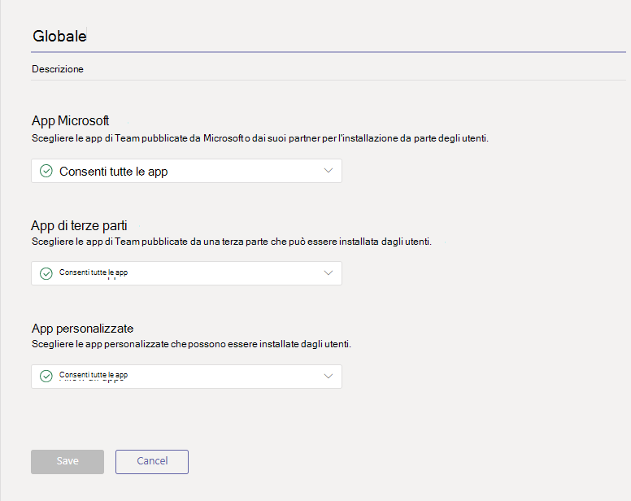
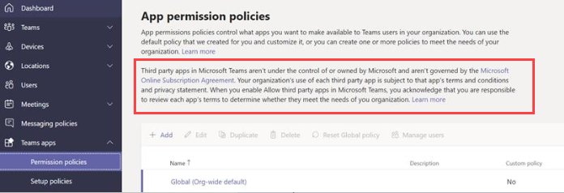
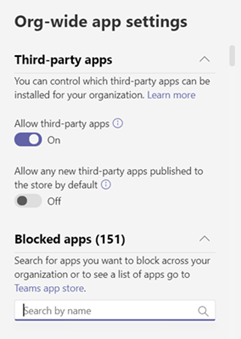

# Gestire i criteri di autorizzazione delle app in Microsoft Teams

Gli amministratori possono usare i criteri di autorizzazione app per controllare quali app sono disponibili per gli utenti di Microsoft Teams dell'organizzazione. È possibile consentire o bloccare tutte le app o le app specifiche pubblicate da Microsoft, da terze parti e dall'organizzazione. Quando si blocca un'app, gli utenti a cui è assegnato il criterio non possono a installarla dallo store delle app di Teams. Per gestire questi criteri, è necessario essere un amministratore globale o un amministratore del servizio Teams.

Puoi gestire i criteri di autorizzazione delle app nell'interfaccia di amministrazione di Microsoft teams. Puoi usare il criterio globale (predefinito per l'intera organizzazione) oppure creare e assegnare criteri personalizzati. Gli utenti dell'organizzazione verranno assegnati automaticamente al criterio globale, a meno che non venga creato e assegnato un criterio personalizzato. Dopo aver modificato o assegnato un criterio, le modifiche apportate potrebbero richiedere qualche ora.

> [!NOTE]
> Le impostazioni dell'app a livello di organizzazione eseguono l'override dei criteri globali e di tutti i criteri personalizzati creati e assegnati agli utenti.

Se l'organizzazione è già in teams, le impostazioni dell'app configurate in **impostazioni a livello di tenant** nell'interfaccia di amministrazione di Microsoft 365 si riflettono nelle impostazioni dell'app a livello di organigramma nella pagina [Manage Apps](manage-apps.md) . Se non si ha familiarità con i team e si è appena iniziato, per impostazione predefinita tutte le app sono consentite nel criterio globale. Sono incluse le app pubblicate da Microsoft, terze parti e dall'organizzazione.

Supponi ad esempio di voler bloccare tutte le app di terze parti e consentire ad app specifiche di Microsoft per il team HR dell'organizzazione. Prima di tutto, devi accedere alla pagina [Gestisci app](manage-apps.md) e verificare che le app che vuoi consentire al team HR siano consentite a livello di organizzazione. Crea quindi un criterio personalizzato denominato criteri di autorizzazione per le app HR, impostalo per bloccare e consentire le app desiderate e assegnalo agli utenti nel team HR.

> [!NOTE]
> Se si è distribuito teams in un ambiente Microsoft 365 Government community Cloud (GCC), vedere [gestire le impostazioni dell'app a livello di organizzazione per microsoft 365 Government](#manage-org-wide-app-settings-for-microsoft-365-government) per altre informazioni sulle impostazioni dell'app di terze parti che sono univoche per GCC.

## Creare un criterio di autorizzazione per le app personalizzate

Per controllare le app disponibili per diversi gruppi di utenti dell'organizzazione, creare e assegnare uno o più criteri di autorizzazione per le app personalizzate. È possibile creare e assegnare criteri personalizzati distinti a seconda che le app vengano pubblicate da Microsoft, da terze parti o dall'organizzazione. È importante sapere che dopo aver creato un criterio personalizzato, non è possibile modificarlo se le app di terze parti sono disabilitate nelle impostazioni dell'app a livello di organizzazione.

1. Nella barra di spostamento sinistra dell'interfaccia di amministrazione di Microsoft teams accedere ai criteri di autorizzazione delle **app teams**  >  **Permission policies**.
2. Fare clic su **Aggiungi**.  
    
3. Immettere un nome e una descrizione per il criterio.
4. In app **Microsoft**, **app di terze parti**e **app personalizzate**seleziona una delle opzioni seguenti:

    - **Consenti tutte le app**
    - **Consenti app specifiche e blocca tutte le altre**
    - **Bloccare app specifiche e consentire a tutti gli altri utenti**
    - **Bloccare tutte le app**

5. Se è stata selezionata l'opzione **Consenti app specifiche e blocca altre**, aggiungere le app che si vuole consentire:

    1. Selezionare **Consenti app**.
    1. Cercare le app che si desidera consentire e quindi fare clic su **Aggiungi**. I risultati della ricerca vengono filtrati in Publisher di app (app**Microsoft**, app di **terze parti**o **app personalizzate**).
    1. Dopo aver scelto l'elenco di app, fare clic su **Consenti**. 

6. Allo stesso modo, se si è selezionato **Blocca app specifiche e si consente a tutti gli altri utenti**, cercare e aggiungere le app da bloccare e quindi fare clic su **blocca**.
7. Fare clic su **Salva**.

## Modificare i criteri di autorizzazione delle app

È possibile usare l'interfaccia di amministrazione di Microsoft teams per modificare un criterio, inclusi i criteri globali e i criteri personalizzati creati.

1. Nella barra di spostamento sinistra dell'interfaccia di amministrazione di Microsoft teams accedere ai criteri di autorizzazione delle **app teams**  >  **Permission policies**.
2. Selezionare il criterio facendo clic a sinistra del nome del criterio, quindi fare clic su **modifica**.
3. Da qui apportare le modifiche desiderate. Puoi gestire le impostazioni in base all'App Publisher e aggiungere e rimuovere app in base all'impostazione Consenti/blocca.
4. Fare clic su **Salva**.

## Assegnare un criterio di autorizzazione app personalizzata agli utenti

[!INCLUDE [assign-policy](includes/assign-policy.md)]

## Gestire le impostazioni dell'app a livello di organizzazione per Microsoft 365 Government  

In Microsoft 365 Government-GCC Deployment of teams è importante conoscere le informazioni seguenti sulle impostazioni dell'app di terze parti, che sono univoche per GCC.

In GCC tutte le app di terze parti sono bloccate per impostazione predefinita. Verranno inoltre visualizzate le note seguenti sulla gestione delle app di terze parti nella pagina Criteri di autorizzazione dell'app nell'interfaccia di amministrazione di Microsoft teams.

Usa le impostazioni dell'app a livello di organizzazione per controllare se gli utenti possono installare app di terze parti. Le impostazioni dell'app a livello di organizzazione regolano il comportamento per tutti gli utenti ed eseguono l'override di qualsiasi altro criterio di autorizzazione dell'app assegnato agli utenti. Puoi usarle per controllare le app malevole o problematiche.

1. Nella pagina **criteri di autorizzazione** selezionare **impostazioni dell'app a livello di organizzazione**. È quindi possibile configurare le impostazioni desiderate nel pannello.

    
    
2. In **app di terze parti**disattivare o attivare queste impostazioni per controllare l'accesso alle app di terze parti:

    - **Consenti app di terze parti**: controlla se gli utenti possono usare app di terze parti. Se disattivi questa impostazione, gli utenti non potranno installare o usare app di terze parti. In una distribuzione di team di Microsoft 365 Government-GCC, questa impostazione è disinserita per impostazione predefinita.
    - **Consenti a tutte le nuove app di terze parti pubblicate nello Store per impostazione predefinita**: questo controlla se le nuove app di terze parti pubblicate nell'app store teams diventano automaticamente disponibili in teams. Puoi impostare questa opzione solo se Consenti app di terze parti.

3. In **app bloccate**aggiungere le app che si desidera bloccare nell'organizzazione. In una distribuzione di team di Microsoft 365 Government-GCC, tutte le app di terze parti vengono aggiunte all'elenco per impostazione predefinita. Per qualsiasi app di terze parti che vuoi consentire nell'organizzazione, Rimuovi l'app da questo elenco di app bloccate. Quando blocchi un'app a livello di organizzazione, l'app viene bloccata automaticamente per tutti gli utenti, indipendentemente dal fatto che siano consentiti in qualsiasi criterio di autorizzazione dell'app
4. Fare clic su **Salva** per applicare le impostazioni dell'app a livello di organizzazione.

Come accennato in precedenza, per consentire le app di terze parti, è possibile modificare e usare il criterio globale (predefinito a livello di organizzazione) oppure creare e assegnare criteri personalizzati.

## Domande frequenti

### Uso dei criteri di autorizzazione delle app

#### Quali interazioni delle app influenzano i criteri di autorizzazione?
I criteri di autorizzazione regolano l'utilizzo dell'app controllando installazione, individuazione e interazione per gli utenti finali. Gli amministratori possono comunque gestire le app nell'interfaccia di amministrazione di Microsoft teams indipendentemente dai criteri di autorizzazione assegnati.

#### È possibile controllare le app line of business (LOB)?
Sì, è possibile usare i criteri di autorizzazione delle app per controllare l'implementazione e la distribuzione delle app personalizzate (line-of-business). È possibile creare criteri personalizzati o modificare i criteri globali per consentire o bloccare le app personalizzate in base alle esigenze dell'organizzazione.

#### In che modo i criteri di autorizzazione delle app sono correlati alle app e ai criteri di configurazione delle app bloccati?

Puoi usare i criteri di configurazione delle app insieme ai criteri di autorizzazione per le app. Le app predefinite vengono selezionate dal set di app abilitate per un utente. Inoltre, se un utente ha un criterio di autorizzazione per le app che blocca un'app nei criteri di configurazione dell'app, l'app non verrà visualizzata in teams.

#### È possibile usare I criteri di autorizzazione delle app per limitare il caricamento di app personalizzate?

Puoi usare le impostazioni a livello di organizzazione nella pagina **Gestisci app** o i criteri di configurazione dell'app per limitare il caricamento di app personalizzate per l'azienda.  

Per limitare utenti specifici al caricamento di app personalizzate, USA criteri per le app personalizzate. Per altre informazioni, vedere [gestire i criteri e le impostazioni dell'app personalizzata in teams](teams-custom-app-policies-and-settings.md).

#### Il blocco di un'app si applica ai client per dispositivi mobili Teams?

Sì, quando blocchi un'app, l'app viene bloccata in tutti i client di teams.  

### Esperienza utente

#### Che cosa fa un'esperienza utente quando un'app viene bloccata?

Gli utenti non possono interagire con un'app bloccata o le relative funzionalità, ad esempio bot, schede e estensioni di messaggistica. In un contesto condiviso, ad esempio un team o una chat di gruppo, i bot possono comunque inviare messaggi a tutti i partecipanti al contesto. Teams indica all'utente quando un'app è bloccata.

Ad esempio, quando un'app viene bloccata, gli utenti non possono eseguire una delle operazioni seguenti:

- Aggiungere l'app personalmente o in una chat o in un team
- Inviare messaggi al bot dell'app
- Eseguire le azioni dei pulsanti che restituiscono informazioni all'app, ad esempio i messaggi di azione  
- Visualizzare la scheda dell'app
- Configurare i connettori per la ricezione delle notifiche
- Usare l'estensione di messaggistica dell'app

Il portale Legacy ha consentito il controllo delle app a livello di organizzazione, il che significa che quando un'app viene bloccata, è bloccata per tutti gli utenti dell'organizzazione. Il blocco di un'app nella pagina [Gestisci app](manage-apps.md) funziona esattamente nello stesso modo.

Per i criteri di autorizzazione delle app assegnati a utenti specifici, se è stata consentita un'app con un bot o una funzionalità di connessione e quindi è stata bloccata e se l'app è consentita solo per alcuni utenti in un contesto condiviso, i membri di una chat di gruppo o di un canale che non hanno l'autorizzazione per l'app possono vedere la cronologia dei messaggi inviati dal bot , ma non può interagire con essa.

## Argomenti correlati

[Impostazioni di amministrazione per le app in Teams](admin-settings.md)

[Assegnare criteri agli utenti in teams](assign-policies.md)
