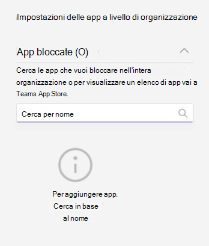

# Gestire i criteri di autorizzazione app in Microsoft Teams

Gli amministratori possono usare i criteri di autorizzazione app per controllare quali app sono disponibili per gli utenti di Microsoft Teams dell'organizzazione. È possibile consentire o bloccare tutte le app o determinate app pubblicate da Microsoft, da terze parti e dall'organizzazione. Quando si blocca un'app, gli utenti a cui è assegnato il criterio non possono a installarla dallo store delle app di Teams. Per gestire questi criteri, è necessario essere un amministratore globale o un amministratore del servizio Teams.

È possibile gestire i criteri di autorizzazione app nell'interfaccia di amministrazione di Microsoft Teams. È possibile usare il criterio globale (predefinito a livello di organizzazione) o creare e assegnare criteri personalizzati. Gli utenti dell'organizzazione verranno assegnati automaticamente al criterio globale, a meno che non venga creato e assegnato un criterio personalizzato. La modifica o l'assegnazione di un criterio potrà richiedere alcune ore.

> [!NOTE]
> Le impostazioni app a livello di organizzazione sostituiscono il criterio globale e qualsiasi criterio personalizzato creato e assegnato agli utenti.

Se l'organizzazione è già su Teams, le impostazioni app configurate nelle **impostazioni a livello di tenant** nell'interfaccia di amministrazione di Microsoft 365 vengono rispecchiate nelle impostazioni app a livello di organizzazione nella pagina [Gestisci app](manage-apps.md). Se si usa Teams per la prima volta, per impostazione predefinita tutte le app sono consentite nel criterio globale. Include app pubblicate da Microsoft, da provider di software di terze parti e dall'organizzazione.

Se si volesse, ad esempio, consentire solo alcune app specifiche per il team HR dell'organizzazione. Per prima cosa, è necessario passare alla pagina [Gestisci app](https://admin.teams.microsoft.com/policies/manage-apps) e assicurarsi che tutte le app che si desidera consentire per il team HR siano consentite a livello di organizzazione. Creare quindi un criterio personalizzato, impostarlo per bloccare e consentire le app desiderate e assegnare il criterio agli utenti del team HR.

> [!NOTE]
> Per informazioni sulle impostazioni delle app di terze parti univoche per gli ambienti Microsoft 365 Government Community Cloud High (GCCH) e il Dipartimento della difesa (DoD), vedere [Gestire le impostazioni delle app a livello di organizzazione per Microsoft 365 Government](#manage-org-wide-app-settings-for-microsoft-365-government).

## Creare un criterio di autorizzazione app personalizzato

Usare uno o più criteri di autorizzazione app personalizzati, se si vogliono controllare le app disponibili per gruppi di utenti diversi. È possibile creare e assegnare criteri personalizzati in base a chi pubblica le app: Microsoft, terze parti o l'organizzazione. Dopo aver creato un criterio personalizzato, non è possibile cambiarlo se le app di terze parti sono disabilitate nelle impostazioni delle app a livello di organizzazione.

1. Accedere all'[interfaccia di amministrazione di Teams](https://admin.teams.microsoft.com/dashboard)
1. Nel pannello sinistro passare a **App di Teams** > **Criteri di autorizzazione**.
1. Selezionare **Aggiungi**.

   

1. Immettere un nome e una descrizione per il criterio.
1. In **App Microsoft**, **App di terze parti** e **App personalizzate**, selezionare una delle seguenti opzioni:

    * Consenti tutte le app
    * Consenti app specifiche e blocca tutte le altre
    * Blocca app specifiche e consenti tutte le altre
    * Blocca tutte le app

1. Se si è selezionato **Consentire app specifiche e bloccare tutte le altre**, aggiungere le app che si vuole consentire:

    1. Selezionare **Consenti app**.
    1. Cercare le app che si desidera consentire e fare clic su **Aggiungi**. I risultati della ricerca vengono filtrati in base allo sviluppatore di app (**App Microsoft**, **App di terze parti** o **App personalizzate**).
    1. Una volta scelto l'elenco delle app, fare clic su **Consenti**.

1. Analogamente, se si seleziona **Blocca app specifiche e consenti tutte le altre**, cercare e aggiungere le app che si desidera bloccare, quindi fare clic su **Blocca**.
1. Selezionare **Salva**.

## Modificare un criterio di autorizzazione app

È possibile usare l'interfaccia di amministrazione di Teams per modificare un criterio, inclusi il criterio globale e i criteri personalizzati creati.

1. Nel pannello sinistro dell'interfaccia di amministrazione di Microsoft Teams, passare a **App di Teams** > **Criteri di autorizzazione**.
1. Selezionare il criterio facendo clic a sinistra del nome del criterio, quindi selezionare **Modifica**.
1. Da lì, apportare le modifiche desiderate. È possibile gestire le impostazioni in base allo sviluppatore di app e aggiungere e rimuovere app in base all'impostazione consenti/blocca.
1. Selezionare **Salva**.

## Assegnare un criterio di autorizzazione app agli utenti

[!INCLUDE [assign-policy](includes/assign-policy.md)]

## Gestire impostazioni app a livello di organizzazione per Government di Microsoft 365  

Nell'ambito della distribuzione di Microsoft 365 Government - GCC, GCCH e DoD di Teams, tutte le app di terze parti vengono bloccate per impostazione predefinita. Nei Cloud GCCH e DOD le app di terze parti non sono disponibili. In GCC viene inoltre visualizzata la nota seguente sulla gestione delle app di terze parti nella pagina dei criteri di autorizzazione delle app nell'interfaccia di amministrazione di Microsoft Teams.

:::image type="content" source="media/app-permission-policies-gcc.png" alt-text="Screenshot dei criteri di autorizzazione app in GCCH e DoD.":::

Usare le impostazioni app a livello di organizzazione per controllare se gli utenti possono installare le app di terze parti. Le impostazioni app a livello di organizzazione disciplinano il comportamento di tutti gli utenti e sostituiscono qualsiasi criterio di autorizzazione app assegnato agli utenti.

<!---
1. On the **Permission policies** page, select **Org-wide app settings**. You can then configure the settings you want in the panel. --->

### Per i Cloud GCC

1. Nella pagina **Gestisci app** selezionare le **impostazioni app a livello di organizzazione**. È possibile quindi configurare le impostazioni desiderate nel pannello.

   

1. In **App di terze parti**, disattivare o attivare queste impostazioni per controllare l'accesso alle app di terze parti:

    * **Consenti app di terze parti**: questa impostazione controlla se gli utenti possono usare app di terze parti. Se si disattiva questa impostazione, gli utenti non potranno installare o usare qualsiasi app di terze parti. Nell'ambito della distribuzione di Microsoft 365 Government - GCC, GCCH e DoD di Teams, questa impostazione è disattivata per impostazione predefinita.
    * **Consenti qualsiasi nuova app di terze parti pubblicata nello Store per impostazione predefinita**: questa opzione controlla se eventuali nuove app di terze parti pubblicate nell’App Store di Teams diventano disponibili automaticamente in Teams. È possibile impostare questa opzione solo se si consentono le app di terze parti.

1. In **App bloccate**, aggiungere le app che si desidera bloccare nell'organizzazione. Nell'ambito della distribuzione di Microsoft 365 Government - GCC, GCCH e DoD di Teams, tutte le app di terze parti vengono aggiunte a questo elenco per impostazione predefinita. Per qualsiasi app di terze parti che si desidera consentire nell'organizzazione, rimuovere l'app da questo elenco delle app bloccate. Quando si blocca un'app a livello di organizzazione, l'app viene bloccata automaticamente per tutti gli utenti, indipendentemente dal fatto che sia consentita da altri criteri di autorizzazione app.

1. Selezionare **Salvare** per le impostazioni dell'app a livello di organizzazione per avere effetto.

Per consentire le app di terze parti, modificare e usare il criterio globale, predefinito a livello di organizzazione, oppure creare e assegnare criteri personalizzati.

### Per i Cloud GCCH e DoD

1. Nella pagina **Criteri di autorizzazione**, selezionare **Impostazioni app a livello di organizzazione**. È possibile quindi configurare le impostazioni desiderate nel pannello.

   

1. In **App bloccate**, aggiungere le app che si desidera bloccare nell'organizzazione. Nell'ambito della distribuzione di Microsoft 365 Government - GCC, GCCH e DoD di Teams, tutte le app di terze parti vengono aggiunte a questo elenco per impostazione predefinita. Quando si blocca un'app a livello di organizzazione, l'app viene bloccata automaticamente per tutti gli utenti, indipendentemente dal fatto che sia consentita da altri criteri di autorizzazione app.
1. Selezionare **Salvare** per le impostazioni dell'app a livello di organizzazione per avere effetto.

## Domande frequenti

### Lavorare con i criteri di autorizzazione app

#### Su quali interazioni delle app influiscono i criteri di autorizzazione?

I criteri di autorizzazione disciplinano l'utilizzo dell'app controllando installazione, individuazione e interazione per gli utenti finali. Gli amministratori possono ancora gestire le app nell'interfaccia di amministrazione di Microsoft Teams a prescindere dai criteri di autorizzazione assegnati.

#### In che modo i criteri di autorizzazione app riguardano le app aggiunte e i criteri di configurazione?

È possibile usare i criteri di configurazione app insieme ai criteri di autorizzazione app. Le app aggiunte in precedenza vengono selezionate dal set di app consentite per un utente. Inoltre, se un utente dispone di un criterio di autorizzazione app che blocca un'app nel criterio di configurazione app, tale app non comparirà in Teams.

#### Posso usare i criteri di autorizzazione app per restringere il caricamento delle app personalizzate?

È possibile usare le impostazioni a livello di organizzazione nella pagina **Gestisci app** o i criteri di configurazione per restringere il caricamento delle app personalizzate dell'organizzazione.  

Per limitare il caricamento di app personalizzate da parte di determinati utenti, usare i criteri app personalizzate. Per altre informazioni, vedere [Gestisci criteri e impostazioni app personalizzate in Teams](teams-custom-app-policies-and-settings.md).

#### Il blocco di un'app si applica anche ai client per dispositivi mobili Teams?

Sì, quando viene bloccata un'app, tale app viene bloccata per tutti i client Teams.  

### Esperienza utente

#### Come viene influenzata l'esperienza utente quando un'app viene bloccata?

Gli utenti non possono interagire con un'app bloccata o con le sue funzionalità, come bot, schede ed estensioni per la messaggistica. In un contesto condiviso, come chat di team o gruppi, i bot possono inviare comunque messaggi a tutti i partecipanti di tale contesto. Teams informa l'utente quando un'app è bloccata.

Ad esempio, quando un'app è bloccata gli utenti non possono eseguire le seguenti operazioni:

* Aggiungere l'app personalmente a una chat o a un team
* Inviare messaggi al bot dell'app
* Eseguire azioni pulsante che rimandano informazioni all'app, come messaggi interattivi  
* Visualizzare la scheda dell'app
* Configurare connettori per ricevere notifiche
* Usare l'estensione per la messaggistica dell'app

Il portale legacy consentiva di bloccare le app a livello di organizzazione, che significa che quando un'app è bloccata, è bloccata per tutti gli utenti nell'organizzazione. Il blocco di un'app nella pagina [Gestisci app](manage-apps.md) funziona esattamente allo stesso modo.

Per i criteri di autorizzazione app assegnati a utenti specifici, se un'app con funzionalità bot o connettore è stata consentita e quindi bloccata e se l'app è stata consentita solo per alcuni utenti in un contesto condiviso, i membri di una chat di gruppo o di un canale che non dispongono dell'autorizzazione a quell'app possono vedere la cronologia messaggi e i messaggi pubblicati dal bot o connettore, ma non possono interagire con essi.

## Vedere anche

* [Impostazioni di amministrazione per le app in Teams](admin-settings.md)
* [Assegnare i criteri agli utenti in Teams](policy-assignment-overview.md)
* [Confronto della disponibilità delle funzionalità di Teams](/office365/servicedescriptions/teams-service-description#feature-availability)
