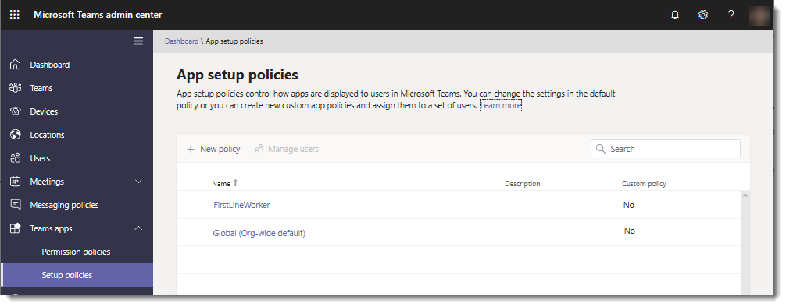

# Gestire i criteri di configurazione delle app in Microsoft TeamsManage app setup policies in Microsoft Teams

Gli amministratori possono usare i criteri di configurazione delle app per eseguire le attività seguenti:As an admin, you can use app setup policies to do the following tasks:

- Personalizzare Teams in modo da evidenziare le app più importanti per gli utenti.Customize Teams to highlight the apps that are most important for your users. Scegli le app da aggiungere e imposta l'ordine in cui vengono visualizzate.You choose the apps to pin and set the order that they appear. L'aggiunta di app consente di mostrare le app necessarie agli utenti dell'organizzazione, incluse le app create da terze parti o dagli sviluppatori dell'organizzazione.Pinning apps lets you showcase apps that users in your organization need, including apps built by third parties or by developers in your organization.
- Controllare se gli utenti possono aggiungere app a Teams.Control whether users can pin apps to Teams.
- Installare le app per conto degli utenti.Install apps on behalf of users. È possibile scegliere le app installate per impostazione predefinita per gli utenti all'avvio di Teams.You choose which apps are installed by default for users when they start Teams. Tenere presente che gli utenti possono comunque installare le app se i criteri di autorizzazione [dell'app](teams-app-permission-policies.md) assegnati lo consentono.Keep in mind that users can still install apps themselves if the [app permission policy](teams-app-permission-policies.md) that's assigned to them allows it.

> [!Note]
> Per le app installate dagli amministratori, gli utenti non possono disinstallare tali app.For apps installed by admins, users can't uninstall those apps.

Le app vengono aggiunte alla barra dell'app, ovvero la barra sul lato del client desktop di Teams e nella parte inferiore dei client mobili di Teams (iOS e Android).Apps are pinned to the app bar, which is the bar on the side of the Teams desktop client and at the bottom of the Teams mobile clients (iOS and Android).

|Client desktop di TeamsTeams desktop client  |Client per dispositivi mobili di TeamsTeams mobile client |
|---------|---------|
|   |         |

Per visualizzare le app installate dagli amministratori, nella barra dell'app gli utenti **selezionano ... Altre app** nei client desktop e Web di Teams e scorri verso l'alto nei client mobili.To see the apps installed by admins, in the app bar, users select **... More apps** in the Teams desktop and web clients and swipe up in the mobile clients.

I criteri di configurazione delle app vengono gestiti nell'interfaccia di amministrazione di Microsoft Teams.You manage app setup policies in the Microsoft Teams admin center. Usare i criteri globali (impostazione predefinita a livello di organizzazione) oppure creare e assegnare criteri personalizzati.Use the global (Org-wide default) policy or create and assign custom policies.  Gli utenti dell'organizzazione verranno assegnati automaticamente al criterio globale, a meno che non venga creato e assegnato un criterio personalizzato.Users in your organization will automatically get the global policy unless you create and assign a custom policy. Per gestire questi criteri, è necessario essere un amministratore globale o un amministratore del servizio Teams.You must be a global admin or Teams service admin to manage these policies.

Modificare le impostazioni nei criteri globali per includere le app desiderate.You edit the settings in the global policy to include the apps that you want. Per personalizzare Teams per diversi gruppi di utenti dell'organizzazione, creare e assegnare uno o più criteri personalizzati.To customize Teams for different groups of users in your organization, create and assign one or more custom policies.

> [!NOTE]
> Se si dispone di Teams per l'istruzione, è importante sapere che l'app Attività è aggiunta per impostazione predefinita nei criteri globali anche se attualmente non è elencata nei criteri globali.If you have Teams for Education, it's important to know that the Assignments app is pinned by default in the global policy even though currently, you don't see it listed in the global policy. Sarà la quarta app nell'elenco delle app aggiunte nei client di Teams.It will be the fourth app in the list of pinned apps on Teams clients.

## Creare criteri di configurazione dell'app personalizzatiCreate a custom app setup policy

È possibile usare l'interfaccia di amministrazione di Microsoft Teams per creare criteri personalizzati.You can use the Microsoft Teams admin center to create a custom policy.

1. Nel riquadro di spostamento sinistro dell'interfaccia di amministrazione di Microsoft Teams passare a Criteri di **configurazione delle app** di  >  **Teams.**In the left navigation of the Microsoft Teams admin center, go to **Teams apps** > **Setup policies**.

2. Selezionare **Aggiungi**.Select **Add**.

   

3. Immettere un nome e una descrizione per il criterio.Enter a name and description for the policy.

4. Attivare o disattivare **Carica app personalizzate,** a seconda che si voglia consentire agli utenti di caricare app personalizzate in Teams.Turn on or turn off **Upload custom apps**, depending on whether you want to let users upload custom apps to Teams. Non è possibile modificare questa impostazione se Consenti **app** di terze parti è disattivato nelle impostazioni dell'app a [livello di organizzazione.](manage-apps.md#manage-org-wide-app-settings)You can't change this setting if **Allow third-party apps** is turned off in [org-wide app settings](manage-apps.md#manage-org-wide-app-settings).

5. Attivare o disattivare **Consenti** l'aggiunta all'utente, a seconda che si voglia consentire agli utenti di personalizzare la barra dell'app aggiungendo app.Turn on or turn off **Allow user pinning**, depending on whether you want to let users personalize their app bar by pinning apps to it.

   > [!NOTE]
   > L'impostazione Consenti blocco utenti è disponibile nell'interfaccia di amministrazione di Teams negli ambienti GCC (Government Community Cloud) di Microsoft 365 (GCC, GCC High e DoD), ma attualmente non ha alcun effetto. The **Allow user pinning** setting is available in the Teams admin center in Microsoft 365 Government Community Cloud (GCC) environments (GCC, GCC High and DoD), but currently it has no effect.

6. Per installare le app per gli utenti, eseguire le attività seguenti:To install apps for users, do the following tasks:

    1. In **App installate** selezionare Aggiungi **app.**Under **Installed apps**, select **Add apps**.

    2. Nel riquadro **Aggiungi app installate** cercare le app da installare automaticamente per gli utenti all'avvio di Teams.In the **Add installed apps** pane, search for the apps you want to automatically install for users when they start Teams. È anche possibile filtrare le app in base ai criteri di autorizzazione delle app.You can also filter apps by app permission policy. Dopo aver scelto l'elenco di app, selezionare **Aggiungi**.When you've chosen your list of apps, select **Add**.

       

7. Per aggiungere app, eseguire la procedura seguente:To pin apps, do the following steps:

    1. In **App aggiunte** selezionare Aggiungi **app.**Under **Pinned apps**, select **Add apps**.

    2. Nel riquadro **Aggiungi app aggiunte** cercare le app da aggiungere e quindi selezionare **Aggiungi**.In the **Add pinned apps** pane, search for the apps you want to add, and then select **Add**. È anche possibile filtrare le app in base ai criteri di autorizzazione delle app.You can also filter apps by app permission policy. Dopo aver scelto l'elenco di app da aggiungere, selezionare **Aggiungi**.When you've chosen your list of apps to pin, select **Add**.

       

    3. Disporre le app nell'ordine in cui si vuole che vengano visualizzate in Teams e quindi selezionare **Salva**.Arrange the apps in the order that you want them to appear in Teams, and then select **Save**.

       

## Modificare i criteri di configurazione dell'appEdit an app setup policy

È possibile usare l'interfaccia di amministrazione di Microsoft Teams per modificare un criterio, inclusi i criteri globali (impostazione predefinita a livello di organizzazione) e i criteri personalizzati creati dall'utente.You can use the Microsoft Teams admin center to edit a policy, including the global (Org-wide default) policy and custom policies that you create.

1. Nel riquadro di spostamento sinistro dell'interfaccia di amministrazione di Microsoft Teams passare a Criteri di **configurazione delle app** di  >  **Teams.**In the left navigation of the Microsoft Teams admin center, go to **Teams apps** > **Setup policies**.

2. Selezionare il criterio facendo clic a sinistra del nome del criterio, quindi selezionare **Modifica**.Select the policy by clicking to the left of the policy name, and then select **Edit**.

3. Da lì, apportare le modifiche desiderate.From here, make the changes that you want.

4. Selezionare **Salva**.Select **Save**.

## Assegnare criteri di configurazione dell'app personalizzati agli utentiAssign a custom app setup policy to users

[!INCLUDE [assign-policy](includes/assign-policy.md)]

## Domande frequentiFAQ

### Uso dei criteri di configurazione delle appWorking with app setup policies

#### Quali criteri di configurazione delle app predefiniti sono inclusi nell'interfaccia di amministrazione di Microsoft TeamsWhat built-in app setup policies are included in the Microsoft Teams admin center

- **Globale (impostazione predefinita a livello di organizzazione):** questo criterio predefinito si applica a tutti gli utenti dell'organizzazione, a meno che non si assegni un altro criterio.**Global (Org-wide default)**: This default policy applies to all users in your organization unless you assign another policy. Modificare i criteri globali per aggiungere app più importanti per gli utenti.Edit the global policy to pin apps that are most important for your users.

- **FrontlineWorker:** questo criterio è per i frontline worker.**FrontlineWorker**: This policy is for Frontline Workers. È possibile assegnarlo ai Frontline Worker dell'organizzazione.You can assign it to Frontline Workers in your organization. È importante sapere che, come i criteri personalizzati creati dall'utente, è necessario assegnare il criterio agli utenti perché le impostazioni siano attive.It's important to know that like custom policies that you create, you have to assign the policy to users for the settings to be active. Per altre informazioni, vedere la sezione Assegnare un criterio di configurazione [dell'app](#assign-a-custom-app-setup-policy-to-users) personalizzato agli utenti di questo articolo.For more information, go to the [Assign a custom app setup policy to users](#assign-a-custom-app-setup-policy-to-users) section of this article.

#### Perché non si trova un'app nel riquadro Aggiungi app aggiunteWhy can't I find an app in the Add pinned apps pane

Non tutte le app possono essere aggiunte a Teams tramite un criterio di configurazione delle app.Not all apps can be pinned to Teams through an app setup policy. Alcune app potrebbero non supportare questa funzionalità.Some apps may not support this functionality. Per trovare le app che possono essere aggiunte, cercare l'app nel **riquadro Aggiungi app aggiunte.**To find apps that can be pinned, search for the app in the **Add pinned apps** pane. Le schede con ambito personale (schede statiche) e i bot possono essere aggiunte al client desktop di Teams e queste app sono disponibili nel riquadro **Aggiungi app aggiunte.**Tabs that have a personal scope (static tabs) and bots can be pinned to the Teams desktop client and these apps are available in the **Add pinned apps** pane.

Tenere presente che l'app Store di Teams elenca tutte le app di Teams.Keep in mind that the Teams app store lists all Teams apps. Il **riquadro Aggiungi app aggiunte** include solo le app che possono essere aggiunte a Teams tramite un criterio.The **Add pinned apps** pane includes only apps that can be pinned to Teams through a policy.

#### Sono un amministratore di Teams for Education. Informazioni sui criteri di configurazione delle app in Teams for EducationI'm a Teams for Education admin. What do I need to know about app setup policies in Teams for Education

L'app Chiamate non è disponibile in Teams per l'istruzione.The Calling app isn't available in Teams for Education. Quando si crea un nuovo criterio di configurazione dell'app personalizzato, l'app Chiamate viene visualizzata nell'elenco delle app.When you create a new custom app setup policy, the Calling app is displayed in the list of apps. Tuttavia, l'app non è aggiunta ai client di Teams e gli utenti di Teams per l'istruzione non vedono l'app Chiamate in Teams.However, the app isn't pinned to Teams clients and Teams for Education users won't see the Calls app in Teams.

#### Quante app aggiunte possono essere aggiunte a un criterioHow many pinned apps can be added to a policy

È necessario aggiungere almeno due app ai client mobili di Teams (iOS e Android).A minimum of two apps must be pinned to the Teams mobile clients (iOS and Android). Se un criterio ha meno di due app, i client mobili non rifletteranno le impostazioni dei criteri e continueranno invece a usare la configurazione esistente.If a policy has fewer than two apps, the mobile clients won't reflect the policy settings and instead will continue to use the existing configuration.

Non ci sono limiti al numero di app aggiunte che è possibile aggiungere a un criterio.There's no limit on the number of pinned apps you can add to a policy.

#### Quanto tempo è necessario per l'applicazione delle modifiche ai criteriHow long does it take for policy changes to take effect

La modifica o l'assegnazione di un criterio potrà richiedere alcune ore.After you edit or assign a policy, it can take a few hours for changes to take effect.

### Esperienza utenteUser experience

#### Come possono gli utenti vedere tutte le app aggiunte in TeamsHow can users see all their pinned apps in Teams

Per visualizzare tutte le app aggiunte per un utente, gli utenti potrebbero dover eseguire le operazioni seguenti a seconda del numero di app installate e delle dimensioni della finestra del client di Teams.To view all apps that are pinned for a user, users might have to do the following depending on the number of installed apps and the size of their Teams client window.

|Client desktop di TeamsTeams desktop client |Client per dispositivi mobili di TeamsTeams mobile client |
|---------|---------|
|Nella barra dell'app sul lato di Teams seleziona **... Altre app**.In the app bar on the side of Teams, select **... More apps**.| Nella barra dell'app nella parte inferiore di Teams scorrere rapidamente verso l'alto.In the app bar near the bottom of Teams, swipe up.|
|    |  

#### Cosa c'è da sapere sull'esperienza di Teams per dispositivi mobiliWhat do I need to know about the Teams mobile experience

I client mobili di Teams (iOS e Android) attualmente non supportano le app personali con schede statiche.The Teams mobile clients (iOS and Android) currently don't support personal apps with static tabs. A seconda delle app impostate nel criterio, le app aggiunte al client desktop di Teams potrebbero non essere visualizzate nei client mobili di Teams.Depending on the apps set in the policy, apps pinned to the Teams desktop client might not appear in the Teams mobile clients. I bot personali verranno comunque visualizzati in Chat sui client mobili.Personal bots will still appear in Chat on mobile clients.

Con i client di Teams per dispositivi mobili, gli utenti potranno vedere le app principali di Teams, come Attività, Chat e Teams, ed è possibile aggiungere alcune app di prima parte da Microsoft, ad esempio Turni.With the Teams mobile clients, users will see core Teams apps such as Activity, Chat, and Teams, and you can pin some first-party apps from Microsoft, such as Shifts.

#### Gli utenti possono modificare l'ordine delle app aggiunte tramite un criterioCan users change the order of apps pinned through a policy

Gli utenti possono modificare l'ordine delle app aggiunte nei client desktop e mobili di Teams se l'opzione Consenti **blocco** utenti è attivata.Users can change the order of their pinned apps on Teams desktop and mobile clients if the **Allow user pinning** option is turned on. Gli utenti non possono modificare l'ordine delle app aggiunte nei client Web di Teams.Users can't change the order of their pinned apps on Teams web clients.

#### Il blocco degli utenti ha la precedenzaDoes user pinning take precedence

I pin di amministratore hanno sempre la precedenza.Admin pins always take precedence. Se **l'opzione Consenti aggiunta utenti** è attivata, gli utenti manterranno le app aggiunte sotto le app aggiunte dall'amministratore.If the **Allow user pinning** option is turned on, then users will retain their pinned apps below admin pinned apps. Se **l'opzione** Consenti blocco utenti è disattivata, gli utenti perderanno i pin preesistnti e nella barra dell'app saranno presenti solo le app aggiunte dall'amministratore.If the **Allow user pinning** option is turned off, then users will lose their pre-existing pins, and only admin-pinned apps will be present in the app bar.

### App di Teams personalizzateCustom Teams apps

L'organizzazione ha creato un'app Teams personalizzata e l'ha pubblicata, in AppSource o nel catalogo app tenant, ma l'icona dell'app non viene visualizzata come previsto quando l'app viene aggiunta alla barra dell'app in Teams.My organization built a custom Teams app and published it, either to AppSource or the tenant app catalog, but the app icon isn't displayed as expected when the app is pinned to the app bar in Teams. Come si risolve il problemaHow do I fix it

Assicurarsi di seguire le linee guida del logo prima di inviare l'app.Make sure that you follow the logo guidelines before you submit the app. Per altre informazioni, vedere Elenco [di controllo per l'invio del dashboard del venditore.](/microsoftteams/platform/concepts/deploy-and-publish/appsource/prepare/overview)To learn more, see [Checklist for Seller Dashboard submission](/microsoftteams/platform/concepts/deploy-and-publish/appsource/prepare/overview).

## Argomenti correlatiRelated topics

[Impostazioni di amministrazione per le app in TeamsAdmin settings for apps in Teams](admin-settings.md)

[Assegnare i criteri agli utenti in TeamsAssign policies to your users in Teams](assign-policies.md)
