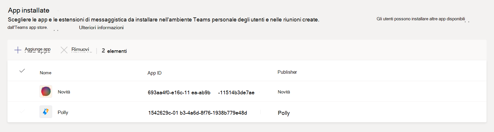

# Gestire i criteri di configurazione delle app in Microsoft Teams

Gli amministratori possono usare i criteri di configurazione delle app per installare e aggiungere app per promuovere le app più usate nell'organizzazione e per decidere se gli utenti devono caricare app personalizzate in Teams.

- **Aggiungere app:** i criteri di configurazione delle app consentono di scegliere le app da aggiungere, impostare l'ordine in cui vengono visualizzati per gli utenti e controllare se gli utenti possono o meno aggiungere le proprie app alla barra dell'app Teams. Per altre informazioni, vedere [Aggiungere app.](#pin-apps)
- **Installare app: i** criteri di configurazione delle app consentono di installare le app per conto degli utenti quando iniziano Teams e durante le riunioni. Per altre informazioni, vedere [Installare le app.](#install-apps)
- **Upload app personalizzate: i** criteri di configurazione delle app consentono agli utenti di caricare app personalizzate in Teams. Per altre informazioni, vedere Upload [app personalizzate.](#upload-custom-apps)

## Aggiungere app

L'aggiunta di app consente di mostrare le app necessarie agli utenti dell'organizzazione, incluse le app create da terze parti o dagli sviluppatori dell'organizzazione.

Usando i criteri di configurazione dell'app, è possibile eseguire le attività seguenti:

- Personalizzare Teams in modo da evidenziare le app più importanti per gli utenti. Scegli le app da aggiungere e imposta l'ordine in cui vengono visualizzate.
- Controllare se gli utenti possono aggiungere app a Teams.

Le app vengono aggiunte alla barra dell'app, ovvero la barra sul lato del client desktop di Teams e nella parte inferiore dei client mobili Teams (iOS e Android).

|Client desktop di Teams  |Client per dispositivi mobili di Teams |
|---------|---------|
|   |         |

> [!NOTE]
> Se si ha Teams per l'istruzione, è importante sapere che l'app Assegnazioni è bloccata per impostazione predefinita nei criteri globali anche se attualmente non è elencata nei criteri globali. Sarà la quarta app nell'elenco delle app aggiunte Teams client.

Per creare un criterio di configurazione dell'app per aggiungere le app, eseguire la procedura seguente:

1. Nel riquadro di spostamento sinistro dell'interfaccia Microsoft Teams di amministrazione passare a Criteri di Teams **di configurazione**  >  **delle app.**

2. Selezionare **Aggiungi**.

3. Immettere un nome e una descrizione per il criterio.

4. Attivare o disattivare **Consenti** l'aggiunta di utenti, a seconda che si desideri consentire agli utenti di personalizzare la barra dell'app aggiungendo app.

   > [!NOTE]
   > L'impostazione Consenti blocco utenti è disponibile nell'interfaccia di amministrazione di Teams in ambienti Microsoft 365 Government Community Cloud (GCC) (GCC, GCC High e DoD), ma attualmente non ha alcun effetto. 

5. In **App aggiunte** selezionare Aggiungi **app.**

6. Nel riquadro **Aggiungi app aggiunte** cercare le app da aggiungere e quindi selezionare **Aggiungi**. È anche possibile filtrare le app in base ai criteri di autorizzazione delle app.

7. Selezionare **Aggiungi**.

8. Disporre le app nell'ordine in cui si vuole che vengano visualizzate Teams.

   

9. Selezionare **Salva**.

## Installare le app

È possibile scegliere le app installate per impostazione predefinita per gli utenti nell'ambiente di Teams personale, installare le app come estensioni di messaggistica e designare le app da installare nelle riunioni.

Usando i criteri di configurazione dell'app, è possibile eseguire le attività seguenti:

- Installare app per gli utenti nell'ambiente Teams personale
- Installare le app per gli utenti come estensioni di messaggistica
- Installare app nelle riunioni per gli organizzatori delle riunioni

> [!NOTE]
> Gli utenti possono comunque installare le app se i criteri di autorizzazione [dell'app](teams-app-permission-policies.md) assegnati lo consentono.

Per creare un criterio di configurazione dell'app per installare le app, eseguire la procedura seguente:

1. Nel riquadro di spostamento sinistro dell'interfaccia Microsoft Teams di amministrazione passare a Criteri di Teams **di configurazione**  >  **delle app.**

2. Selezionare **Aggiungi**.

3. Immettere un nome e una descrizione per il criterio.

4. In **App installate** selezionare Aggiungi **app.**

5. Nel riquadro **Aggiungi app installate** cercare le app da installare automaticamente per gli utenti. È anche possibile filtrare le app in base ai criteri di autorizzazione delle app.

6. Selezionare **Aggiungi**.

> [!IMPORTANT]
> Gli utenti non possono disinstallare le app installate dagli amministratori.

## Upload app personalizzate

È possibile usare l'Microsoft Teams di amministrazione per creare criteri personalizzati che consentano agli utenti di caricare app personalizzate in Teams.

Per creare criteri di configurazione dell'app per consentire agli utenti di caricare app personalizzate in Teams, eseguire la procedura seguente:

1. Nel riquadro di spostamento sinistro dell'interfaccia Microsoft Teams di amministrazione passare a Criteri di Teams **di configurazione**  >  **delle app.**

2. Selezionare **Aggiungi**.

3. Immettere un nome e una descrizione per il criterio.

4. Attivare o disattivare Upload **app** personalizzate, a seconda che si desideri consentire agli utenti di caricare app personalizzate Teams.

> [!NOTE]
> Non è possibile modificare questa impostazione se Consenti **app** di terze parti è disattivato nelle impostazioni dell'app a [livello di organizzazione.](manage-apps.md#manage-org-wide-app-settings)

## Gestire i criteri di configurazione delle app

I criteri di configurazione delle app vengono gestiti nell'Microsoft Teams di amministrazione. Usare i criteri globali (impostazione predefinita a livello di organizzazione) oppure creare e assegnare criteri personalizzati.  Gli utenti dell'organizzazione verranno assegnati automaticamente al criterio globale, a meno che non venga creato e assegnato un criterio personalizzato. Per gestire questi criteri, è necessario essere un amministratore globale o un amministratore del servizio Teams.

Modificare le impostazioni nei criteri globali per includere le app desiderate. Per personalizzare Teams per diversi gruppi di utenti dell'organizzazione, creare e assegnare uno o più criteri personalizzati.

### Modificare i criteri di configurazione dell'app

È possibile usare l'interfaccia Microsoft Teams di amministrazione per modificare un criterio, inclusi i criteri globali (impostazione predefinita a livello di organizzazione) e i criteri personalizzati creati dall'utente.

1. Nel riquadro di spostamento sinistro dell'interfaccia Microsoft Teams di amministrazione passare a Criteri di Teams **di configurazione**  >  **delle app.**

2. Scegliere il criterio da modificare e quindi selezionare **Modifica.**

3. Apportare le modifiche desiderate.

4. Selezionare **Salva**.

### Assegnare criteri di configurazione dell'app personalizzati agli utenti

Per altre informazioni sull'assegnazione di criteri agli utenti, vedere [Assegnare criteri a utenti e gruppi.](assign-policies-users-and-groups.md)

## Domande frequenti

### Uso dei criteri di configurazione delle app

#### È possibile assegnare un criterio di configurazione dell'app a un gruppo

I criteri di configurazione delle app possono essere assegnati ai gruppi usando PowerShell. Per altre informazioni sull'assegnazione di criteri ai gruppi tramite PowerShell, vedere [Assegnare criteri a utenti e gruppi.](assign-policies-users-and-groups.md#use-the-powershell-option)

#### Quali criteri di configurazione delle app predefiniti sono inclusi nell'Microsoft Teams di amministrazione

- **Globale (impostazione predefinita a livello di organizzazione):** questo criterio predefinito si applica a tutti gli utenti dell'organizzazione, a meno che non si assegni un altro criterio. Modificare i criteri globali per aggiungere app più importanti per gli utenti.

- **FrontlineWorker:** questo criterio è per i lavoratori in prima linea. È possibile assegnarlo ai Frontline Worker dell'organizzazione. È importante sapere che, come i criteri personalizzati creati dall'utente, è necessario assegnare il criterio agli utenti perché le impostazioni siano attive. Per altre informazioni, vedere la sezione Assegnare un criterio di configurazione [dell'app](#assign-a-custom-app-setup-policy-to-users) personalizzato agli utenti di questo articolo.

#### Perché non si trova un'app nel riquadro Aggiungi app aggiunte

Non tutte le app possono essere aggiunte a Teams tramite un criterio di configurazione dell'app. Alcune app potrebbero non supportare questa funzionalità. Per trovare le app che possono essere aggiunte, cercare l'app nel **riquadro Aggiungi app aggiunte.** Le schede con ambito personale (schede statiche) e bot possono essere aggiunte al client desktop di Teams e queste app sono disponibili nel riquadro Aggiungi **app aggiunte.**

Tenere presente che l'app store Teams elenca tutte Teams app. Il **riquadro Aggiungi app aggiunte** include solo app che possono essere aggiunte a Teams tramite un criterio.

#### Sono un amministratore Teams per l'istruzione. Informazioni sui criteri di configurazione delle app in Teams per l'istruzione

L'app Chiamate non è disponibile in Teams per l'istruzione. Quando si crea un nuovo criterio di configurazione dell'app personalizzato, l'app Chiamate viene visualizzata nell'elenco delle app. Tuttavia, l'app non viene aggiunta ai client Teams e Teams per l'istruzione gli utenti non vedono l'app Chiamate in Teams.

#### Quante app aggiunte possono essere aggiunte a un criterio

È necessario aggiungere almeno due app ai client Teams per dispositivi mobili (iOS e Android). Se un criterio include meno di due app, i client mobili non rifletteranno le impostazioni dei criteri e continueranno invece a usare la configurazione esistente.

Non ci sono limiti al numero di app aggiunte che è possibile aggiungere a un criterio.

#### Quanto tempo è necessario per l'applicazione delle modifiche ai criteri

La modifica o l'assegnazione di un criterio potrà richiedere alcune ore.

### Esperienza utente

#### Come possono gli utenti vedere tutte le app aggiunte in Teams

Per visualizzare tutte le app aggiunte per un utente, gli utenti potrebbero dover eseguire le operazioni seguenti a seconda del numero di app installate e delle dimensioni della finestra del client Teams client.

|Client desktop di Teams |Client per dispositivi mobili di Teams |
|---------|---------|
|Nella barra dell'app sul lato Teams selezionare **... Altre app**.| Nella barra dell'app nella parte inferiore del Teams scorrere rapidamente verso l'alto.|
|    |  

#### Cosa c'è da sapere sull'esperienza Teams per dispositivi mobili

I Teams per dispositivi mobili (iOS e Android) supportano le app personali con schede statiche. Le app aggiunte al Teams desktop verranno visualizzate nel Teams per dispositivi mobili. I bot personali verranno visualizzati in Chat sui client mobili.

Le app di terze parti (che possono essere scaricate da Teams Store) devono essere approvate prima di essere mostrate su un dispositivo mobile. Se un amministratore aggiunge un'app, che non viene approvata da Microsoft per dispositivi mobili, verrà visualizzata nel desktop di Teams, ma non su un dispositivo mobile. Per [altre informazioni, vedere](/microsoftteams/platform/tabs/what-are-tabs#mobile-clients) Client per dispositivi mobili.

Con i client Teams per dispositivi mobili, gli utenti potranno vedere le app di base Teams come Attività, Chat e Teams e aggiungere alcune app di prima parte da Microsoft, ad esempio Turni.

#### Gli utenti possono modificare l'ordine delle app aggiunte tramite un criterio

Gli utenti possono modificare l'ordine delle app aggiunte Teams client  desktop e per dispositivi mobili se l'opzione Consenti blocco utenti è attivata. Gli utenti non possono modificare l'ordine delle app aggiunte nei client Teams Web.

#### Il blocco degli utenti ha la precedenza

I pin di amministratore hanno sempre la precedenza. Se **l'opzione Consenti aggiunta utenti** è attivata, gli utenti manterranno le app aggiunte sotto le app aggiunte dall'amministratore. Se **l'opzione** Consenti aggiunta utenti è disattivata, gli utenti perderanno i pin preesistnti e nella barra dell'app saranno presenti solo le app aggiunte dall'amministratore.

### App Teams personalizzate

#### L'organizzazione ha creato un'app Teams personalizzata e l'ha pubblicata in AppSource o nel catalogo app tenant, ma l'icona dell'app non viene visualizzata come previsto quando l'app viene aggiunta alla barra dell'app in Teams. Come si risolve il problema

Assicurarsi di seguire le linee guida del logo prima di inviare l'app. Per altre informazioni, vedere Elenco [di controllo per l'invio del dashboard del venditore.](/microsoftteams/platform/concepts/deploy-and-publish/appsource/prepare/overview)

## Argomenti correlati

[Impostazioni di amministrazione per le app in Teams](admin-settings.md)

[Assegnare i criteri agli utenti in Teams](assign-policies-users-and-groups.md)
