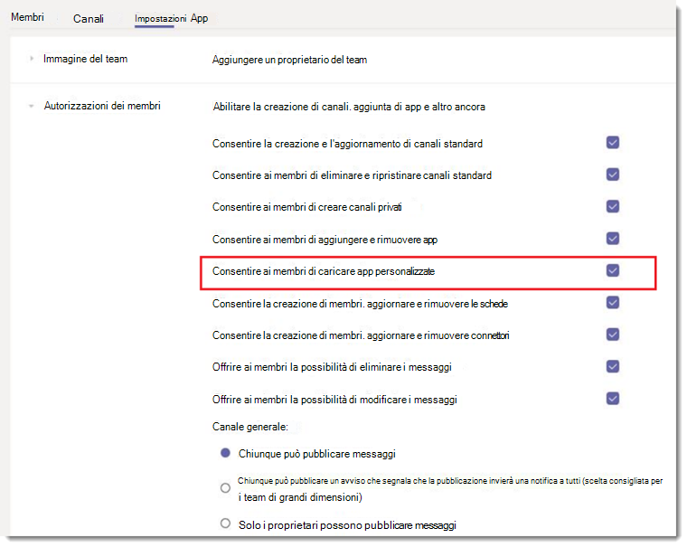
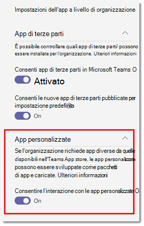

# Gestire le impostazioni e i criteri delle app personalizzati in Microsoft Teams

> [!NOTE]
> Per usare App Studio, vedere Introduzione alla piattaforma [Microsoft Teams con C#/.NET](/microsoftteams/platform/get-started/get-started-dotnet-app-studio) e App Studio L'ultimo passaggio non funziona ancora, quindi è necessario scaricare il file ZIP e installarlo nel vecchio modo in Upload un pacchetto [dell'app Microsoft Teams](/microsoftteams/platform/concepts/apps/apps-upload).

Gli amministratori possono usare criteri e impostazioni delle app personalizzati per controllare chi nell'organizzazione può caricare app personalizzate in Microsoft Teams. Gli amministratori decidono quali utenti possono caricare app personalizzate e gli amministratori e i proprietari dei team possono determinare se specifici team dell'organizzazione consentono l'aggiunta di app personalizzate.  Dopo aver modificato i criteri dell'app personalizzata, l'applicazione delle modifiche può richiedere alcune ore. Per gestire questi criteri, è necessario essere un amministratore globale o un amministratore del servizio Teams.

## Panoramica delle app personalizzate

Gli utenti possono aggiungere un'app personalizzata a Teams caricando un pacchetto dell'app (in un file .zip) direttamente in un team o nel contesto personale. Questo è diverso dal modo in cui le app vengono aggiunte tramite Teams app store. L'aggiunta di un'app personalizzata caricando un pacchetto dell'app, noto anche come sideload, consente di testare un'app durante lo sviluppo, prima che sia pronta per essere ampiamente distribuita. Consente anche di creare un'app solo per uso interno e condividerla con il team senza inviarla al catalogo app di Teams nell'app store Teams.

## Criteri e impostazioni dell'app personalizzati

Tre componenti determinano se un utente può caricare un'app personalizzata in un team, con un controllo granulare su chi può aggiungere app personalizzate a un team e a quali app personalizzate dei team può essere aggiunto:

- [Criteri per le app personalizzate dell'utente](#user-custom-app-policy)
- [Impostazione dell'app personalizzata del team](#team-custom-app-setting)
- [Impostazione dell'app personalizzata a livello di organizzazione](#org-wide-custom-app-setting)

Queste impostazioni non influiscono sulla possibilità di bloccare le app di terze parti.  

### Criteri per le app personalizzate dell'utente

Nell'ambito dei criteri di configurazione delle [app,](teams-app-setup-policies.md)gli amministratori possono usare un'impostazione dei criteri, Upload **app** personalizzate, per controllare se un utente può caricare app personalizzate in Teams.
 
Se questa impostazione è disattivata:

- L'utente non può caricare un'app personalizzata in un team dell'organizzazione o nel contesto personale.
- L'utente può interagire con le app personalizzate, a seconda dell'impostazione dell'app personalizzata a livello di organizzazione.

Se questa impostazione è attivata:

- L'utente può caricare app personalizzate nei team che lo consentono e nei team di cui sono proprietari, a seconda dell'impostazione dell'app personalizzata a livello di organizzazione.
- L'utente può caricare app personalizzate nel contesto personale. 
- L'utente può interagire con le app personalizzate, a seconda dell'impostazione dell'app personalizzata a livello di organizzazione.

È possibile modificare le impostazioni nei criteri di configurazione delle app globali per includere le app desiderate. Se si vogliono personalizzare i criteri Teams gruppi di utenti dell'organizzazione, creare e assegnare uno o più criteri di configurazione delle app personalizzati.

#### Impostare criteri dell'app personalizzati per l'utente

1. Nel riquadro di spostamento sinistro dell'interfaccia Microsoft Teams di amministrazione passare a Criteri Teams **configurazione**  >  **delle app.**
2. Fare clic su **Aggiungi**.
3. Attivare o disattivare Upload **app personalizzate.**
4. Scegliere le altre impostazioni desiderate per il criterio.
5. Fare clic su **Salva**.

### Impostazione dell'app personalizzata del team

Gli amministratori e i proprietari del team possono controllare se un team consente l'aggiunta di app personalizzate. Questa impostazione, Consenti ai **membri di caricare app** personalizzate, insieme ai criteri delle app personalizzate di un utente determina chi può aggiungere app personalizzate a un determinato team.
 
Se questa impostazione è disattivata:

- I proprietari del team possono aggiungere app personalizzate, se i criteri delle app personalizzate lo consentono.
- I membri del team che non sono proprietari del team non possono aggiungere app personalizzate al team.

Se questa impostazione è attivata:

- I proprietari del team possono aggiungere app personalizzate, se i criteri dell'app personalizzati lo consentono.
- I membri del team che non sono proprietari del team possono aggiungere app personalizzate, se i criteri delle app personalizzati lo consentono.

#### Configurare l'impostazione dell'app personalizzata del team

1. In Teams passare al team e fare clic su **Altre opzioni ̇ ̇ ̇** Gestisci  >  **team.**
2. Fare **clic Impostazioni** e quindi espandere Autorizzazioni **membri.**
3. Selezionare o deselezionare la **casella di controllo Consenti ai membri di caricare app** personalizzate.

    

### Impostazione dell'app personalizzata a livello di organizzazione

**L'impostazione** Consenti interazione con app personalizzate  a livello di organizzazione nella pagina Gestisci app si applica a tutti gli utenti dell'organizzazione e determina se possono caricare o interagire con le app personalizzate. Questa impostazione funge da interruttore di attivazione/disattiva master per le impostazioni dei criteri delle app personalizzate dell'utente e del team. È destinato a fungere da interruttore master di attivazione/disattiva durante gli eventi di sicurezza. Di conseguenza, le impostazioni dei criteri delle app personalizzate di utenti e team non avranno effetto a meno che non sia abilitata l'impostazione dell'app personalizzata a livello di organizzazione, anche se sono abilitate le impostazioni dei criteri delle app personalizzate per utenti e team.

#### Configurare l'impostazione dell'app personalizzata a livello di organizzazione

1. Nel riquadro di spostamento sinistro dell'interfaccia di amministrazione di Microsoft Teams, passare ad **App di Teams** > **Gestisci app**.
2. Fare clic **su Impostazioni dell'app a livello di organizzazione.**
3. In **App personalizzate** attivare o disattivare Consenti interazione con app **personalizzate.**

    

## Modalità di collaborazione tra criteri e impostazioni delle app personalizzate

Questa tabella riepiloga i criteri e le impostazioni delle app personalizzate, il modo in cui funzionano insieme e il loro effetto combinato sul controllo degli utenti dell'organizzazione che possono caricare app personalizzate in Teams.

Si supponga, ad esempio, di voler consentire solo ai proprietari dei team di caricare app personalizzate in team specifici. È necessario impostare quanto segue:

- Attivare **l'impostazione Consenti interazione con le app personalizzate** nell'Microsoft Teams di amministrazione.
- Disattivare **l'opzione Consenti ai membri di caricare app personalizzate** per ogni team a cui si vuole limitare l'accesso.
- Creare e assegnare criteri di configurazione delle app personalizzati  nell'interfaccia di amministrazione di Microsoft Teams con l'impostazione delle app personalizzate Upload attivata e assegnarla ai proprietari del team.

|Impostazione dell'app personalizzata a livello di organizzazione |Impostazione dell'app personalizzata del team |Criteri per le app personalizzate dell'utente |Effetto  |
|---------|---------|---------|---------|
| Disattivato    | Disattivato    | Disattivato     |L'interazione con tutte le app personalizzate è bloccata per l'organizzazione. Le app personalizzate non possono essere caricate da altri utenti tranne un amministratore Teams o un amministratore globale. È possibile usare PowerShell per rimuovere l'app personalizzata.   |
| Disattivato     | Disattivato     | Attivato        |L'interazione con tutte le app personalizzate è bloccata per l'organizzazione. Le app personalizzate non possono essere caricate da altri utenti tranne un amministratore Teams o un amministratore globale. È possibile usare PowerShell per rimuovere l'app personalizzata.         |
| Disattivato    | Attivato        | Disattivato        |L'interazione con tutte le app personalizzate è bloccata per l'organizzazione. Le app personalizzate non possono essere caricate da altri utenti tranne un amministratore Teams o un amministratore globale. È possibile usare le Windows PowerShell per eliminare app personalizzate.         |
| Disattivato    | Attivato      | Attivato       |L'interazione con tutte le app personalizzate è bloccata per l'organizzazione. Le app personalizzate non possono essere caricate da altri utenti tranne un amministratore Teams o un amministratore globale. È possibile usare PowerShell per rimuovere l'app personalizzata.         |
| Attivato    | Disattivato       | Disattivato         |  L'utente non può caricare app personalizzate.      |
| Attivato     | Disattivato       | Attivato         | Se l'utente è il proprietario del team, può caricare app personalizzate nel team. Se l'utente non è un proprietario del team, non può caricare app personalizzate nel team. L'utente può caricare app personalizzate nel contesto personale.     |
| Attivato     | Attivato     | Disattivato         | L'utente non può caricare app personalizzate.       |
| Attivato    | Attivato        | Attivato        | L'utente può caricare app personalizzate nel team, indipendentemente dal fatto che l'utente sia il proprietario del team. L'utente può caricare app personalizzate nel contesto personale.       |

## Argomenti correlati

[Impostazioni di amministrazione per le app in Teams](admin-settings.md)

[Assegnare i criteri agli utenti in Teams](assign-policies-users-and-groups.md)