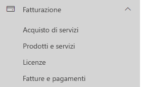
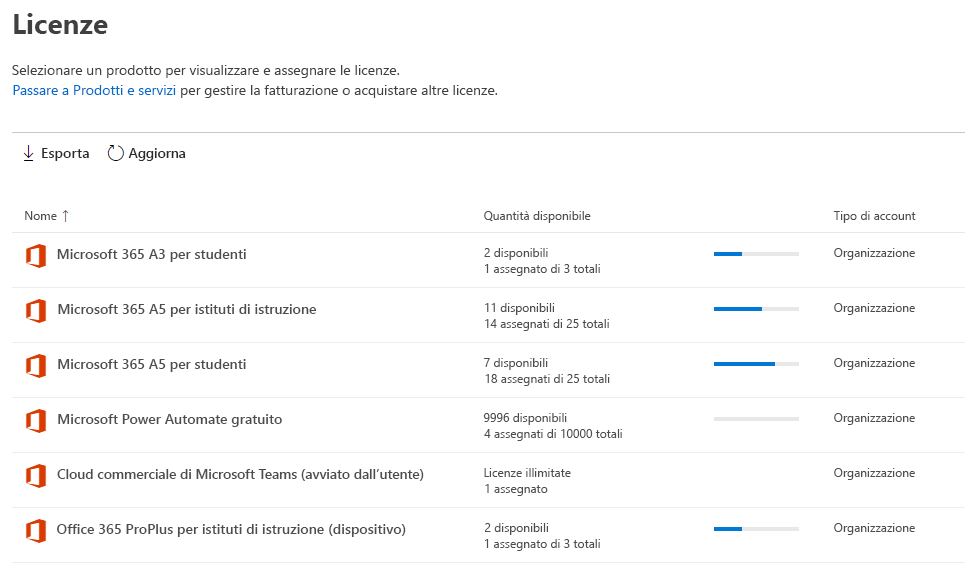
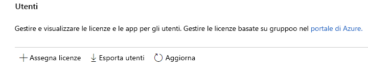
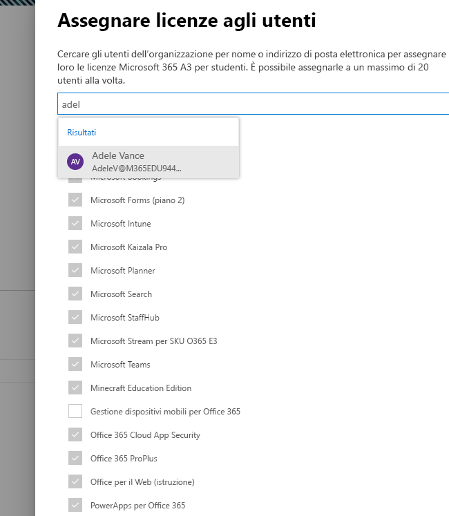
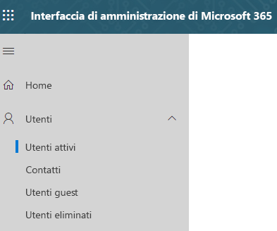
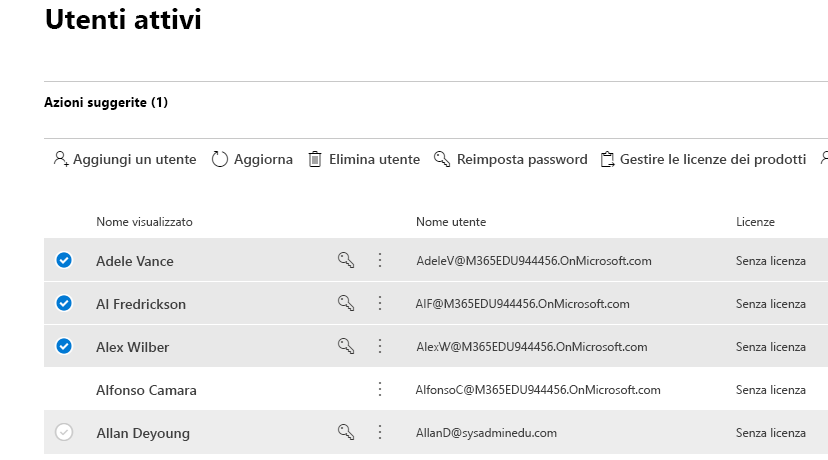
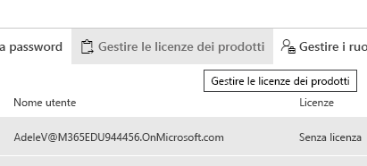
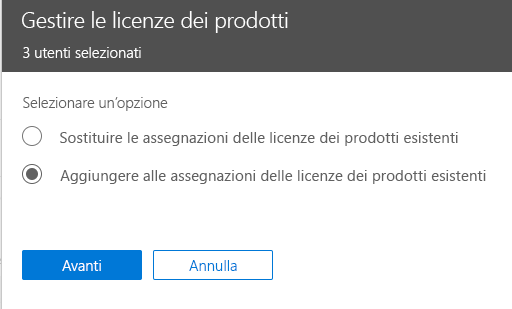
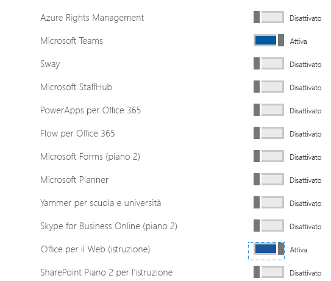

# Assegnare licenze di Microsoft Teams per l'istruzione

Microsoft Teams è un hub digitale che raggruppa conversazioni, contenuti e app in un'unica posizione. Perché è basato su Office 365, gli istituti di istruzione traggono vantaggio dall'integrazione con le ben note app e i servizi di Office. Gli istituti possono usare Microsoft Teams per creare classi collaborative, connettersi a comunità di formazione professionale e comunicare con il personale scolastico, tutto in un'unica posizione in Office 365 per l'istruzione.

Per iniziare, gli amministratori IT devono usare l'interfaccia di amministrazione di Microsoft 365 per [abilitare Microsoft Teams per l'istituto di istruzione](/microsoft-365/education/intune-edu-trial/enable-microsoft-teams).
Fatto questo, è necessario assegnare le licenze agli account utente in modo che la facoltà, il personale e gli studenti possano accedere ai servizi di Office 365, come Microsoft Teams.

È possibile assegnare licenze agli account utente singolarmente oppure automaticamente mediante l'appartenenza a gruppi. Questo articolo illustra come assegnare le licenze di Office 365 a un singolo o a un piccolo set di account utente tramite l'interfaccia di amministrazione di Microsoft 365. Per assegnare automaticamente licenze tramite l'appartenenza a gruppi, vedere uno degli articoli seguenti:

- [PowerShell di Office 365](/office365/enterprise/powershell/assign-licenses-to-user-accounts-with-office-365-powershell)
- [Licenze basate sui gruppi in Active Directory](/azure/active-directory/users-groups-roles/licensing-groups-assign)

È possibile assegnare licenze agli utenti nella pagina **Licenze** o nella pagina **Utenti attivi**. Il metodo da usare varia a seconda che si vogliano assegnare licenze di prodotto a utenti specifici o assegnare licenze utente a prodotti specifici.

> [!NOTE]
> Se non si usa la nuova interfaccia di amministrazione di Microsoft 365, è possibile attivarla selezionando l'opzione **Prova la nuova interfaccia di amministrazione** che si trova nella parte superiore della home page.

## Assegnare licenze agli utenti nella pagina Licenze

> [!NOTE]
> È necessario essere un amministratore globale, un amministratore di fatturazione, un amministratore delle licenze o un amministratore di gestione degli utenti. Per altre informazioni, vedere [Informazioni sui ruoli di amministratore di Office 365](/microsoft-365/admin/add-users/about-admin-roles).

Dalla pagina **Licenze** si assegnano licenze per un prodotto specifico per un massimo di 20 utenti. Nella pagina **Licenze** viene visualizzato un elenco di tutti i prodotti per i quali si dispone di un abbonamento, oltre al totale di licenze per ogni prodotto, al numero di licenze assegnate e al numero di quelle disponibili.

1. Nell'interfaccia di amministrazione passare alla pagina **Fatturazione** > [Licenze](https://go.microsoft.com/fwlink/p/?linkid=842264).

   
2. Selezionare un prodotto per cui si vogliono assegnare le licenze. Microsoft Teams fa parte dello SKU gratuito di Office 365 A1 per studenti.

   
3. Selezionare **Assegna licenze**.

   
4. Nel riquadro **Assegna licenze agli utenti** iniziare a digitare un nome. Dovrebbe essere visualizzato un elenco di nomi. Scegliere il nome che si sta cercando dai risultati per aggiungerlo all'elenco. È possibile aggiungere fino a 20 utenti per volta.

   
5. Selezionare **Abilita o disabilita le app e i servizi** per assegnare o rimuovere l'accesso a elementi specifici, ad esempio Microsoft Teams. Verificare che **Microsoft Teams** e **Office per il Web (istruzione)** siano selezionati.
6. Al termine, selezionare **Assegna**, quindi selezionare **Chiudi**.

Per modificare le app e i servizi a cui un utente ha accesso:

1. Selezionare la riga che contiene l'utente.
1. Nel riquadro destro selezionare o deselezionare le app e i servizi per i quali si vuole consentire o rimuovere l'accesso.
1. Al termine, selezionare **Salva**, quindi selezionare **Chiudi**.

## Assegnare licenze a un singolo utente o a più utenti nella pagina Utenti attivi

1. Nell'interfaccia di amministrazione passare alla pagina **Utenti** > [Utenti attivi](https://go.microsoft.com/fwlink/p/?linkid=834822).

   
2. Selezionare i cerchi accanto ai nomi degli utenti a cui si vogliono assegnare le licenze.

   
3. Nella parte superiore selezionare **Gestisci licenze prodotto**.

   
4. Nel riquadro **Gestisci licenze prodotto** selezionare **Aggiungi ad assegnazioni licenze prodotto esistenti** > **Avanti**.

   
5. Nel riquadro **Aggiungi a prodotti esistenti** impostare sulla posizione **Attivata** l'interruttore relativo alla licenza che si vuole assegnare agli utenti selezionati. Verificare che **Microsoft Teams** e **Office per il Web (istruzione)** siano selezionati.

   

   Per impostazione predefinita, tutti i servizi associati a tali licenze vengono automaticamente assegnati agli utenti. È possibile limitare i servizi disponibili per gli utenti. Impostare sulla posizione **Disattivata** gli interruttori relativi ai servizi che non si vogliono assegnare agli utenti.
6. Nella parte inferiore del riquadro selezionare Aggiungi > Chiudi.