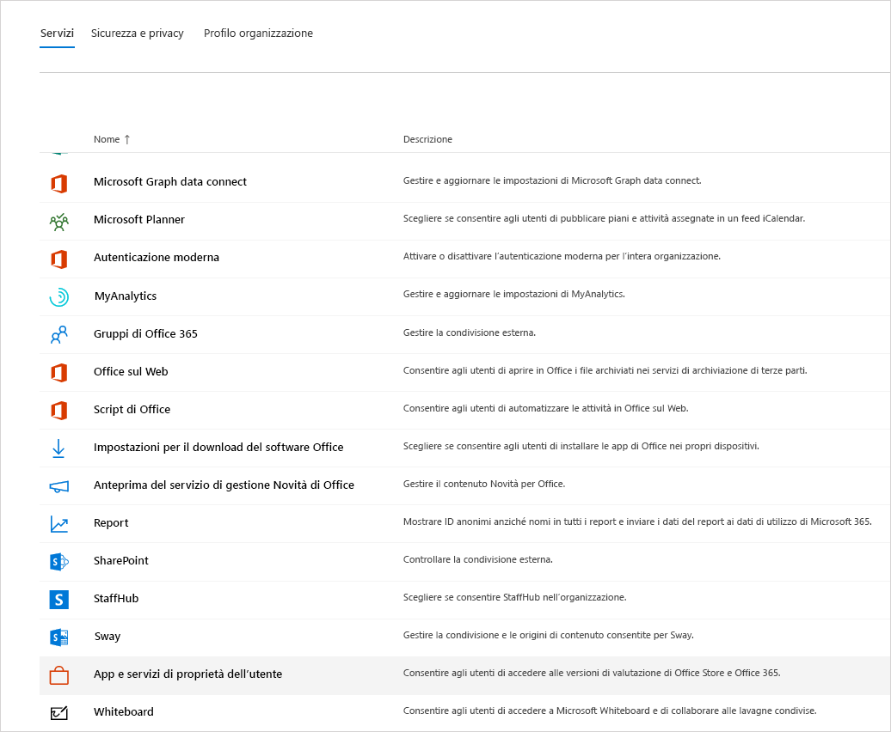
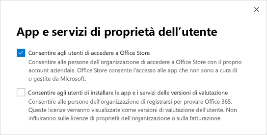

Gestire la licenza di Microsoft Teams Exploratory
=======================================================

L'esperienza Microsoft Teams Exploratory consente agli utenti dell'organizzazione che hanno Azure Active Directory (AAD) e non hanno una licenza per Teams di iniziare a usare un'esperienza esplorativa di Teams. Gli amministratori possono attivare o disattivare questa funzionalità per gli utenti nell'organizzazione. L'esperienza Teams Exploratory ha sostituito la precedente [Microsoft Commercial Cloud Trial](iw-trial-teams.md).

## Contenuto dell'esperienza Teams Exploratory

I piani di servizio che un amministratore visualizzerà nell'ambito dell'esperienza Teams Exploratory sono i seguenti:

- Exchange Online (Piano 1)
- Flow per Microsoft 365 o Office 365
- Insights by MyAnalytics
- Microsoft Forms (Piano E1)
- Microsoft Planner
- Microsoft Search
- Microsoft StaffHub
- SKU Microsoft Stream per Microsoft 365 e Office 365 E1 1</1>
- Microsoft Teams
- Gestione di dispositivi mobili per Microsoft 365 o Office 365
- App di Office Mobile per Office 365
- Office Online
- PowerApps per Microsoft 365 o Office 365
- SharePoint Online (Piano 1)
- Sway
- To-Do (Piano 1)
- Whiteboard (Piano 1)
- Yammer Enterprise

  1 Il passaggio dall’uso di Microsoft Stream all’uso di [OneDrive for Business e SharePoint per le registrazioni delle riunioni](tmr-meeting-recording-change.md) avverrà in modo graduale. Al momento del lancio sarà possibile acconsentire esplicitamente a questa esperienza. Se si vuole continuare a usare Stream, a novembre sarà necessario rifiutare esplicitamente. All'inizio del 2021, tutti i clienti dovranno usare OneDrive for Business e SharePoint per le nuove registrazioni delle riunioni.

## Chi è idoneo

Gli utenti soddisfano i criteri per un'esperienza Teams Exploratory se:

- Hanno un indirizzo di posta elettronica gestito nel dominio di Azure Active Directory.
- Appartengono a un tenant con un abbonamento a pagamento.

Gli utenti devono essere abilitati all'iscrizione per app e versioni di valutazione (nell'interfaccia di amministrazione di Microsoft 365). Per altre informazioni, vedere [Gestire l'esperienza Teams Exploratory](#manage-the-teams-exploratory-experience) più avanti in questo articolo.

## Chi non è idoneo

Gli utenti non soddisfano i criteri se:

- attualmente o in precedenza avevano Teams con una licenza a pagamento, non pagata o di prova 
- si trovano in un tenant che usava/riceveva almeno un'offerta speciale COVID.

L'organizzazione non è idonea per questa offerta se è un Syndication Partner Customer oppure un cliente GCC, GCC High, DoD o EDU.

## Come aderire all'esperienza Teams Exploratory

Gli utenti idonei possono aderire all'esperienza Teams Exploratory eseguendo l'accesso a Teams ([teams.microsoft.com](https://teams.microsoft.com)). Questa licenza verrà loro assegnata automaticamente e l'amministratore del tenant riceverà una notifica tramite posta elettronica la prima volta che un utente dell'organizzazione avvia l'esperienza Teams Exploratory.

## Gestire l'esperienza Teams Exploratory

L'esperienza Teams Exploratory deve essere avviata da singoli utenti finali e non può essere avviata per conto dei dipendenti.

L'esperienza Teams Exploratory include una licenza di Exchange Online, la cui assegnazione deve essere eseguita dall'amministratore. Se l'utente non ha già una licenza di Exchange e l'amministratore non ha ancora assegnato la licenza di Exchange Online, l'utente non potrà pianificare riunioni in Teams e potrebbe non avere accesso ad altre funzionalità di Teams.

Gli amministratori possono impedire agli utenti finali di eseguire l'esperienza Teams Exploratory all'interno dell'organizzazione usando l'interruttore **Consenti agli utenti di installare le versioni di valutazione di app e servizi** .

### Impedire agli utenti di installare le versioni di valutazione di app e servizi

È possibile disattivare la possibilità di installare versioni di valutazione di app e servizi, che non consentirebbero agli utenti di eseguire l'esperienza Teams Exploratory.

1. Nell'interfaccia di amministrazione di Microsoft 365, passare a **Impostazioni** > **Impostazioni organizzazione** , selezionare **Servizi** , quindi **App e servizi di proprietà dell'utente** .

    

2. Deselezionare la casella di controllo **Consentire agli utenti di installare le versioni di valutazione di app e servizi** .

    

    > [!NOTE]
    > Se l'organizzazione non è idonea per l'esperienza Teams Exploratory, l'opzione **Consenti agli utenti di installare le versioni di valutazione di app e servizi** non è disponibile.

### Gestire la disponibilità per un utente con una licenza che include Teams

Un utente a cui è stata assegnata una licenza che include Teams non è idoneo per l'esperienza Teams Exploratory. Quando il piano di servizio Teams è attivato, l'utente può accedere e usare Teams. Se il piano di servizio è disabilitato, l'utente non può accedere e l'esperienza Teams Exploratory non è disponibile. È necessario avere i privilegi di amministratore.

Per disattivare l'accesso a Teams:

1. Nell'interfaccia di amministrazione di Microsoft 365 selezionare **Utenti** > **Utenti attivi** .

2. Selezionare la casella accanto al nome dell'utente.

3. Nella riga **Licenze di prodotto** scegliere **Modifica** .

4. Nel riquadro **Licenze di prodotto** spostare l'interruttore nella posizione **No** .

    

### Gestire la disponibilità di Teams per gli utenti che usano già l'esperienza Teams Exploratory

Se un utente usa già l'esperienza Teams Exploratory, è possibile disattivarla rimuovendo la licenza o il piano di servizio. È necessario avere i privilegi di amministratore.

Per disattivare la licenza dell'esperienza Teams Exploratory:

1. Nell'interfaccia di amministrazione di Microsoft 365 selezionare **Utenti** > **Utenti attivi** .

2. Selezionare la casella accanto al nome dell'utente.

3. Nella riga **Licenze di prodotto** scegliere **Modifica** .

4. Nel riquadro **Licenze di prodotto** spostare l'interruttore relativo alla licenza Exploratory nella posizione **No** .

    >[!Note]
    >L'interruttore Teams Exploratory verrà visualizzato dopo che il primo utente dell'organizzazione ha avviato l'esperienza Teams Exploratory.

### Gestire Teams per gli utenti che hanno la licenza di Teams Exploratory

Gli utenti che hanno una licenza di Teams Exploratory possono essere gestiti nello stesso modo in cui si gestiscono gli utenti con una normale licenza a pagamento. Per altre informazioni, vedere [Gestire le impostazioni di Teams per l'organizzazione](enable-features-office-365.md).

### Aggiornare gli utenti dalla licenza di Teams Exploratory

Per aggiornare gli utenti dalla licenza di Teams Exploratory è necessario avere i privilegi di amministratore e procedere come segue:

1. Acquistare un abbonamento che include Teams.

2. Rimuovere l'abbonamento di Teams Exploratory dall'utente.

3. Assegnare la licenza acquistata.

Per altre informazioni, vedere [Descrizione del servizio Microsoft Teams](https://docs.microsoft.com/office365/servicedescriptions/teams-service-description).

> [!NOTE]
> Se la licenza di Teams Exploratory license e un utente non viene immediatamente aggiornato a un abbonamento che include Teams, ha a disposizione un periodo di tolleranza di 30 giorni e di altri 30 giorni successivi, dopo di che i dati verranno eliminati. L'utente esiste ancora in Azure Active Directory. Una volta assegnata una nuova licenza all'utente per abilitare nuovamente le funzionalità di Teams, tutto il contenuto sarà ancora disponibile se l'utente viene aggiunto entro il periodo di tolleranza.

## Cosa accade alle licenze legacy della versione di valutazione Cloud commerciale di Microsoft Teams

A partire dal febbraio 2020, gli utenti idonei possono iniziare a usare l'esperienza Microsoft Teams Exploratory più recente. Tutte le licenze legacy della versione di valutazione Cloud commerciale di Microsoft Teams verranno convertite automaticamente alla nuova offerta prima della scadenza.

Quando gli utenti accedono all'offerta della versione di valutazione Cloud commerciale di Teams scaduta per la prima volta, gli viene assegnata automaticamente una licenza per l'esperienza Teams Exploratory. Gli utenti non vengono convertiti finché non accedono.

### Rimuovere una licenza di Teams Exploratory

- Se si vuole rimuovere questa licenza con PowerShell, vedere [Rimuovere le licenze dagli account utente con Office 365 PowerShell](https://docs.microsoft.com/office365/enterprise/powershell/remove-licenses-from-user-accounts-with-office-365-powershell)

- Se si vuole rimuovere questa licenza tramite il portale di amministrazione, vedere [Eliminare un utente dall'organizzazione](https://docs.microsoft.com/microsoft-365/admin/add-users/delete-a-user)

## Quali sono i criteri di conservazione dei dati

Vedere le [Informazioni sull'abbonamento a Microsoft 365](https://docs.microsoft.com/microsoft-365/commerce/subscriptions/what-if-my-subscription-expires?view=o365-worldwide).

## Durata dell'esperienza di Teams Exploratory

L'esperienza di Microsoft Teams Exploratory è disponibile senza costi aggiuntivi fino alla successiva **data di scadenza del contratto** o **rinnovo** da gennaio 2021 in poi. In quel momento, gli utenti finali di una licenza per un'esperienza Microsoft Exploratory dovranno passare a una licenza a pagamento che includa Teams. Qualsiasi licenza di Microsoft Exploratory avviata successivamente resterà disponibile senza costi aggiuntivi fino alla successiva **data di scadenza** o **rinnovo** .

### Cosa succede se un utente finale avvia l'esperienza Microsoft Teams Exploratory poco prima della data di scadenza o di rinnovo

Le licenze per l'esperienza Microsoft Teams Exploratory iniziate entro 90 giorni dalla **data di scadenza** o **rinnovo del contratto** non dovranno passare a una licenza a pagamento fino alla successiva data di scadenza o rinnovo.

### Cosa succede quando un contratto non ha una data di scadenza o una data di rinnovo annuale, ad esempio i contratti che si rinnovano mensilmente

Per tali contratti, l'anno successivo all'attivazione della licenza per l'esperienza Microsoft Teams Exploratory da parte del primo utente finale sarà considerato come data di scadenza o di rinnovo. Gli utenti di Microsoft Teams Exploratory devono convertire la propria licenza in una licenza a pagamento entro tale data ogni anno, in base ai criteri illustrati in precedenza.

Ad esempio, se il primo utente finale attiva una licenza Microsoft Teams Exploratory il 19 giugno 2020, deve convertirla insieme agli altri utenti idonei nel tenant del cliente in una licenza a pagamento di Teams entro il 19 giugno 2021.

> [!Note]
> I clienti verranno disabilitati e sarà loro impedito l'avvio di una nuova licenza per la versione di valutazione Exploratory per tre mesi dopo la scadenza della precedente.
