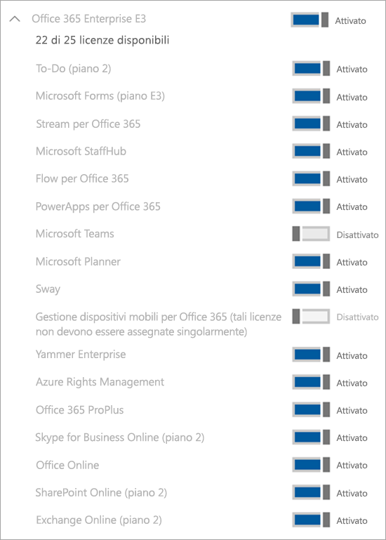

Gestire la licenza di Microsoft Teams Exploratory
=======================================================

L'esperienza Microsoft Teams Exploratory consente agli utenti dell'organizzazione che hanno Azure Active Directory (AAD) e non hanno una licenza per Teams di iniziare a usare un'esperienza esplorativa di Teams. Gli amministratori possono attivare o disattivare questa funzionalità per gli utenti nell'organizzazione. L'esperienza Teams Exploratory corrisponde a quella che in precedenza veniva chiamata [Microsoft Commercial Cloud Trial](iw-trial-teams.md).

## Che cosa include l'esperienza Teams Exploratory?

I piani di servizio inclusi nell'esperienza Teams Exploratory sono:
 - Exchange Online (Piano 1)
 - Flow per Office 365
 - Insights by MyAnalytics
 - Microsoft Forms (Piano E1)
 - Microsoft Planner
 - Microsoft Search
 - Microsoft StaffHub
 - Microsoft Stream per SKU O365 E1
 - Microsoft Teams
 - Gestione dispositivi mobili per Office 365
 - App di Office Mobile per Office 365 
 - Office Online
 - PowerApps per Office 365
 - SharePoint Online (Piano 1)
 - Sway
 - To-Do (Piano 1)
 - Whiteboard (Piano 1)
 - Yammer Enterprise

## Chi è idoneo

Gli utenti devono essere abilitati all'iscrizione di app e versioni di valutazione (nell'interfaccia di amministrazione di Microsoft 365). Per altre informazioni, vedere [Gestire l'esperienza Teams Exploratory](#manage-the-teams-exploratory-experience) più avanti in questo articolo. 

Gli utenti che non hanno una licenza di Office 365 che include Teams possono iniziare a usare l'esperienza Teams Exploratory. Ad esempio, se un utente ha Office 365 Business (che non include Teams), è idoneo per l'esperienza Teams Exploratory.

## Chi non è idoneo

L'organizzazione non è idonea per questa offerta se è un Syndication Partner Customer oppure un cliente GCC, GCC High, DoD o EDU.

## Come aderire all'esperienza Teams Exploratory

Gli utenti idonei possono aderire all'esperienza Teams Exploratory eseguendo l'accesso a Teams ([teams.microsoft.com](https://teams.microsoft.com)). Questa licenza verrà loro assegnata automaticamente e l'amministratore del tenant riceverà una notifica e-mail la prima volta che un utente dell'organizzazione inizia a usare l'esperienza Teams Exploratory.

## Gestire l'esperienza Teams Exploratory

L'esperienza Teams Exploratory deve essere avviata da singoli utenti finali e non può essere avviata per conto di dipendenti.

L'esperienza Teams Exploratory include una licenza di Exchange Online, la cui assegnazione deve essere eseguita dall'amministratore. Se l'utente non ha già una licenza di Exchange e l'amministratore non ha ancora assegnato la licenza di Exchange Online, l'utente non potrà pianificare riunioni in team e potrebbe non avere accesso ad altre funzionalità di Teams.

Gli amministratori possono impedire agli utenti finali di eseguire l'esperienza Teams Exploratory all'interno dell'organizzazione usando l'interruttore **Consenti agli utenti di installare le versioni di valutazione di app e servizi**.

### Impedire agli utenti di installare le versioni di valutazione di app e servizi

È possibile disattivare l'opzione per installare le versioni di valutazione di app e servizi per evitare che gli utenti eseguano l'esperienza Teams Exploratory.

1. Nell'[interfaccia di amministrazione di Microsoft 365](https://portal.office.com/adminportal/home), passare a **Impostazioni** > **Impostazioni**, selezionare **Servizi** e quindi selezionare **App e servizi di proprietà degli utenti**.

    

2. Deselezionare la casella di controllo **Consenti agli utenti di installare le versioni di valutazione di app e servizi**.

    

    > [!NOTE]
    > Se l'organizzazione non è idonea per l'esperienza Teams Exploratory, l'opzione **Consenti agli utenti di installare le versioni di valutazione di app e servizi** non è disponibile.

### Gestire la disponibilità per un utente con una licenza che include Teams

Un utente a cui è stata assegnata una licenza che include Teams non è idoneo per l'esperienza Teams Exploratory. Quando il piano di servizio Teams è attivato, l'utente può accedere e usare Teams. Se il piano di servizio è disabilitato, l'utente non può accedere e l'esperienza Teams Exploratory non è disponibile.

Per disattivare l'accesso a Teams:

1. Nell'interfaccia di amministrazione di Microsoft 365 selezionare **Utenti** > **Utenti attivi**.

2. Selezionare la casella accanto al nome dell'utente.

3. A destra, nella riga **Licenze di prodotto**, scegliere **Modifica**.

4. Nel riquadro **Licenze di prodotto** spostare l'interruttore nella posizione **No**.

    

### Gestire la disponibilità di Teams per gli utenti che usano già l'esperienza Teams Exploratory

Se un utente usa già l'esperienza Teams Exploratory, è possibile disattivarla rimuovendo la licenza o il piano di servizio.

Per disattivare la licenza dell'esperienza Teams Exploratory:

1. Nell'interfaccia di amministrazione di Microsoft 365 selezionare **Utenti** > **Utenti attivi**.

2. Selezionare la casella accanto al nome dell'utente.

3. A destra, nella riga **Licenze di prodotto**, scegliere **Modifica**.

4. Nel riquadro **Licenze di prodotto** spostare l'interruttore relativo alla licenza Exploratory nella posizione **No**.
   
    >[!Note]
    >L'interruttore Teams Exploratory verrà visualizzato dopo che il primo utente dell'organizzazione ha avviato l'esperienza Teams Exploratory.

### Gestire Teams per gli utenti che hanno la licenza di Teams Exploratory

Gli utenti che hanno una licenza di Teams Exploratory possono essere gestiti nello stesso modo in cui si gestiscono gli utenti con una normale licenza a pagamento. Per altre informazioni, vedere [Gestire le impostazioni di Teams per l'organizzazione](enable-features-office-365.md).

### Aggiornare gli utenti dalla licenza di Teams Exploratory

Per aggiornare gli utenti dalla licenza di Teams Exploratory, eseguire queste operazioni:

1. Acquistare un abbonamento che include Teams.

2. Rimuovere l'abbonamento di Teams Exploratory dall'utente.

3. Assegnare la licenza acquistata.

Per altre informazioni, vedere [Licenze di Office 365 per Microsoft Teams](Office-365-licensing.md).

> [!NOTE]
> Se allo scadere della licenza di Teams Exploratory non viene immediatamente eseguito l'aggiornamento a un abbonamento che include Teams, i dati dell'utente non vengono rimossi. L'utente esiste ancora in Azure Active Directory e tutti i dati all'interno di Teams vengono conservati. Una volta assegnata una nuova licenza all'utente per abilitare nuovamente le funzionalità di Teams, tutto il contenuto sarà ancora disponibile. 

## Che cosa accade alle licenze Microsoft Teams Commercial Cloud Trial legacy?

A partire dalla metà di gennaio 2020 gli utenti idonei possono iniziare a usare l'esperienza Microsoft Teams Exploratory. Tutte le licenze legacy di Teams Commercial Cloud Trial verranno convertite automaticamente alla nuova offerta prima della scadenza della versione di valutazione.

### Rimuovere una licenza di Teams Exploratory

- Se si vuole rimuovere questa licenza con PowerShell, vedere [Rimuovere le licenze dagli account utente con Office 365 PowerShell](https://docs.microsoft.com/office365/enterprise/powershell/remove-licenses-from-user-accounts-with-office-365-powershell)

- Se si vuole rimuovere questa licenza tramite il portale di amministrazione, vedere la pagina dedicata alla [rimozione delle licenze per gli utenti di Office 365 per le aziende](https://docs.microsoft.com/office365/admin/subscriptions-and-billing/remove-licenses-from-users?view=o365-worldwide)
