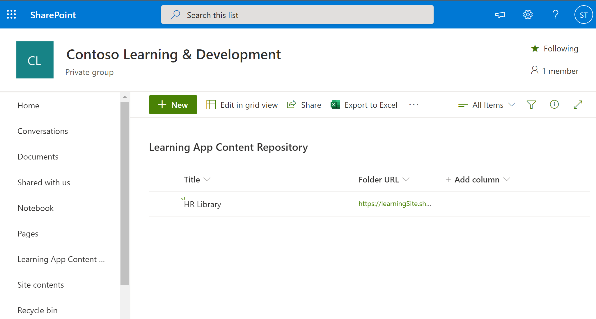

# Installare, gestire e assegnare le autorizzazioni per l'app Teams Learning (anteprima privata)

*Questo articolo contiene i contenuti preliminari per l'app Teams Learning, disponibile in anteprima privata.*

L'app Microsoft Teams Learning (anteprima privata) consente a team e persone dell'organizzazione di rendere l'apprendimento una parte naturale della giornata. L'app crea un hub centrale in Teams in cui i dipendenti possono condividere, assegnare e apprendere dalle raccolte contenuto dell'organizzazione. Gli amministratori impostano le autorizzazioni e consentono l'apprendimento delle origini contenuto per l'app. I contenuti didattici possono includere LinkedIn Learning, Microsoft Learn, formazione su Microsoft 365, contenuti dell'organizzazione archiviati in SharePoint Online e provider di terze parti supportati dall'app.

Per configurare l'app Teams Learning (anteprima privata), è necessario coinvolgere:

-   Amministratore dell'interfaccia di amministrazione di Teams
-   Amministratore dell'interfaccia di amministrazione di Microsoft 365(amministratore globale)

## Gestire l'app Teams Learning (anteprima privata) nell'interfaccia di amministrazione di Teams

L'amministratore di Teams installa l'app Teams Learning (anteprima privata) dall'App Store e applica i criteri di configurazione, gestione e autorizzazione dell'app tramite l'interfaccia di amministrazione di Teams.

### Gestire l'app Teams Learning (anteprima privata)

Per gestire le impostazioni per l'app, seguire questa procedura:

1. Nella barra di spostamento sinistra dell'interfaccia di amministrazione di Microsoft Teams, passa a **Gestisci app**  >  **di** Teams.

   

2. Nella casella **di ricerca** della pagina Gestisci app digitare *l'apprendimento* per cercare l'app Teams Learning (anteprima privata).

   

3. Nella pagina **Apprendimento:**
   1. In **Stato** selezionare **Consentito per** attivare l'app.
   2. Nella sezione **Impostazioni** app  della scheda Impostazioni passare all'interfaccia di amministrazione di Microsoft 365 per configurare le origini contenuto per la formazione.

   

4. Dopo aver gestire le  impostazioni **dell'app,** passare a Autorizzazioni e Configurare i criteri per concedere autorizzazioni ai dipendenti che devono avere accesso all'app nell'ambito della partecipazione dell'organizzazione all'anteprima privata.

> [!NOTE]
>  Se la tua organizzazione si trova nell'Anello 4.0 come parte del programma TEAMS TAP100, potrebbe essere necessario fare quanto segue per abilitare gli utenti approvati nell'Anello 3.0 ad accedere all'app Teams Learning (anteprima privata).

Come parte dell'anteprima privata, l'app Teams Learning (anteprima privata) viene rilasciata nell'anello 3.0. Se l'organizzazione fa parte dell'Anello 4.0, l'app non verrà visualizzata nell'App Store. Per testare l'app, è necessario creare criteri di autorizzazione personalizzati per le app, impostarlo su Consenti tutte le app e assegnarlo agli utenti approvati 3.0.

   

## Configurare le origini contenuto didattico nell'interfaccia di amministrazione di Microsoft 365

Gli amministratori dell'interfaccia di amministrazione di Microsoft 365 possono gestire le impostazioni relative all'app Teams Learning (anteprima privata) e possono configurare le origini dei contenuti didattici.

L'amministratore seleziona le origini di contenuto didattiche (ad esempio LinkedIn Learning o SharePoint) disponibili nell'app. L'amministratore configura quindi queste origini per assicurarsi che il contenuto sia disponibile per la ricerca e l'individuazione e possa essere esplorato dai dipendenti che usano l'app.

### Configurare le impostazioni per le origini contenuto didattiche per l'app

Questi passaggi devono essere eseguiti dall'amministratore di Microsoft 365.

1.  Nel riquadro di spostamento sinistro dell'interfaccia di amministrazione di Microsoft 365 passare a **Impostazioni**  >  **organizzazione.**

2.  Nella pagina **Impostazioni,** nella scheda & componenti **aggiuntivi,** selezionare App **di apprendimento.**

   

3.  Nel riquadro **dell'app** Apprendimento selezionare le origini di contenuto didattico da configurare per l'organizzazione e quindi scegliere **Salva.**

   

Tra tutte le fonti di apprendimento esistenti, alcune saranno abilitate per impostazione predefinita. Questi includono:

- LinkedIn Learning (contenuto gratuito)
- Microsoft Learn
- Formazione su Microsoft 365

> [!NOTE]
> Se l'organizzazione ha un abbonamento a LinkedIn Learning Standard o Pro, l'archivio dei contenuti verrà sbloccato per i dipendenti dell'organizzazione. Solo i dipendenti che dispongono dell'autorizzazione potranno usare l'intero archivio contenuto.

Potrebbe essere necessario attivare o configurare manualmente altre origini. Le origini di apprendimento non di Microsoft sono concesse in licenza separatamente tra l'organizzazione e le terze parti. È necessario verificare di aver effettuato l'accesso per la formazione per se' e per gli utenti.

Per abilitare o disabilitare un'origine contenuto didattica, selezionare la casella di controllo accanto all'origine. Se una fonte è abilitata, sarà visibile un segno di spunta.

## Configurare SharePoint come origine contenuto didattico (presto disponibile)

È possibile configurare SharePoint come origine contenuto didattica per l'app Teams Learning (anteprima privata) nell'interfaccia di amministrazione di Microsoft 365.

### Panoramica

L'amministratore fornisce un URL del sito in cui il Servizio apprendimento può creare un archivio di contenuto didattico centralizzato vuoto sotto forma di elenco strutturato di SharePoint. Questo elenco può essere usato dall'organizzazione per includere collegamenti a cartelle di SharePoint inter-aziende contenenti contenuto didattico. Gli amministratori sono responsabili della raccolta e della cura di un elenco di URL per le cartelle. Queste cartelle devono includere solo contenuti che possono essere resi disponibili nell'app Teams Learning (anteprima privata).

### Autorizzazioni

Gli URL delle cartelle possono essere raccolti da qualsiasi sito di SharePoint nell'organizzazione. È possibile eseguire ricerche in tutto il contenuto di queste cartelle, ma è possibile usare solo il contenuto per cui il singolo dipendente ha le autorizzazioni.
 
### Servizio di apprendimento

Il Servizio apprendimento usa gli URL della cartella forniti per ottenere i metadati da tutto il contenuto archiviato in tali cartelle. Entro 24 ore dalla fornitura dell'URL della cartella nel repository centralizzato, i dipendenti possono cercare e usare i contenuti dell'azienda all'interno dell'app. L'eliminazione del contenuto dall'archivio non è supportata a questo punto. Il contenuto non intenzionalmente presente può essere rimosso solo fornendo un nuovo URL del sito di SharePoint nell'interfaccia di amministrazione di Microsoft 365.

### Configurare SharePoint come origine

Questi passaggi devono essere eseguiti dall'amministratore di Microsoft 365.

1.  Nel riquadro di spostamento sinistro dell'interfaccia di amministrazione di Microsoft 365 passare a **Impostazioni.**
 
2.  Nella pagina **Impostazioni,** nella scheda & componenti **aggiuntivi,** selezionare App **di apprendimento.**

   

3.  Nel riquadro **dell'app** apprendimento fornire l'URL del sito di SharePoint in cui si vuole che l'app crei un archivio centralizzato.

   

4.  Un elenco SharePoint viene creato automaticamente all'interno del sito di SharePoint dell'organizzazione fornito. Nel riquadro di spostamento sinistro del sito di SharePoint selezionare Archivio **contenuto app di apprendimento.** 

   

 
5. Nella pagina **Archivio contenuto app** di apprendimento inserire gli URL nell'elenco di SharePoint nelle cartelle del contenuto didattico.

   1.   Selezionare **Nuovo** per visualizzare il **riquadro Nuovo** elemento. 

   
 
   2.   Nel campo **Titolo del** riquadro Nuovo **elemento** aggiungere un nome di directory a scelta. Nel campo **URL cartella** aggiungere l'URL alla cartella del contenuto didattico. Selezionare **Salva**.

   

   3. La pagina Archivio contenuti app di apprendimento viene aggiornata con i nuovi contenuti didattici.

   

 

