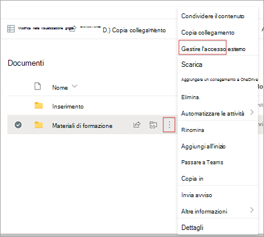
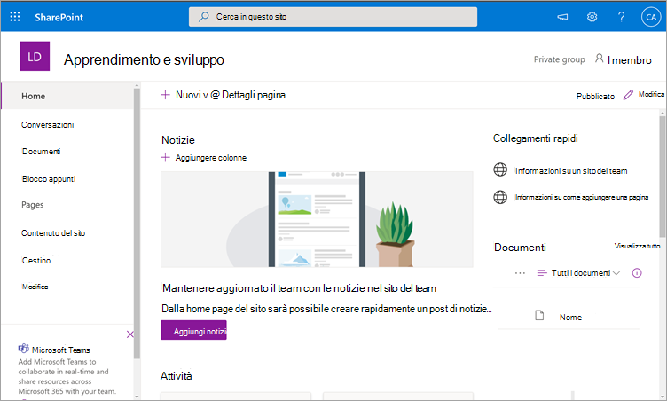
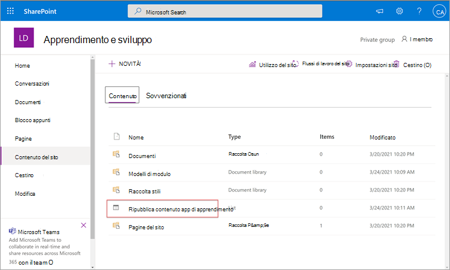
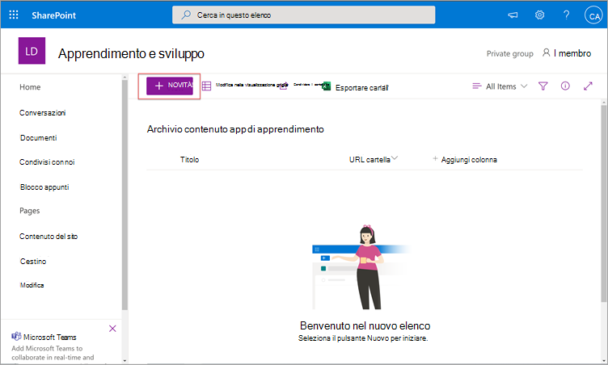
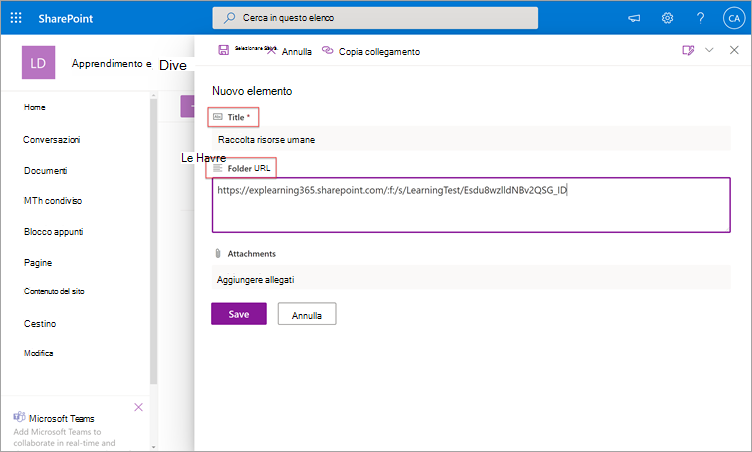
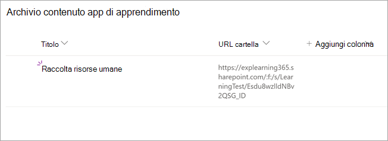
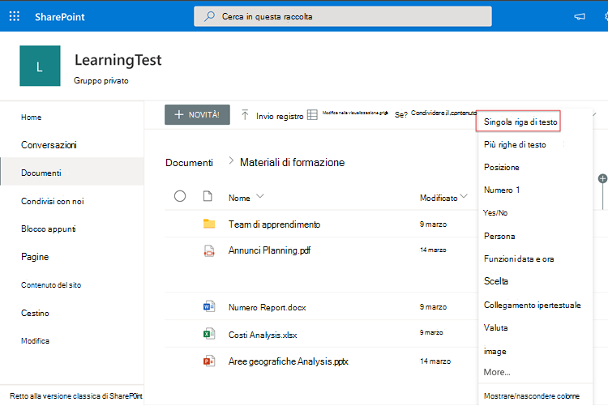
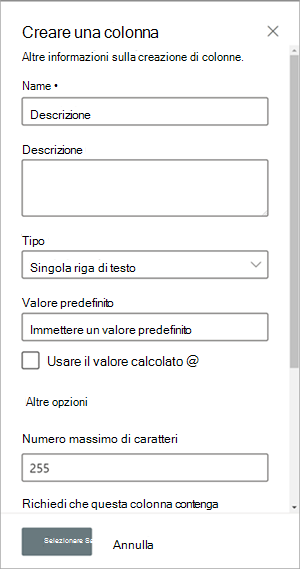
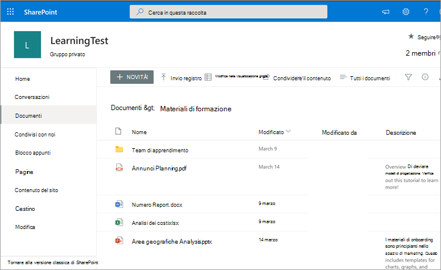

# Installare, gestire e assegnare autorizzazioni per Microsoft Viva Learning (anteprima privata)Install, manage, and assign permissions for Microsoft Viva Learning (private preview)

*Questo articolo contiene contenuto preliminare per Microsoft Viva Learning, in anteprima privata.**This article contains preliminary content for Microsoft Viva Learning, which is in private preview.*

Microsoft Viva Learning (anteprima privata) consente ai team e agli utenti dell'organizzazione di rendere l'apprendimento una parte naturale della loro giornata.Microsoft Viva Learning (private preview) empowers teams and individuals in your organization to make learning a natural part of their day. L'app crea un hub centrale in Teams in cui i dipendenti possono condividere, assegnare e imparare dalle raccolte contenuto dell'organizzazione.The app creates a central hub in Teams where employees can share, assign, and learn from content libraries across your organization.

Gli amministratori impostano le autorizzazioni e consentono l'apprendimento delle origini contenuto per Viva Learning (anteprima privata).Admins set permissions and allow learning content sources for Viva Learning (private preview). I contenuti didattici possono includere LinkedIn Learning, Microsoft Learn, formazione su Microsoft 365, contenuti dell'organizzazione archiviati in SharePoint online e provider di terze parti supportati da Viva Learning (anteprima privata).Learning content can include LinkedIn Learning, Microsoft Learn, Microsoft 365 training, your organization's own content stored in SharePoint online, and third-party providers that are supported by Viva Learning (private preview).

## Ruoli di amministratoreAdmin roles

Per configurare Viva Learning (anteprima privata), sono necessarie le autorizzazioni seguenti:To set up Viva Learning (private preview), you'll need permissions as:

- Amministratore di Microsoft TeamsMicrosoft Teams admin
- Amministratore globale di Microsoft 365 o amministratore di SharePointMicrosoft 365 global administrator or SharePoint administrator
- Amministratore della conoscenza: si tratta di un nuovo ruolo nell'interfaccia di amministrazione di Microsoft 365 che può essere assegnato a chiunque nell'organizzazione.Knowledge admin — This is a new role in the Microsoft 365 admin center that can be assigned to anyone in the organization. Questo ruolo gestisce le origini contenuto di apprendimento dell'organizzazione tramite l'interfaccia di amministrazione di Microsoft 365.This role manages the organization’s learning content sources through the Microsoft 365 admin center. 

> [!TIP]
> L'amministratore della knowledge base deve essere moderatamente tecnico e avere le credenziali di amministratore di SharePoint esistenti, preferibilmente una persona esperta nell'ambito dell'istruzione, dell'apprendimento, della formazione o dell'esperienza dei dipendenti nell'organizzazione.The knowledge admin should be moderately technical and have existing SharePoint admin credentials, preferably someone who is well-versed in the education, learning, training, or employee experience part of the organization.
 
## Gestire Viva Learning (anteprima privata) nell'interfaccia di amministrazione di TeamsManage Viva Learning (private preview) in the Teams admin center

L'amministratore di Teams installa Viva Learning (anteprima privata) dall'App Store e quindi applica i criteri di configurazione, gestione e autorizzazione tramite l'interfaccia di amministrazione di Teams.The Teams admin installs Viva Learning (private preview) from the app store, and then applies setup, manage, and permission policies through the Teams admin center.

### Gestire le impostazioni per Viva Learning (anteprima privata)Manage settings for Viva Learning (private preview)

Per eseguire queste attività, è necessario essere un amministratore nell'interfaccia di amministrazione di Teams.You must be an administrator in the Teams admin center to perform these tasks.

Per gestire le impostazioni per Viva Learning, seguire questa procedura:To manage settings for Viva Learning, follow these steps:

1. Nel riquadro di spostamento sinistro dell'interfaccia di amministrazione di Teams passare a **Gestisci app di Teams.**  >  In the left navigation of the Teams admin center, go to **Teams apps** > **Manage apps**.

   

2. Nella casella di ricerca **della** pagina Gestisci app digitare *learning* per cercare l'app Teams Learning (anteprima privata).On the **Manage apps** page, in the search box, type *learning* to search for the Teams Learning app (private preview).

   

3. Nella pagina **Apprendimento:**On the **Learning** page:
   1. In **Stato** selezionare **Consentito per** attivare l'app.Under **Status**, select **Allowed** to turn on the app.
   2. Nella sezione **Impostazioni** app  della scheda Impostazioni passare all'interfaccia di amministrazione di Microsoft 365 per configurare le origini contenuto di apprendimento.On the **Settings** tab, in the **App settings** section, go to the Microsoft 365 admin center to configure learning content sources.

   

4. Dopo gestire le impostazioni  **dell'app,** passare a Autorizzazioni e Criteri di configurazione per concedere l'autorizzazione ai dipendenti che devono avere accesso all'app come parte della partecipazione dell'organizzazione all'anteprima privata.After **Manage app** settings, go to **Permissions and Set-up policies** to grant permission to employees who should have access to the app as part of your organization's participation in the private preview.

> [!NOTE]
>  Se l'organizzazione si trova nell'Anello 4.0 come parte del programma TAP100 di Teams, potrebbe essere necessario eseguire le operazioni seguenti per consentire agli utenti approvati in Ring 3.0 di accedere a Viva Learning (anteprima privata).If your organization is in Ring 4.0 as part of Teams TAP100 program, you might need to do the following to enable approved users in Ring 3.0 to access Viva Learning (private preview).

Nell'ambito dell'anteprima privata, Viva Learning (anteprima privata) viene rilasciato nell'Anello 3.0.As part of private preview, Viva Learning (private preview) is released in Ring 3.0. Se l'organizzazione si trova nell'Anello 4.0, l'app non verrà visualizzata nell'app store.If your organization is in Ring 4.0, you won’t see the app in the app store. Per testare l'app, è necessario creare un criterio di autorizzazione app personalizzato, impostarlo su Consenti tutte le app e assegnarlo agli utenti approvati di Ring 3.0.To test the app, you need to create a custom apps permission policy, set it to **Allow all apps**, and assign it to Ring 3.0 approved users.

   

## Configurare le origini contenuto di apprendimento nell'interfaccia di amministrazione di Microsoft 365Configure learning content sources in the Microsoft 365 admin center

Gli amministratori dell'interfaccia di amministrazione di Microsoft 365, da soli o assegnando il ruolo di amministratore della conoscenza a persone selezionate nell'organizzazione, possono gestire le impostazioni relative a Viva Learning (anteprima privata) e configurare le origini contenuto di apprendimento.The administrators for the Microsoft 365 admin center—either by themselves or by assigning the knowledge admin role to selected individuals in your organization—can manage settings related to Viva Learning (private preview) and can configure the learning content sources.

L'amministratore seleziona le origini di contenuto didattiche aggiuntive, ad esempio SharePoint o le origini provider di contenuto di terze parti supportate, che saranno disponibili per gli utenti di Viva Learning (anteprima privata).The administrator selects which additional learning content sources (for example, SharePoint or supported third-party content provider sources) will be available to users of Viva Learning (private preview). L'amministratore configura quindi queste origini per assicurarsi che il contenuto sia disponibile per la ricerca e l'individuazione e possa essere esplorato dai dipendenti che usano Viva Learning (anteprima privata).The admin then configures those sources to make sure the content is available for search and discovery and can be browsed by the employees who use Viva Learning (private preview).

> [!NOTE]
>  Gli utenti a cui si accede a apprendimenti non Microsoft e LinkedIn Learning Pro in un browser o in un visualizzatore incorporato.Users sign in to non-Microsoft and LinkedIn Learning Pro learnings in a browser or embedded viewer. Questo apprendimento configurato è soggetto alle condizioni di licenza, privacy e servizio separate tra l'organizzazione e la terza parte e non le condizioni viva learning (anteprima privata).This configured learning is subject to the separate license, privacy and service terms between your organization and the third party, and not the Viva Learning (private preview) terms. Prima di selezionare questo tipo di apprendimento, verificare di avere un accordo per l'organizzazione e gli utenti.Before selecting this type of learning, verify you have an agreement in place for your organization and users.

### Assegnare il ruolo di amministratore della conoscenza [Facoltativo]Assign the knowledge admin role [Optional]

Per eseguire queste attività, è necessario essere un amministratore globale di Microsoft 365.You must be a Microsoft 365 global administrator to perform these tasks.

Per assegnare un amministratore della knowledge base per Viva Learning, seguire questa procedura:To assign a knowledge admin for Viva Learning, follow these steps:

1.  Nel riquadro di spostamento sinistro dell'interfaccia di amministrazione di Microsoft 365 passare a **Ruoli.**In the left navigation of the Microsoft 365 admin center, go to **Roles**.

2.  Nella scheda **Azure** **AD** della pagina Ruoli selezionare **Amministratore conoscenza.**On the **Roles** page, on the **Azure AD** tab, select **Knowledge admin**.
 
3.  Nella sezione **Amministratori assegnati** della pagina Amministratore della knowledge **base** selezionare **Aggiungi** e quindi aggiungere la persona scelta per il ruolo.On the **Knowledge admin** page, in the **Assigned Admins** section, select **Add**, and then add the person you choose for the role.

### Configurare le impostazioni per le origini contenuto di apprendimento per Viva Learning (anteprima privata)Configure settings for the learning content sources for Viva Learning (private preview)

Per eseguire queste attività, è necessario essere un amministratore globale di Microsoft 365 o un amministratore della knowledge base.You must be a Microsoft 365 global administrator or knowledge admin to perform these tasks.

Per configurare le impostazioni per le origini contenuto di apprendimento in Viva Learning, seguire questa procedura:To configure settings for learning content sources in Viva Learning, follow these steps:

1.  Nel riquadro di spostamento sinistro dell'interfaccia di amministrazione di Microsoft 365 passare a **Impostazioni**  >  **organizzazione**.In the left navigation of the Microsoft 365 admin center, go to **Settings** > **Org settings**.

2.  Nella scheda **Servizi della**  pagina Impostazioni organizzazione selezionare App di **apprendimento (anteprima).**On the **Org settings** page, on the **Services** tab, select **Learning app (Preview)**.

     

3.  Nel riquadro **App di apprendimento (anteprima)** selezionare le origini contenuto di apprendimento da configurare per l'organizzazione e quindi scegliere **Salva**.On the **Learning app (Preview)** panel, select the learning content sources you want to configure for the organization, and then select **Save**.

     

Tra tutte le origini di apprendimento esistenti, alcune saranno abilitate per impostazione predefinita.Among all the learning sources that exist, some will be enabled by default. Questi includono:These include:

- LinkedIn Learning (contenuto gratuito)LinkedIn Learning (free content)
- Microsoft LearnMicrosoft Learn
- Formazione su Microsoft 365Microsoft 365 Training

> [!NOTE]
> Se l'organizzazione ha un abbonamento a LinkedIn Learning Standard o Pro, il repository dei contenuti verrà sbloccato per i dipendenti dell'organizzazione.If your organization has a LinkedIn Learning Standard or Pro subscription, the content repository will be unlocked for the employees in your organization. Solo i dipendenti che hanno l'autorizzazione potranno usare l'intero archivio del contenuto.Only those employees who have permission will be able to use the entire content repository.  Potrebbe essere necessario attivare o configurare manualmente altre origini.Other sources might need to be enabled or configured manually. Le origini di apprendimento non provenienti da Microsoft sono concesse separatamente in licenza tra l'organizzazione e la terza parte.Learning sources that are not from Microsoft are separately licensed between your organization and the third party. Dovrai verificare di aver effettuato l'accesso per il loro apprendimento per te e per i tuoi utenti.You’ll need to verify you’ve signed up for their learning for you and your users.

Per abilitare o disabilitare un'origine contenuto di apprendimento, selezionare la casella di controllo accanto all'origine.To enable or disable a learning content source, select the check box next to the source. Se un'origine è abilitata, sarà visibile un segno di spunta.If a source is enabled, a check mark will be visible.

## Configurare SharePoint come origine contenuto didatticaConfigure SharePoint as a learning content source

È possibile configurare SharePoint come origine contenuto didattica per rendere disponibile il contenuto dell'organizzazione in Viva Learning (anteprima privata).You can configure SharePoint as a learning content source to make your organization's own content available in Viva Learning (private preview).

### PanoramicaOverview

L'amministratore della knowledge base (o amministratore globale) fornisce un URL del sito in cui il servizio di apprendimento può creare una posizione centralizzata vuota, ovvero l'archivio di contenuto delle app di apprendimento, sotto forma di elenco di SharePoint strutturato.The knowledge admin (or global administrator) provides a site URL to where the Learning Service can create an empty centralized location—the Learning App Content Repository—in the form of a structured SharePoint list. Questo elenco può essere usato dall'organizzazione per ospitare collegamenti a cartelle di SharePoint tra aziende che contengono contenuto didattico.This list can be used by your organization to house links to cross-company SharePoint folders that contain learning content. Gli amministratori sono responsabili della raccolta e della gestione di un elenco di URL per le cartelle.Admins are responsible for collecting and curating a list of URLs for folders. Queste cartelle devono includere solo il contenuto che può essere reso disponibile in Viva Learning (anteprima privata).These folders should only include content that can be made available in Viva Learning (private preview).

Viva Learning (anteprima privata) supporta i tipi di documento seguenti:Viva Learning (private preview) supports the following document types:

- Word, PowerPoint, Excel, PDFWord, PowerPoint, Excel, PDF
- Audio (.m4a)Audio (.m4a)
- Video (mov, mp4, avi)Video (.mov, .mp4, .avi)

Per altre informazioni, vedere la documentazione [di SharePoint Online.](https://docs.microsoft.com/sharepoint/introductionlink)For more information, see the [SharePoint Online documentation](https://docs.microsoft.com/sharepoint/introductionlink). 

### AutorizzazioniPermissions

Gli URL delle cartelle della raccolta documenti possono essere raccolti da qualsiasi sito di SharePoint nell'organizzazione.Document library folder URLs can be collected from any SharePoint site in the organization. Viva Learning (anteprima privata) segue tutte le autorizzazioni di contenuto esistenti.Viva Learning (private preview) follows all existing content permissions. Di conseguenza, solo il contenuto per cui un utente ha l'autorizzazione di accesso è disponibile per la ricerca e può essere utilizzato all'interno di Viva Learning (anteprima privata).Therefore, only content for which a user has permission to access is searchable and visable within Viva Learning (private preview). Qualsiasi contenuto all'interno di queste cartelle sarà disponibile per la ricerca, ma è possibile usare solo il contenuto per cui il singolo dipendente ha le autorizzazioni.Any content within these folders will be searchable, but only content to which the individual employee has permissions can be used.

L'eliminazione del contenuto dal repository dell'organizzazione non è attualmente supportata.Content deletion from your organization’s repository is not currently supported.

Per rimuovere il contenuto inavvicinatamente estraneo, seguire questa procedura:To remove unintentionally surfaced content, follow these steps:

1.  Per limitare l'accesso alla raccolta documenti, selezionare **l'opzione Mostra** azioni e quindi selezionare **Gestisci accesso.**To restrict access on the document library, select the **Show actions** option, and then select **Manage access**.
     
     

2.  Eliminare il documento originale all'interno della raccolta documenti.Delete the original document within the document library.

Per altre informazioni, vedere [Condivisione e autorizzazioni nell'esperienza moderna di SharePoint.](https://docs.microsoft.com/sharepoint/modern-experience-sharing-permissions)For more information, see [Sharing and permissions in the SharePoint modern experience](https://docs.microsoft.com/sharepoint/modern-experience-sharing-permissions). 

### Servizio di apprendimentoLearning Service

Il servizio di apprendimento usa gli URL delle cartelle forniti per ottenere i metadati da tutto il contenuto archiviato in tali cartelle.The Learning Service uses the provided folder URLs to get metadata from all content stored in those folders. Entro 24 ore dalla fornitura dell'URL della cartella nel repository centralizzato, i dipendenti possono cercare e usare il contenuto dell'organizzazione all'interno di Viva Learning (anteprima privata).Within 24 hours of supplying the folder URL in the centralized repository, employees can search for and use your organization’s content within Viva Learning (private preview). Tutte le modifiche al contenuto, inclusi i metadati e le autorizzazioni aggiornati, verranno applicate anche nel servizio di apprendimento entro 24 ore.All changes to content, including updated metadata and permissions, will also be applied in the Learning Service within 24 hours.

### Configurare SharePoint come origineConfigure SharePoint as a source

Per eseguire queste attività, è necessario essere un amministratore globale di Microsoft 365, un amministratore di SharePoint o un amministratore della knowledge base.You must be a Microsoft 365 global administrator, SharePoint administrator, or knowledge admin to perform these tasks.

Per configurare SharePoint come origini contenuto didattiche in Viva Learning (anteprima privata), seguire questa procedura:To configure SharePoint as a learning content sources in for Viva Learning (private preview), follow these steps:

1.  Nel riquadro di spostamento sinistro dell'interfaccia di amministrazione di Microsoft 365 passare a **Impostazioni**  >  **organizzazione**.In the left navigation of the Microsoft 365 admin center, go to **Settings** > **Org settings**.
 
2.  Nella scheda **Servizi della**  pagina Impostazioni organizzazione selezionare App di **apprendimento (anteprima).**On the **Org settings** page, on the **Services** tab, select **Learning app (Preview)**.

     

3.  Nel riquadro **App di apprendimento (anteprima),** in **SharePoint,** specificare l'URL del sito di SharePoint in cui si vuole che Viva Learning crei un archivio centralizzato.On the **Learning app (Preview)** panel, under **SharePoint**, provide the site URL to the SharePoint site where you want Viva Learning to create a centralized repository.

     

4.  Un elenco di SharePoint viene creato automaticamente all'interno del sito di SharePoint specificato.A SharePoint list is created automatically within the provided SharePoint site.

     

     Nella barra di spostamento sinistra del sito di SharePoint selezionare **Contenuto** del sito  >  **Archivio contenuto app di apprendimento**.In the left navigation of the SharePoint site, select **Site contents** > **Learning App Content Repository**. 

      

5. Nella pagina **Archivio contenuto app di** apprendimento popolare l'elenco di SharePoint con URL nelle cartelle del contenuto di apprendimento.On the **Learning App Content Repository** page, populate the SharePoint list with URLs to the learning content folders.

   1. Selezionare **Nuovo** per visualizzare il **riquadro Nuovo** elemento.Select **New** to view the **New item** panel. 

       
 
   2. Nel campo **Titolo del**  riquadro Nuovo elemento aggiungere un nome di directory a scelta.On the **New item** panel, in the **Title** field, add a directory name of your choice. Nel campo **URL cartella** aggiungere l'URL alla cartella del contenuto didattico.In the **Folder URL** field, add the URL to the learning content folder. Selezionare **Salva**.Select **Save**.

       

   3. La **pagina Archivio contenuto app di** apprendimento viene aggiornata con il nuovo contenuto di apprendimento.The **Learning App Content Repository** page is updated with the new learning content.

       

> [!NOTE]
> Per consentire un accesso più ampio al repository dei contenuti delle app di apprendimento, presto sarà disponibile un collegamento all'elenco nell'interfaccia Viva Learning (anteprima privata), in cui gli utenti possono richiedere l'accesso e, in ultima analisi, aiutare a popolare l'elenco.To allow for broader access to the Learning App Content Repository, a link to the list soon will be available in the Viva Learning (private preview) interface where users can request access and ultimately help populate the list. I proprietari dei siti e gli amministratori globali saranno tenuti a concedere l'accesso all'elenco.Site owners and global administrators will be required to grant access to the list. Access è specifico solo per l'elenco e non si applica al sito in cui è archiviato l'elenco.Access is specific to the list only and does not apply to the site where the list is stored.

### Gestione della raccolta documenti URL cartellaFolder URL document library curation

I metadati predefiniti, ad esempio la data di modifica, creati da, il nome del documento, il tipo di contenuto e il nome dell'organizzazione, vengono automaticamente estratti in Viva Learning (anteprima privata) dall'API Microsoft Graph.Default metadata (such as modified date, created by, document name, content type, and organization name) is automatically pulled into Viva Learning (private preview) by the Microsoft Graph API.
 
Per migliorare l'individuazione generale e la pertinenza della ricerca del contenuto, è consigliabile aggiungere una **colonna Descrizione.**To improve overall discovery and search relevance of the content, we recommend adding a **Description** column.

Per aggiungere una **colonna Descrizione** alla pagina della raccolta documenti, seguire questa procedura:To add a **Description** column to the document library page, follow these steps:

1.  Nella pagina **Documenti** selezionare **Aggiungi colonna.**On the **Documents** page, select **Add column**.

2. Selezionare **l'opzione Mostra** azioni e quindi selezionare **Riga di testo singola.**Select the **Show actions** option, and then select **Single line of text**.

     

3. Nel riquadro **Crea colonna** aggiungere  un nome descrittivo per la colonna nel campo Nome.On the **Create a column** panel, in the **Name** field, add a descriptive name for the column. Selezionare **Salva**.Select **Save**.

     
 
4. Nella **colonna** Descrizione  della pagina Documenti aggiungere descrizioni personalizzate per ogni elemento.On the **Documents** page, in the **Description** column, add custom descriptions for each item. Se non viene fornita alcuna descrizione, Viva Learning (anteprima privata) fornirà un messaggio predefinito che evidenzia il contenuto come contenuto della propria raccolta di SharePoint.If no description is supplied, Viva Learning (private preview) will provide a default message that highlights the content as being from your own SharePoint library. 

     
 
