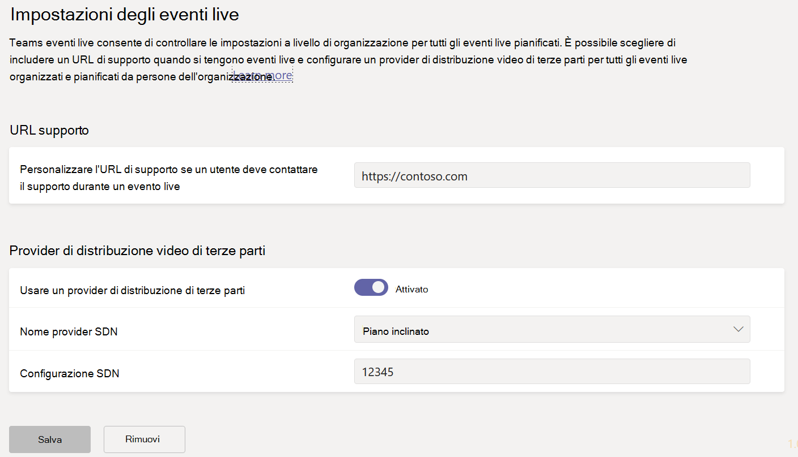
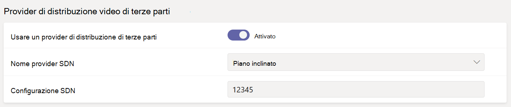

# <a name="configure-live-event-settings-in-microsoft-teams"></a>Configurare le impostazioni degli eventi live in Microsoft Teams

Usare le impostazioni degli eventi live di Teams per configurare le impostazioni per gli eventi live che si svolgono nell'organizzazione. È possibile configurare un URL di supporto e un provider di distribuzione video di terze parti. Queste impostazioni si applicano a tutti gli eventi live creati nell'organizzazione.

È possibile gestire facilmente queste impostazioni nell'interfaccia di amministrazione di Microsoft Teams. Nel riquadro di spostamento sinistro passare alle **impostazioni degli eventi** di **Riunioni** >  in tempo reale.



## <a name="set-up-event-support-url"></a>Configurare l'URL di supporto per gli eventi

Questo URL viene visualizzato per i partecipanti all'evento live. Aggiungere l'URL del supporto per l'organizzazione per consentire ai partecipanti di contattare il supporto durante un evento live.

### <a name="using-the-microsoft-teams-admin-center"></a>Utilizzo dell'interfaccia di amministrazione di Microsoft Teams.

1. Nel riquadro di spostamento sinistro passare a **Impostazioni evento riunioni** >  in tempo reale.
2. In **URL supporto** immetti l'URL di supporto della tua organizzazione.

    

### <a name="using-windows-powershell"></a>Uso di Windows PowerShell

Esegui il seguente comando:

```PowerShell
Set-CsTeamsMeetingBroadcastConfiguration -SupportURL “{your URL}”
```
Per ulteriori informazioni, vedi [Set-CsTeamsMeetingBroadcastConfiguration](/powershell/module/skype/set-csteamsmeetingbroadcastconfiguration?view=skype-ps&preserve-view=true).
## <a name="configure-a-third-party-video-distribution-provider"></a>Configurare un provider di distribuzione video di terze parti 

Se hai acquistato e configurato una soluzione SDN (Software Defined Network) o una soluzione eCDN (Enterprise Content Delivery Network) tramite un partner per la distribuzione di video Microsoft, configura il provider per gli eventi live in Teams. 

### <a name="using-the-microsoft-teams-admin-center"></a>Utilizzo dell'interfaccia di amministrazione di Microsoft Teams.

1. Nel riquadro di spostamento sinistro passare a **Impostazioni evento riunioni** >  in tempo reale.
2. In **Provider di distribuzione video di terze parti** completa quanto segue: 

    

    - **Provider di distribuzione di terze parti** Attiva questa opzione per abilitare il provider di distribuzione di video di terze parti.
    - **Nome provider SDN** Scegli il provider che stai usando.
    - **Configurazione SDN** Immettere i dettagli sulla configurazione SDN.
        
### <a name="using-windows-powershell"></a>Uso di Windows PowerShell
Ottenere l'ID licenza o il modello di API e token API dal contatto del provider, quindi eseguire una delle operazioni seguenti, a seconda del provider in uso:

**Hive** 
```PowerShell
Set-CsTeamsMeetingBroadcastConfiguration -AllowSdnProviderForBroadcastMeeting $True -SdnProviderName hive -SdnLicenseId {license ID GUID provided by Hive} -SdnApiTemplateUrl “{API template URL provided by Hive}”
```
**Kollective** 
```PowerShell
Set-CsTeamsMeetingBroadcastConfiguration -AllowSdnProviderForBroadcastMeeting $True -SdnProviderName kollective -SdnApiTemplateUrl "{API template URL provided by Kollective}" -SdnApiToken {API token GUID provided by Kollective}
```
**Riverbed** 
```PowerShell
Set-CsTeamsMeetingBroadcastConfiguration -AllowSdnProviderForBroadcastMeeting $True -SdnProviderName riverbed -SdnApiTemplateUrl "{API template URL provided by Riverbed}" -SdnApiToken {API token GUID provided by Riverbed}
```
**Ramp** 
```PowerShell
Set-CsTeamsMeetingBroadcastConfiguration -AllowSdnProviderForBroadcastMeeting $True -SdnProviderName ramp -SdnRuntimeConfiguration "{Configuration provided by RAMP}"
```
**Peer5**
```PowerShell
Set-CsTeamsMeetingBroadcastConfiguration -AllowSdnProviderForBroadcastMeeting $True -SdnProviderName peer5 -SdnLicenseId {peer5CustomerId}
```

Per ulteriori informazioni, vedi [Set-CsTeamsMeetingBroadcastConfiguration](/powershell/module/skype/set-csteamsmeetingbroadcastconfiguration?view=skype-ps&preserve-view=true).

> [!NOTE]
> Se prevedi di creare eventi live usando un'app o un dispositivo esterno, dovrai anche [configurare il provider eCDN con Microsoft Stream](/stream/network-caching). 

>[!Note]
> Il passaggio dall'utilizzo di Microsoft Stream a [ OneDrive for Business e SharePoint per le registrazioni delle riunioni ](../tmr-meeting-recording-change.md) sarà graduale. Al momento del lancio sarà possibile acconsentire esplicitamente all’esperienza. A novembre sarà necessario rifiutarla esplicitamente se si vuole continuare a usare Stream e all'inizio del 2021 sarà chiesto a tutti i clienti di usare OneDrive for Business e SharePoint per le nuove registrazioni delle riunioni.

>[!Note]
> La soluzione eCDN scelta è soggetta alle condizioni del servizio e all'informativa sulla privacy del provider di terze parti selezionate, che regoleranno l'uso della soluzione del provider di eCDN. L'uso della soluzione del provider di eCDN non sarà soggetto alle condizioni dei contratti multilicenza o dei servizi online Microsoft. Se non accetti le condizioni del provider di terze parti, non abilitare la soluzione eCDN in Microsoft Teams.

### <a name="related-topics"></a>Argomenti correlati
- [Cosa sono gli eventi live di Teams?](what-are-teams-live-events.md)
- [Pianificare gli eventi live di Teams](plan-for-teams-live-events.md)
- [Configurare gli eventi live di Teams](set-up-for-teams-live-events.md)
